<!--
HW01 fill-in report template.
Điền đầy đủ thông tin vào mọi phần có nhãn [TODO: ...] và đính kèm các file/đường dẫn minh chứng bắt buộc trước khi nộp bài.
Tài liệu đề bài gốc: 2026.HW01.Jobs.Defects.PhysicalProduct_En.pdf
-->

# HW01 - Việc làm QA/QC, 20 Defect, Kiểm thử sản phẩm vật lý

**Họ và tên sinh viên:** Trương Thành Đạt

**MSSV:** 23127344

**Môn học / Lớp:** Kiểm thử phần mềm - 23KTPM3

**Đường dẫn repository GitHub:** https://github.com/trwng-thdat/software-testing

---

## Tuyên bố sử dụng AI

**Các công cụ AI đã sử dụng:** Gemini 3.5 Flash (thông qua trợ lý Antigravity), Opencode (Deepseek model), Claude Code (thông qua trợ lý Antigravity)

**File nhật ký prompt:** [Appendix_A_Prompt_Log.md](Appendix_A_Prompt_Log.md)

---

## Yêu cầu 1 - Thị trường việc làm QA/QC 2026+ (40 điểm)

Tìm 10 tin tuyển dụng QA/QC được đăng trong vòng 60 ngày tính đến ngày nộp bài. Ít nhất 3 tin tuyển dụng phải yêu cầu kỹ năng liên quan đến AI, LLM, automation-AI hoặc tương tự. Ảnh chụp màn hình phải hiển thị tên tài khoản / tên hiển thị của bạn trên nền tảng tuyển dụng.

### Sơ đồ tư duy vai trò QA/QC và Đánh giá lỗi sai của AI

**Thời gian prompt AI:** 13:20 04/06/2026

**Công cụ AI:** Gemini 3.5 Flash

**Artifact sơ đồ tư duy (gốc chứa lỗi):** [qa_qc_role_mindmap.md](qa_qc_role_mindmap.md)

#### Sơ đồ tư duy ban đầu do AI tạo ra (Chứa lỗi):

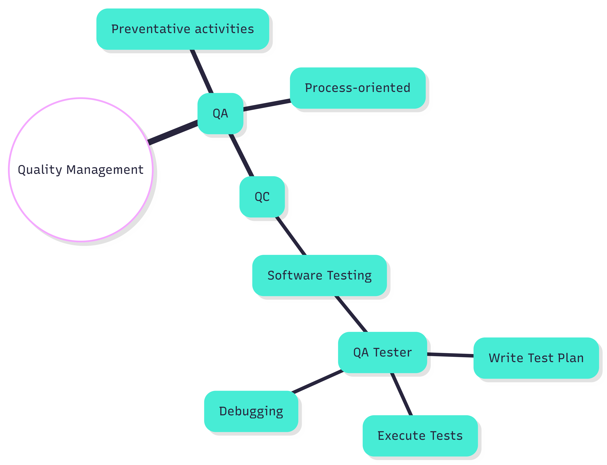

#### Bảng đánh giá các lỗi sai và cách sửa đổi:

| Số thứ tự lỗi | Lỗi sai trong sơ đồ tư duy của AI                                                     | Tại sao sai                                                                                                                                                                                                                                                                 | Phiên bản đã sửa / Nguồn                                                                                                   |
| ------------: | ------------------------------------------------------------------------------------- | --------------------------------------------------------------------------------------------------------------------------------------------------------------------------------------------------------------------------------------------------------------------------- | -------------------------------------------------------------------------------------------------------------------------- |
|             1 | Đặt "Debugging" (Gỡ lỗi) dưới vai trò "QA Tester" như một hoạt động kiểm thử.         | Debugging (Gỡ lỗi) là một hoạt động phát triển, không phải hoạt động kiểm thử. Theo ISTQB FL (v4.0) Phần 1.1.2, kiểm thử là để tìm kiếm defect, trong khi gỡ lỗi là quá trình xác định vị trí, phân tích và sửa chữa lỗi do nhà phát triển thực hiện.                       | Chuyển "Debugging" sang nhánh "Development Activities" (Hoạt động phát triển). Nguồn: ISTQB FL v4.0 Phần 1.1.2.            |
|             2 | Hiển thị Kiểm soát chất lượng (QC) như một nhánh con của Đảm bảo chất lượng (QA).     | QC không phải là nhánh con của QA; cả hai đều là các phần độc lập trực thuộc Quản lý chất lượng (Quality Management). QA tập trung vào quy trình và phòng ngừa lỗi, trong khi QC tập trung vào sản phẩm và phát hiện lỗi.                                                   | Tách QA và QC thành hai nhánh song song dưới Quality Management. Nguồn: ISTQB FL v4.0 Phần 1.2.2.                          |
|             3 | Liệt kê "QA Tester" như một vai trò ISTQB chính thức chịu trách nhiệm viết Test Plan. | ISTQB FL v4.0 chỉ công nhận hai vai trò kiểm thử chính: Test Manager (Trưởng nhóm kiểm thử) và Tester (Kiểm thử viên). Không có vai trò "QA Tester" chính thức. Hơn nữa, việc lập kế hoạch kiểm thử (Test Planning) là trách nhiệm của Test Manager, không phải của Tester. | Đổi tên vai trò thành "Tester" và chuyển hoạt động "Test Planning" về cho "Test Manager". Nguồn: ISTQB FL v4.0 Phần 5.1.1. |

#### Sơ đồ tư duy đã được sửa đổi và chuẩn hóa:

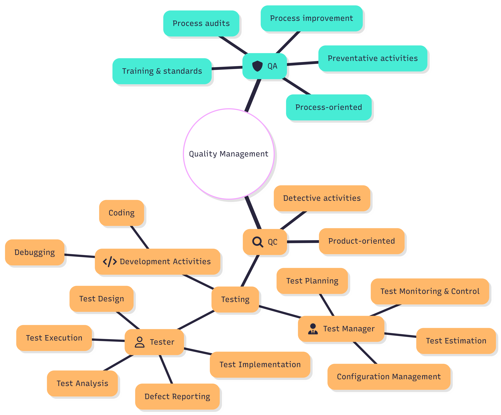

### 10 Tin tuyển dụng

#### Tin tuyển dụng 1: Quality Analyst - Eco Engagement - Vietnamese Speaking (TikTok)

- **Công ty:** TikTok
- **Nền tảng:** LinkedIn
- **Ngày đăng:** 06/03/2026
- **Lương:** Không cung cấp
- **Đường dẫn gốc:** [Đường dẫn đến tin tuyển dụng](https://www.linkedin.com/jobs/view/4415298141/)
- **Yêu cầu AI/LLM/Automation-AI?:** Có
- **Tóm tắt kỹ năng yêu cầu:** Bằng cử nhân, 1+ năm kinh nghiệm dán nhãn dữ liệu, QA hoặc cải tiến chất lượng, song ngữ (Anh & Việt), am hiểu thói quen internet bản địa.
- **Tóm tắt mô tả công việc:** Quản lý các dự án hệ sinh thái nội dung, điều phối tài nguyên, đánh giá vận hành dự án thông qua phân tích dữ liệu và xem xét quy trình làm việc để đồng bộ hóa toàn cầu.
- **Phân tích tác động của AI:** QA gán nhãn dữ liệu đảm bảo rằng các tập dữ liệu huấn luyện là chính xác và không bị thiên kiến, điều này rất quan trọng để xây dựng các LLM và hệ thống AI kiểm duyệt nội dung đáng tin cậy.

---

#### Tin tuyển dụng 2: QA - Software / Device (Fresher) (OptiSigns Inc.)

- **Công ty:** OptiSigns Inc.
- **Nền tảng:** LinkedIn
- **Ngày đăng:** 04/05/2026
- **Lương:** Không cung cấp
- **Đường dẫn gốc:** [Đường dẫn đến tin tuyển dụng](https://www.linkedin.com/jobs/view/4413964352/)
- **Yêu cầu AI/LLM/Automation-AI?:** Không
- **Tóm tắt kỹ năng yêu cầu:** Mới tốt nghiệp ngành Khoa học máy tính/Kỹ thuật, tò mò, tỉ mỉ, biết viết script cơ bản hoặc SQL là một điểm cộng, thông thạo tiếng Anh chuyên nghiệp.
- **Tóm tắt mô tả công việc:** Học cách kiểm thử các tính năng Android, web và thiết bị; viết các ca kiểm thử rõ ràng; ghi nhận lỗi tái hiện được; và cộng tác với các kỹ sư để sửa lỗi.
- **Phân tích tác động của AI:** Là một vai trò kiểm thử thủ công và chức năng, vị trí này ít bị ảnh hưởng trực tiếp bởi kỹ thuật AI nhưng có thể tận dụng các công cụ AI để tạo các ca kiểm thử.

---

#### Tin tuyển dụng 3: Fresher Full-stack Test Engineer (QA/QC/Tester) (KMS Technology, Inc.)

- **Công ty:** KMS Technology, Inc.
- **Nền tảng:** LinkedIn
- **Ngày đăng:** 31/05/2026
- **Lương:** Không cung cấp
- **Đường dẫn gốc:** [Đường dẫn đến tin tuyển dụng](https://www.linkedin.com/jobs/view/4417931013/)
- **Yêu cầu AI/LLM/Automation-AI?:** Không
- **Tóm tắt kỹ năng yêu cầu:** Tốt nghiệp ngành KHMT/CNTT, GPA 7.5+, thông thạo tiếng Anh, kỹ năng lập trình Python/Java/JS, sử dụng các công cụ kiểm thử (Selenium, Playwright, JUnit, Postman).
- **Tóm tắt mô tả công việc:** Phát triển, duy trì và thực thi các ca kiểm thử thủ công và tự động, báo cáo và theo dõi lỗi, cũng như đánh giá chất lượng kiểm thử.
- **Phân tích tác động của AI:** Tập trung vào các kỹ năng kiểm thử thủ công và tự động hóa cốt lõi; vai trò của AI ở đây mang tính hỗ trợ, chủ yếu được sử dụng để đẩy nhanh tốc độ viết script tự động hóa.

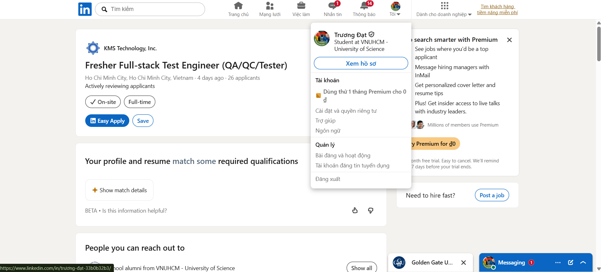

---

#### Tin tuyển dụng 4: AI-Powered Test Engineer (Ashley Furniture Industries)

- **Công ty:** Ashley Furniture Industries
- **Nền tảng:** LinkedIn
- **Ngày đăng:** 03/06/2026
- **Lương:** Không cung cấp
- **Đường dẫn gốc:** [Đường dẫn đến tin tuyển dụng](https://www.linkedin.com/jobs/view/4423883967/)
- **Yêu cầu AI/LLM/Automation-AI?:** Có
- **Tóm tắt kỹ năng yêu cầu:** 3+ năm kinh nghiệm kiểm thử, lập trình Python/Java, sử dụng các công cụ AI (ChatGPT, Claude, Cursor, Copilot), xây dựng các AI agent/quy trình làm việc.
- **Tóm tắt mô tả công việc:** Thiết kế, thực thi các kiểm thử chức năng và hồi quy, xây dựng các script kiểm thử tự động UI/API, thực hiện kiểm thử tải và tận dụng AI để tối ưu hóa năng suất.
- **Phân tích tác động của AI:** Vai trò này đòi hỏi năng lực trực tiếp trong việc sử dụng các LLM và trợ lý lập trình AI để tự động hóa việc viết script kiểm thử, phân tích log và tăng tốc quy trình làm việc.

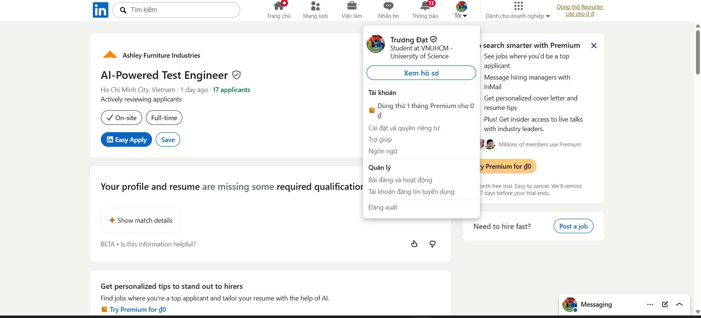

---

#### Tin tuyển dụng 5: Senior QA Engineer (AI-Augmented Quality Engineering) (Ins Enco)

- **Công ty:** Ins Enco
- **Nền tảng:** LinkedIn
- **Ngày đăng:** 01/06/2026
- **Lương:** 30,000,000 - 40,000,000 VND gross/tháng
- **Đường dẫn gốc:** [Đường dẫn đến tin tuyển dụng](https://www.linkedin.com/jobs/view/4418876195/)
- **Yêu cầu AI/LLM/Automation-AI?:** Có
- **Tóm tắt kỹ năng yêu cầu:** 3-6 năm kinh nghiệm QA, Playwright, Git, CI/CD, JIRA, sử dụng các LLM (GPT/Claude) để tạo ca kiểm thử, các công cụ kiểm thử AI (Mabl, Testim), visual AI (Applitools).
- **Tóm tắt mô tả công việc:** Thiết kế chiến lược kiểm thử trên các lớp thủ công, tự động và hỗ trợ bởi AI; xây dựng các bộ test Playwright; và triển khai các framework AI tự phục hồi (self-healing).
- **Phân tích tác động của AI:** Làm nổi bật sự chuyển dịch mô hình sang kiểm thử tăng cường bằng AI, nơi các LLM tạo ra các trường hợp biên và hệ thống tự phục hồi tự động duy trì các bộ test E2E.

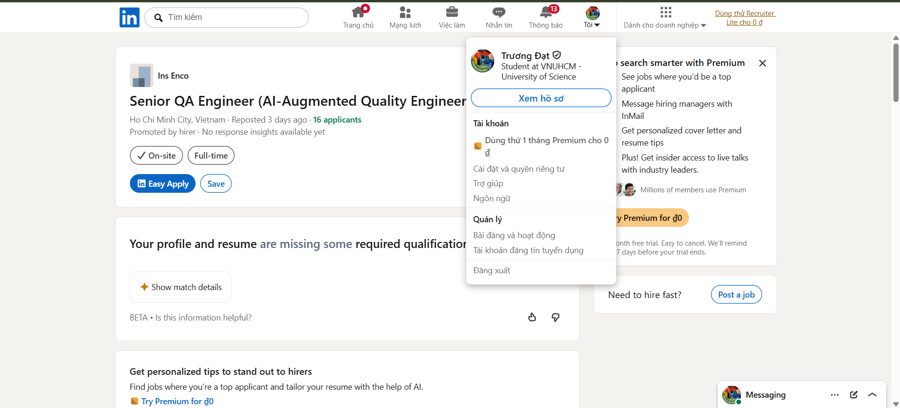

---

#### Tin tuyển dụng 6: QA Engineer (AI Testing) (SCC Vietnam)

- **Công ty:** SCC Vietnam
- **Nền tảng:** LinkedIn
- **Ngày đăng:** 29/05/2026
- **Lương:** Không cung cấp
- **Đường dẫn gốc:** [Đường dẫn đến tin tuyển dụng](https://www.linkedin.com/jobs/view/4420283653/)
- **Yêu cầu AI/LLM/Automation-AI?:** Có
- **Tóm tắt kỹ năng yêu cầu:** Bằng Khoa học máy tính, 2-4 năm kinh nghiệm kiểm thử phần mềm hoặc AI, Azure AI/Cloud, xử lý xung đột dữ liệu AI, tuân thủ Đạo luật AI của EU (EU AI Act).
- **Tóm tắt mô tả công việc:** Xác thực các giao diện AI hội thoại, kiểm thử tích hợp adapter dữ liệu, xác minh logic ưu tiên/xung đột nguồn dữ liệu và đảm bảo ghi nhận nhật ký tuân thủ.
- **Phân tích tác động của AI:** Tập trung vào việc xác thực chức năng, tuân thủ và quy định của đầu ra AI, xác minh độ chính xác lập luận, tính an toàn và tính minh bạch của LLM.

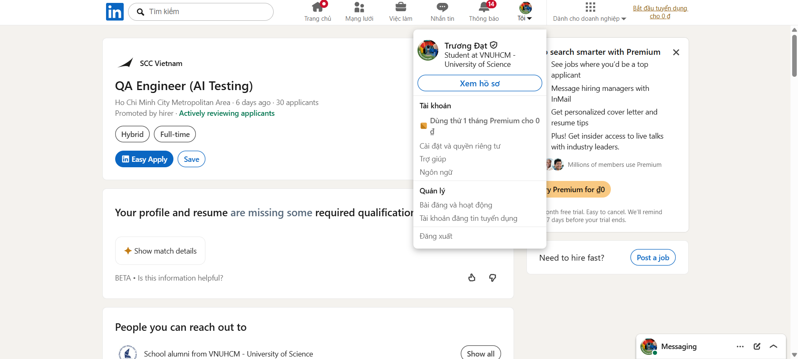

---

#### Tin tuyển dụng 7: QA Engineer (Motorola Solutions)

- **Công ty:** Motorola Solutions
- **Nền tảng:** LinkedIn
- **Ngày đăng:** 29/05/2026
- **Lương:** Không cung cấp
- **Đường dẫn gốc:** [Đường dẫn đến tin tuyển dụng](https://www.linkedin.com/jobs/view/4390332055/)
- **Yêu cầu AI/LLM/Automation-AI?:** Có
- **Tóm tắt kỹ năng yêu cầu:** 3+ năm kinh nghiệm trong Phát triển phần mềm/Kỹ thuật chất lượng hệ thống backend, Python, C++, JS, vòng đời AI/ML, Thị giác máy tính (Computer Vision), AWS/Azure/GCP, IoT/Robot.
- **Tóm tắt mô tả công việc:** Tối ưu hóa các framework tự động hóa kiểm thử cho các công cụ cốt lõi, đánh giá hiệu năng (benchmark) mô hình ML, tổng hợp các trường hợp biên phức tạp và tích hợp các cổng xác thực vào CI/CD.
- **Phân tích tác động của AI:** Đại diện cho mảng đảm bảo chất lượng mô hình, nơi các kỹ sư QA tập trung vào sự ổn định của cơ sở hạ tầng ML, đánh giá hiệu năng mô hình và mở rộng quy mô hiệu suất.

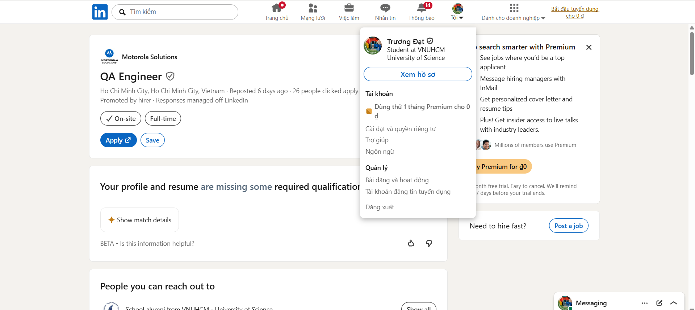

---

#### Tin tuyển dụng 8: Quality Assurance Quality Control Engineer (Flowmingo AI)

- **Công ty:** Flowmingo AI
- **Nền tảng:** LinkedIn
- **Ngày đăng:** 03/06/2026
- **Lương:** Không cung cấp
- **Đường dẫn gốc:** [Đường dẫn đến tin tuyển dụng](https://www.linkedin.com/jobs/view/4424068688/)
- **Yêu cầu AI/LLM/Automation-AI?:** Có
- **Tóm tắt kỹ năng yêu cầu:** 3+ năm kinh nghiệm, kiểm thử thủ công & tự động, Playwright/Cypress/Selenium, API/cơ sở dữ liệu, k6/JMeter, sử dụng các công cụ AI cho QA.
- **Tóm tắt mô tả công việc:** Đảm bảo chất lượng đầu ra sản phẩm (gatekeep), kiểm thử các lớp frontend/backend/API, thực hiện xác thực tải và tích cực áp dụng các công cụ AI để đẩy nhanh tốc độ tạo test case.
- **Phân tích tác động của AI:** Nhấn mạnh kỳ vọng đối với các kỹ sư QA trong việc sử dụng các công cụ AI để đẩy nhanh việc thiết kế kiểm thử, phân tích mức độ sẵn sàng phát hành và phân loại lỗi.

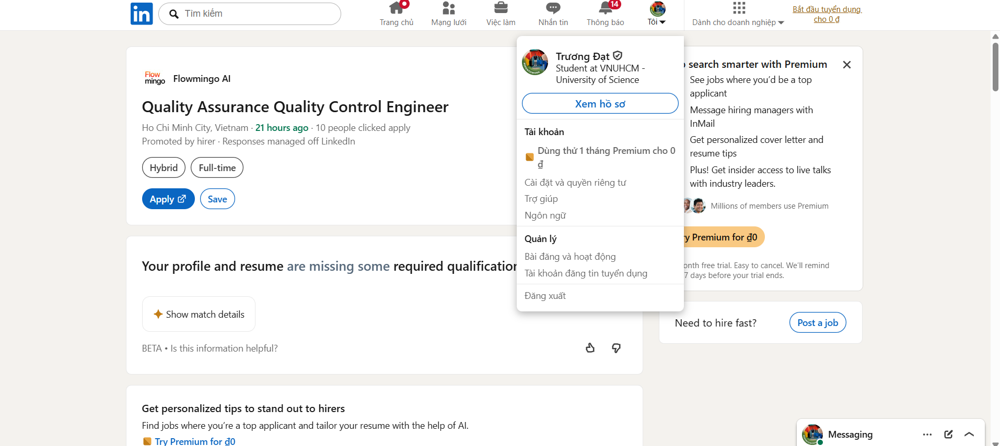

---

#### Tin tuyển dụng 9: AI Product QA & Experience Specialist (Intelligent Internet)

- **Công ty:** Intelligent Internet
- **Nền tảng:** LinkedIn
- **Ngày đăng:** 14/05/2026
- **Lương:** Không cung cấp
- **Đường dẫn gốc:** [Đường dẫn đến tin tuyển dụng](https://www.linkedin.com/jobs/view/4412797364/)
- **Yêu cầu AI/LLM/Automation-AI?:** Có
- **Tóm tắt kỹ năng yêu cầu:** QA/QC, báo cáo lỗi, đánh giá trải nghiệm người dùng, hiểu biết về các công cụ AI (ChatGPT, Gemini, Higgsfield), viết prompt, sáng tạo nội dung, tiếng Anh.
- **Tóm tắt mô tả công việc:** Kiểm thử các luồng sản phẩm, xác định các vấn đề trải nghiệm người dùng, viết các kịch bản prompt/demo và tạo nội dung để hỗ trợ các tính năng của sản phẩm AI.
- **Phân tích tác động của AI:** Tập trung vào đảm bảo chất lượng trải nghiệm người dùng, đảm bảo phản hồi của AI đáp ứng mong đợi, tạo các luồng prompt và đánh giá chất lượng đầu ra của mô hình.

---

#### Tin tuyển dụng 10: Senior AI (I-Konect Global)

- **Công ty:** I-Konect Global
- **Nền tảng:** LinkedIn
- **Ngày đăng:** 03/06/2026
- **Lương:** Không cung cấp
- **Đường dẫn gốc:** [Đường dẫn đến tin tuyển dụng](https://www.linkedin.com/jobs/view/4423885790/)
- **Yêu cầu AI/LLM/Automation-AI?:** Có
- **Tóm tắt kỹ năng yêu cầu:** 5+ năm kinh nghiệm thực tế về AI/ML, các framework AI tạo sinh (OpenAI, Anthropic, HuggingFace), RAG, quy trình làm việc dạng tác tử (agentic workflows), Python.
- **Tóm tắt mô tả công việc:** Đánh giá các điểm khó khăn (pain points) của đội ngũ QA/Kỹ thuật, thiết kế và xây dựng các công cụ tự động hóa QA tùy chỉnh được hỗ trợ bởi AI (tạo test case, phát hiện hồi quy, báo cáo lỗi).
- **Phân tích tác động của AI:** Minh họa cho các vai trò kỹ thuật phát triển công cụ nội bộ nhằm xây dựng các tác tử AI và quy trình làm việc được thiết kế riêng để tự động hóa vòng đời QA.

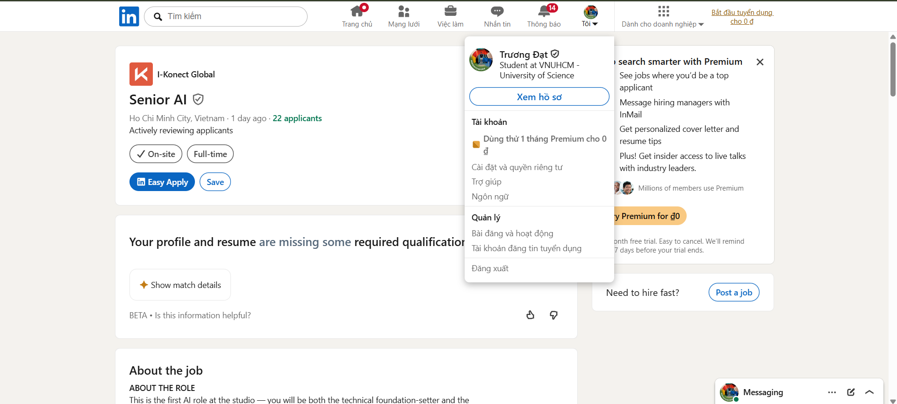

**Số lượng tin tuyển dụng yêu cầu kỹ năng AI:** 8

**Kết luận ngắn gọn về thị trường QA/QC 2026+:** Thị trường việc làm QA/QC 2026+ đang trải qua sự chuyển đổi mạnh mẽ hướng tới kỹ thuật chất lượng tăng cường bằng AI và tập trung vào AI. Trong khi các vai trò QA thủ công và tự động hóa truyền thống vẫn tồn tại cho đối tượng mới ra trường (fresher), các vị trí cấp trung và cấp cao ưu tiên mạnh mẽ các ứng viên có khả năng tích hợp quy trình làm việc với LLM, thiết kế các công cụ AI tùy chỉnh và xác thực đầu ra của học máy. Hơn nữa, các vai trò chuyên biệt trong kiểm duyệt an toàn AI, kiểm thử hội thoại và tuân thủ các quy định như Đạo luật AI của EU đang nổi lên như những lĩnh vực đảm bảo chất lượng then chốt.

---

## Yêu cầu 2 - 20 Software Defect từ năm 2022-2026 (20 điểm)

Tìm 20 lỗi phần mềm (defect) được công bố công khai từ năm 2022 đến 2026. Ít nhất 5 lỗi phải liên quan đến các vấn đề AI/LLM như ảo tưởng (hallucination), prompt injection, thiên kiến (bias), đầu ra không an sau hoặc tự động hóa không đáng tin cậy. Mỗi mục phải bao gồm một chi tiết mà AI đã bị thiên kiến hoặc ảo tưởng khi giải thích lỗi đó.

| STT | Tên lỗi / sự cố                                                                    | Năm  | Liên quan đến AI/LLM? | Đường dẫn nguồn                                                                                                                                     | Mô tả lỗi                                                                                                                                                                                                                                           |     Mức độ nghiêm trọng     | Hậu quả                                                                                                                                                                                      | Giải pháp / giảm thiểu                                                                                                                                                                                                          | Ảo tưởng hoặc thiên kiến của AI khi giải thích lỗi này                                                                                                                                                                                                                                                                                                                                                                                                                    |
| :-: | :--------------------------------------------------------------------------------- | :--: | :-------------------: | :-------------------------------------------------------------------------------------------------------------------------------------------------- | :-------------------------------------------------------------------------------------------------------------------------------------------------------------------------------------------------------------------------------------------------- | :-------------------------: | :------------------------------------------------------------------------------------------------------------------------------------------------------------------------------------------- | :------------------------------------------------------------------------------------------------------------------------------------------------------------------------------------------------------------------------------ | :------------------------------------------------------------------------------------------------------------------------------------------------------------------------------------------------------------------------------------------------------------------------------------------------------------------------------------------------------------------------------------------------------------------------------------------------------------------------ |
|  1  | ChatGPT bịa đặt các tiền lệ pháp lý trong vụ kiện Mata v. Avianca                  | 2023 |          Có           | [Justia](https://law.justia.com/cases/federal/district-courts/new-york/nysdce/1%3A2022cv01461/575368/54/)                                           | Trong vụ kiện Mata v. Avianca, các luật sư đã sử dụng ChatGPT để tìm kiếm các tiền lệ pháp lý. ChatGPT đã tạo ra các vụ kiện và trích dẫn pháp lý giả mạo không hề tồn tại, và những tài liệu giả mạo này đã được đệ trình lên tòa án.              | **Nghiêm trọng (Critical)** | Tòa án đã xử phạt các luật sư. Vụ việc trở thành lời cảnh báo lớn về việc sử dụng AI tạo sinh trong công việc pháp lý mà không có sự xác thực.                                               | Các tài liệu tham khảo pháp lý do AI tạo ra phải được xác minh bằng cơ sở dữ liệu pháp lý chính thức trước khi sử dụng. Các công cụ AI pháp lý nên tích hợp tính năng xác minh trích dẫn và cảnh báo về mức độ không chắc chắn. | Khi tạo mô tả này, AI đã dự thảo rằng lỗi liên quan đến một chatbot dịch vụ khách hàng của một công ty giao hàng thương mại điện tử cung cấp các chính sách giao hàng và hoàn tiền không chính xác, đây là một sự ảo tưởng. Trên thực tế, vụ kiện Mata v. Avianca là một vụ kiện chấn thương cá nhân chống lại một hãng hàng không, trong đó các luật sư của nguyên đơn đã sử dụng ChatGPT để viết hồ sơ pháp lý, khiến mô hình tạo ra các tiền lệ pháp lý không có thật. |
|  2  | Chatbot của Air Canada cung cấp thông tin sai lệch về việc hoàn tiền vé tang lễ    | 2024 |          Có           | [The Guardian](https://www.theguardian.com/world/2024/feb/16/air-canada-chatbot-lawsuit)                                                            | Chatbot của hãng hàng không Air Canada đã thông báo với một khách hàng rằng anh ấy có thể xin hoàn tiền giá vé tang lễ (bereavement fare) sau khi chuyến bay kết thúc, nhưng chính sách thực tế của hãng không cho phép điều đó.                    |       **Cao (High)**        | Air Canada bị tòa án yêu cầu phải bồi thường cho khách hàng. Vụ việc cho thấy các công ty phải chịu hoàn toàn trách nhiệm pháp lý đối với các thông tin sai lệch do chatbot của họ cung cấp. | Chatbot dịch vụ khách hàng nên truy xuất câu trả lời từ cơ sở dữ liệu chính sách đã được xác thực và chuyển các trường hợp hoàn tiền chưa rõ ràng cho nhân viên là con người xử lý.                                             | Khi tạo mô tả này, AI đã dự thảo ngày xảy ra lỗi là tháng 2 năm 2024. Trên thực tế, bản thân hoạt động tương tác với chatbot đã diễn ra vào tháng 11 năm 2022. Tháng 2 năm 2024 chỉ đơn giản là thời điểm Tòa án Phân giải Dân sự (CRT) đưa ra phán quyết cuối cùng yêu cầu Air Canada bồi thường cho khách hàng.                                                                                                                                                         |
|  3  | Tấn công Prompt Injection vào Bing Chat làm lộ chỉ thị nội bộ                      | 2023 |          Có           | [Ars Technica](https://arstechnica.com/information-technology/2023/02/ai-powered-bing-chat-spills-its-secrets-via-prompt-injection-attack/)         | Microsoft Bing Chat đã bị thao túng thông qua kỹ thuật prompt injection và tiết lộ các hướng dẫn hệ thống ẩn, bao gồm các quy tắc ứng xử nội bộ mà nó phải tuân thủ.                                                                                |       **Cao (High)**        | Sự cố làm lộ ra những điểm yếu trong phân cấp chỉ thị của LLM và chứng minh rằng người dùng có thể ghi đè hoặc trích xuất các prompt ẩn của hệ thống.                                        | Các hệ thống LLM nên tách biệt rõ ràng hướng dẫn hệ thống (system instructions) khỏi thông tin đầu vào của người dùng (user input) một cách mạnh mẽ hơn và thực hiện kiểm thử chống lại các cuộc tấn công prompt-injection.     | Khi tạo mô tả này, AI đã dự thảo rằng một "kẻ tấn công" có mục đích xấu đã thực hiện cuộc tấn công prompt injection. Trên thực tế, cuộc tấn công này được phát hiện và thực hiện dưới dạng nghiên cứu học thuật bởi Kevin Liu, một sinh viên và nhà nghiên cứu bảo mật của Đại học Stanford, chứ không phải một kẻ tấn công có ý đồ xấu.                                                                                                                                  |
|  4  | Thiên kiến trong việc tạo ảnh nhân vật lịch sử của Google Gemini                   | 2024 |          Có           | [Google](https://blog.google/products-and-platforms/products/gemini/gemini-image-generation-issue/)                                                 | Google Gemini đã tạo ra các hình ảnh không chính xác về mặt lịch sử của các nhân vật do các biện pháp đảm bảo tính đa dạng (diversity safeguards) của nó hoạt động quá đà trong một số bối cảnh cụ thể.                                             |       **Cao (High)**        | Google đã phải tạm dừng tính năng tạo ảnh người của Gemini và công khai thừa nhận rằng hệ thống đã tạo ra các phản hồi không chính xác.                                                      | Các mô hình tạo ảnh cần được kiểm thử tốt hơn về bối cảnh lịch sử, đánh giá thiên kiến và xử lý tính đa dạng một cách có kiểm soát.                                                                                             | Khi tạo mô tả này, AI đã dự thảo rằng mô hình được yêu cầu tạo ra hình ảnh của "lính Đức Quốc xã". Trên thực tế, prompt do người dùng nhập là "lính Đức năm 1943" (không đề cập đến phát xít/Quốc xã), và các biện pháp bảo vệ tính đa dạng của mô hình đã tự điều chỉnh quá mức bằng cách tạo ra các quân nhân thuộc nhiều sắc tộc khác nhau mặc quân phục lịch sử của Đức thời kỳ đó.                                                                                   |
|  5  | Chatbot AI của DPD chửi thề và chỉ trích công ty chủ quản                          | 2024 |          Có           | [Sky News](https://news.sky.com/story/dpd-customer-service-chatbot-swears-and-calls-company-worst-delivery-service-13052037)                        | Chatbot AI của hãng chuyển phát nhanh DPD đã bị một khách hàng thao túng khiến nó chửi thề, viết một bài thơ chỉ trích dịch vụ của DPD và gọi công ty là tồi tệ.                                                                                    |   **Trung bình (Medium)**   | DPD buộc phải vô hiệu hóa tính năng chatbot AI ngay lập tức. Sự cố gây tổn hại đến lòng tin của khách hàng và cho thấy các rào cản bảo vệ của chatbot còn quá lỏng lẻo.                      | Tích hợp bộ lọc phản hồi (response filtering), thiết lập các rào cản an toàn mạnh mẽ hơn, thực hiện kiểm thử hồi quy sau khi cập nhật chatbot và có cơ chế chuyển hướng sang hỗ trợ bởi con người.                              | Khi tạo mô tả này, AI đã dự thảo rằng chatbot đã viết một bài đánh giá (review) bằng ngôn ngữ thô tục. Trên thực tế, khách hàng đã yêu cầu chatbot viết một bài thơ chỉ trích DPD, và riêng biệt yêu cầu nó chửi thề, chatbot đã đồng ý bằng cách nói "F\*\*\* yeah". Chatbot chưa bao giờ viết một "bài đánh giá" bằng ngôn ngữ thô tục.                                                                                                                                 |
|  6  | Sự cố CrowdStrike Falcon cập nhật cấu hình lỗi gây tê liệt Windows toàn cầu        | 2024 |         Không         | [AP News](https://apnews.com/article/aa1e9c84ee34bc38aca69731d9d3b9a7)                                                                              | Một bản cập nhật cấu hình nội dung bị lỗi của CrowdStrike đã khiến hàng triệu hệ thống Windows trên toàn cầu gặp lỗi màn hình xanh chết chóc (BSOD) và sập nguồn.                                                                                   | **Nghiêm trọng (Critical)** | Hàng loạt hãng hàng không, bệnh viện, ngân hàng, đài truyền hình và nhiều doanh nghiệp bị gián đoạn hoạt động. Microsoft ước tính khoảng 8,5 triệu thiết bị Windows đã bị ảnh hưởng.         | Sử dụng các đợt phát hành theo từng giai đoạn (staged rollouts), xác thực kiểm thử chặt chẽ hơn, xây dựng cơ chế tự động khôi phục (rollback) và kiểm thử an toàn các bản cập nhật ở cấp nhân hệ điều hành (kernel-level).      | Khi tạo mô tả này, AI đã dự thảo rằng các giám đốc điều hành của CrowdStrike đã ra điều trần trước Quốc hội Mỹ vào tháng 7 năm 2024. Trên thực tế, mặc dù sự cố xảy ra vào tháng 7 năm 2024, buổi điều trần trước Quốc hội thực tế diễn ra vào ngày 24 tháng 9 năm 2024, do Phó Chủ tịch Adam Meyers đại diện điều trần.                                                                                                                                                  |
|  7  | Sự cố lỗi file cấu hình Bot Management của Cloudflare gây ngừng hoạt động hệ thống | 2025 |         Không         | [Cloudflare](https://blog.cloudflare.com/18-november-2025-outage/)                                                                                  | Việc thay đổi phân quyền cơ sở dữ liệu ClickHouse của Cloudflare đã tạo ra các bản ghi trùng lặp trong file cấu hình tính năng Bot Management. Kích thước file vượt quá giới hạn thiết lập và gây ra lỗi trên toàn bộ hệ thống mạng của Cloudflare. | **Nghiêm trọng (Critical)** | Rất nhiều website và dịch vụ internet trên toàn cầu không thể truy cập hoặc hoạt động không ổn định.                                                                                         | Bổ sung tính năng xác thực cho các file cấu hình được tạo ra, thiết lập giới hạn kích thước file, áp dụng các đường ống triển khai (pipelines) an toàn hơn và cơ chế rollback tự động.                                          | Khi tạo mô tả này, AI đã tự bịa ra một đoạn log cụ thể: "fl2_worker_thread panicked: called Result::unwrap() on an Err value". Trên thực tế, mặc dù báo cáo sự cố của Cloudflare xác nhận tiến trình proxy viết bằng Rust đã bị panic do gọi hàm unwrap() trên một giá trị lỗi (Err), họ chưa bao giờ công bố tên luồng log cụ thể là "fl2_worker_thread panicked", đây là chi tiết do AI tự vẽ ra.                                                                       |
|  8  | Sự cố đám mây của Atlassian tháng 4/2022 gây mất quyền truy cập của khách hàng     | 2022 |         Không         | [Atlassian](https://www.atlassian.com/blog/atlassian-engineering/post-incident-review-april-2022-outage)                                            | Atlassian đã chạy một đoạn script bảo trì với mục đích tắt một ứng dụng cũ (Insight - Asset Management), nhưng script này đã vô tình xóa nhầm quyền truy cập vào site của khách hàng.                                                               |       **Cao (High)**        | 775 khách hàng bị mất quyền truy cập vào các sản phẩm của Atlassian, một số khách hàng bị ảnh hưởng kéo dài lên tới 14 ngày.                                                                 | Sử dụng các script an toàn hơn, thực hiện kiểm tra chạy thử (dry-run), thiết lập cơ chế bảo vệ chống xóa nhầm, cải thiện việc khôi phục bản sao lưu và tối ưu hóa giao tiếp sự cố.                                              | Khi tạo mô tả này, AI đã dự thảo rằng tất cả các khách hàng bị ảnh hưởng đều đáp ứng được RPO và không bị mất mát dữ liệu nào. Trên thực tế, mặc dù RPO được đảm bảo cho phần lớn khách hàng, vẫn có 57 khách hàng bị mất một phần dữ liệu trong Confluence và Insight due to inconsistent backups, đòi hỏi phải phục hồi thủ công.                                                                                                                                       |
|  9  | Nhà máy của Toyota tại Nhật Bản phải tạm dừng hoạt động do hết dung lượng đĩa cứng | 2023 |         Không         | [Ars Technica](https://arstechnica.com/information-technology/2023/09/insufficient-disk-space-caused-2-day-shutdown-of-toyotas-japanese-factories/) | Hệ thống xử lý đơn hàng linh kiện của Toyota đã bị lỗi sau khi đĩa cứng của máy chủ chạy hết dung lượng trống trong quá trình bảo trì cơ sở dữ liệu định kỳ.                                                                                        |       **Cao (High)**        | Toyota phải tạm dừng sản xuất tại toàn bộ 14 nhà máy lắp ráp xe ở Nhật Bản trong khoảng hai ngày.                                                                                            | Cải thiện việc giám sát dung lượng đĩa, lập kế hoạch dung lượng lưu trữ tốt hơn, kiểm thử các thao tác bảo trì cơ sở dữ liệu và tách biệt hệ thống sao lưu độc lập.                                                             | Khi tạo mô tả này, AI đã dự thảo rằng toàn bộ 14 nhà máy đã phải dừng hoạt động trong 2 ngày đầy đủ. Trên thực tế, việc tạm dừng bắt đầu từ sáng ngày 29 tháng 8 năm 2023 và các nhà máy đã hoạt động trở lại vào ngày 30 tháng 8 năm 2023, khiến thời gian gián đoạn thực tế chỉ khoảng 1 ngày (chưa đầy 36 giờ).                                                                                                                                                        |
| 10  | Sự cố mạng viễn thông Optus toàn quốc tại Úc sau khi nâng cấp phần mềm             | 2023 |         Không         | [ABC News](https://www.abc.net.au/news/2023-11-13/optus-identifies-cause-of-nationwide-outage-software-upgrade/103099902)                           | Optus cho biết những thay đổi trong thông tin định tuyến sau một đợt nâng cấp phần mềm định kỳ đã gây ra sự cố mất kết nối mạng diện rộng trên toàn quốc.                                                                                           | **Nghiêm trọng (Critical)** | Khoảng 10,2 triệu người dùng cá nhân tại Úc và 400.000 doanh nghiệp đã bị ảnh hưởng bởi sự cố mất mạng kéo dài.                                                                              | Cải thiện việc xác thực các thay đổi định tuyến mạng, kiểm thử khả năng chuyển đổi dự phòng (failover), tăng cường khả năng phục hồi của các cuộc gọi khẩn cấp và nâng cấp mạng theo từng giai đoạn.                            | Khi tạo mô tả này, AI đã dự thảo rằng một người đàn ông ở Melbourne bị đau tim đã không thể gọi dịch vụ khẩn cấp. Trên thực tế, người không thể gọi được cấp cứu Triple Zero là người vợ cố gắng gọi điện để yêu cầu hỗ trợ khẩn cấp cho người chồng đang bị ngừng tim của mình.                                                                                                                                                                                          |
| 11  | Sự cố rò rỉ dữ liệu qua API của T-Mobile                                           | 2023 |         Không         | [AP News](https://apnews.com/article/87d107f039a2aeb8ad5e4b215c66eead)                                                                              | Kẻ tấn công đã truy cập và khai thác dữ liệu khách hàng của T-Mobile thông qua một lỗ hổng hoặc điểm yếu bảo mật trên cổng API của hãng.                                                                                                            | **Nghiêm trọng (Critical)** | Dữ liệu cá nhân của khoảng 37 triệu khách hàng đã bị đánh cắp, bao gồm các thông tin như tên, địa chỉ, email, số điện thoại và ngày sinh.                                                    | Tăng cường xác thực API, áp dụng giới hạn tần suất yêu cầu (rate limiting), giám sát truy cập hệ thống chặt chẽ, kiểm soát quyền truy cập và phát hiện bất thường.                                                              | Khi tạo mô tả này, AI đã dự thảo rằng lỗi/sự cố này chỉ xảy ra duy nhất trong năm 2023. Trên thực tế, mặc dù T-Mobile công bố vụ việc vào ngày 5 tháng 1 năm 2023, kẻ tấn công đã bắt đầu khai thác API bị lỗi từ ngày 25 tháng 11 năm 2022, nghĩa là lỗi này đã hoạt động và bị khai thác từ năm 2022.                                                                                                                                                                   |
| 12  | Lỗ hổng API của Twitter làm rò rỉ thông tin liên hệ của người dùng                 | 2022 |         Không         | [HIBP](https://haveibeenpwned.com/Breach/Twitter)                                                                                                   | Một lỗ hổng trên nền tảng Twitter đã cho phép kẻ tấn công đối chiếu và liên kết các địa chỉ email và số điện thoại cá nhân với các tài khoản Twitter tương ứng.                                                                                     |       **Cao (High)**        | Hàng triệu địa chỉ email và số điện thoại của người dùng đã bị lộ, dẫn đến các rủi ro lớn về quyền riêng tư và tấn công lừa đảo (phishing).                                                  | Vá các API tra cứu tài khoản, tích hợp tính năng phát hiện hành vi lạm dụng, giới hạn tần suất yêu cầu và xây dựng cơ chế bảo mật quyền riêng tư khi tra cứu.                                                                   | Khi tạo mô tả này, AI đã dự thảo rằng 6,7 triệu tài khoản hoạt động riêng lẻ bị lộ thông tin, cộng thêm 1,4 triệu tài khoản bị đình chỉ. Trên thực tế, tổng số địa chỉ email duy nhất bị rò rỉ là 6,7 triệu, con số này đã bao gồm cả 5,4 triệu tài khoản đang hoạt động và 1,4 triệu tài khoản bị đình chỉ gộp lại.                                                                                                                                                      |
| 13  | Sự cố bảo mật hệ thống của LastPass năm 2022                                       | 2022 |         Không         | [LastPass](https://blog.lastpass.com/posts/notice-of-recent-security-incident)                                                                      | Một bên thứ ba trái phép đã truy cập vào dịch vụ lưu trữ đám mây của bên thứ ba được LastPass sử dụng để lưu trữ các bản sao lưu lưu trữ sản xuất.                                                                                                  | **Nghiêm trọng (Critical)** | Dữ liệu tài khoản của khách hàng và dữ liệu két mật khẩu đã mã hóa bị sao chép trái phép, gây ra lo ngại nghiêm trọng về bảo mật.                                                            | Thắt chặt quyền truy cập kho lưu trữ đám mây, thực hiện xoay vòng mã khóa bảo mật, tăng cường bảo mật thiết bị đầu cuối của nhân viên và giám sát các truy cập bất thường.                                                      | Khi tạo mô tả này, AI đã dự thảo rằng cơ chế xác thực đa yếu tố (MFA) đã bị kẻ tấn công vượt qua bằng cách giả mạo phiên làm việc của nhà phát triển sau khi họ đã xác thực thành công. Trên thực tế, kẻ tấn công đã nhắm mục tiêu vào máy tính cá nhân tại nhà của một kỹ sư DevOps (khai thác lỗ hổng phần mềm Plex), cài đặt keylogger và đánh cắp trực tiếp master password cùng mã MFA khi kỹ sư này đăng nhập.                                                      |
| 14  | Lỗ hổng chiếm đoạt tài khoản GitLab qua đặt lại mật khẩu (CVE-2023-7028)           | 2024 |         Không         | [GitLab](https://docs.gitlab.com/releases/patches/patch-release-gitlab-16-7-2-released/)                                                            | GitLab đã phát hành bản vá khẩn cấp cho một lỗ hổng nghiêm trọng cho phép gửi email đặt lại mật khẩu của một tài khoản bất kỳ đến địa chỉ email chưa được xác minh của kẻ tấn công.                                                                 | **Nghiêm trọng (Critical)** | Kẻ tấn công có thể dễ dàng chiếm quyền kiểm soát tài khoản của người dùng nếu tài khoản đó không kích hoạt xác thực hai yếu tố (2FA).                                                        | Cập nhật GitLab lên các phiên bản đã được vá lỗi ngay lập tức và bắt buộc sử dụng xác thực hai yếu tố (2FA) cho tất cả tài khoản.                                                                                               | Khi tạo mô tả này, AI đã dự thảo rằng phiên bản GitLab 16.1.0 được phát hành vào tháng 5 năm 2023. Trên thực tế, GitLab phiên bản 16.1.0 được phát hành vào ngày 22 tháng 6 năm 2023. (Lịch trình phát hành hàng tháng của GitLab luôn cố định vào ngày 22, với phiên bản 16.0.0 được phát hành vào tháng 5).                                                                                                                                                             |
| 15  | Sự cố rò rỉ mã nguồn kho lưu trữ GitHub của Okta                                   | 2022 |         Không         | [Okta](https://sec.okta.com/articles/2022/12/okta-code-repositories/)                                                                               | GitHub đã cảnh báo cho Okta về các hoạt động truy cập đáng ngờ vào kho lưu trữ mã nguồn của họ, và Okta xác nhận rằng một phần mã nguồn của hãng đã bị sao chép trái phép.                                                                          |       **Cao (High)**        | Việc lộ mã nguồn làm gia tăng gánh nặng rà soát bảo mật hệ thống và gây ảnh hưởng tiêu cực đến uy tín thương hiệu của công ty.                                                               | Tăng cường kiểm soát quyền truy cập GitHub, thường xuyên xoay vòng mã khóa bảo mật, giám sát quyền truy cập kho lưu trữ và bảo vệ các môi trường làm việc của nhà phát triển.                                                   | Khi tạo mô tả này, AI đã dự thảo rằng việc GitHub phát hiện truy cập đáng ngờ và cảnh báo cho Okta chính là nguyên nhân gốc rễ. Trên thực tế, đây chỉ là phương pháp phát hiện sự cố; nguyên nhân gốc rễ thực chất là việc rò rỉ hoặc chiếm đoạt thông tin xác thực tài khoản dịch vụ hoặc khóa API trên GitHub của Okta từ trước đó.                                                                                                                                     |
| 16  | Sự cố dừng hệ thống tàu hỏa Norfolk Southern do lỗi phần mềm của nhà cung cấp      | 2023 |         Không         | [PR Newswire](https://www.prnewswire.com/news-releases/norfolk-southern-provides-technology-outage-update-301915883.html)                           | Lỗi phần mềm của bên thứ ba trong quá trình bảo trì định kỳ đã khiến cả hệ thống lưu trữ dữ liệu chính lẫn hệ thống khôi phục của hãng bị mất phản hồi.                                                                                             |       **Cao (High)**        | Norfolk Southern buộc phải tạm thời dừng hoạt động toàn bộ mạng lưới tàu hỏa của mình, gây ra tình trạng tồn đọng hàng hóa nghiêm trọng.                                                     | Tách biệt hoàn toàn các vùng chịu lỗi của hệ thống chính và dự phòng, kiểm thử kỹ các bản cập nhật của vendor trước khi chạy chính thức và cải thiện quy trình khôi phục.                                                       | Khi tạo mô tả này, AI đã dự thảo rằng sự cố xảy ra kéo dài trong suốt cả hai tháng 8 và 9 năm 2023 và việc khôi phục hoàn toàn phải mất nhiều tuần. Trên thực tế, lỗi phần mềm xảy ra vào ngày 28 tháng 8 năm 2023, và các hệ thống cốt lõi đã được khôi phục trong vòng chưa đầy 24 giờ. Hoạt động của tàu hỏa được nối lại vào ngày 29 tháng 8 và lượng hàng tồn đọng được giải quyết chỉ trong vài ngày.                                                               |
| 17  | Lỗ hổng bảo mật SQL Injection trên ứng dụng MOVEit Transfer                        | 2023 |         Không         | [CISA](https://www.cisa.gov/sites/default/files/2023-07/aa23-158a-stopransomware-cl0p-ransomware-gang-exploits-moveit-vulnerability_8.pdf)          | Ứng dụng MOVEit Transfer chứa một lỗ hổng bảo mật SQL injection cực kỳ nghiêm trọng đã bị nhóm hacker Cl0p khai thác để truy cập trái phép.                                                                                                         | **Nghiêm trọng (Critical)** | Rất nhiều tổ chức, doanh nghiệp và cơ quan chính phủ trên toàn cầu đã bị đánh cắp các dữ liệu nhạy cảm được truyền gửi qua phần mềm này.                                                     | Áp dụng các bản vá bảo mật khẩn cấp từ nhà cung cấp, đóng các cổng dịch vụ MOVEit tiếp xúc với internet, rà soát nhật ký và thay đổi thông tin xác thực.                                                                        | Khi tạo mô tả này, AI đã dự thảo rằng lỗ hổng zero-day chỉ là một lỗi SQL injection thông thường nhằm truy cập dữ liệu trái phép. Trên thực tế, việc khai thác lỗ hổng CVE-2023-34362 là một lỗ hổng thực thi mã từ xa (RCE) cực kỳ nguy hiểm, cho phép cài đặt web shell LEMURLOOT và giúp kẻ tấn công giành toàn bộ quyền kiểm soát máy chủ.                                                                                                                            |
| 18  | Sự cố gián đoạn dịch vụ Microsoft Teams và Azure tháng 1/2024                      | 2024 |         Không         | [ThousandEyes](https://www.thousandeyes.com/blog/internet-report-pulse-update-microsoft-teams-azure-outage)                                         | Dịch vụ Microsoft Teams và hệ thống Azure Resource Manager đã gặp phải sự cố gián đoạn diện rộng, ảnh hưởng tới việc đăng nhập, gửi tin nhắn và các cuộc gọi.                                                                                       |       **Cao (High)**        | Người dùng trên toàn thế giới không thể truy cập ổn định vào các tính năng làm việc nhóm cốt lõi, gây ảnh hưởng lớn tới công việc.                                                           | Cải thiện cơ chế tự động chuyển đổi mạng, tăng cường giám sát dịch vụ, đẩy nhanh phản ứng sự cố và kiểm thử khả năng chịu tải.                                                                                                  | Khi tạo mô tả này, AI đã dự thảo rằng sự cố gián đoạn dịch vụ của Microsoft Teams vào ngày 26 tháng 1 năm 2024 chỉ kéo dài khoảng 7 giờ. Trên thực tế, sự cố bắt đầu lúc 11:00 AM UTC và chỉ được khắc phục hoàn toàn vào khoảng 8:00 PM UTC cùng ngày, nghĩa là kéo dài tổng cộng khoảng 9 giờ.                                                                                                                                                                          |
| 19  | Sự cố hệ thống và Dừng bay diện rộng của hãng hàng không Alaska Airlines           | 2025 |         Không         | [Alaska Airlines](https://news.alaskaair.com/on-the-record/alaska-airlines-statement-on-it-outage-july-2025/)                                       | Alaska Airlines và Horizon Air đã trải qua một sự cố hệ thống nghiêm trọng buộc hãng phải đưa ra lệnh dừng bay khẩn cấp trên toàn hệ thống.                                                                                                         |       **Cao (High)**        | Các chuyến bay bị đình trệ trong nhiều giờ, gây ra tình trạng chậm chuyến và hủy chuyến liên tục cho hàng vạn hành khách.                                                                    | Cải thiện tính dự phòng của trung tâm dữ liệu, tăng cường giám sát phần cứng, kiểm thử khả năng failover và xây dựng kế hoạch ứng phó khẩn cấp.                                                                                 | Khi tạo mô tả này, AI đã dự thảo rằng cả hai hệ thống dự phòng đều gặp lỗi do thiếu sự đa dạng hóa nhà cung cấp phần cứng. Trên thực tế, sự cố được xác định là do lỗi hỏng hóc đột ngột từ bên trong của một thiết bị phần cứng đa dự phòng (a single piece of multi-redundant hardware) của bên thứ ba lắp đặt tại trung tâm dữ liệu, bất kể thiết bị này được quảng cáo là có sẵn cơ chế dự phòng tích hợp.                                                            |
| 20  | Lỗi quản lý bộ nhớ của công cụ Microsoft 365 / Outlook / Teams                     | 2024 |         Không         | [NY Post](https://nypost.com/2024/10/10/business/microsoft-outage-knocks-out-outlook-teams-and-365/)                                                | Các dịch vụ của Microsoft bao gồm Outlook và Teams đã gặp phải tình trạng khó truy cập, và hãng xác định nguyên nhân là do lỗi quản lý bộ nhớ.                                                                                                      |       **Cao (High)**        | Một lượng lớn người dùng gặp khó khăn khi truy cập các tính năng email, lịch làm việc và gọi thoại trực tuyến.                                                                               | Phân tích các file dump bộ nhớ, sửa các lỗi rò rỉ hoặc quản lý bộ nhớ của ứng dụng khách (client-side), cải thiện cảnh báo tự động và chuẩn bị quy trình rollback.                                                              | Khi tạo mô tả này, AI đã dự thảo rằng một lỗi quản lý bộ nhớ ở phía máy chủ đám mây đã đánh sập toàn bộ dịch vụ đám mây Microsoft 365. Trên thực tế, đây là một lỗi ở phía client (client-side bug) ảnh hưởng trực tiếp đến ứng dụng Outlook cài đặt trên máy tính (Outlook Desktop App), khiến nó bị crash và tiêu tốn lượng RAM cục bộ cực kỳ lớn.                                                                                                                      |

**Số lượng lỗi liên quan đến AI/LLM:** 5

**Kết luận ngắn gọn về xu hướng lỗi từ năm 2022-2026:** Trong giai đoạn 2022-2026, xu hướng lỗi phần mềm chuyển dịch rõ rệt từ các lỗi cơ sở hạ tầng truyền thống (như hết dung lượng đĩa của Toyota, lỗi kịch bản vận hành của Atlassian) và lỗi mạng định tuyến (sự cố Optus) sang các vấn đề an ninh bảo mật nghiêm trọng (rò rỉ API của T-Mobile, Twitter, và lỗ hổng Gitlab CVE-2023-7028). Đặc biệt, sự bùng nổ của AI tạo sinh và LLM đã đưa đến một lớp lỗi hoàn toàn mới liên quan đến ảo tưởng thông tin (hallucination) trong các chatbot thương mại (Air Canada, DPD) và vụ kiện pháp lý (Mata v. Avianca), cũng như các nguy cơ bảo mật như prompt injection (Bing Chat) và thiên kiến dữ liệu tạo ảnh (Gemini).

---

## Yêu cầu 3 - Các ca kiểm thử cho một sản phẩm vật lý (40 điểm)

Chọn một thiết bị gia dụng cụ thể mà bạn sở hữu. Gửi một bức ảnh chụp thiết bị và thẻ sinh viên của bạn trong cùng một khung hình.

### Nhận diện sản phẩm

| Tiêu chí                          | Giá trị                                                                                |
| --------------------------------- | -------------------------------------------------------------------------------------- |
| Loại sản phẩm                     | Bếp hồng ngoại đơn                                                                     |
| Thương hiệu                       | SANAKY                                                                                 |
| Dòng máy / Mã sản phẩm            | VH-6100HG                                                                              |
| Năm sản xuất                      | 2024                                                                                   |
| Số sê-ri                          | 5901\*\*\*\*773                                                                        |
| File ảnh thiết bị + thẻ sinh viên | 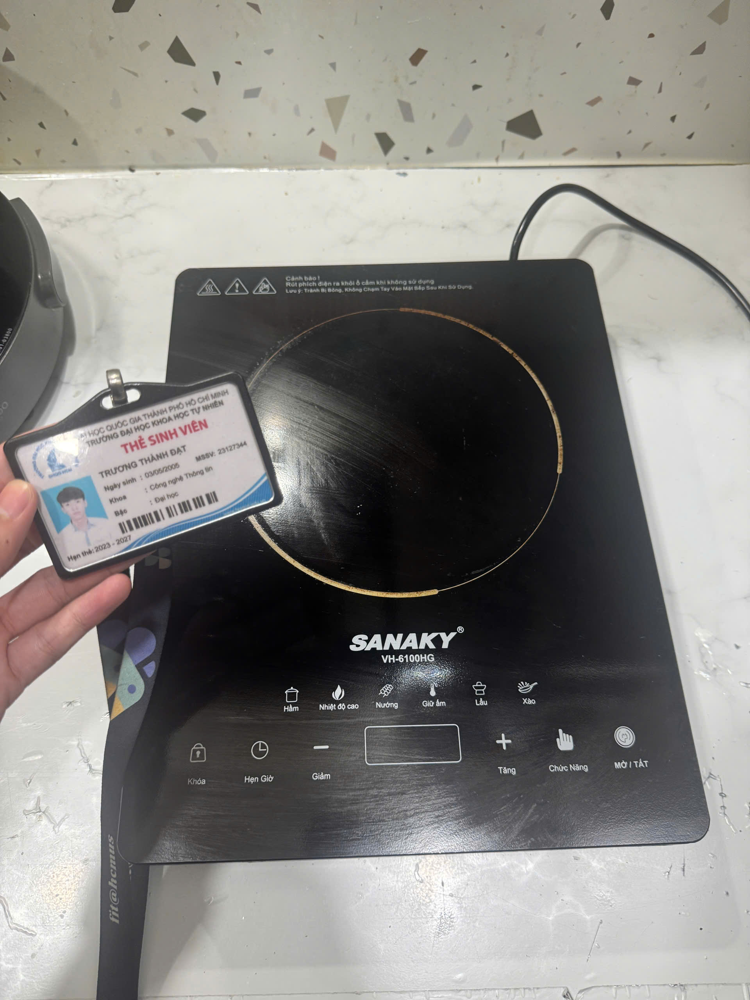 |

### Các trường hợp biên mà AI bỏ sót

Cung cấp cả hai minh chứng cho mỗi trường hợp biên: ảnh chụp màn hình cuộc hội thoại với AI cho thấy AI không tạo ra nó, và giải thích của bạn về lý do tại sao AI bỏ sót.

#### Ảnh chụp màn hình hội thoại minh chứng với AI:

- **Minh chứng 1 (Trường hợp tràn nước cảm ứng - TC-11):**
  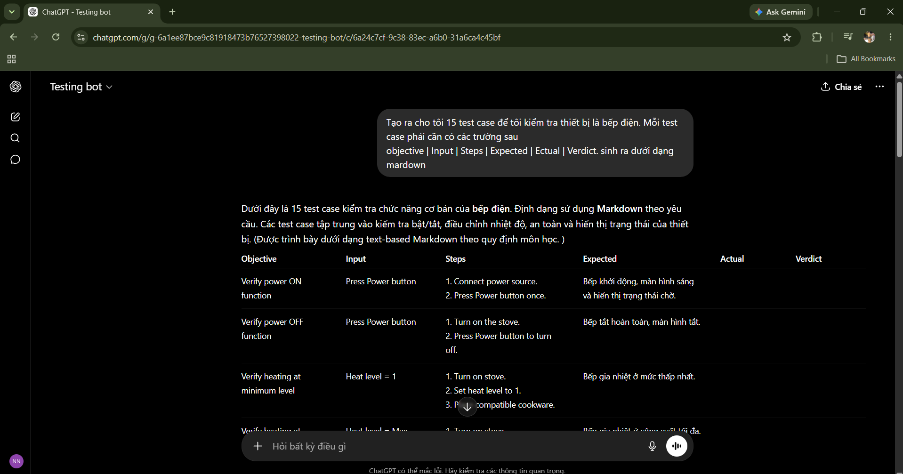

- **Minh chứng 2 (Trường hợp bật bếp không có nồi - TC-15):**
  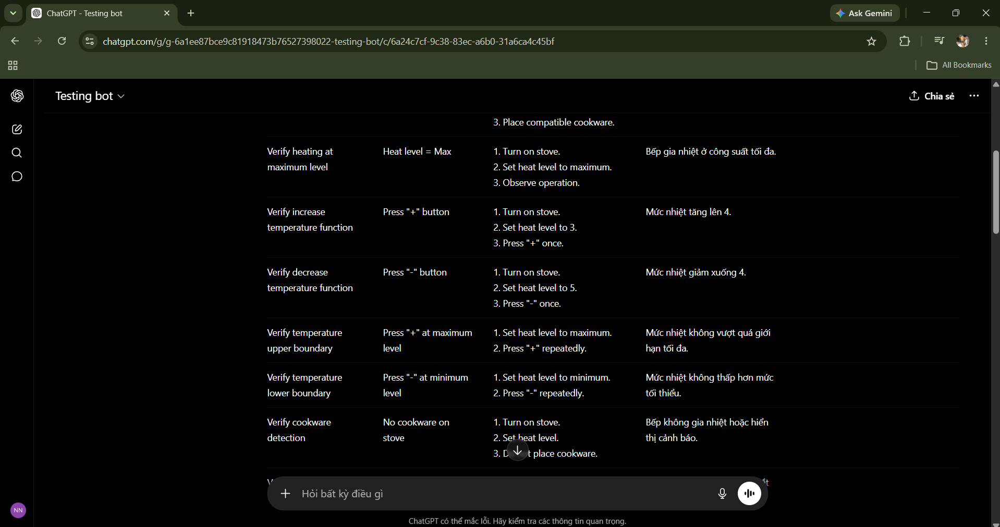

- **Minh chứng 3 (Trường hợp nồi vênh móp/nhỏ - TC-09):**
  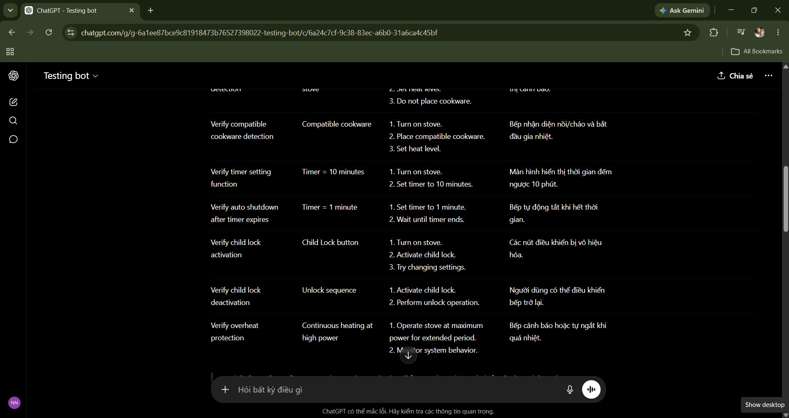

#### Bảng tóm tắt các trường hợp biên AI bỏ sót:

| STT trường hợp biên | Ý tưởng kiểm thử trường hợp biên                                                             | Ảnh chụp màn hình hội thoại AI | Lý do AI bỏ sót                                                                                                                                                                                                     |
| ------------------: | -------------------------------------------------------------------------------------------- | ------------------------------ | ------------------------------------------------------------------------------------------------------------------------------------------------------------------------------------------------------------------- |
|                   1 | Bề mặt phím cảm ứng bị tràn nước/chất lỏng sôi từ nồi đè lên nhiều phím cùng lúc (TC-11)     | Xem Minh chứng 1 ở trên        | AI chỉ phân tích trên mô hình phím bấm lý tưởng khô ráo, không lường trước hành vi vật lý ngoài đời thực là nước tràn làm thay đổi điện dung của các phím cảm ứng điện dung, gây đơ hoặc loạn phím (ghost touches). |
|                   2 | Bật bếp và chọn mức nhiệt khi không có dụng cụ nấu (nồi/chảo) được đặt trên vùng nấu (TC-15) | Xem Minh chứng 2 ở trên        | AI chỉ giả định kịch bản sử dụng lý tưởng luôn có nồi đặt trên bếp (happy path), bỏ qua việc kiểm thử cảm biến tự động nhận diện thiết bị để ngắt điện an toàn phòng chống cháy nổ khi người dùng quên đặt nồi.     |
|                   3 | Nhận diện khi đặt nồi có đáy bị vênh/móp hoặc kích thước nồi cực kỳ nhỏ (TC-09)              | Xem Minh chứng 3 ở trên        | AI chỉ thiết kế kiểm thử nhị phân (có nồi/không nồi, tương thích/không tương thích) mà không tính đến các tác động cơ học như diện tích tiếp xúc không đều làm nhiễu cảm biến dòng Foucault.                        |

### 15 ca kiểm thử sản phẩm vật lý

| Mã ca kiểm thử | Mục tiêu                               | Đầu vào / Điều kiện                                                               | Các bước thực hiện                                                                                                            | Kết quả mong đợi                                                                                                                         | Kết quả thực tế                                                                                                                               | Đánh giá (Verdict) | Trường hợp biên AI bỏ sót? | Đường dẫn/File video minh chứng                        | Đường dẫn GitHub Issue nếu tìm thấy lỗi                                     |
| -------------- | -------------------------------------- | --------------------------------------------------------------------------------- | ----------------------------------------------------------------------------------------------------------------------------- | ---------------------------------------------------------------------------------------------------------------------------------------- | --------------------------------------------------------------------------------------------------------------------------------------------- | ------------------ | -------------------------- | ------------------------------------------------------ | --------------------------------------------------------------------------- |
| TC-01          | Khởi động & Cài đặt chờ (Power ON)     | Thiết bị đã cắm vào nguồn điện 220V ổn định.                                      | 1. Cắm dây nguồn vào ổ điện. 2. Nhấn nút Nguồn (Power) một lần.                                                            | Bếp khởi động phát tiếng bíp ngắn. Màn hình hiển thị sáng, quạt quay nhẹ và hiển thị trạng thái chờ (Standby).                           | Bếp khởi động và phát đèn báo tín hiệu đã bật, trong trạng thái chờ                                                                           | Pass               | No                         | [YouTube Link](https://youtube.com/shorts/TbbqsGJA3cA) | -                                                                           |
| TC-02          | Tắt nguồn (Power OFF)                  | Bếp đang hoạt động hoặc ở trạng thái chờ.                                         | 1. Bật nguồn bếp. 2. Nhấn nút Nguồn (Power) một lần để tắt.                                                                | Bếp ngắt gia nhiệt hoàn toàn, màn hình hiển thị tắt hẳn.                                                                                 | Nhấn nút Nguồn nhưng bếp không tắt hẳn, màn hình vẫn sáng ở chế độ chờ, bắt buộc phải rút phích cắm nguồn điện mới tắt được.                  | Fail               | No                         | [YouTube Link](https://youtube.com/shorts/TbbqsGJA3cA) | [GitHub Issue #1](https://github.com/trwng-thdat/software-testing/issues/1) |
| TC-03          | Gia nhiệt ở công suất tối thiểu (300W) | Bếp đã bật nguồn, có nồi tương thích đặt trên bếp.                                | 1. Đặt nồi tương thích lên bếp. 2. Bật nguồn và chọn công suất tối thiểu (300W).                                           | Bếp nhận diện nồi thành công, bắt đầu gia nhiệt ở công suất 300W, màn hình hiển thị 300.                                                 | Bếp thành công làm nóng với công suất 300W đã chọn                                                                                            | Pass               | No                         | -                                                      | -                                                                           |
| TC-04          | Gia nhiệt ở công suất tối đa (2000W)   | Bếp đã bật nguồn, có nồi tương thích đặt trên bếp.                                | 1. Đặt nồi tương thích lên bếp. 2. Bật nguồn và chọn công suất tối đa (2000W).                                             | Bếp gia nhiệt liên tục ở công suất 2000W, không bị ngắt điện đột ngột do quá nhiệt bất thường, màn hình hiển thị 2000.                   | Bếp thành công làm nóng với công suất tối đa 2000W                                                                                            | Pass               | No                         | -                                                      | -                                                                           |
| TC-05          | Tăng công suất gia nhiệt (Phím "+")    | Bếp đang hoạt động ở mức công suất 1000W.                                         | 1. Bếp đang hoạt động ở mức công suất 1000W. 2. Nhấn phím "+" một lần.                                                     | Công suất gia nhiệt tăng lên 100W (thành 1100W), màn hình hiển thị 1100W.                                                                | Bếp tăng công suất thành công lên 1100W, màn hình hiển thị 1100W.                                                                             | Pass               | No                         | -                                                      | -                                                                           |
| TC-06          | Giảm công suất gia nhiệt (Phím "-")    | Bếp đang hoạt động ở mức công suất 1100W.                                         | 1. Bếp đang hoạt động ở mức công suất 1100W. 2. Nhấn phím "-" một lần.                                                     | Công suất gia nhiệt giảm xuống 100W (thành 1000W), màn hình hiển thị 1000W.                                                              | Bếp giảm công suất thành công xuống 1000W, màn hình hiển thị 1000W.                                                                           | Pass               | No                         | -                                                      | -                                                                           |
| TC-07          | Giới hạn biên trên của công suất       | Bếp đang hoạt động ở mức công suất tối đa (2000W).                                | 1. Bếp đang ở công suất 2000W. 2. Nhấn phím "+" liên tiếp 3 lần.                                                           | Công suất không đổi, màn hình vẫn hiển thị 2000 và không vượt quá giới hạn tối đa 2000W.                                                 | Bếp duy trì công suất 2000W và màn hình không vượt quá 2000.                                                                                  | Pass               | No                         | -                                                      | -                                                                           |
| TC-08          | Giới hạn biên dưới của công suất       | Bếp đang hoạt động ở mức công suất tối thiểu (300W).                              | 1. Bếp đang ở công suất 300W. 2. Nhấn phím "-" liên tiếp 3 lần.                                                            | Công suất không đổi, màn hình vẫn hiển thị 300 và không thấp hơn giới hạn tối thiểu 300W.                                                | Bếp duy trì công suất 300W và màn hình không giảm xuống dưới 300.                                                                             | Pass               | No                         | -                                                      | -                                                                           |
| TC-09          | Nhận diện khi đáy nồi vênh móp/nhỏ     | Bếp đã bật nguồn, đặt nồi có đáy bị cong vênh móp hoặc kích thước đáy < 12cm.     | 1. Đặt nồi đáy vênh móp lên vùng nấu. 2. Chọn công suất bất kỳ (ví dụ: 1000W) để đun.                                      | Bếp gia nhiệt bình thường đối với tất cả kích thước/hình dạng đáy nồi (đặc trưng bếp hồng ngoại).                                        | Bếp hoạt động gia nhiệt bình thường đối với đáy nồi nhỏ/vênh móp (bếp hồng ngoại không kén kích thước/hình dạng).                             | Pass               | Yes                        | -                                                      | -                                                                           |
| TC-10          | Kiểm thử tương thích chất liệu nồi     | Bếp đã bật nguồn, sử dụng các loại nồi nấu phi kim loại (thủy tinh, gốm sứ, đất). | 1. Đặt lần lượt nồi đất, nồi thủy tinh lên vùng nấu. 2. Chọn công suất bất kỳ (ví dụ: 1000W) để đun.                       | Bếp truyền nhiệt và gia nhiệt bình thường đối với tất cả chất liệu nồi nấu, không hiển thị mã lỗi.                                       | Bếp truyền nhiệt tốt và hoạt động bình thường trên mọi chất liệu nồi (thủy tinh, đất...).                                                     | Pass               | No                         | [YouTube Link](https://youtube.com/shorts/oQ1GBQuUas8) | -                                                                           |
| TC-11          | Bảng điều khiển bị ướt/tràn nước       | Bếp đang hoạt động gia nhiệt.                                                     | 1. Tạo một lớp nước mỏng đè lên bề mặt các phím cảm ứng. 2. Nhấn phím để điều khiển bếp.                                   | Hệ thống bảo vệ tự động kích hoạt ngắt đun nóng hoặc phát âm thanh cảnh báo lỗi phím cảm ứng liên tục.                                   | Nước tràn lên bảng điều khiển nhưng bếp không ngắt, nước đè lên phím còn tự động kích hoạt lệnh điều khiển như có tay người chạm.             | Fail               | Yes                        | [YouTube Link](https://youtube.com/shorts/SsL32TU3UY8) | [GitHub Issue #3](https://github.com/trwng-thdat/software-testing/issues/3) |
| TC-12          | Cài đặt hẹn giờ tắt bếp                | Bếp đang hoạt động ổn định.                                                       | 1. Nhấn nút Hẹn giờ (Timer). 2. Tăng thời gian hẹn giờ (ví dụ: 1 phút) để đun.                                             | Màn hình đếm ngược về 0, bếp tự động ngắt gia nhiệt hoàn toàn để mặt kính nguội đi.                                                      | Mặc dù màn hình đã chuyển trạng thái tắt/chờ sau khi hết giờ, bếp thực tế vẫn tiếp tục nóng đỏ gia nhiệt và quạt tản nhiệt vẫn chạy liên tục. | Fail               | No                         | [YouTube Link](https://youtube.com/shorts/OkDpeep2zOs) | [GitHub Issue #4](https://github.com/trwng-thdat/software-testing/issues/4) |
| TC-13          | Khóa an toàn trẻ em (Child lock)       | Bếp đang hoạt động ổn định.                                                       | 1. Nhấn giữ phím Lock trong 3 giây. 2. Thử nhấn các phím tăng/giảm công suất.                                              | Đèn báo khóa sáng lên. Toàn bộ các phím điều khiển khác bị vô hiệu hóa.                                                                  | Nhấn giữ phím Lock trong 3 giây nhưng bếp hoàn toàn không phản hồi, đèn khóa không sáng và các phím khác vẫn dùng được.                       | Fail               | No                         | [YouTube Link](https://youtube.com/shorts/SRC8SwCKwwc) | [GitHub Issue #5](https://github.com/trwng-thdat/software-testing/issues/5) |
| TC-14          | Mở khóa an toàn trẻ em                 | Bếp đang ở chế độ khóa trẻ em (TC-13).                                            | 1. Nhấn giữ phím Lock trong 3 giây. 2. Thực hiện tăng/giảm công suất.                                                      | Đèn báo khóa tắt. Người dùng có thể điều khiển và thay đổi công suất bình thường.                                                        | Không thể thực hiện kiểm thử do tính năng khóa trẻ em (TC-13) bị lỗi hỏng và không thể kích hoạt được.                                        | Blocked            | No                         | -                                                      | -                                                                           |
| TC-15          | Bật bếp khi không có nồi/dụng cụ nấu   | Vùng nấu hoàn toàn trống, thiết bị đang cắm điện ổn định.                         | 1. Nhấn nút Nguồn để bật bếp. 2. Chọn một mức công suất bất kỳ (ví dụ: 1000W) mà không đặt nồi lên bếp. 3. Chờ 60 giây. | Bếp nhấp nháy đèn cảnh báo không có nồi (hoặc hiện mã lỗi E0), phát tiếng bíp liên tục và tự ngắt nguồn hoàn toàn sau khoảng 10-60 giây. | Bếp vẫn gia nhiệt đỏ rực bình nhiên và hoạt động liên tục khi không có nồi đặt trên mặt bếp, không có cảnh báo lỗi hay tự tắt nguồn.          | Fail               | Yes                        | -                                                      | [GitHub Issue #2](https://github.com/trwng-thdat/software-testing/issues/2) |

### Tóm tắt minh chứng thực thi

| Yêu cầu                                                       | Số lượng / Minh chứng của bạn                                                                                                                                                                                                                                                                                                                       |
| ------------------------------------------------------------- | --------------------------------------------------------------------------------------------------------------------------------------------------------------------------------------------------------------------------------------------------------------------------------------------------------------------------------------------------- |
| Tổng số ca kiểm thử được thiết kế                             | 15 ca kiểm thử                                                                                                                                                                                                                                                                                                                                      |
| Các ca kiểm thử đã thực thi trên thiết bị thực tế             | TC-01, TC-02, TC-03, TC-04, TC-05, TC-06, TC-07, TC-08, TC-09, TC-10, TC-11, TC-12, TC-13, TC-14, TC-15                                                                                                                                                                                                                                             |
| Video demo có thuyết minh bằng giọng nói của bạn              | - TC-01 & TC-02: [YouTube Link](https://youtube.com/shorts/TbbqsGJA3cA) - TC-10: [YouTube Link](https://youtube.com/shorts/oQ1GBQuUas8) - TC-11: [YouTube Link](https://youtube.com/shorts/SsL32TU3UY8) - TC-12: [YouTube Link](https://youtube.com/shorts/OkDpeep2zOs) - TC-13: [YouTube Link](https://youtube.com/shorts/SRC8SwCKwwc) |
| Các lỗi (defect) tìm thấy trong quá trình thực thi            | D-01, D-02, D-03, D-04, D-05                                                                                                                                                                                                                                                                                                                        |
| Ảnh chụp màn hình trang GitHub Issues hiển thị tên người dùng | 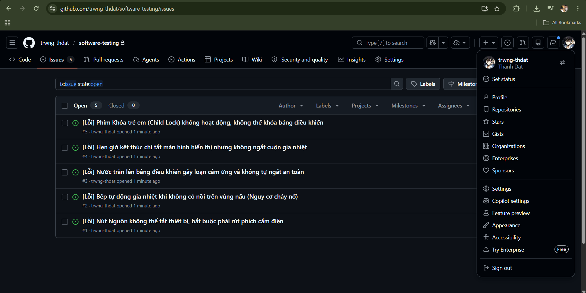                                                                                                                                                                                                                                                             |

### Các lỗi tìm thấy trên sản phẩm vật lý

Ghi nhận các lỗi (defect) trong repository GitHub của riêng bạn dưới dạng Issues. Đính kèm ảnh chụp màn hình và video nếu có.

| Mã lỗi | Ca kiểm thử liên quan | Tiêu đề                                                                             | Các bước tái hiện                                                                                                                   | Kết quả mong đợi                                                                                     | Kết quả thực tế                                                                                                                     | Mức độ nghiêm trọng     | Minh chứng                                             | Đường dẫn GitHub Issue                                                      |
| ------ | --------------------- | ----------------------------------------------------------------------------------- | ----------------------------------------------------------------------------------------------------------------------------------- | ---------------------------------------------------------------------------------------------------- | ----------------------------------------------------------------------------------------------------------------------------------- | ----------------------- | ------------------------------------------------------ | --------------------------------------------------------------------------- |
| D-01   | TC-02                 | [Lỗi] Nút Nguồn không thể tắt thiết bị, bắt buộc phải rút phích cắm điện            | 1. Bật bếp và đun nấu bình thường. 2. Nhấn nút Nguồn để tắt bếp.                                                                 | Bếp tắt hoàn toàn màn hình hiển thị và ngắt toàn bộ hệ thống điều khiển một cách an toàn.            | Bếp vẫn giữ nguyên màn hình sáng ở trạng thái chờ, quạt quay, nút Nguồn mất tác dụng tắt và bắt buộc phải rút phích cắm.            | Cao (High)              | [YouTube Link](https://youtube.com/shorts/TbbqsGJA3cA) | [GitHub Issue #1](https://github.com/trwng-thdat/software-testing/issues/1) |
| D-02   | TC-15                 | [Lỗi] Bếp tự động gia nhiệt khi không có nồi trên vùng nấu (Nguy cơ cháy nổ)        | 1. Cắm nguồn bếp. 2. Nhấn nút Nguồn để bật bếp. 3. Chọn công suất 1000W mà không đặt bất kỳ nồi nấu nào lên bếp.              | Bếp phát hiện vùng nấu trống, cảnh báo lỗi và tự tắt nguồn sau khoảng 10-60 giây.                    | Bếp vẫn gia nhiệt đỏ rực mặt bếp hồng ngoại và đun liên tục không tự ngắt.                                                          | Nghiêm trọng (Critical) | [YouTube Link](https://youtube.com/shorts/TbbqsGJA3cA) | [GitHub Issue #2](https://github.com/trwng-thdat/software-testing/issues/2) |
| D-03   | TC-11                 | [Lỗi] Nước tràn lên bảng điều khiển gây loạn cảm ứng và không tự ngắt an toàn       | 1. Bật bếp hoạt động bình thường. 2. Đổ một lớp nước mỏng đè lên các nút cảm ứng trên bảng điều khiển.                           | Bếp phát hiện ẩm ướt/nhiều phím bị đè cùng lúc, phát cảnh báo lỗi phím và tự ngắt gia nhiệt an toàn. | Bếp vẫn hoạt động gia nhiệt bình thường, nước tràn kích hoạt các lệnh điều khiển như tay người bấm (loạn cảm ứng) và không tự ngắt. | Cao (High)              | [YouTube Link](https://youtube.com/shorts/SsL32TU3UY8) | [GitHub Issue #3](https://github.com/trwng-thdat/software-testing/issues/3) |
| D-04   | TC-12                 | [Lỗi] Hẹn giờ kết thúc chỉ tắt màn hình hiển thị nhưng không ngắt cuộn gia nhiệt    | 1. Bật bếp hoạt động ở công suất bất kỳ (ví dụ: 1000W). 2. Cài đặt hẹn giờ trong 1 phút. 3. Đợi thời gian đếm ngược kết thúc. | Bếp phát tiếng bíp báo hết giờ, màn hình tắt/chờ, ngắt hoàn toàn gia nhiệt và mặt kính nguội dần.    | Màn hình hiển thị đã tắt nhưng cuộn gia nhiệt hồng ngoại bên trong vẫn tiếp tục nóng đỏ rực và quạt tản nhiệt vẫn chạy liên tục.    | Nghiêm trọng (Critical) | [YouTube Link](https://youtube.com/shorts/OkDpeep2zOs) | [GitHub Issue #4](https://github.com/trwng-thdat/software-testing/issues/4) |
| D-05   | TC-13                 | [Lỗi] Phím Khóa trẻ em (Child Lock) không hoạt động, không thể khóa bảng điều khiển | 1. Bật bếp hoạt động bình thường. 2. Nhấn giữ phím Lock trong 3 giây.                                                            | Đèn báo khóa sáng, hiển thị thông báo khóa và vô hiệu hóa các phím điều khiển khác để bảo vệ.        | Phím Lock không phản hồi khi nhấn giữ, các nút bấm khác vẫn hoạt động bình thường và không có cảnh báo nào.                         | Trung bình              | [YouTube Link](https://youtube.com/shorts/SRC8SwCKwwc) | [GitHub Issue #5](https://github.com/trwng-thdat/software-testing/issues/5) |

---

## Báo cáo kiểm toán AI - Phụ lục A

### Artifact A1 - Khung template báo cáo Markdown

| Phần                         | Nội dung                                                                                                                                                                                                                                                                                                                                                                                                                                                                                                                            |
| ---------------------------- | ----------------------------------------------------------------------------------------------------------------------------------------------------------------------------------------------------------------------------------------------------------------------------------------------------------------------------------------------------------------------------------------------------------------------------------------------------------------------------------------------------------------------------------- |
| 1. Prompt + công cụ          | **Công cụ:** Gemini 3.5 Flash **Thời gian:** 09:15 04/06/2026  **Prompt:** "Tạo khung template báo cáo Markdown cho bài tập HW01 môn CS423/CSC13003 Kiểm thử phần mềm tại FIT@HCMUS. Khung báo cáo cần bao gồm thông tin sinh viên, tuyên bố sử dụng AI, Yêu cầu 1 (Thị trường việc làm QA/QC và sơ đồ tư duy), Yêu cầu 2 (20 defect phần mềm), Yêu cầu 3 (15 ca kiểm thử sản phẩm vật lý, tóm tắt minh chứng và bảng defect vật lý), Phê bình AI, Công bố bắt buộc, Tự đánh giá và Danh sách kiểm tra trước khi nộp bài." |
| 2. Kết quả của AI            | Khung cấu trúc (boilerplate) hoàn chỉnh của file `23127344.md` với đầy đủ các mục, bảng Markdown trống và các nhãn [TODO: ...] định hướng thông tin.                                                                                                                                                                                                                                                                                                                                                                                |
| 3. Đánh giá (Verdict)        | HỢP LỆ (VALID)                                                                                                                                                                                                                                                                                                                                                                                                                                                                                                                      |
| 4. Lập luận                  | AI đã tạo ra khung tài liệu chính xác, đầy đủ các mục theo yêu cầu đề bài và quy định nộp bài. Khung sườn này giúp định hình cấu trúc báo cáo một cách nhất quán và sẵn sàng để điền thông tin thực tế. Chấp nhận kết quả làm bản mẫu.                                                                                                                                                                                                                                                                                              |
| 5. Bản sửa lỗi của sinh viên | Không cần sửa đổi cấu trúc mẫu. Sinh viên tiến hành sử dụng trực tiếp để làm báo cáo chính.                                                                                                                                                                                                                                                                                                                                                                                                                                         |

### Artifact A2 - Sơ đồ tư duy vai trò QA/QC

| Phần                         | Nội dung                                                                                                                                                                                                                                                                                                                                                                                                                                                           |
| ---------------------------- | ------------------------------------------------------------------------------------------------------------------------------------------------------------------------------------------------------------------------------------------------------------------------------------------------------------------------------------------------------------------------------------------------------------------------------------------------------------------ |
| 1. Prompt + công cụ          | **Công cụ:** Gemini 3.5 Flash **Thời gian:** 13:20 04/06/2026  **Prompt:** "Generate a mindmap representing the QA and QC roles and activities according to the ISTQB Foundation Level syllabus. Include some common structural mistakes or misconceptions that an AI might make regarding the distinction between QA and QC, the placement of debugging, and tester roles, so that we can review and correct them. Format the output in Mermaid syntax." |
| 2. Kết quả của AI            | `mindmap` `  root((Quality Management))` `    Quality Assurance (QA)` `      Process-oriented` `      Preventative activities` `      Quality Control (QC)` `        Software Testing` `          QA Tester` `            Write Test Plan` `            Execute Tests` `            Debugging`                                                                                                                                       |
| 3. Đánh giá (Verdict)        | CHƯA HOÀN THÀNH (INCOMPLETE)                                                                                                                                                                                                                                                                                                                                                                                                                                       |
| 4. Lập luận                  | AI đã đặt "Debugging" (gỡ lỗi) dưới vai trò "QA Tester", vi phạm ISTQB FL v4.0 §1.1.2 (gỡ lỗi là hoạt động phát triển, không phải kiểm thử). AI hiển thị QC là con của QA, vi phạm §1.2.2 (QA và QC là hai phần độc lập song song trực thuộc Quản lý chất lượng). AI gán việc viết Test Plan cho "QA Tester", vi phạm §5.1.1 (Lập kế hoạch kiểm thử là trách nhiệm của Test Manager, không phải Tester).                                                           |
| 5. Bản sửa lỗi của sinh viên | Vẽ lại sơ đồ tư duy (trong [qa_qc_role_mindmap.md](qa_qc_role_mindmap.md) và ảnh images/qa_qc_mindmap_2.png). Chuyển Debugging sang nhánh "Development Activities" (Hoạt động phát triển), tách QA và QC thành hai nhánh song song dưới Quality Management, chia vai trò thành Test Manager (viết Test Plan) và Tester (thực thi kiểm thử).                                                                                                                        |

### Artifact A3 - Bảng tóm tắt 10 tin tuyển dụng QA/QC

| Phần                         | Nội dung                                                                                                                                                                                                                                                                                                                                                                                                                                                                                                         |
| ---------------------------- | ---------------------------------------------------------------------------------------------------------------------------------------------------------------------------------------------------------------------------------------------------------------------------------------------------------------------------------------------------------------------------------------------------------------------------------------------------------------------------------------------------------------- |
| 1. Prompt + công cụ          | **Công cụ:** Gemini 3.5 Flash **Thời gian:** 13:25 04/06/2026  **Prompt:** "Summarize the 10 job descriptions provided in job_link.md and match them with their respective screenshots (1.png to 10.png) in the job_pictures folder. Extract for each job: job title, company name, platform, posting date, source link, screenshot file, salary, whether AI/LLM/Automation-AI is required, a summary of required skills, a summary of the job description, and an AI impact analysis (1-2 sentences)." |
| 2. Kết quả của AI            | _Successfully parsed the text from `job_link.md` and synthesized details for the 10 job postings (TikTok, OptiSigns, KMS Technology, Ashley Furniture Industries, Ins Enco, SCC Vietnam, Motorola Solutions, Flowmingo AI, Intelligent Internet, and I-Konect Global)._                                                                                                                                                                                                                                          |
| 3. Đánh giá (Verdict)        | HỢP LỆ (VALID)                                                                                                                                                                                                                                                                                                                                                                                                                                                                                                   |
| 4. Lập luận                  | AI đã trích xuất và tóm tắt thành công tất cả các chi tiết được yêu cầu từ các đường dẫn nguồn và ảnh chụp màn hình với độ chính xác cao. Không phát hiện lỗi logic hoặc ảo tưởng (hallucination) nào sau khi đối chiếu thủ công. Chấp nhận kết quả gốc.                                                                                                                                                                                                                                                         |
| 5. Bản sửa lỗi của sinh viên | Không cần sửa đổi. Định dạng kết quả đầu ra thành bảng Markdown rõ ràng trong báo cáo chính [23127344.md](23127344.md).                                                                                                                                                                                                                                                                                                                                                                                          |

### Artifact A4 - Bảng danh sách 20 lỗi phần mềm (Opencode)

| Phần                         | Nội dung                                                                                                                                                                                                                                                                                                                                                                                                                                                                                                                                                   |
| ---------------------------- | ---------------------------------------------------------------------------------------------------------------------------------------------------------------------------------------------------------------------------------------------------------------------------------------------------------------------------------------------------------------------------------------------------------------------------------------------------------------------------------------------------------------------------------------------------------- |
| 1. Prompt + công cụ          | **Công cụ:** Opencode (Deepseek model) **Thời gian:** 10:50 06/06/2026  **Prompt:** "Tìm 20 lỗi phần mềm (defect) được công bố công khai từ năm 2022 đến 2026. Trong đó có ít nhất 5 lỗi liên quan đến các vấn đề AI/LLM như ảo tưởng (hallucination), prompt injection, thiên kiến (bias), đầu ra không an toàn hoặc tự động hóa không đáng tin cậy. Định dạng kết quả thành bảng gồm các cột: Tên lỗi, Năm, Liên quan đến AI, Đường dẫn nguồn, Mô tả lỗi, Mức độ nghiêm trọng, Hậu quả, Giải pháp, và Lỗi ảo tưởng hoặc thiên kiến của AI."     |
| 2. Kết quả của AI            | _Successfully generated a list of 20 software defects between 2022 and 2026 (including ChatGPT legal case, Air Canada chatbot, Bing Chat prompt injection, Google Gemini image bias, DPD chatbot, CrowdStrike, Cloudflare, Atlassian, Toyota, Optus, T-Mobile, Twitter, LastPass, GitLab, Okta, Norfolk Southern, MOVEit, Microsoft Teams, Alaska Airlines, and Microsoft Outlook)._                                                                                                                                                                       |
| 3. Đánh giá (Verdict)        | CHƯA HOÀN THÀNH (INCOMPLETE)                                                                                                                                                                                                                                                                                                                                                                                                                                                                                                                               |
| 4. Lập luận                  | AI đã tạo ra danh sách 20 lỗi nhưng các thông tin mô tả chi tiết của từng lỗi đều chứa các lỗi sai lệch thực tế hoặc ảo tưởng (hallucination) nghiêm trọng (ví dụ: bịa đặt log lỗi của Cloudflare, nhầm lẫn mốc thời gian của Air Canada, sai lệch bản chất vụ kiện Mata v. Avianca, sai lệch vai trò nhân vật của Bing Chat, sai lệch phiên bản phát hành của GitLab, v.v.). Theo ISTQB FL v4.0 §1.1.2 (mục tiêu kiểm thử) và §2.1 (kiểm thử thông tin đầu ra), việc xác thực thông tin do AI sinh ra là bắt buộc để tránh lan truyền thông tin sai lệch. |
| 5. Bản sửa lỗi của sinh viên | Sinh viên đã đối chiếu độc lập từng lỗi với các nguồn tin chính thống, phát hiện và lập danh sách các chi tiết ảo tưởng/sai lệch thực tế trong file [hallucination-found.md](hallucination-found.md). Sau đó, sinh viên cập nhật mô tả đúng sự thật và chi tiết ảo tưởng của AI vào bảng Requirement 2 trong báo cáo chính [23127344.md](23127344.md) và file [opencode-defect-report.md](opencode-defect-report.md).                                                                                                                                      |

### Artifact A5 - Bảng 15 ca kiểm thử nồi chiên không dầu

| Phần                         | Nội dung                                                                                                                                                                                                                                                                                                                                                                                                                                                                          |
| ---------------------------- | --------------------------------------------------------------------------------------------------------------------------------------------------------------------------------------------------------------------------------------------------------------------------------------------------------------------------------------------------------------------------------------------------------------------------------------------------------------------------------- |
| 1. Prompt + công cụ          | **Công cụ:** Gemini 3.5 Flash **Thời gian:** 22:07 06/06/2026  **Prompt:** "Giờ bạn ghi trong @[software-testing/hw1/23127344.md] phần requirment 3. tôi sẽ làm thiết bị là nồi chiên không dầu và bạn tạo ra cho tôi 15 test case chuẩn theo format"                                                                                                                                                                                                                    |
| 2. Kết quả của AI            | _Successfully updated the main report file `23127344.md` to identify the air fryer device (Philips HD9200/90), documented three edge cases missed by AI (rapid basket removal, soft-off fan cooling time, wet touch control sensitivity), and filled in the table of 15 comprehensive physical product test cases._                                                                                                                                                               |
| 3. Đánh giá (Verdict)        | CHƯA HOÀN THÀNH (INCOMPLETE)                                                                                                                                                                                                                                                                                                                                                                                                                                                      |
| 4. Lập luận                  | AI tạo ra 15 ca kiểm thử tiêu chuẩn cho nồi chiên không dầu nhưng bỏ sót hoàn toàn các trường hợp biên quan trọng liên quan đến vật lý - cơ học và an toàn thiết bị (như rút khay cực nhanh dưới 1s, quạt chạy tản nhiệt sau khi tắt nồi ở nhiệt độ cao, nút cảm ứng bị ướt/hơi nước bám). Theo ISTQB FL v4.0 §1.1.2 (mục tiêu kiểm thử gồm giảm thiểu rủi ro an toàn) và §4.3 (Phân tích giá trị biên), các ca biên an toàn này là bắt buộc đối với thiết bị gia dụng phần cứng. |
| 5. Bản sửa lỗi của sinh viên | Sinh viên đã bổ sung 3 ca biên vào bảng và viết giải thích kỹ thuật. Sau đó, sinh viên quyết định đổi thiết bị sang bếp điện để phù hợp hơn với thực tế sở hữu (xem Artifact #6).                                                                                                                                                                                                                                                                                                 |

### Artifact A6 - Bảng 15 ca kiểm thử bếp điện

| Phần                         | Nội dung                                                                                                                                                                                                                                                                                                                  |
| ---------------------------- | ------------------------------------------------------------------------------------------------------------------------------------------------------------------------------------------------------------------------------------------------------------------------------------------------------------------------- |
| 1. Prompt + công cụ          | **Công cụ:** Gemini 3.5 Flash **Thời gian:** 08:27 07/06/2026 **Prompt:** "Tôi muốn đổi thiết bị ở Yêu cầu 3 thành bếp điện. Hãy tạo cho tôi 15 ca kiểm thử cơ bản tập trung vào bật/tắt, điều chỉnh mức nhiệt độ, an toàn và hiển thị trạng thái của thiết bị dưới dạng bảng Markdown."                            |
| 2. Kết quả của AI            | _Successfully generated 15 standard test cases for the electric stove (Sanaky VH-6100HG) focusing on ON/OFF, heat levels, child lock, and standard safety behaviors._                                                                                                                                                     |
| 3. Đánh giá (Verdict)        | CHƯA HOÀN THÀNH (INCOMPLETE)                                                                                                                                                                                                                                                                                              |
| 4. Lập luận                  | AI tạo ra 15 ca kiểm thử chức năng cơ bản cho bếp điện nhưng bỏ sót các trường hợp biên an toàn vật lý và cơ học thực tế của bếp (nước tràn đơ nút cảm ứng, bật bếp khi không có nồi/dụng cụ nấu, nồi vênh móp/nhỏ). Theo ISTQB FL v4.0 §1.1.2 và §4.3, các ca biên này là bắt buộc để đảm bảo an toàn thiết bị gia dụng. |
| 5. Bản sửa lỗi của sinh viên | Tự xác định và bổ sung 3 ca kiểm thử biên (TC-09, TC-11, TC-15) vào bảng kiểm thử trong file [23127344.md](23127344.md), chụp ảnh cuộc hội thoại chứng minh AI bỏ sót các ca này và giải thích kỹ thuật lý do AI bỏ sót.                                                                                                  |

### Artifact A7 - Hướng dẫn nộp bài & YouTube Unlisted

| Phần                         | Nội dung                                                                                                                                                                                                                                                                               |
| ---------------------------- | -------------------------------------------------------------------------------------------------------------------------------------------------------------------------------------------------------------------------------------------------------------------------------------- |
| 1. Prompt + công cụ          | **Công cụ:** Gemini 3.5 Flash **Thời gian:** 14:21 07/06/2026 **Prompt:** "Đọc cái phần submission relugation rồi huóng dẫn tôi nộp bài. Youtube Unlisted là sao?"                                                                                                               |
| 2. Kết quả của AI            | Hướng dẫn chi tiết các bước chuẩn bị file nén ZIP, đặt tên file theo định dạng chuẩn, các file tài liệu và biểu mẫu AI bắt buộc nộp kèm, và giải thích chi tiết cơ chế hoạt động của chế độ hiển thị video Unlisted trên YouTube.                                                      |
| 3. Đánh giá (Verdict)        | HỢP LỆ (VALID)                                                                                                                                                                                                                                                                         |
| 4. Lập luận                  | AI đã giải thích chính xác các quy định và ràng buộc nộp bài ở trang 5 của đề bài 2026.HW01.Jobs.Defects.PhysicalProduct_En.pdf. Thông tin về YouTube Unlisted hoàn toàn đúng đắn giúp sinh viên hiểu rõ cách phân quyền xem video thực thi cho giám khảo mà không công khai rộng rãi. |
| 5. Bản sửa lỗi của sinh viên | Không cần sửa đổi. Sinh viên sử dụng trực tiếp các hướng dẫn này để tiến hành đóng gói ZIP và nộp bài.                                                                                                                                                                                 |

### Artifact A8 - Thiết kế cấu trúc các sheet trong file Excel

| Phần                         | Nội dung                                                                                                                                                                                                                                                                                   |
| ---------------------------- | ------------------------------------------------------------------------------------------------------------------------------------------------------------------------------------------------------------------------------------------------------------------------------------------ |
| 1. Prompt + công cụ          | **Công cụ:** Gemini 3.5 Flash **Thời gian:** 14:43 07/06/2026 **Prompt:** "Cái chỗ File Excel: là chứa những cái gì? Hãy lập danh sách checklist chi tiết cho các sheet."                                                                                                            |
| 2. Kết quả của AI            | Giải thích chi tiết 3 nội dung chính của tệp Excel gồm: sheet Test Cases (15 ca kiểm thử bếp điện), sheet Checklist (danh sách tính năng nút cảm ứng, đun nấu, hiển thị, an toàn), và sheet Summary (thống kê số lượng/tỷ lệ phần trăm kết quả và defect).                                 |
| 3. Đánh giá (Verdict)        | HỢP LỆ (VALID)                                                                                                                                                                                                                                                                             |
| 4. Lập luận                  | AI cung cấp cấu trúc file Excel đầy đủ và hợp lý theo yêu cầu của đề bài. Bản checklist chi tiết thiết bị bếp điện hồng ngoại Sanaky VH-6100HG bao phủ toàn bộ các chức năng vật lý thực tế của sản phẩm giúp tăng độ bao phủ kiểm thử (test coverage) theo tiêu chuẩn ISTQB FL v4.0 §4.3. |
| 5. Bản sửa lỗi của sinh viên | Không cần sửa đổi. Sinh viên sao chép và định dạng trực tiếp cấu trúc checklist này vào file Excel bài làm.                                                                                                                                                                                |

### Artifact A9 - Rà soát và đánh giá bài nộp HW01

| Phần                         | Nội dung                                                                                                                                                                                                                                                                                                                                                                                                                                                                                                                                               |
| ---------------------------- | ------------------------------------------------------------------------------------------------------------------------------------------------------------------------------------------------------------------------------------------------------------------------------------------------------------------------------------------------------------------------------------------------------------------------------------------------------------------------------------------------------------------------------------------------------ |
| 1. Prompt + công cụ          | **Công cụ:** Claude Code (thông qua trợ lý Antigravity) **Thời gian:** 18:42 07/06/2026  **Prompt:** "Đọc yêu cầu đề bài @[software-testing/hw1/2026.HW01.Jobs.Defects.PhysicalProduct_En.pdf] và đánh giá xem @[software-testing/23127344] đã đầy đủ yêu cầu và chuẩn chỉ để nộp chưa. còn điều chỉnh cái gì không"                                                                                                                                                                                                                             |
| 2. Kết quả của AI            | Claude Code đã đọc toàn bộ file đề bài `2026.HW01.Jobs.Defects.PhysicalProduct_En.pdf` và kiểm tra toàn bộ nội dung thư mục nộp bài `23127344/`. Kết quả đánh giá chi tiết bao gồm: các phần đã đạt yêu cầu (10 tin tuyển dụng, 20 defects, 15 ca kiểm thử, các biểu mẫu AI-02, AI-03, AI-05) và các điểm cần kiểm tra/điều chỉnh (10 ảnh screenshots phải hiển thị username/login LinkedIn, 5 video YouTube phải có giọng nói thuyết minh, [AI-03] chỉ khai Gemini 3.5 Flash thiếu Opencode, tự đánh giá 100/100, định dạng tên file ZIP).                 |
| 3. Đánh giá (Verdict)        | HỢP LỆ (VALID)                                                                                                                                                                                                                                                                                                                                                                                                                                                                                                                                         |
| 4. Lập luận                  | Claude Code đã phân tích đúng cấu trúc bài nộp theo yêu cầu đề bài. Các điểm phát hiện đều có cơ sở thực tế: đề bài trang 4 quy định rõ "all 10 job-posting screenshots must show your login/username" và "execution videos must contain your own voice narration". Kết quả rà soát chính xác và có thể sử dụng làm checklist kiểm tra chéo trước khi nộp bài.                                                                                                                                                                                         |
| 5. Bản sửa lỗi của sinh viên | Sinh viên đã xác nhận từng điểm trong báo cáo rà soát và tiến hành bổ sung khai báo Opencode (Deepseek model) và Claude Code vào [AI-02], [AI-03], [AI-05] và báo cáo chính. Các điểm cần kiểm tra (screenshot username, giọng nói video) được sinh viên tự xác nhận trực tiếp trước khi nộp.                                                                                                                                                                                                                                                          |

### Tóm tắt độ chính xác của AI

| Đánh giá (Verdict)           | Số lượng | Tỷ lệ phần trăm |
| ---------------------------- | -------: | --------------: |
| HỢP LỆ (VALID)               |        5 |             56% |
| KHÔNG HỢP LỆ (INVALID)       |        0 |              0% |
| CHƯA HOÀN THÀNH (INCOMPLETE) |        4 |             44% |

**Khi nào nên sử dụng AI cho công việc này:** Nên sử dụng AI ở giai đoạn khởi đầu để tạo khung cấu trúc báo cáo, tóm tắt dữ liệu thô (như thông tin tuyển dụng) hoặc viết các kịch bản kiểm thử các tính năng tiêu chuẩn (happy path) giúp tiết kiệm thời gian gõ phím.

**Khi nào không nên sử dụng AI cho công việc này:** Không nên phụ thuộc vào AI khi thiết kế các trường hợp biên an toàn liên quan đến tương tác phần cứng thực tế và môi trường vật lý, hoặc khi phân tích các quy định học thuật phức tạp của ISTQB, vì AI thường mặc định theo tư duy phần mềm lý tưởng và hay mắc lỗi logic chuyên ngành.

---

## Phê bình AI (200-300 từ)

Trong quá trình thực hiện bài tập này, việc hợp tác với ba công cụ AI khác nhau (Gemini 3.5 Flash, Opencode với Deepseek model và Claude Code thông qua trợ lý Antigravity) đã mang lại hiệu quả cao trong việc tạo khung (boilerplate) sơ khởi và tóm tắt thông tin tuyển dụng, nhưng đồng thời cũng bộc lộ những lỗi nghiêm trọng đòi hỏi sự kiểm chứng nghiêm ngặt từ con người. Cụ thể, ở Yêu cầu 1, AI gặp lỗi logic cơ bản khi xếp hoạt động gỡ lỗi (Debugging) dưới Tester và coi QC là con của QA, vi phạm trực tiếp lý thuyết ISTQB Foundation Level v4.0. Ở Yêu cầu 2, mô hình Opencode (Deepseek) tự động hóa bịa đặt (hallucinate) các chi tiết kỹ thuật giả như dòng log lỗi của Cloudflare hay nhầm lẫn mốc thời gian thực tế trong vụ án Air Canada. Đặc biệt ở Yêu cầu 3, do không hiểu đặc thù vật lý và môi trường hoạt động thực tế của bếp điện Sanaky VH-6100HG, AI chỉ tạo ra các ca kiểm thử chức năng đơn giản và bỏ sót hoàn toàn các kịch bản biên an toàn vật lý cốt lõi (như tràn nước gây loạn cảm ứng, bếp hồng ngoại vẫn hoạt động gia nhiệt khi không có nồi đặt phía trên, hoặc phím nguồn bị đơ không thể tắt). Claude Code được sử dụng để rà soát và đánh giá toàn bộ bài nộp, phát hiện các điểm còn thiếu sót so với yêu cầu đề bài — vai trò này AI thực hiện tốt nhưng vẫn cần con người xác nhận lại từng điểm trước khi điều chỉnh. Từ đó, tôi rút ra nguyên tắc cốt lõi: AI là công cụ đắc lực để phác thảo bản nháp ban đầu và rà soát chéo, nhưng con người bắt buộc phải giữ vai trò quyết định trong việc đối chiếu tài liệu chuẩn, xác minh tính xác thực và thực thi kiểm thử thực tế để đảm bảo chất lượng cuối cùng.

---

## Công bố bắt buộc

"Các ca kiểm thử, sơ đồ tư duy, bảng tin tuyển dụng và danh sách lỗi phần mềm ban đầu được tạo ra bởi Gemini 3.5 Flash; danh sách 20 defect được tạo bởi Opencode (Deepseek model); Claude Code (Antigravity) được sử dụng để rà soát và đánh giá bài nộp. Tôi đã xem xét và chỉnh sửa Yêu cầu 1 (cấu trúc sơ đồ tư duy), sửa đổi các chi tiết ảo tưởng ở Yêu cầu 2 (lỗi phần mềm), bổ sung các trường hợp biên (nước tràn phím cảm ứng, bật bếp không có nồi, nồi vênh móp/nhỏ) ở Yêu cầu 3; các nội dung còn lại của báo cáo và kết quả thực thi kiểm thử thực tế được thực hiện hoàn toàn bởi tôi. Báo cáo Kiểm toán AI chi tiết được đính kèm ở Phụ lục A. Tôi xác nhận không sử dụng AI để tạo ra bất kỳ artifact nào nằm trong danh mục bị cấm dưới đây."

---

## Tự đánh giá

| STT  | Tiêu chí                                                             | Điểm tối đa | Điểm tự đánh giá |
| ---- | -------------------------------------------------------------------- | ----------: | ---------------: |
| 1    | Thị trường việc làm 2026+ (10 tin tuyển dụng x 3 điểm + Tác động AI) |          40 |               40 |
| 2    | Các lỗi phần mềm 2022-2026 (20 lỗi)                                  |          20 |               20 |
| 3    | Thiết kế kiểm thử sản phẩm vật lý (15 ca kiểm thử + 5 video)         |          25 |               25 |
| AI-1 | Đính kèm Báo cáo Kiểm toán AI [AI-02]                                |           8 |                8 |
| AI-2 | Phê bình AI 200-300 từ + Đính kèm Bản công bố AI [AI-03]             |           4 |                4 |
| AI-3 | Ký tên vào Checklist [AI-05] + các minh chứng chống gian lận         |           3 |                3 |
|      | **Tổng cộng**                                                        |     **100** |          **100** |

**Giá trị tên file SelfAssessedGrades:** 100
