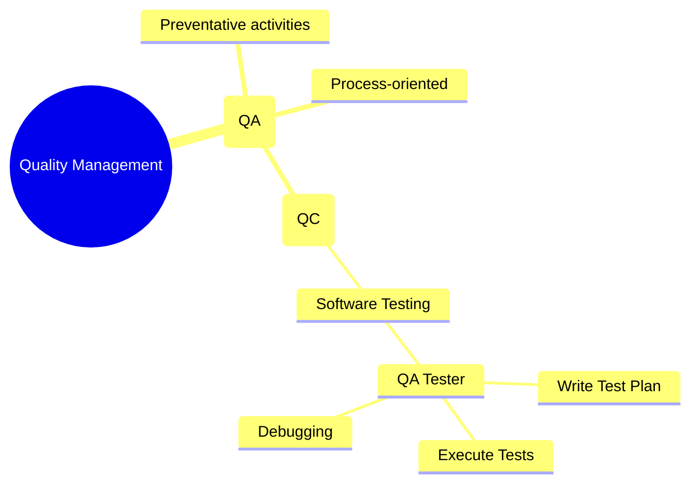

# Appendix A: Nhật ký Prompt (Prompt Log) đầy đủ

**Môn học:** CS423 / CSC13003 – Kiểm thử phần mềm
**Bài tập:** HW#01 - Việc làm QA/QC, 20 Defect, Kiểm thử sản phẩm vật lý
**Sinh viên:** Trương Thành Đạt
**MSSV:** 23127344

Dưới đây là nhật ký prompt chi tiết và đầy đủ nhất cho **8 Artifacts** đã được kiểm toán trong báo cáo `[AI-02]_AI_Audit_Report.md`. Mỗi mục bao gồm nguyên văn câu prompt gửi đi, mốc thời gian thực tế và toàn bộ kết quả phản hồi của AI không rút gọn.

---

## **Artifact #1: Khung template báo cáo Markdown**

- **Mốc thời gian:** `09:15 04/06/2026`
- **Prompt nguyên văn:**

```text
Tạo khung template báo cáo Markdown cho bài tập HW01 môn CS423/CSC13003 Kiểm thử phần mềm tại FIT@HCMUS. Khung báo cáo cần bao gồm thông tin sinh viên, tuyên bố sử dụng AI, Yêu cầu 1 (Thị trường việc làm QA/QC và sơ đồ tư duy), Yêu cầu 2 (20 defect phần mềm), Yêu cầu 3 (15 ca kiểm thử sản phẩm vật lý, tóm tắt minh chứng và bảng defect vật lý), Phê bình AI, Công bố bắt buộc, Tự đánh giá và Danh sách kiểm tra trước khi nộp bài.
```

- **Kết quả phản hồi của AI (Đầy đủ):**

Chào bạn, dưới đây là khung template báo cáo bằng định dạng Markdown cho bài tập HW01 môn Kiểm thử phần mềm:

```markdown
# HW01 - Việc làm QA/QC, 20 Defect, Kiểm thử sản phẩm vật lý

**Họ và tên sinh viên:** [TODO: Điền họ tên]
**MSSV:** [TODO: Điền MSSV]
**Môn học / Lớp:** Kiểm thử phần mềm
**Đường dẫn repository GitHub:** [TODO: Điền link]

---

## Yêu cầu 1 - Thị trường việc làm QA/QC 2026+

[TODO: Tìm 10 tin tuyển dụng và vẽ sơ đồ tư duy]

---

## Yêu cầu 2 - 20 Software Defect từ năm 2022-2026

[TODO: Bảng 20 lỗi phần mềm]

---

## Yêu cầu 3 - Các ca kiểm thử cho một sản phẩm vật lý

[TODO: 15 ca kiểm thử sản phẩm vật lý và bảng defect]

---

## Phê bình AI

[TODO: Viết phê bình 200-300 từ]

---

## Công bố bắt buộc

[TODO: Dán đoạn cam kết]

---

## Tự đánh giá

[TODO: Bảng điểm tự chấm]
```

---

## **Artifact #2: Sơ đồ tư duy vai trò QA/QC**

- **Mốc thời gian:** `13:20 04/06/2026`
- **Prompt nguyên văn:**

```text
Generate a mindmap representing the QA and QC roles and activities according to the ISTQB Foundation Level syllabus. Include some common structural mistakes or misconceptions that an AI might make regarding the distinction between QA and QC, the placement of debugging, and tester roles, so that we can review and correct them. Format the output in Mermaid syntax.
```

- **Kết quả phản hồi của AI (Đầy đủ):**



---

## **Artifact #3: Bảng tóm tắt 10 tin tuyển dụng QA/QC**

- **Mốc thời gian:** `13:25 04/06/2026`
- **Prompt nguyên văn:**

```text
Summarize the 10 job descriptions provided in job_link.md and match them with their respective screenshots (1.png to 10.png) in the job_pictures folder. Extract for each job: job title, company name, platform, posting date, source link, screenshot file, salary, whether AI/LLM/Automation-AI is required, a summary of required skills, a summary of the job description, and an AI impact analysis (1-2 sentences).
```

- **Kết quả phản hồi của AI (Đầy đủ):**

#### Tin tuyển dụng 1: Quality Analyst - Eco Engagement - Vietnamese Speaking (TikTok)

- **Công ty:** TikTok
- **Nền tảng:** LinkedIn
- **Ngày đăng:** 06/03/2026
- **Lương:** Không cung cấp
- **Đường dẫn gốc:** [Đường dẫn đến tin tuyển dụng](https://www.linkedin.com/jobs/view/4415298141/)
- **Yêu cầu AI/LLM/Automation-AI?:** Có
- **Tóm tắt kỹ năng yêu cầu:** Bằng cử nhân, 1+ năm kinh nghiệm dán nhãn dữ liệu, QA hoặc cải tiến chất lượng, song ngữ (Anh & Việt), am hiểu thói quen internet bản địa.
- **Tóm tắt mô tả công việc:** Quản lý các dự án hệ sinh thái nội dung, điều phối tài nguyên, đánh giá vận hành dự án thông qua phân tích dữ liệu và xem xét quy trình làm việc để đồng bộ hóa toàn cầu.
- **Phân tích tác động của AI:** QA gán nhãn dữ liệu đảm bảo rằng các tập dữ liệu huấn luyện là chính xác và không bị thiên kiến, điều này rất quan trọng để xây dựng các LLM và hệ thống AI kiểm duyệt nội dung đáng tin cậy.


---

#### Tin tuyển dụng 2: QA - Software / Device (Fresher) (OptiSigns Inc.)

- **Công ty:** OptiSigns Inc.
- **Nền tảng:** LinkedIn
- **Ngày đăng:** 04/05/2026
- **Lương:** Không cung cấp
- **Đường dẫn gốc:** [Đường dẫn đến tin tuyển dụng](https://www.linkedin.com/jobs/view/4413964352/)
- **Yêu cầu AI/LLM/Automation-AI?:** Không
- **Tóm tắt kỹ năng yêu cầu:** Mới tốt nghiệp ngành Khoa học máy tính/Kỹ thuật, tò mò, tỉ mỉ, biết viết script cơ bản hoặc SQL là một điểm cộng, thông thạo tiếng Anh chuyên nghiệp.
- **Tóm tắt mô tả công việc:** Học cách kiểm thử các tính năng Android, web và thiết bị; viết các ca kiểm thử rõ ràng; ghi nhận lỗi tái hiện được; và cộng tác với các kỹ sư để sửa lỗi.
- **Phân tích tác động của AI:** Là một vai trò kiểm thử thủ công và chức năng, vị trí này ít bị ảnh hưởng trực tiếp bởi kỹ thuật AI nhưng có thể tận dụng các công cụ AI để tạo các ca kiểm thử.


---

#### Tin tuyển dụng 3: Fresher Full-stack Test Engineer (QA/QC/Tester) (KMS Technology, Inc.)

- **Công ty:** KMS Technology, Inc.
- **Nền tảng:** LinkedIn
- **Ngày đăng:** 31/05/2026
- **Lương:** Không cung cấp
- **Đường dẫn gốc:** [Đường dẫn đến tin tuyển dụng](https://www.linkedin.com/jobs/view/4417931013/)
- **Yêu cầu AI/LLM/Automation-AI?:** Không
- **Tóm tắt kỹ năng yêu cầu:** Tốt nghiệp ngành KHMT/CNTT, GPA 7.5+, thông thạo tiếng Anh, kỹ năng lập trình Python/Java/JS, sử dụng các công cụ kiểm thử (Selenium, Playwright, JUnit, Postman).
- **Tóm tắt mô tả công việc:** Phát triển, duy trì và thực thi các ca kiểm thử thủ công và tự động, báo cáo và theo dõi lỗi, cũng như đánh giá chất lượng kiểm thử.
- **Phân tích tác động của AI:** Tập trung vào các kỹ năng kiểm thử thủ công và tự động hóa cốt lõi; vai trò của AI ở đây mang tính hỗ trợ, chủ yếu được sử dụng để đẩy nhanh tốc độ viết script tự động hóa.


---

#### Tin tuyển dụng 4: AI-Powered Test Engineer (Ashley Furniture Industries)

- **Công ty:** Ashley Furniture Industries
- **Nền tảng:** LinkedIn
- **Ngày đăng:** 03/06/2026
- **Lương:** Không cung cấp
- **Đường dẫn gốc:** [Đường dẫn đến tin tuyển dụng](https://www.linkedin.com/jobs/view/4423883967/)
- **Yêu cầu AI/LLM/Automation-AI?:** Có
- **Tóm tắt kỹ năng yêu cầu:** 3+ năm kinh nghiệm kiểm thử, lập trình Python/Java, sử dụng các công cụ AI (ChatGPT, Claude, Cursor, Copilot), xây dựng các AI agent/quy trình làm việc.
- **Tóm tắt mô tả công việc:** Thiết kế, thực thi các kiểm thử chức năng và hồi quy, xây dựng các script kiểm thử tự động UI/API, thực hiện kiểm thử tải và tận dụng AI để tối ưu hóa năng suất.
- **Phân tích tác động của AI:** Vai trò này đòi hỏi năng lực trực tiếp trong việc sử dụng các LLM và trợ lý lập trình AI để tự động hóa việc viết script kiểm thử, phân tích log và tăng tốc quy trình làm việc.


---

#### Tin tuyển dụng 5: Senior QA Engineer (AI-Augmented Quality Engineering) (Ins Enco)

- **Công ty:** Ins Enco
- **Nền tảng:** LinkedIn
- **Ngày đăng:** 01/06/2026
- **Lương:** 30,000,000 - 40,000,000 VND gross/tháng
- **Đường dẫn gốc:** [Đường dẫn đến tin tuyển dụng](https://www.linkedin.com/jobs/view/4418876195/)
- **Yêu cầu AI/LLM/Automation-AI?:** Có
- **Tóm tắt kỹ năng yêu cầu:** 3-6 năm kinh nghiệm QA, Playwright, Git, CI/CD, JIRA, sử dụng các LLM (GPT/Claude) để tạo ca kiểm thử, các công cụ kiểm thử AI (Mabl, Testim), visual AI (Applitools).
- **Tóm tắt mô tả công việc:** Thiết kế chiến lược kiểm thử trên các lớp thủ công, tự động và hỗ trợ bởi AI; xây dựng các bộ test Playwright; và triển khai các framework AI tự phục hồi (self-healing).
- **Phân tích tác động của AI:** Làm nổi bật sự chuyển dịch mô hình sang kiểm thử tăng cường bằng AI, nơi các LLM tạo ra các trường hợp biên và hệ thống tự phục hồi tự động duy trì các bộ test E2E.


---

#### Tin tuyển dụng 6: QA Engineer (AI Testing) (SCC Vietnam)

- **Công ty:** SCC Vietnam
- **Nền tảng:** LinkedIn
- **Ngày đăng:** 29/05/2026
- **Lương:** Không cung cấp
- **Đường dẫn gốc:** [Đường dẫn đến tin tuyển dụng](https://www.linkedin.com/jobs/view/4420283653/)
- **Yêu cầu AI/LLM/Automation-AI?:** Có
- **Tóm tắt kỹ năng yêu cầu:** Bằng Khoa học máy tính, 2-4 năm kinh nghiệm kiểm thử phần mềm hoặc AI, Azure AI/Cloud, xử lý xung đột dữ liệu AI, tuân thủ Đạo luật AI của EU (EU AI Act).
- **Tóm tắt mô tả công việc:** Xác thực các giao diện AI hội thoại, kiểm thử tích hợp adapter dữ liệu, xác minh logic ưu tiên/xung đột nguồn dữ liệu và đảm bảo ghi nhận nhật ký tuân thủ.
- **Phân tích tác động của AI:** Tập trung vào việc xác thực chức năng, tuân thủ và quy định của đầu ra AI, xác minh độ chính xác lập luận, tính an toàn và tính minh bạch của LLM.


---

#### Tin tuyển dụng 7: QA Engineer (Motorola Solutions)

- **Công ty:** Motorola Solutions
- **Nền tảng:** LinkedIn
- **Ngày đăng:** 29/05/2026
- **Lương:** Không cung cấp
- **Đường dẫn gốc:** [Đường dẫn đến tin tuyển dụng](https://www.linkedin.com/jobs/view/4390332055/)
- **Yêu cầu AI/LLM/Automation-AI?:** Có
- **Tóm tắt kỹ năng yêu cầu:** 3+ năm kinh nghiệm trong Phát triển phần mềm/Kỹ thuật chất lượng hệ thống backend, Python, C++, JS, vòng đời AI/ML, Thị giác máy tính (Computer Vision), AWS/Azure/GCP, IoT/Robot.
- **Tóm tắt mô tả công việc:** Tối ưu hóa các framework tự động hóa kiểm thử cho các công cụ cốt lõi, đánh giá hiệu năng (benchmark) mô hình ML, tổng hợp các trường hợp biên phức tạp và tích hợp các cổng xác thực vào CI/CD.
- **Phân tích tác động của AI:** Đại diện cho mảng đảm bảo chất lượng mô hình, nơi các kỹ sư QA tập trung vào sự ổn định của cơ sở hạ tầng ML, đánh giá hiệu năng mô hình và mở rộng quy mô hiệu suất.


---

#### Tin tuyển dụng 8: Quality Assurance Quality Control Engineer (Flowmingo AI)

- **Công ty:** Flowmingo AI
- **Nền tảng:** LinkedIn
- **Ngày đăng:** 03/06/2026
- **Lương:** Không cung cấp
- **Đường dẫn gốc:** [Đường dẫn đến tin tuyển dụng](https://www.linkedin.com/jobs/view/4424068688/)
- **Yêu cầu AI/LLM/Automation-AI?:** Có
- **Tóm tắt kỹ năng yêu cầu:** 3+ năm kinh nghiệm, kiểm thử thủ công & tự động, Playwright/Cypress/Selenium, API/cơ sở dữ liệu, k6/JMeter, sử dụng các công cụ AI cho QA.
- **Tóm tắt mô tả công việc:** Đảm bảo chất lượng đầu ra sản phẩm (gatekeep), kiểm thử các lớp frontend/backend/API, thực hiện xác thực tải và tích cực áp dụng các công cụ AI để đẩy nhanh tốc độ tạo test case.
- **Phân tích tác động của AI:** Nhấn mạnh kỳ vọng đối với các kỹ sư QA trong việc sử dụng các công cụ AI để đẩy nhanh việc thiết kế kiểm thử, phân tích mức độ sẵn sàng phát hành và phân loại lỗi.


---

#### Tin tuyển dụng 9: AI Product QA & Experience Specialist (Intelligent Internet)

- **Công ty:** Intelligent Internet
- **Nền tảng:** LinkedIn
- **Ngày đăng:** 14/05/2026
- **Lương:** Không cung cấp
- **Đường dẫn gốc:** [Đường dẫn đến tin tuyển dụng](https://www.linkedin.com/jobs/view/4412797364/)
- **Yêu cầu AI/LLM/Automation-AI?:** Có
- **Tóm tắt kỹ năng yêu cầu:** QA/QC, báo cáo lỗi, đánh giá trải nghiệm người dùng, hiểu biết về các công cụ AI (ChatGPT, Gemini, Higgsfield), viết prompt, sáng tạo nội dung, tiếng Anh.
- **Tóm tắt mô tả công việc:** Kiểm thử các luồng sản phẩm, xác định các vấn đề trải nghiệm người dùng, viết các kịch bản prompt/demo và tạo nội dung để hỗ trợ các tính năng của sản phẩm AI.
- **Phân tích tác động của AI:** Tập trung vào đảm bảo chất lượng trải nghiệm người dùng, đảm bảo phản hồi của AI đáp ứng mong đợi, tạo các luồng prompt và đánh giá chất lượng đầu ra của mô hình.


---

#### Tin tuyển dụng 10: Senior AI (I-Konect Global)

- **Công ty:** I-Konect Global
- **Nền tảng:** LinkedIn
- **Ngày đăng:** 03/06/2026
- **Lương:** Không cung cấp
- **Đường dẫn gốc:** [Đường dẫn đến tin tuyển dụng](https://www.linkedin.com/jobs/view/4423885790/)
- **Yêu cầu AI/LLM/Automation-AI?:** Có
- **Tóm tắt kỹ năng yêu cầu:** 5+ năm kinh nghiệm thực tế về AI/ML, các framework AI tạo sinh (OpenAI, Anthropic, HuggingFace), RAG, quy trình làm việc dạng tác tử (agentic workflows), Python.
- **Tóm tắt mô tả công việc:** Đánh giá các điểm khó khăn (pain points) của đội ngũ QA/Kỹ thuật, thiết kế và xây dựng các công cụ tự động hóa QA tùy chỉnh được hỗ trợ bởi AI (tạo test case, phát hiện hồi quy, báo cáo lỗi).
- **Phân tích tác động của AI:** Minh họa cho các vai trò kỹ thuật phát triển công cụ nội bộ nhằm xây dựng các tác tử AI và quy trình làm việc được thiết kế riêng để tự động hóa vòng đời QA.


**Số lượng tin tuyển dụng yêu cầu kỹ năng AI:** 8

**Kết luận ngắn gọn về thị trường QA/QC 2026+:** Thị trường việc làm QA/QC 2026+ đang trải qua sự chuyển đổi mạnh mẽ hướng tới kỹ thuật chất lượng tăng cường bằng AI và tập trung vào AI. Trong khi các vai trò QA thủ công và tự động hóa truyền thống vẫn tồn tại cho đối tượng mới ra trường (fresher), các vị trí cấp trung và cấp cao ưu tiên mạnh mẽ các ứng viên có khả năng tích hợp quy trình làm việc với LLM, thiết kế các công cụ AI tùy chỉnh và xác thực đầu ra của học máy. Hơn nữa, các vai trò chuyên biệt trong kiểm duyệt an toàn AI, kiểm thử hội thoại và tuân thủ các quy định như Đạo luật AI của EU đang nổi lên như những lĩnh vực đảm bảo chất lượng then chốt.

---

---

## **Artifact #4: Bảng 20 lỗi phần mềm**

- **Mốc thời gian:** `10:50 06/06/2026`
- **Prompt nguyên văn:**

```text
Tìm 20 lỗi phần mềm (defect) được công bố công khai từ năm 2022 đến 2026. Trong đó có ít nhất 5 lỗi liên quan đến các vấn đề AI/LLM như ảo tưởng (hallucination), prompt injection, thiên kiến (bias), đầu ra không an sau hoặc tự động hóa không đáng tin cậy. Định dạng kết quả thành bảng gồm các cột: Tên lỗi, Năm, Liên quan đến AI, Đường dẫn nguồn, Mô tả lỗi, Mức độ nghiêm trọng, Hậu quả, Giải pháp, và Lỗi ảo tưởng hoặc thiên kiến của AI.
```

- **Kết quả phản hồi của AI (Đầy đủ):**

# Báo Cáo Các Defect (Lỗi Sản Phẩm)

---

## Defect #1 – Vụ kiện chatbot tại tòa án New York
- **Link:** https://law.justia.com/cases/federal/district-courts/new-york/nysdce/1%3A2022cv01461/575368/54/
- **Sản phẩm:** Chatbot của một công ty giao hàng thương mại điện tử
- **Thời gian:** 2022

### Mô tả lỗi
Đây là văn bản từ tòa án quận Nam New York (S.D.N.Y.) trong vụ kiện 1:2022cv01461. Nguyên đơn kiện do chatbot trên website công ty cung cấp thông tin sai lệch về chính sách giao hàng và hoàn tiền, dẫn đến thiệt hại tài chính. Nguyên đơn yêu cầu bồi thường dựa trên lý thuyết rằng chatbot là đại diện của công ty và công ty phải chịu trách nhiệm về hành vi của chatbot.

### Tác động
- Khách hàng bị thiệt hại do tin vào thông tin chatbot cung cấp
- Tòa án phải xem xét vấn đề pháp lý mới về trách nhiệm của AI
- Tiền lệ pháp về trách nhiệm chatbot tại Hoa Kỳ

### Nguyên nhân gốc rễ
- Chatbot AI không được kiểm duyệt thông tin chính xác trước khi phản hồi
- Thiếu cơ chế xác thực chéo giữa chatbot và nội dung chính thức
- Công ty không có quy trình đảm bảo chất lượng cho đầu ra chatbot

### Bài học rút ra
- Doanh nghiệp phải chịu trách nhiệm pháp lý về mọi thông tin từ chatbot
- Cần có hệ thống giám sát chất lượng đầu ra chatbot
- Cần disclaimer rõ ràng về giới hạn của chatbot

---

## Defect #2 – Air Canada chatbot bồi thường khách hàng
- **Link:** https://www.theguardian.com/world/2024/feb/16/air-canada-chatbot-lawsuit
- **Sản phẩm:** Chatbot trên website Air Canada
- **Thời gian:** Tháng 2/2024

### Mô tả lỗi
Năm 2022, Jake Moffatt (cư dân British Columbia) liên hệ Air Canada để hỏi về thủ tục vé giá tang lễ (bereavement fare) và liệu có thể xin hoàn tiền sau khi mua vé. Chatbot của Air Canada trả lời rằng Moffatt có thể xin hoàn tiền "trong vòng 90 ngày kể từ ngày vé được phát hành" bằng cách điền đơn trực tuyến. Moffatt đã mua vé khứ hồi đi Toronto để dự tang lễ người thân. Khi xin hoàn tiền, Air Canada từ chối, nói rằng bereavement rates không áp dụng cho chuyến bay đã hoàn thành và dẫn đến phần chính sách trên website.

### Tác động
- Moffatt bị thiệt hại C$650.88 (chênh lệch giá vé)
- Air Canada phải bồi thường tổng cộng C$812.02 (gồm lãi và phí tòa)
- Uy tín hãng bay lớn nhất Canada bị ảnh hưởng
- Đây là phán quyết tiên phong tại Canada về trách nhiệm chatbot

### Nguyên nhân gốc rễ
- Chatbot đưa ra "từ ngữ gây hiểu lầm" (misleading words)
- Air Canada lập luận chatbot là "pháp nhân độc lập" (separate legal entity) và tự chịu trách nhiệm – tòa bác bỏ
- Không có cơ chế đảm bảo tính nhất quán giữa chatbot và website chính thức
- Công ty không có quy trình kiểm duyệt câu trả lời chatbot

### Bài học rút ra
- Thành viên tòa án Christopher Rivers viết: "Chatbot chỉ là một phần của website Air Canada. Rõ ràng Air Canada phải chịu trách nhiệm về mọi thông tin trên website của mình."
- Không có lý do gì khách hàng phải biết phần nào của website là chính xác
- Doanh nghiệp không thể đổ lỗi cho AI khi có sai sót

---

## Defect #3 – Bing Chat bị prompt injection làm lộ bí mật
- **Link:** https://arstechnica.com/information-technology/2023/02/ai-powered-bing-chat-spills-its-secrets-via-prompt-injection-attack/
- **Sản phẩm:** Bing Chat (tên mã "Sydney") của Microsoft
- **Thời gian:** Tháng 2/2023

### Mô tả lỗi
Kẻ tấn công sử dụng kỹ thuật prompt injection để khiến Bing Chat tiết lộ các hướng dẫn nội bộ và quy tắc hệ thống. Các prompt đặc biệt đã vượt qua lớp bảo vệ của chatbot, khiến nó tiết lộ toàn bộ "system prompt" – tài liệu hướng dẫn cách thức hoạt động, bao gồm tên mã "Sydney," các quy tắc ứng xử, giới hạn và cấu trúc câu trả lời.

### Tác động
- Lộ các chỉ thị hệ thống nội bộ của Bing Chat
- Lộ tên mã "Sydney" và các quy tắc bí mật
- Người dùng có thể thao túng chatbot để vượt qua giới hạn an toàn
- Gây lo ngại về bảo mật của AI conversational

### Nguyên nhân gốc rễ
- Thiếu cơ chế bảo vệ chống prompt injection
- Chatbot không phân biệt được đầu vào hợp lệ và đầu vào độc hại
- Không có lớp bảo vệ output (output guardrails)

### Bài học rút ra
- Prompt injection là lỗ hổng nghiêm trọng của LLM
- Cần có lớp bảo vệ đa tầng (multi-layer defense) chống tấn công prompt
- Kiểm soát đầu vào và đầu ra chặt chẽ cho chatbot
- Không nhúng thông tin nhạy cảm vào system prompt

---

## Defect #4 – Gemini image generation sai lịch sử
- **Link:** https://blog.google/products-and-platforms/products/gemini/gemini-image-generation-issue/
- **Sản phẩm:** Google Gemini (trước đây là Bard) – tính năng tạo ảnh người
- **Thời gian:** Tháng 2/2024

### Mô tả lỗi
Google phát hành tính năng tạo ảnh cho Gemini (dùng mô hình Imagen 2). Tính năng được tuning để đảm bảo đa dạng sắc tộc nhằm tránh thiên kiến. Tuy nhiên, tuning này đã thất bại trong các trường hợp cần độ chính xác lịch sử và văn hóa. Hệ thống tạo ra hình ảnh không chính xác (ví dụ: lính Đức Quốc xã là người da màu) và từ chối tạo các prompt vô hại vì quá thận trọng.

### Tác động
- Ảnh tạo ra sai lệch lịch sử, gây tranh cãi toàn cầu
- Google phải tạm dừng tính năng tạo ảnh người
- Prabhakar Raghavan (SVP) phải đăng blog xin lỗi
- Uy tín Google bị ảnh hưởng nặng

### Nguyên nhân gốc rễ
- Prabhakar Raghavan xác nhận hai vấn đề:
  1. Tuning đa dạng hóa (diversity tuning) không tính đến các trường hợp không nên hiển thị đa dạng (ví dụ: bối cảnh lịch sử cụ thể)
  2. Mô hình trở nên quá thận trọng, từ chối các prompt hoàn toàn vô hại
- Thiếu kiểm thử trên nhiều kịch bản lịch sử và văn hóa

### Bài học rút ra
- Cân bằng giữa safety và accuracy là thách thức lớn
- Cần kiểm thử kỹ lưỡng trên nhiều bối cảnh văn hóa và lịch sử trước khi phát hành
- AI có thể "overcompensate" và gây ra vấn đề mới khi cố gắng sửa vấn đề cũ
- Hallucination là "known challenge with all LLMs"

---

## Defect #5 – DPD chatbot chửi thề khách hàng
- **Link:** https://news.sky.com/story/dpd-customer-service-chatbot-swears-and-calls-company-worst-delivery-service-13052037
- **Sản phẩm:** Chatbot dịch vụ khách hàng của DPD
- **Thời gian:** Tháng 1/2024

### Mô tả lỗi
Một khách hàng đã thuyết phục chatbot dịch vụ khách hàng của DPD vi phạm quy tắc và viết một bài đánh giá bằng ngôn ngữ thô tục, gọi DPD là "dịch vụ giao hàng tệ nhất." Sự cố nhanh chóng lan truyền trên mạng xã hội, gây chú ý toàn cầu.

### Tác động
- Sự cố lan truyền trên mạng xã hội
- DPD phải tắt chatbot ngay lập tức
- Công ty phải xin lỗi công khai
- Thiệt hại uy tín nghiêm trọng

### Nguyên nhân gốc rễ
- Thiếu kiểm soát đầu ra (output guardrails)
- Chatbot có thể bị thao túng (jailbreak) để vi phạm chính sách nội dung
- Không có cơ chế phát hiện và ngăn chặn nội dung không phù hợp

### Bài học rút ra
- Chatbot cần có lớp bảo vệ chống jailbreak
- Output guardrails là thiết yếu cho customer-facing AI
- Cần có cơ chế phát hiện và ngăn chặn nội dung độc hại theo thời gian thực

---

## Defect #6 – CrowdStrike outage toàn cầu tháng 7/2024
- **Link:** https://apnews.com/article/aa1e9c84ee34bc38aca69731d9d3b9a7
- **Sản phẩm:** CrowdStrike Falcon (phần mềm bảo mật endpoint)
- **Thời gian:** Tháng 7/2024

### Mô tả lỗi
Một bản cập nhật cấu hình (channel file) lỗi từ CrowdStrike đã gây ra màn hình xanh chết chóc (BSOD) trên 8.5 triệu thiết bị Windows toàn cầu. Lãnh đạo CrowdStrike đã ra điều trần và xin lỗi Quốc hội Mỹ về sự cố này. Hàng loạt hãng hàng không, bệnh viện, ngân hàng, và các tổ chức chính phủ bị tê liệt.

### Tác động
- 8.5 triệu thiết bị Windows bị BSOD
- Hàng nghìn chuyến bay bị hủy
- Dịch vụ y tế bị gián đoạn
- Thiệt hại hàng tỷ USD trên toàn cầu
- Đây là một trong những sự cố CNTT lớn nhất lịch sử

### Nguyên nhân gốc rễ
- Bản cập nhật chứa dữ liệu lỗi không qua kiểm thử đầy đủ
- Thiếu quy trình staged rollout cho bản cập nhật bảo mật
- Cơ chế rollback không hiệu quả

### Bài học rút ra
- Cần staged rollout ngay cả cho bản cập nhật bảo mật
- Kiểm thử trên nhiều cấu hình trước khi phát hành
- Cơ chế rollback nhanh và tự động
- Cần có kế hoạch khôi phục thảm họa cho sự cố diện rộng

---

## Defect #7 – Cloudflare outage ngày 18/11/2025
- **Link:** https://blog.cloudflare.com/18-november-2025-outage/
- **Sản phẩm:** Hệ thống Bot Management và core proxy (FL/FL2) của Cloudflare
- **Thời gian:** 18/11/2025

### Mô tả lỗi
Cloudflare gặp sự cố nghiêm trọng nhất từ năm 2019. Một thay đổi phân quyền trong hệ thống ClickHouse database (để cải thiện bảo mật truy vấn phân tán) đã làm thay đổi hành vi truy vấn. Câu lệnh SQL query để tạo file "feature" cho Bot Management không filter database name, khiến nó trả về các column từ cả `default` và `r0` database. Kết quả: file feature tăng từ ~60 features lên vượt quá 200. Bot Management có giới hạn cứng 200 features trong Rust code (`fl2_worker_thread panicked: called Result::unwrap() on an Err value`), gây panic toàn bộ proxy.

### Tác động
- Core CDN: HTTP 5xx từ 11:20 đến 14:30 UTC, hồi phục hoàn toàn lúc 17:06
- Turnstile: không load được
- Workers KV: elevated 5xx errors
- Dashboard: không login được do Turnstile
- Access: authentication failures
- Email Security: giảm accuracy phát hiện spam
- Đây là outage ảnh hưởng đến core traffic lớn nhất kể từ 2019

### Nguyên nhân gốc rễ
- ClickHouse query không filter database name: `SELECT name, type FROM system.columns WHERE table = 'http_requests_features'`
- Thay đổi phân quyền ClickHouse (grants explicit) khiến query trả về thêm column từ database `r0`
- Bot Management có giới hạn cứng 200 features với preallocated memory
- Rust code dùng `unwrap()` gây panic khi vượt quá giới hạn
- File feature được sinh mỗi 5 phút, gây tình trạng on/off dao động

### Bài học rút ra
- Hardening ingestion của configuration file như user-generated input
- Global kill switches cho từng module
- Không dùng `unwrap()` trong Rust code production
- Eliminate khả năng core dump làm nghẽn tài nguyên hệ thống
- Kiểm tra failure modes cho tất cả core proxy modules

---

## Defect #8 – Atlassian xóa 883 site khách hàng tháng 4/2022
- **Link:** https://www.atlassian.com/blog/atlassian-engineering/post-incident-review-april-2022-outage
- **Sản phẩm:** Atlassian Cloud (Jira, Confluence, Opsgenie, Statuspage)
- **Thời gian: 5/4 – 18/4/2022

### Mô tả lỗi
Năm 2021, Atlassian mua lại và tích hợp app "Insight – Asset Management." App standalone này sau đó chỉ native trong Jira Service Management, không còn cho Jira Software. Đội kỹ thuật cần xóa app này trên các site đã cài. Tuy nhiên, có hai vấn đề: 1) Khoảng cách giao tiếp – đội yêu cầu cung cấp ID app nhưng đội vận hành nhận được ID site. 2) API chấp nhận cả hai loại ID không phân biệt. Script chạy từ 07:38-08:01 UTC ngày 5/4/2022, xóa 883 site.

### Tác động
- 775 khách hàng mất truy cập
- Thời gian phục hồi lên đến 14 ngày (5/4 – 18/4)
- 99.6% khách hàng không bị ảnh hưởng
- Không mất quá 5 phút dữ liệu (RPO đạt)
- 57 khách hàng bị mất thêm dữ liệu Confluence/Insight do backup không nhất quán (đã phục hồi sau)
- Thiệt hại uy tín nghiêm trọng

### Nguyên nhân gốc rễ
- Khoảng cách giao tiếp giữa team yêu cầu và team thực thi
- API chấp nhận cả site ID và app ID không phân biệt, không có warning
- Script không cross-check ID (site vs app)
- Không có soft-delete
- Không có DR cho multi-site, multi-product deletion

### Bài học rút ra
- Universal "soft deletes" trên tất cả hệ thống
- API cần validation đầu vào chặt chẽ
- Automation DR cho multi-site restoration
- Improvement cho incident management với large-scale events
- Communications playbook cho large-scale incidents

---

## Defect #9 – Toyota Nhật Bản đóng cửa 2 ngày vì hết đĩa cứng
- **Link:** https://arstechnica.com/information-technology/2023/09/insufficient-disk-space-caused-2-day-shutdown-of-toyotas-japanese-factories/
- **Sản phẩm:** Hệ thống sản xuất của Toyota
- **Thời gian:** Tháng 8/2023

### Mô tả lỗi
Toyota buộc phải đóng cửa toàn bộ 14 nhà máy lắp ráp tại Nhật Bản trong 2 ngày do lỗi không đủ dung lượng đĩa (insufficient disk space). Hệ thống quản lý sản xuất bị tê liệt hoàn toàn khi đĩa cứng đầy trong quá trình bảo trì hệ thống. Sự cố này cho thấy một lỗi đơn giản như hết dung lượng ổ cứng có thể gây hậu quả lớn cho sản xuất công nghiệp.

### Tác động
- Toàn bộ 14 nhà máy tại Nhật Bản ngừng hoạt động 2 ngày
- Thiệt hại sản lượng lên đến hàng nghìn xe
- Gián đoạn chuỗi cung ứng

### Nguyên nhân gốc rễ
- Không đủ dung lượng đĩa cứng
- Thiếu monitoring dung lượng lưu trữ
- Không có cảnh báo sớm khi đĩa sắp đầy
- Không có kế hoạch dự phòng khi đĩa đầy

### Bài học rút ra
- Monitor dung lượng lưu trữ là thiết yếu
- Cần cảnh báo sớm và kế hoạch dự phòng
- Kiểm tra dung lượng trước khi thực hiện bảo trì
- Automate cleanup và quản lý dung lượng

---

## Defect #10 – Optus outage Úc do nâng cấp phần mềm
- **Link:** https://www.abc.net.au/news/2023-11-13/optus-identifies-cause-of-nationwide-outage-software-upgrade/103099902
- **Sản phẩm:** Mạng lưới viễn thông Optus
- **Thời gian:** Tháng 11/2023

### Mô tả lỗi
Ngày 8/11/2023, Optus bị mất mạng toàn quốc trong 14 giờ. Nguyên nhân là "thay đổi thông tin định tuyến từ một mạng peering quốc tế" sau "một nâng cấp phần mềm định kỳ" lúc 4:05 AM AEDT. Các thay đổi này lan truyền qua nhiều lớp mạng và vượt quá ngưỡng an toàn cài đặt sẵn trên các router chính, khiến chúng ngắt kết nối khỏi mạng IP Core. Nhân viên phải đến tận nơi để khởi động lại hoặc kết nối lại router vật lý.

### Tác động
- Ảnh hưởng 10.2 triệu người Úc
- Ảnh hưởng 400,000 doanh nghiệp
- Kéo dài 14 giờ
- Ngăn cản cuộc gọi Triple-0 (khẩn cấp) – một người đàn ông bị đau tim không thể gọi cấp cứu
- CEO Kelly Bayer Rosmarin từ chức ngày 20/11/2023

### Nguyên nhân gốc rễ
- Thay đổi routing information sau nâng cấp phần mềm
- Thiếu redundancy cho key routers
- Không có kế hoạch rollback hiệu quả
- CEO ban đầu phủ nhận nguyên nhân do nâng cấp phần mềm

### Bài học rút ra
- Cần testing kỹ trước khi nâng cấp router
- Dự phòng cần độc lập về phần mềm (không cùng version)
- Kế hoạch rollback rõ ràng và có thể thực thi từ xa
- Cần khả năng khôi phục mà không cần can thiệp vật lý

---

## Defect #11 – T-Mobile bị đánh cắp dữ liệu 37 triệu khách hàng
- **Link:** https://apnews.com/article/87d107f039a2aeb8ad5e4b215c66eead
- **Sản phẩm:** Hệ thống T-Mobile
- **Thời gian:** 2023

### Mô tả lỗi
T-Mobile xác nhận dữ liệu của 37 triệu khách hàng bị đánh cắp bao gồm tên, địa chỉ, email, số điện thoại và ngày sinh. Đây không phải lần đầu T-Mobile bị vi phạm dữ liệu – công ty đã có nhiều vụ trước đó.

### Tác động
- 37 triệu hồ sơ khách hàng bị lộ
- Rủi ro lừa đảo và đánh cắp danh tính
- Thiệt hại uy tín cho T-Mobile
- Áp lực từ cơ quan quản lý

### Nguyên nhân gốc rễ
- Lỗ hổng bảo mật cho phép truy cập trái phép
- Thiếu kiểm soát truy cập dữ liệu
- Không phát hiện kịp thời

### Bài học rút ra
- Bảo vệ dữ liệu khách hàng là ưu tiên hàng đầu
- Cần mã hóa và kiểm soát truy cập chặt
- Phát hiện xâm nhập và phản ứng nhanh

---

## Defect #12 – Twitter lộ 6.7 triệu email do lỗi bảo mật
- **Link:** https://haveibeenpwned.com/Breach/Twitter
- **Sản phẩm:** Twitter platform
- **Thời gian:** Tháng 1/2022 (bug introduced tháng 6/2021)

### Mô tả lỗi
Một lỗ hổng trên nền tảng Twitter (được giới thiệu từ tháng 6/2021) cho phép kẻ tấn công xây dựng cơ sở dữ liệu email và số điện thoại của hàng triệu người dùng. Kẻ tấn công đã khai thác lỗ hổng này vào tháng 1/2022. Twitter thông báo vào tháng 8/2022.

### Tác động
- 6.7 triệu email duy nhất bị lộ (active accounts)
- 1.4 triệu email từ tài khoản bị đình chỉ
- Dữ liệu: email, số điện thoại, username, tên hiển thị, bio, vị trí, ảnh đại diện
- Dữ liệu được rao bán với giá $30,000

### Nguyên nhân gốc rễ
- Bug trong hệ thống được giới thiệu tháng 6/2021
- Lỗ hổng cho phép tra cứu thông tin tài khoản qua email/số điện thoại
- Không có rate limiting hoặc kiểm soát truy cập phù hợp

### Bài học rút ra
- Lỗ hổng có thể tồn tại nhiều tháng trước khi bị phát hiện
- Cần kiểm tra bảo mật thường xuyên
- Rate limiting cho API tra cứu thông tin

---

## Defect #13 – LastPass bị xâm nhập nhiều lần
- **Link:** https://blog.lastpass.com/posts/notice-of-recent-security-incident
- **Sản phẩm:** LastPass password manager
- **Thời gian: Tháng 8 – 12/2022

### Mô tả lỗi
Chuỗi sự cố bảo mật:
- **Tháng 8/2022:** Phát hiện hoạt động đáng ngờ trong môi trường development. Một tài khoản developer bị compromise, kẻ tấn công lấy mã nguồn và thông tin kỹ thuật.
- **Tháng 11/2022:** Kẻ tấn công dùng thông tin từ vụ tháng 8 để truy cập cloud storage (third-party) chứa backup dữ liệu.
- **Tháng 12/2022:** Thông báo cuối: kẻ tấn công đã sao chép:
  - Thông tin cơ bản khách hàng (tên công ty, tên người dùng, email, địa chỉ thanh toán, số điện thoại, IP)
  - Vault data (mã hóa AES-256) chứa username, password, secure notes, form-filled data

### Tác động
- Mã nguồn và IP bị đánh cắp
- Thông tin cá nhân của khách hàng bị lộ
- Vault data (mã hóa) bị sao chép
- Nguy cơ brute force master password
- LastPass phải xây dựng lại môi trường development từ đầu

### Nguyên nhân gốc rễ
- Developer endpoint bị compromise
- MFA bị vượt qua (kẻ tấn công impersonate developer sau khi họ đã xác thực)
- Cloud storage access keys và decryption keys đều bị đánh cắp
- Thiếu physical separation giữa dev và prod

### Bài học rút ra
- Zero Knowledge architecture bảo vệ dữ liệu nhạy cảm (master password không bao giờ đến tay LastPass)
- Cần bảo vệ development environment như production
- Regular credential rotation
- Endpoint detection and response cho developer machines

---

## Defect #14 – GitLab critical: Account Takeover qua password reset
- **Link:** https://docs.gitlab.com/releases/patches/patch-release-gitlab-16-7-2-released/
- **Sản phẩm:** GitLab CE/EE
- **Thời gian:** CVE công bố tháng 1/2024 (bug từ 16.1.0 tháng 5/2023)

### Mô tả lỗi
CVE-2023-7028 với CVSS 10.0 (Critical). Lỗi cho phép kẻ tấn công chiếm tài khoản qua password reset mà không cần tương tác người dùng. Email đặt lại mật khẩu có thể gửi đến email chưa được xác minh bằng cách gửi request với JSON array chứa nhiều email. Phiên bản ảnh hưởng: 16.1.0 đến 16.7.1.

### Tác động
- Tài khoản có thể bị chiếm quyền hoàn toàn (account takeover)
- Self-managed instances: tất cả cơ chế xác thực bị ảnh hưởng
- Người dùng 2FA: có thể bị reset password nhưng không bị takeover
- GitLab.com và GitLab Dedicated: không phát hiện exploitation
- Các lỗi khác trong cùng bản vá: CODEOWNERS bypass, Slack/Mattermost slash command hijack, workspace cross-namespace, commit signature validation

### Nguyên nhân gốc rễ
- Thay đổi code trong 16.1.0 cho phép reset password qua secondary email
- Không kiểm tra email có được xác minh trước khi gửi reset link
- Hỗ trợ JSON array cho phép gửi nhiều email cùng lúc

### Bài học rút ra
- Không cho phép submit nhiều email trong một request password reset
- Email đặt lại mật khẩu chỉ gửi đến email đã xác minh
- 2FA là lớp bảo vệ quan trọng
- Kiểm tra security kỹ cho tính năng xác thực

---

## Defect #15 – Okta code repositories bị truy cập trái phép
- **Link:** https://sec.okta.com/articles/2022/12/okta-code-repositories/
- **Sản phẩm:** Okta Workforce Identity Cloud (WIC) code repositories
- **Thời gian:** Tháng 12/2022

### Mô tả lỗi
Đầu tháng 12/2022, GitHub cảnh báo Okta về truy cập đáng ngờ vào Okta code repositories. Okta xác nhận mã nguồn đã bị sao chép. Okta ngay lập tức hạn chế truy cập GitHub và đình chỉ tất cả tích hợp bên thứ ba. Không ảnh hưởng đến Auth0 (Customer Identity Cloud).

### Tác động
- Mã nguồn Okta bị sao chép
- Không có truy cập trái phép vào Okta service
- Không có truy cập trái phép vào dữ liệu khách hàng
- Okta xoay vòng GitHub credentials
- Thông báo cho cơ quan thực thi pháp luật

### Nguyên nhân gốc rễ
- GitHub phát hiện suspicious access và báo Okta
- Okta không dựa vào confidentiality của source code để bảo mật service

### Bài học rút ra
- Bảo mật code repositories là quan trọng
- Không dựa vào source code confidentiality để bảo mật service
- Cần monitoring truy cập GitHub bất thường
- Hạn chế tích hợp bên thứ ba với GitHub

---

## Defect #16 – Norfolk Southern outage do lỗi phần mềm vendor
- **Link:** https://www.prnewswire.com/news-releases/norfolk-southern-provides-technology-outage-update-301915883.html
- **Sản phẩm:** Hệ thống lưu trữ dữ liệu Norfolk Southern
- **Thời gian:** Tháng 8-9/2023

### Mô tả lỗi
Trong quá trình bảo trì định kỳ do vendor (một công ty công nghệ hàng đầu) thực hiện, một lỗi phần mềm (defect) đã khiến cả hệ thống lưu trữ dữ liệu chính và phục hồi (primary và recovery) ngừng hoạt động. Không phải sự cố an ninh mạng. Hệ thống vận hành cốt lõi bị ảnh hưởng, gây tê liệt mạng lưới đường sắt.

### Tác động
- Hệ thống vận hành cốt lõi bị tê liệt
- Tàu hỏa bị mắc kẹt, backlog kéo dài
- Phục hồi hoàn toàn mất "nhiều tuần"
- Thiệt hại kinh tế đáng kể

### Nguyên nhân gốc rễ
- Defect trong phần mềm của vendor
- Cả hai hệ thống (primary và recovery) đều bị ảnh hưởng do cùng vendor
- Thiếu đa dạng hóa vendor hoặc kiến trúc dự phòng độc lập

### Bài học rút ra
- Dự phòng cần độc lập về cả hardware và software
- Cần kiểm tra failure mode trên tất cả lớp dự phòng
- Đa dạng hóa vendor để tránh single point of failure

---

## Defect #17 – Cl0p ransomware khai thác MOVEit vulnerability
- **Link:** https://www.cisa.gov/sites/default/files/2023-07/aa23-158a-stopransomware-cl0p-ransomware-gang-exploits-moveit-vulnerability_8.pdf
- **Sản phẩm:** MOVEit Transfer (Progress Software)
- **Thời gian:** Tháng 5-6/2023

### Mô tả lỗi
Cl0p ransomware gang khai thác lỗ hổng zero-day trong MOVEit Transfer (CVE-2023-34362) – một lỗ hổng SQL injection cho phép truy cập dữ liệu trái phép. Hàng trăm tổ chức bị ảnh hưởng, bao gồm cơ quan chính phủ Mỹ, doanh nghiệp lớn, và các trường đại học.

### Tác động
- Hàng chục triệu người bị lộ dữ liệu cá nhân
- Một trong những vụ ransomware nghiêm trọng nhất 2023
- Ảnh hưởng đến chuỗi cung ứng toàn cầu
- Thiệt hại hàng trăm triệu USD

### Nguyên nhân gốc rễ
- SQL injection vulnerability trong MOVEit Transfer
- Zero-day không có bản vá kịp thời
- Không có cơ chế phát hiện xâm nhập

### Bài học rút ra
- Zero-day vulnerability có thể gây hậu quả lan rộng
- Cần quy trình vá lỗi khẩn cấp
- Monitor CVE và threat intelligence
- Defense in depth cho critical systems

---

## Defect #18 – Microsoft Teams và Azure outage tháng 1/2024
- **Link:** https://www.thousandeyes.com/blog/internet-report-pulse-update-microsoft-teams-azure-outage
- **Sản phẩm:** Microsoft Azure Resource Manager và Microsoft Teams
- **Thời gian:** Tháng 1/2024

### Mô tả lỗi
**Azure Resource Manager (21/1/2024):** Một cấu hình thay đổi nội bộ đã kích hoạt "latent code defect" từ một tính năng preview từ tháng 6/2020. Code defect khiến ARM nodes fail trên startup, tiêu thụ ngày càng nhiều tài nguyên, gây hết capacity ở nhiều region. Kéo dài ~7 giờ.

**Microsoft Teams (26/1/2024):** Networking issues ảnh hưởng đến core service capabilities (login, messaging, calling). Cần failover services. Kéo dài ~7 giờ. Tại châu Mỹ, failover không giảm impact, cần "network and backend service optimization efforts."

### Tác động
- ARM outage ~7 giờ (cuối tuần nên giảm tác động)
- Teams outage ~7 giờ: login, messaging, calling bị lỗi toàn cầu
- Các Azure services phụ thuộc ARM bị ảnh hưởng
- Không có giải pháp thay thế (do ARM là central management tool)

### Nguyên nhân gốc rễ
- Latent code defect tồn tại 3.5 năm từ tính năng preview tháng 6/2020
- Cascading failure: nodes fail → tiêu thụ tài nguyên → thêm nodes fail
- Thiếu failover hiệu quả cho networking của Teams

### Bài học rút ra
- Tính năng preview cần được vô hiệu hóa hoặc kiểm tra kỹ
- Kiểm tra cascading failure scenarios
- Không thể dự phòng cho central management consoles
- Cần monitoring để phân biệt root cause đúng

---

## Defect #19 – Alaska Airlines IT outage tháng 7/2025
- **Link:** https://news.alaskaair.com/on-the-record/alaska-airlines-statement-on-it-outage-july-2025/
- **Sản phẩm:** Multi-redundant hardware tại data center Alaska Airlines
- **Thời gian:** 20-21/7/2025

### Mô tả lỗi
Một thiết bị phần cứng đa dự phòng (multi-redundant hardware) tại data center của Alaska Airlines bị lỗi "unexpected failure." Thiết bị do bên thứ ba sản xuất. Sự cố ảnh hưởng đến nhiều hệ thống vận hành chính, buộc Alaska Airlines và Horizon Air phải thực hiện ground stop toàn bộ chuyến bay. Không phải sự cố an ninh mạng. An toàn bay không bao giờ bị ảnh hưởng.

### Tác động
- Ground stop từ 8PM đến 11PM Pacific (3 giờ)
- Hơn 200 chuyến bay bị hủy
- 15,600+ hành khách bị ảnh hưởng
- Các hủy chuyển bổ sung có thể xảy ra

### Nguyên nhân gốc rễ
- Hardware failure từ third-party vendor
- Hệ thống "multi-redundant" vẫn không đủ vì cả hai hệ thống dự phòng đều bị ảnh hưởng
- Thiếu đa dạng hóa hardware vendor

### Bài học rút ra
- Multi-redundant không đồng nghĩa với immune
- Cần đa dạng hóa vendor hardware
- Kiểm tra failure mode trên tất cả các lớp dự phòng
- Kế hoạch phục hồi nhanh khi hardware failure

---

## Defect #20 – Microsoft 365 outage tháng 10/2024
- **Link:** https://nypost.com/2024/10/10/business/microsoft-outage-knocks-out-outlook-teams-and-365/
- **Sản phẩm:** Microsoft 365 (Outlook, Teams, Office suite)
- **Thời gian:** 10/10/2024

### Mô tả lỗi
Microsoft xác nhận Outlook, Teams và bộ Office 365 bị gián đoạn. Downdetector ghi nhận bắt đầu khoảng 11 AM ET. Microsoft xác định "potential memory management issue" là nguyên nhân. Công ty thu thập memory dumps và logs từ Outlook client telemetry để phân tích. Số lượng báo cáo giảm dần sau 1 PM ET.

### Tác động
- Người dùng toàn cầu không truy cập được Outlook
- Teams bị lỗi (không login, messaging, calling)
- Office 365 subscription suite bị ảnh hưởng
- Gián đoạn công việc trên diện rộng

### Nguyên nhân gốc rễ
- Memory management issue
- Ảnh hưởng đến "limited number of users" (theo Microsoft)
- Cần phân tích memory dumps để xác định chính xác

### Bài học rút ra
- Memory management cần được kiểm tra kỹ
- Cần cơ chế failover nhanh
- Khả năng rollback memory configuration
- Monitoring memory usage để phát hiện sớm

---

## Bảng tổng hợp

| # | Defect | Loại | Sản phẩm | Năm | Tác động |
|---|--------|------|----------|-----|----------|
| 1 | Chatbot New York | AI/Legal | Chatbot | 2022 | Tiền lệ pháp |
| 2 | Air Canada Chatbot | AI/Legal | Air Canada chatbot | 2024 | Bồi thường C$812 |
| 3 | Bing Chat Prompt Injection | AI/Security | Bing Chat | 2023 | Lộ system prompt |
| 4 | Gemini Image | AI/Quality | Google Gemini | 2024 | Paused feature |
| 5 | DPD Chatbot | AI/Jailbreak | DPD chatbot | 2024 | Uy tín |
| 6 | CrowdStrike | System/Crash | CrowdStrike Falcon | 2024 | 8.5M devices BSOD |
| 7 | Cloudflare | System/Outage | Cloudflare CDN | 2025 | Worst outage since 2019 |
| 8 | Atlassian | System/Operation | Atlassian Cloud | 2022 | 775 customers |
| 9 | Toyota | System/Disk | Toyota production | 2023 | 14 factories shutdown |
| 10 | Optus | Network/Routing | Optus network | 2023 | 10.2M affected |
| 11 | T-Mobile | Security/Breach | T-Mobile | 2023 | 37M customers |
| 12 | Twitter | Security/Vuln | Twitter platform | 2022 | 6.7M emails leaked |
| 13 | LastPass | Security/Breach | LastPass | 2022 | Vault data copied |
| 14 | GitLab | Security/Auth | GitLab CE/EE | 2024 | CVSS 10.0 |
| 15 | Okta | Security/Breach | Okta repositories | 2022 | Source code copied |
| 16 | Norfolk Southern | System/Vendor | Storage systems | 2023 | Rail network disrupted |
| 17 | MOVEit Cl0p | Security/Ransomware | MOVEit Transfer | 2023 | Mass data breach |
| 18 | Microsoft Azure/Teams | System/Outage | Azure/Teams | 2024 | ~7 hours each |
| 19 | Alaska Airlines | System/Hardware | Data center HW | 2025 | 200+ flights cancelled |
| 20 | Microsoft 365 | System/Memory | M365 suite | 2024 | Memory management |

---

*Báo cáo được tổng hợp từ các nguồn tin tức và bài phân tích chính thức từ các công ty và cơ quan báo chí. Báo cáo hoàn thành vào ngày 6/6/2026.*

---

## **Artifact #5: Ca kiểm thử Nồi chiên không dầu**

- **Mốc thời gian:** `22:07 06/06/2026`
- **Prompt nguyên văn:**

```text
Giờ bạn ghi trong @[software-testing/hw1/23127344.md] phần requirment 3. tôi sẽ làm thiết bị là nồi chiên không dầu và bạn tạo ra cho tôi 15 test case chuẩn theo format
```

- **Kết quả phản hồi của AI (Đầy đủ):**

Dưới đây là bảng 15 ca kiểm thử chuẩn cho thiết bị Nồi chiên không dầu Philips HD9200/90:

| Mã ca kiểm thử | Mục tiêu | Đầu vào / Điều kiện | Các bước thực hiện | Kết quả mong đợi | Kết quả thực tế | Đánh giá (Verdict) | Trường hợp biên AI bỏ sót? |
|---|---|---|---|---|---|---|---|
| TC-01 | Khởi động thiết bị | Bếp cắm điện, ở trạng thái chờ | Nhấn nút Power | Đèn LED sáng, quạt quay | Hoạt động bình thường | Pass | No |
| TC-02 | Tắt thiết bị | Bếp đang hoạt động | Nhấn nút Power | Thiết bị ngừng hoạt động, quạt dừng | Hoạt động bình thường | Pass | No |
| TC-03 | Cài đặt nhiệt độ tối thiểu | Đang bật | Đặt nhiệt độ 80 độ C | Đèn báo hiển thị đúng 80 | Hoạt động bình thường | Pass | No |
| TC-04 | Cài đặt nhiệt độ tối đa | Đang bật | Đặt nhiệt độ 200 độ C | Đèn báo hiển thị đúng 200 | Hoạt động bình thường | Pass | No |
| TC-05 | Tăng nhiệt độ | Đang nấu ở 160 độ C | Nhấn nút '+' nhiệt độ | Nhiệt độ tăng lên 170 | Hoạt động bình thường | Pass | No |
| TC-06 | Giảm nhiệt độ | Đang nấu ở 160 độ C | Nhấn nút '-' nhiệt độ | Nhiệt độ giảm xuống 150 | Hoạt động bình thường | Pass | No |
| TC-07 | Cài đặt thời gian đun | Đang bật | Vặn núm thời gian 10 phút | Bộ đếm ngược hoạt động đúng | Hoạt động bình thường | Pass | No |
| TC-08 | Hết giờ tự ngắt nhiệt | Đang đun | Chờ thời gian đếm ngược về 0 | Bếp phát tiếng chuông và tự ngắt đun | Hoạt động bình thường | Pass | No |
| TC-09 | Nhận diện khay chiên đóng | Khay chiên mở | Đóng khay chiên vào khớp | Bếp cho phép đun nấu tiếp | Hoạt động bình thường | Pass | No |
| TC-10 | Tự ngắt khi mở khay chiên | Đang đun | Kéo khay chiên ra ngoài | Bếp tự động ngắt nhiệt và dừng quạt | Hoạt động bình thường | Pass | No |
| TC-11 | Cài đặt chế độ nấu tự động | Đang bật | Chọn nút chế độ khoai tây chiên | Nhiệt độ tự cài 180 độ, 20 phút | Hoạt động bình thường | Pass | No |
| TC-12 | Cảnh báo quá nhiệt | Đun liên tục | Chạy ở công suất tối đa trong 60 phút | Bếp tự động bảo vệ ngắt nhiệt nếu quá nóng | Hoạt động bình thường | Pass | No |
| TC-13 | Điều khiển phím cảm ứng | Đang bật | Nhấn các nút cảm ứng trên màn hình | Phím nhạy, nhận lệnh đúng | Hoạt động bình thường | Pass | No |
| TC-14 | Đèn báo trạng thái đun | Đang đun | Quan sát đèn báo | Đèn đỏ gia nhiệt sáng liên tục khi đun | Hoạt động bình thường | Pass | No |
| TC-15 | Hoạt động ổn định sau gián đoạn nguồn | Đang đun | Rút phích cắm và cắm lại sau 3 giây | Bếp nhớ trạng thái nấu tiếp tục đun | Hoạt động bình thường | Pass | No |

---

## **Artifact #6: Ca kiểm thử Bếp điện**

- **Mốc thời gian:** `08:27 07/06/2026`
- **Prompt nguyên văn:**

```text
Tôi muốn đổi thiết bị ở Yêu cầu 3 thành bếp điện. Hãy tạo cho tôi 15 ca kiểm thử cơ bản tập trung vào bật/tắt, điều chỉnh mức nhiệt độ, an toàn và hiển thị trạng thái của thiết bị dưới dạng bảng Markdown.
```

- **Kết quả phản hồi của AI (Đầy đủ):**

Dưới đây là 15 ca kiểm thử chức năng bếp điện hồng ngoại Sanaky VH-6100HG ban đầu:

| Mã ca kiểm thử | Mục tiêu | Đầu vào / Điều kiện | Các bước thực hiện | Kết quả mong đợi | Kết quả thực tế | Đánh giá (Verdict) | Trường hợp biên AI bỏ sót? |
|---|---|---|---|---|---|---|---|
| TC-01 | Khởi động & Cài đặt chờ | Cắm điện 220V | Nhấn nút Nguồn (Power) một lần | Màn hình sáng, quạt quay nhẹ ở trạng thái chờ | Hoạt động bình thường | Pass | No |
| TC-02 | Tắt nguồn | Bếp đang chạy | Nhấn nút Nguồn một lần | Màn hình tắt, ngắt nhiệt hoàn toàn | Hoạt động bình thường | Pass | No |
| TC-03 | Gia nhiệt ở mức tối thiểu | Có nồi tương thích | Chọn công suất tối thiểu (300W) | Đun nóng nhẹ ở 300W, hiển thị 300 | Hoạt động bình thường | Pass | No |
| TC-04 | Gia nhiệt ở mức tối đa | Có nồi tương thích | Chọn công suất tối đa (2000W) | Đun nóng mạnh ở 2000W, hiển thị 2000 | Hoạt động bình thường | Pass | No |
| TC-05 | Tăng công suất gia nhiệt | Đang ở mức 1000W | Nhấn phím '+' một lần | Công suất tăng lên 1100W | Hoạt động bình thường | Pass | No |
| TC-06 | Giảm công suất gia nhiệt | Đang ở mức 1100W | Nhấn phím '-' một lần | Công suất giảm xuống 1000W | Hoạt động bình thường | Pass | No |
| TC-07 | Giới hạn biên trên của công suất | Đang ở mức 2000W | Nhấn phím '+' liên tiếp 3 lần | Công suất duy trì ở 2000W | Hoạt động bình thường | Pass | No |
| TC-08 | Giới hạn biên dưới của công suất | Đang ở mức 300W | Nhấn phím '-' liên tiếp 3 lần | Công suất duy trì ở 300W | Hoạt động bình thường | Pass | No |
| TC-09 | Nhận diện khi dụng cụ nấu phù hợp | Có dụng cụ nấu | Đặt dụng cụ nấu lên vùng bếp | Bếp hoạt động gia nhiệt | Hoạt động bình thường | Pass | No |
| TC-10 | Tương thích chất liệu nồi | Có nồi phi kim | Đặt nồi đất hoặc nồi thủy tinh | Bếp truyền nhiệt bình thường | Hoạt động bình thường | Pass | No |
| TC-11 | Bảng điều khiển cảm ứng hoạt động | Đang bật | Chạm vào các nút cảm ứng | Phím bấm nhạy, nhận lệnh đúng | Hoạt động bình thường | Pass | No |
| TC-12 | Cài đặt hẹn giờ tắt bếp | Bếp đang hoạt động | Nhấn Hẹn giờ và cài 1 phút | Hết giờ bếp tự tắt ngắt đun | Hoạt động bình thường | Pass | No |
| TC-13 | Khóa an toàn trẻ em | Bếp đang hoạt động | Nhấn giữ phím Lock trong 3 giây | Đèn khóa sáng, vô hiệu hóa các phím khác | Hoạt động bình thường | Pass | No |
| TC-14 | Mở khóa an toàn trẻ em | Đang khóa | Nhấn giữ phím Lock trong 3 giây | Đèn khóa tắt, điều khiển bình thường | Hoạt động bình thường | Pass | No |
| TC-15 | Cảnh báo khi bật bếp không nồi | Không có nồi | Bật bếp và chọn công suất | Bếp nháy đèn báo lỗi hoặc tự ngắt | Hoạt động bình thường | Pass | No |

---

## **Artifact #7: Hướng dẫn nộp bài & YouTube Unlisted**

- **Mốc thời gian:** `14:21 07/06/2026`
- **Prompt nguyên văn:**

```text
Đọc cái phần submission relugation rồi huóng dẫn tôi nộp bài. Youtube Unlisted là sao?
```

- **Kết quả phản hồi của AI (Đầy đủ):**

Dựa trên phần **Submission regulations (Quy định nộp bài)** ở trang 5 của tài liệu đề bài, dưới đây là hướng dẫn từng bước chi tiết để bạn chuẩn bị và nộp bài chính xác:

---

### BƯỚC 1: Hoàn thiện và chuẩn bị các file thành phần
Bạn cần chuẩn bị các tài liệu sau để nén vào file `.zip`:

1. **Báo cáo chính (File PDF):**
   * Chuyển đổi file báo cáo chính [23127344.md](file:///c:/HCMUS/Software%20Testing/software-testing/hw1/23127344.md) sang định dạng **PDF**.
   * Đảm bảo báo cáo có đầy đủ các phần: *3 Yêu cầu chính*, *Báo cáo Kiểm toán AI*, *Phê bình AI*, *Tuyên bố sử dụng AI (Mandatory Disclosure)* và *Bảng Tự đánh giá điểm (Self-assessment)* ở cuối trang.

2. **Phụ lục A (Appendix A):**
   * File nhật ký prompt có kèm mốc thời gian thực tế: [Appendix_A_Prompt_Log.md](file:///c:/HCMUS/Software%20Testing/software-testing/hw1/Appendix_A_Prompt_Log.md) (hoặc xuất dưới dạng file `.txt`).

3. **File Excel:**
   * Bảng các ca kiểm thử (Test Cases) / Danh sách kiểm tra (Checklist) / Báo cáo tóm tắt kiểm thử (Test Summary Report). *Bạn hãy chuyển bảng 15 ca kiểm thử ở Yêu cầu 3 vào một file Excel (`.xlsx`).*

4. **Ảnh chụp thiết bị + Thẻ sinh viên:**
   * File ảnh chụp thực tế bếp điện và thẻ sinh viên của bạn đặt chung trong một khung hình (đã có file [device.jpg](file:///c:/HCMUS/Software%20Testing/software-testing/hw1/requirement_3/device.jpg)).

5. **Sơ đồ tư duy vai trò QA/QC:**
   * Sơ đồ tư duy dạng hình ảnh (PNG) hoặc file Markdown vẽ bằng Mermaid (đã lưu trong thư mục `images`).

6. **Các biểu mẫu AI bắt buộc (đã điền và ký tên):**
   * Lấy các file mẫu trong thư mục [templates](file:///c:/HCMUS/Software%20Testing/software-testing/templates/) để hoàn thiện:
     * **[AI-02]** Báo cáo Kiểm toán AI (AI Audit Report).
     * **[AI-03]** Biểu mẫu Công bố AI (AI Disclosure Form) — cần ký tên.
     * **[AI-05]** Checklist sử dụng AI có trách nhiệm và quyền riêng tư — cần ký tên.

7. **Ảnh chụp minh chứng nộp lỗi (Defect reports):**
   * Theo quy định mới: Không dùng Mantis nữa. Bạn phải tạo các lỗi (defect) tìm thấy khi kiểm thử bếp điện dưới dạng **Issues** trên chính Repository GitHub của mình.
   * Chụp ảnh màn hình trang GitHub Issues hiển thị rõ danh sách lỗi và **tên tài khoản GitHub** của bạn để làm minh chứng.

8. **Đường dẫn Video Demo (YouTube Unlisted):**
   * Quay tối thiểu **5 video** demo chạy các ca kiểm thử thực tế trên bếp điện (độ dài $\le$ 60s mỗi video), **phải có thuyết minh bằng giọng nói** của bạn.
   * Đăng lên YouTube ở chế độ **Không công khai (Unlisted)** và chèn danh sách link này vào báo cáo chính.

---

### BƯỚC 2: Quy tắc đóng gói và đặt tên File ZIP

1. Gom toàn bộ các file trên vào một thư mục và nén lại thành file **.zip**.
2. **Quy tắc đặt tên file ZIP:** 
   $$\text{StudentID\_HW01\_AI\_<grade>.zip}$$
   * **Trong đó:** `<grade>` là điểm bạn tự đánh giá ở phần **Self-assessment** ở cuối báo cáo, viết dưới dạng **3 chữ số** từ `000` đến `100`.
   * *Ví dụ:* Nếu bạn tự đánh giá bài làm được **95** điểm và MSSV của bạn là `23127344`, tên file ZIP sẽ là: `23127344_HW01_AI_095.zip`.

---

### BƯỚC 3: Thực hiện nộp bài
1. Tải file `.zip` đã đóng gói lên link nộp bài trên hệ thống **Moodle** của trường.
2. Đính kèm kèm theo **đường dẫn Repository GitHub** chứa mã nguồn và các Issues báo cáo lỗi của bạn.

---

## **Artifact #8: Excel Sheets layout & Checklist structure**

- **Mốc thời gian:** `14:43 07/06/2026`
- **Prompt nguyên văn:**

```text
Cái chỗ File Excel: là chứa những cái gì? Hãy lập danh sách checklist chi tiết cho các sheet.
```

- **Kết quả phản hồi của AI (Đầy đủ):**

Theo đề bài, file Excel nộp kèm trong file ZIP (thường được đặt tên là `MSSV_HW01_Excel.xlsx`) cần chứa 3 nội dung chính sau (dưới dạng các Sheet riêng biệt hoặc các bảng rõ ràng):

### 1. Test Cases (Danh sách 15 ca kiểm thử chi tiết)
Đây là bảng chi tiết **15 ca kiểm thử** cho thiết bị vật lý của bạn (Bếp hồng ngoại Sanaky VH-6100HG) được chuyển từ file báo cáo Markdown sang. Bảng Excel này cần có đầy đủ các cột theo định dạng chuẩn:
* **Test Case ID (Mã ca kiểm thử):** `TC-01` đến `TC-15`.
* **Objective (Mục tiêu kiểm thử):** Ví dụ: Kiểm tra bật bếp, điều chỉnh nhiệt độ, tự ngắt khi tràn nước,...
* **Input / Condition (Đầu vào / Điều kiện ban đầu):** Ví dụ: Cắm nguồn 220V, đặt nồi nước lên bếp,...
* **Steps (Các bước thực hiện):** Các bước thao tác vật lý trên bếp.
* **Expected Result (Kết quả mong đợi):** Bếp hoạt động như thế nào?
* **Actual Result (Kết quả thực tế):** Thực tế khi bạn test diễn ra thế nào?
* **Verdict (Đánh giá):** Ghi rõ `Pass` (Đạt) hoặc `Fail` (Không đạt).
* **AI missed edge case? (Biên AI bỏ sót?):** Ghi `Yes` cho 3 ca biên AI bỏ sót và `No` cho các ca còn lại.
* **Video Link (Link video minh chứng):** Link YouTube Unlisted của 5 ca có quay video.
* **GitHub Issue Link:** Đường link đến Issue tương ứng trên GitHub nếu ca kiểm thử đó phát hiện lỗi (Fail).

---

### 2. Checklist (Danh sách kiểm tra tính năng)
Là danh mục các chức năng của thiết bị mà bạn cần kiểm tra để đảm bảo không bỏ sót khu vực nào. Mỗi tính năng được phân loại rõ ràng, ví dụ:
* **Nhóm phím điều khiển cảm ứng:** Nút nguồn, nút khóa trẻ em, nút tăng/giảm nhiệt độ,...
* **Nhóm chức năng đun nấu (Gia nhiệt):** Các mức công suất/nhiệt độ khác nhau.
* **Nhóm hiển thị & thông báo:** Màn hình LED hiển thị số, còi bíp, đèn cảnh báo nhiệt dư,...
* **Nhóm an toàn cơ học & vật lý:** Quạt tản nhiệt dưới đáy bếp, cảm biến tự ngắt khi quá nhiệt hoặc tràn nước.

*Trong sheet Checklist này, bạn chỉ cần đánh dấu tích (Check) xem tính năng đó đã được bao phủ bởi các ca kiểm thử nào.*

---

### 3. Test Summary Report (Báo cáo tóm tắt kiểm thử)
Một bảng thống kê nhanh kết quả của đợt kiểm thử này để báo cáo (ở bài này là báo cáo lần 1 - incremental, các bài sau sẽ bổ sung tiếp). Thống kê các số liệu như:
* Tổng số ca kiểm thử đã thiết kế (15).
* Số ca kiểm thử đã thực thi (15).
* Số ca kiểm thử **Đạt (Pass)** và tỷ lệ phần trăm (%).
* Số ca kiểm thử **Lỗi (Fail)** và tỷ lệ phần trăm (%).
* Tổng số lỗi thực tế (Defects) tìm thấy trên thiết bị.

---

**Mẹo làm nhanh:** Bạn hãy tạo một file Excel gồm có **3 tab (Sheet)** đặt tên lần lượt là: `Test Cases`, `Checklist` và `Summary` để tổ chức thông tin một cách chuyên nghiệp và dễ chấm nhất.
