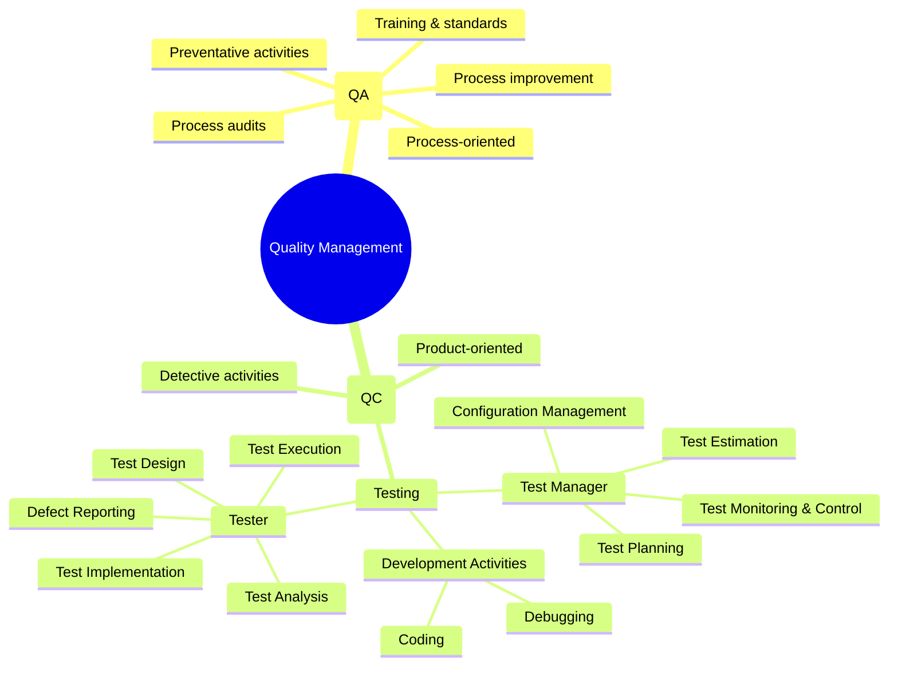

# QA/QC Role Mindmap under ISTQB v4.0

This mindmap represents the structure of QA and QC roles, processes, and activities based on the ISTQB Foundation Level (FL) v4.0 syllabus. 

```mermaid
mindmap
  root((Quality Management))
    Quality Assurance (QA)
      ::icon(fa fa-shield)
      Process-oriented
      Preventative activities
      Process audits
      Process improvement
      Training & standards
    Quality Control (QC)
      ::icon(fa fa-search)
      Product-oriented
      Detective activities
      Testing
        Test Manager
          ::icon(fa fa-user-tie)
          Test Planning
          Test Monitoring & Control
          Test Estimation
          Configuration Management
        Tester
          ::icon(fa fa-user)
          Test Analysis
          Test Design
          Test Implementation
          Test Execution
          Defect Reporting
        Development Activities
          ::icon(fa fa-code)
          Coding
          Debugging
```
