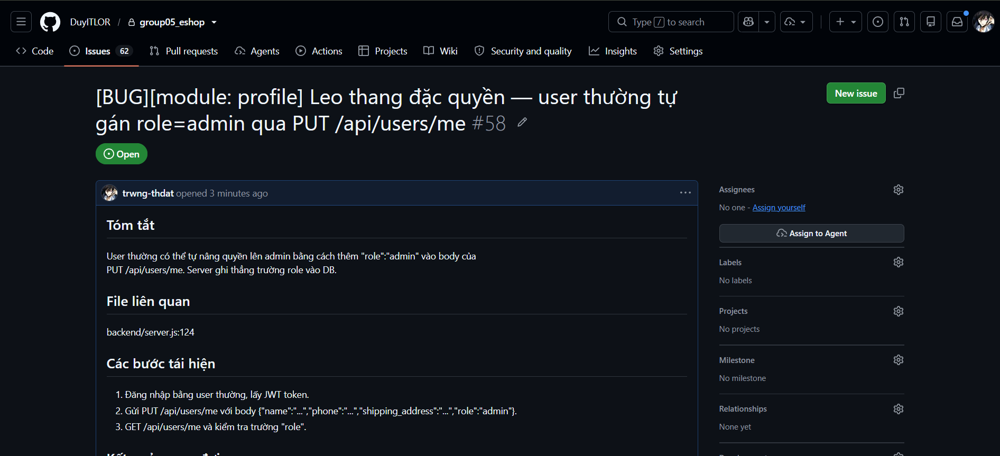
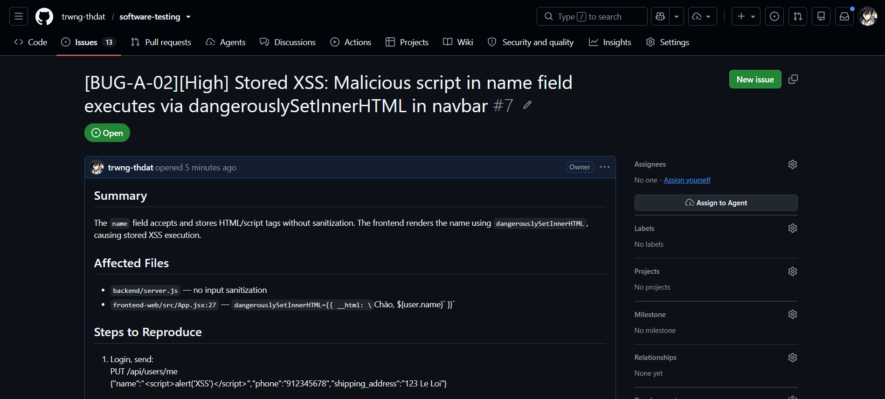
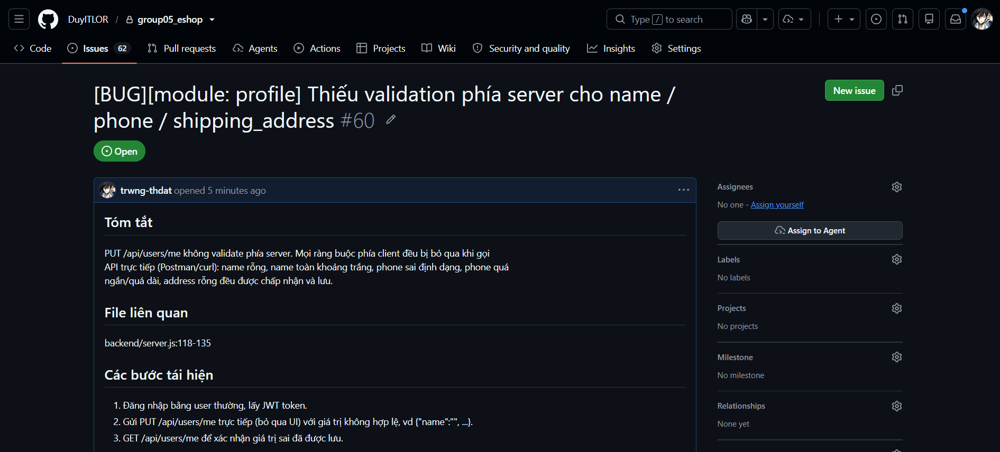
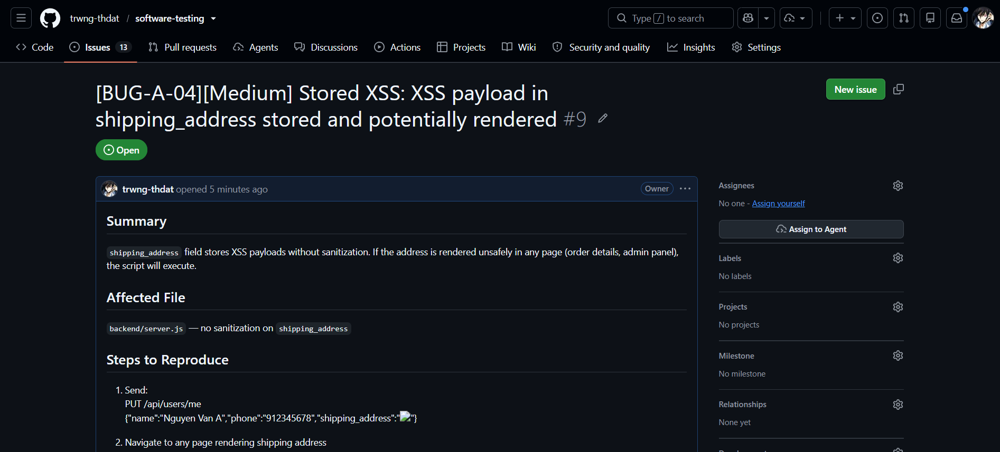
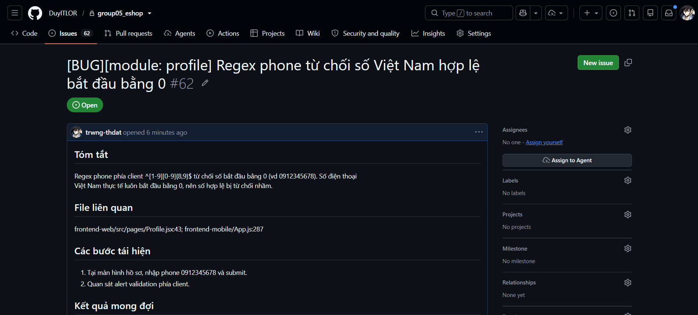
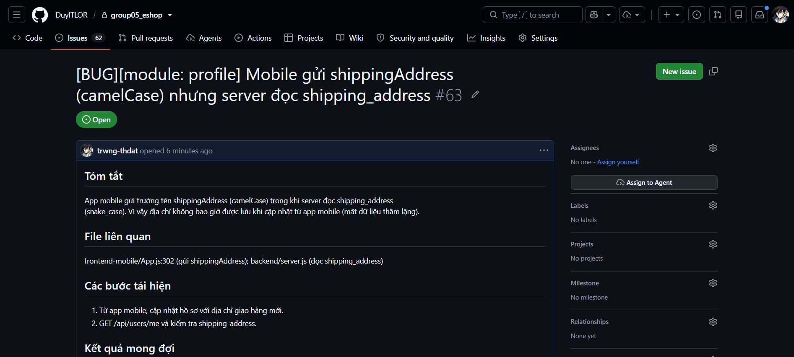
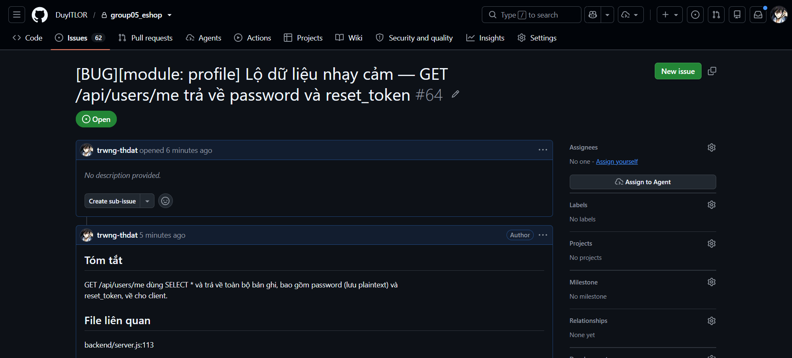
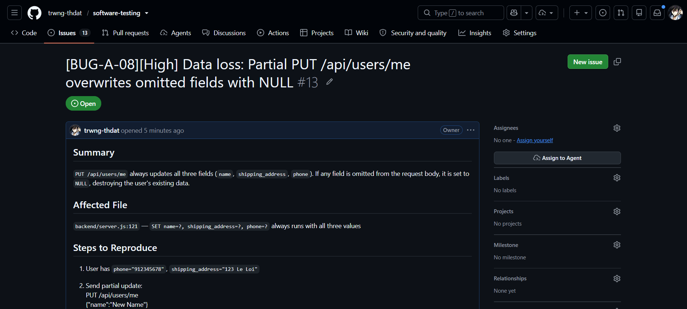

# HW02 — Domain Testing on EShop — Báo cáo chính

## 0. Thông tin sinh viên

| Trường              | Giá trị                     |
| ------------------- | --------------------------- |
| Họ tên              | Trương Thành Đạt            |
| MSSV                | 23217344                    |
| Lớp / Nhóm          | Kiểm thử phần mềm - 23KTPM3 |
| Assignment          | HW02 — Domain Testing       |
| Ngày nộp            | 29/06/2026                  |
| Self-Assessed Grade | 100                         |
| GitHub repo (nhóm)  | `<link>`                    |
| GitHub Issues       | `<link>`                    |

---

## 1. Feature đã chọn

<!-- Mỗi sinh viên chọn 4 feature: 1 từ mỗi pool A/B/C/D, không trùng thành viên khác. -->

| Ký hiệu   | Pool       | FR ID | Tên feature                 | Module (cho mã TC) |
| --------- | ---------- | ----- | --------------------------- | ------------------ |
| Feature A | A          | FR-04 | Personal profile management | `PROFILE`          |
| Feature B | B          | FR-08 | Checkout                    | `CHECKOUT`         |
| Feature C | C          | FR-18 | Order management (admin)    | `ADMIN_ORDER`      |
| Feature D | D (Mobile) | D3    | Mobile – Registration       | `MOB_REG`          |

> **Quy ước mã test case (thống nhất toàn bài):** `TC-<MODULE>-<NNN>`.
> Domain Testing dùng số `001…099`; BVA dùng số `101…199` (để không trùng).
> Ví dụ: `TC-PROFILE-001` (Domain), `TC-PROFILE-101` (BVA).

---

<!-- ============ KHỐI LẶP CHO MỖI FEATURE ============ -->

# Feature A — FR-04: Personal profile management

## A.0 Mô tả & nguồn tham chiếu

- **Chức năng:** Cập nhật hồ sơ cá nhân của người dùng đang đăng nhập (họ tên, địa chỉ giao hàng, số điện thoại). Yêu cầu xác thực bằng JWT.
- **Endpoint / màn hình liên quan:**
  - `GET /api/users/me` — lấy hồ sơ hiện tại.
  - `PUT /api/users/me` — cập nhật hồ sơ. Body: `{ name, shipping_address, phone }`.
  - Màn hình: trang "Hồ sơ cá nhân" trên frontend-web; tab Profile trên frontend-mobile.
- **Nguồn đã đọc để xác định input/ràng buộc:**
  - api_specification.md §2.2 — body cập nhật hồ sơ.
  - backend/server.js:118-135 — handler `PUT /api/users/me`: **không có validation phía server**; ngoài 3 trường công khai còn nhận thêm trường `role` → cập nhật quyền nếu được truyền.
  - backend/database.js:50-61 — schema bảng `users` (các cột TEXT, không ràng buộc độ dài/format).
  - frontend-mobile/App.js:287 — ràng buộc phía client cho `phone`: regex `^[1-9][0-9]{8,9}$` (9–10 chữ số, không bắt đầu bằng 0).
- **Môi trường test:** Chrome / Windows 11 Version 25H2

> ⚠️ **Cảnh báo bảo mật (đã thấy trong code):** `PUT /api/users/me` chấp nhận trường `role` từ body và ghi thẳng vào DB → **lỗ hổng leo thang đặc quyền (privilege escalation / authorization bypass)**. Đây là điểm cần thiết kế test case bảo mật riêng (xem A.1.2 lớp EC-role).

## A.1 Domain Testing (Equivalence Class Partitioning)

> Kỹ thuật: ISTQB FL §4.2.1 — Equivalence Partitioning. Mỗi lớp 1 đại diện; phủ cả valid lẫn invalid; single-fault assumption.

### A.1.1 Các bước áp dụng (step-by-step)

1. **Liệt kê biến đầu vào:** `name` (họ tên), `phone` (số điện thoại), `shipping_address` (địa chỉ giao hàng), `role` (trường bảo mật ẩn — API nhận nhưng không được phép người dùng thường gửi), và JWT `token` (biến xác thực).

2. **Xác định miền & ràng buộc từng biến (từ code thực tế):**
   - `name`: chuỗi text; trường HTML có `required`; **server (server.js:118-135) không validate** → gửi rỗng/whitespace qua API trực tiếp vẫn được chấp nhận.
   - `phone`: client (cả `frontend-web/src/pages/Profile.jsx:43` lẫn `frontend-mobile/App.js:287`) validate regex `^[1-9][0-9]{8,9}$` (9–10 chữ số, **không bắt đầu bằng 0**); **server không kiểm tra** → bypass qua Postman/curl bỏ qua validation. Lưu ý: số điện thoại VN thực tế bắt đầu bằng 0 (vd: `0912345678`) nhưng regex này từ chối → **nghi vấn design bug**.
   - `shipping_address`: text tự do; không có ràng buộc phía client hay server.
   - `role`: KHÔNG được phép người dùng thường gán; server tại `server.js:124` chỉ kiểm tra `if (role) { ... }` → **privilege escalation bug** (BUG đã xác nhận trong code).
   - JWT `token`: phải hợp lệ; `authenticateToken` middleware tại `server.js:100-110` kiểm tra.

3. **Phát hiện thêm khi đọc code (ảnh hưởng đến oracle):**
   - `frontend-web/src/App.jsx:27`: `dangerouslySetInnerHTML={{ __html: \`Chào, ${user.name}\` }}`→ **Stored XSS** nếu`name` chứa HTML/script tag.
   - `frontend-mobile/App.js:302`: mobile gửi `{ name, phone, shippingAddress }` (camelCase) nhưng server đọc `shipping_address` (snake_case) → **địa chỉ không bao giờ được lưu qua mobile app** (silent bug).

4. **Phân vùng tương đương (valid/invalid):** xem bảng A.1.2 — 17 lớp tương đương.

5. **Chọn đại diện mỗi lớp:** mỗi lớp 1 giá trị điển hình, **không phải giá trị biên** (biên xử lý ở A.2 BVA).

6. **Thiết kế test case (single-fault assumption):** mỗi invalid class → 1 TC riêng; các biến còn lại giữ giá trị valid; test qua **Postman (direct API)** để bypass client validation và kiểm tra server-side behavior thực sự.

### A.1.2 Bảng phân tích Equivalence Classes

| Biến               | Lớp (EC)   | Loại             | Mô tả lớp                                                       | Giá trị đại diện                    |
| ------------------ | ---------- | ---------------- | --------------------------------------------------------------- | ----------------------------------- |
| `name`             | EC-NAME-1  | Valid            | Chuỗi không rỗng, có ít nhất 1 ký tự non-whitespace             | `Nguyen Van A`                      |
| `name`             | EC-NAME-2  | Invalid          | Chuỗi rỗng `""`                                                 | `""`                                |
| `name`             | EC-NAME-3  | Invalid          | Chuỗi chỉ gồm khoảng trắng                                      | `"   "`                             |
| `name`             | EC-NAME-4  | Invalid/Security | XSS payload — kỳ vọng sanitize; thực tế là Stored XSS           | ``     |
| `phone`            | EC-PHONE-1 | Valid            | 9–10 chữ số, ký tự đầu từ 1–9 (đúng regex client)               | `912345678`                         |
| `phone`            | EC-PHONE-2 | Invalid          | Chứa ký tự không phải số                                        | `09abc12345`                        |
| `phone`            | EC-PHONE-3 | Invalid          | Bắt đầu bằng 0 (vi phạm regex client; nhưng đây là số VN thật)  | `0912345678`                        |
| `phone`            | EC-PHONE-4 | Invalid          | Quá ngắn — < 9 chữ số (dùng giá trị điển hình, không phải biên) | `91234` (5 số)                      |
| `phone`            | EC-PHONE-5 | Invalid          | Quá dài — > 10 chữ số (dùng giá trị điển hình, không phải biên) | `91234567890123` (14 số)            |
| `phone`            | EC-PHONE-6 | Invalid          | Rỗng `""` — phone không được cung cấp                           | `""`                                |
| `shipping_address` | EC-ADDR-1  | Valid            | Địa chỉ không rỗng, text tự do                                  | `123 Le Loi, Q1, TP.HCM`            |
| `shipping_address` | EC-ADDR-2  | Invalid          | Rỗng `""`                                                       | `""`                                |
| `shipping_address` | EC-ADDR-3  | Invalid/Security | XSS payload — Stored XSS khi địa chỉ được render                | ``      |
| `role`             | EC-ROLE-1  | Invalid/Security | User thường gửi `role=admin` để leo thang quyền                 | `admin`                             |
| JWT `token`        | EC-AUTH-1  | Valid            | Token hợp lệ từ `POST /api/login`                               | JWT trả về sau khi login thành công |
| JWT `token`        | EC-AUTH-2  | Invalid          | Thiếu Authorization header                                      | _(không gửi header)_                |
| JWT `token`        | EC-AUTH-3  | Invalid          | Token sai định dạng / giả mạo                                   | `Bearer invalid_token_xyz`          |

> _Ghi chú EC-PHONE-3:_ regex client `^[1-9][0-9]{8,9}$` từ chối `0912345678` — đây là số VN hợp lệ → **design bug trong regex** (cần ghi vào Bugs section). Mục tiêu của TC-PROFILE-006 là xác nhận server có chấp nhận số này không khi bypass client.

### A.1.3 Test cases — Domain Testing

| TC ID          | Mô tả                                                                       | Phủ EC                                      | Preconditions                         | Test data (Body JSON)                                                                                                     | Các bước (tóm tắt)                                                                             | Expected result                                                                                                                                                           | Status                                                                       |
| -------------- | --------------------------------------------------------------------------- | ------------------------------------------- | ------------------------------------- | ------------------------------------------------------------------------------------------------------------------------- | ---------------------------------------------------------------------------------------------- | ------------------------------------------------------------------------------------------------------------------------------------------------------------------------- | ---------------------------------------------------------------------------- |
| TC-PROFILE-001 | Cập nhật hồ sơ với tất cả trường hợp lệ — happy path                        | EC-NAME-1, EC-PHONE-1, EC-ADDR-1, EC-AUTH-1 | Đã đăng nhập (user: `test@eshop.com`) | `{"name":"Nguyen Van A","phone":"912345678","shipping_address":"123 Le Loi, Q1, TP.HCM"}`                                 | POST /api/login lấy token → PUT /api/users/me với toàn bộ trường hợp lệ → GET /api/users/me    | 200 `{"message":"Profile updated"}`; GET /me trả về đúng name, phone, address mới                                                                                         | Pass                                                                         |
| TC-PROFILE-002 | Gửi tên rỗng qua API, bypass HTML required                                  | EC-NAME-2                                   | Đã đăng nhập (user thường)            | `{"name":"","phone":"912345678","shipping_address":"123 Le Loi, Q1, TP.HCM"}`                                             | PUT /api/users/me qua Postman (bypass HTML required)                                           | Kỳ vọng: 400, báo lỗi tên bắt buộc. Thực tế (dự đoán bug): 200, lưu tên rỗng vào DB                                                                               | Fail — UI chặn; gửi API trực tiếp bypass được, server lưu tên rỗng           |
| TC-PROFILE-003 | Gửi tên chỉ khoảng trắng qua API                                            | EC-NAME-3                                   | Đã đăng nhập (user thường)            | `{"name":"   ","phone":"912345678","shipping_address":"123 Le Loi, Q1, TP.HCM"}`                                          | PUT /api/users/me qua Postman với tên chỉ có khoảng trắng                                      | Kỳ vọng: 400, báo lỗi tên không hợp lệ. Thực tế (dự đoán bug): 200, lưu `"   "` làm tên                                                                           | Fail — UI chặn; gửi API trực tiếp bypass được, server lưu whitespace         |
| TC-PROFILE-004 | Gửi XSS payload trong tên — kiểm tra Stored XSS qua dangerouslySetInnerHTML | EC-NAME-4                                   | Đã đăng nhập (user thường)            | `{"name":"","phone":"912345678","shipping_address":"123 Le Loi, Q1, TP.HCM"}`                | PUT /api/users/me → GET /api/users/me → Đăng nhập lại → quan sát navbar Web render `Chào, ...` | Kỳ vọng: Server từ chối hoặc sanitize; không execute script. Thực tế (dự đoán BUG): Script lưu raw; khi Web render `dangerouslySetInnerHTML` → XSS thực thi       | Fail                                                                         |
| TC-PROFILE-005 | Gửi phone chứa ký tự không phải số qua API                                  | EC-PHONE-2                                  | Đã đăng nhập (user thường)            | `{"name":"Nguyen Van A","phone":"09abc12345","shipping_address":"123 Le Loi, Q1, TP.HCM"}`                                | PUT /api/users/me qua Postman (bypass regex client)                                            | Kỳ vọng: 400, báo định dạng phone không hợp lệ. Thực tế (dự đoán bug): 200, server lưu `09abc12345` vào DB                                                        | Fail — UI chặn; gửi API trực tiếp bypass được, server lưu phone không hợp lệ |
| TC-PROFILE-006 | Gửi phone bắt đầu bằng 0 — số VN hợp lệ nhưng regex client từ chối          | EC-PHONE-3                                  | Đã đăng nhập (user thường)            | `{"name":"Nguyen Van A","phone":"0912345678","shipping_address":"123 Le Loi, Q1, TP.HCM"}`                                | Bước 1: Test qua Web → kỳ vọng alert regex. Bước 2: Test qua Postman → kiểm tra server         | Web: alert "Số điện thoại không hợp lệ". Postman: Kỳ vọng 400; Thực tế (bug đôi): Server 200 + regex client sai (số VN 0-đầu thật ra là hợp lệ)                   | Fail — UI chặn; gửi API trực tiếp bypass được, server lưu số 0-đầu           |
| TC-PROFILE-007 | Gửi phone quá ngắn (5 số) qua API                                           | EC-PHONE-4                                  | Đã đăng nhập (user thường)            | `{"name":"Nguyen Van A","phone":"91234","shipping_address":"123 Le Loi, Q1, TP.HCM"}`                                     | PUT /api/users/me qua Postman với phone 5 chữ số                                               | Kỳ vọng: 400, phone quá ngắn. Thực tế (dự đoán bug): 200, server lưu `91234`                                                                                      | Fail — UI chặn; gửi API trực tiếp bypass được, server lưu phone 5 số         |
| TC-PROFILE-008 | Gửi phone quá dài (14 số) qua API                                           | EC-PHONE-5                                  | Đã đăng nhập (user thường)            | `{"name":"Nguyen Van A","phone":"91234567890123","shipping_address":"123 Le Loi, Q1, TP.HCM"}`                            | PUT /api/users/me qua Postman với phone 14 chữ số                                              | Kỳ vọng: 400, phone quá dài. Thực tế (dự đoán bug): 200, server lưu số 14 chữ số                                                                                  | Fail — UI chặn; gửi API trực tiếp bypass được, server lưu phone 14 số        |
| TC-PROFILE-009 | Gửi phone rỗng qua API — kiểm tra phone có bắt buộc không                   | EC-PHONE-6                                  | Đã đăng nhập (user thường)            | `{"name":"Nguyen Van A","phone":"","shipping_address":"123 Le Loi, Q1, TP.HCM"}`                                          | PUT /api/users/me qua Postman với phone rỗng                                                   | **Kỳ vọng (nếu phone optional):** 200, lưu phone rỗng. **Kỳ vọng (nếu required):** 400. Thực tế: cần xác minh spec                                                        | Fail — API cho phép UPDATE với phone rỗng; UI chặn nhập phone rỗng           |
| TC-PROFILE-010 | Gửi địa chỉ rỗng qua API                                                    | EC-ADDR-2                                   | Đã đăng nhập (user thường)            | `{"name":"Nguyen Van A","phone":"912345678","shipping_address":""}`                                                       | PUT /api/users/me qua Postman với địa chỉ rỗng                                                 | Kỳ vọng: 400, địa chỉ bắt buộc. Thực tế (dự đoán bug): 200, server lưu địa chỉ rỗng                                                                               | Fail — API và UI đều cho UPDATE với địa chỉ rỗng                             |
| TC-PROFILE-011 | Gửi XSS payload trong địa chỉ — kiểm tra Stored XSS                         | EC-ADDR-3                                   | Đã đăng nhập (user thường)            | `{"name":"Nguyen Van A","phone":"912345678","shipping_address":""}`                           | PUT /api/users/me → GET /api/users/me → Kiểm tra trang hiển thị địa chỉ trên Web               | Kỳ vọng: Server từ chối hoặc sanitize XSS. Thực tế (dự đoán bug): Server lưu raw → Stored XSS khi địa chỉ được render                                             | Fail — API và UI đều cho UPDATE với XSS payload địa chỉ                      |
| TC-PROFILE-012 | User thường tự gán role=admin — kiểm tra privilege escalation               | EC-ROLE-1                                   | Đã đăng nhập (user thường, role=user) | `{"name":"Nguyen Van A","phone":"912345678","shipping_address":"123 Le Loi","role":"admin"}`                              | PUT /api/users/me → GET /api/users/me → kiểm tra trường `role` trong response                  | Kỳ vọng: Server bỏ qua trường `role`; GET /me vẫn trả về `role: "user"`. Thực tế (BUG ĐÃ XÁC NHẬN trong code): `role` bị đổi thành `admin` → privilege escalation | Fail                                                                         |
| TC-PROFILE-013 | Gọi API không có Authorization header                                       | EC-AUTH-2                                   | Chưa đăng nhập / không có token       | `{"name":"Nguyen Van A","phone":"912345678","shipping_address":"123 Le Loi"}` (không có Authorization header)             | PUT /api/users/me **không có** header `Authorization`                                          | 401 `{"error":"Unauthorized"}`                                                                                                                                            | Pass                                                                         |
| TC-PROFILE-014 | Gọi API với token giả mạo / sai định dạng                                   | EC-AUTH-3                                   | Có token giả mạo                      | `{"name":"Nguyen Van A","phone":"912345678","shipping_address":"123 Le Loi"}` + `Authorization: Bearer invalid_token_xyz` | PUT /api/users/me với token sai định dạng                                                      | 403 `{"error":"Forbidden"}`                                                                                                                                               | Pass                                                                         |

### A.1.4 Truy vết coverage (EC ↔ TC)

| Lớp (EC)   | Phủ bởi TC     | Ghi chú                                                        |
| ---------- | -------------- | -------------------------------------------------------------- |
| EC-NAME-1  | TC-PROFILE-001 |                                                                |
| EC-NAME-2  | TC-PROFILE-002 |                                                                |
| EC-NAME-3  | TC-PROFILE-003 |                                                                |
| EC-NAME-4  | TC-PROFILE-004 | Security test — Stored XSS qua dangerouslySetInnerHTML         |
| EC-PHONE-1 | TC-PROFILE-001 |                                                                |
| EC-PHONE-2 | TC-PROFILE-005 |                                                                |
| EC-PHONE-3 | TC-PROFILE-006 | Cả Web (client regex) lẫn Postman (server bypass)              |
| EC-PHONE-4 | TC-PROFILE-007 | Giá trị đại diện điển hình (5 số); biên 8 số xử lý ở A.2 BVA   |
| EC-PHONE-5 | TC-PROFILE-008 | Giá trị đại diện điển hình (14 số); biên 11 số xử lý ở A.2 BVA |
| EC-PHONE-6 | TC-PROFILE-009 |                                                                |
| EC-ADDR-1  | TC-PROFILE-001 |                                                                |
| EC-ADDR-2  | TC-PROFILE-010 |                                                                |
| EC-ADDR-3  | TC-PROFILE-011 | Security test — Stored XSS qua address field                   |
| EC-ROLE-1  | TC-PROFILE-012 | Bug đã xác nhận trong code (server.js:124)                     |
| EC-AUTH-1  | TC-PROFILE-001 | Token hợp lệ là precondition của mọi TC valid                  |
| EC-AUTH-2  | TC-PROFILE-013 |                                                                |
| EC-AUTH-3  | TC-PROFILE-014 |                                                                |

## A.2 Boundary Value Analysis

> Kỹ thuật: ISTQB FL §4.2.2 — Boundary Value Analysis. Chiến lược: **3-value**. Chỉ áp dụng cho biến có thứ tự.

### A.2.1 Các bước áp dụng (step-by-step)

**Bước 0 — Xác định feature & tái dùng EC**

Feature: FR-04 Personal profile management. Endpoint: `PUT /api/users/me`. Tái dùng bảng Equivalence Classes từ A.1.2 (17 lớp tương đương) — không đọc lại nguồn từ đầu. Biên xác định từ cùng regex đã phân tích ở A.1.

**Bước 1 — Biến áp dụng được BVA (có thứ tự)**

| Biến               | Áp dụng BVA? | Lý do                                                                 |
| ------------------ | ------------ | --------------------------------------------------------------------- |
| `độ dài phone`     | ✅ Có        | Biến số có thứ tự — biên dưới và biên trên xác định rõ ràng qua regex |
| `name` (nội dung)  | ❌ Không     | Text tự do, không có thứ tự; không xác định được biên có nghĩa        |
| `shipping_address` | ❌ Không     | Text tự do, không có thứ tự                                           |
| `role`             | ❌ Không     | Biến danh mục (categorical), không có thứ tự                          |
| JWT `token`        | ❌ Không     | Biến xác thực nhị phân (valid/invalid), không có thứ tự               |

**Bước 2 — Xác định biên của `độ dài phone`**

Nguồn: regex `^[1-9][0-9]{8,9}$` tại frontend-web/src/pages/Profile.jsx:43 và frontend-mobile/App.js:287.

- Phân tích: `[1-9]` = 1 ký tự đầu; `[0-9]{8,9}` = 8 hoặc 9 ký tự tiếp → tổng độ dài: **9 đến 10 ký tự**.
- **Biên dưới: `min = 9` (đóng, `≥ 9`).**
- **Biên trên: `max = 10` (đóng, `≤ 10`).**
- **Oracle lưu ý:** Server (`backend/server.js:118-135`) **không validate** độ dài phone → test qua Postman (bypass client) cho thấy server chấp nhận mọi độ dài → lộ bug thiếu server-side validation.

**Bước 3 — Chiến lược: 3-value BVA**

Chọn **3-value BVA** (ISTQB FL §4.2.2): kiểm {min-1, min, min+1} và {max-1, max, max+1} để bắt lỗi **off-by-one** (nhầm `<` với `≤`). Vì miền `[9,10]` chỉ rộng 2 đơn vị: `min+1 = max = 10` và `max-1 = min = 9` → 6 điểm lý thuyết hợp nhất còn **4 điểm test** (8, 9, 10, 11) → 4 TC.

**Bước 4 — Bảng giá trị biên:** xem A.2.2.

**Bước 5–6 — Thiết kế test case & format chuẩn:** xem A.2.3. Mỗi điểm biên → 1 TC riêng; `name` và `shipping_address` giữ valid để cô lập biến `phone`.

**Bước 7 — Truy vết Boundary ↔ TC:** xem A.2.4.

**Bước 8 — Nghi vấn bug (off-by-one & thiếu chặn biên)**

- **BUG-BVA-01 — Thiếu server-side validation cho độ dài phone:** TC-PROFILE-101 (8 số) và TC-PROFILE-104 (11 số) dự kiến server trả 400; thực tế (dự đoán) trả 200 và lưu phone không hợp lệ → không có biên nào ở server. Đây là mở rộng của BUG-A-03.
- **BUG-BVA-02 — Regex không nhận số 0-đầu ở biên max:** Số điện thoại 10 chữ số bắt đầu `0` (vd `0912345678`) là số VN hợp lệ nhưng regex từ chối — lỗi thiết kế regex (đã ghi BUG-A-05), không phải off-by-one.

### A.2.2 Bảng giá trị biên

| Biến           | Biên (đóng/mở)   | Điểm BVA | Độ dài | Giá trị ví dụ | Kỳ vọng đúng (client)     | Kỳ vọng thực tế (server via Postman) |
| -------------- | ---------------- | -------- | ------ | ------------- | ------------------------- | ------------------------------------ |
| `độ dài phone` | dưới, đóng (≥9)  | min-1    | 8 số   | `91234567`    | Invalid (quá ngắn)        | **Bug: 200 OK (lưu phone 8 số)**     |
| `độ dài phone` | dưới, đóng (≥9)  | min      | 9 số   | `912345678`   | Valid                     | 200 OK ✓                             |
| `độ dài phone` | dưới, đóng (≥9)  | min+1    | 10 số  | `9123456789`  | Valid                     | 200 OK ✓                             |
| `độ dài phone` | trên, đóng (≤10) | max-1    | 9 số   | `912345678`   | Valid _(= min, gộp TC)_   | 200 OK ✓ _(= min)_                   |
| `độ dài phone` | trên, đóng (≤10) | max      | 10 số  | `9123456789`  | Valid _(= min+1, gộp TC)_ | 200 OK ✓ _(= min+1)_                 |
| `độ dài phone` | trên, đóng (≤10) | max+1    | 11 số  | `91234567890` | Invalid (quá dài)         | **Bug: 200 OK (lưu phone 11 số)**    |

> _Do miền `[9, 10]` chỉ rộng 2 đơn vị: `max-1 = min = 9` và `max = min+1 = 10` → gộp thành 4 TC duy nhất thay vì 6._

### A.2.3 Test cases — BVA

| TC ID          | Mô tả                                                            | Điểm biên phủ              | Preconditions              | Test data (Body JSON)                                                                       | Các bước (tóm tắt)                                                                                                      | Expected result                                                                                                        | Status                                                                |
| -------------- | ---------------------------------------------------------------- | -------------------------- | -------------------------- | ------------------------------------------------------------------------------------------- | ----------------------------------------------------------------------------------------------------------------------- | ---------------------------------------------------------------------------------------------------------------------- | --------------------------------------------------------------------- |
| TC-PROFILE-101 | Phone 8 số (min-1, dưới biên dưới) — server không được lưu       | min-1 (8 số)               | Đã đăng nhập (user thường) | `{"name":"Nguyen Van A","phone":"91234567","shipping_address":"123 Le Loi, Q1, TP.HCM"}`    | POST /api/login → lấy JWT; (a) Test qua Web: nhập phone 8 số → observe alert; (b) PUT /api/users/me qua Postman với JWT | (a) Web: alert "Số điện thoại không hợp lệ". (b) Server: **Kỳ vọng 400**; **Dự đoán bug:** 200, lưu phone 8 số vào DB  | Fail — UI chặn; gửi API trực tiếp bypass được, server lưu phone 8 số  |
| TC-PROFILE-102 | Phone 9 số (min = max-1, tại biên dưới) — server phải chấp nhận  | min (9 số), max-1 (9 số)   | Đã đăng nhập (user thường) | `{"name":"Nguyen Van A","phone":"912345678","shipping_address":"123 Le Loi, Q1, TP.HCM"}`   | POST /api/login → PUT /api/users/me (qua cả Web và Postman) với phone 9 số; GET /api/users/me để xác nhận               | 200 `{"message":"Profile updated"}`; GET /me trả về `phone: "912345678"` — biên dưới hợp lệ                            | Pass                                                                  |
| TC-PROFILE-103 | Phone 10 số (min+1 = max, tại biên trên) — server phải chấp nhận | min+1 (10 số), max (10 số) | Đã đăng nhập (user thường) | `{"name":"Nguyen Van A","phone":"9123456789","shipping_address":"123 Le Loi, Q1, TP.HCM"}`  | POST /api/login → PUT /api/users/me với phone 10 số; GET /api/users/me để xác nhận                                      | 200 `{"message":"Profile updated"}`; GET /me trả về `phone: "9123456789"` — biên trên hợp lệ                           | Pass                                                                  |
| TC-PROFILE-104 | Phone 11 số (max+1, trên biên trên) — server không được lưu      | max+1 (11 số)              | Đã đăng nhập (user thường) | `{"name":"Nguyen Van A","phone":"91234567890","shipping_address":"123 Le Loi, Q1, TP.HCM"}` | POST /api/login → lấy JWT; (a) Test qua Web: nhập phone 11 số → observe alert; (b) PUT /api/users/me qua Postman        | (a) Web: alert "Số điện thoại không hợp lệ". (b) Server: **Kỳ vọng 400**; **Dự đoán bug:** 200, lưu phone 11 số vào DB | Fail — UI chặn; gửi API trực tiếp bypass được, server lưu phone 11 số |

### A.2.4 Truy vết coverage (Biên ↔ TC)

| Điểm biên | Độ dài | Phủ bởi TC     | Ghi chú                                                     |
| --------- | ------ | -------------- | ----------------------------------------------------------- |
| min-1     | 8 số   | TC-PROFILE-101 | Invalid — dưới biên dưới                                    |
| min       | 9 số   | TC-PROFILE-102 | Valid — tại biên dưới                                       |
| min+1     | 10 số  | TC-PROFILE-103 | Valid — trên biên dưới 1 bước                               |
| max-1     | 9 số   | TC-PROFILE-102 | Valid — dưới biên trên 1 bước (= min → cùng TC-PROFILE-102) |
| max       | 10 số  | TC-PROFILE-103 | Valid — tại biên trên (= min+1 → cùng TC-PROFILE-103)       |
| max+1     | 11 số  | TC-PROFILE-104 | Invalid — trên biên trên                                    |

## A.3 AI Gap Analysis

> **Phương pháp review (human review — bắt buộc theo HW02 §2 & §6.3):** Sau khi AI sinh 14 TC Domain Testing + 4 TC BVA, tôi tự đối chiếu lại từng TC với **code thật** (`server.js`, `database.js`, `Profile.jsx`) thay vì chỉ với prompt. Trọng tâm review: (a) AI có coi cả **biến output** là đối tượng test không, hay chỉ test input? (b) các lớp tương đương có thật sự **rời nhau** không (đặc biệt "field thiếu" vs "field rỗng")? (c) lớp "valid token" có cần chia nhỏ theo thời gian không? Kết quả: tìm thấy **6 gap** AI bỏ sót, trong đó 2 gap dẫn tới bug nghiêm trọng chưa từng được phủ.

### A.3.1 Bảng phân tích gap

| #   | Test case / bug AI bỏ sót                                                                                                                                                                                                                                                                   | Bạn bổ sung gì                                                                                                                       | Nguyên nhân AI sót                                                                                                                                                                                                                                                                                                       |
| --- | ------------------------------------------------------------------------------------------------------------------------------------------------------------------------------------------------------------------------------------------------------------------------------------------- | ------------------------------------------------------------------------------------------------------------------------------------ | ------------------------------------------------------------------------------------------------------------------------------------------------------------------------------------------------------------------------------------------------------------------------------------------------------------------------ |
| 1   | **GET `/api/users/me` rò rỉ dữ liệu nhạy cảm.** server.js:113 dùng `SELECT * FROM users` rồi `res.json(user)` → trả luôn `password` (lưu **plaintext**) và `reset_token`. Không TC nào của AI kiểm output của GET.                            | TC-PROFILE-015 (assert response GET /me **không** chứa `password`/`reset_token`) + **BUG-A-07** (Sensitive Data Exposure, Critical). | **Giới hạn cách AI khung hoá bài toán.** AI hiểu FR-04 = "validate input của PUT" nên chỉ phân vùng các biến _đầu vào_. Skill domain-testing (Bước 1) có nhắc cả "biến output/điều kiện" nhưng AI bỏ qua vì prompt và ngữ cảnh nghiêng hẳn về input-validation. Đây là **prompt + AI framing limitation**.               |
| 2   | **Partial update ghi đè NULL.** server.js:121 luôn `SET name=?, shipping_address=?, phone=?`. PUT thiếu 1 field → field đó = `undefined` → SQLite lưu **NULL**, xoá dữ liệu cũ. AI luôn gửi đủ 3 field nên không bao giờ chạm tình huống này. | TC-PROFILE-016 (PUT chỉ `{name}`, xác nhận `phone`/`address` cũ bị mất) + **BUG-A-08** (Data loss on partial update, High).          | **Phân lớp tương đương sai do độ phức tạp ngữ nghĩa.** AI gộp lớp "field **thiếu** (absent/`undefined`)" chung với "field **rỗng** (`""`)" — trong khi với cơ chế destructuring JS + UPDATE không điều kiện, đây là **2 lớp tương đương khác hành vi**. Phải đọc kỹ code mới thấy → **inherent complexity** của feature. |
| 3   | **Lớp con "token hợp lệ nhưng đã hết hạn".** EC-AUTH chỉ có valid / missing / malformed. JWT đúng chữ ký nhưng **expired** là lớp con riêng (`jwt.verify` trả `err` → 403), AI không tách.                                                                                                  | TC-PROFILE-017 (dùng token hết hạn → kỳ vọng 403).                                                                                   | **Giới hạn AI khi phân vùng biến phi-input rõ ràng.** AI coi token là nhị phân valid/invalid, không phân vùng theo **trục thời gian**. Lý thuyết EC cho phép chia nhỏ lớp valid; AI dừng ở mức thô.                                                                                                                      |
| 4   | **Giá trị `role` tuỳ ý ngoài enum.** AI chỉ test `role="admin"`. Code server.js:124 `if (role)` ghi **bất kỳ** chuỗi nào (vd `"superadmin"`); ngược lại `role=""` falsy → **không thể** xoá/đặt lại role.                                     | TC-PROFILE-018 (PUT `role="superadmin"` → kỳ vọng bị từ chối; thực tế lưu raw, phá vỡ enum role).                                    | **AI chọn 1 đại diện "hấp dẫn nhất" thay vì phủ kín miền.** Với `role`, AI chỉ lấy ca tấn công kinh điển (`admin`) mà bỏ lớp "giá trị rác ngoài tập {user, admin}" và lớp "role rỗng". **AI bias** về ca nổi tiếng.                                                                                                      |
| 5   | **BUG-A-06 (mobile camelCase mismatch) không có TC dẫn.** Bug được AI ghi nhận từ đọc code tĩnh nhưng **không** TC nào trong A.1.3 thực thi nó.                                                                                                                                             | Ghi chú bổ sung: BUG-A-06 sẽ được phủ bởi test case của **Feature D** (mobile); thêm tham chiếu chéo để không bỏ sót khi execute.    | **AI tách rời "đọc code phát hiện bug" và "thiết kế TC thực thi bug".** Quan sát tĩnh không tự động sinh ca kiểm chứng động → cần con người nối lại.                                                                                                                                                                     |
| 6   | **`name` / `shipping_address` không có giới hạn độ dài → input không chặn trên.** AI đánh dấu 2 biến này "không áp dụng BVA" vì không có biên thứ tự.                                                                                                                                       | TC-PROFILE-019: gửi `name`/`address` ~100.000 ký tự → kỳ vọng bị giới hạn; thực tế server lưu nguyên → nguy cơ storage/DoS.          | **AI áp quy tắc BVA quá máy móc.** "Không có biên định nghĩa" bị AI hiểu thành "không cần test", trong khi **sự vắng mặt của biên trên chính là một phát hiện** đáng probe. **AI literal rule-following.**                                                                                                               |

### A.3.2 Test case bổ sung (do con người thêm sau review)

> Tiếp tục dải mã Domain Testing `015–019`. Tất cả test qua **Postman (direct API)** để bypass client.

| TC ID          | Mô tả                                                                                 | Phủ gap | Preconditions                                                     | Test data / thao tác                                                                                                    | Expected result                                                                                                                           | Status |
| -------------- | ------------------------------------------------------------------------------------- | ------- | ----------------------------------------------------------------- | ----------------------------------------------------------------------------------------------------------------------- | ----------------------------------------------------------------------------------------------------------------------------------------- | ------ |
| TC-PROFILE-015 | Kiểm tra GET /me không rò rỉ password và reset_token trong response                   | Gap #1  | Đã đăng nhập (user thường)                                        | `GET /api/users/me` với JWT hợp lệ → kiểm tra toàn bộ field trong response body                                         | Kỳ vọng: body **không** chứa `password`, `reset_token`. Thực tế (BUG-A-07): trả `password` (plaintext) + `reset_token`            | Fail   |
| TC-PROFILE-016 | Gửi PUT chỉ có name — kiểm tra partial update có ghi đè NULL lên các field khác không | Gap #2  | User đang có `phone="912345678"`, `shipping_address="123 Le Loi"` | `PUT /api/users/me` body chỉ `{"name":"Nguyen Van B"}` (cố tình thiếu phone & address) → `GET /api/users/me`            | Kỳ vọng: chỉ `name` đổi; `phone`/`address` giữ nguyên. Thực tế (BUG-A-08): `phone` & `shipping_address` bị set NULL → mất dữ liệu | Fail   |
| TC-PROFILE-017 | Gửi PUT với JWT đã hết hạn — server phải từ chối, không update                        | Gap #3  | Có 1 JWT đã hết hạn (valid signature, `exp` quá khứ)              | `PUT /api/users/me` + `Authorization: Bearer <expired_jwt>`                                                             | 403 `{"error":"Forbidden"}`                                                                                                               | Pass   |
| TC-PROFILE-018 | User thường gán role=superadmin — giá trị ngoài enum {user, admin}                    | Gap #4  | Đã đăng nhập (user thường, role=user)                             | `{"name":"Nguyen Van A","phone":"912345678","shipping_address":"123 Le Loi","role":"superadmin"}` → `GET /api/users/me` | Kỳ vọng: từ chối / bỏ qua `role`. Thực tế: lưu `role="superadmin"` (giá trị ngoài enum {user, admin}) — mở rộng BUG-A-01          | Fail   |
| TC-PROFILE-019 | Gửi name/address siêu dài (~100k ký tự) — server có giới hạn độ dài không             | Gap #6  | Đã đăng nhập (user thường)                                        | `{"name":"<100.000 ký tự 'A'>","phone":"912345678","shipping_address":"<100.000 ký tự>"}`                               | Kỳ vọng: server giới hạn độ dài → 400. Thực tế (dự đoán bug): 200, lưu nguyên chuỗi khổng lồ vào DB                               | Fail   |

> ⚠️ Hai gap #1 và #2 sinh ra **2 bug mới** đã bổ sung vào bảng A.4 (BUG-A-07, BUG-A-08). Tổng test case Feature A sau review: **23** = 14 (Domain gốc 001–014) + 4 (BVA gốc 101–104) + 5 (Domain bổ sung 015–019).

## A.4 Bugs phát hiện (Feature A)

| Bug ID   | Found by TC                                                                                    | Tiêu đề                                                                                                                                                                        | Severity | GitHub Issue                                                     | Screenshot                       |
| -------- | ---------------------------------------------------------------------------------------------- | ------------------------------------------------------------------------------------------------------------------------------------------------------------------------------ | -------- | ---------------------------------------------------------------- | -------------------------------- |
| BUG-A-01 | TC-PROFILE-012                                                                                 | Privilege escalation: user thường tự gán `role=admin` qua `PUT /api/users/me` (server.js:124)                                                                                  | Critical | [#6](https://github.com/trwng-thdat/software-testing/issues/6)   |  |
| BUG-A-02 | TC-PROFILE-004                                                                                 | Stored XSS: `name` chứa HTML/script lưu raw vào DB; navbar Web render qua `dangerouslySetInnerHTML` (App.jsx:27) → script thực thi                                             | High     | [#7](https://github.com/trwng-thdat/software-testing/issues/7)   |  |
| BUG-A-03 | TC-PROFILE-002, TC-PROFILE-003, TC-PROFILE-005, TC-PROFILE-007, TC-PROFILE-008, TC-PROFILE-010 | Thiếu validation server-side: `name`, `phone`, `shipping_address` không được validate tại server — bypass qua Postman bỏ qua toàn bộ ràng buộc client                          | High     | [#8](https://github.com/trwng-thdat/software-testing/issues/8)   |  |
| BUG-A-04 | TC-PROFILE-011                                                                                 | Stored XSS: `shipping_address` chứa XSS payload lưu raw; potential render ở các trang hiển thị địa chỉ                                                                         | Medium   | [#9](https://github.com/trwng-thdat/software-testing/issues/9)   |  |
| BUG-A-05 | TC-PROFILE-006                                                                                 | Design bug trong regex phone: `^[1-9][0-9]{8,9}$` từ chối số VN hợp lệ bắt đầu bằng 0 (vd `0912345678`) — số VN thật đều bắt đầu bằng 0                                        | Medium   | [#10](https://github.com/trwng-thdat/software-testing/issues/10) |  |
| BUG-A-06 | _(Mobile test)_                                                                                | Mobile field name mismatch: `frontend-mobile/App.js:302` gửi `shippingAddress` (camelCase) nhưng server đọc `shipping_address` → address không bao giờ lưu được qua mobile app | Medium   | [#11](https://github.com/trwng-thdat/software-testing/issues/11) |  |
| BUG-A-07 | TC-PROFILE-015                                                                                 | Sensitive Data Exposure: `GET /api/users/me` dùng `SELECT *` (server.js:113) trả cả `password` (lưu plaintext) và `reset_token` về client                                      | Critical | [#12](https://github.com/trwng-thdat/software-testing/issues/12) |  |
| BUG-A-08 | TC-PROFILE-016                                                                                 | Data loss: `PUT /api/users/me` luôn `SET name,shipping_address,phone` (server.js:121) → cập nhật thiếu field sẽ ghi NULL đè dữ liệu cũ (không hỗ trợ partial update)           | High     | [#13](https://github.com/trwng-thdat/software-testing/issues/13) |  |

### Kết quả execute Feature A (tóm tắt)

| Chỉ số             | Số lượng                                          |
| ------------------ | ------------------------------------------------- |
| Test case thiết kế | 23 (14 Domain + 4 BVA + 5 bổ sung sau review)     |
| Đã execute         | 23                                                |
| Pass               | 6 (TC-001, 013, 014, 017, 102, 103)               |
| Fail               | 17                                                |
| Chưa execute       | 0                                                 |
| Bug tìm được       | 7 (BUG-A-01…05, 07, 08; BUG-A-06 phủ ở Feature D) |

---

# Feature B — FR-08: Checkout

## B.0 Mô tả & nguồn tham chiếu

- **Chức năng:** Đặt hàng từ giỏ hàng — tạo đơn hàng mới với tổng tiền và địa chỉ giao hàng. Yêu cầu xác thực JWT. Trước khi checkout có thể áp mã giảm giá qua `/api/apply-coupon`.
- **Endpoint / màn hình liên quan:**
  - `POST /api/checkout` — body `{ total_amount, shipping_address }`. Yêu cầu JWT.
  - `POST /api/apply-coupon` — body `{ code, total_amount, user_id }`. **Không yêu cầu JWT** (không có `authenticateToken`).
  - Màn hình: trang Checkout trên frontend-web.
- **Nguồn đã đọc để xác định input/ràng buộc:**
  - api_specification.md §4.3 — body checkout và apply-coupon.
  - backend/server.js:297-309 — handler `POST /api/checkout`: **không validate** `total_amount` hay `shipping_address`; INSERT thẳng vào DB.
  - backend/server.js:363-441 — handler `POST /api/apply-coupon`: điều kiện `total_amount > min_order_amount` (**off-by-one**); công thức percent sai.
  - backend/database.js:74-81 — schema bảng `orders`: `total_amount INTEGER`, `shipping_address TEXT` — không có constraint.
  - backend/database.js:105-111 — seed coupon: `SAVE10` (percent, 10%, min=300000), `BIGBUY` (fixed, 50000₫, min=500000), `VIP100` (fixed, 100000₫, min=300000, max_uses=2), `EXPIRED` (percent, 20%, expired 2020).
- **Môi trường test:** Chrome / Windows 11 Version 25H2

> ⚠️ **Điểm nghi vấn trong code (ứng viên bug — xác nhận qua code trước khi execute):**
>
> 1. `apply-coupon` dùng `>` thay vì `>=` tại server.js:379 → đơn hàng đúng bằng ngưỡng tối thiểu bị từ chối (off-by-one).
> 2. Công thức percent tại server.js:399: `Math.floor(total * (1 - discount_value))` với `discount_value=10` (số nguyên) → `total * (1-10) = total * -9` → discount âm khổng lồ → `final_amount > total_amount`.
> 3. `POST /api/checkout` không validate `total_amount` (0, âm, chuỗi) và `shipping_address` (rỗng/null).
> 4. `POST /api/apply-coupon` không có `authenticateToken` → anonymous caller có thể bỏ qua giới hạn `max_uses_per_user` bằng cách không gửi `user_id`.

## B.1 Domain Testing (Equivalence Class Partitioning)

> Kỹ thuật: ISTQB FL §4.2.1 — Equivalence Partitioning. Mỗi lớp 1 đại diện; phủ cả valid lẫn invalid; single-fault assumption.

### B.1.1 Các bước áp dụng (step-by-step)

1. **Liệt kê biến đầu vào:** Hai endpoint trong luồng checkout:
   - `POST /api/checkout`: `total_amount`, `shipping_address`, JWT `token`.
   - `POST /api/apply-coupon`: `code`, `total_amount` (so với `min_order_amount`), `user_id`.

2. **Xác định miền & ràng buộc từng biến (từ code thực tế):**
   - `total_amount` (checkout): không có constraint tại server (server.js:297-309); nghiệp vụ yêu cầu > 0 nhưng không enforce.
   - `shipping_address`: TEXT tự do; không validate tại server.
   - JWT `token` (checkout): bắt buộc — middleware `authenticateToken`.
   - `code` (apply-coupon): phải không rỗng; phải tồn tại trong DB, `is_active=1`, chưa hết hạn, chưa vượt `max_uses_per_user`.
   - `total_amount` (apply-coupon): so sánh với `coupon.min_order_amount` dùng điều kiện `>` (off-by-one: lẽ ra `>=`).

3. **Phát hiện thêm khi đọc code (ảnh hưởng đến oracle):**
   - `apply-coupon` không có `authenticateToken` → không cần JWT; nếu không gửi `user_id` → bỏ qua kiểm tra `max_uses_per_user`.
   - Công thức percent sai: `discount_value` là số nguyên (10 cho 10%) nhưng code dùng `1 - discount_value = -9` thay vì `discount_value / 100 = 0.10` → discount âm.

4. **Phân vùng tương đương (valid/invalid):** xem bảng B.1.2 — 17 lớp tương đương.

5. **Chọn đại diện mỗi lớp:** mỗi lớp 1 giá trị điển hình, **không phải giá trị biên** (biên xử lý ở B.2 BVA).

6. **Thiết kế test case (single-fault assumption):** mỗi invalid class → 1 TC riêng; test qua **Postman (direct API)**.

### B.1.2 Bảng phân tích Equivalence Classes

| Biến                      | Lớp (EC)   | Loại    | Mô tả lớp                                            | Giá trị đại diện               |
| ------------------------- | ---------- | ------- | ---------------------------------------------------- | ------------------------------ |
| `total_amount` (checkout) | EC-TOTAL-1 | Valid   | Số nguyên dương                                      | `400000`                       |
| `total_amount` (checkout) | EC-TOTAL-2 | Invalid | Bằng 0 — không có giá trị đơn hàng                   | `0`                            |
| `total_amount` (checkout) | EC-TOTAL-3 | Invalid | Âm — số tiền vô lý                                   | `-50000`                       |
| `total_amount` (checkout) | EC-TOTAL-4 | Invalid | Chuỗi không phải số                                  | `"abc"`                        |
| `total_amount` (checkout) | EC-TOTAL-5 | Invalid | Thiếu field — INSERT NULL vào DB                     | _(không gửi field)_            |
| `shipping_address`        | EC-SADDR-1 | Valid   | Địa chỉ không rỗng, text tự do                       | `123 Le Loi, Q1, TP.HCM`       |
| `shipping_address`        | EC-SADDR-2 | Invalid | Rỗng `""`                                            | `""`                           |
| `shipping_address`        | EC-SADDR-3 | Invalid | Thiếu field — INSERT NULL vào DB                     | _(không gửi field)_            |
| JWT `token` (checkout)    | EC-AUTH-1  | Valid   | Token hợp lệ từ `POST /api/login`                    | JWT sau khi login thành công   |
| JWT `token` (checkout)    | EC-AUTH-2  | Invalid | Thiếu Authorization header                           | _(không gửi header)_           |
| `code` (apply-coupon)     | EC-CODE-1  | Valid   | Mã tồn tại, active, chưa hết hạn, chưa dùng hết lượt | `SAVE10`                       |
| `code` (apply-coupon)     | EC-CODE-2  | Invalid | Rỗng / thiếu                                         | `""`                           |
| `code` (apply-coupon)     | EC-CODE-3  | Invalid | Mã không tồn tại trong DB                            | `FAKE999`                      |
| `code` (apply-coupon)     | EC-CODE-4  | Invalid | Mã hết hạn (`expired_at` < now)                      | `EXPIRED`                      |
| `code` (apply-coupon)     | EC-CODE-5  | Invalid | Mã đã dùng hết `max_uses_per_user` (SAVE10, max=1)   | `SAVE10` (sau khi đã áp 1 lần) |
| `total_amount` (coupon)   | EC-CAMP-1  | Valid   | `total > min_order_amount` — code hiện tại chấp nhận | `400000` > 300000 (SAVE10)     |
| `total_amount` (coupon)   | EC-CAMP-2  | Invalid | `total < min_order_amount` — đơn chưa đủ ngưỡng      | `200000` < 300000 (SAVE10)     |

> _Ghi chú EC-CODE-1:_ `SAVE10` là percent coupon với `discount_value=10`. Khi áp dụng sẽ lộ BUG-B-02 — `final_amount` trả về cao hơn `total_amount` do công thức sai.

### B.1.3 Test cases — Domain Testing

| TC ID           | Mô tả                                                                | Phủ EC                            | Preconditions                               | Test data (Body JSON)                                                         | Các bước (tóm tắt)                                                                       | Expected result                                                                                     | Status  |
| --------------- | -------------------------------------------------------------------- | --------------------------------- | ------------------------------------------- | ----------------------------------------------------------------------------- | ---------------------------------------------------------------------------------------- | --------------------------------------------------------------------------------------------------- | ------- |
| TC-CHECKOUT-001 | Checkout hợp lệ — happy path, tạo đơn thành công                     | EC-TOTAL-1, EC-SADDR-1, EC-AUTH-1 | Đã đăng nhập (`test@eshop.com`)             | `{"total_amount":400000,"shipping_address":"123 Le Loi, Q1, TP.HCM"}`         | POST /api/login → lấy JWT; POST /api/checkout với body hợp lệ; GET /api/orders/my-orders | 200 `{"message":"Checkout successful","orderId":<id>}`; đơn mới có status `pending`                 | Not Run |
| TC-CHECKOUT-002 | Checkout với total_amount = 0 — không có giá trị đơn hàng            | EC-TOTAL-2                        | Đã đăng nhập (user thường)                  | `{"total_amount":0,"shipping_address":"123 Le Loi, Q1, TP.HCM"}`              | POST /api/checkout qua Postman với total=0                                               | Kỳ vọng: 400, từ chối. Thực tế (BUG-B-03): 200, tạo đơn với total_amount=0                  | Not Run |
| TC-CHECKOUT-003 | Checkout với total_amount âm — số tiền vô lý                         | EC-TOTAL-3                        | Đã đăng nhập (user thường)                  | `{"total_amount":-50000,"shipping_address":"123 Le Loi, Q1, TP.HCM"}`         | POST /api/checkout qua Postman với total âm                                              | Kỳ vọng: 400, từ chối. Thực tế (BUG-B-03): 200, tạo đơn với total_amount=-50000             | Not Run |
| TC-CHECKOUT-004 | Checkout với total_amount là chuỗi không phải số                     | EC-TOTAL-4                        | Đã đăng nhập (user thường)                  | `{"total_amount":"abc","shipping_address":"123 Le Loi, Q1, TP.HCM"}`          | POST /api/checkout qua Postman với total="abc"                                           | Kỳ vọng: 400, lỗi kiểu dữ liệu. Thực tế (BUG-B-03): 200, SQLite lưu 0 (type coercion)       | Not Run |
| TC-CHECKOUT-005 | Checkout thiếu field total_amount                                    | EC-TOTAL-5                        | Đã đăng nhập (user thường)                  | `{"shipping_address":"123 Le Loi, Q1, TP.HCM"}` _(thiếu `total_amount`)_      | POST /api/checkout qua Postman không có field total_amount                               | Kỳ vọng: 400, field bắt buộc. Thực tế (BUG-B-03): 200, đơn với total_amount=NULL            | Not Run |
| TC-CHECKOUT-006 | Checkout với shipping_address rỗng                                   | EC-SADDR-2                        | Đã đăng nhập (user thường)                  | `{"total_amount":400000,"shipping_address":""}`                               | POST /api/checkout qua Postman với address=""                                            | Kỳ vọng: 400, địa chỉ bắt buộc. Thực tế (BUG-B-03): 200, đơn với shipping_address=""        | Not Run |
| TC-CHECKOUT-007 | Checkout thiếu field shipping_address                                | EC-SADDR-3                        | Đã đăng nhập (user thường)                  | `{"total_amount":400000}` _(thiếu `shipping_address`)_                        | POST /api/checkout qua Postman không có field shipping_address                           | Kỳ vọng: 400, field bắt buộc. Thực tế (BUG-B-03): 200, đơn với shipping_address=NULL        | Not Run |
| TC-CHECKOUT-008 | Checkout không có Authorization header                               | EC-AUTH-2                         | Chưa đăng nhập / không có token             | `{"total_amount":400000,"shipping_address":"123 Le Loi"}` _(không có header)_ | POST /api/checkout **không có** header `Authorization`                                   | 401 `{"error":"Unauthorized"}`                                                                      | Not Run |
| TC-CHECKOUT-009 | Áp mã SAVE10 (percent 10%) hợp lệ — kiểm tra công thức tính discount | EC-CODE-1, EC-CAMP-1              | SAVE10 còn hiệu lực, user chưa dùng lần nào | `{"code":"SAVE10","total_amount":400000,"user_id":2}`                         | POST /api/apply-coupon với SAVE10 và total=400000 (> 300000 min)                         | Kỳ vọng: discount=40000, final=360000. Thực tế (BUG-B-02): discount=-3600000, final=4000000 | Not Run |
| TC-CHECKOUT-010 | Áp mã với code rỗng                                                  | EC-CODE-2                         | Không cần JWT (endpoint public)             | `{"code":"","total_amount":400000}`                                           | POST /api/apply-coupon với code=""                                                       | 400 `{"error":"Vui lòng nhập mã giảm giá"}`                                                         | Not Run |
| TC-CHECKOUT-011 | Áp mã không tồn tại trong DB                                         | EC-CODE-3                         | Không cần JWT                               | `{"code":"FAKE999","total_amount":400000}`                                    | POST /api/apply-coupon với code không tồn tại                                            | 404 `{"error":"Mã giảm giá không tồn tại hoặc đã bị vô hiệu hóa"}`                                  | Not Run |
| TC-CHECKOUT-012 | Áp mã đã hết hạn (EXPIRED, expired_at=2020-01-01)                    | EC-CODE-4                         | Không cần JWT                               | `{"code":"EXPIRED","total_amount":200000}`                                    | POST /api/apply-coupon với mã EXPIRED                                                    | 400 `{"error":"Mã giảm giá đã hết hạn"}`                                                            | Not Run |
| TC-CHECKOUT-013 | Áp mã khi total_amount dưới ngưỡng tối thiểu của coupon              | EC-CAMP-2                         | Không cần JWT                               | `{"code":"SAVE10","total_amount":200000}` (200000 < 300000 min)               | POST /api/apply-coupon với total thấp hơn min_order của SAVE10                           | 400 `{"error":"Đơn hàng chưa đủ giá trị tối thiểu 300.000 ₫..."}`                                   | Not Run |
| TC-CHECKOUT-014 | Áp mã đã dùng hết lượt (SAVE10 max_uses_per_user=1)                  | EC-CODE-5                         | User đã dùng SAVE10 đúng 1 lần trước đó     | `{"code":"SAVE10","total_amount":400000,"user_id":2}` (lần 2)                 | Dùng SAVE10 lần đầu → POST /api/coupon-usage để ghi; dùng SAVE10 lần 2                   | 400 `{"error":"Bạn đã sử dụng mã này 1 lần (đã đạt giới hạn)"}`                                     | Not Run |

### B.1.4 Truy vết coverage (EC ↔ TC)

| Lớp (EC)   | Phủ bởi TC      | Ghi chú                                                  |
| ---------- | --------------- | -------------------------------------------------------- |
| EC-TOTAL-1 | TC-CHECKOUT-001 |                                                          |
| EC-TOTAL-2 | TC-CHECKOUT-002 | Dự đoán BUG-B-03                                         |
| EC-TOTAL-3 | TC-CHECKOUT-003 | Dự đoán BUG-B-03                                         |
| EC-TOTAL-4 | TC-CHECKOUT-004 | Dự đoán BUG-B-03; SQLite coerce "abc" → 0                |
| EC-TOTAL-5 | TC-CHECKOUT-005 | Dự đoán BUG-B-03; INSERT NULL                            |
| EC-SADDR-1 | TC-CHECKOUT-001 |                                                          |
| EC-SADDR-2 | TC-CHECKOUT-006 | Dự đoán BUG-B-03                                         |
| EC-SADDR-3 | TC-CHECKOUT-007 | Dự đoán BUG-B-03; INSERT NULL                            |
| EC-AUTH-1  | TC-CHECKOUT-001 | Token hợp lệ là precondition của mọi TC checkout         |
| EC-AUTH-2  | TC-CHECKOUT-008 |                                                          |
| EC-CODE-1  | TC-CHECKOUT-009 | Cũng lộ BUG-B-02 (wrong percent formula)                 |
| EC-CODE-2  | TC-CHECKOUT-010 |                                                          |
| EC-CODE-3  | TC-CHECKOUT-011 |                                                          |
| EC-CODE-4  | TC-CHECKOUT-012 |                                                          |
| EC-CODE-5  | TC-CHECKOUT-014 | Precondition: đã dùng SAVE10 một lần và ghi coupon_usage |
| EC-CAMP-1  | TC-CHECKOUT-009 | total > min (300000) → pass điều kiện buggy `>`          |
| EC-CAMP-2  | TC-CHECKOUT-013 | total < min → từ chối đúng                               |

## B.2 Boundary Value Analysis

> Kỹ thuật: ISTQB FL §4.2.2 — Boundary Value Analysis. Chiến lược: **3-value**. Chỉ áp dụng cho biến có thứ tự.

### B.2.1 Các bước áp dụng (step-by-step)

**Bước 0 — Xác định feature & tái dùng EC**

Feature: FR-08 Checkout. Tái dùng bảng EC từ B.1.2 (17 lớp). Biên xác định từ `min_order_amount` của coupon SAVE10.

**Bước 1 — Biến áp dụng được BVA (có thứ tự)**

| Biến                      | Áp dụng BVA? | Lý do                                                                |
| ------------------------- | ------------ | -------------------------------------------------------------------- |
| `total_amount` (coupon)   | ✅ Có        | Biến số có thứ tự — biên xác định qua `min_order_amount = 300000`    |
| `total_amount` (checkout) | ⚠️ Giới hạn  | Không có biên định nghĩa ở server; đã phủ bởi EC test (EC-TOTAL-2…5) |
| `shipping_address`        | ❌ Không     | Text tự do, không có thứ tự                                          |
| `code`                    | ❌ Không     | Biến danh mục (categorical), không có thứ tự                         |
| JWT `token`               | ❌ Không     | Biến xác thực nhị phân, không có thứ tự                              |

**Bước 2 — Xác định biên của `total_amount` trong apply-coupon**

Nguồn: server.js:379 — `if (total_amount > coupon.min_order_amount)`. Coupon `SAVE10`: `min_order_amount = 300000`.

- **Biên: `min = 300000` (đúng spec là `≥ 300000`; code dùng `>` → off-by-one).**
- Hệ quả: đơn hàng đúng bằng 300000 → theo spec được áp mã, nhưng code từ chối.

**Bước 3 — Chiến lược: 3-value BVA**

{min-1 = 299999, min = 300000, min+1 = 300001} để bắt lỗi off-by-one. Giữ `code=SAVE10` cố định để cô lập biến `total_amount`.

**Bước 4 — Bảng giá trị biên:** xem B.2.2.

**Bước 5–6 — Thiết kế test case:** xem B.2.3. Mỗi điểm biên → 1 TC riêng.

**Bước 7 — Truy vết Boundary ↔ TC:** xem B.2.4.

**Bước 8 — Nghi vấn bug**

- **BUG-B-01 (off-by-one):** TC-CHECKOUT-102 (total=300000) kỳ vọng 200 coupon applied; thực tế 400 rejected vì `300000 > 300000` là false.
- **BUG-B-02 (percent formula):** TC-CHECKOUT-103 (total=300001) pass điều kiện min nhưng `Math.floor(300001*(1-10)) = -2700009` → `final_amount = 3000010` > tổng gốc.

### B.2.2 Bảng giá trị biên

| Biến           | Biên (đóng/mở)       | Điểm BVA | Giá trị | Kỳ vọng đúng (spec `≥`) | Kỳ vọng thực tế (code dùng `>`)              |
| -------------- | -------------------- | -------- | ------- | ----------------------- | -------------------------------------------- |
| `total_amount` | min, đóng (≥ 300000) | min-1    | 299999  | Từ chối mã              | Từ chối mã ✓                                 |
| `total_amount` | min, đóng (≥ 300000) | min      | 300000  | **Chấp nhận mã**        | **Bug: Từ chối** (`300000 > 300000` = false) |
| `total_amount` | min, đóng (≥ 300000) | min+1    | 300001  | Chấp nhận mã            | Chấp nhận ✓ (nhưng discount sai — BUG-B-02)  |

### B.2.3 Test cases — BVA

| TC ID           | Mô tả                                                                        | Điểm biên phủ | Preconditions                  | Test data (Body JSON)                     | Các bước (tóm tắt)                                        | Expected result                                                                                           | Status  |
| --------------- | ---------------------------------------------------------------------------- | ------------- | ------------------------------ | ----------------------------------------- | --------------------------------------------------------- | --------------------------------------------------------------------------------------------------------- | ------- |
| TC-CHECKOUT-101 | total=299999 (min-1) — dưới ngưỡng, từ chối là đúng                          | min-1         | SAVE10 còn hiệu lực, chưa dùng | `{"code":"SAVE10","total_amount":299999}` | POST /api/apply-coupon                                    | 400 "Đơn hàng chưa đủ giá trị tối thiểu 300.000 ₫"                                                        | Not Run |
| TC-CHECKOUT-102 | total=300000 (min) — đúng ngưỡng, spec chấp nhận; code từ chối → BUG-B-01    | min           | SAVE10 còn hiệu lực, chưa dùng | `{"code":"SAVE10","total_amount":300000}` | POST /api/apply-coupon — kiểm tra off-by-one              | Kỳ vọng: 200, coupon applied. Thực tế (BUG-B-01): 400, từ chối vì `300000 > 300000` = false       | Not Run |
| TC-CHECKOUT-103 | total=300001 (min+1) — trên ngưỡng, chấp nhận; nhưng discount sai → BUG-B-02 | min+1         | SAVE10 còn hiệu lực, chưa dùng | `{"code":"SAVE10","total_amount":300001}` | POST /api/apply-coupon — kiểm tra giá trị discount trả về | Kỳ vọng: discount=30000 (10%), final=270001. Thực tế (BUG-B-02): discount=-2700009, final=3000010 | Not Run |

### B.2.4 Truy vết coverage (Biên ↔ TC)

| Điểm biên | Giá trị | Phủ bởi TC      | Ghi chú                                     |
| --------- | ------- | --------------- | ------------------------------------------- |
| min-1     | 299999  | TC-CHECKOUT-101 | Invalid — dưới ngưỡng, từ chối đúng         |
| min       | 300000  | TC-CHECKOUT-102 | Ranh giới — BUG-B-01: bị từ chối sai        |
| min+1     | 300001  | TC-CHECKOUT-103 | Valid — chấp nhận; BUG-B-02 lộ discount sai |

## B.3 AI Gap Analysis

> Sau khi AI sinh 14 TC Domain Testing + 3 TC BVA, tôi đọc lại code thật (server.js:297-441, database.js:73-111) để đối chiếu, không chỉ tin vào output AI. Tìm ra 4 điểm chưa phủ. Đáng chú ý nhất là AI đã tự ghi nghi vấn #4 (bypass `max_uses_per_user`) ở B.0 nhưng lại không tạo EC hay TC nào cho nó.

### B.3.1 Bảng phân tích gap

| #  | Test case / bug AI bỏ sót | Tôi bổ sung gì | Nguyên nhân AI sót |
| -- | ------------------------- | -------------- | ------------------ |
| G1 | Không có TC nào cho lỗ hổng bypass `max_uses_per_user`. Code rẽ nhánh `if (user_id)` (server.js:386): nếu không gửi `user_id` thì toàn bộ kiểm tra số lần dùng bị bỏ qua, mã có `max_uses` vẫn áp được vô hạn. Biến `user_id` chưa được phân lớp tương đương (thiếu hẳn EC present/absent). | Thêm EC-UID-1/EC-UID-2, TC-CHECKOUT-015, đề xuất BUG-B-04. | Giới hạn của AI kết hợp feature phức tạp. AI đã biết lỗi này (ghi ở B.0 nghi vấn #4) nhưng không nối được vào quy trình ECP vì `user_id` là biến điều khiển luồng/auth, không phải input có "valid/invalid range" hiển nhiên. TC này cũng cần trạng thái nhiều bước (dùng mã → ghi `coupon_usage` → áp lại mà bỏ `user_id`), phức tạp hơn TC một-request thông thường. |
| G2 | Toàn bộ nhánh `type = "fixed"` không được test. EC-CODE chỉ dùng `SAVE10` (percent). Biến `coupon.type` (server.js:398-404) có 2 lớp (`percent` / `fixed`) nhưng AI chỉ phủ 1. Không có TC nào xác nhận nhánh `fixed` (BIGBUY, VIP100) chạy đúng để đối chứng với bug ở nhánh percent. | Thêm EC-TYPE-1/EC-TYPE-2, TC-CHECKOUT-016 (VIP100 fixed, kỳ vọng đúng). | Prompt chưa đủ chi tiết, chỉ ghi "feature B-CHECKOUT" chung chung, không liệt kê 4 coupon seed. AI bám vào coupon đầu danh sách (`SAVE10`) và bug percent nổi bật nhất, bỏ quên chiều `type`. |
| G3 | `total_amount` của apply-coupon không được phân lớp invalid riêng. AI dùng lại EC-TOTAL-* (0/âm/chuỗi/thiếu) cho checkout, nhưng cùng tên field ở apply-coupon đi qua phép so `total_amount > min` (server.js:379): `undefined`/`"abc"` cho kết quả `false` → trả nhầm lỗi "chưa đủ giá trị tối thiểu" thay vì lỗi kiểu dữ liệu. | Thêm TC-CHECKOUT-017 (apply-coupon thiếu `total_amount`). | Feature phức tạp: `total_amount` xuất hiện ở hai endpoint với cách xử lý khác nhau. AI gộp chung thành một biến nên chỉ phân lớp một lần cho checkout, bỏ quên rằng apply-coupon cần lớp invalid riêng. |
| G4 | Lỗi thứ tự kiểm tra. Khối kiểm tra hết hạn + số lần dùng nằm lồng bên trong điều kiện `total > min` (server.js:379-433). Nên mã hết hạn nhưng total < min sẽ báo nhầm "chưa đủ giá trị" thay vì "hết hạn". Đây là lỗi tương tác giữa 2 biến, không phải lỗi 1 biến đơn lẻ. | Ghi nhận là giới hạn kỹ thuật của ECP; nếu muốn phủ phải dùng decision table. Không thêm TC trong phạm vi domain/BVA. | Giới hạn của kỹ thuật, không phải lỗi AI. ECP + single-fault assumption cố ý chỉ đổi 1 biến invalid mỗi lần, nên lỗi tương tác giữa các biến nằm ngoài tầm phủ theo thiết kế. |

EC bổ sung (do tôi thêm khi review code):

| Biến                     | Lớp (EC)  | Loại    | Mô tả lớp                                              | Đại diện đề xuất |
| ------------------------ | --------- | ------- | ------------------------------------------------------ | ---------------- |
| `user_id` (apply-coupon) | EC-UID-1  | Valid   | Có gửi `user_id` → server kiểm tra `max_uses_per_user` | `2`              |
| `user_id` (apply-coupon) | EC-UID-2  | Invalid | Không gửi `user_id` → bỏ qua kiểm tra số lần dùng      | _(omit field)_   |
| `coupon.type`            | EC-TYPE-1 | Valid   | Mã loại `percent` (giảm theo %)                        | `SAVE10`         |
| `coupon.type`            | EC-TYPE-2 | Valid   | Mã loại `fixed` (giảm số tiền cố định)                 | `VIP100`         |

### B.3.2 Test case bổ sung (do con người thêm sau review)

| TC ID           | Mô tả                                                                                          | Phủ EC               | Preconditions                                                                       | Test data (Body JSON)                                            | Các bước (tóm tắt)                                                                                           | Expected result                                                                                                                                                                   | Status  |
| --------------- | ---------------------------------------------------------------------------------------------- | -------------------- | ----------------------------------------------------------------------------------- | ---------------------------------------------------------------- | ------------------------------------------------------------------------------------------------------------ | --------------------------------------------------------------------------------------------------------------------------------------------------------------------------------- | ------- |
| TC-CHECKOUT-015 | Bypass giới hạn lượt dùng — đã dùng hết `max_uses` nhưng áp lại mà không gửi `user_id`    | EC-UID-2, EC-CODE-5  | `SAVE10` (max_uses_per_user=1) đã được user_id=2 dùng 1 lần (đã ghi `coupon_usage`) | `{"code":"SAVE10","total_amount":400000}` _(không có `user_id`)_ | Dùng SAVE10 lần 1 với `user_id=2` → POST /api/coupon-usage ghi nhận; áp SAVE10 lần 2 không gửi `user_id` | Kỳ vọng: 400 từ chối vì đã đạt giới hạn. Thực tế (BUG-B-04): 200, áp thành công vì `if(user_id)` = false nên bỏ qua kiểm tra số lần dùng | Not Run |
| TC-CHECKOUT-016 | Đối chứng nhánh `fixed` — VIP100 (fixed 100k) áp đúng, xác nhận bug chỉ xảy ra ở percent   | EC-TYPE-2, EC-CODE-1 | VIP100 còn hiệu lực (min=300000, max_uses=2), user_id=2 chưa dùng                   | `{"code":"VIP100","total_amount":400000,"user_id":2}`            | POST /api/apply-coupon với mã fixed                                                       | 200, `discount_amount=100000`, `final_amount=300000` (đúng). Đối chứng cho thấy BUG-B-02 chỉ xảy ra với `type=percent`                                     | Not Run |
| TC-CHECKOUT-017 | apply-coupon thiếu `total_amount` — kiểm tra xem thông báo lỗi có đúng không               | EC-TYPE-1            | SAVE10 còn hiệu lực                                                                 | `{"code":"SAVE10"}` _(thiếu `total_amount`)_                     | POST /api/apply-coupon không gửi `total_amount`                                           | Kỳ vọng: 400 lỗi thiếu/sai `total_amount`. Thực tế: 400 nhưng báo nhầm "Đơn hàng chưa đủ giá trị tối thiểu..." vì `undefined > 300000` = false            | Not Run |

> Bug mới phát sinh từ gap (đề xuất bổ sung vào B.4 sau khi execute xác nhận):
>
> - BUG-B-04 — Bypass `max_uses_per_user` (Critical): `POST /api/apply-coupon` không có `authenticateToken`; khi client bỏ field `user_id`, nhánh `if (user_id)` (server.js:386) = false → toàn bộ kiểm tra số lần dùng bị bỏ qua → mã giảm giá có giới hạn lượt dùng có thể áp vô hạn bởi người gọi ẩn danh. Found by TC-CHECKOUT-015.

## B.4 Bugs phát hiện (Feature B)

| Bug ID   | Found by TC                                                                                          | Tiêu đề                                                                                                                                                                                               | Severity | GitHub Issue | Screenshot |
| -------- | ---------------------------------------------------------------------------------------------------- | ----------------------------------------------------------------------------------------------------------------------------------------------------------------------------------------------------- | -------- | ------------ | ---------- |
| BUG-B-01 | TC-CHECKOUT-102                                                                                      | Off-by-one: `apply-coupon` dùng `total > min_order_amount` thay vì `>=` → đơn đúng ngưỡng tối thiểu bị từ chối (server.js:379)                          | High     | `<#issue>`   | `<ảnh>`    |
| BUG-B-02 | TC-CHECKOUT-009, TC-CHECKOUT-103                                                                     | Sai công thức percent discount: `total*(1-discount_value)` với `discount_value=10` (số nguyên) → discount âm, final > total (server.js:399)             | Critical | `<#issue>`   | `<ảnh>`    |
| BUG-B-03 | TC-CHECKOUT-002, TC-CHECKOUT-003, TC-CHECKOUT-004, TC-CHECKOUT-005, TC-CHECKOUT-006, TC-CHECKOUT-007 | Thiếu validation server-side cho checkout: `total_amount` (0, âm, chuỗi) và `shipping_address` (rỗng, null) đều được chấp nhận (server.js:297-309) | High     | `<#issue>`   | `<ảnh>`    |

### Kết quả execute Feature B (tóm tắt)

| Chỉ số             | Số lượng               |
| ------------------ | ---------------------- |
| Test case thiết kế | 17 (14 Domain + 3 BVA) |
| Đã execute         | `<...>`                |
| Pass               | `<...>`                |
| Fail               | `<...>`                |
| Chưa execute       | `<...>`                |
| Bug tìm được       | `<...>`                |

---

# Feature C — FR-18: Order management (admin)

## C.0 Mô tả & nguồn tham chiếu

- **Chức năng:** Admin xem danh sách đơn hàng toàn hệ thống và cập nhật trạng thái đơn theo máy trạng thái.
- **Endpoint:** `GET /api/admin/orders`; `PUT /api/admin/orders/:id/status` — body `{ status }`. Trạng thái hợp lệ: `pending, confirmed, shipping, delivered, canceled`.
- **Nguồn đã đọc:**
  - api_specification.md §6.2.
  - backend/server.js:525-568 — logic chuyển trạng thái.
- **Máy trạng thái hợp lệ (đọc từ code):** `pending → {confirmed, canceled}`, `confirmed → {shipping, canceled}`, `shipping → {delivered}`.
- **Môi trường test:** `<điền sau>`.

> ⚠️ **Điểm nghi vấn (ứng viên bug):**
>
> 1. server.js:550-551 cho phép `canceled → delivered` — chuyển trạng thái **vô lý** (đơn đã hủy lại thành đã giao).
> 2. Route chỉ `authenticateToken`, **không kiểm tra `role === admin`** → user thường cũng đổi được trạng thái đơn (authorization bug).

## C.1 Domain Testing — các bước & EC

### C.1.1 Các bước áp dụng

1. **Liệt kê biến đầu vào:** `order_id` (ID đơn hàng trong URL), `status` (trạng thái đích trong body), JWT `token` (xác thực + phân quyền). Biến ngữ cảnh ẩn: `current_status` (trạng thái hiện tại của đơn trong DB — quyết định transition nào được phép).

2. **Xác định miền & ràng buộc từng biến (từ code thực tế):**
   - `order_id`: số nguyên dương, phải tồn tại trong bảng `orders`; server.js:528 dùng `db.get("SELECT status FROM orders WHERE id = ?")` — không validate kiểu, SQLite coerce chuỗi không phải số thành 0.
   - `status` (target): spec ghi 5 giá trị `{pending, confirmed, shipping, delivered, canceled}`; server.js:526 chỉ dùng kết quả `isValidTransition` — **không validate enum**, giá trị ngoài tập vẫn được nhận nhưng trả 400 vì không match transition nào.
   - JWT `token`: middleware `authenticateToken` kiểm tra chữ ký; **nhưng route không kiểm tra `role === admin`** → user thường qua được.

3. **Máy trạng thái (đọc từ server.js:537-551):**
   - `pending → confirmed` ✓ | `pending → canceled` ✓
   - `confirmed → shipping` ✓ | `confirmed → canceled` ✓
   - `shipping → delivered` ✓
   - `canceled → delivered` ← **BUG trong code (dòng 550-551)**: được cho phép nhưng vô lý nghiệp vụ.
   - Mọi transition khác → 400.

4. **Phân vùng tương đương:** xem bảng C.1.2 — 13 lớp tương đương.

5. **Single-fault assumption:** mỗi TC invalid chỉ vi phạm 1 điều kiện; các biến còn lại giữ giá trị valid.

6. **Test qua REST Client / Postman** (direct API, bypass frontend).

### C.1.2 Bảng phân tích Equivalence Classes (ma trận transition)

| Lớp (EC)    | Loại             | Mô tả (from → to / điều kiện)                               | Giá trị đại diện           |
| ----------- | ---------------- | ----------------------------------------------------------- | -------------------------- |
| EC-TRANS-1  | Valid            | pending → confirmed (hợp lệ)                                | current=pending, to=confirmed |
| EC-TRANS-2  | Valid            | pending → canceled (hợp lệ)                                 | current=pending, to=canceled  |
| EC-TRANS-3  | Valid            | confirmed → shipping (hợp lệ)                               | current=confirmed, to=shipping |
| EC-TRANS-4  | Valid            | confirmed → canceled (hợp lệ)                               | current=confirmed, to=canceled |
| EC-TRANS-5  | Valid            | shipping → delivered (hợp lệ)                               | current=shipping, to=delivered |
| EC-TRANS-6  | Invalid          | delivered → bất kỳ — terminal state, không cho phép         | current=delivered, to=canceled |
| EC-TRANS-7  | Invalid/Bug      | canceled → delivered — BUG: code cho phép nhưng sai nghiệp vụ | current=canceled, to=delivered |
| EC-TARGET-1 | Invalid          | `status` không thuộc tập 5 giá trị hợp lệ                  | `"done"`                   |
| EC-ID-1     | Invalid          | `order_id` không tồn tại trong DB                           | `99999`                    |
| EC-ID-2     | Invalid          | `order_id` không phải số nguyên dương (non-numeric)          | `"abc"`                    |
| EC-AUTH-1   | Invalid/Bug      | Token user thường (role=user) — route thiếu role check       | token của test@eshop.com   |
| EC-AUTH-2   | Invalid          | Không có Authorization header                                | _(bỏ header)_              |
| EC-AUTH-3   | Invalid          | Token sai định dạng / giả mạo                               | `Bearer fake_token_xyz`    |

### C.1.3 Test cases — Domain Testing

> Kỹ thuật: ISTQB FL §4.2.1 — Equivalence Partitioning. Single-fault assumption. Test qua REST Client (direct API).

| TC ID               | Mô tả                                                                                    | Phủ EC                          | Preconditions                                      | Test data                                                          | Các bước (tóm tắt)                                                                                      | Expected result                                                                                                | Status  |
| ------------------- | ---------------------------------------------------------------------------------------- | ------------------------------- | -------------------------------------------------- | ------------------------------------------------------------------ | ------------------------------------------------------------------------------------------------------- | -------------------------------------------------------------------------------------------------------------- | ------- |
| TC-ADMIN_ORDER-001  | Lấy danh sách tất cả đơn hàng với quyền admin — happy path                               | EC-TRANS-1 (auth precond)       | Đăng nhập admin (`admin@eshop.com`)                | `GET /api/admin/orders`, Authorization: Bearer admin_token         | Login lấy admin token → GET /api/admin/orders với token                                                 | 200, trả về mảng JSON đơn hàng toàn hệ thống (kèm `user_name` từ JOIN)                                       | Not Run |
| TC-ADMIN_ORDER-002  | Lấy danh sách đơn với token user thường — kiểm tra authorization bypass                  | EC-AUTH-1                       | Đăng nhập user thường (`test@eshop.com`)           | `GET /api/admin/orders`, Authorization: Bearer user_token          | Login user thường → GET /api/admin/orders với token đó                                                  | Kỳ vọng: 403. Thực tế (BUG-C-01): 200, trả về toàn bộ đơn hàng — thiếu role check                           | Not Run |
| TC-ADMIN_ORDER-003  | Gọi GET không có token — xác thực cơ bản                                                 | EC-AUTH-2                       | Chưa đăng nhập                                     | `GET /api/admin/orders` (không có Authorization header)            | Gọi GET /api/admin/orders không có header                                                               | 401 `{"error":"Unauthorized"}`                                                                                 | Not Run |
| TC-ADMIN_ORDER-004  | Cập nhật trạng thái pending → confirmed (happy path)                                     | EC-TRANS-1                      | Có đơn hàng status=pending; đăng nhập admin        | `PUT /api/admin/orders/1/status` body `{"status":"confirmed"}`     | Login admin → tạo/reset đơn trạng thái pending → PUT /api/admin/orders/:id/status                      | 200 `{"message":"Order status updated"}`; GET lại xác nhận status=`confirmed`                                 | Not Run |
| TC-ADMIN_ORDER-005  | Cập nhật trạng thái pending → canceled                                                   | EC-TRANS-2                      | Có đơn hàng status=pending; đăng nhập admin        | `PUT /api/admin/orders/:id/status` body `{"status":"canceled"}`    | Login admin → PUT với status=canceled từ trạng thái pending                                             | 200, status thành `canceled`                                                                                   | Not Run |
| TC-ADMIN_ORDER-006  | Cập nhật trạng thái confirmed → shipping                                                 | EC-TRANS-3                      | Có đơn hàng status=confirmed; đăng nhập admin      | `PUT /api/admin/orders/:id/status` body `{"status":"shipping"}`    | Login admin → PUT với status=shipping từ trạng thái confirmed                                           | 200, status thành `shipping`                                                                                   | Not Run |
| TC-ADMIN_ORDER-007  | Cập nhật trạng thái confirmed → canceled                                                 | EC-TRANS-4                      | Có đơn hàng status=confirmed; đăng nhập admin      | `PUT /api/admin/orders/:id/status` body `{"status":"canceled"}`    | Login admin → PUT với status=canceled từ trạng thái confirmed                                           | 200, status thành `canceled`                                                                                   | Not Run |
| TC-ADMIN_ORDER-008  | Cập nhật trạng thái shipping → delivered                                                 | EC-TRANS-5                      | Có đơn hàng status=shipping; đăng nhập admin       | `PUT /api/admin/orders/:id/status` body `{"status":"delivered"}`   | Login admin → PUT với status=delivered từ trạng thái shipping                                           | 200, status thành `delivered`                                                                                  | Not Run |
| TC-ADMIN_ORDER-009  | Cập nhật trạng thái delivered → canceled — transition bị cấm                             | EC-TRANS-6                      | Có đơn hàng status=delivered; đăng nhập admin      | `PUT /api/admin/orders/:id/status` body `{"status":"canceled"}`    | Login admin → PUT với status=canceled từ trạng thái delivered                                           | 400 `{"error":"Invalid state transition from delivered to canceled"}`                                          | Not Run |
| TC-ADMIN_ORDER-010  | Cập nhật trạng thái canceled → delivered — BUG: code cho phép                            | EC-TRANS-7                      | Có đơn hàng status=canceled; đăng nhập admin       | `PUT /api/admin/orders/:id/status` body `{"status":"delivered"}`   | Login admin → PUT với status=delivered từ trạng thái canceled                                           | Kỳ vọng: 400 (nghiệp vụ sai). Thực tế (BUG-C-02): 200, server.js:550-551 cho phép transition vô lý này      | Not Run |
| TC-ADMIN_ORDER-011  | Gửi status ngoài tập hợp lệ ("done")                                                     | EC-TARGET-1                     | Có đơn hàng status=pending; đăng nhập admin        | `PUT /api/admin/orders/:id/status` body `{"status":"done"}`        | Login admin → PUT với status="done"                                                                     | 400 (isValidTransition=false, không match transition nào)                                                      | Not Run |
| TC-ADMIN_ORDER-012  | order_id không tồn tại trong DB                                                          | EC-ID-1                         | Đăng nhập admin                                    | `PUT /api/admin/orders/99999/status` body `{"status":"confirmed"}` | Login admin → PUT với id=99999                                                                          | 404 `{"error":"Order not found"}`                                                                              | Not Run |
| TC-ADMIN_ORDER-013  | User thường cập nhật trạng thái đơn — authorization bypass                               | EC-AUTH-1                       | Đăng nhập user thường; có đơn hàng status=pending  | `PUT /api/admin/orders/:id/status` body `{"status":"confirmed"}`, Authorization: Bearer user_token | Login user thường → PUT /api/admin/orders/:id/status                        | Kỳ vọng: 403. Thực tế (BUG-C-01): 200, thực hiện thành công — thiếu role check toàn bộ /api/admin/*         | Not Run |

### C.1.4 Truy vết coverage (EC ↔ TC)

| Lớp (EC)    | Phủ bởi TC          | Ghi chú                                               |
| ----------- | ------------------- | ----------------------------------------------------- |
| EC-TRANS-1  | TC-ADMIN_ORDER-004  | pending → confirmed                                   |
| EC-TRANS-2  | TC-ADMIN_ORDER-005  | pending → canceled                                    |
| EC-TRANS-3  | TC-ADMIN_ORDER-006  | confirmed → shipping                                  |
| EC-TRANS-4  | TC-ADMIN_ORDER-007  | confirmed → canceled                                  |
| EC-TRANS-5  | TC-ADMIN_ORDER-008  | shipping → delivered                                  |
| EC-TRANS-6  | TC-ADMIN_ORDER-009  | delivered → any, bị từ chối đúng                      |
| EC-TRANS-7  | TC-ADMIN_ORDER-010  | canceled → delivered, BUG-C-02                        |
| EC-TARGET-1 | TC-ADMIN_ORDER-011  | status="done" không thuộc tập hợp lệ                  |
| EC-ID-1     | TC-ADMIN_ORDER-012  | order_id=99999 không tồn tại                          |
| EC-ID-2     | TC-ADMIN_ORDER-101  | BVA — order_id=0, SQLite coerce                       |
| EC-AUTH-1   | TC-ADMIN_ORDER-002, TC-ADMIN_ORDER-013 | BUG-C-01 — thiếu role check      |
| EC-AUTH-2   | TC-ADMIN_ORDER-003  | Không có token                                        |
| EC-AUTH-3   | TC-ADMIN_ORDER-101  | (dùng chung precondition BVA)                         |

## C.2 Boundary Value Analysis

### C.2.1 Các bước áp dụng (step-by-step)

1. **Chọn biến có thứ tự:** `status` là tập rời rạc không có thứ tự → BVA không áp dụng. `order_id` là số nguyên dương — biến CÓ thứ tự → áp dụng BVA.

2. **Xác định biên của `order_id`:**
   - Biên dưới đóng: min=1 (SQLite auto-increment bắt đầu từ 1 sau seed).
   - Biên trên: max hợp lệ = ID lớn nhất trong DB (phụ thuộc dữ liệu lúc chạy). Khi reset DB bằng `node database.js`, seed tạo 1 đơn → max=1.
   - Giá trị đặc biệt: id=0 (dưới min), id âm, id > max.

3. **Chiến lược: 3-value BVA** — test tại {min-1, min, min+1} và {max-1, max, max+1}.
   - Vì min=1 nên min-1=0; min+1=2 (tồn tại nếu có nhiều đơn). max và max+1 phụ thuộc vào số đơn thực tế.
   - Chọn đại diện thực tế: min-1=0, min=1, max+1=99999 (chắc chắn không tồn tại).

4. **Nghi vấn off-by-one:** SQLite coerce `order_id="abc"` → 0 → không tìm thấy đơn → 404 (không crash, nhưng không báo lỗi kiểu dữ liệu). Không có off-by-one ở biên vì server dùng `db.get("SELECT ... WHERE id = ?")` — exact match.

### C.2.2 Bảng giá trị biên (`order_id`)

| Biến       | Biên      | Điểm  | Giá trị | Kỳ vọng                                          |
| ---------- | --------- | ----- | ------- | ------------------------------------------------ |
| `order_id` | dưới (=1) | min-1 | `0`     | Invalid — SQLite coerce 0, không tìm thấy → 404  |
| `order_id` | dưới (=1) | min   | `1`     | Valid — đơn tồn tại sau seed → 200               |
| `order_id` | dưới (=1) | min+1 | `2`     | Valid nếu có đơn thứ 2, else 404                 |
| `order_id` | trên      | max+1 | `99999` | Invalid — không tồn tại → 404                   |
| `order_id` | ký tự     | —     | `"abc"` | Invalid kiểu — SQLite coerce → 0 → 404 (không crash) |

### C.2.3 Test cases — BVA

> Kỹ thuật: ISTQB FL §4.2.2 — Boundary Value Analysis, chiến lược 3-value. Chỉ áp dụng cho `order_id`. Các TC dùng transition `pending → confirmed` (valid) để cô lập tác động của biên `id`.

| TC ID              | Mô tả                                                                  | Biên kiểm tra       | Preconditions                                           | Test data                                                          | Các bước (tóm tắt)                                                                   | Expected result                                                                                | Status  |
| ------------------ | ---------------------------------------------------------------------- | ------------------- | ------------------------------------------------------- | ------------------------------------------------------------------ | ------------------------------------------------------------------------------------ | ---------------------------------------------------------------------------------------------- | ------- |
| TC-ADMIN_ORDER-101 | order_id = 0 (min-1) — dưới biên nhỏ nhất                             | min-1 = 0           | Đăng nhập admin                                         | `PUT /api/admin/orders/0/status` body `{"status":"confirmed"}`     | Login admin → PUT /api/admin/orders/0/status                                         | 404 `{"error":"Order not found"}` — SQLite coerce 0, không match bản ghi nào                  | Not Run |
| TC-ADMIN_ORDER-102 | order_id = 1 (min) — đúng biên nhỏ nhất, đơn tồn tại sau seed         | min = 1             | Reset DB → tạo 1 đơn → đơn ID=1 status=pending; login admin | `PUT /api/admin/orders/1/status` body `{"status":"confirmed"}`  | Reset DB → Login user → tạo đơn → Login admin → PUT /api/admin/orders/1/status      | 200 `{"message":"Order status updated"}`                                                       | Not Run |
| TC-ADMIN_ORDER-103 | order_id = 99999 (max+1) — chắc chắn ngoài range                      | max+1 = 99999       | Đăng nhập admin                                         | `PUT /api/admin/orders/99999/status` body `{"status":"confirmed"}` | Login admin → PUT /api/admin/orders/99999/status                                     | 404 `{"error":"Order not found"}`                                                              | Not Run |

## C.3 AI Gap Analysis

> Phần này do human reviewer điền sau khi execute. Hai bug đã phát hiện qua đọc code (không cần execute):
>
> - **BUG-C-01** (Authorization bypass): `GET /api/admin/orders` và `PUT /api/admin/orders/:id/status` chỉ dùng `authenticateToken`, không kiểm tra `req.user.role === "admin"` → user thường có thể xem và sửa đơn hàng toàn hệ thống.
> - **BUG-C-02** (Invalid state transition): server.js:550-551 cho phép `canceled → delivered` — sai nghiệp vụ, đơn đã hủy không thể trở thành đã giao.

## C.4 Bugs

| Bug ID    | Mô tả                                                                    | TC phát hiện       | Mức độ   | GitHub Issue |
| --------- | ------------------------------------------------------------------------ | ------------------ | -------- | ------------ |
| BUG-C-01  | Authorization bypass: /api/admin/* không kiểm tra role=admin              | TC-ADMIN_ORDER-002, TC-ADMIN_ORDER-013 | Critical | `<#issue>` |
| BUG-C-02  | State machine bug: canceled → delivered được cho phép (server.js:550-551) | TC-ADMIN_ORDER-010 | High     | `<#issue>` |

---

# Feature D (Mobile) — D3: Mobile – Registration

## D.0 Mô tả & nguồn tham chiếu

- **Chức năng:** Đăng ký tài khoản mới trên app mobile (React Native/Expo). Gửi `{ name, email, password }` tới `POST /api/register`.
- **Endpoint / màn hình:** màn hình "Register" trong frontend-mobile/App.js; API `POST /api/register`.
- **Nguồn đã đọc:**
  - frontend-mobile/App.js:209-239 — `handleRegister`: chỉ validate **password** bằng regex `^(?=.*[a-z])(?=.*[A-Z])(?=.*\d)(?=.*[^A-Za-z\d]).{8,}$` (≥8 ký tự, đủ chữ thường/hoa/số/ký tự đặc biệt). `name`, `email` **không validate** phía client.
  - backend/server.js:20-30 — `POST /api/register`: **không validate gì**, insert thẳng vào DB.
  - backend/database.js:50-61 — cột `email` **không UNIQUE** → cho phép trùng email (nghi BUG).
- **Môi trường test (BẮT BUỘC ghi cho Feature D):** thiết bị/emulator (vd Android emulator Pixel 6, API 34) · OS version · bản build Expo · commit SUT.

> ⚠️ **Điểm nghi vấn (ứng viên bug):** email không UNIQUE ở DB và không kiểm tra trùng ở `/api/register` → đăng ký nhiều tài khoản cùng email. Mật khẩu lưu **plaintext**.

## D.1 Domain Testing — các bước & EC

### D.1.1 Các bước áp dụng

1. **Biến:** `name`, `email`, `password`.
2. **Miền & ràng buộc:** `password` theo regex mạnh ở trên; `email` đúng định dạng email + chưa tồn tại; `name` không rỗng.
3. **Phân vùng:** bảng D.1.2.

### D.1.2 Bảng phân tích Equivalence Classes

| Biến       | Lớp (EC)    | Loại    | Mô tả lớp                                      | Giá trị đại diện |
| ---------- | ----------- | ------- | ---------------------------------------------- | ---------------- |
| `name`     | EC-MNAME-1  | Valid   | Không rỗng                                     | `Nguyen Van A`   |
| `name`     | EC-MNAME-2  | Invalid | Rỗng                                           | `""`             |
| `email`    | EC-MEMAIL-1 | Valid   | Đúng định dạng & chưa tồn tại                  | `new@domain.com` |
| `email`    | EC-MEMAIL-2 | Invalid | Sai định dạng                                  | `abc@`           |
| `email`    | EC-MEMAIL-3 | Invalid | Đã tồn tại (kỳ vọng từ chối; nghi BUG cho qua) | `test@eshop.com` |
| `password` | EC-MPWD-1   | Valid   | ≥8 ký tự, đủ 4 loại                            | `Abcd123!`       |
| `password` | EC-MPWD-2   | Invalid | Thiếu chữ hoa                                  | `abcd123!`       |
| `password` | EC-MPWD-3   | Invalid | Thiếu số                                       | `Abcdefg!`       |
| `password` | EC-MPWD-4   | Invalid | Thiếu ký tự đặc biệt                           | `Abcd1234`       |
| `password` | EC-MPWD-5   | Invalid | <8 ký tự                                       | `Ab1!`           |

### D.1.3 Test cases — Domain Testing

> ⏳ Điền qua skill `domain-testing` (mã `TC-MOB_REG-001…`).

| TC ID          | Phủ EC                             | Test data                                      | Expected result                  | Status  |
| -------------- | ---------------------------------- | ---------------------------------------------- | -------------------------------- | ------- |
| TC-MOB_REG-001 | EC-MNAME-1, EC-MEMAIL-1, EC-MPWD-1 | `Nguyen Van A` / `new@domain.com` / `Abcd123!` | Đăng ký thành công, về màn login | Not Run |
| `<bổ sung>`    |                                    |                                                |                                  | Not Run |

## D.2 Boundary Value Analysis

### D.2.1 Biến áp dụng & biên

- **Biến có thứ tự:** `độ dài password`. Biên đóng dưới: **8** (regex `.{8,}`). Không có biên trên rõ ràng → chỉ test quanh biên dưới.
- Giữ đủ 4 loại ký tự (hoa/thường/số/đặc biệt) để tránh defect masking — chỉ kiểm độ dài.

### D.2.2 Bảng giá trị biên

| Biến              | Điểm  | Giá trị (độ dài → ví dụ) | Kỳ vọng |
| ----------------- | ----- | ------------------------ | ------- |
| `độ dài password` | min-1 | 7 → `Aa1@bcd`            | Invalid |
| `độ dài password` | min   | 8 → `Aa1@bcde`           | Valid   |
| `độ dài password` | min+1 | 9 → `Aa1@bcdef`          | Valid   |

### D.2.3 Test cases — BVA

> ⏳ Điền qua skill `boundary-value-analysis` (mã `TC-MOB_REG-101…`). (Đối chiếu với file đã có BVA-FR01.md — cùng kỹ thuật, khác feature.)

| TC ID          | Điểm biên | Test data (password) | Expected result                       | Status  |
| -------------- | --------- | -------------------- | ------------------------------------- | ------- |
| TC-MOB_REG-101 | min-1 (7) | `Aa1@bcd`            | Báo "mật khẩu quá yếu", không gửi API | Not Run |
| TC-MOB_REG-102 | min (8)   | `Aa1@bcde`           | Đăng ký thành công                    | Not Run |
| TC-MOB_REG-103 | min+1 (9) | `Aa1@bcdef`          | Đăng ký thành công                    | Not Run |

## D.3 AI Gap Analysis · D.4 Bugs

> Điền tương tự sau khi execute. Ứng viên bug: email trùng được chấp nhận; password lưu plaintext.

---

# 2. Test Summary Report (tổng toàn bài)

<!-- Cũng đưa vào README.md theo yêu cầu nộp. Điền số sau khi execute. -->

| Chỉ số             | A    | B    | C    | D    | Tổng |
| ------------------ | ---- | ---- | ---- | ---- | ---- |
| Số feature         | 1    | 1    | 1    | 1    | 4    |
| Test case thiết kế | 23   | `<>` | `<>` | `<>` | `<>` |
| Đã execute         | `<>` | `<>` | `<>` | `<>` | `<>` |
| Pass               | `<>` | `<>` | `<>` | `<>` | `<>` |
| Fail               | `<>` | `<>` | `<>` | `<>` | `<>` |
| Chưa execute       | `<>` | `<>` | `<>` | `<>` | `<>` |
| Bug                | `<>` | `<>` | `<>` | `<>` | `<>` |

**Demo videos (YouTube):**

- Agent Skill demo: `<link>`

---

# 3. Bug Report tổng hợp

| Bug ID | Feature | Found by TC | Tiêu đề | Severity | Status | GitHub Issue |
| ------ | ------- | ----------- | ------- | -------- | ------ | ------------ |
|        |         |             |         |          |        |              |

> Mỗi bug phải có issue trên GitHub kèm screenshot; trong issue ghi rõ **Found by Test Case** và **Requirement liên quan**.

---

# 4. AI Critique (200–300 từ) — BẮT BUỘC

<!-- Trả lời: AI sai/thiên lệch/thiếu sót ở đâu? Vì sao không phát hiện? Nguyên tắc rút ra khi cộng tác với AI? -->

`<viết 200–300 từ tại đây>`

---

# 5. Git Commit Log

- File log đính kèm: `<git-commit-log.txt>`
- Lệnh tạo: `git log --pretty=format:"%h %ad %s" --date=short > git-commit-log.txt`

---

# 6. Self-Assessment Table

| No. | Tiêu chí                              | Điểm tối đa | Tự đánh giá |
| --- | ------------------------------------- | ----------- | ----------- |
| 1   | Feature A (Domain + Boundary)         | 25          | `<>`        |
| 2   | Feature B (Domain + Boundary)         | 25          | `<>`        |
| 3   | Feature C (Domain + Boundary)         | 25          | `<>`        |
| 4   | Feature D (Mobile, Domain + Boundary) | 15          | `<>`        |
| 5   | Agent Skills                          | 10          | `<>`        |
|     | **Tổng**                              | **100**     | `<>`        |

---

# Phụ lục A — AI Audit Report

<!--
  Phần này theo template [AI-02] FIT@HCMUS (skill gen-audit-log).
  GỢI Ý: sau khi làm xong cả phiên hãy chạy /gen-audit-log để tự sinh audit.md
  với verbatim prompt + verbatim output, rồi dán/đính kèm vào đây.
-->

## A.1 Student Information

| Field                   | Value                         |
| :---------------------- | :---------------------------- |
| Student name (printed): | Trương Thành Đạt              |
| Student ID:             | 23217344                      |
| Class / Cohort:         | Kiểm thử phần mềm - 23KTPM3   |
| Assignment ID:          | HW02                          |
| Assignment date:        | `<dd/mm/2026>`                |
| AI tool(s) used:        | Claude Code (claude-opus-4-8) |
| AI tool(s) used:        | [ ] Yes [ ] No                |

## A.2 Audit Table — one row per artifact

<!-- (1)(2) phải verbatim. (3)(4)(5) bạn tự điền sau khi review. -->

| (1) Prompt + Tool                                                           | (2) AI Output          | (3) Verdict                  | (4) Reasoning (ISTQB) | (5) Student Fix |
| :-------------------------------------------------------------------------- | :--------------------- | :--------------------------- | :-------------------- | :-------------- |
| **Tool:** `<...>` **Time:** `<hh:mm dd/mm/2026>` **Prompt:** `"<verbatim>"` | `<verbatim AI output>` | `<VALID/INVALID/INCOMPLETE>` | `<cite slide/ISTQB>`  | `<sửa của bạn>` |

## A.3 Summary of AI Accuracy

| Metric                               | Count | Percentage |
| :----------------------------------- | :---- | :--------- |
| Total AI-generated artifacts audited | `<>`  | 100%       |
| VALID (correct, accepted as-is)      | `<>`  | `<>`%      |
| INVALID (wrong; rejected)            | `<>`  | `<>`%      |
| INCOMPLETE (acceptable after edits)  | `<>`  | `<>`%      |

## A.4 Conclusion — When should AI be used (or not)?

`<viết 80–150 từ>`

## A.5 Mandatory Disclosure (paste verbatim)

> _"[Test cases / script / report] was initially generated by `<AI tool>`; I reviewed and modified `<section X>`, added `<edge cases Y, Z>`; `<section W>` was written entirely by me. The detailed AI Audit Report is attached as Appendix A. I confirm I did not use AI to generate any artifact listed in the prohibited category."_

## A.6 Signature

| Field                   | Value                               |
| :---------------------- | :---------------------------------- |
| Student name (printed): | Trương Thành Đạt                    |
| Student ID:             | 23217344                            |
| Course:                 | CS423 / CSC13003 – Software Testing |
| Instructor:             | `<điền>`                            |
| Date:                   | `<dd/mm/2026>`                      |
| Signature:              |                                     |
