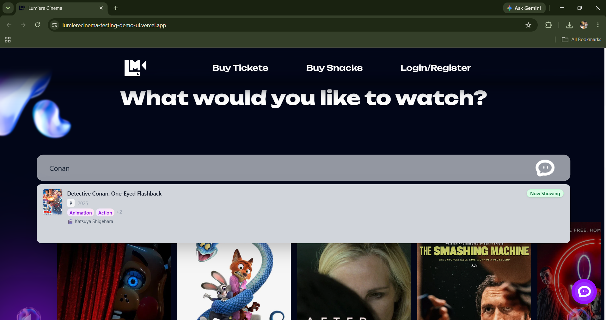
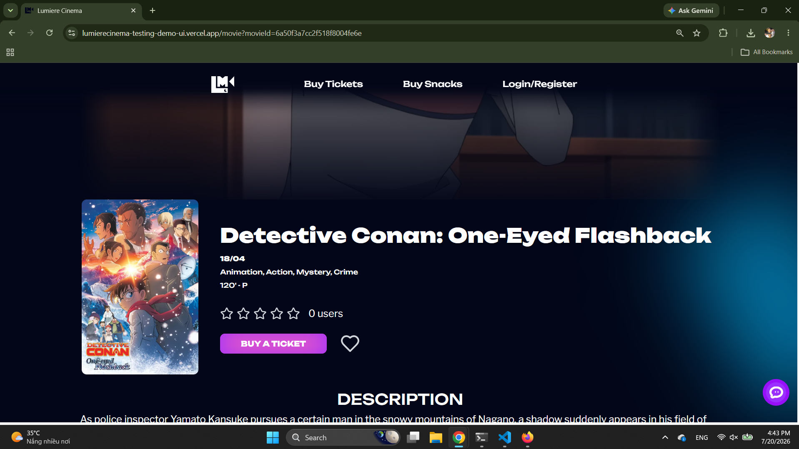
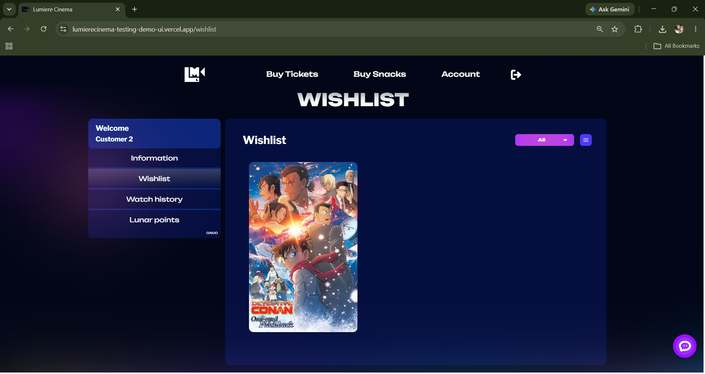
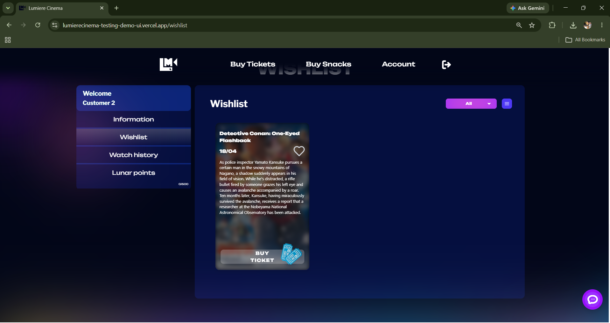
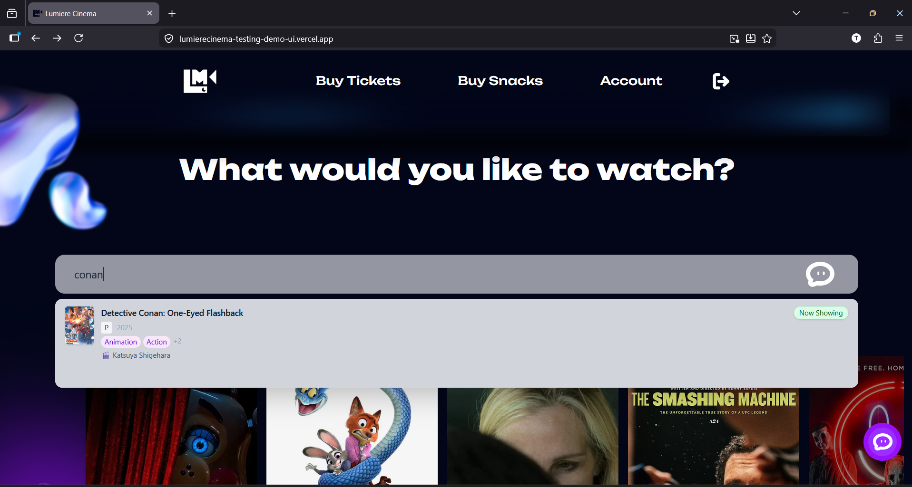
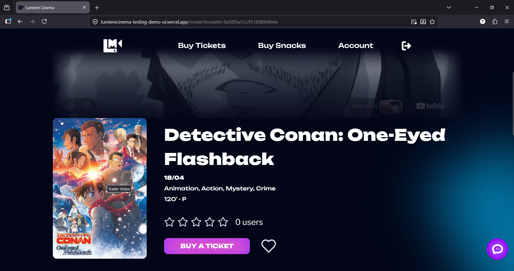
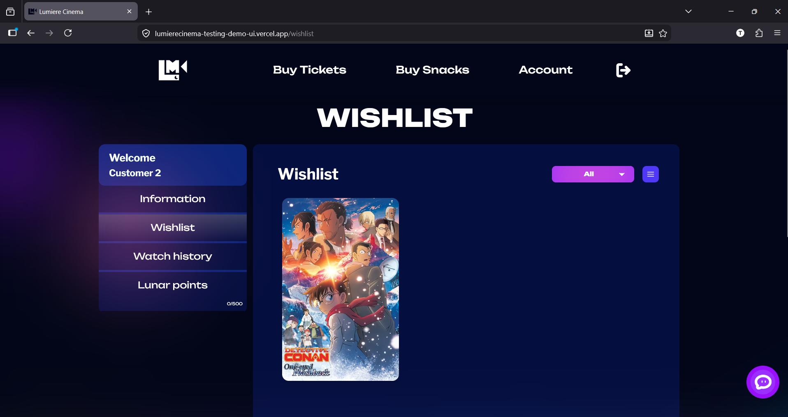
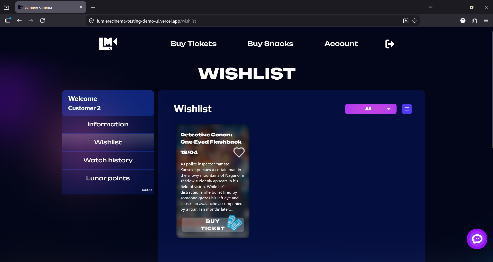

# Báo cáo usability testing — U-03

## Phạm vi và phương pháp

- Website: https://lumierecinema-testing-demo-ui.vercel.app/
- Flow: U-03 — Tìm kiếm phim, xem chi tiết, thêm/xóa wishlist
- FR: FR-10, FR-14, FR-15, FR-16, FR-35, FR-37
- Ngày test: 2026-07-20
- Mẫu: 1 người tham gia thật (P01)
- Phương pháp: moderated think-aloud, timebox 8 phút/người
- Start state: đã đăng nhập sẵn tài khoản test (P01: `user_test_02`), wishlist trống
- Deviation/giới hạn: Không có deviation ở P01. Cỡ mẫu nhỏ (n=1) — các tỷ lệ và median chỉ mang tính định hướng, chưa đủ suy rộng.

## Kết quả tổng quan

| Participant | Outcome | Thời gian | Error | Wrong turn | Hesitation | Intervention | Tìm đúng phim | Đã lưu | Đã xóa | Ratings (tìm/tự tin/rõ) |
| --- | --- | ---: | ---: | ---: | ---: | ---: | :---: | ---: | :---: | --- |
| P01 | SUCCESS_UNASSISTED | 245s | 1 | 0 | 2 | 0 | Có | 2 | Có | 5 / 4 / 4 |

- Tỷ lệ hoàn thành (mọi hình thức): 1/1 phiên hoàn thành task.
- Tỷ lệ hoàn thành không trợ giúp: 1/1 (P01). Có trợ giúp: 0/1.
- Median thời gian của lượt thành công: 245s (trên 1 lượt).
- Tổng hợp rating (trên 1 phiên): Q1 (tìm phim dễ) = 5 · Q2 (tự tin lưu/xóa đúng) = 4 · Q3 (thông tin/phản hồi rõ) = 4.

## Findings

Mỗi finding là một vấn đề usability riêng biệt. Severity theo thang của đề:

| Mức | Ý nghĩa |
| --- | ------- |
| S1 | Không hoàn thành được task. |
| S2 | Hoàn thành nhưng cần trợ giúp hoặc nhầm nghiêm trọng. |
| S3 | Hoàn thành nhưng bị chậm/do dự nhiều. |
| S4 | Vướng nhỏ, không ảnh hưởng nhiều. |

### F-01 — Nút "Thêm vào wishlist" trên trang chi tiết khó nhận biết, dễ nhầm với icon khác

- Flow: U-03
- FR liên quan: FR-10 (thêm wishlist), FR-35 (giao diện khách hàng)
- Frequency: 1/1 phiên (P01)
- Bằng chứng: P01 lúc 02:10 click lệch icon ("Ủa chưa ăn?") rồi click lại đúng ở 02:18.
- Tác động đến task: Gây thao tác thừa và nhầm lẫn; góp phần vào error count (P01: 1).
- Severity: **S3** (hoàn thành nhưng chậm/do dự, nhầm rồi tự sửa được).
- Lý do severity: Người dùng tự khôi phục không cần trợ giúp; ảnh hưởng tốc độ và sự chắc chắn, không chặn task.
- Nguyên nhân khả dĩ (diễn giải): Icon "add to wishlist" thiếu affordance/nhãn, đặt gần icon share nên dễ lẫn.
- Đề xuất cải thiện: Dùng nút có nhãn chữ "Lưu / Thêm vào wishlist" (hoặc icon trái tim quen thuộc) tách khỏi cụm share; thêm tooltip.
- Tiêu chí xác minh: Người dùng mới xác định đúng nút lưu ngay lần đầu, không click nhầm sang icon khác.

### F-02 — Click icon wishlist "không ăn" và thiếu phản hồi khi click trượt (hit area nhỏ)

- Flow: U-03
- FR liên quan: FR-37 (phản hồi trạng thái), FR-10 (thêm wishlist)
- Frequency: 1/1 phiên (P01)
- Bằng chứng: P01 lúc 02:10 click lệch → "Không có phản hồi", researcher note "hit area của icon nhỏ → dễ miss click". Ở câu hỏi mở, P01 trả lời "click lần đầu không có phản hồi".
- Tác động đến task: Người dùng nghi ngờ đã lưu chưa, phải thử lại; hạ điểm tự tin và độ rõ ràng của phản hồi (Q2 = 4, Q3 = 4).
- Severity: **S3** (hoàn thành nhưng do dự nhiều do thiếu phản hồi tức thời).
- Lý do severity: Không chặn hoàn thành nhưng làm giảm sự tin tưởng vào kết quả.
- Nguyên nhân khả dĩ (diễn giải): Vùng bấm (hit area) của icon nhỏ; khi click trượt hệ thống không báo gì (không lỗi, không hover/active state).
- Đề xuất cải thiện: Tăng hit area của nút; thêm trạng thái hover/active/disabled rõ; đảm bảo mọi click (kể cả trượt) có phản hồi trực quan; giữ toast thành công đủ lâu.
- Tiêu chí xác minh: Không còn quan sát "click không ăn"; người dùng khẳng định chắc chắn đã lưu ngay sau thao tác.

> Ghi chú phân tích: F-01 và F-02 liên quan nhau (đều quanh nút wishlist) nhưng tách riêng vì khác nguyên nhân gốc — F-01 là *khả năng nhận biết/nhầm nút*, F-02 là *hit area + thiếu phản hồi*. Do hiện chỉ còn 1 phiên, frequency chỉ mang tính định hướng.

## Kết quả BrowserStack

Chạy lại flow U-03 trên BrowserStack. Screenshot được chia theo từng trình duyệt trong thư mục `images/`.

### Chrome

- Trình duyệt: Chrome
- Ghi nhận lỗi/vỡ layout/không thao tác được: Thao tác xóa phim khỏi wishlist không hoạt động đúng. Sau khi bấm remove/delete film, phim vẫn còn hiển thị trong wishlist, nên người dùng không xác nhận được thao tác xóa đã thành công.

Tên ảnh: `search.png`

Tên ảnh: `detail.png`

Tên ảnh: `add.png`

Tên ảnh: `delete.png`

### Firefox

- Trình duyệt: Firefox
- Ghi nhận lỗi/vỡ layout/không thao tác được: Thao tác xóa phim khỏi wishlist không hoạt động đúng, giống Chrome. Sau khi bấm remove/delete film, phim vẫn còn hiển thị trong wishlist, nên người dùng không xác nhận được thao tác xóa đã thành công.

Tên ảnh: `search.png`

Tên ảnh: `detail.png`

Tên ảnh: `add.png`

Tên ảnh: `remove.png`

## Kết luận và giới hạn

- Người tham gia P01 hoàn thành task không cần trợ giúp; điểm mạnh nhất là **tìm kiếm phim** (Q1 = 5; P01: "Search khá nhanh và chính xác").
- Nút nghẽn tập trung ở **khu vực wishlist**: nút thêm dễ nhầm (F-01, S3), và thiếu phản hồi khi thao tác (F-02, S3). Hai finding này nên được gộp vào một đợt tinh chỉnh nút wishlist.
- **Giới hạn:** mới có 1 phiên, cỡ mẫu nhỏ nên tỷ lệ/median chỉ định hướng; cần thêm dữ liệu người tham gia nếu muốn chốt frequency. Kết quả BrowserStack cho thấy lỗi xóa khỏi wishlist xuất hiện trên cả Chrome và Firefox; các phần nghi ngờ do lỗi hạ tầng (nếu có) cần tách khỏi finding usability.
