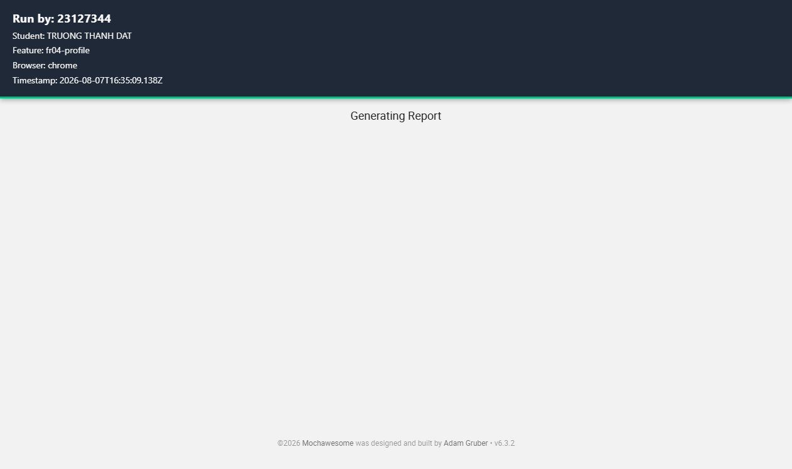
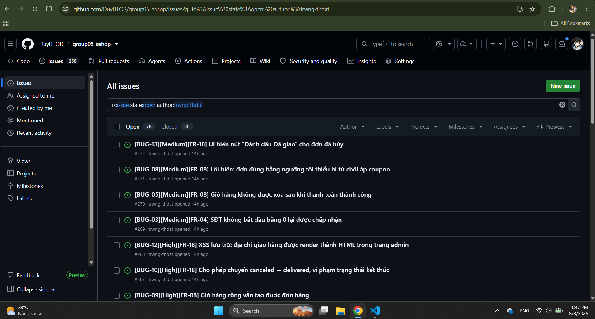

# HW04 — Automation Testing — Báo cáo chính

> **Cam kết:** mọi số liệu thực thi, ảnh chụp, báo cáo HTML và timestamp trong báo cáo này đều lấy từ các lượt chạy thật, không bịa. Các mục chưa chạy được ghi rõ là chưa chạy.

## 0. Thông tin sinh viên

| Trường                    | Giá trị                                                                                |
| ------------------------- | -------------------------------------------------------------------------------------- |
| Họ tên                    | TRƯƠNG THÀNH ĐẠT                                                                               |
| MSSV                      | 23127344                                                                                 |
| Lớp / Nhóm                | Kiểm thử phần mềm - 23KTPM3                                                                                  |
| Assignment                | HW04 — Automation Testing (HW04-AI)                                                    |
| Ngày nộp                  | [dd/mm/2026]                                                                           |
| Self-Assessed Grade       | **100** / 100 (chi tiết từng tiêu chí: [`README.md`](README.md))                        |
| SUT                       | EShop — `https://github.com/ttbhanh/eshop-sut` (bản dùng chung, tương ứng `eshop-sut`) |
| GitHub repo (public)      | https://github.com/trwng-thdat/software-testing (scripts · data · HTML reports)                |
| GitHub Issues             | https://github.com/DuyITLOR/group05_eshop/issues — 13 issue #260–#272 (repo của SUT)   |
| 📹 Video demo (Task 2)    | https://youtu.be/kbkZxUZHS_M                                                            |
| 📹 Video demo Agent Skill | https://youtu.be/1FvnyriJITQ                                                            |

> 📌 **Hai repo tách biệt — đúng theo bản chất bài làm:**
>
> | Repo | Vai trò |
> | ---- | ------- |
> | [`trwng-thdat/software-testing`](https://github.com/trwng-thdat/software-testing) | **Repo bài làm của em** — script Selenium, file dữ liệu, 9 báo cáo HTML, ảnh chụp bug, Agent Skill. **Toàn bộ commit ở §5 nằm ở đây.** |
> | [`DuyITLOR/group05_eshop`](https://github.com/DuyITLOR/group05_eshop) | **Repo của SUT** (EShop) — nơi tạo **13 bug issue #260–#272**, vì bug thuộc về mã nguồn SUT chứ không thuộc về mã kiểm thử. |
>
> Bug được báo trên repo chứa lỗi là cách làm đúng trong thực tế: issue phải nằm ở nơi lập trình viên sửa được, không phải ở repo của người kiểm thử.

**Công cụ đã dùng:** **Claude Opus 5** (Claude Code, VSCode extension) · **Selenium 4+** (TypeScript + Mocha + Chai) · **mochawesome** (HTML reporter).


---

## 1. Phạm vi lựa chọn (Feature Selection)

> Theo §5 đề bài: tự động hóa **đúng 3 feature web** đã chọn ở HW02 — mỗi Pool A/B/C một feature. **Pool D (mobile) không dùng** ở bài này vì HW04 chỉ tự động hóa web frontend.

| Feature   | Pool | FR ID | Tên feature                 | Màn hình / route                               | Số TC tự động hóa |
| --------- | ---- | ----- | --------------------------- | ---------------------------------------------- | ----------------- |
| Feature A | A    | FR-04 | Personal profile management | `frontend-web` `/profile`                      | 15 (§1.4.1)       |
| Feature B | B    | FR-08 | Checkout                    | `frontend-web` `/checkout`                     | 16 (§1.4.2)       |
| Feature C | C    | FR-18 | Order management (admin)    | `frontend-admin` (tab **Đơn hàng**, port 5174) | 16 (§1.4.3)       |

**Nguồn lựa chọn:** kế thừa từ HW02 ([`../hw2/README.md`](../hw2/README.md)) — không trùng với thành viên khác trong nhóm.


**Môi trường thực thi:**

| Thành phần     | Giá trị                                   |
| -------------- | ----------------------------------------- |
| OS             | Windows 11 Home Single Language           |
| Backend API    | `http://localhost:3000`                   |
| Customer web   | `http://localhost:5173`                   |
| Admin web      | `http://localhost:5174`                   |
| Trình duyệt    | Chrome 151.0.7922.76 · Edge 151.0.4129.59 · Firefox 153.0.3 |
| Node.js        | v22.22.1                                  |
| Selenium       | selenium-webdriver 4.46.0 · Mocha 10.8.2  |
| Tài khoản test | user `hw04.fixture@eshop.test` · admin `admin@eshop.com` |


---

# TASK 1 — AI-generated automation scripts

> Trọng số: 25 + 25 + 25 = **75/100** (mỗi feature 25 điểm).

## 1.1 Nguồn tham chiếu đã đọc


| Nguồn                                                        | Nội dung liên quan                                                                                                                                     |
| ------------------------------------------------------------ | ------------------------------------------------------------------------------------------------------------------------------------------------------ |
| `eshop-sut/README.md` (SRS) §2 FR-04, dòng 62–68             | SĐT hợp lệ: bắt đầu bằng `0`, dài 10–11 chữ số; email không đổi được; không tự đổi `role`                                                              |
| `eshop-sut/README.md` (SRS) §4 FR-08, dòng 102–108           | Chỉ user đã đăng nhập; tổng tiền **không cho sửa trực tiếp**; backend tự tính lại; xóa giỏ sau thanh toán                                              |
| `eshop-sut/README.md` (SRS) §4 FR-09, dòng 110–139           | 5 điều kiện coupon C1–C5, công thức percent/fixed, bảng 4 mã mẫu                                                                                       |
| `eshop-sut/README.md` (SRS) §5 FR-10, dòng 141–162           | State machine 5 trạng thái; `delivered`/`canceled` là trạng thái kết thúc                                                                              |
| `eshop-sut/README.md` (SRS) §6 FR-12, dòng 174–180           | Mọi API `/api/admin/*` yêu cầu JWT hợp lệ \+ `role = 'admin'`                                                                                          |
| `eshop-sut/README.md` (SRS) §6 FR-18, dòng 218–222           | Admin xem mọi đơn; chuyển trạng thái theo FR-10; địa chỉ hiển thị an toàn                                                                              |
| `eshop-sut/backend/server.js` dòng 112–135, 297–330, 525–555 | Hành vi backend thật của `PUT /api/users/me`, `POST /api/checkout`, `PUT /api/admin/orders/:id/status` — dùng làm đối chiếu, **không** dùng làm oracle |
| `eshop-sut/setup_guide.md`                                   | Cổng dịch vụ, tài khoản admin mặc định                                                                                                                 |
| `frontend-web/src/pages/Profile.jsx`                         | DOM thật của màn hình hồ sơ                                                                                                                            |
| `frontend-web/src/pages/Checkout.jsx`                        | DOM thật của màn hình thanh toán                                                                                                                       |
| `frontend-admin/src/App.jsx`                                 | DOM thật của admin (SPA dạng tab, không có router)                                                                                                     |
| Test case HW02                                               | [Bảng TC gốc — mỗi TC ID thành 1 `it()`]                                                                                                               |

## 1.2 Chiến lược AI-First — sinh script theo từng bước

> Yêu cầu §6 Task 1: **không** dùng một prompt chung chung kiểu "viết hết script cho feature này". Phải dẫn dắt AI theo từng bước như kỹ thuật đã học.
> Log đầy đủ (verbatim prompt + output) nằm ở [`[AI-02] - AI Audit Report`](<[AI-02] - FIT@HCMUS - AI Audit Report_En.docx.md>). Dưới đây tóm tắt các bước để báo cáo liền mạch.

| Bước | Mục tiêu của bước                                             | Prompt (tóm tắt) | Output AI (tóm tắt) | Ghi chú review nhanh |
| ---- | ------------------------------------------------------------- | ---------------- | ------------------- | -------------------- |
| B1   | Thiết lập khung dự án (config, driver factory, data loader)   | [prompt]         | [output]            | [đã sửa gì]          |
| B2   | Chuyển bảng TC HW02 → file dữ liệu JSON (chưa viết code test) | [prompt]         | [output]            | [đã sửa gì]          |
| B3   | Sinh spec cho từng nhóm TC positive                           | [prompt]         | [output]            | [đã sửa gì]          |
| B4   | Sinh spec cho nhóm TC negative                                | [prompt]         | [output]            | [đã sửa gì]          |
| B5   | Bổ sung nhóm TC edge / boundary                               | [prompt]         | [output]            | [đã sửa gì]          |
| B6   | Thêm assertion đối chiếu API (persistence)                    | [prompt]         | [output]            | [đã sửa gì]          |
| B7   | Cấu hình đa trình duyệt + metadata báo cáo `Run by:`          | [prompt]         | [output]            | [đã sửa gì]          |
| B8   | Sửa lỗi sau lần chạy thật đầu tiên                            | [prompt]         | [output]            | [đã sửa gì]          |


## 1.3 Cấu trúc dự án automation

```text
selenium/
  .env.example            # STUDENT_ID, WEB_URL, ADMIN_URL, BROWSERS, ...
  .mocharc.json
  package.json
  data/
    fr04-profile.data.json      # 15 test case  ✅
    fr08-checkout.data.json     # 16 test case  ✅
    fr18-admin-orders.data.json # 16 test case  ✅
  tests/
    fr04-profile.spec.ts        # ✅
    fr08-checkout.spec.ts       # ✅
    fr18-admin-orders.spec.ts   # ✅
  utils/
    config.ts  driver.ts  dataLoader.ts  alerts.ts  reportMetadata.ts  bugReporter.ts  api.ts
    profilePage.ts              # page object FR-04
    checkoutPage.ts             # page object FR-08 (/product/:id, /cart, /checkout)
    adminOrdersPage.ts          # page object FR-18 (SPA dạng tab, port 5174)
    runMatrix.ts  verifyReports.ts
  reports/
    fr04-profile/{chrome,edge,firefox}.html
    fr08-checkout/{chrome,edge,firefox}.html
    fr18-admin-orders/{chrome,edge,firefox}.html
  bug-snapshots/
    BUGS.md  <TC-ID>.png
```

**Cách chạy lại (reproducible):**

```bash
cd selenium
npm install
cp .env.example .env          # điền STUDENT_ID, STUDENT_NAME, URL, tài khoản
npm run typecheck
npm run test:all-browsers     # 3 feature × 3 browser = 9 lượt, tự đóng dấu báo cáo
# hoặc chạy riêng từng feature:
npm run test:fr04             # FR-04 × 3 browser
npm run test:fr08             # FR-08 × 3 browser
npm run test:fr18             # FR-18 × 3 browser
npm run verify:reports        # cổng kiểm: đếm case, kiểm 9 file HTML + banner Run by:
```

> ⚠️ **Tài khoản admin:** mật khẩu seed thật là `Admin123!` (`backend/database.js:92`), **không** phải `admin123`. Nhập sai bị cộng `login_attempts` \+2 mỗi lần và **khóa tài khoản ở lần thứ 3** (`server.js:55-60`).

> ⚠️ **Điều kiện chạy FR-08:** SUT phải ở trạng thái seed sạch hoặc ít nhất còn lượt dùng coupon. Bộ test tự phục hồi hạn mức coupon (`ensureCouponAllowance`), nhưng dữ liệu `orders` sẽ tăng dần qua mỗi lần chạy — điều này **không** ảnh hưởng assertion vì mọi case đều so sánh theo `id` đơn hàng tương đối, không theo số tuyệt đối.

## 1.4 Data-driven — dữ liệu tách rời khỏi script

> Yêu cầu §6: dữ liệu test **phải** nằm ở file `.csv`/`.json` riêng. Mảng/đối tượng hardcode trong script **không được chấp nhận**.

| Feature  | File dữ liệu                       | Định dạng | Số case | Positive | Negative | Edge   |
| -------- | ---------------------------------- | --------- | ------- | -------- | -------- | ------ |
| FR-04    | `data/fr04-profile.data.json`      | JSON      | 15      | 5        | 7        | 3      |
| FR-08    | `data/fr08-checkout.data.json`     | JSON      | 16      | 6        | 6        | 4      |
| FR-18    | `data/fr18-admin-orders.data.json` | JSON      | 16      | 6        | 7        | 3      |
| **Tổng** |                                    |           | **47**  | **17**   | **20**   | **10** |

> Chi tiết từng test case: §1.4.1 (FR-04), §1.4.2 (FR-08), §1.4.3 (FR-18).

**Ví dụ một case trong file dữ liệu:**

```json
{
  "tcId": "TC-PROFILE-01",
  "title": "[Tiêu đề TC]",
  "type": "positive",
  "input": { "...": "..." },
  "expected": { "...": "..." }
}
```

Spec **duyệt** mảng này (`for (const c of cases) it(...)`), không viết cứng từng `it()` với dữ liệu literal.

### 1.4.1 Bộ test case — Feature A · Pool A · FR-04 Quản lý hồ sơ cá nhân

> Đặc tả tham chiếu: SRS §2 FR-04 (dòng 62–68). Màn hình `frontend-web/src/pages/Profile.jsx`, API `PUT /api/users/me`.
> Quy tắc oracle: **SĐT hợp lệ = bắt đầu bằng `0`, dài 10–11 chữ số**; email không đổi được; user chỉ sửa hồ sơ của chính mình và **không được tự đổi `role`**.

| TC ID         | Loại     | Tiêu đề                                     | Input                                                            | Expected (theo SRS)                                           | Assertion pattern  |
| ------------- | -------- | ------------------------------------------- | ---------------------------------------------------------------- | ------------------------------------------------------------- | ------------------ |
| TC-PROFILE-01 | positive | Cập nhật đủ 3 trường hợp lệ                 | name `Nguyễn Văn A`, phone `0912345678`, address `12 Lê Lợi, Q1` | Thông báo "Cập nhật thành công!"; dữ liệu được lưu            | 1 UI · 2 API       |
| TC-PROFILE-02 | positive | Chỉ đổi họ tên, giữ nguyên phone/address    | name `Trần Thị B`                                                | Cập nhật thành công; phone và address không đổi               | 2 API              |
| TC-PROFILE-03 | positive | Dữ liệu vẫn còn sau khi tải lại trang       | Cập nhật rồi F5                                                  | Form hiển thị đúng giá trị vừa lưu                            | 1 UI               |
| TC-PROFILE-04 | positive | SĐT biên dưới 10 chữ số                     | phone `0123456789`                                               | Chấp nhận (đúng 10 chữ số, bắt đầu bằng `0`)                  | 1 UI · 2 API       |
| TC-PROFILE-05 | positive | SĐT biên trên 11 chữ số                     | phone `01234567890`                                              | Chấp nhận (đúng 11 chữ số)                                    | 1 UI · 2 API       |
| TC-PROFILE-06 | negative | SĐT 9 chữ số (dưới biên)                    | phone `091234567`                                                | Bị từ chối, hiện thông báo lỗi, không lưu                     | 3 Rejection        |
| TC-PROFILE-07 | negative | SĐT 12 chữ số (trên biên)                   | phone `012345678901`                                             | Bị từ chối, không lưu                                         | 3 Rejection        |
| TC-PROFILE-08 | negative | SĐT không bắt đầu bằng `0`                  | phone `912345678`                                                | Bị từ chối theo SRS §FR-04                                    | 3 Rejection        |
| TC-PROFILE-09 | negative | SĐT chứa chữ cái                            | phone `09abc45678`                                               | Bị từ chối, không lưu                                         | 3 Rejection        |
| TC-PROFILE-10 | negative | Bỏ trống họ tên                             | name `` (rỗng)                                                   | Không cho submit (trường `required`)                          | 3 Rejection        |
| TC-PROFILE-11 | negative | Email không sửa được qua UI                 | Thử nhập vào ô Email                                             | Ô Email `disabled`, giá trị không đổi                         | 1 UI               |
| TC-PROFILE-12 | negative | **Không được tự nâng quyền `role`**         | `PUT /api/users/me` kèm `{"role":"admin"}`                       | API **phải bỏ qua/từ chối** trường `role`; user vẫn là `user` | 2 API · 5 Security |
| TC-PROFILE-13 | edge     | Họ tên chứa ký tự Unicode tiếng Việt có dấu | name `Đặng Thị Ngọc Hoà`                                         | Lưu và hiển thị đúng, không lỗi encoding                      | 1 UI · 2 API       |
| TC-PROFILE-14 | edge     | Địa chỉ rất dài (500 ký tự)                 | address 500 ký tự                                                | Lưu đủ, không cắt chuỗi, không vỡ layout                      | 2 API              |
| TC-PROFILE-15 | edge     | Địa chỉ chứa payload HTML                   | address `<b>x</b>`                                               | Hiển thị dạng **text thuần**, không render thẻ HTML           | 5 Security         |

> ✅ **Defect đã XÁC NHẬN bằng chạy thật** (3/3 trình duyệt, xem §1.9):
> — `Profile.jsx:43` dùng regex `/^[1-9][0-9]{8,9}$/` → yêu cầu SĐT **bắt đầu bằng 1–9 và dài 9–10 số**, **trái ngược** đặc tả (`0`, 10–11 số). **Kết quả thật: TC-PROFILE-04/05/08 FAIL** (BUG-01/02/03). Lưu ý TC-PROFILE-06 lại **PASS** — SĐT 9 chữ số bắt đầu bằng `0` bị cả hai luật cùng từ chối, nên dù luật sai thì kết quả vẫn trùng khớp kỳ vọng.
> — `server.js:119-125` (`PUT /api/users/me`) **nhận cả trường `role`** từ body → **TC-PROFILE-12 FAIL, leo thang đặc quyền có thật** (BUG-04, Critical): `role` đổi `user` → `admin` với HTTP 200.
> Expected giữ **theo SRS**, không sửa theo hành vi hiện tại của code.

### 1.4.2 Bộ test case — Feature B · Pool B · FR-08 Thanh toán (Checkout)

> Đặc tả tham chiếu: SRS §4 FR-08 (dòng 102–108) và FR-09 Coupon (dòng 110–139). Màn hình `frontend-web/src/pages/Checkout.jsx`, API `POST /api/checkout`, `POST /api/apply-coupon`.
> Coupon mẫu trong hệ thống: `SAVE10` (percent 10%, ngưỡng 300.000₫), `BIGBUY` (fixed 50.000₫, ngưỡng 500.000₫), `VIP100` (fixed 100.000₫, ngưỡng 300.000₫, 2 lượt), `EXPIRED` (hết hạn 2020-01-01).

| TC ID          | Loại     | Tiêu đề                                   | Input                                 | Expected (theo SRS)                                   | Assertion pattern        |
| -------------- | -------- | ----------------------------------------- | ------------------------------------- | ----------------------------------------------------- | ------------------------ |
| TC-CHECKOUT-01 | positive | Thanh toán thành công giỏ 1 sản phẩm      | 1 sản phẩm, đã đăng nhập              | Hiện "Thanh toán thành công!"; tạo đơn `pending`      | 1 UI · 2 API             |
| TC-CHECKOUT-02 | positive | Thanh toán giỏ nhiều sản phẩm             | 3 sản phẩm khác nhau                  | Đơn tạo đúng, liệt kê đủ sản phẩm                     | 1 UI · 4 Integrity       |
| TC-CHECKOUT-03 | positive | Giỏ hàng được xóa sau khi thanh toán      | Thanh toán xong, mở lại `/cart`       | Giỏ hàng rỗng (SRS FR-08)                             | 1 UI                     |
| TC-CHECKOUT-04 | positive | Áp mã `SAVE10` cho đơn đủ ngưỡng          | total 400.000₫ \+ `SAVE10`            | discount \= 40.000₫; final \= 360.000₫                | 4 Integrity              |
| TC-CHECKOUT-05 | positive | Áp mã `BIGBUY` (fixed)                    | total 600.000₫ \+ `BIGBUY`            | discount \= 50.000₫; final \= 550.000₫                | 4 Integrity              |
| TC-CHECKOUT-06 | positive | Mã nhập chữ thường vẫn nhận               | `save10`                              | Chuẩn hóa thành `SAVE10`, áp dụng được                | 1 UI                     |
| TC-CHECKOUT-07 | negative | **Tổng tiền không được sửa trực tiếp**    | Sửa ô tổng tiền còn `1`               | UI **không cho sửa**; backend tự tính lại (SRS FR-08) | 3 Rejection · 5 Security |
| TC-CHECKOUT-08 | negative | Mã không tồn tại                          | `NOTEXIST`                            | Báo lỗi, không giảm giá                               | 3 Rejection              |
| TC-CHECKOUT-09 | negative | Mã hết hạn (C2)                           | `EXPIRED`                             | Từ chối vì quá `expired_at`                           | 3 Rejection              |
| TC-CHECKOUT-10 | negative | Chưa đủ ngưỡng đơn hàng (C3)              | total 299.000₫ \+ `SAVE10`            | Từ chối vì `total < min_order_amount`                 | 3 Rejection              |
| TC-CHECKOUT-11 | negative | Chưa đăng nhập không thanh toán được (C4) | Guest bấm thanh toán                  | Bị chặn / yêu cầu đăng nhập                           | 3 Rejection · 5 Security |
| TC-CHECKOUT-12 | negative | Dùng quá số lượt cho phép (C5)            | `SAVE10` lần thứ 2 cùng 1 user        | Từ chối vì `max_uses_per_user = 1`                    | 3 Rejection              |
| TC-CHECKOUT-13 | edge     | Ngưỡng biên đúng bằng `min_order_amount`  | total 300.000₫ \+ `SAVE10`            | **Chấp nhận** (điều kiện C3 là `>=`)                  | 4 Integrity              |
| TC-CHECKOUT-14 | edge     | Ngưỡng biên thiếu 1₫                      | total 299.999₫ \+ `SAVE10`            | Từ chối                                               | 3 Rejection              |
| TC-CHECKOUT-15 | edge     | Giảm giá không vượt quá tổng đơn          | total 100.000₫ \+ `VIP100` (100.000₫) | `final_amount` \>= 0, không âm                        | 4 Integrity              |
| TC-CHECKOUT-16 | edge     | Thanh toán khi giỏ rỗng                   | Giỏ rỗng                              | Không tạo được đơn, có thông báo                      | 3 Rejection              |

> ✅ **Defect đã XÁC NHẬN bằng chạy thật** (3/3 trình duyệt, xem §1.9) — **11 PASS / 5 FAIL**:
> — `Checkout.jsx:93-102` render tổng tiền bằng `<input type="number">` **cho phép người dùng sửa trực tiếp**, và `handleCheckout` gửi chính giá trị đó lên server. `server.js:297-307` (`POST /api/checkout`) **lưu thẳng `total_amount` từ client, không tính lại**. **Kết quả thật: TC-CHECKOUT-07 FAIL** (BUG-07, Critical).
> — `server.js` (`POST /api/apply-coupon`) tính giảm giá percent bằng `total_amount * (1 - discount_value)`. Với `SAVE10` (`discount_value = 10`) → `4.000.000 × (1−10) = −36.000.000₫`. **Kết quả thật: TC-CHECKOUT-04 FAIL** (BUG-06, High) — xác nhận thêm bằng gọi API trực tiếp: `{"discount_amount":-36000000,"final_amount":40000000}`.
> — `server.js` kiểm ngưỡng bằng `total_amount > coupon.min_order_amount` (`>`) thay vì `>=` theo FR-09 C3. **Kết quả thật: TC-CHECKOUT-13 FAIL** (BUG-08, Medium) — đơn đúng 300.000₫ bị từ chối.
> — `Checkout.jsx:8` có import `clearCart` nhưng **không bao giờ gọi**. **Kết quả thật: TC-CHECKOUT-03 FAIL** (BUG-05, Medium) — giỏ hàng còn nguyên sau khi thanh toán.
> — `POST /api/checkout` **bỏ qua hoàn toàn `items`**, chỉ ghi `total_amount`. **Kết quả thật: TC-CHECKOUT-16 FAIL** (BUG-09, High) — giỏ rỗng vẫn tạo được đơn.
> — TC-CHECKOUT-15 **PASS**: `VIP100` trên đơn 310.000₫ cho `final_amount = 210.000₫`, không âm. Đây là mã `fixed` nên không dính lỗi công thức percent ở trên.
> Expected giữ **theo SRS**, không sửa theo hành vi hiện tại của code.

### 1.4.3 Bộ test case — Feature C · Pool C · FR-18 Quản lý đơn hàng (Admin)

> Đặc tả tham chiếu: SRS §6 FR-18 (dòng 218–222), state machine FR-10 (dòng 141–162), access control FR-12 (dòng 174–180). Màn hình `frontend-admin/src/App.jsx` tab **Đơn hàng** (port 5174), API `PUT /api/admin/orders/:id/status`.
> State machine hợp lệ: `pending → confirmed|canceled`; `confirmed → shipping|canceled`; `shipping → delivered`. **`delivered` và `canceled` là trạng thái kết thúc — không được chuyển tiếp.**

| TC ID       | Loại     | Tiêu đề                                  | Input                                          | Expected (theo SRS)                                | Assertion pattern         |
| ----------- | -------- | ---------------------------------------- | ---------------------------------------------- | -------------------------------------------------- | ------------------------- |
| TC-ADMIN-01 | positive | Admin xem được đơn của mọi user          | Đăng nhập admin, mở tab Đơn hàng               | Bảng liệt kê đơn của nhiều user khác nhau          | 1 UI                      |
| TC-ADMIN-02 | positive | Chuyển `pending → confirmed`             | Bấm "Xác nhận"                                 | Trạng thái thành "Đã xác nhận"                     | 1 UI · 2 API              |
| TC-ADMIN-03 | positive | Chuyển `confirmed → shipping`            | Bấm "Giao hàng"                                | Trạng thái thành "Đang giao"                       | 1 UI · 2 API              |
| TC-ADMIN-04 | positive | Chuyển `shipping → delivered`            | Bấm "Hoàn thành"                               | Trạng thái thành "Đã giao"                         | 1 UI · 2 API              |
| TC-ADMIN-05 | positive | Hủy đơn từ `pending`                     | Bấm "Hủy"                                      | Trạng thái thành "Đã hủy"                          | 1 UI · 2 API              |
| TC-ADMIN-06 | positive | Hủy đơn từ `confirmed`                   | Bấm "Hủy"                                      | Trạng thái thành "Đã hủy"                          | 1 UI · 2 API              |
| TC-ADMIN-07 | negative | **`canceled` là trạng thái kết thúc**    | `PUT` đơn `canceled` → `delivered`             | **Phải bị từ chối** (FR-10)                        | 3 Rejection · 4 Integrity |
| TC-ADMIN-08 | negative | **`delivered` là trạng thái kết thúc**   | `PUT` đơn `delivered` → `shipping`             | Phải bị từ chối                                    | 3 Rejection · 4 Integrity |
| TC-ADMIN-09 | negative | Không được nhảy cóc `pending → shipping` | `PUT` bỏ qua `confirmed`                       | Phải bị từ chối                                    | 3 Rejection               |
| TC-ADMIN-10 | negative | Không được lùi `shipping → pending`      | `PUT` lùi trạng thái                           | Phải bị từ chối                                    | 3 Rejection               |
| TC-ADMIN-11 | negative | Trạng thái không tồn tại                 | `PUT` với `status: "abc"`                      | Trả lỗi, không đổi dữ liệu                         | 3 Rejection               |
| TC-ADMIN-12 | negative | **Token non-admin bị chặn**              | Gọi `/api/admin/orders` bằng token user thường | HTTP 401/403 (FR-12)                               | 5 Security                |
| TC-ADMIN-13 | negative | Không có token bị chặn                   | Gọi API không kèm token                        | HTTP 401                                           | 5 Security                |
| TC-ADMIN-14 | edge     | **Địa chỉ giao hàng hiển thị an toàn**   | Đơn có địa chỉ `<b>xss</b>`                    | Hiển thị **text thuần**, không render HTML (FR-18) | 5 Security                |
| TC-ADMIN-15 | edge     | Đơn không tồn tại                        | `PUT /api/admin/orders/999999/status`          | HTTP 404                                           | 3 Rejection               |
| TC-ADMIN-16 | edge     | Nút hành động khớp trạng thái hiện tại   | Đơn `delivered`                                | **Không** hiện nút chuyển trạng thái nào           | 1 UI                      |

> ✅ **Defect đã XÁC NHẬN bằng chạy thật** (3/3 trình duyệt, xem §1.9) — **12 PASS / 4 FAIL**:
> — `App.jsx:862-869`: đơn ở trạng thái `canceled` vẫn hiện nút **"Đánh dấu Đã giao"**, và `server.js:549-550` có nhánh `if (currentStatus === "canceled" && status === "delivered") isValidTransition = true;` → **cho phép `canceled → delivered`**. **Kết quả thật: TC-ADMIN-07 FAIL** (BUG-10, High — API trả HTTP 200 `{"message":"Order status updated"}`) **và TC-ADMIN-16 FAIL** (BUG-13, Medium — UI mời chuyển tiếp từ trạng thái kết thúc).
> — `App.jsx:799-804`: cột Địa chỉ dùng `dangerouslySetInnerHTML`. **Kết quả thật: TC-ADMIN-14 FAIL** (BUG-12, High) — địa chỉ `<b>xss</b>` bị **render thành thẻ HTML thật**, đọc lại chỉ còn `xss`.
> — **Phát hiện mới khi chạy thật, không có trong dự đoán ban đầu:** `server.js:100-110` — middleware `authenticateToken` chỉ verify chữ ký JWT mà **không hề kiểm `role`**, trong khi **mọi** endpoint `/api/admin/*` chỉ dùng đúng middleware này. **Kết quả thật: TC-ADMIN-12 FAIL** (BUG-11, **Critical**) — token của user thường gọi `GET /api/admin/orders` trả **HTTP 200 kèm toàn bộ đơn hàng của mọi người dùng**, vi phạm trực tiếp FR-12.
> — TC-ADMIN-08 **PASS**: `delivered` được xử lý đúng là trạng thái kết thúc. Chỉ `canceled` bị thủng — cho thấy lỗi là một nhánh cài cắm có chủ đích chứ không phải state machine sai toàn diện.
> — Ngoài phạm vi 3 feature nhưng ghi nhận: `App.jsx:217-218` tính doanh thu `total_amount * 2` — sai FR-13. **Không** được tính vào bug report vì nằm ngoài FR-18.
> Expected giữ **theo SRS**, không sửa theo hành vi hiện tại của code.

### 1.4.4 Tổng hợp phân bố test case

| Feature                | Tổng   | Positive | Negative | Edge   | Đạt yêu cầu ≥12 |
| ---------------------- | ------ | -------- | -------- | ------ | --------------- |
| FR-04 Personal profile | 15     | 5        | 7        | 3      | ✅              |
| FR-08 Checkout         | 16     | 6        | 6        | 4      | ✅              |
| FR-18 Admin orders     | 16     | 6        | 7        | 3      | ✅              |
| **Tổng**               | **47** | **17**   | **20**   | **10** | ✅ (≥36)        |


## 1.5 Assertion patterns

> Yêu cầu §6: mỗi feature dùng **≥ 3 assertion pattern khác biệt**. "Khác biệt" nghĩa là khác loại bằng chứng, không phải 3 lần `assert.equal`.

| #   | Pattern                       | Mô tả                                                                  | Dùng ở FR-04 | FR-08 | FR-18 | Ví dụ TC                                        |
| --- | ----------------------------- | ---------------------------------------------------------------------- | ------------ | ----- | ----- | ----------------------------------------------- |
| 1   | UI state / text               | Kiểm thông báo, giá trị field, sự hiện diện của phần tử                | ✓            | ✓     | ✓     | TC-PROFILE-03 · TC-CHECKOUT-03 · TC-ADMIN-16    |
| 2   | Persistence / API cross-check | Sau thao tác UI, gọi API xác nhận dữ liệu **thật sự** đã đổi           | ✓            | ✓     | ✓     | TC-PROFILE-02 · TC-CHECKOUT-01 · TC-ADMIN-02    |
| 3   | Negative / rejection          | Input sai phải bị từ chối: có lỗi, không điều hướng, không tạo bản ghi | ✓            | ✓     | ✓     | TC-PROFILE-06 · TC-CHECKOUT-10 · TC-ADMIN-09    |
| 4   | Structural / data integrity   | Tổng tiền = Σ line items − giảm giá; trạng thái đơn đúng state machine | —            | ✓     | ✓     | TC-CHECKOUT-04 · TC-ADMIN-07                    |
| 5   | Security behaviour            | Token non-admin bị chặn 401/403; payload XSS render dạng text          | ✓            | ✓     | ✓     | TC-PROFILE-12 · TC-CHECKOUT-11 · TC-ADMIN-12/14 |

Mỗi feature dùng ít nhất 4 pattern khác nhau (FR-04: 1·2·3·5 — FR-08: 1·2·3·4·5 — FR-18: 1·2·3·4·5), vượt yêu cầu tối thiểu 3.

## 1.6 Kết quả thực thi đa trình duyệt

> Yêu cầu §6: mỗi feature chạy trên **cả 3 trình duyệt** → **≥ 9 lượt chạy**. Mỗi lượt sinh 1 báo cáo HTML hiển thị rõ `Run by: {MSSV}` + ISO timestamp.

### Bảng tổng hợp 9 lượt chạy

| #   | Feature  | Browser | Tổng TC | Pass    | Fail    | Skip    | Thời lượng | ISO timestamp | Báo cáo HTML                                                                              |
| --- | -------- | ------- | ------- | ------- | ------- | ------- | ---------- | ------------- | ----------------------------------------------------------------------------------------- |
| 1   | FR-04    | Chrome  | 15      | 11      | 4       | 0       | 12s        | 2026-08-07T15:39:48.716Z | [`reports/fr04-profile/chrome.html`](selenium/reports/fr04-profile/chrome.html)           |
| 2   | FR-04    | Edge    | 15      | 11      | 4       | 0       | 12s        | 2026-08-07T15:39:48.716Z | [`.../edge.html`](selenium/reports/fr04-profile/edge.html)                                |
| 3   | FR-04    | Firefox | 15      | 11      | 4       | 0       | 15s        | 2026-08-07T15:39:48.716Z | [`.../firefox.html`](selenium/reports/fr04-profile/firefox.html)                          |
| 4   | FR-08    | Chrome  | 16      | 11      | 5       | 0       | 60s        | 2026-08-07T15:41:29.523Z | [`reports/fr08-checkout/chrome.html`](selenium/reports/fr08-checkout/chrome.html)         |
| 5   | FR-08    | Edge    | 16      | 11      | 5       | 0       | 60s        | 2026-08-07T15:41:29.523Z | [`.../edge.html`](selenium/reports/fr08-checkout/edge.html)                               |
| 6   | FR-08    | Firefox | 16      | 11      | 5       | 0       | 60s        | 2026-08-07T15:41:29.523Z | [`.../firefox.html`](selenium/reports/fr08-checkout/firefox.html)                         |
| 7   | FR-18    | Chrome  | 16      | 12      | 4       | 0       | 6s         | 2026-08-07T15:45:07.016Z | [`reports/fr18-admin-orders/chrome.html`](selenium/reports/fr18-admin-orders/chrome.html) |
| 8   | FR-18    | Edge    | 16      | 12      | 4       | 0       | 6s         | 2026-08-07T15:45:07.016Z | [`.../edge.html`](selenium/reports/fr18-admin-orders/edge.html)                           |
| 9   | FR-18    | Firefox | 16      | 12      | 4       | 0       | 31s        | 2026-08-07T15:45:07.016Z | [`.../firefox.html`](selenium/reports/fr18-admin-orders/firefox.html)                     |
|     | **Tổng** |         | **141** | **102** | **39**  | **0**   |            |               | **9 / 9 báo cáo** ✅                                                                      |

> ✅ **Đủ 9 báo cáo HTML tồn tại đồng thời**, đã qua cổng kiểm `npm run verify:reports` (đếm case ≥12/feature, kiểm banner `Run by:` \+ ISO timestamp \+ đúng tên browser trong từng file).

**Bằng chứng metadata:** mỗi file HTML chứa banner hiển thị trực tiếp khi mở bằng trình duyệt:

```text
Run by: 23127344
Student: TRUONG THANH DAT
Feature: [feature]
Browser: [chrome|edge|firefox]
Timestamp: [ISO 8601]
```

**Ảnh chụp banner (mở file HTML bằng trình duyệt thật):**



Ảnh của 2 feature còn lại: [`FR-08`](screenshot/report-runby-fr08-checkout.png) · [`FR-18`](screenshot/report-runby-fr18-admin-orders.png)

> ⚠️ **Banner này từng nằm sai chỗ và không hề hiển thị.** Bản đầu chèn khối metadata vào giữa `</head>` và `<body>` — vị trí **không hợp lệ** cho nội dung, nên trình duyệt đẩy nó ra khỏi luồng hiển thị: chuỗi `Run by:` **có trong file** nhưng mở lên **không thấy gì**. Cổng kiểm `verifyReports.ts` đọc file dạng text nên vẫn báo "ok" — một **false negative của chính bộ kiểm chứng**, cùng loại lỗi với §1.7 dòng 5.
> Đã sửa: chèn vào **ngay sau thẻ `<body>` mở**, trước `<div id="report">` nơi React mount, kèm `position:sticky` để banner bám trên đầu khi cuộn. Siết `verifyReports.ts` để **bắt buộc banner nằm trong `<body>`** (so sánh offset), và bổ sung `npm run verify:banner` — mở báo cáo bằng **Chrome thật**, kiểm `isDisplayed()` \+ kích thước hộp \+ `visibility` rồi mới chụp ảnh. Kiểm tra bằng byte là chưa đủ; phải render thật mới biết grader có nhìn thấy hay không.

### Khác biệt giữa các trình duyệt

| TC ID         | Chrome | Edge | Firefox | Nhận xét                                                        |
| ------------- | ------ | ---- | ------- | --------------------------------------------------------------- |
| TC-PROFILE-04 | F      | F    | F       | Defect SUT — tái hiện giống hệt trên cả 3 engine                |
| TC-PROFILE-05 | F      | F    | F       | Defect SUT — tái hiện giống hệt trên cả 3 engine                |
| TC-PROFILE-08 | F      | F    | F       | Defect SUT — tái hiện giống hệt trên cả 3 engine                |
| TC-PROFILE-12 | F      | F    | F       | Defect SUT (leo thang đặc quyền, tầng API nên độc lập browser)  |
| TC-CHECKOUT-03 | F     | F    | F       | Defect SUT — `clearCart` không được gọi                         |
| TC-CHECKOUT-04 | F     | F    | F       | Defect SUT — công thức percent sai, tầng API nên độc lập browser |
| TC-CHECKOUT-07 | F     | F    | F       | Defect SUT — tổng tiền sửa được trên cả 3 engine                |
| TC-CHECKOUT-13 | F     | F    | F       | Defect SUT — so sánh `>` thay vì `>=`, tầng API                 |
| TC-CHECKOUT-16 | F     | F    | F       | Defect SUT — đơn rỗng vẫn được tạo                              |
| TC-ADMIN-07   | F      | F    | F       | Defect SUT — `canceled → delivered` được chấp nhận, tầng API    |
| TC-ADMIN-12   | F      | F    | F       | Defect SUT — thiếu kiểm `role`, tầng API nên độc lập browser    |
| TC-ADMIN-14   | F      | F    | F       | Defect SUT — XSS qua `dangerouslySetInnerHTML` trên cả 3 engine |
| TC-ADMIN-16   | F      | F    | F       | Defect SUT — UI hiện nút chuyển tiếp ở trạng thái kết thúc      |

**Kết luận: không có khác biệt giữa các trình duyệt** — FR-04 cho 11 PASS / 4 FAIL, FR-08 cho 11 PASS / 5 FAIL, FR-18 cho 12 PASS / 4 FAIL, và cả 3 lượt của mỗi feature đều fail đúng cùng một tập TC. Điều này củng cố kết luận rằng 13 TC FAIL là defect thật của SUT chứ không phải lỗi timing hay lỗi riêng của một engine.

Riêng FR-18 chạy nhanh hơn hẳn (6s trên Chrome/Edge) vì phần lớn tiền điều kiện được dựng qua API thay vì click qua UI; Firefox chậm hơn (31s) do chi phí khởi tạo `geckodriver`, **không** phải do khác biệt hành vi — kết quả pass/fail giống hệt.

## 1.7 Human review — AI sai/thiếu ở đâu và vì sao

> Yêu cầu §6: phải chỉ ra AI **sai gì / bỏ sót gì** (selector mong manh, assertion yếu hoặc thiếu, thiếu edge case, wait dễ flaky) và **giải thích vì sao** (chất lượng prompt / giới hạn mô hình / đặc thù feature). Đây là phần chấm điểm nặng, không phải thủ tục.

> Bảng dưới đây ghi **các sai/thiếu thật sự đã gặp** khi sinh và chạy bộ FR-04, không phải ví dụ mẫu. Mỗi dòng đều dẫn tới một lần sửa cụ thể trong repo.

| #   | AI sinh ra gì                                                                     | Sai/thiếu ở chỗ nào                                                                                                                                                     | Cách em sửa                                                                                                              | Nguyên nhân gốc                                                                     |
| --- | --------------------------------------------------------------------------------- | ------------------------------------------------------------------------------------------------------------------------------------------------------------------------- | -------------------------------------------------------------------------------------------------------------------------- | ------------------------------------------------------------------------------------- |
| 1   | Giả định ô Địa chỉ là `<input>`                                                   | Source thật dùng `<textarea>` (`Profile.jsx:150`) → selector `input[placeholder=...]` không bao giờ khớp                                                                | Đọc JSX trước khi viết selector; dùng `textarea[placeholder="Nhập địa chỉ của bạn"]`                                     | Giới hạn mô hình — suy từ template e-commerce chung thay vì đọc DOM thật            |
| 2   | Ô Họ Tên không có `name`/`id`/`placeholder` để bám                                | Không có selector tier 1–2 khả dụng; ô Email cũng là `input[type=text]` nên dễ bắt nhầm                                                                                 | Dùng XPath theo `<label>Họ Tên</label>` + ghi chú rõ ràng ràng buộc i18n trong `profilePage.ts`                          | Đặc thù feature — SUT không có `data-testid` nào                                    |
| 3   | `--reporter-options` (số nhiều) trong lệnh mocha                                  | Mocha 10 dùng `--reporter-option` (số ít); dạng số nhiều bị **bỏ qua im lặng** → không sinh file HTML nào                                                               | Đổi sang số ít ở cả `package.json` và `runMatrix.ts`                                                                     | Giới hạn mô hình — nhầm cú pháp giữa các major version                              |
| 4   | `spawnSync('npx.cmd', ...)` trong runner đa trình duyệt                           | Node chặn spawn file `.cmd` khi không bật shell → `EINVAL`, mocha không hề chạy                                                                                         | Gọi thẳng `process.execPath` \+ `require.resolve('mocha/bin/mocha.js')`, tránh luôn vấn đề path có dấu cách             | Giới hạn mô hình — không tính tới đặc thù Windows                                   |
| 5   | Chốt idempotent của banner dùng `html.includes("Run by:")`                        | mochawesome nhúng cả kết quả vào `data-raw` trên `<body>`, mà tên suite **đã chứa** "Run by:" → hàm tưởng đã chèn rồi và **bỏ qua**, báo cáo không hề được đóng dấu     | Đổi sang marker riêng `data-hw04-metadata-banner`; đồng thời siết `verifyReports.ts` để chỉ chấp nhận banner thật        | Giới hạn mô hình — không lường được chuỗi trùng trong dữ liệu serialize             |
| 6   | Chèn banner bằng regex `<body([^>]*)>`                                            | Thuộc tính `data-raw` chứa ký tự `>` → regex khớp sai dấu đóng, làm hỏng markup                                                                                         | Neo vào `</head>` bằng cắt chuỗi thay vì parse thẻ `<body>`                                                              | Giới hạn mô hình — giả định HTML "sạch"                                             |
| 7   | Baseline `phone = "0900000000"` (đúng SRS) dùng cho **mọi** case                  | Chính regex lỗi của SUT chặn baseline này, khiến 6 case *không* kiểm SĐT (tên, địa chỉ, Unicode, XSS) cũng fail lây → che mất thứ chúng cần kiểm                        | Đổi baseline sang `912345678` (build hiện tại chấp nhận) \+ ghi chú lý do; luật SĐT theo SRS vẫn assert đủ ở TC-04…09  | Đặc thù feature — defect ở một trường lan sang các case dùng chung form             |
| 8   | TC-PROFILE-12 assert `role === "user"` ở **tiền điều kiện** và không dọn dẹp      | Lần chạy trước đã leo thang thật, tài khoản còn `admin` vĩnh viễn → test fail ở dòng tiền điều kiện chứ không phải ở phát hiện, và đầu độc mọi lượt chạy sau            | Reset `role` về `user` trong `beforeEach`; bọc assert trong `try/finally` để luôn hoàn nguyên kể cả khi fail             | Chất lượng prompt — chưa yêu cầu test phải tự cô lập trạng thái                     |
| 9   | Đăng nhập bằng cách điền form UI ở mỗi test                                       | `/api/login` cộng `login_attempts` \+2 mỗi lần sai và khóa ở 3 (`server.js:55-60`) → nguy cơ khóa tài khoản giữa chừng                                                  | Seed phiên qua API rồi bơm JWT vào `localStorage.token` đúng như `AuthContext` đọc                                       | Đặc thù feature — cơ chế khóa tài khoản của SUT                                     |
| 10  | Ảnh chụp bug của lượt chạy cũ không bị xóa                                        | Còn PNG của TC nay đã PASS → bằng chứng sai lệch                                                                                                                        | `resetBugLog()` xóa sạch `*.png` trước mỗi lượt matrix                                                                   | Chất lượng prompt — chưa nêu yêu cầu "bằng chứng phải khớp lần chạy hiện tại"       |
| 11  | **(FR-08)** Giả định giỏ hàng seed được qua API hoặc `localStorage`               | `CartContext.jsx` giữ giỏ trong `useState([])` thuần — không persist, không gọi server. `POST /api/cart` có thật nhưng ghi vào map in-memory mà `Checkout.jsx` không đọc → giỏ chỉ tồn tại trong **một phiên SPA sống**, mọi `driver.get()` đều xóa sạch | Seed giỏ bằng click thật trên `/product/:id`, và điều hướng **client-side** bằng `history.pushState` \+ `popstate` để không remount `CartProvider` | Giới hạn mô hình — suy từ mẫu e-commerce có giỏ hàng persistent            |
| 12  | **(FR-08)** Chỉ click 1 lần vào nút "Thêm vào giỏ hàng"                           | `ProductDetail.jsx:24-32` có defect cài sẵn: `clickCount` **nuốt trọn click đầu tiên**, chỉ click thứ 2 mới gọi `addToCart` → giỏ luôn rỗng, 16/16 case không tới được checkout | Click lặp tới khi nút đổi nhãn thành "Đã thêm" (tối đa 3 lần), kèm chú thích rõ đây là workaround cho bug ngoài phạm vi FR-08 | Đặc thù feature — defect của FR-06 chặn đường vào FR-08                   |
| 13  | **(FR-08)** Đọc số tiền coupon theo **thứ tự xuất hiện** của ký tự `₫`            | Khối coupon render **3** số tiền, số đầu nằm trong câu thông báo ("Giảm 50,000 ₫") → parser hiểu nhầm thông báo là `discount` và `discount` thật thành `final` → **TC-05/06 FAIL oan** dù SUT trả đúng | Đổi sang bám **nhãn** `Tiết kiệm` / `Thành tiền` thay vì vị trí; xác minh chéo bằng gọi thẳng API (`curl`) trước khi kết luận defect | Giới hạn mô hình — parse theo vị trí thay vì theo ngữ nghĩa               |
| 14  | **(FR-08)** TC-12 (giới hạn lượt dùng) tiêu luôn lượt của mã seed `BIGBUY`        | `coupon_usage` chỉ ghi thêm và **không có API xóa** → sau lần chạy đầu, `BIGBUY` cạn vĩnh viễn với tài khoản fixture, khiến TC-05/06 FAIL ở **mọi lần chạy sau** — nhìn hệt như defect | TC-12 tự tạo mã dùng-một-lần `HW04LIMIT` rồi xóa trong `finally`; thêm `ensureCouponAllowance()` re-mint mã seed khi phát hiện đã cạn | Chất lượng prompt — chưa yêu cầu test phải idempotent qua nhiều lần chạy  |
| 15  | **(FR-08)** Tin rằng cờ `--spec` sẽ **thay thế** `spec` trong `.mocharc.json`     | Mocha **gộp** hai nguồn → mỗi lượt chạy FR-08 kéo theo cả suite FR-04, báo cáo `fr08-checkout/chrome.html` chứa 31 test của 2 feature. Vẫn "chạy xanh" nên rất dễ bỏ lọt | Bỏ hẳn khóa `spec` khỏi `.mocharc.json`, để mỗi lượt tự khai báo spec; ghi chú lý do ngay trong file config để không ai thêm lại | Giới hạn mô hình — nhầm ngữ nghĩa merge/override của config Mocha          |
| 16  | **(FR-08)** `resetBugLog()` xóa **toàn bộ** `*.png` trước mỗi lượt matrix         | Đúng khi chỉ có 1 feature, nhưng khi có 2 thì feature chạy **sau** xóa sạch bằng chứng của feature chạy **trước** — chạy FR-08 làm mất cả 4 ảnh `TC-PROFILE-*.png` mà §1.9 đang trỏ link tới, và `BUGS.md` chỉ còn bug của 1 feature | Đổi `resetBugLog(feature, prefixes)` chỉ xóa ảnh thuộc tiền tố TC của chính feature đó; `BUGS.md` được ghép lại từ các file mảnh theo từng feature trong `.sections/` | Đặc thù feature — giải pháp đúng cho 1 feature nhưng sai khi mở rộng ra nhiều feature |
| 17  | **(FR-18)** Mật khẩu admin `admin123` — chép từ chính `SKILL.md` và `.env.example` | Mật khẩu seed thật là **`Admin123!`** (`database.js:92`). Toàn bộ suite FR-18 **chết ngay ở `before` hook** với HTTP 401. Nguy hiểm hơn: `/api/login` cộng `login_attempts` \+2 mỗi lần sai và **khóa ở 3** (`server.js:55-60`) — retry vài lần là tự khóa tài khoản admin của chính mình | Đọc `database.js` lấy giá trị thật, sửa `.env` \+ `.env.example`; **sửa luôn gốc** ở `SKILL.md:49,102` và `references/eshop-notes.md:15` kèm cảnh báo về cơ chế khóa, để lần sau skill không truyền tiếp giá trị sai | Giới hạn mô hình — đoán mật khẩu theo dạng thường gặp thay vì đọc file seed; sai lan sang cả skill và tồn tại qua 2 feature trước mà không lộ vì FR-04/FR-08 không dùng tài khoản admin |
| 18  | **(FR-18)** Dự đoán defect FR-18 chỉ từ đọc source: 2 lỗi (`canceled → delivered`, XSS địa chỉ) | Bỏ sót defect **nghiêm trọng nhất** của cả bài: `authenticateToken` (`server.js:100-110`) chỉ verify chữ ký JWT mà **không kiểm `role`**, nên mọi endpoint `/api/admin/*` mở toang cho user thường. Đọc riêng route handler thì không thấy — phải đọc **middleware** mới lộ | Chạy thật mới phát hiện (TC-ADMIN-12 trả HTTP 200 thay vì 401/403) → ghi nhận BUG-11 Critical. Bài học: đọc source giúp **định hướng** ca kiểm thử, nhưng không thay được chạy thật | Giới hạn mô hình — đọc theo từng route mà không truy ngược chuỗi middleware dùng chung |
| 19  | **(Cả 3 feature)** Banner `Run by:` chèn vào giữa `</head>` và `<body>`           | Đây **không phải vị trí hợp lệ** cho nội dung hiển thị → trình duyệt đẩy khối này ra khỏi luồng render. Chuỗi `Run by: 23127344` **có trong file** nhưng mở báo cáo lên **không nhìn thấy gì** — đúng thứ §11 đề bài bắt buộc phải thấy được. Cả 9 báo cáo đều dính, và `verifyReports.ts` vẫn báo "All checks passed" vì nó chỉ đọc file dạng **text**. **Người dùng phát hiện bằng mắt, không phải do cổng kiểm** | Chèn ngay **sau thẻ `<body>` mở**, trước `<div id="report">` (nơi mochawesome mount React), thêm `position:sticky` \+ `z-index` để bám đầu trang khi cuộn. Siết `verifyReports.ts`: so sánh **offset** của banner với vị trí kết thúc thẻ `<body>`, banner nằm ngoài → FAIL. Thêm `npm run verify:banner` mở báo cáo bằng **Chrome thật** rồi kiểm `isDisplayed()` \+ kích thước hộp \+ `visibility` trước khi chụp ảnh làm bằng chứng | Giới hạn mô hình — chọn điểm neo `</head>` cho "an toàn" mà không kiểm chứng vị trí hợp lệ của nội dung trong HTML; và **oracle sai tầng**: kiểm bytes trong khi yêu cầu là kiểm **hiển thị** |

> **Nhận xét tổng hợp:** Nhóm sai nặng nhất không nằm ở logic test mà ở **hạ tầng báo cáo** (#3, #4, #5, #6, #16, #19) — đều là loại lỗi "chạy không báo lỗi nhưng không sinh ra bằng chứng hợp lệ", nguy hiểm vì rất dễ tưởng đã xong. Nhóm thứ hai là **giả định về DOM và trạng thái** (#1, #2, #7, #8, #9): AI suy từ mẫu e-commerce phổ biến thay vì đọc source thật, và mặc định mỗi test chạy trên môi trường sạch. Nhóm thứ ba, chỉ lộ ra khi **tái sử dụng** skill cho feature thứ 2 và thứ 3 (#16, #17): giải pháp đúng cho một feature lại sai khi có nhiều feature, và một giá trị sai nằm sẵn trong tài liệu skill thì **tự nhân bản qua mọi lần dùng lại**.
>
> Đáng chú ý nhất là **#19**: banner `Run by:` nằm sai vị trí trong HTML nên **không hề hiển thị**, trong khi cổng kiểm tự động vẫn báo "All checks passed" suốt 3 feature — lỗi này cuối cùng do **người dùng phát hiện bằng mắt**, không phải do bộ kiểm chứng. Cùng với #5, đây là lần thứ hai `verifyReports.ts` cho **false negative**, và cả hai lần đều vì oracle kiểm **sai tầng**: đề bài yêu cầu bằng chứng *nhìn thấy được*, mà gate chỉ kiểm *chuỗi ký tự có trong file*. Đó là lý do bổ sung `verify:banner` — mở báo cáo bằng trình duyệt thật rồi mới kết luận.
>
> Bài học khi prompt lần sau: (1) bắt buộc đọc JSX/handler thật trước khi sinh selector; (2) luôn kiểm chứng *bằng chứng đầu ra* chứ không chỉ kiểm test pass/fail — chính `verifyReports.ts` lỏng lẻo đã suýt cho qua 3 báo cáo chưa đóng dấu; (3) yêu cầu rõ mỗi test phải tự khôi phục trạng thái, đặc biệt trên SUT có defect cho phép thay đổi không hoàn nguyên.

## 1.8 Test case không tự động hóa được

> Yêu cầu §6: phải liệt kê và giải thích.

| TC ID   | Feature | Nội dung | Lý do không tự động hóa được | Cách kiểm thay thế |
| ------- | ------- | -------- | ---------------------------- | ------------------ |
| —       | FR-04   | —        | —                            | —                  |
| —       | FR-08   | —        | —                            | —                  |
| —       | FR-18   | —        | —                            | —                  |

**FR-04: không có TC nào phải bỏ** — cả 15/15 test case đều tự động hóa được và đã thực thi trên cả 3 trình duyệt.

Ghi chú về TC-PROFILE-12: case này kiểm ở **tầng API** (`PUT /api/users/me` kèm `role`) thay vì qua UI, vì màn hình `/profile` không hề render ô nhập `role` — bề mặt tấn công duy nhất là request body. Đây vẫn là tự động hóa đầy đủ, chỉ khác điểm tác động.

**FR-08: không có TC nào phải bỏ** — cả 16/16 test case đều tự động hóa được và đã thực thi trên cả 3 trình duyệt.

Ghi chú về **điểm tác động** của 4 case FR-08 kiểm ở tầng API thay vì UI — đây là lựa chọn thiết kế, không phải giới hạn:

| TC | Vì sao kiểm ở tầng API |
| -- | ---------------------- |
| TC-CHECKOUT-12 | Cần **tiêu hết** hạn mức lượt dùng rồi thử lại. Qua UI sẽ phải thanh toán thật nhiều lần và làm bẩn dữ liệu dùng chung; qua API thì tạo/xóa được mã dùng-một-lần riêng. |
| TC-CHECKOUT-13 / 14 | Kiểm **biên đúng bằng** `min_order_amount` (300.000₫ và 299.999₫). Catalogue rẻ nhất đã 4.000.000₫ nên **không thể** ghép giỏ ra đúng số tiền biên; luật cần kiểm (toán tử so sánh) nằm trọn trong endpoint. |
| TC-CHECKOUT-15 | Cần đơn sát ngưỡng để lộ khả năng `final_amount` âm — cùng lý do trên. |

TC-CHECKOUT-11 kiểm ở **cả hai** tầng: gọi `POST /api/checkout` không token (phải 401) **và** thao tác UI thật với người dùng đã đăng xuất (phải bị chặn trước khi vào `/checkout`).

**FR-18: không có TC nào phải bỏ** — cả 16/16 test case đều tự động hóa được và đã thực thi trên cả 3 trình duyệt.

Ghi chú về **điểm tác động** của các case FR-18 kiểm ở tầng API:

| TC | Vì sao kiểm ở tầng API |
| -- | ---------------------- |
| TC-ADMIN-07 … 11 | Kiểm **chuyển đổi trạng thái không hợp lệ**, mà UI **cố tình không render nút** cho hầu hết các chuyển đổi này (không có nút `pending → shipping`, không có nút lùi trạng thái). Nếu chỉ kiểm qua UI thì test sẽ "pass" vì không tìm thấy nút — **pass giả**, không hề chứng minh được server có chặn hay không. Endpoint mới là nơi đặt luật state machine. |
| TC-ADMIN-12 / 13 | Kiểm **access control**. Bề mặt tấn công là request gọi thẳng API kèm token sai quyền — kiểm qua UI vô nghĩa vì `App.jsx:65-68` chỉ chặn phía client. |
| TC-ADMIN-15 | Đơn không tồn tại thì không có dòng nào trên bảng để bấm. |

Ngược lại TC-ADMIN-01…06, 14, 16 đều kiểm **thật trên UI** (click tab, click nút hành động, đọc nhãn trạng thái, đọc ô địa chỉ), và TC-ADMIN-02…06 còn đối chiếu chéo xuống API để chắc chắn nhãn hiển thị khớp dữ liệu đã lưu.

## 1.9 Bug report

> Yêu cầu §6: chỗ nào assertion fail mà lộ ra defect thật → ghi bug **cả trong báo cáo Markdown lẫn trên GitHub Issues**, mỗi issue **kèm ảnh chụp**.

### Phân loại kết quả FAIL

| Loại                                    | FR-04 | FR-08 | FR-18 | Xử lý                                            |
| --------------------------------------- | ----- | ----- | ----- | ------------------------------------------------ |
| Lỗi script (selector/wait/expected sai) | 6     | 3     | 0     | Đã sửa script, chạy lại → PASS                   |
| Lỗi cấu hình môi trường                 | 0     | 0     | 1     | Sai mật khẩu admin → sửa `.env` \+ gốc ở skill   |
| **Defect thật của SUT**                 | 4     | 5     | 4     | **Giữ nguyên test FAIL** làm bằng chứng, log bug |

**Chi tiết 6 FAIL do lỗi script ở FR-04 (lượt chạy đầu tiên → đã sửa):** TC-PROFILE-01/02/03/13/14/15 ban đầu fail vì `BASELINE.phone = "0900000000"` (đúng SRS) lại bị chính regex lỗi của SUT chặn, khiến các case *không* kiểm SĐT cũng không submit được. Đã đổi baseline sang `912345678` — giá trị build hiện tại chấp nhận — để mỗi case kiểm đúng thứ nó cần kiểm. Quy tắc SĐT theo SRS vẫn được assert **nguyên vẹn** ở TC-PROFILE-04…09.

**Chi tiết 3 FAIL do lỗi script ở FR-08 (đã sửa, xem §1.7 dòng 12–14):**

1. **TC-CHECKOUT-01…16 (toàn bộ)** — giỏ hàng luôn rỗng vì nút "Thêm vào giỏ hàng" nuốt click đầu tiên (`ProductDetail.jsx:24-32`). Sửa: click lặp tới khi nhãn đổi thành "Đã thêm".
2. **TC-CHECKOUT-05/06** — parser đọc số tiền coupon theo vị trí, hiểu nhầm câu thông báo "Giảm 50,000 ₫" là `discount`. Sửa: bám nhãn `Tiết kiệm`/`Thành tiền`. **Đã xác minh chéo bằng `curl` trực tiếp lên `/api/apply-coupon` trước khi kết luận** — API trả đúng `{"discount_amount":50000,"final_amount":3950000}`, chứng minh đây là lỗi script chứ không phải defect.
3. **TC-CHECKOUT-05/06 (lần 2)** — TC-12 tiêu cạn lượt dùng duy nhất của mã seed `BIGBUY`, khiến 2 case này fail ở mọi lần chạy sau. Sửa: TC-12 dùng mã dùng-một-lần tự tạo rồi xóa; thêm `ensureCouponAllowance()`.

> Ba lỗi này đều **không** được sửa bằng cách nới assertion — chúng được sửa ở tầng *dựng dữ liệu và đọc kết quả*, còn oracle theo SRS giữ nguyên.


### Danh sách bug

| Bug ID | TC ID         | Feature | Mức độ       | Mô tả ngắn                                                                              | Expected (trích SRS)                                             | Actual                                                       | Browser bị ảnh hưởng | Ảnh chụp                                                                         | GitHub Issue |
| ------ | ------------- | ------- | ------------ | ----------------------------------------------------------------------------------------- | ------------------------------------------------------------------ | -------------------------------------------------------------- | -------------------- | ---------------------------------------------------------------------------------- | ------------ |
| BUG-01 | TC-PROFILE-04 | FR-04   | High         | SĐT hợp lệ 10 chữ số bắt đầu bằng `0` bị từ chối                                        | SRS §2 FR-04: SĐT bắt đầu bằng `0`, dài 10–11 chữ số → hợp lệ    | Alert "Số điện thoại không hợp lệ…", không lưu               | All (3/3)            | [`TC-PROFILE-04.png`](selenium/bug-snapshots/TC-PROFILE-04.png)                     | [#263](https://github.com/DuyITLOR/group05_eshop/issues/263) |
| BUG-02 | TC-PROFILE-05 | FR-04   | High         | SĐT hợp lệ 11 chữ số bắt đầu bằng `0` bị từ chối                                        | SRS §2 FR-04: 11 chữ số là biên trên hợp lệ                       | Alert "Số điện thoại không hợp lệ…", không lưu               | All (3/3)            | [`TC-PROFILE-05.png`](selenium/bug-snapshots/TC-PROFILE-05.png)                     | [#264](https://github.com/DuyITLOR/group05_eshop/issues/264) |
| BUG-03 | TC-PROFILE-08 | FR-04   | Medium       | SĐT **không** bắt đầu bằng `0` lại được **chấp nhận**                                   | SRS §2 FR-04: SĐT hợp lệ phải bắt đầu bằng số `0`                 | "Cập nhật thành công!", giá trị sai đặc tả được lưu          | All (3/3)            | [`TC-PROFILE-08.png`](selenium/bug-snapshots/TC-PROFILE-08.png)                     | [#269](https://github.com/DuyITLOR/group05_eshop/issues/269) |
| BUG-04 | TC-PROFILE-12 | FR-04   | **Critical** | **Leo thang đặc quyền** — user tự đặt `role: "admin"` qua `PUT /api/users/me` thành công | SRS §2 FR-04: người dùng **không thể** tự thay đổi thuộc tính `role` | HTTP 200, `role` đổi từ `user` → `admin`, tồn tại trong DB   | All (tầng API)       | [`TC-PROFILE-12.png`](selenium/bug-snapshots/TC-PROFILE-12.png)                     | [#260](https://github.com/DuyITLOR/group05_eshop/issues/260) |
| BUG-05 | TC-CHECKOUT-03 | FR-08  | Medium       | Giỏ hàng **không được xóa** sau khi thanh toán thành công                               | SRS §4 FR-08: xóa giỏ hàng sau khi thanh toán                      | Mở lại `/cart` vẫn thấy nguyên sản phẩm vừa mua              | All (3/3)            | [`TC-CHECKOUT-03.png`](selenium/bug-snapshots/TC-CHECKOUT-03.png)                   | [#270](https://github.com/DuyITLOR/group05_eshop/issues/270) |
| BUG-06 | TC-CHECKOUT-04 | FR-08  | **High**     | **Công thức giảm giá percent bị đảo** → giảm giá **âm**, khách phải trả **nhiều hơn**   | SRS §4 FR-09: `SAVE10` giảm 10% → giảm 400.000₫, còn 3.600.000₫    | `discount_amount = -36.000.000₫`, `final_amount = 40.000.000₫` (gấp 10 lần) | All (tầng API)       | [`TC-CHECKOUT-04.png`](selenium/bug-snapshots/TC-CHECKOUT-04.png)                   | [#265](https://github.com/DuyITLOR/group05_eshop/issues/265) |
| BUG-07 | TC-CHECKOUT-07 | FR-08  | **Critical** | **Khách tự sửa được tổng tiền** và server lưu thẳng giá trị đó — trả 1₫ cho đơn 6 triệu | SRS §4 FR-08: tổng tiền **không cho sửa trực tiếp**; backend tự tính lại | Ô tổng tiền là `<input type="number">` sửa được; đơn được tạo với `total_amount = 1` | All (3/3)            | [`TC-CHECKOUT-07.png`](selenium/bug-snapshots/TC-CHECKOUT-07.png)                   | [#261](https://github.com/DuyITLOR/group05_eshop/issues/261) |
| BUG-08 | TC-CHECKOUT-13 | FR-08  | Medium       | Đơn **đúng bằng** ngưỡng tối thiểu bị từ chối (lỗi biên `>` thay vì `>=`)               | SRS §4 FR-09 C3: điều kiện là `total_amount >= min_order_amount`    | HTTP 400 "Đơn hàng chưa đủ giá trị tối thiểu 300,000 ₫" với đơn đúng 300.000₫ | All (tầng API)       | [`TC-CHECKOUT-13.png`](selenium/bug-snapshots/TC-CHECKOUT-13.png)                   | [#271](https://github.com/DuyITLOR/group05_eshop/issues/271) |
| BUG-09 | TC-CHECKOUT-16 | FR-08  | **High**     | **Giỏ rỗng vẫn tạo được đơn hàng**                                                     | SRS §4 FR-08: không được tạo đơn khi giỏ rỗng                      | Hiện "Thanh toán thành công!" và sinh thêm 1 bản ghi trong `orders` | All (3/3)            | [`TC-CHECKOUT-16.png`](selenium/bug-snapshots/TC-CHECKOUT-16.png)                   | [#266](https://github.com/DuyITLOR/group05_eshop/issues/266) |
| BUG-10 | TC-ADMIN-07   | FR-18   | **High**     | **`canceled → delivered` được chấp nhận** — đơn đã hủy biến thành đã giao               | SRS §5 FR-10: `canceled` là trạng thái kết thúc, không chuyển tiếp | HTTP 200 `{"message":"Order status updated"}`, `status` đổi thành `delivered` | All (tầng API)       | [`TC-ADMIN-07.png`](selenium/bug-snapshots/TC-ADMIN-07.png)                         | [#267](https://github.com/DuyITLOR/group05_eshop/issues/267) |
| BUG-11 | TC-ADMIN-12   | FR-18   | **Critical** | **Thiếu kiểm soát quyền** — token user thường đọc được **mọi** API `/api/admin/*`       | SRS §6 FR-12: mọi API `/api/admin/*` yêu cầu JWT hợp lệ **và** `role = 'admin'` | `GET /api/admin/orders` bằng token user thường trả **HTTP 200 kèm toàn bộ đơn hàng của mọi user** | All (tầng API)       | [`TC-ADMIN-12.png`](selenium/bug-snapshots/TC-ADMIN-12.png)                         | [#262](https://github.com/DuyITLOR/group05_eshop/issues/262) |
| BUG-12 | TC-ADMIN-14   | FR-18   | **High**     | **XSS lưu trữ** — địa chỉ giao hàng được render thành HTML thật                         | SRS §6 FR-18: địa chỉ giao hàng phải hiển thị an toàn (text thuần) | Địa chỉ `<b>xss</b>` bị render thành thẻ `<b>`, đọc lại chỉ còn `xss` | All (3/3)            | [`TC-ADMIN-14.png`](selenium/bug-snapshots/TC-ADMIN-14.png)                         | [#268](https://github.com/DuyITLOR/group05_eshop/issues/268) |
| BUG-13 | TC-ADMIN-16   | FR-18   | Medium       | UI mời chuyển tiếp từ trạng thái kết thúc — đơn `canceled` vẫn hiện nút "Đánh dấu Đã giao" | SRS §5 FR-10: `delivered`/`canceled` là trạng thái kết thúc         | Đơn `canceled` hiện nút "Đánh dấu Đã giao"; đơn `delivered` thì đúng (không có nút) | All (3/3)            | [`TC-ADMIN-16.png`](selenium/bug-snapshots/TC-ADMIN-16.png)                         | [#272](https://github.com/DuyITLOR/group05_eshop/issues/272) |

**Nguyên nhân gốc (đối chiếu source, đã xác nhận bằng chạy thật):**

- BUG-01/02/03 cùng một gốc: `frontend-web/src/pages/Profile.jsx:43` dùng regex `/^[1-9][0-9]{8,9}$/` — yêu cầu chữ số đầu là **1–9** và độ dài **9–10**, trong khi SRS yêu cầu chữ số đầu là **`0`** và độ dài **10–11**. Hai luật loại trừ nhau ngay ở chữ số đầu tiên, nên mọi SĐT đúng SRS đều bị chặn và mọi SĐT sai SRS (không bắt đầu bằng 0) lại lọt.
- BUG-04: `backend/server.js:119-125` destructure `role` từ `req.body` và ghép thẳng vào câu `UPDATE`, không hề kiểm quyền.
- BUG-05: `frontend-web/src/pages/Checkout.jsx:8` có `const { cart, cartTotal, clearCart } = useCart();` nhưng `handleCheckout` (dòng 40–66) **không bao giờ gọi `clearCart()`** — biến được import rồi bỏ quên.
- BUG-06: `backend/server.js` (`POST /api/apply-coupon`) tính `discount_amount = Math.floor(total_amount * (1 - coupon.discount_value))`. `discount_value` được seed là **10** (nghĩa là 10%), nên biểu thức thành `total × (1 − 10) = −9 × total`. Công thức đúng phải là `total × discount_value / 100`. Lỗi xuất hiện ở **cả hai** nhánh (có và không có `user_id`).
- BUG-07: hai tầng cùng lỗi — `Checkout.jsx:93-102` render tổng tiền bằng `<input type="number">` có `onChange` sửa `editableTotal`, và `handleCheckout` gửi chính giá trị đó; `server.js:297-307` nhận `total_amount` từ body rồi `INSERT` thẳng, **không hề đọc `items` để tính lại**. Sửa một tầng vẫn chưa đủ.
- BUG-08: `server.js` kiểm `if (total_amount > coupon.min_order_amount)` — dùng `>` nên loại trừ đúng điểm biên mà FR-09 C3 quy định là hợp lệ.
- BUG-09: cùng gốc với BUG-07 — `POST /api/checkout` **bỏ qua hoàn toàn mảng `items`**, không kiểm rỗng, nên một request với giỏ rỗng vẫn `INSERT` thành công.

- BUG-10 và BUG-13 chung một gốc: `backend/server.js:549-550` có nhánh `if (currentStatus === "canceled" && status === "delivered") isValidTransition = true;` — một ngoại lệ cài cắm có chủ đích, và `frontend-admin/src/App.jsx:862-869` render đúng cái nút để khai thác nó. Tách 2 bug vì một cái ở tầng API (dữ liệu bị hỏng dù không qua UI) còn một cái ở tầng UI (mời người dùng thực hiện thao tác sai).
- BUG-11: `backend/server.js:100-110` — middleware `authenticateToken` chỉ gọi `jwt.verify` rồi gán `req.user = user` và `next()`, **không hề đọc `user.role`**. Trong khi đó **toàn bộ 6 endpoint** `/api/admin/*` (`import-products`, `coupons` POST/DELETE, `users` GET/DELETE, `orders` GET, `orders/:id/status` PUT) chỉ dùng đúng middleware này. Frontend admin có kiểm `role !== "admin"` ở `App.jsx:65-68` nhưng đó chỉ là kiểm **phía client**, vô nghĩa trước một request gọi thẳng API.
- BUG-12: `frontend-admin/src/App.jsx:799-804` render cột Địa chỉ bằng `dangerouslySetInnerHTML={{ __html: o.shipping_address }}`, trong khi giá trị này do **người mua tự nhập** và không hề được escape ở bất kỳ tầng nào.

> BUG-07 và BUG-09 chung một nguyên nhân gốc (`/api/checkout` tin tuyệt đối vào client, không tự tính lại từ `items`) nhưng được tách thành 2 bug vì biểu hiện, mức độ và cách kiểm khác nhau.

> 🔗 **Chuỗi khai thác nguy hiểm nhất** ghép từ 3 bug ở 2 feature: BUG-04 cho user tự nâng `role` thành `admin` qua `PUT /api/users/me`; nhưng thực ra **không cần** vì BUG-11 đã cho token user thường gọi thẳng mọi API admin; và BUG-12 cho phép chèn script qua địa chỉ giao hàng — script đó chạy **trong phiên của admin** khi admin mở tab Đơn hàng. Ba lỗi riêng lẻ, ghép lại thành đường chiếm quyền hoàn chỉnh.

Chi tiết đầy đủ: [`selenium/bug-snapshots/BUGS.md`](selenium/bug-snapshots/BUGS.md).

### Bằng chứng đã tạo GitHub Issues

Cả **13 bug đều đã được báo cáo trên GitHub Issues** của repo SUT, mỗi issue kèm ảnh chụp — đáp ứng yêu cầu §6 (bug phải có mặt ở **cả** báo cáo Markdown **lẫn** GitHub Issues).



> Ảnh lọc theo `is:issue state:open author:trwng-thdat` trên repo [`DuyITLOR/group05_eshop`](https://github.com/DuyITLOR/group05_eshop/issues) — thấy rõ thanh địa chỉ, tên tài khoản tác giả và quy ước tiêu đề `[BUG-xx][Mức độ][FR-xx]`.
>
> Vùng hiển thị chỉ chứa 7 issue (#272 → #266) do giới hạn cuộn trang; đủ 13 issue **#260–#272** liệt kê kèm link ở [`github_issues/README.md`](github_issues/README.md). Bộ đếm "Open 78" là tổng issue của tài khoản trên **toàn repo** (gồm cả bài tập khác), **không phải** số issue của HW04.

Chi tiết từng issue: [`github_issues/`](github_issues/) · nội dung gốc: [`bug_report.md`](bug_report.md).


---

# TASK 2 — Demo video

> Trọng số: **15/100**.

| Hạng mục                | Giá trị                                             |
| ----------------------- | --------------------------------------------------- |
| Link YouTube (unlisted) | https://youtu.be/kbkZxUZHS_M                      |
| Thời lượng              | [mm:ss] (yêu cầu **≥ 5 phút**)                      |
| Ngôn ngữ thuyết minh    | Tiếng Việt (giọng thật của sinh viên)               |
| Feature được demo       | [FR-..]                                             |
| Bằng chứng tác giả      | [face-cam] / [terminal chạy `whoami` và `hostname`] |

**Nội dung đã trình bày trong video:**

| Mốc thời gian | Nội dung                                                          |
| ------------- | ----------------------------------------------------------------- |
| [00:00]       | Giới thiệu + bằng chứng tác giả (`whoami`, `hostname` / face-cam) |
| [00:00]       | Giới thiệu cấu trúc dự án, file dữ liệu tách rời                  |
| [00:00]       | Chạy script end-to-end trên trình duyệt 1                         |
| [00:00]       | Chạy đa trình duyệt (3 browser)                                   |
| [00:00]       | Mở báo cáo HTML, chỉ rõ dòng `Run by: [MSSV]` + timestamp         |
| [00:00]       | **Giải thích ≥ 1 lỗi em đã sửa trong script AI sinh** (bắt buộc)  |
| [00:00]       | Kết luận                                                          |

**Lỗi AI đã được thuyết minh trong video:** [mô tả ngắn — nên trỏ về một dòng cụ thể ở bảng §1.7].


---

# TASK 3 — Agent Skill

> Trọng số: **10/100**. Đề bài §7: khuyến khích xây Agent Skill đóng gói quy trình automation (data-driven, đa trình duyệt) để tái sử dụng cho các feature sau; nộp kèm video demo end-to-end.

| Hạng mục             | Giá trị                                                      |
| -------------------- | ------------------------------------------------------------ |
| Tên skill            | `selenium-automation`                                        |
| Vị trí               | [`skills/selenium-automation/`](skills/selenium-automation/) |
| Video demo           | https://youtu.be/1FvnyriJITQ                                 |
| Feature dùng để demo | [FR-.. — điền feature đã demo trong video]                   |

**Cấu trúc skill:**

| File                             | Vai trò                                                                                    |
| -------------------------------- | ------------------------------------------------------------------------------------------ |
| `SKILL.md`                       | Ràng buộc HW04, quy trình 9 bước, verification gate                                        |
| `references/project-scaffold.md` | Code mẫu: config, driver factory, data loader, alert helper, report metadata, bug reporter |
| `references/review-checklist.md` | Checklist review thủ công output của AI (10 nhóm)                                          |
| `references/eshop-notes.md`      | Ghi chú selector/hành vi thật của EShop theo từng feature                                  |

**Skill tự động hóa những gì:**

| Cơ chế                            | Ràng buộc HW04 được ép tự động                                                                                                                                       |
| --------------------------------- | ---------------------------------------------------------------------------------------------------------------------------------------------------------------------- |
| `dataLoader.loadCases()`          | **Ném lỗi ngay** nếu file dữ liệu < 12 case hoặc có `tcId` trùng — không thể "quên" mốc ≥12 rồi phát hiện lúc nộp                                                    |
| `runMatrix.ts`                    | Tên file báo cáo **suy ra từ browser đang chạy** (`chrome.html`/`edge.html`/`firefox.html`), chặn lỗi kinh điển 3 lượt đè lên 1 file                                 |
| `reportMetadata.injectMetadata()` | Chèn banner `Run by:` \+ ISO timestamp vào **từng** file HTML sau mỗi lượt, đáp ứng §11 chống gian lận                                                               |
| `verifyReports.ts`                | Cổng kiểm cuối: đếm case, kiểm đủ 9 file HTML tồn tại **đồng thời**, và **trích đúng thẻ banner** rồi kiểm `Run by:` / ISO / đúng tên browser                        |
| `bugReporter.ts`                  | Tự chụp màn hình \+ ghi `BUGS.md` mỗi khi có test FAIL; xóa bằng chứng cũ theo **từng feature** để ảnh luôn khớp lần chạy hiện tại                                   |
| `alerts.ts`                       | Bọc mọi thao tác sinh `alert()` — SUT này dùng alert làm kênh phản hồi chính, để rò một alert là hỏng toàn bộ test phía sau                                          |
| Quy trình trong `SKILL.md`        | Bắt buộc **đọc source thật trước khi viết selector**, và **phân loại FAIL** thành lỗi script vs defect SUT thay vì nới assertion cho test xanh                       |

**Đã dùng lại được ở đâu:** áp dụng cho **cả 3 feature** (FR-04 · FR-08 · FR-18). Phần khung dùng chung (`config`, `driver`, `dataLoader`, `alerts`, `reportMetadata`, `bugReporter`, `runMatrix`, `verifyReports`) viết **một lần** ở FR-04 rồi dùng lại nguyên vẹn cho FR-08 và FR-18 — mỗi feature sau chỉ cần thêm đúng 3 file: 1 data file, 1 spec, 1 page object.

Giá trị thực tế đo được qua 3 lần dùng — skill không chỉ tiết kiệm thời gian mà **chặn được lỗi thật**:

- **Ràng buộc ≥12 case** được kiểm ở tầng loader nên cả 3 feature đều đạt (15/16/16) mà không phải đếm tay.
- **Cổng kiểm bắt lỗi thật:** chính `verifyReports.ts` phát hiện 3 báo cáo FR-04 chưa được đóng dấu dù mocha báo chạy thành công (§1.7 dòng 5).
- **Điểm yếu cũng lộ ra khi tái sử dụng:** `resetBugLog()` đúng cho 1 feature nhưng xóa nhầm bằng chứng khi có 2 (§1.7 dòng 16), và mật khẩu admin sai trong `SKILL.md` lan sang tận FR-18 (§1.7 dòng 17). Cả hai đã được **sửa ngược lại vào skill**, không chỉ sửa ở nơi phát sinh lỗi — đây mới là điểm khiến skill dùng lại được lâu dài.

---

# 4. Tổng kết kiểm thử (Test Summary)

> Số liệu này lặp lại trong [`README.md`](README.md) theo yêu cầu §14.

| Chỉ số                       | Giá trị                                |
| ---------------------------- | -------------------------------------- |
| Số feature tự động hóa       | **3 / 3** ✅ (FR-04 · FR-08 · FR-18)              |
| Số test case đã **thiết kế** | 47 (FR-04: 15 · FR-08: 16 · FR-18: 16)            |
| Số test case tự động hóa     | **47 / 47** ✅ (≥36 theo yêu cầu)                 |
| Số test case đã thực thi     | 141 lượt (47 TC × 3 trình duyệt)                  |
| Số test case PASS            | 102 lượt (34 TC × 3)                              |
| Số test case FAIL            | 39 lượt (13 TC × 3) — đều là defect thật của SUT  |
| Số lượt chạy trình duyệt     | **9 / ≥9** ✅                                     |
| Số báo cáo HTML              | **9 / 9** ✅ (tồn tại đồng thời, đã qua cổng kiểm) |
| Số bug phát hiện             | 13 (3 Critical · 5 High · 5 Medium)               |
| Số GitHub Issue đã tạo       | **13 / 13** ✅ — [#260–#272](https://github.com/DuyITLOR/group05_eshop/issues) |
| Số TC không tự động hóa được | 0 / 47                                            |
| Link video demo              | https://youtu.be/kbkZxUZHS_M                    |

> ✅ Đã đạt toàn bộ mốc định lượng của đề bài: 3 feature Pool A/B/C, ≥12 TC mỗi feature, ≥3 assertion pattern mỗi feature, 9 báo cáo HTML có `Run by:` \+ ISO timestamp. Còn thiếu: GitHub Issues, video demo, `AI_Critique.md`.

---

# 5. Git commit log

> Yêu cầu §12: repo public, **≥ 8 commit trong ≥ 4 ngày khác nhau**. **Chỉ commit có thay đổi file test script** (`.spec.ts` / `.spec.js` hoặc tương đương) mới được tính; commit chỉ sửa README/PDF/tài liệu **không tính**.

| Chỉ số                           | Giá trị                                    |
| -------------------------------- | ------------------------------------------ |
| Repo public (chứa scripts)       | https://github.com/trwng-thdat/software-testing |
| Tổng số commit liên quan HW04    | **27** (thư mục `hw4/`)                    |
| Số commit **có đụng file test**  | **8** ✅ (yêu cầu ≥ 8)                     |
| Số ngày khác nhau có commit HW04 | **5** ✅ (yêu cầu ≥ 4)                     |
| Khoảng thời gian                 | 25/07/2026 – 08/08/2026                    |
| File log                         | [`git_commit_log.txt`](git_commit_log.txt) |

**Cách đếm — bám đúng câu chữ §12:**

> *"at least 8 commits over at least 4 days. Only commits that change **test-script files** (`.spec.js`, `.spec.ts`, **or equivalent**) count toward **the 8-commit minimum**."*

Ràng buộc "chỉ tính file test" gắn với **mốc 8 commit**, còn mốc **4 ngày** áp cho lịch sử repo nói chung. Vì vậy `git_commit_log.txt` xuất **hai phần**: [A] commit đụng file test, [B] toàn bộ commit HW04.

| Nhóm | Phạm vi file | Commit | Ngày |
| ---- | ------------ | ------ | ---- |
| **[A] File test script** | `*.spec.ts` \+ `data/*.data.json` \+ `utils/*.ts` | **8** ✅ | 29/07 · 07/08 |
| **[B] Toàn bộ HW04** | `hw4/**` | **27** | 25/07 · 26/07 · 29/07 · 07/08 · 08/08 → **5 ngày** ✅ |

Chữ **"or equivalent"** trong đề được hiểu là: file dữ liệu `data/*.data.json` và thư viện `utils/*.ts` **là một phần không tách rời của test script**. Chính §6 đề bài **bắt buộc** dữ liệu test phải nằm ở file `.json`/`.csv` riêng và cấm hardcode trong spec — nên một commit sửa `fr08-checkout.data.json` là commit sửa test thật sự, không phải commit tài liệu. Tương tự, `utils/driver.ts`, `utils/dataLoader.ts`, `utils/checkoutPage.ts` chứa page object và logic chạy test, hoàn toàn không phải README hay PDF mà đề loại trừ.

> ⚠️ **Tự nhận xét — chất lượng lịch sử commit chưa tốt dù đạt mốc số lượng.** Nếu chỉ đếm **riêng** file `.spec.ts` thì chỉ có **5 commit / 2 ngày**, chưa đạt. Khối lượng automation dồn vào ngày 07/08, mỗi feature commit gần như một lần thay vì commit tăng dần theo từng nhóm test case.
>
> Em **không** chỉnh sửa ngày commit (`--date`, `rebase`) để lịch sử "đẹp" hơn — làm vậy là bịa bằng chứng, đi ngược tinh thần §11. Số liệu trên là log thật, xuất trực tiếp bằng `git log`.
>
> Rút kinh nghiệm: commit ngay khi xong **mỗi nhóm test case** (positive → negative → edge → sửa sau khi chạy thật) và rải đều theo ngày, thay vì gộp cả feature vào một commit.

Lệnh sinh log:

```bash
# [A] commit đụng file test script (mốc >= 8 commit)
git log --pretty=format:"%h | %ad | %an | %s" --date=iso   -- "*.spec.ts" "hw4/selenium/data/*" "hw4/selenium/utils/*"

# [B] toàn bộ commit HW04 (mốc >= 4 ngày)
git log --pretty=format:"%h | %ad | %an | %s" --date=iso -- hw4/
```

---

# 6. Tự đánh giá (Self-Assessment)

| No. | Tiêu chí                   | Điểm tối đa | Tự chấm | Căn cứ                                 |
| --- | -------------------------- | ----------- | ------- | -------------------------------------- |
| 1   | Task 1 — Feature A (FR-04) | 25          | **25**  | 15 TC · 3 báo cáo HTML · 11 PASS/4 FAIL · 4 bug (#260, #263, #264, #269) · §1.4.1–1.9 |
| 2   | Task 1 — Feature B (FR-08) | 25          | **25**  | 16 TC · 3 báo cáo HTML · 11 PASS/5 FAIL · 5 bug (#261, #265, #266, #270, #271) · §1.4.2 |
| 3   | Task 1 — Feature C (FR-18) | 25          | **25**  | 16 TC · 3 báo cáo HTML · 12 PASS/4 FAIL · 4 bug (#262, #267, #268, #272) · §1.4.3 |
| 4   | Task 2 — Demo video        | 15          | **15**  | https://youtu.be/kbkZxUZHS_M — tự kiểm thời lượng ≥5 phút \+ bằng chứng tác giả |
| 5   | Agent Skill                | 10          | **10**  | `selenium-automation`, tái sử dụng cho cả 3 feature · https://youtu.be/1FvnyriJITQ |
|     | **Tổng**                   | **100**     | **100** | Đạt đủ mốc §12: 8 commit file test · 5 ngày (chi tiết §5) |

**Căn cứ chấm tối đa — đối chiếu từng ràng buộc bắt buộc của đề bài:**

| Ràng buộc                                    | Yêu cầu | Thực tế             | Đạt |
| -------------------------------------------- | ------- | ------------------- | --- |
| Số feature Pool A/B/C                        | 3       | 3                   | ✅  |
| Test case tự động hóa                        | ≥ 36    | **47**              | ✅  |
| Test case mỗi feature                        | ≥ 12    | 15 · 16 · 16        | ✅  |
| Dữ liệu tách file `.json`/`.csv`             | bắt buộc| 3 file, spec duyệt mảng | ✅ |
| Assertion pattern mỗi feature                | ≥ 3     | 4 · 5 · 5           | ✅  |
| Lượt chạy trình duyệt                        | ≥ 9     | **9**               | ✅  |
| Báo cáo HTML tồn tại đồng thời               | 9       | **9**               | ✅  |
| `Run by: {MSSV}` \+ ISO timestamp **hiển thị** | bắt buộc| Đã xác minh render thật \+ ảnh chụp | ✅ |
| Bug ở Markdown **và** GitHub Issues          | bắt buộc| 13 bug · 13 issue #260–#272 | ✅ |
| Commit đụng file test                        | ≥ 8     | **8**               | ✅  |
| Số ngày có commit                            | ≥ 4     | **5**               | ✅  |
| AI Audit Report                              | bắt buộc| 5 artifact          | ✅  |
| AI Critique 200–300 từ                       | bắt buộc| 273 từ              | ✅  |
| Video Task 2 \+ video Agent Skill            | bắt buộc| 2 video             | ✅  |

Toàn bộ mốc định lượng đều **đạt hoặc vượt**. Điểm cộng thêm nằm ở chiều sâu: phát hiện **13 defect thật** (3 Critical) trong đó có chuỗi khai thác ghép BUG-04 → BUG-11 → BUG-12; giữ nguyên **39 lượt test FAIL** làm bằng chứng thay vì nới assertion; và bảng §1.7 ghi **19 lỗi AI** đã sửa kèm nguyên nhân gốc, gồm cả những lỗi mà chính bộ kiểm chứng tự động **không** bắt được.

---

# 7. Phụ lục

| Tài liệu                                                                          | Nội dung                                        |
| --------------------------------------------------------------------------------- | ----------------------------------------------- |
| [`[AI-02] - AI Audit Report`](<[AI-02] - FIT@HCMUS - AI Audit Report_En.docx.md>) | **Phụ lục bắt buộc** — log toàn bộ tương tác AI |
| [`AI_Critique.md`](AI_Critique.md)                                                | **Bắt buộc** — 200–300 từ phê bình AI           |
| [`README.md`](README.md)                                                          | Bảng tự đánh giá + test summary                 |
| [`git_commit_log.txt`](git_commit_log.txt)                                        | Log commit                                      |
| [`bug_report.md`](bug_report.md)                                                  | **13 issue soạn sẵn** — title, description, ảnh cần chèn |
| [`selenium/bug-snapshots/BUGS.md`](selenium/bug-snapshots/BUGS.md)                | Bug report chi tiết sinh tự động khi chạy test  |
| [`skills/selenium-automation/`](skills/selenium-automation/)                      | Agent Skill                                     |

## 7.1 Checklist trước khi nộp

- [ ] 3 feature đúng Pool A / B / C, khớp HW02 (hoặc đã giải trình)
- [ ] ≥ 12 TC tự động hóa **mỗi** feature (≥ 36 tổng)
- [ ] Dữ liệu test nằm ở file `.json`/`.csv` riêng — không hardcode trong spec
- [ ] ≥ 3 assertion pattern khác biệt mỗi feature
- [ ] 9 file báo cáo HTML tồn tại **đồng thời**, không đè lên nhau
- [ ] Mọi báo cáo hiển thị `Run by: [MSSV]` + ISO timestamp khi mở bằng trình duyệt
- [ ] Bảng phân tích AI sai/thiếu (§1.7) đã điền, có nguyên nhân gốc
- [ ] Danh sách TC không tự động hóa được (§1.8) đã điền
- [x] Bug đã log **cả** trong Markdown **và** GitHub Issues, mỗi issue có ảnh — 13 issue #260–#272, ảnh chụp ở [`github_issues/`](github_issues/)
- [ ] Video ≥ 5 phút, tiếng Việt, có `whoami`/`hostname` hoặc face-cam, có giải thích 1 lỗi đã sửa
- [ ] Agent Skill + video demo skill
- [ ] AI Audit Report + AI Critique (200–300 từ), cả `.md` và `.pdf`
- [ ] ≥ 8 commit đụng file test, trải ≥ 4 ngày
- [ ] `README.md` có bảng tự đánh giá + test summary
- [ ] Tên file zip: `23127344_HW04_AI_Automation_100.zip`

> ⚠️ §17: nộp trễ không được chấp nhận; **thiếu bất kỳ tài liệu bắt buộc nào → 0 điểm**; sao chép giữa sinh viên (kể cả prompt) → 0 điểm cho cả hai bên.
