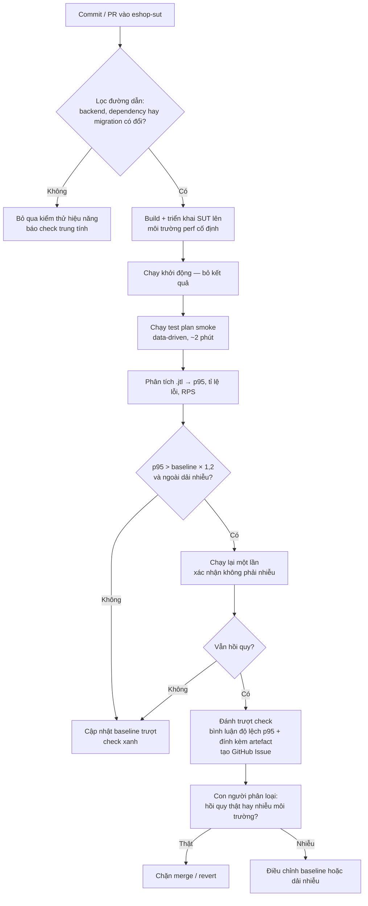

# HW05 — Kiểm thử Hiệu năng (Performance Testing, AI-First)

| Trường thông tin                          | Giá trị                                           |
| ----------------------------------------- | ------------------------------------------------- |
| Mã bài tập                                | HW05-AI                                           |
| MSSV                                      | 23127344                                          |
| Họ và tên                                 | _<điền vào>_                                      |
| Lớp / Nhóm                                | _<điền vào>_                                      |
| Ngày nộp                                  | _<YYYY-MM-DD>_                                    |
| SUT                                       | EShop — https://github.com/ttbhanh/eshop-sut      |
| Commit / tag của SUT đã kiểm thử          | _<git SHA>_                                       |
| Công cụ sử dụng                           | JMeter _<phiên bản>_ / k6 _<phiên bản>_           |
| Công cụ AI đã dùng                        | _<ví dụ: Claude Opus 5 (Claude Code), ChatGPT...>_ |
| Repo công khai (test plan + dữ liệu)      | _<GitHub URL>_                                    |
| Video demo (YouTube unlisted, ≥ 6 phút)   | _<URL>_                                           |
| Điểm tự đánh giá                          | _<000–100>_                                       |

> **Khai báo sử dụng AI.** Tôi có sử dụng công cụ AI cho các công việc sau: _<liệt kê ngắn gọn — thiết kế test plan, phân tích .jtl, đề xuất CPT, ...>_. Toàn bộ nhật ký tương tác được ghi trong `AI_Audit_Report.md` (Phụ lục A). Mọi kết quả do AI tạo ra bên dưới đều đã được tôi rà soát và chỉnh sửa; tôi chịu hoàn toàn trách nhiệm về các sản phẩm cuối cùng.

---

## Mục lục

1. [Phạm vi và Lựa chọn Endpoint](#1-phạm-vi-và-lựa-chọn-endpoint)
2. [Môi trường Kiểm thử và Phần cứng](#2-môi-trường-kiểm-thử-và-phần-cứng)
3. [Task 1 — Thiết kế và Thực thi Kiểm thử với sự hỗ trợ của AI](#3-task-1--thiết-kế-và-thực-thi-kiểm-thử-với-sự-hỗ-trợ-của-ai)
   - 3.1 [Quy trình thiết kế cùng AI (từng bước)](#31-quy-trình-thiết-kế-cùng-ai-từng-bước)
   - 3.2 [Luồng nghiệp vụ end-to-end](#32-luồng-nghiệp-vụ-end-to-end)
   - 3.3 [Dữ liệu đầu vào dạng data-driven (CSV)](#33-dữ-liệu-đầu-vào-dạng-data-driven-csv)
   - 3.4 [Tham số từng kịch bản (Load / Stress / Spike)](#34-tham-số-từng-kịch-bản-load--stress--spike)
   - 3.5 [Các loại report view đã dùng](#35-các-loại-report-view-đã-dùng)
   - 3.6 [Rà soát của con người — những điểm AI làm sai](#36-rà-soát-của-con-người--những-điểm-ai-làm-sai)
   - 3.7 [Thực thi và bằng chứng](#37-thực-thi-và-bằng-chứng)
   - 3.8 [Xử lý khóa tài khoản và quy trình reset](#38-xử-lý-khóa-tài-khoản-và-quy-trình-reset)
   - 3.9 [Kiểm thử endurance / soak và ngưỡng phần cứng](#39-kiểm-thử-endurance--soak-và-ngưỡng-phần-cứng)
   - 3.10 [Video demo](#310-video-demo)
   - 3.11 [Các lỗi đã báo cáo](#311-các-lỗi-đã-báo-cáo)
4. [Task 2 — Phân tích bằng AI và Truy tìm điểm hiểu sai](#4-task-2--phân-tích-bằng-ai-và-truy-tìm-điểm-hiểu-sai)
5. [Task 3 — Đề xuất Continuous Performance Testing (Disrupt)](#5-task-3--đề-xuất-continuous-performance-testing-disrupt)
6. [Agent Skill](#6-agent-skill)
7. [Phê bình AI (200–300 từ)](#7-phê-bình-ai-200300-từ)
8. [Nhật ký Git Commit](#8-nhật-ký-git-commit)
9. [Danh sách kiểm tra sản phẩm nộp](#9-danh-sách-kiểm-tra-sản-phẩm-nộp)
10. [Tự đánh giá](#10-tự-đánh-giá)
11. [Tài liệu tham khảo](#11-tài-liệu-tham-khảo)
12. [Phụ lục A — AI Audit Report](#phụ-lục-a--ai-audit-report)

---

## 1. Phạm vi và Lựa chọn Endpoint

Ba nhóm endpoint được bao phủ bởi **một** luồng nghiệp vụ end-to-end duy nhất, và cả ba test plan đều thực thi luồng này giống hệt nhau.

**Luồng được chọn: "Hành trình hồ sơ cá nhân + lịch sử đơn hàng."** Một khách hàng đã đăng nhập xem lại hồ sơ cá nhân và các đơn hàng cũ của mình, cập nhật thông tin giao hàng, sau đó tính thử mã giảm giá.

| Nhóm          | Endpoint của SUT                                 | Mục API spec | Mã FR        | Lý do lựa chọn                                                                                                                                                     |
| ------------- | ------------------------------------------------ | ------------ | ------------ | ------------------------------------------------------------------------------------------------------------------------------------------------------------------ |
| Auth-heavy    | `POST /api/login`                                | §1.2         | FR-02        | Cấp JWT mà mọi bước sau đều cần; đồng thời chịu ràng buộc khóa tài khoản sau 3 lần đăng nhập sai, nên đây là nhóm bắt buộc phải quản lý lockout.                   |
| Read-heavy    | `GET /api/users/me`, `GET /api/orders/my-orders` | §2.1, §4.4   | FR-04, FR-11 | Hai thao tác đọc dữ liệu riêng của từng người dùng và có yêu cầu xác thực — response khác nhau theo từng user nên không thể phục vụ từ cache dùng chung như danh sách sản phẩm công khai. |
| Transactional | `PUT /api/users/me`, `POST /api/apply-coupon`    | §2.2, §5.1   | FR-04, FR-09 | `PUT /api/users/me` là thao tác ghi thật xuống dòng dữ liệu người dùng; `apply-coupon` kích hoạt phần tính toán mã giảm giá cùng cơ chế đếm `max_uses_per_user`.  |

**Base URL:** `http://localhost:3000` (theo tài liệu API spec).

**Cam kết không trùng lặp.** Luồng của tôi là **hành trình hồ sơ cá nhân + lịch sử đơn hàng** (FR-04 / FR-11 / FR-09). Không thành viên nào khác kiểm thử FR-04 (quản lý hồ sơ cá nhân). Các thành viên trong nhóm kiểm thử:

| Thành viên | Luồng nghiệp vụ của họ                                                                              | Phần trùng với tôi          |
| ---------- | --------------------------------------------------------------------------------------------------- | --------------------------- |
| _<tên>_    | Hành trình mua sắm: login → tìm sản phẩm → chi tiết sản phẩm → giỏ hàng → checkout                 | Chỉ `POST /api/login`       |
| _<tên>_    | _<nhóm categories / forgot-password / coupon / cancel-order>_                                        | _<xem mục tồn đọng bên dưới>_ |
| _<tên>_    | Hành trình admin danh mục: login → danh sách categories → tạo category                              | Chỉ `POST /api/login`       |
| _<tên>_    | Hành trình admin: login → admin orders → admin users → import products → cập nhật trạng thái đơn   | Chỉ `POST /api/login`       |

`POST /api/login` được dùng chung bởi tất cả thành viên vì mọi hành trình auth-heavy đều cần token; tuy nhiên các _luồng nghiệp vụ_ vẫn khác biệt, và đó mới là điều đề bài yêu cầu. Các bước read-heavy và transactional của tôi không trùng với bất kỳ thành viên nào.

> **Các vấn đề cần chốt trước khi dựng test plan** — _<xóa khối này sau khi đã giải quyết>_
>
> 1. **Kiểm tra trùng lặp.** Danh sách endpoint của một bạn trong nhóm có `GET /api/orders/my-orders` và `POST /api/apply-coupon` (bước 3 và 5 của tôi). Nếu đó là luồng chính thức của bạn ấy, cần thay: bước 3 → `GET /api/orders/:id` (§4.5) và bước 5 → `PUT /api/orders/:id/cancel` (§4.6). Hãy xác nhận với nhóm và ghi lại kết quả tại đây.
> 2. **`apply-coupon` có thật sự là transactional không?** API spec §5.1 mô tả endpoint này trả về `discount_amount` / `final_amount` đã tính toán, nghĩa là có thể chỉ thuần tính toán mà không ghi xuống CSDL — nhưng §6.4 lại định nghĩa `max_uses_per_user`, hàm ý số lần dùng có được lưu ở đâu đó. Cần kiểm tra thủ công xem có bản ghi nào được lưu lại hay không. Nếu không, bước này thuộc nhóm read-heavy, và `PUT /api/orders/:id/cancel` sẽ trở thành bước transactional thứ hai.
> 3. **Cách reset lockout.** API spec không mô tả response khi bị khóa và cũng không có endpoint reset, nên cơ chế khóa 3 lần của FR-02 phải được reset trực tiếp trong cơ sở dữ liệu. Cần xác định file CSDL và các cột tương ứng trong bảng users; ghi lại quy trình vào §3.8.

---

## 2. Môi trường Kiểm thử và Phần cứng

### 2.1 Cấu hình phần cứng

| Hạng mục       | Giá trị                                        |
| -------------- | ---------------------------------------------- |
| Hostname       | _<phải trùng với các bài tập trước>_           |
| CPU            | _<model, số nhân/luồng, xung cơ bản/boost>_    |
| RAM            | _<dung lượng, loại, bus>_                      |
| Ổ cứng         | _<loại, model>_                                |
| GPU            | _<model>_                                      |
| Hệ điều hành   | _<tên + build>_                                |
| Java / Runtime | _<phiên bản JVM của JMeter, hoặc phiên bản k6>_ |
| Mạng           | localhost (loopback) — _<hoặc điền vào>_       |

**Bằng chứng:** `evidence/hardware/dxdiag.png` (ảnh chụp màn hình), `evidence/hardware/dxdiag.txt`.

### 2.2 Triển khai SUT

| Hạng mục                     | Giá trị                                    |
| ---------------------------- | ------------------------------------------ |
| Cách khởi chạy               | _<docker compose / npm start / ...>_       |
| URL:port của backend         | _<http://localhost:PORT>_                  |
| Cơ sở dữ liệu                | _<SQLite / ...>_ , file tại _<đường dẫn>_  |
| Dữ liệu seed                 | _<cách seed CSDL / số dòng>_               |
| Có reset CSDL giữa các lần chạy? | _<có/không — bằng cách nào>_           |

### 2.3 Máy sinh tải (load generator)

Chạy trên **cùng máy** với SUT / trên máy riêng — _<ghi rõ trường hợp nào>_. Lưu ý hệ quả: _<nếu cùng máy, load generator cạnh tranh CPU với SUT; điều này giới hạn RPS đạt được và phải nêu rõ khi diễn giải kết quả>_.

---

## 3. Task 1 — Thiết kế và Thực thi Kiểm thử với sự hỗ trợ của AI

### 3.1 Quy trình thiết kế cùng AI (từng bước)

Tôi dẫn dắt AI đi qua từng bước của kỹ thuật kiểm thử thay vì đưa ra một prompt chung chung duy nhất. Tóm tắt chuỗi tương tác (prompt và output đầy đủ nằm ở Phụ lục A):

| #   | Bước                        | Mục đích của prompt                                                                  | AI tạo ra gì       | Kết luận của tôi           |
| --- | --------------------------- | ------------------------------------------------------------------------------------ | ------------------ | -------------------------- |
| 1   | Khảo sát endpoint           | _<yêu cầu AI đọc repo SUT và liệt kê các route API cho 3 nhóm>_                      | _<...>_            | _<chấp nhận / đã sửa>_     |
| 2   | Thiết kế luồng nghiệp vụ    | _<yêu cầu hành trình người dùng E2E + các điểm correlation>_                          | _<...>_            | _<...>_                    |
| 3   | Tham số hóa                 | _<yêu cầu cấu trúc CSV + những trường nào cần thay đổi>_                              | _<...>_            | _<...>_                    |
| 4   | Định hình kịch bản          | _<yêu cầu thread / ramp-up / think-time cho từng kịch bản, kèm lý giải>_             | _<...>_            | _<...>_                    |
| 5   | Assertion                   | _<yêu cầu response assertion + correlation extractor>_                                | _<...>_            | _<...>_                    |
| 6   | Sinh file JMX               | _<yêu cầu xuất ra các file .jmx>_                                                     | _<...>_            | _<...>_                    |
| 7   | Xử lý lockout               | _<hỏi cơ chế khóa của FR-02 tương tác thế nào khi số thread lớn>_                    | _<...>_            | _<...>_                    |

### 3.2 Luồng nghiệp vụ end-to-end

Cả ba test plan đều chạy cùng một thân thread group:

```
1. POST /api/login                    → trích xuất $.token           [auth-heavy]
   body: {"email": "${email}", "password": "${password}"}   (users.csv)
   assert: HTTP 200 VÀ body chứa "token" không rỗng
   think time: <n> ms

2. GET  /api/users/me                                                [read-heavy]
   header: Authorization: Bearer ${authToken}
   assert: HTTP 200 VÀ $.email == ${email}   (chứng minh token đúng với user tương ứng)
   think time: <n> ms

3. GET  /api/orders/my-orders         → trích xuất $[0].id thành orderId   [read-heavy]
   header: Authorization: Bearer ${authToken}
   assert: HTTP 200 VÀ response là một mảng JSON
   think time: <n> ms

4. PUT  /api/users/me                                                [transactional]
   header: Authorization: Bearer ${authToken}
   body: {"name": "${name}", "shipping_address": "${address}", "phone": "${phone}"}
         (profiles.csv — mỗi dòng một giá trị khác nhau, để mỗi VU ghi một giá trị riêng)
   assert: HTTP 200
   think time: <n> ms

5. POST /api/apply-coupon                                            [transactional]
   header: Authorization: Bearer ${authToken}
   body: {"code": "${couponCode}", "total_amount": ${totalAmount}, "user_id": ${userId}}
         (coupons.csv)
   assert: HTTP 200 VÀ body chứa "final_amount"
```

**Lý giải độ bao phủ.** Bước 1 thuộc nhóm **auth-heavy**: đây là lời gọi duy nhất thực hiện xác thực thông tin đăng nhập, nó phải so khớp hash mật khẩu và ký JWT — hai thao tác khiến login trở thành tác vụ nặng CPU — đồng thời đây cũng là endpoint chịu ràng buộc khóa 3 lần của FR-02. Bước 2–3 thuộc nhóm **read-heavy**: cả hai đều là `GET` có xác thực và đọc dữ liệu riêng của từng người dùng; vì nội dung response khác nhau theo từng user nên chúng không thể được phục vụ từ cache dùng chung — khác với danh sách sản phẩm công khai — do đó chúng đo được khối lượng truy vấn CSDL thực sự phát sinh trên mỗi request khi có nhiều người dùng đồng thời. Bước 4–5 thuộc nhóm **transactional**: bước 4 là một lệnh `UPDATE` lên dòng dữ liệu người dùng của chính người gọi (được tham số hóa để không có hai virtual user nào ghi cùng một giá trị, tránh trường hợp ghi mà không thay đổi gì), còn bước 5 kích hoạt phần tính toán mã giảm giá cùng cơ chế đếm `max_uses_per_user`. Mọi request sau bước 1 đều phụ thuộc vào token trích xuất được từ bước đó, nên đây là một hành trình end-to-end thực sự chứ không phải năm lời gọi rời rạc.

> **Lưu ý chuyển tiếp từ §1.** Nếu `POST /api/apply-coupon` thực chất chỉ là phép tính toán thuần túy không ghi dữ liệu, thì bước 5 thuộc nhóm read-heavy chứ không phải transactional, và phải được thay bằng `PUT /api/orders/:id/cancel` (§4.6), sử dụng `orderId` đã trích xuất ở bước 3. Cần kiểm chứng trước khi chốt các test plan.

**Các điểm correlation.**

| Giá trị trích xuất | Từ bước | Extractor                                          | Dùng ở bước                                                       |
| ------------------ | ------- | -------------------------------------------------- | ----------------------------------------------------------------- |
| `authToken`        | 1       | JSON Extractor `$.token`                           | 2, 3, 4, 5 — header `Authorization: Bearer ${authToken}`          |
| `userId`           | 1       | JSON Extractor `$.user.id`                         | 5 (trường `user_id` trong body)                                   |
| `orderId`          | 3       | JSON Extractor `$[0].id`, mặc định `NOT_FOUND`     | Chỉ dùng nếu bước 5 đổi sang `PUT /api/orders/:id/cancel`         |

> Việc trích xuất `userId` từ response đăng nhập thay vì đọc từ CSV giúp request áp mã giảm giá luôn nhất quán với token thực sự được cấp. Nếu lấy `user_id` từ CSV, giá trị này có thể lệch với JWT khi dữ liệu seed thay đổi, khiến bước 5 thất bại vì lý do không liên quan đến hiệu năng.
>
> Nếu có dùng `orderId`, hãy bọc bước 5 trong một **If Controller** với điều kiện `${orderId} != NOT_FOUND` — một tài khoản vừa được seed sẽ chưa có đơn hàng nào, và việc gọi `PUT /api/orders/NOT_FOUND/cancel` sẽ làm tăng error rate vì lỗi dữ liệu chứ không phải vì tín hiệu hiệu năng.

**Assertion cho từng bước.**

| Bước | Assertion                                                | Lý do                                                                                                                                                                                              |
| ---- | -------------------------------------------------------- | -------------------------------------------------------------------------------------------------------------------------------------------------------------------------------------------------- |
| 1    | HTTP 200 **và** `$.token` tồn tại, không rỗng            | Chỉ kiểm tra status code sẽ vẫn "pass" khi server trả về khung lỗi kèm mã 200; ngoài ra token rỗng sẽ âm thầm phá vỡ bước 2–5, khiến chúng thất bại vì lý do sai lệch                              |
| 2    | HTTP 200 **và** `$.email` khớp với `${email}` trong CSV  | Chứng minh token ánh xạ đúng người dùng. Khi tải cao, đây chính là assertion có thể phát hiện tình trạng lẫn session/token — một lỗi tính đúng đắn mà việc kiểm tra status code đơn thuần không thấy |
| 3    | HTTP 200 **và** body phân tích được thành mảng JSON      | Bắt được response "thành công nhưng sai định dạng" khi có tải. Cố ý **không** yêu cầu mảng khác rỗng: một tài khoản vừa seed hoàn toàn có thể chưa có đơn hàng nào                                  |
| 4    | HTTP 200 **và** `$.name` khớp giá trị `${name}` vừa ghi  | Việc server trả lại đúng giá trị vừa ghi là bằng chứng rẻ tiền nhất cho thấy lệnh `UPDATE` thực sự đã commit, chứ không phải trả 200 từ một lỗi bị nuốt                                             |
| 5    | HTTP 200 **và** có trường `$.final_amount`               | Theo API spec §5.1, response bắt buộc chứa `discount_amount` / `final_amount`; nếu trả 200 mà thiếu chúng thì phép tính đã không chạy                                                               |
| tất cả | Duration assertion — _<ghi rõ có dùng hay không>_       | Nếu bật, nó sẽ tính các response chậm-nhưng-đúng thành lỗi, làm lẫn lộn độ trễ với thất bại. Khuyến nghị: **không bật**, thay vào đó phân tích độ trễ qua các percentile trong file `.jtl`          |

### 3.3 Dữ liệu đầu vào dạng data-driven (CSV)

| File                | Cột dữ liệu                   | Số dòng | Dùng ở bước | Chế độ chia sẻ / recycle                        |
| ------------------- | ----------------------------- | ------- | ----------- | ----------------------------------------------- |
| `data/users.csv`    | `email,password`              | 120     | Bước 1      | All threads, `recycle=false`, `stopThread=true` |
| `data/profiles.csv` | `name,shipping_address,phone` | 60      | Bước 4      | All threads, `recycle=true`                     |
| `data/coupons.csv`  | `code,total_amount`           | 5       | Bước 5      | All threads, `recycle=true`                     |

**Cách chọn số dòng `users.csv` = 120.** Con số này phải lớn hơn hoặc bằng số VU đỉnh của **kịch bản nặng nhất**, chứ không phải của riêng kịch bản Load. Kịch bản Stress cộng dồn tới 100 VU (§3.4), nên 120 dòng đủ cho cả ba kịch bản và còn dư biên. Đây là lỗi tôi đã mắc phải trong lần dựng đầu: file ban đầu chỉ có 60 dòng, vừa đủ cho Load 50 VU nhưng **thiếu cho Stress** — với `recycle=false` và `stopThread=true`, bậc 4 và bậc 5 sẽ tự tắt thread ngay khi khởi động, bài test vẫn "chạy xong" nhưng thực tế chỉ đo được khoảng 60 VU thay vì 100. Ghi nhận ở AI Audit Report artifact \#6.

Dòng dữ liệu mẫu (thay bằng giá trị đã seed thực tế):

```
# users.csv — 120 dòng, perf001 … perf120
email,password
perf001@test.com,Password123!
perf002@test.com,Password123!

# profiles.csv — 60 dòng, giá trị khác nhau để mỗi lần ghi đều làm thay đổi dữ liệu
name,shipping_address,phone
Perf User 01,01 Le Loi Q1 TP.HCM,0912345001
Perf User 02,02 Le Loi Q1 TP.HCM,0912345002

# coupons.csv — 5 dòng
code,total_amount
SAVE10,500000
TET2025,300000
```

**Vì sao mỗi virtual user dùng một tài khoản riêng.** File `users.csv` dùng `recycle=false` kèm `stopThread=true` và có số dòng lớn hơn hoặc bằng số thread đỉnh, nên **không có hai virtual user nào dùng chung một tài khoản đăng nhập**. Đây là lựa chọn có chủ đích: FR-02 khóa tài khoản sau 3 lần đăng nhập sai, và một tài khoản dùng chung dưới tải Stress hoặc Spike sẽ có nguy cơ gây khóa dây chuyền, biến error rate thành phép đo cơ chế FR-02 thay vì đo hiệu năng. Ngược lại, nếu số dòng ít hơn số VU đỉnh thì các thread sẽ âm thầm dừng giữa chừng và làm giảm tải thực tế đưa vào hệ thống — vì vậy phải đối chiếu số dòng với con số VU đỉnh ở §3.4 trước mỗi lần chạy.

**Vì sao `profiles.csv` và `coupons.csv` dùng `recycle=true`.** Hai file này không mang thông tin định danh nên việc dùng lại giữa các virtual user là vô hại; bật recycle giúp giữ file nhỏ gọn. Tuy vậy các giá trị trong `profiles.csv` vẫn phải khác nhau **giữa các dòng**, để bước 4 thực hiện một lệnh `UPDATE` thật sự thay vì ghi đè lại đúng dữ liệu cũ.

### 3.4 Tham số từng kịch bản (Load / Stress / Spike)

|                        | Load                                  | Stress                                          | Spike                                             |
| ---------------------- | ------------------------------------- | ----------------------------------------------- | ------------------------------------------------- |
| File test plan         | `23127344_Load_20260812.jmx`          | `23127344_Stress_20260812.jmx`                  | `23127344_Spike_20260812.jmx`                     |
| Số virtual user (đỉnh) | 50                                    | 100 (5 bậc × 20 VU, cộng dồn)                   | 100 (nền 10 VU → spike 100 VU)                    |
| Ramp-up                | 60 giây (~1 VU/giây)                  | Theo bậc: +20 VU mỗi 120 giây, mỗi bậc ramp 30s | **5 giây cho 100 VU** (gần như tức thời)          |
| Thời gian giữ tải      | 600 giây                              | 600 giây (bậc cuối chỉ giữ 120 giây)            | Spike giữ 60 giây; tổng bài test 420 giây         |
| Ramp-down              | Không (kết thúc theo scheduler)       | Không (mọi bậc cùng dừng ở giây 600)            | Spike tắt đột ngột ở giây 180, nền tiếp tục 240s  |
| Số vòng lặp mỗi VU     | Lặp vô hạn đến hết thời lượng         | Lặp vô hạn đến hết thời lượng                   | Lặp vô hạn đến hết thời lượng từng giai đoạn      |
| Think time             | Uniform 1,5–4 giây tùy bước           | Giống Load (dùng chung thân workflow)           | Giống Load (dùng chung thân workflow)             |
| Listener               | **Summary Report**                    | **Aggregate Report**                            | **View Results Tree** (chỉ ghi lỗi)               |
| Mục tiêu               | Quan sát hành vi ở trạng thái ổn định | Tìm điểm gãy (knee) của hệ thống                | Chịu được và **phục hồi** sau cú tăng tải đột ngột |
| Tiêu chí đạt           | _<p95 < X ms, error rate < Y%>_       | _<xác định điểm knee; không crash>_             | _<p95 giai đoạn 3 trở về ≈ p95 giai đoạn 1 trong vòng Z giây; không còn 5xx sau spike>_ |

**Hồ sơ tải của kịch bản Stress (5 bậc).** JMeter bản chuẩn không có sẵn cơ chế tăng tải theo bậc, nên tôi dùng 5 Thread Group riêng với `delay` lệch nhau — cách này **không cần cài plugin**, giúp file mở được trên mọi bản JMeter 5.6.3 gốc. Các bậc cộng dồn lên nhau và cùng kết thúc tại giây 600:

| Bậc | Bắt đầu (giây) | Thời lượng | VU thêm vào | VU cộng dồn |
| --- | -------------- | ---------- | ----------- | ----------- |
| 1   | 0              | 600 giây   | +20         | 20          |
| 2   | 120            | 480 giây   | +20         | 40          |
| 3   | 240            | 360 giây   | +20         | 60          |
| 4   | 360            | 240 giây   | +20         | 80          |
| 5   | 480            | 120 giây   | +20         | 100         |

Mỗi bậc giữ tải ít nhất 120 giây trước khi bậc kế tiếp vào, đủ để hệ thống ổn định và để đọc được p95 của riêng mức tải đó — nếu tăng bậc quá nhanh thì không phân biệt được độ trễ tăng do tải hay do hệ thống chưa kịp ổn định. Tất cả tham số đều override được qua dòng lệnh: `-Jstepvusers=30 -Jsteprampup=20`.

**Hồ sơ tải của kịch bản Spike (3 giai đoạn).** Tổng thời lượng 420 giây:

| Giai đoạn | Khoảng thời gian | VU  | Ramp-up | Vai trò                                                      |
| --------- | ---------------- | --- | ------- | ------------------------------------------------------------ |
| 1 — Nền trước | giây 0–120   | 10  | 20 giây | Lấy p95 tham chiếu ở mức tải bình thường                     |
| 2 — Spike     | giây 120–180 | 100 | **5 giây** | Cú tăng tải đột ngột: gấp 10 lần mức nền trong 5 giây     |
| 3 — Nền sau   | giây 180–420 | 10  | 20 giây | **Đo phục hồi** — dài 240 giây, gấp đôi giai đoạn 1        |

**Vì sao giai đoạn 3 là phần quan trọng nhất.** Mục tiêu của spike test không chỉ là "hệ thống có sập khi tải tăng đột ngột không", mà còn là "sau khi tải rút đi thì hệ thống có trở về bình thường không, và mất bao lâu". Nếu test plan kết thúc ngay sau spike thì nó không thể trả lời câu hỏi thứ hai. Giai đoạn 3 được thiết kế dài gấp đôi giai đoạn 1 để đủ dữ liệu quan sát: **so sánh p95 của giai đoạn 3 với p95 của giai đoạn 1 chính là thước đo phục hồi**. Nếu p95 giai đoạn 3 vẫn cao hơn hẳn giai đoạn 1 cho tới cuối bài test, đó là dấu hiệu hệ thống chưa hồi phục — ví dụ connection pool chưa được giải phóng, hàng đợi còn tồn đọng, hoặc bộ nhớ chưa được thu hồi.

Tham số override: `-Jbasevusers=20 -Jspikevusers=150`.

**Lý giải tham số (đề xuất của AI → quyết định của tôi).**

- **Think time.** AI đề xuất _<giá trị>_; tôi chọn _<giá trị>_ vì _<người dùng thật đọc một trang sản phẩm mất vài giây; think-time bằng 0 sẽ biến load test thành stress test>_.
- **Ramp-up.** AI đề xuất _<giá trị>_; tôi chọn _<giá trị>_ vì _<ramp-up quá ngắn chỉ đo được chi phí thiết lập kết nối chứ không đo được trạng thái ổn định>_.
- **Số VU.** AI đề xuất _<giá trị>_; tôi chọn _<giá trị>_ vì _<load generator và SUT dùng chung phần cứng này; xem §2.3>_.
- **Hình dạng spike.** _<...>_

### 3.5 Các loại report view đã dùng

Ba loại listener / output **khác nhau**, không lặp lại:

| Kịch bản | Report view                          | Phần tử JMeter             | Sản phẩm             | Vì sao view này phù hợp với kịch bản đó                                                                                                   |
| -------- | ------------------------------------ | -------------------------- | -------------------- | ------------------------------------------------------------------------------------------------------------------------------------------ |
| Load     | **Summary Report**                   | `SummaryReport`            | `reports/load/...`   | Tải giữ đều nên con số tổng hợp là đủ; view này cho throughput và error rate gọn gàng trên toàn bộ giai đoạn ổn định                       |
| Stress   | **Aggregate Report**                 | `StatVisualizer`           | `reports/stress/...` | Khi tải tăng dần thì phần đuôi phân phối mới là thứ đáng xem; view này có sẵn cột p90 / p95 / p99 để xác định điểm knee — Summary Report không có |
| Spike    | **View Results Tree** (chỉ ghi lỗi)  | `ViewResultsFullVisualizer` | `reports/spike/...`  | Cần xem **chi tiết từng request thất bại** trong lúc spike (mã lỗi, nội dung response) — điều mà hai view tổng hợp kia không thể cho thấy   |

Ba loại listener hoàn toàn khác nhau, không lặp lại, đúng yêu cầu của đề bài.

> **Lưu ý về View Results Tree trong kịch bản Spike.** Listener này được đặt `error_logging=true`, tức **chỉ ghi lại các sample thất bại**. Lý do: View Results Tree lưu toàn bộ nội dung request/response vào bộ nhớ, nếu ghi tất cả sample ở mức 100 VU thì JMeter sẽ ngốn RAM rất nhanh và chính load generator trở thành nút thắt — kết quả đo được sẽ phản ánh giới hạn của JMeter chứ không phải của SUT. Ghi riêng lỗi vừa đủ để phân tích vừa an toàn về bộ nhớ.

Cả ba lần chạy đều đồng thời sinh ra file `.jtl` thô và thư mục HTML dashboard của JMeter (đây là bằng chứng, không tính vào "ba report view").

### 3.6 Rà soát của con người — những điểm AI làm sai

| #   | AI đã tạo ra gì                                                                | Vì sao sai                                                                                                                                     | Tôi đã sửa thế nào                                    | Nguyên nhân gốc                                                    |
| --- | ------------------------------------------------------------------------------ | ---------------------------------------------------------------------------------------------------------------------------------------------- | ----------------------------------------------------- | ------------------------------------------------------------------ |
| 1   | Đề xuất endpoint `GET /api/profile` và `PUT /api/profile`                      | Hai route này **không tồn tại** trong SUT; endpoint thật là `GET /api/users/me` và `PUT /api/users/me` (API spec §2.1, §2.2)                  | Cung cấp `api_spec.md` và yêu cầu mọi endpoint phải kèm số mục tham chiếu | AI suy đoán tên route bằng cách khớp mẫu từ tiêu đề FR-04 thay vì đọc test basis; tôi cũng chưa cung cấp tài liệu API ngay từ đầu |
| 2   | `users.csv` chỉ có 60 dòng, trong khi kịch bản Stress cộng dồn tới 100 VU      | Với `recycle=false` + `stopThread=true`, bậc 4 và 5 sẽ tự tắt thread ngay khi khởi động vì hết dữ liệu. Bài test vẫn "chạy xong" và xuất `.jtl` bình thường nhưng chỉ đo được ~60 VU thay vì 100 — **sai số âm thầm, không có thông báo lỗi nào** | Mở rộng `users.csv` lên 120 dòng, `profiles.csv` lên 60 dòng; ghi nguyên tắc "tính theo kịch bản nặng nhất" vào §3.3 | AI sinh CSV ở thời điểm chỉ mới biết kịch bản Load (50 VU), sau đó dựng Stress (100 VU) mà không tự đối chiếu ngược lại số dòng đã tạo — thiếu kiểm tra tính nhất quán xuyên suốt các artifact |
| 3   | _<ví dụ: think time = 0 / cố định 100 ms>_                                     | _<không giống người dùng thật; làm RPS tăng ảo>_                                                                                               | _<Gaussian 2000 ± 500 ms>_                            | _<prompt chưa mô tả mô hình hành vi người dùng>_                   |
| 4   | _<ví dụ: 500 thread ramp trong 1 giây cho test plan "Load">_                   | _<đó là spike chứ không phải load; ngoài ra vượt quá năng lực phần cứng của tôi>_                                                              | _<...>_                                               | _<mô hình không biết gì về phần cứng của tôi>_                     |
| 5   | _<ví dụ: chỉ assert HTTP 200>_                                                 | _<SUT trả về 200 kèm khung lỗi trong trường hợp <...>>_                                                                                        | _<bổ sung assertion trên body>_                       | _<hành vi đặc thù của endpoint, không thể suy ra từ prompt>_       |
| 6   | _<ví dụ: không xử lý lockout — dùng chung một tài khoản cho mọi thread>_       | _<FR-02 khóa sau 3 lần đăng nhập sai; khi Stress thì mọi VU đều bị khóa và error rate sẽ đo cơ chế khóa chứ không đo hiệu năng>_               | _<CSV gồm N tài khoản riêng biệt + bước reset rõ ràng>_ | _<AI chưa đọc FR-02 / tôi chưa cung cấp đặc tả cho nó>_           |
| 7   | _<ví dụ: sai schema JMX / phần tử listener mà JMeter <phiên bản> không nhận>_  | _<file không mở được>_                                                                                                                         | _<...>_                                               | _<kiến thức về JMX của mô hình đã lệch phiên bản>_                 |

**Suy ngẫm.** _<2–4 câu: AI mắc loại lỗi nào một cách có hệ thống — cấu trúc nghe hợp lý nhưng chưa được kiểm chứng, không có quyền truy cập môi trường của bạn, không nắm ngữ nghĩa đặc thù của SUT.>_

### 3.7 Thực thi và bằng chứng

| Kịch bản | Bắt đầu (giờ địa phương) | Thời lượng | Số sample | Tỉ lệ lỗi % | TB (ms) | p90     | p95     | p99     | Throughput (req/s) | File log thô                          | Báo cáo HTML                |
| -------- | ------------------------ | ---------- | --------- | ----------- | ------- | ------- | ------- | ------- | ------------------ | ------------------------------------- | --------------------------- |
| Load     | _<...>_                  | _<...>_    | _<...>_   | _<...>_     | _<...>_ | _<...>_ | _<...>_ | _<...>_ | _<...>_            | `results/23127344_Load_<date>.jtl`    | `reports/load/index.html`   |
| Stress   |                          |            |           |             |         |         |         |         |                    | `results/23127344_Stress_<date>.jtl`  | `reports/stress/index.html` |
| Spike    |                          |            |           |             |         |         |         |         |                    | `results/23127344_Spike_<date>.jtl`   | `reports/spike/index.html`  |

> Toàn bộ số liệu ở trên được đọc từ file `.jtl` thô, không phải chép lại từ output của AI. _<Ghi rõ lệnh/công cụ đã dùng để tính, ví dụ một script nhỏ hoặc dashboard của JMeter.>_

**Nhận xét theo từng kịch bản.**

- **Load —** _<đường cong thời gian phản hồi diễn biến ra sao, có giữ phẳng không, lỗi xuất hiện ở đâu>_
  - Bằng chứng: `evidence/load/tool+monitor.png` (JMeter và Task Manager trong cùng một khung hình)
- **Stress —** _<điểm knee ở đâu: tại N VU thì p95 vượt X ms và tỉ lệ lỗi đạt Y%>_
  - Bằng chứng: `evidence/stress/tool+monitor.png`
- **Spike —** _<đỉnh bùng lỗi, thời gian phục hồi về mức p95 nền>_
  - Bằng chứng: `evidence/spike/tool+monitor.png`

**Mức tiêu thụ tài nguyên của tiến trình backend trong từng lần chạy.**

| Kịch bản | CPU backend % (đỉnh / TB) | RAM backend (đỉnh) | CPU toàn hệ thống % | Ghi chú về đĩa / CSDL |
| -------- | ------------------------- | ------------------ | ------------------- | --------------------- |
| Load     | _<...>_                   | _<...>_            | _<...>_             | _<...>_               |
| Stress   |                           |                    |                     |                       |
| Spike    |                           |                    |                     |                       |

### 3.8 Xử lý khóa tài khoản và quy trình reset

FR-02 khóa tài khoản sau _<3>_ lần đăng nhập thất bại.

- **Có bị kích hoạt không?** _<có/không, ở lần chạy nào, biểu hiện trong log ra sao — ví dụ HTTP <mã> kèm thông báo "<...>">_
- **Cách tôi phòng tránh ngay từ thiết kế:** _<N tài khoản riêng biệt đã seed trong users.csv, mỗi thread một tài khoản; chỉ dùng mật khẩu đúng>_
- **Các bước reset (có ghi chép, tái lập được):**
  1. _<dừng backend / chạy SQL: `UPDATE users SET failed_attempts = 0, locked_until = NULL;`>_
  2. _<...>_
  3. _<kiểm chứng bằng một lần đăng nhập thủ công>_
- Bằng chứng: `evidence/lockout/*.png`

### 3.9 Kiểm thử endurance / soak và ngưỡng phần cứng

| Hạng mục          | Giá trị                             |
| ----------------- | ----------------------------------- |
| File test plan    | `23127344_Endurance_<YYYYMMDD>.jmx` |
| Số VU duy trì     | _<n>_                               |
| Thời lượng        | _<10–15 phút>_                      |
| Tổng số sample    | _<n>_                               |

**Ngưỡng đo được trên phần cứng này:**

| Chỉ số                                                | Giá trị                                            | Cách đo                                       |
| ----------------------------------------------------- | -------------------------------------------------- | --------------------------------------------- |
| RPS ổn định tối đa (lỗi < _<1>_ %, p95 < _<x>_ ms)   | **_<n>_ req/s**                                    | _<duy trì suốt toàn bộ cửa sổ soak>_          |
| p95 tại mức RPS đó                                    | _<n>_ ms                                           | file `.jtl` thô                               |
| Trần bộ nhớ của backend                               | _<n>_ MB (từ _<n>_ MB lúc bắt đầu)                 | Task Manager lấy mẫu mỗi _<n>_ giây           |
| CPU backend tại mức RPS đó                            | _<n>_ %                                            | _<...>_                                       |
| Kiểu hỏng đầu tiên khi vượt ngưỡng                    | _<connection refused / timeout / 5xx / khóa CSDL>_ | _<...>_                                       |

**Xu hướng bộ nhớ / kiểm tra rò rỉ.** _<RSS có tăng đơn điệu suốt quá trình soak hay đi ngang? Nêu giá trị đầu/cuối và kết luận của bạn.>_

Bằng chứng: `evidence/endurance/*.png`, `results/23127344_Endurance_<date>.jtl`.

### 3.10 Video demo

| Hạng mục                                        | Giá trị                                |
| ----------------------------------------------- | -------------------------------------- |
| URL (unlisted)                                  | _<...>_                                |
| Tổng thời lượng                                 | _<≥ 6 phút>_                           |
| Số clip                                         | _<1 clip cho mỗi kịch bản / quay liền>_ |
| Thuyết minh                                     | Tiếng Việt, giọng của chính tôi        |
| Có hiện công cụ + resource monitor cùng khung hình | Có                                   |

Dòng thời gian nội dung: _<00:00 giới thiệu · 00:xx chạy Load · 0x:xx Stress · ...>_

### 3.11 Các lỗi đã báo cáo

| #   | Tiêu đề | Loại                                              | Mức độ  | Quan sát ở đâu       | GitHub Issue | Ảnh chụp                |
| --- | ------- | ------------------------------------------------- | ------- | -------------------- | ------------ | ----------------------- |
| 1   | _<...>_ | _<lỗi chức năng / response lỗi / crash>_          | _<...>_ | _<Stress @ N VU>_    | _<URL>_      | `evidence/issues/1.png` |
| 2   | _<...>_ | _<vấn đề hiệu năng>_                              | _<...>_ | _<...>_              | _<URL>_      | _<...>_                 |

_<Nếu không có: ghi rõ "Không tái hiện được lỗi chức năng thực sự nào; các vấn đề hiệu năng quan sát được đã liệt kê ở §4 nhưng chưa tạo issue vì ...".>_

---

## 4. Task 2 — Phân tích bằng AI và Truy tìm điểm hiểu sai

### 4.1 Tôi đã yêu cầu AI phân tích những gì

| Hạng mục                | Giá trị                                                                     |
| ----------------------- | --------------------------------------------------------------------------- |
| Công cụ AI + phiên bản  | _<...>_                                                                     |
| Ngày / giờ              | _<...>_                                                                     |
| Dữ liệu đầu vào đã đưa  | _<file .jtl thô / bản trích rút gọn — ghi rõ chính xác là gì và lớn cỡ nào>_ |
| Prompt                  | _<nguyên văn; toàn văn ở Phụ lục A>_                                        |

### 4.2 Phần phân tích của AI (nguyên trạng)

> _<dán nguyên văn phần tóm tắt + các ngưỡng AI đề xuất, hoặc bản rút gọn trung thực kèm chỉ dẫn tới Phụ lục A>_

**Các ngưỡng AI đề xuất:**

| Chỉ số      | Ngưỡng AI đề xuất | Lý do AI đưa ra |
| ----------- | ----------------- | --------------- |
| Độ trễ p95  | _<...>_           | _<...>_         |
| Tỉ lệ lỗi   | _<...>_           | _<...>_         |
| Throughput  | _<...>_           | _<...>_         |

### 4.3 Truy tìm điểm hiểu sai (rà soát của con người)

Mỗi dòng đều dẫn ra **giá trị đúng đọc từ file `.jtl` thô**.

| #   | AI khẳng định điều gì                                          | Giá trị đúng từ `.jtl` thô                                                                       | Kiểm chứng ở đâu / bằng cách nào                | Vì sao AI sai                                                          |
| --- | -------------------------------------------------------------- | ------------------------------------------------------------------------------------------------ | ----------------------------------------------- | ---------------------------------------------------------------------- |
| 1   | _<"thời gian phản hồi trung bình 120 ms, hiệu năng tốt">_      | _<trung bình = 120 ms nhưng p99 = 4.300 ms; 3,1% số sample vượt 2 giây>_                          | _<`results/...jtl`, tính bằng `<lệnh>`>_        | _<coi giá trị trung bình là đại diện cho một phân phối lệch phải>_     |
| 2   | _<"không có lỗi nào">_                                         | _<`success=false` ở N sample; AI chỉ đếm HTTP != 200 và bỏ sót các assertion thất bại>_          | _<...>_                                         | _<đọc sai schema của .jtl: nhầm `success` với `responseCode`>_         |
| 3   | _<"throughput duy trì 250 req/s">_                             | _<250 req/s chỉ là đỉnh của một cửa sổ 1 giây; giá trị duy trì trung bình là N req/s>_           | _<...>_                                         | _<lẫn lộn giữa đỉnh tức thời và trạng thái ổn định>_                   |
| 4   | _<"độ trễ tăng vì CSDL chậm">_                                 | _<so sánh cột `Latency` và `elapsed` cho thấy N ms là thời gian kết nối/xếp hàng, không phải xử lý>_ | _<...>_                                      | _<bỏ qua sự khác biệt giữa Latency / Connect / elapsed>_               |
| 5   | _<nêu ra một giá trị hoàn toàn không có trong log>_            | _<không tồn tại trường đó>_                                                                      | _<...>_                                         | _<ảo giác — điền một con số nghe hợp lý vào chỗ thiếu dữ liệu>_       |

**Quy luật chung.** _<1–3 câu: kiểu sai lệch nào lặp lại — trung bình so với percentile, success so với status code, đỉnh so với duy trì, độ chính xác bịa đặt.>_

### 4.4 Ngưỡng do tôi hiệu chỉnh lại

| Chỉ số                          | Ngưỡng của tôi | Căn cứ                                |
| ------------------------------- | -------------- | ------------------------------------- |
| Độ trễ p95 (read-heavy)         | _<...>_        | _<mức nền đo được + biên dự phòng>_   |
| Độ trễ p95 (transactional)      | _<...>_        | _<...>_                               |
| Tỉ lệ lỗi                       | _<...>_        | _<...>_                               |
| RPS duy trì tối đa              | _<lấy từ §3.9>_ | lần chạy endurance                    |

### 4.5 Đánh giá các khuyến nghị tối ưu của AI

| #   | Khuyến nghị của AI                                     | Kết luận                          | Lập luận (dựa trên bằng chứng)                                                                                       | Nếu khả thi: hiệu quả kỳ vọng / cách kiểm chứng |
| --- | ------------------------------------------------------ | --------------------------------- | -------------------------------------------------------------------------------------------------------------------- | ----------------------------------------------- |
| 1   | _<"thêm index cho products(name) để phục vụ tìm kiếm">_ | **Khả thi**                       | _<endpoint tìm kiếm đang quét LIKE; bảng có N dòng; index áp dụng được>_                                             | _<chạy lại test plan read-heavy, so sánh p95>_  |
| 2   | _<"bật chế độ WAL cho SQLite">_                        | **Khả thi**                       | _<các thao tác ghi bị tuần tự hóa trên CSDL lúc checkout; WAL cho phép đọc song song>_                               | _<...>_                                         |
| 3   | _<"tăng connection pool của CSDL lên 200">_            | **Ảo giác / không áp dụng được**  | _<SUT dùng <SQLite/...> vốn không có pool như vậy; hoặc khóa cấu hình mà AI nêu tên không tồn tại trong mã nguồn này>_ | —                                               |
| 4   | _<"thêm lớp cache Redis">_                             | **Ngoài phạm vi / thiếu căn cứ**  | _<không có bằng chứng nút thắt nằm ở các lượt đọc lặp lại; đồng thời thêm hạ tầng mà SUT không có>_                  | —                                               |
| 5   | _<...>_                                                | _<...>_                           | _<...>_                                                                                                              | _<...>_                                         |

_<Tùy chọn: nếu bạn thực sự đã áp dụng một tối ưu và chạy lại, hãy đưa bảng so sánh trước/sau vào đây — đó là bằng chứng rất mạnh.>_

---

## 5. Task 3 — Đề xuất Continuous Performance Testing (Disrupt)

### 5.1 Mục tiêu

Tự động phát hiện hồi quy p95 trên SUT theo từng commit, mà không phải chạy toàn bộ bộ kiểm thử hiệu năng cho mọi lần push.

### 5.2 Mô hình đề xuất

| Lớp                            | Quyết định                                                                                              |
| ------------------------------ | ------------------------------------------------------------------------------------------------------- |
| Điều kiện kích hoạt            | _<push vào main / mở PR / chạy hằng đêm>_                                                               |
| Cổng lọc ("có nên chạy không?") | _<lọc theo đường dẫn: chỉ chạy nếu backend/\*\*, package-lock, hoặc migration thay đổi; kèm nhãn ghi đè>_ |
| Phân tầng kiểm thử             | Smoke (2 phút, cho PR) → Load (10 phút, cho main) → Soak (hằng đêm)                                     |
| Môi trường                     | _<runner/container riêng với CPU-RAM cố định, để số liệu có thể so sánh được giữa các lần>_             |
| Đường cơ sở (baseline)         | _<trung vị trượt của N lần chạy xanh gần nhất trên main, tính theo từng endpoint>_                      |
| Quy tắc phát hiện hồi quy      | p95 > baseline × _<1,2>_ **và** nằm ngoài dải nhiễu _<±x%>_ trong _<2>_ lần chạy liên tiếp             |
| Hành động khi có hồi quy       | _<bình luận vào PR + đánh trượt check / tạo issue + gửi thông báo>_                                     |
| Lưu trữ                        | _<file .jtl + bảng số liệu/JSON commit vào nhánh kết quả>_                                             |

### 5.3 Lưu đồ



### 5.4 Đánh đổi (trade-offs)

| Mối quan tâm                    | Rủi ro                                                                                | Cách giảm thiểu                                                                                |
| ------------------------------- | ------------------------------------------------------------------------------------- | ---------------------------------------------------------------------------------------------- |
| **Chi phí**                     | _<mỗi commit tốn vài phút runner riêng>_                                              | _<cổng lọc theo đường dẫn; phân tầng bộ test; chỉ chạy soak đầy đủ vào ban đêm>_               |
| **Báo động giả**                | _<runner CI dùng chung có nhiễu từ tiến trình khác; p95 dao động ±x% giữa các lần>_   | _<runner cố định, bỏ kết quả khởi động, chạy lại để xác nhận, dùng dải thay vì một ngưỡng cứng>_ |
| **Bỏ sót hồi quy**              | _<smoke 2 phút không phát hiện được rò rỉ chậm và hồi quy ở phần đuôi>_               | _<soak hằng đêm bù đắp phần smoke không thấy>_                                                 |
| **Trôi baseline**               | _<suy giảm dần 5% mỗi commit sẽ không bao giờ chạm ngưỡng 20%>_                       | _<cảnh báo thêm theo xu hướng 30 ngày, không chỉ so commit với commit>_                        |
| **Trạng thái dữ liệu / lockout** | _<chạy lặp lại làm khóa tài khoản hoặc phình CSDL>_                                   | _<reset CSDL từ ảnh chụp seed trước mỗi lần chạy — xem §3.8>_                                  |
| **Bảo trì**                     | _<test plan lạc hậu khi API thay đổi>_                                                | _<đặt test plan trong repo cạnh mã nguồn; PR nào đổi API thì cập nhật luôn test plan>_          |

---

## 6. Agent Skill

| Hạng mục                  | Giá trị                                                                              |
| ------------------------- | ------------------------------------------------------------------------------------ |
| Tên skill                 | _<...>_                                                                              |
| Vị trí                    | _<đường dẫn trong repo, ví dụ `.claude/skills/<tên>/SKILL.md`>_                      |
| Skill tự động hóa việc gì | _<thiết kế → sinh test plan → chạy → phân tích .jtl → phân tích → soạn phần báo cáo>_ |
| Có thể tái dùng cho       | _<bất kỳ nhóm endpoint nào của SUT, bằng cách truyền vào ...>_                        |
| Video demo (YouTube)      | _<URL>_                                                                              |

**Cách skill được dùng end-to-end trong video demo:** _<3–6 gạch đầu dòng>_

---

## 7. Phê bình AI (200–300 từ)

> **Số từ: _<n>_** — bắt buộc trong khoảng 200–300.

_<Viết một đoạn văn tại đây. Trình bày cụ thể, có dẫn chiếu tới §3.6 và §4.3:_

- _Chỗ nào AI sai, thiên lệch hoặc thiếu sót (nêu đích danh lỗi cụ thể, không viết chung chung kiểu "AI có mắc lỗi"). Ví dụ đã có sẵn: AI đề xuất `GET /api/profile` và `PUT /api/profile` — hai route không tồn tại trong SUT._
- _Vì sao AI thất bại — không truy cập được phần cứng của bạn, chưa đọc FR-02, hiểu sai về thống kê với phân phối lệch, kiến thức JMX lệch phiên bản, hoặc do chính prompt của bạn chưa đủ cụ thể._
- _Bạn rút ra nguyên tắc gì khi cộng tác với AI trong công việc kiểm thử hiệu năng — ví dụ: AI mạnh ở việc sinh ra cấu trúc nhưng yếu ở việc neo cấu trúc đó vào hệ thống thật, nên mọi con số do AI đưa ra đều phải truy ngược được về một phép đo do chính bạn thực hiện.>_

---

## 8. Nhật ký Git Commit

Được xuất ra `git_commit_log.txt` bằng lệnh:

```bash
git log --pretty=format:"%h | %ad | %an | %s" --date=iso > git_commit_log.txt
```

**Đã hoàn thành** (giai đoạn thiết kế):

| Bước                                  | Commit    | Nội dung commit                                                    |
| ------------------------------------- | --------- | ------------------------------------------------------------------ |
| Đưa API spec vào làm test basis       | `e1960bd` | docs(hw5): add EShop API specification as the test basis           |
| Khung báo cáo chính                   | `5cb31df` | docs(hw5): add main report skeleton mapped to the HW05 spec        |
| Khung AI audit report                 | `081af2d` | docs(hw5): fill AI audit report template with artifact scaffold    |
| Thiết kế luồng (đã đối chiếu API spec) | `9900816` | design(hw5): select spec-verified profile + order-history workflow |
| Xuất nhật ký commit                   | `5aaf3ec` | chore(hw5): export git commit log and record SHAs in the report    |
| Cập nhật lại nhật ký commit           | `abe3dd6` | chore(hw5): refresh commit log to include the export commit itself |
| Dịch tài liệu sang tiếng Việt         | `b564656` | docs(hw5): dịch báo cáo chính và AI audit report sang tiếng Việt   |

**Còn phải làm** (giai đoạn thực thi — điền dần khi commit):

| Bước                              | Commit  | Nội dung commit |
| --------------------------------- | ------- | --------------- |
| Dữ liệu CSV                       | _<sha>_ | _<...>_         |
| Test plan Load                    | _<sha>_ | _<...>_         |
| Test plan Stress                  | _<sha>_ | _<...>_         |
| Test plan Spike                   | _<sha>_ | _<...>_         |
| Kết quả chạy (.jtl + report)      | _<sha>_ | _<...>_         |
| Lần chạy endurance                | _<sha>_ | _<...>_         |
| Phân tích bằng AI                 | _<sha>_ | _<...>_         |
| Đề xuất CPT                       | _<sha>_ | _<...>_         |
| Agent skill                       | _<sha>_ | _<...>_         |

Hãy xuất lại `git_commit_log.txt` sau mỗi commit mới để bản nộp luôn cập nhật.

---

## 9. Danh sách kiểm tra sản phẩm nộp

| Hạng mục bắt buộc                              | File / liên kết                          | Xong |
| ---------------------------------------------- | ---------------------------------------- | ---- |
| Báo cáo chính (Markdown + PDF)                 | `Main_Report.md` / `.pdf`                | ☐    |
| Liên kết repo GitHub công khai                 | _<URL>_                                  | ☐    |
| Test plan Load                                 | `plans/23127344_Load_20260812.jmx`       | ☑ (chưa chạy) |
| Test plan Stress                               | `plans/23127344_Stress_20260812.jmx`     | ☑ (chưa chạy) |
| Test plan Spike                                | `plans/23127344_Spike_20260812.jmx`      | ☑ (chưa chạy) |
| 3 file log `.jtl` thô (đầy đủ)                 | `results/`                               | ☐    |
| 3 thư mục báo cáo HTML                         | `reports/`                               | ☐    |
| Ảnh chụp resource monitor                      | `evidence/*/tool+monitor.png`            | ☐    |
| Ảnh chụp + bảng cấu hình phần cứng             | `evidence/hardware/`, §2.1               | ☐    |
| Video demo YouTube unlisted (≥ 6 phút)         | _<URL>_                                  | ☐    |
| Phê bình AI (Md + PDF)                         | §7 / `AI_Critique.*`                     | ☐    |
| AI Audit Report (Md + PDF)                     | `AI_Audit_Report.*`                      | ☐    |
| Nhật ký git commit (file văn bản)              | `git_commit_log.txt`                     | ☐    |
| Báo cáo lỗi + ảnh chụp Issue                   | `evidence/issues/`                       | ☐    |
| `README.md` (bảng tự đánh giá + tóm tắt test)  | `README.md`                              | ☐    |
| File zip đặt tên đúng quy định                 | `23127344_HW05_AI_Performance_<NNN>.zip` | ☐    |

---

## 10. Tự đánh giá

| STT | Tiêu chí                                                                            | Điểm    | Điểm tự đánh giá | Lý giải  |
| --- | ----------------------------------------------------------------------------------- | ------- | ---------------- | -------- |
| 1   | Task 1 — Load testing                                                               | 20      | _<n>_            | _<...>_  |
| 2   | Task 1 — Stress testing                                                             | 20      | _<n>_            | _<...>_  |
| 3   | Task 1 — Spike testing                                                              | 20      | _<n>_            | _<...>_  |
| 4   | Task 2 — Phân tích bằng AI + truy tìm điểm hiểu sai (kèm giá trị đúng từ log thô)   | 10      | _<n>_            | _<...>_  |
| 5   | Task 3 — Đề xuất Continuous Performance Testing (G9.6)                              | 10      | _<n>_            | _<...>_  |
| 6   | Agent Skills                                                                        | 10      | _<n>_            | _<...>_  |
|     | **Tổng cộng**                                                                       | **100** | **_<n>_**        |          |

---

## 11. Tài liệu tham khảo

- ISTQB Foundation Level Syllabus (phiên bản mới nhất).
- Hardman, P. (2025). _A Post-AI Learning Taxonomy._
- Fuster Rabella, M. (2025). _OECD Education Working Paper No. 338._
- Anthropic (2025). _Building Reliable AI Test Agents_ — blog kỹ thuật.
- Tài liệu DeepEval & Promptfoo — các framework kiểm thử LLM.
- Apache JMeter User Manual — _<ghi rõ những trang bạn thực sự đã dùng>_.
- Repository của SUT EShop — https://github.com/ttbhanh/eshop-sut
- Tài liệu đặc tả API của EShop — `api_spec.md` (kèm trong repo).
- _<bất kỳ liên kết nào khác bạn thực sự đã tham khảo>_

---

## Phụ lục A — AI Audit Report

Nhật ký đầy đủ nằm trong `AI_Audit_Report.md`. Phần khai báo và cấu trúc cho từng lượt tương tác:

> **Tôi có sử dụng công cụ AI cho các công việc sau:** _<liệt kê>_

| #   | Công cụ AI | Ngày & giờ           | Prompt                | Output của AI                                                      | Hành động của tôi                       |
| --- | ---------- | -------------------- | --------------------- | ------------------------------------------------------------------ | --------------------------------------- |
| 1   | _<...>_    | _<YYYY-MM-DD HH:MM>_ | _<prompt nguyên văn>_ | _<nguyên văn hoặc tóm tắt trung thực + chỉ dẫn tới file log gốc>_  | _<chấp nhận / đã sửa — xem §3.6 mục n>_ |
| 2   |            |                      |                       |                                                                    |                                         |

---

## Phụ lục B — Chỉ mục bằng chứng

```
hw5/
├── Main_Report.md / .pdf
├── README.md
├── AI_Audit_Report.md / .pdf
├── AI_Critique.md / .pdf
├── git_commit_log.txt
├── plans/
│   ├── 23127344_Load_<YYYYMMDD>.jmx
│   ├── 23127344_Stress_<YYYYMMDD>.jmx
│   ├── 23127344_Spike_<YYYYMMDD>.jmx
│   └── 23127344_Endurance_<YYYYMMDD>.jmx
├── data/
│   ├── users.csv
│   ├── profiles.csv
│   └── coupons.csv
├── results/            # file .jtl thô, đầy đủ
├── reports/            # thư mục HTML dashboard
└── evidence/
    ├── hardware/
    ├── load/  stress/  spike/  endurance/
    ├── lockout/
    └── issues/
```
