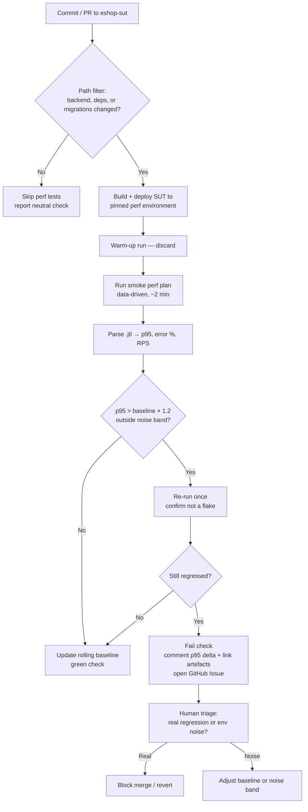

# HW05 — Performance Testing (AI-First)

| Field                                  | Value                                             |
| -------------------------------------- | ------------------------------------------------- |
| Exercise ID                            | HW05-AI                                           |
| Student ID                             | 23127344                                          |
| Full name                              | _<fill in>_                                       |
| Class / Group                          | _<fill in>_                                       |
| Date submitted                         | _<YYYY-MM-DD>_                                    |
| SUT                                    | EShop — https://github.com/ttbhanh/eshop-sut      |
| SUT commit / tag tested                | _<git SHA>_                                       |
| Tool used                              | JMeter _<version>_ / k6 _<version>_               |
| AI tools used                          | _<e.g. Claude Opus 5 (Claude Code), ChatGPT ...>_ |
| Public repo (test plans + data)        | _<GitHub URL>_                                    |
| Demo video (unlisted YouTube, ≥ 6 min) | _<URL>_                                           |
| Self-assessed grade                    | _<000–100>_                                       |

> **AI declaration.** I use AI tools for the following tasks: _<short list — test-plan design, .jtl analysis, CPT proposal, ...>_. The full interaction log is in `AI_Audit_Report.md` (Appendix A). Every AI output below was reviewed and corrected by me; I take full responsibility for the final artefacts.

---

## Table of Contents

1. [Scope and Endpoint Selection](#1-scope-and-endpoint-selection)
2. [Test Environment and Hardware](#2-test-environment-and-hardware)
3. [Task 1 — AI-assisted Test Design and Execution](#3-task-1--ai-assisted-test-design-and-execution)
   - 3.1 [AI-driven design process (step by step)](#31-ai-driven-design-process-step-by-step)
   - 3.2 [The end-to-end workflow](#32-the-end-to-end-workflow)
   - 3.3 [Data-driven inputs (CSV)](#33-data-driven-inputs-csv)
   - 3.4 [Scenario parameters (Load / Stress / Spike)](#34-scenario-parameters-load--stress--spike)
   - 3.5 [Report views used](#35-report-views-used)
   - 3.6 [Human review — what the AI got wrong](#36-human-review--what-the-ai-got-wrong)
   - 3.7 [Execution and evidence](#37-execution-and-evidence)
   - 3.8 [Account-lockout handling and reset procedure](#38-account-lockout-handling-and-reset-procedure)
   - 3.9 [Endurance / soak test and hardware threshold](#39-endurance--soak-test-and-hardware-threshold)
   - 3.10 [Demo video](#310-demo-video)
   - 3.11 [Issues reported](#311-issues-reported)
4. [Task 2 — AI Analysis and Misinterpretation Hunt](#4-task-2--ai-analysis-and-misinterpretation-hunt)
5. [Task 3 — Continuous Performance Testing Proposal (Disrupt)](#5-task-3--continuous-performance-testing-proposal-disrupt)
6. [Agent Skill](#6-agent-skill)
7. [AI Critique (200–300 words)](#7-ai-critique-200300-words)
8. [Git Commit Log](#8-git-commit-log)
9. [Deliverables Checklist](#9-deliverables-checklist)
10. [Self-Assessment](#10-self-assessment)
11. [References](#11-references)
12. [Appendix A — AI Audit Report](#appendix-a--ai-audit-report)

---

## 1. Scope and Endpoint Selection

Three endpoint groups are covered by **one** end-to-end workflow, exercised identically by all three test plans.

**Chosen workflow: "Profile + order-history journey."** A logged-in customer reviews their own profile and past orders, updates their shipping details, then prices a discount coupon.

| Group         | SUT endpoint(s)                                  | API spec ref | FR ref       | Why chosen                                                                                                                                              |
| ------------- | ------------------------------------------------ | ------------ | ------------ | ------------------------------------------------------------------------------------------------------------------------------------------------------- |
| Auth-heavy    | `POST /api/login`                                | §1.2         | FR-02        | Issues the JWT every later step needs; subject to the 3-fail account lockout, so it is the group where lockout must be managed.                         |
| Read-heavy    | `GET /api/users/me`, `GET /api/orders/my-orders` | §2.1, §4.4   | FR-04, FR-11 | Two authenticated reads of per-user data — the response is user-specific, so it cannot be served from a shared cache the way a public product list can. |
| Transactional | `PUT /api/users/me`, `POST /api/apply-coupon`    | §2.2, §5.1   | FR-04, FR-09 | `PUT /api/users/me` is a real DB write on the users row; `apply-coupon` exercises the coupon calculation and its `max_uses_per_user` accounting.        |

**Base URL:** `http://localhost:3000` (per API spec).

**Non-duplication statement.** My workflow is the **profile + order-history journey** (FR-04 / FR-11 / FR-09). No other member tests FR-04 profile management. Group members test:

| Member   | Their workflow                                                                            | Overlap with mine        |
| -------- | ----------------------------------------------------------------------------------------- | ------------------------ |
| _<name>_ | Shopper journey: login → product search → product detail → cart → checkout                | `POST /api/login` only   |
| _<name>_ | _<categories / forgot-password / coupon / cancel-order set>_                              | _<see open items below>_ |
| _<name>_ | Admin category journey: login → categories list → create category                         | `POST /api/login` only   |
| _<name>_ | Admin journey: login → admin orders → admin users → import products → update order status | `POST /api/login` only   |

`POST /api/login` is shared across all members because every auth-heavy journey requires a token; the _workflows_ remain distinct, which is what the assignment requires. My read-heavy and transactional steps are not used by any other member.

> **Open items to resolve before building the test plans** — _<delete this block once settled>_
>
> 1. **Collision check.** One teammate's endpoint list includes `GET /api/orders/my-orders` and `POST /api/apply-coupon` (my steps 3 and 5). If that list is a final workflow, substitute: step 3 → `GET /api/orders/:id` (§4.5) and step 5 → `PUT /api/orders/:id/cancel` (§4.6). Confirm with the team and record the outcome here.
> 2. **Is `apply-coupon` transactional?** API spec §5.1 describes it as returning a calculated `discount_amount` / `final_amount`, which may be a pure computation with no DB write — yet §6.4 defines `max_uses_per_user`, implying usage is tracked somewhere. Verify by hand whether a row is persisted. If it is not, this step is read-heavy, and `PUT /api/orders/:id/cancel` becomes the second transactional step.
> 3. **Lockout reset path.** The API spec documents no lockout response and no reset endpoint, so FR-02's 3-fail lockout must be reset directly in the database. Locate the DB file and the relevant users-table columns; record the procedure in §3.8.

---

## 2. Test Environment and Hardware

### 2.1 Hardware specification

| Item           | Value                                   |
| -------------- | --------------------------------------- |
| Hostname       | _<must match previous HW deployments>_  |
| CPU            | _<model, cores/threads, base/boost>_    |
| RAM            | _<size, type, speed>_                   |
| Storage        | _<type, model>_                         |
| GPU            | _<model>_                               |
| OS             | _<name + build>_                        |
| Java / Runtime | _<JMeter's JVM version, or k6 version>_ |
| Network        | localhost (loopback) — _<or fill in>_   |

**Evidence:** `evidence/hardware/dxdiag.png` (screenshot), `evidence/hardware/dxdiag.txt`.

### 2.2 SUT deployment

| Item                   | Value                                  |
| ---------------------- | -------------------------------------- |
| How it runs            | _<docker compose / npm start / ...>_   |
| Backend URL:port       | _<http://localhost:PORT>_              |
| Database               | _<SQLite / ...>_ , file at _<path>_    |
| Seed data              | _<how the DB was seeded / row counts>_ |
| DB reset between runs? | _<yes/no — how>_                       |

### 2.3 Load generator

Run on the **same machine** as the SUT / a separate machine — _<state which>_. Note the implication: _<if same machine, the generator competes for CPU with the SUT; this bounds the achievable RPS and must be stated when reading results>_.

---

## 3. Task 1 — AI-assisted Test Design and Execution

### 3.1 AI-driven design process (step by step)

I drove the AI through the technique one step at a time rather than issuing a single generic prompt. Summary of the chain (full prompts + outputs in Appendix A):

| #   | Step               | Prompt intent                                                               | What the AI produced | My verdict               |
| --- | ------------------ | --------------------------------------------------------------------------- | -------------------- | ------------------------ |
| 1   | Endpoint discovery | _<ask it to read the SUT repo and list the API routes for the 3 groups>_    | _<...>_              | _<accepted / corrected>_ |
| 2   | Workflow design    | _<ask for the E2E user journey + correlation points>_                       | _<...>_              | _<...>_                  |
| 3   | Parameterisation   | _<ask for CSV schema + which fields to vary>_                               | _<...>_              | _<...>_                  |
| 4   | Scenario shaping   | _<ask for threads / ramp-up / think-time per scenario, with justification>_ | _<...>_              | _<...>_                  |
| 5   | Assertions         | _<ask for response assertions + correlation extractors>_                    | _<...>_              | _<...>_                  |
| 6   | JMX generation     | _<ask for the .jmx files>_                                                  | _<...>_              | _<...>_                  |
| 7   | Lockout handling   | _<ask how FR-02 lockout interacts with high thread counts>_                 | _<...>_              | _<...>_                  |

### 3.2 The end-to-end workflow

All three plans run the same thread-group body:

```
1. POST /api/login                    → extract $.token              [auth-heavy]
   body: {"email": "${email}", "password": "${password}"}   (users.csv)
   assert: HTTP 200 AND body contains a non-empty "token"
   think time: <n> ms

2. GET  /api/users/me                                                [read-heavy]
   header: Authorization: Bearer ${authToken}
   assert: HTTP 200 AND $.email == ${email}   (proves the token maps to the right user)
   think time: <n> ms

3. GET  /api/orders/my-orders         → extract $[0].id as orderId   [read-heavy]
   header: Authorization: Bearer ${authToken}
   assert: HTTP 200 AND response is a JSON array
   think time: <n> ms

4. PUT  /api/users/me                                                [transactional]
   header: Authorization: Bearer ${authToken}
   body: {"name": "${name}", "shipping_address": "${address}", "phone": "${phone}"}
         (profiles.csv — distinct per row, so each VU writes a different value)
   assert: HTTP 200
   think time: <n> ms

5. POST /api/apply-coupon                                            [transactional]
   header: Authorization: Bearer ${authToken}
   body: {"code": "${couponCode}", "total_amount": ${totalAmount}, "user_id": ${userId}}
         (coupons.csv)
   assert: HTTP 200 AND body contains "final_amount"
```

**Coverage justification.** Step 1 is the **auth-heavy** group: it is the only credential-verifying call, it performs the password hash comparison and JWT signing that make login CPU-bound, and it is the endpoint governed by FR-02's 3-fail lockout. Steps 2–3 are **read-heavy**: both are authenticated `GET`s that read per-user rows, and because the response body differs per user they cannot be served from a shared cache — unlike a public product list, so they measure real per-request database work under concurrency. Steps 4–5 are **transactional**: step 4 is an `UPDATE` on the caller's users row (parameterized so no two virtual users write identical values, avoiding a no-op write), and step 5 exercises the coupon calculation together with its `max_uses_per_user` accounting. Every request after step 1 depends on the token extracted from it, so the workflow is a genuine end-to-end journey rather than five independent calls.

> **Caveat carried from §1.** If `POST /api/apply-coupon` proves to be a pure calculation with no persistence, step 5 is read-heavy rather than transactional and must be replaced with `PUT /api/orders/:id/cancel` (§4.6), using the `orderId` extracted in step 3. Verify before finalising the plans.

**Correlation points.**

| Extracted value | From step | Extractor                                     | Used in step                                               |
| --------------- | --------- | --------------------------------------------- | ---------------------------------------------------------- |
| `authToken`     | 1         | JSON Extractor `$.token`                      | 2, 3, 4, 5 — `Authorization: Bearer ${authToken}` header   |
| `userId`        | 1         | JSON Extractor `$.user.id`                    | 5 (`user_id` in the request body)                          |
| `orderId`       | 3         | JSON Extractor `$[0].id`, default `NOT_FOUND` | Only if step 5 is switched to `PUT /api/orders/:id/cancel` |

> Extracting `userId` from the login response rather than reading it from CSV keeps the coupon request consistent with the token actually issued. A CSV-supplied `user_id` could disagree with the JWT if the seed data drifts, which would make step 5 fail for reasons unrelated to performance.
>
> If `orderId` is used, guard step 5 with an **If Controller** on `${orderId} != NOT_FOUND` — a freshly seeded account has no orders, and firing `PUT /api/orders/NOT_FOUND/cancel` would inflate the error rate with a data problem rather than a performance signal.

**Assertions per step.**

| Step | Assertion                                              | Rationale                                                                                                                                                                                 |
| ---- | ------------------------------------------------------ | ----------------------------------------------------------------------------------------------------------------------------------------------------------------------------------------- |
| 1    | HTTP 200 **and** `$.token` present and non-empty       | Status alone passes on an error envelope returned with 200; and an empty token would silently break steps 2–5, which would then fail for the wrong reason                                 |
| 2    | HTTP 200 **and** `$.email` equals the CSV `${email}`   | Proves the token maps to the intended user. Under high concurrency this is the assertion that would expose a session/token mix-up — a correctness bug that a status-only check cannot see |
| 3    | HTTP 200 **and** body parses as a JSON array           | Catches "successful but malformed" responses under load. Deliberately **not** asserting non-empty: a freshly seeded account legitimately has no orders                                    |
| 4    | HTTP 200 **and** `$.name` equals the written `${name}` | Echoing back the written value is the only cheap evidence the `UPDATE` actually committed rather than returning 200 from a swallowed error                                                |
| 5    | HTTP 200 **and** `$.final_amount` present              | Per API spec §5.1 the response must contain `discount_amount` / `final_amount`; a 200 without them means the calculation did not run                                                      |
| all  | Duration assertion — _<state whether used>_            | If enabled, it counts slow-but-correct responses as errors, which conflates latency with failure. Recommended: **leave off** and analyse latency from percentiles in the `.jtl` instead   |

### 3.3 Data-driven inputs (CSV)

| File                | Columns                       | Rows             | Consumed by | Sharing mode / recycle                          |
| ------------------- | ----------------------------- | ---------------- | ----------- | ----------------------------------------------- |
| `data/users.csv`    | `email,password`              | _<n ≥ peak VUs>_ | Step 1      | All threads, `recycle=false`, `stopThread=true` |
| `data/profiles.csv` | `name,shipping_address,phone` | _<n>_            | Step 4      | All threads, `recycle=true`                     |
| `data/coupons.csv`  | `code,total_amount`           | _<n>_            | Step 5      | All threads, `recycle=true`                     |

Sample rows (replace with your seeded values):

```
# users.csv
email,password
perf001@test.com,Password123!
perf002@test.com,Password123!

# profiles.csv — distinct values so each write changes a row
name,shipping_address,phone
Nguyen Van A,123 Le Loi Q1 TP.HCM,0912345001
Tran Thi B,45 Nguyen Hue Q1 TP.HCM,0912345002

# coupons.csv
code,total_amount
SAVE10,500000
TET2025,300000
```

**Why one account per virtual user.** `users.csv` uses `recycle=false` with `stopThread=true` and is sized at or above the peak thread count, so **no two virtual users share a login**. This is deliberate: FR-02 locks an account after 3 failed logins, and a shared account under Stress or Spike load would risk cascading lockouts that make the error rate a measurement of FR-02 rather than of performance. Sizing the file below the peak VU count would silently stop threads mid-run and understate the offered load — so the row count must be verified against §3.4's peak figure before each run.

**Why `profiles.csv` and `coupons.csv` use `recycle=true`.** These are not identity-bearing, so reuse across virtual users is harmless; recycling keeps the files small. `profiles.csv` values must still differ **row to row** so that step 4 performs a real `UPDATE` rather than rewriting identical data.

### 3.4 Scenario parameters (Load / Stress / Spike)

|                      | Load                            | Stress                           | Spike                                       |
| -------------------- | ------------------------------- | -------------------------------- | ------------------------------------------- |
| Plan file            | `23127344_Load_<YYYYMMDD>.jmx`  | `23127344_Stress_<YYYYMMDD>.jmx` | `23127344_Spike_<YYYYMMDD>.jmx`             |
| Virtual users (peak) | _<n>_                           | _<n>_                            | _<n>_                                       |
| Ramp-up              | _<s>_                           | _<stepped: n users every m s>_   | _<near-instant, s>_                         |
| Hold / duration      | _<s>_                           | _<s>_                            | _<s>_                                       |
| Ramp-down            | _<s>_                           | _<s>_                            | _<s>_                                       |
| Loops per VU         | _<n / until duration>_          | _<...>_                          | _<...>_                                     |
| Think time           | _<n ± n ms, Gaussian/Uniform>_  | _<...>_                          | _<...>_                                     |
| Goal                 | Expected steady-state behaviour | Find the breaking point          | Survive & recover from a sudden burst       |
| Pass criteria        | _<p95 < X ms, error rate < Y%>_ | _<identify knee; no crash>_      | _<recovery within Z s, no 5xx after burst>_ |

**Parameter justification (AI proposal → my decision).**

- **Think time.** AI proposed _<value>_; I set _<value>_ because _<real user reading a product page takes seconds; zero think-time turns a load test into a stress test>_.
- **Ramp-up.** AI proposed _<value>_; I set _<value>_ because _<a too-short ramp measures connection-establishment cost, not steady state>_.
- **VU count.** AI proposed _<value>_; I set _<value>_ because _<the generator and SUT share this hardware; see §2.3>_.
- **Spike shape.** _<...>_

### 3.5 Report views used

Three **distinct** listener / output types, no repeats:

| Scenario | Report view                         | Artefact             | Why this view fits this scenario                               |
| -------- | ----------------------------------- | -------------------- | -------------------------------------------------------------- |
| Load     | _<Summary Report>_                  | `reports/load/...`   | _<stable aggregate over a steady phase>_                       |
| Stress   | _<Aggregate Report>_                | `reports/stress/...` | _<percentiles matter when the tail blows up>_                  |
| Spike    | _<View Results Tree (errors only)>_ | `reports/spike/...`  | _<need per-sample detail to see what failed during the burst>_ |

All three runs also produce raw `.jtl` and a JMeter HTML dashboard folder (these are evidence, not the "three views").

### 3.6 Human review — what the AI got wrong

| #   | What the AI produced                                                          | Why it is wrong                                                                                                                           | My correction                                        | Root cause                                                     |
| --- | ----------------------------------------------------------------------------- | ----------------------------------------------------------------------------------------------------------------------------------------- | ---------------------------------------------------- | -------------------------------------------------------------- |
| 1   | _<e.g. think time = 0 / constant 100 ms>_                                     | _<not a realistic user; inflates RPS artificially>_                                                                                       | _<Gaussian 2000 ± 500 ms>_                           | _<prompt didn't specify user behaviour model>_                 |
| 2   | _<e.g. 500 threads ramped in 1 s for the "Load" plan>_                        | _<that's a spike, not a load test; also exceeds my hardware>_                                                                             | _<...>_                                              | _<model has no knowledge of my hardware>_                      |
| 3   | _<e.g. assertion only on HTTP 200>_                                           | _<SUT returns 200 with an error envelope for <case>>_                                                                                     | _<added body assertion>_                             | _<endpoint-specific behaviour, not inferable from the prompt>_ |
| 4   | _<e.g. no account-lockout handling — reused one account across all threads>_  | _<FR-02 locks after 3 failed logins; under Stress all VUs would be locked and the error rate would measure the lockout, not performance>_ | _<CSV of N distinct accounts + explicit reset step>_ | _<AI didn't read FR-02 / I didn't give it the spec>_           |
| 5   | _<e.g. hard-coded productId instead of extracting from the listing response>_ | _<breaks data-driven requirement; also hits a hot cache row>_                                                                             | _<JSON extractor + CSV>_                             | _<...>_                                                        |
| 6   | _<e.g. wrong JMX schema / listener element that JMeter <version> rejects>_    | _<file failed to open>_                                                                                                                   | _<...>_                                              | _<model's JMX knowledge is version-drifted>_                   |

**Reflection.** _<2–4 sentences: which class of error the AI makes systematically — plausible-but-unvalidated structure, no access to your environment, no knowledge of SUT-specific semantics.>_

### 3.7 Execution and evidence

| Scenario | Start (local time) | Duration | Samples | Error % | Avg (ms) | p90     | p95     | p99     | Throughput (req/s) | Raw log                              | HTML report                 |
| -------- | ------------------ | -------- | ------- | ------- | -------- | ------- | ------- | ------- | ------------------ | ------------------------------------ | --------------------------- |
| Load     | _<...>_            | _<...>_  | _<...>_ | _<...>_ | _<...>_  | _<...>_ | _<...>_ | _<...>_ | _<...>_            | `results/23127344_Load_<date>.jtl`   | `reports/load/index.html`   |
| Stress   |                    |          |         |         |          |         |         |         |                    | `results/23127344_Stress_<date>.jtl` | `reports/stress/index.html` |
| Spike    |                    |          |         |         |          |         |         |         |                    | `results/23127344_Spike_<date>.jtl`  | `reports/spike/index.html`  |

> All numbers above are read from the raw `.jtl`, not retyped from AI output. _<Note the command you used to compute them, e.g. a small script or JMeter's dashboard.>_

**Per-scenario observations.**

- **Load —** _<what the response-time curve did, whether it stayed flat, where errors appeared>_
  - Evidence: `evidence/load/tool+monitor.png` (JMeter and Task Manager in the same frame)
- **Stress —** _<where the knee is: at N VUs the p95 crosses X ms and errors reach Y%>_
  - Evidence: `evidence/stress/tool+monitor.png`
- **Spike —** _<peak error burst, recovery time back to baseline p95>_
  - Evidence: `evidence/spike/tool+monitor.png`

**Resource usage of the backend process during each run.**

| Scenario | Backend CPU % (peak / avg) | Backend RAM (peak) | System CPU % | Disk / DB notes |
| -------- | -------------------------- | ------------------ | ------------ | --------------- |
| Load     | _<...>_                    | _<...>_            | _<...>_      | _<...>_         |
| Stress   |                            |                    |              |                 |
| Spike    |                            |                    |              |                 |

### 3.8 Account-lockout handling and reset procedure

FR-02 locks an account after _<3>_ failed logins.

- **Did it trigger?** _<yes/no, in which run, how it appeared in the log — e.g. HTTP <code> with message "<...>">_
- **How I avoided it by design:** _<N distinct seeded accounts in users.csv, one per thread; correct passwords only>_
- **Reset steps (documented, reproducible):**
  1. _<stop the backend / run SQL: `UPDATE users SET failed_attempts = 0, locked_until = NULL;`>_
  2. _<...>_
  3. _<verify with a single manual login>_
- Evidence: `evidence/lockout/*.png`

### 3.9 Endurance / soak test and hardware threshold

| Item          | Value                               |
| ------------- | ----------------------------------- |
| Plan file     | `23127344_Endurance_<YYYYMMDD>.jmx` |
| Sustained VUs | _<n>_                               |
| Duration      | _<10–15 min>_                       |
| Total samples | _<n>_                               |

**Threshold found on this hardware:**

| Metric                                           | Value                                            | How measured                            |
| ------------------------------------------------ | ------------------------------------------------ | --------------------------------------- |
| Max stable RPS (error < _<1>_ %, p95 < _<x>_ ms) | **_<n>_ req/s**                                  | _<sustained over the full soak window>_ |
| p95 at that RPS                                  | _<n>_ ms                                         | raw `.jtl`                              |
| Backend memory ceiling                           | _<n>_ MB (from _<n>_ MB at start)                | Task Manager sampled every _<n>_ s      |
| Backend CPU at that RPS                          | _<n>_ %                                          | _<...>_                                 |
| First failure mode beyond threshold              | _<connection refused / timeout / 5xx / DB lock>_ | _<...>_                                 |

**Memory trend / leak check.** _<Did RSS grow monotonically over the soak, or plateau? State the start/end values and your conclusion.>_

Evidence: `evidence/endurance/*.png`, `results/23127344_Endurance_<date>.jtl`.

### 3.10 Demo video

| Item                                        | Value                            |
| ------------------------------------------- | -------------------------------- |
| URL (unlisted)                              | _<...>_                          |
| Total length                                | _<≥ 6 min>_                      |
| Clips                                       | _<1 per scenario / single take>_ |
| Narration                                   | Vietnamese, my own voice         |
| Shows tool + resource monitor in same frame | Yes                              |

Contents timeline: _<00:00 intro · 00:xx Load run · 0x:xx Stress · ...>_

### 3.11 Issues reported

| #   | Title   | Type                                        | Severity | Where observed     | GitHub Issue | Screenshot              |
| --- | ------- | ------------------------------------------- | -------- | ------------------ | ------------ | ----------------------- |
| 1   | _<...>_ | _<functional bug / error response / crash>_ | _<...>_  | _<Stress @ N VUs>_ | _<URL>_      | `evidence/issues/1.png` |
| 2   | _<...>_ | _<performance>_                             | _<...>_  | _<...>_            | _<URL>_      | _<...>_                 |

_<If none: state "No genuine functional bug was reproducible; the performance issues observed are listed in §4 but not filed because ...".>_

---

## 4. Task 2 — AI Analysis and Misinterpretation Hunt

### 4.1 What I asked the AI to analyse

| Item              | Value                                                                            |
| ----------------- | -------------------------------------------------------------------------------- |
| AI tool + version | _<...>_                                                                          |
| Date / time       | _<...>_                                                                          |
| Input given       | _<the raw .jtl files / a downsampled extract — say exactly what, and how large>_ |
| Prompt            | _<verbatim; full text in Appendix A>_                                            |

### 4.2 The AI's analysis (as produced)

> _<paste the AI's summary + its proposed thresholds verbatim, or a faithful condensation with a pointer to Appendix A>_

**Thresholds the AI proposed:**

| Metric      | AI-proposed threshold | AI's stated reason |
| ----------- | --------------------- | ------------------ |
| p95 latency | _<...>_               | _<...>_            |
| Error rate  | _<...>_               | _<...>_            |
| Throughput  | _<...>_               | _<...>_            |

### 4.3 Misinterpretation hunt (human review)

Each row cites the **correct value read from the raw `.jtl`**.

| #   | AI's claim                                                  | Correct value from raw `.jtl`                                                                   | Where / how I verified                          | Why the AI got it wrong                                               |
| --- | ----------------------------------------------------------- | ----------------------------------------------------------------------------------------------- | ----------------------------------------------- | --------------------------------------------------------------------- |
| 1   | _<"average response time was 120 ms, performance is good">_ | _<avg = 120 ms but p99 = 4,300 ms; 3.1% of samples > 2 s>_                                      | _<`results/...jtl`, computed with `<command>`>_ | _<treated the mean as representative of a right-skewed distribution>_ |
| 2   | _<"0 errors">_                                              | _<`success=false` on N samples; the AI counted only HTTP != 200 and missed assertion failures>_ | _<...>_                                         | _<misread the .jtl schema: `success` vs `responseCode`>_              |
| 3   | _<"throughput 250 req/s sustained">_                        | _<250 req/s is the peak 1-s bucket; sustained mean is N req/s>_                                 | _<...>_                                         | _<confused peak with steady state>_                                   |
| 4   | _<"latency degraded because the DB is slow">_               | _<`Latency` vs `elapsed` columns show N ms is connect/queue time, not server processing>_       | _<...>_                                         | _<ignored the Latency/Connect/elapsed distinction>_                   |
| 5   | _<claimed a value not present in the log at all>_           | _<no such field>_                                                                               | _<...>_                                         | _<hallucination — filled a plausible number where data was missing>_  |

**Pattern.** _<1–3 sentences: what kind of metric error recurs — mean-vs-percentile, success-vs-status-code, peak-vs-sustained, hallucinated precision.>_

### 4.4 My corrected thresholds

| Metric                      | My threshold  | Basis                            |
| --------------------------- | ------------- | -------------------------------- |
| p95 latency (read-heavy)    | _<...>_       | _<measured baseline + headroom>_ |
| p95 latency (transactional) | _<...>_       | _<...>_                          |
| Error rate                  | _<...>_       | _<...>_                          |
| Max sustained RPS           | _<from §3.9>_ | endurance run                    |

### 4.5 Judging the AI's optimization recommendations

| #   | AI recommendation                               | Verdict                           | Reasoning (evidence-based)                                                                                           | If feasible: expected effect / how to verify |
| --- | ----------------------------------------------- | --------------------------------- | -------------------------------------------------------------------------------------------------------------------- | -------------------------------------------- |
| 1   | _<"add an index on products(name) for search">_ | **Feasible**                      | _<the search endpoint does a LIKE scan; table has N rows; index is applicable>_                                      | _<re-run read-heavy plan, compare p95>_      |
| 2   | _<"enable SQLite WAL mode">_                    | **Feasible**                      | _<writes serialise on the DB during checkout; WAL allows concurrent readers>_                                        | _<...>_                                      |
| 3   | _<"increase the DB connection pool to 200">_    | **Hallucinated / not applicable** | _<the SUT uses <SQLite/...> which has no such pool; or the config key the AI named does not exist in this codebase>_ | —                                            |
| 4   | _<"add Redis caching layer">_                   | **Out of scope / unjustified**    | _<no evidence the bottleneck is repeated reads; adds infra the SUT doesn't have>_                                    | —                                            |
| 5   | _<...>_                                         | _<...>_                           | _<...>_                                                                                                              | _<...>_                                      |

_<Optional: if you actually applied one optimization and re-ran, put the before/after table here — it's strong evidence.>_

---

## 5. Task 3 — Continuous Performance Testing Proposal (Disrupt)

### 5.1 Goal

Detect p95 regressions on the SUT automatically, per commit, without running a full performance suite on every push.

### 5.2 Model

| Layer                   | Decision                                                                                          |
| ----------------------- | ------------------------------------------------------------------------------------------------- |
| Trigger                 | _<push to main / PR opened / nightly>_                                                            |
| Gate ("should we run?") | _<path filter: only if backend/\*\*, package-lock, or migrations changed; plus a label override>_ |
| Test tier               | Smoke (2 min, PR) → Load (10 min, main) → Soak (nightly)                                          |
| Environment             | _<dedicated runner / container with pinned CPU-RAM, to keep numbers comparable>_                  |
| Baseline                | _<rolling median of the last N green runs on main, per endpoint>_                                 |
| Regression rule         | p95 > baseline × _<1.2>_ **and** outside the noise band _<±x%>_ for _<2>_ consecutive runs        |
| Action on regression    | _<comment on PR + fail the check / open an issue + notify>_                                       |
| Storage                 | _<.jtl artefacts + a metrics table/JSON committed to a results branch>_                           |

### 5.3 Flow chart



### 5.4 Trade-offs

| Concern                  | Risk                                                                   | Mitigation                                                                                 |
| ------------------------ | ---------------------------------------------------------------------- | ------------------------------------------------------------------------------------------ |
| **Cost**                 | _<perf runs are minutes of dedicated runner time per commit>_          | _<path-filter gate; tiered suites; full soak only nightly>_                                |
| **False alarms**         | _<shared CI runners have noisy neighbours; p95 varies ±x% run to run>_ | _<pinned runner, warm-up discard, confirm-on-re-run, band instead of a hard number>_       |
| **False negatives**      | _<a 2-min smoke misses slow leaks and tail regressions>_               | _<nightly soak covers what the smoke cannot>_                                              |
| **Baseline drift**       | _<gradual 5%-per-commit degradation never trips a 20% rule>_           | _<also alert on 30-day trend, not just commit-to-commit>_                                  |
| **Data / lockout state** | _<repeated runs lock accounts or bloat the DB>_                        | _<reset DB from a seed snapshot before each run — see §3.8>_                               |
| **Maintenance**          | _<test plans rot as the API changes>_                                  | _<plans live in the repo next to the code; the same PR that changes the API updates them>_ |

---

## 6. Agent Skill

| Item                 | Value                                                                          |
| -------------------- | ------------------------------------------------------------------------------ |
| Skill name           | _<...>_                                                                        |
| Location             | _<path in repo, e.g. `.claude/skills/<name>/SKILL.md`>_                        |
| What it automates    | _<design → generate plan → run → parse .jtl → analyse → draft report section>_ |
| Reusable on          | _<any endpoint group of the SUT, by passing ...>_                              |
| Demo video (YouTube) | _<URL>_                                                                        |

**How it was used end-to-end in the demo:** _<3–6 bullet steps>_

---

## 7. AI Critique (200–300 words)

> **Word count: _<n>_** — must be 200–300.

_<Write one paragraph here. Cover, concretely and with reference to §3.6 and §4.3:_
\_- Where the AI was wrong, biased, or incomplete (name the specific failure, not "it made mistakes").

- Why it failed — no access to your hardware, no read of FR-02, statistical illiteracy about skewed distributions, version-drifted JMX knowledge, or a prompt of yours that under-specified.
- What principle you take away about collaborating with AI on performance work — e.g. that AI is strong at generating structure and weak at grounding it in the actual system, so every generated number must be traced back to a measurement you took yourself.>\_

---

## 8. Git Commit Log

Exported to `git_commit_log.txt` with:

```bash
git log --pretty=format:"%h | %ad | %an | %s" --date=iso > git_commit_log.txt
```

**Completed so far** (design phase):

| Step                            | Commit    | Message                                                        |
| ------------------------------- | --------- | -------------------------------------------------------------- |
| API spec captured as test basis | `e1960bd` | docs(hw5): add EShop API specification as the test basis        |
| Report skeleton                 | `5cb31df` | docs(hw5): add main report skeleton mapped to the HW05 spec     |
| AI audit report scaffold        | `081af2d` | docs(hw5): fill AI audit report template with artifact scaffold |
| Workflow design (spec-verified) | `9900816` | design(hw5): select spec-verified profile + order-history workflow |

**Still to come** (execution phase — fill as you commit):

| Step                         | Commit  | Message |
| ---------------------------- | ------- | ------- |
| CSV data                     | _<sha>_ | _<...>_ |
| Load plan                    | _<sha>_ | _<...>_ |
| Stress plan                  | _<sha>_ | _<...>_ |
| Spike plan                   | _<sha>_ | _<...>_ |
| Run results (.jtl + reports) | _<sha>_ | _<...>_ |
| Endurance run                | _<sha>_ | _<...>_ |
| AI analysis                  | _<sha>_ | _<...>_ |
| CPT proposal                 | _<sha>_ | _<...>_ |
| Agent skill                  | _<sha>_ | _<...>_ |

Regenerate `git_commit_log.txt` after each new commit so the submitted log stays current.

---

## 9. Deliverables Checklist

| Required item                                | File / link                              | Done |
| -------------------------------------------- | ---------------------------------------- | ---- |
| Main report (Markdown + PDF)                 | `Main_Report.md` / `.pdf`                | ☐    |
| Public GitHub repo link                      | _<URL>_                                  | ☐    |
| Load plan                                    | `23127344_Load_<YYYYMMDD>.jmx`           | ☐    |
| Stress plan                                  | `23127344_Stress_<YYYYMMDD>.jmx`         | ☐    |
| Spike plan                                   | `23127344_Spike_<YYYYMMDD>.jmx`          | ☐    |
| 3 raw `.jtl` logs (full)                     | `results/`                               | ☐    |
| 3 HTML report folders                        | `reports/`                               | ☐    |
| Resource-monitor screenshots                 | `evidence/*/tool+monitor.png`            | ☐    |
| Hardware-spec screenshot + table             | `evidence/hardware/`, §2.1               | ☐    |
| Unlisted YouTube demo (≥ 6 min)              | _<URL>_                                  | ☐    |
| AI Critique (Md + PDF)                       | §7 / `AI_Critique.*`                     | ☐    |
| AI Audit Report (Md + PDF)                   | `AI_Audit_Report.*`                      | ☐    |
| Git commit log (text)                        | `git_commit_log.txt`                     | ☐    |
| Bug report + Issue screenshots               | `evidence/issues/`                       | ☐    |
| `README.md` (self-assessment + test summary) | `README.md`                              | ☐    |
| Zip named correctly                          | `23127344_HW05_AI_Performance_<NNN>.zip` | ☐    |

---

## 10. Self-Assessment

| No. | Criteria                                                                          | Grade   | Self-Assessed Grade | Justification |
| --- | --------------------------------------------------------------------------------- | ------- | ------------------- | ------------- |
| 1   | Task 1 — Load testing                                                             | 20      | _<n>_               | _<...>_       |
| 2   | Task 1 — Stress testing                                                           | 20      | _<n>_               | _<...>_       |
| 3   | Task 1 — Spike testing                                                            | 20      | _<n>_               | _<...>_       |
| 4   | Task 2 — AI analysis + misinterpretation hunt (with correct values from raw logs) | 10      | _<n>_               | _<...>_       |
| 5   | Task 3 — Continuous Performance Testing proposal (G9.6)                           | 10      | _<n>_               | _<...>_       |
| 6   | Agent Skills                                                                      | 10      | _<n>_               | _<...>_       |
|     | **Total**                                                                         | **100** | **_<n>_**           |               |

---

## 11. References

- ISTQB Foundation Level Syllabus (latest edition).
- Hardman, P. (2025). _A Post-AI Learning Taxonomy._
- Fuster Rabella, M. (2025). _OECD Education Working Paper No. 338._
- Anthropic (2025). _Building Reliable AI Test Agents_ — engineering blog.
- DeepEval & Promptfoo documentation — LLM testing frameworks.
- Apache JMeter User Manual — _<specific pages you actually used>_.
- EShop SUT repository — https://github.com/ttbhanh/eshop-sut
- _<any other link you actually consulted>_

---

## Appendix A — AI Audit Report

Full log in `AI_Audit_Report.md`. Declaration and per-interaction structure:

> **I use AI tools for the following tasks:** _<list>_

| #   | AI tool | Date & time          | Prompt              | AI output                                                      | My action                              |
| --- | ------- | -------------------- | ------------------- | -------------------------------------------------------------- | -------------------------------------- |
| 1   | _<...>_ | _<YYYY-MM-DD HH:MM>_ | _<verbatim prompt>_ | _<verbatim or faithful summary + pointer to the raw log file>_ | _<accepted / corrected — see §3.6 #n>_ |
| 2   |         |                      |                     |                                                                |                                        |

---

## Appendix B — Evidence Index

```
hw5/
├── Main_Report.md / .pdf
├── README.md
├── AI_Audit_Report.md / .pdf
├── AI_Critique.md / .pdf
├── git_commit_log.txt
├── plans/
│   ├── 23127344_Load_<YYYYMMDD>.jmx
│   ├── 23127344_Stress_<YYYYMMDD>.jmx
│   ├── 23127344_Spike_<YYYYMMDD>.jmx
│   └── 23127344_Endurance_<YYYYMMDD>.jmx
├── data/
│   ├── users.csv
│   └── products.csv
├── results/            # raw .jtl, full
├── reports/            # HTML dashboard folders
└── evidence/
    ├── hardware/
    ├── load/  stress/  spike/  endurance/
    ├── lockout/
    └── issues/
```
