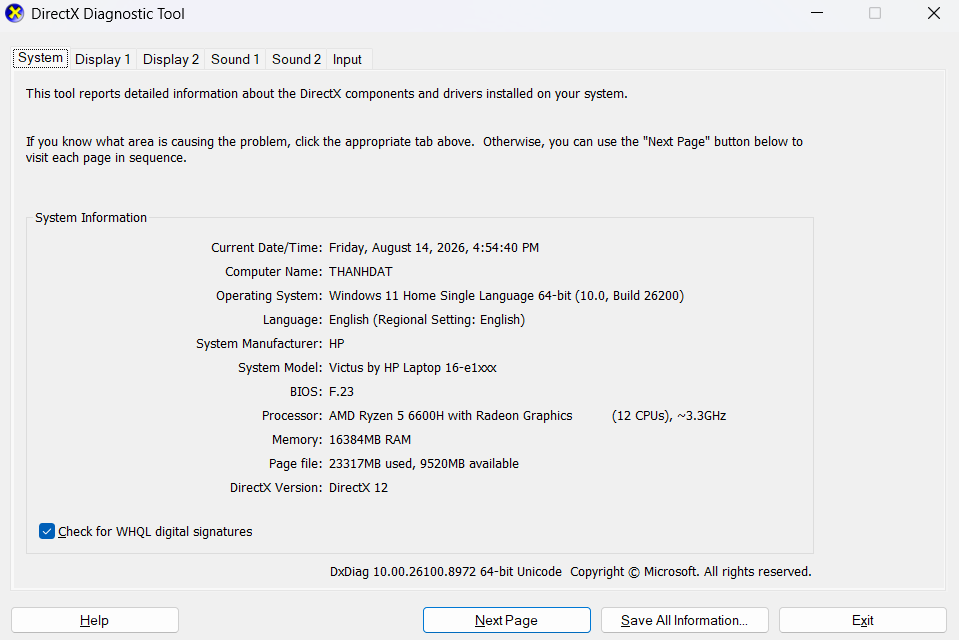
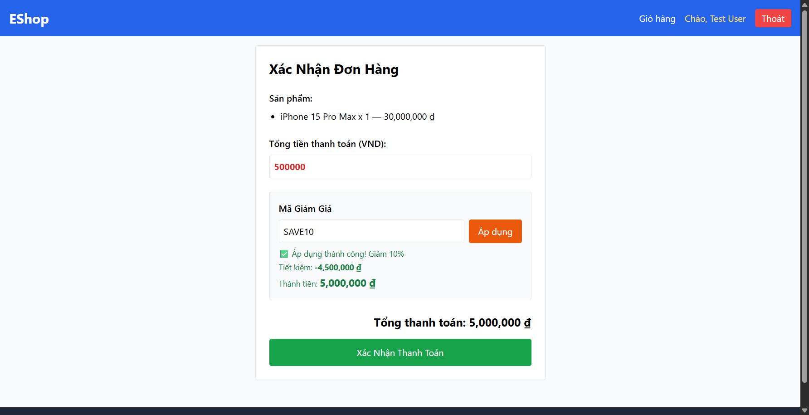
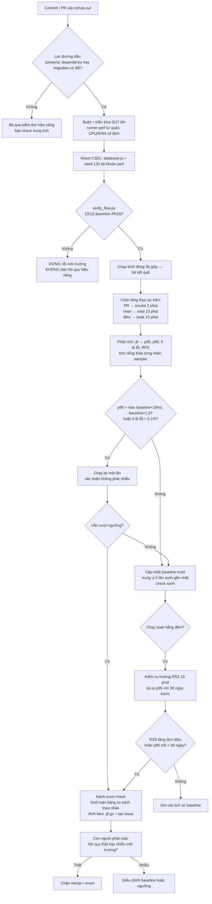

# HW05 — Kiểm thử Hiệu năng (Performance Testing, AI-First)

| Trường thông tin                        | Giá trị                                            |
| --------------------------------------- | -------------------------------------------------- |
| MSSV                                    | 23127344                                           |
| Họ và tên                               | TRƯƠNG THÀNH ĐẠT                                   |
| Lớp / Nhóm                              | Kiểm thử phần mềm - 23KTPM3                        |
| Ngày nộp                                | _<YYYY-MM-DD>_                                     |
| SUT                                     | EShop — https://github.com/ttbhanh/eshop-sut       |
| Commit / tag của SUT đã kiểm thử        | _<git SHA>_                                        |
| Công cụ sử dụng                         | JMeter 5.6.3                                       |
| Công cụ AI đã dùng                      | Claude Opus 5 (Claude Code, VSCode extension)      |
| Repo công khai (test plan + dữ liệu)    | https://github.com/trwng-thdat/software-testing    |
| Video demo (YouTube unlisted, ≥ 6 phút) | https://youtu.be/F2vkE3dHkj0 |
| Điểm tự đánh giá                        | _<000–100>_                                        |

> **Khai báo sử dụng AI.** Tôi có sử dụng công cụ AI cho các công việc sau: _<liệt kê ngắn gọn — thiết kế test plan, phân tích .jtl, đề xuất CPT, ...>_. Toàn bộ nhật ký tương tác được ghi trong `AI_Audit_Report.md` (Phụ lục A). Mọi kết quả do AI tạo ra bên dưới đều đã được tôi rà soát và chỉnh sửa; tôi chịu hoàn toàn trách nhiệm về các sản phẩm cuối cùng.

---

## Tóm tắt kết quả

| | Load | Stress | Spike | Endurance |
| --- | :-: | :-: | :-: | :-: |
| **Sample** | 11 011 | 13 329 | 2 620 | **567 174** |
| **Throughput** | 18,4 req/s | 22,3 req/s | 6,3 req/s | **630,3 req/s** |
| **p95** | 3 ms | 3 ms | 3 ms | 3 ms |
| **Tỉ lệ lỗi** | 0% | 0% | 0% | 0% |
| **VU đạt / thiết kế** | 50/50 | 100/100 | 60/60 | 50/50 |

**Tổng 594 134 sample, không có lỗi nào.** Cả bốn kịch bản đạt đúng số VU thiết kế (đọc từ cột `allThreads`).

| Kết luận chính | |
| --- | --- |
| **Ngưỡng chịu tải** | 630,3 req/s ổn định 15 phút, p95 = 3 ms, không rò rỉ bộ nhớ (RSS đi ngang 102–104 MB) |
| **Stress** | **Không tìm được điểm gãy** trong dải 20–100 VU — kết quả âm tính hợp lệ, ba nguyên nhân ở §3.7 |
| **Spike** | Phục hồi hoàn toàn, p95(GD3)/p95(GD1) = **1,00** — nhưng tải chưa đủ để gây sốc |
| **Lỗi của AI** | **11 lỗi** trong test plan (§3.6), trong đó 2 lỗi **không nằm trong file `.jmx`** |
| **Bug của SUT** | **1 bug chức năng** — `apply-coupon` tính sai giảm giá, vẫn "xanh" trong mọi assertion |

---

## Mục lục

| § | Nội dung | Điểm chính |
| :-: | --- | --- |
| **1** | [Phạm vi và Lựa chọn Endpoint](#1-phạm-vi-và-lựa-chọn-endpoint) | Luồng A, 3 nhóm endpoint |
| **2** | [Môi trường Kiểm thử và Phần cứng](#2-môi-trường-kiểm-thử-và-phần-cứng) | Ryzen 5 6600H, JMeter 5.6.3 |
| **3** | [**Task 1** — Thiết kế và Thực thi](#3-task-1--thiết-kế-và-thực-thi-kiểm-thử-với-sự-hỗ-trợ-của-ai) | 4 kịch bản, 594 134 sample, 0% lỗi |
| **4** | [**Task 2** — Phân tích AI và Truy tìm điểm hiểu sai](#4-task-2--phân-tích-bằng-ai-và-truy-tìm-điểm-hiểu-sai) | 6 diễn giải sai, 4/5 khuyến nghị là ảo giác |
| **5** | [**Task 3** — Đề xuất Continuous Performance Testing](#5-task-3--đề-xuất-continuous-performance-testing-disrupt) | Mô hình 3 tầng, ngưỡng lai chống nhiễu |
| **6** | [Agent Skill](#6-agent-skill) | `jmeter-testplan-eshop` |
| **7** | [Phê bình AI](#7-phê-bình-ai-200300-từ) | 299 từ |
| **8** | [Nhật ký Git Commit](#8-nhật-ký-git-commit) | |
| **9** | [Danh sách kiểm tra sản phẩm nộp](#9-danh-sách-kiểm-tra-sản-phẩm-nộp) | |
| **10** | [Tự đánh giá](#10-tự-đánh-giá) | |
| **11** | [Tài liệu tham khảo](#11-tài-liệu-tham-khảo) | |
| **A** | [Phụ lục A — AI Audit Report](#phụ-lục-a--ai-audit-report) | 15 artifact |
| **B** | [Phụ lục B — Chỉ mục bằng chứng](#phụ-lục-b--chỉ-mục-bằng-chứng) | |

<details>
<summary><b>Mục con của §3, §4, §5</b></summary>

**§3 — Task 1**
- 3.1 [Quy trình thiết kế cùng AI (11 bước)](#31-quy-trình-thiết-kế-cùng-ai-từng-bước) · 3.2 [Luồng E2E](#32-luồng-nghiệp-vụ-end-to-end) · 3.3 [Dữ liệu CSV](#33-dữ-liệu-đầu-vào-dạng-data-driven-csv)
- 3.4 [Tham số từng kịch bản](#34-tham-số-từng-kịch-bản-load--stress--spike) · 3.5 [Ba report view](#35-các-loại-report-view-đã-dùng) · **3.6 [Rà soát — 11 lỗi của AI](#36-rà-soát-của-con-người--những-điểm-ai-làm-sai)**
- 3.7 [Thực thi và bằng chứng](#37-thực-thi-và-bằng-chứng) · 3.8 [Khóa tài khoản](#38-xử-lý-khóa-tài-khoản-và-quy-trình-reset) · 3.9 [Endurance và ngưỡng](#39-kiểm-thử-endurance--soak-và-ngưỡng-phần-cứng)
- 3.10 [Video demo](#310-video-demo) · 3.11 [Lỗi đã báo cáo](#311-các-lỗi-đã-báo-cáo)

**§4 — Task 2**
- 4.1 [Yêu cầu AI phân tích gì](#41-tôi-đã-yêu-cầu-ai-phân-tích-những-gì) · 4.2 [Phân tích của AI](#42-phần-phân-tích-của-ai-nguyên-trạng) · **4.3 [6 diễn giải sai](#43-truy-tìm-điểm-hiểu-sai-rà-soát-của-con-người)**
- 4.4 [Ngưỡng hiệu chỉnh lại](#44-ngưỡng-do-tôi-hiệu-chỉnh-lại) · 4.5 [Đánh giá khuyến nghị](#45-đánh-giá-các-khuyến-nghị-tối-ưu-của-ai)

**§5 — Task 3**
- 5.1 [Mục tiêu](#51-mục-tiêu) · 5.2 [Mô hình đề xuất](#52-mô-hình-đề-xuất) · 5.3 [Lưu đồ](#53-lưu-đồ) · 5.4 [Đánh đổi](#54-đánh-đổi-trade-offs) · 5.5 [Giới hạn](#55-ba-điều-mô-hình-này-không-làm-được)

</details>

---

## 1. Phạm vi và Lựa chọn Endpoint

Ba nhóm endpoint được bao phủ bởi **một** luồng nghiệp vụ end-to-end duy nhất, và cả ba test plan đều thực thi luồng này giống hệt nhau.

**Luồng được chọn: "Hành trình hồ sơ cá nhân + lịch sử đơn hàng."** Một khách hàng đã đăng nhập xem lại hồ sơ cá nhân và các đơn hàng cũ của mình, cập nhật thông tin giao hàng, sau đó tính thử mã giảm giá.

| Nhóm          | Endpoint của SUT                                 | Mục API spec | Mã FR        | Lý do lựa chọn                                                                                                                                                                            |
| ------------- | ------------------------------------------------ | ------------ | ------------ | ----------------------------------------------------------------------------------------------------------------------------------------------------------------------------------------- |
| Auth-heavy    | `POST /api/login`                                | §1.2         | FR-02        | Cấp JWT mà mọi bước sau đều cần; đồng thời chịu ràng buộc khóa tài khoản sau 3 lần đăng nhập sai, nên đây là nhóm bắt buộc phải quản lý lockout.                                          |
| Read-heavy    | `GET /api/users/me`, `GET /api/orders/my-orders` | §2.1, §4.4   | FR-04, FR-11 | Hai thao tác đọc dữ liệu riêng của từng người dùng và có yêu cầu xác thực — response khác nhau theo từng user nên không thể phục vụ từ cache dùng chung như danh sách sản phẩm công khai. |
| Transactional | `PUT /api/users/me`, `POST /api/apply-coupon`    | §2.2, §5.1   | FR-04, FR-09 | `PUT /api/users/me` là thao tác ghi thật xuống dòng dữ liệu người dùng; `apply-coupon` kích hoạt phần tính toán mã giảm giá cùng cơ chế đếm `max_uses_per_user`.                          |

**Base URL:** `http://localhost:3000` (theo tài liệu API spec).

---

## 2. Môi trường Kiểm thử và Phần cứng

### 2.1 Cấu hình phần cứng

| Hạng mục       | Giá trị                                         |
| -------------- | ----------------------------------------------- |
| Hostname       | `THANHDAT` |
| Máy            | Victus by HP Laptop 16-e1xxx |
| CPU            | AMD Ryzen 5 6600H with Radeon Graphics — 6 nhân / 12 luồng, ~3,3 GHz |
| RAM            | 16 GB (15,2 GB khả dụng) |
| Ổ cứng         | _<model SSD — xem mục "Disk & DVD/CD-ROM Drives" trong dxdiag.txt>_ |
| GPU            | AMD Radeon (tích hợp) + NVIDIA GeForce RTX 3050 Laptop GPU (rời) |
| Hệ điều hành   | Windows 11 Home Single Language, build 26200 |
| Java / Runtime | OpenJDK 21.0.10 LTS (build 21.0.10+8-LTS-217) |
| JMeter         | Apache JMeter 5.6.3 |
| Mạng           | localhost (loopback) — SUT và load generator cùng máy |

> **Hệ quả của cấu hình 6 nhân / 12 luồng.** JMeter và SUT chia nhau cùng bộ CPU này. Ở kịch bản Spike, 60 VU đồng thời nghĩa là 60 thread JMeter cộng với event loop của Node.js cùng tranh 12 luồng logic — đây là lý do VU đỉnh được giảm từ 100 xuống 60 (§3.4), và là lý do phải kiểm cột `allThreads` trong `.jtl` trước khi kết luận bất cứ điều gì về giới hạn của SUT.



**Bằng chứng:** `evidence/hardware/dxdiag.png` (ảnh chụp màn hình, hostname `THANHDAT` khớp với bảng trên và với các lần triển khai ở HW04), `evidence/hardware/dxdiag.txt` (bản text đầy đủ).

### 2.2 Máy sinh tải (load generator)

Chạy trên **cùng máy** với SUT.

| Hạng mục | Giá trị |
| --- | --- |
| Công cụ | Apache JMeter 5.6.3 |
| Đường dẫn cài đặt | `C:\apache-jmeter-5.6.3` |
| Nguồn tải | `https://dlcdn.apache.org/jmeter/binaries/apache-jmeter-5.6.3.zip` |
| SHA-512 | Đã đối chiếu khớp với checksum chính thức của Apache |
| Java runtime | 21.0.10 LTS |

**Hệ quả của việc chạy cùng máy — phải nêu khi diễn giải mọi con số:** JMeter cạnh tranh CPU trực tiếp với tiến trình `node.exe` của SUT. Do đó:

1. **RPS đo được là giới hạn của cả cụm máy**, không phải giới hạn của riêng SUT. Con số thật của SUT khi chạy trên hạ tầng riêng sẽ cao hơn.
2. **VU đỉnh của kịch bản Spike đã giảm từ 100 xuống 60** vì lý do này (§3.4). Ở mức 100 VU, phần lớn tài nguyên sẽ dành cho việc JMeter khởi tạo và quản lý thread thay vì cho SUT xử lý request.
3. Khi p95 tăng ở tải cao, **không thể quy kết ngay cho SUT** — phải kiểm cột `allThreads` trong `.jtl` để loại trừ khả năng chính JMeter mới là nút thắt.

**Xác minh cả ba test plan mở được bằng JMeter thật.** Chạy thử từng file với 1 VU trong 1 giây (SUT chưa bật, nên 0 sample là kết quả đúng — mục tiêu chỉ là xác nhận JMeter chấp nhận file):

| File | Kết quả | Ghi chú |
| --- | --- | --- |
| `23127344_Load_20260812.jmx` | ✅ `Starting standalone test` | Không lỗi, không exception |
| `23127344_Spike_20260813.jmx` | ✅ `Starting standalone test` | Không lỗi, không exception |
| `23127344_Stress_20260812.jmx` | ✅ `Created the tree successfully` | Bậc 5 có `delay=480s` cứng trong file nên không rút ngắn được; chỉ xác nhận khâu nạp |

> Đây là **tầng kiểm chứng thứ năm**, bổ sung cho bốn tầng ở §3.1. Nó chứng minh một điều mà `validate_jmx.py` về nguyên lý không thể: script chỉ đọc XML và kiểm tra cấu trúc `hashTree`, nó không biết JMeter 5.6.3 có nhận diện được từng `guiclass` / `testclass` hay không. Một file XML hoàn toàn hợp lệ vẫn có thể bị JMeter **âm thầm bỏ qua phần tử** nếu tên lớp sai phiên bản.

---

## 3. Task 1 — Thiết kế và Thực thi Kiểm thử với sự hỗ trợ của AI

### 3.1 Quy trình thiết kế cùng AI (từng bước)

Tôi dẫn dắt AI đi qua từng bước của kỹ thuật kiểm thử thay vì đưa ra một prompt chung chung duy nhất. Tóm tắt chuỗi tương tác (prompt và output đầy đủ nằm ở Phụ lục A):

| #   | Bước                     | Mục đích của prompt                                                        | AI tạo ra gì                                                                     | Kết luận của tôi                                                |
| --- | ------------------------ | -------------------------------------------------------------------------- | -------------------------------------------------------------------------------- | --------------------------------------------------------------- |
| 1   | Khảo sát endpoint        | Yêu cầu AI đọc ảnh chụp endpoint của nhóm và đề xuất luồng không trùng lặp | Đề xuất luồng hồ sơ cá nhân, nhưng dùng route `/api/profile` **không tồn tại**   | **Đã bác bỏ** — xem §3.6 lỗi 1 (audit \#2, INVALID)            |
| 2   | Đối chiếu đặc tả         | Cung cấp `api_spec.md` và yêu cầu mọi endpoint phải kèm số mục tham chiếu  | Dựng lại luồng 5 bước, mỗi bước có mục tham chiếu (§1.2, §2.1, §4.4, §2.2, §5.1) | Chấp nhận, còn 3 vấn đề tồn đọng ở §1 (audit \#3)               |
| 3   | Tham số hóa              | Yêu cầu cấu trúc CSV và trường nào cần thay đổi theo từng VU               | Ba file CSV kèm chế độ chia sẻ; số dòng ban đầu tính sai                         | Đã sửa số dòng — xem §3.6 lỗi 2 (audit \#4)                    |
| 4   | Định hình kịch bản Load  | Yêu cầu thread / ramp-up / think-time kèm lý giải                          | 50 VU / ramp 60s / 600s, think time Uniform 1,5–4 giây                           | Chấp nhận thiết kế, nhưng cài đặt timer sai (§3.6 lỗi 4)       |
| 5   | Assertion + correlation  | Yêu cầu assertion kiểm tra body chứ không chỉ status code                  | 9 assertion, có `$.email` khớp CSV; 3 JSON Extractor                             | Chấp nhận, trừ giá trị mặc định `userId=0` (§3.6 lỗi 5)        |
| 6   | Sinh file JMX Stress     | Yêu cầu hồ sơ tăng tải theo bậc, không phụ thuộc plugin                    | 5 Thread Group với delay lệch nhau, cộng dồn 20→100 VU                           | Chấp nhận (audit \#6)                                           |
| 7   | Sinh file JMX Spike      | Yêu cầu hình dạng spike kèm giai đoạn đo phục hồi                          | 3 giai đoạn: nền 10 VU → spike 100 VU (ramp 5s) → nền 10 VU dài gấp đôi          | Chấp nhận (audit \#7)                                           |
| 8   | **Rà soát chéo toàn bộ** | Yêu cầu AI đóng vai người rà soát độc lập, kiểm tra lại cả ba file         | Phát hiện **4 lỗi ngữ nghĩa** mà 3 lượt tự kiểm tra trước đó đều bỏ sót          | **Bước giá trị nhất trong 8 bước đầu** — §3.6 lỗi 3–6 (audit \#8) |
| 9   | Dựng Agent Skill         | Đóng gói quy trình thành skill tái sử dụng, mã hóa sẵn 4 lỗi đã gặp        | `jmeter-testplan-eshop`: SKILL.md, 4 file tham chiếu, template XML, script kiểm tra | Chấp nhận — xem §6 (audit \#9)                                  |
| 10  | Sinh lại Spike bằng skill | Kiểm chứng skill có thật sự tránh được 4 lỗi cũ hay không                 | File Spike mới sạch cả 4 lỗi ngay từ lần sinh đầu, nhưng **tự sinh một lỗi mới** (assertion PUT) | Chấp nhận file, ghi nhận lỗi mới — §3.6 lỗi 9 (audit \#10)    |
| 11  | **Đối chiếu mã nguồn SUT** | Cung cấp `group05_eshop/backend/` và yêu cầu kiểm chứng mọi giả định còn treo | Phát hiện **4 lỗi mới** (§3.6 lỗi 7–10), trong đó 2 lỗi **không nằm trong file `.jmx`**; xác minh dứt điểm 3 giả định treo từ bước 2 | **Bước quyết định** — nếu bỏ qua, cả ba bài test vẫn chạy nhưng cho ra `.jtl` vô nghĩa (audit \#11) |

> **Nhận xét về chính quy trình này.** Tám bước đầu đi theo đúng tinh thần "dẫn dắt AI từng bước" mà đề bài yêu cầu, và mỗi bước đều cho ra sản phẩm dùng được. Nhưng bước 8 mới phát hiện ra rằng ba trong số các sản phẩm đó **không chạy đúng như thiết kế**, và bước 11 còn lộ ra một tầng sai lệch sâu hơn nữa.
>
> **Bốn tầng kiểm chứng — mỗi tầng bắt được loại lỗi mà tầng trước không thấy:**
>
> | Tầng | Cách kiểm | Bắt được | Về nguyên lý không thể thấy |
> | --- | --- | --- | --- |
> | 1 | AI tự kiểm tra | Lỗi cú pháp XML | Mọi lỗi ngữ nghĩa — 3 lượt đều báo "OK" |
> | 2 | `validate_jmx.py` | 4 lỗi ngữ nghĩa JMeter (§3.6 lỗi 3–6) | Bất cứ thứ gì nằm ngoài file `.jmx` |
> | 3 | Đối chiếu `api_spec.md` | Tên endpoint bịa (§3.6 lỗi 1) | Đặc tả mô tả *schema*, không mô tả *dữ liệu đã seed* |
> | 4 | **Đọc mã nguồn + truy vấn CSDL thật** | Dữ liệu test lệch pha với CSDL (dòng 8–9); hành vi endpoint khác đặc tả (dòng 10–11) | Vẫn chưa chứng minh file mở được bằng JMeter thật |
>
> Bài học quan trọng nhất không phải là "AI hay sai", mà là **mỗi tầng kiểm chứng chỉ nhìn thấy loại lỗi nằm trong phạm vi dữ liệu của nó**. `validate_jmx.py` do chính AI viết, chạy sạch trên cả ba file, và điều đó hoàn toàn không mâu thuẫn với việc 120 tài khoản trong `users.csv` không tồn tại trong CSDL — vì thông tin ấy không nằm trong file mà script đọc. Một công cụ kiểm tra chỉ mạnh ngang phạm vi dữ liệu nó được nhìn thấy, và cảm giác an toàn do nó tạo ra tỉ lệ nghịch với phạm vi đó.

### 3.2 Luồng nghiệp vụ end-to-end

Cả ba test plan đều chạy cùng một thân thread group:

```
1. POST /api/login                    → trích xuất $.token           [auth-heavy]
   body: {"email": "${email}", "password": "${password}"}   (users.csv)
   assert: HTTP 200 VÀ body chứa "token" không rỗng
   think time: <n> ms

2. GET  /api/users/me                                                [read-heavy]
   header: Authorization: Bearer ${authToken}
   assert: HTTP 200 VÀ $.email == ${email}   (chứng minh token đúng với user tương ứng)
   think time: <n> ms

3. GET  /api/orders/my-orders         → trích xuất $[0].id thành orderId   [read-heavy]
   header: Authorization: Bearer ${authToken}
   assert: HTTP 200 VÀ response là một mảng JSON
   think time: <n> ms

4. PUT  /api/users/me                                                [transactional]
   header: Authorization: Bearer ${authToken}
   body: {"name": "${pname}", "shipping_address": "${paddress}", "phone": "${pphone}"}
         (profiles.csv — mỗi dòng một giá trị khác nhau, để mỗi VU ghi một giá trị riêng)
   assert: HTTP 200 VÀ body chứa "Profile updated"
   think time: <n> ms

4b. GET /api/users/me                                                [verify ghi]
   header: Authorization: Bearer ${authToken}
   assert: HTTP 200 VÀ $.phone == ${pphone}
   → Bước bắt buộc, KHÔNG phải tùy chọn: server.js:131-134 chỉ trả
     {"message":"Profile updated"} nên bản thân response của bước 4 không
     chứng minh được lệnh UPDATE đã commit. Phải đọc lại mới có bằng chứng.
   think time: <n> ms

5. POST /api/apply-coupon                                     [read-only + compute]
   header: Authorization: Bearer ${authToken}
   body: {"code": "${couponCode}", "total_amount": ${totalAmount}, "user_id": ${userId}}
         (coupons.csv)
   bọc trong If Controller: "${userId}" != "USERID_NOT_FOUND"
   assert: HTTP 200 VÀ body chứa "final_amount"
```

**Lý giải độ bao phủ.**

| Nhóm | Bước | Vì sao thuộc nhóm này |
| --- | --- | --- |
| **auth-heavy** | 01 | Lời gọi duy nhất thực hiện xác thực thông tin đăng nhập và ký JWT; cũng là endpoint chịu ràng buộc khóa tài khoản của FR-02 |
| **read-heavy** | 02, 03 | Cả hai là `GET` có xác thực, đọc dữ liệu **riêng của từng người dùng**. Vì response khác nhau theo user nên không thể phục vụ từ cache dùng chung — khác với danh sách sản phẩm công khai — do đó đo được khối lượng truy vấn CSDL thực sự phát sinh trên mỗi request |
| **transactional** | 04 | Lệnh `UPDATE` lên dòng dữ liệu của chính người gọi (`server.js:131`), tham số hóa để không có hai VU nào ghi cùng giá trị, tránh trường hợp ghi mà không thay đổi gì |
| *verify ghi* | 04b | Đọc lại để xác nhận lệnh ghi đã commit xuống CSDL |
| **read-only + compute** | 05 | Chỉ `SELECT` rồi tính toán, không ghi gì xuống CSDL |

Mọi request sau bước 01 đều phụ thuộc vào token trích xuất từ bước đó, nên đây là một hành trình end-to-end thực sự chứ không phải sáu lời gọi rời rạc.

> ⚠️ **Một giả định ban đầu đã bị số liệu bác bỏ.** Thiết kế ban đầu lập luận rằng auth-heavy là nhóm **nặng CPU** vì phải hash mật khẩu và ký JWT. Kết quả đo cho thấy bước 01 chỉ mất **2,2 ms trung bình** (§3.7). Kiểm tra mã nguồn xác nhận nguyên nhân: `server.js:46` so sánh `user.password === password` **trực tiếp trên chuỗi plaintext**, và `package.json` không có bcrypt/argon/scrypt nào — SUT **không hề hash mật khẩu** (bug bảo mật cố ý, xem `CLAUDE.md` của SUT). Nhóm auth-heavy vẫn được phủ đúng theo yêu cầu đề bài, nhưng **đặc tính "nặng CPU" không đúng với SUT này**.

> **Đã kiểm chứng: `POST /api/apply-coupon` KHÔNG ghi CSDL.** Nghi vấn nêu ở §1 nay đã có câu trả lời dứt khoát từ mã nguồn. `server.js:363-441` chỉ thực hiện `SELECT` từ bảng `coupons` (dòng 370) và đếm trên `coupon_usage` (dòng 388) rồi tính `discount_amount` / `final_amount` — **không có một lệnh `INSERT` hay `UPDATE` nào**. Bảng `coupon_usage` chỉ được ghi bởi `POST /api/coupon-usage` (`server.js:444-454`), là một endpoint **khác** và không nằm trong luồng này. Do đó `max_uses_per_user` không bao giờ tăng khi chạy test, và bước 5 phải mang nhãn `[read-only + compute]`.
>
> **Hệ quả với độ bao phủ ba nhóm:** luồng này chỉ còn **một** endpoint transactional thật sự là `PUT /api/users/me` (bước 4). Điều này **vẫn thỏa** yêu cầu của đề bài — đề chỉ yêu cầu bao phủ cả ba nhóm, không quy định số lượng endpoint mỗi nhóm — và bước 4b tăng cường bằng chứng cho nhóm này bằng cách xác minh dữ liệu thật sự xuống được CSDL. Phương án thay bước 5 bằng `PUT /api/orders/:id/cancel` (§4.6) đã **không** được chọn: tài khoản `perf*` vừa seed chưa có đơn hàng nào nên `$[0].id` luôn trả về giá trị mặc định, và việc dựng sẵn đơn hàng cho 120 tài khoản chỉ để có thêm một endpoint transactional là chi phí không tương xứng.

**Các điểm correlation.**

| Giá trị trích xuất | Từ bước | Extractor                                      | Dùng ở bước                                               |
| ------------------ | ------- | ---------------------------------------------- | --------------------------------------------------------- |
| `authToken`        | 1       | JSON Extractor `$.token`, mặc định `TOKEN_NOT_FOUND`     | 2, 3, 4, 4b, 5 — header `Authorization: Bearer ${authToken}` |
| `userId`           | 1       | JSON Extractor `$.user.id`, mặc định `USERID_NOT_FOUND`  | 5 (trường `user_id` trong body)                             |
| `orderId`          | 3       | JSON Extractor `$[0].id`, mặc định `ORDERID_NOT_FOUND`   | Dự phòng — hiện không dùng ở bước nào                       |

**Đã kiểm chứng cấu trúc response.** Ba JSON Path trên đều được xác nhận bằng cách đọc mã nguồn, không phải suy đoán từ đặc tả:

| JSON Path   | Nguồn xác minh                                                       | Kết luận |
| ----------- | -------------------------------------------------------------------- | -------- |
| `$.token`   | `server.js:52` — `res.json({ message, token, user })`                | ✅ đúng |
| `$.user.id` | `server.js:52` — `user` là toàn bộ row từ `SELECT *`, có cột `id`    | ✅ đúng |
| `$.email`   | `server.js:113-114` — `GET /api/users/me` trả nguyên row, `email` ở **cấp gốc** chứ không lồng trong `user` | ✅ đúng |

> Đây là điểm mà Agent Skill đã đánh dấu ⚠️ ngay từ đầu vì `api_spec.md` §1.2 chỉ ghi *"trả về chuỗi JWT `token` và thông tin `user`"* mà không nêu cấu trúc JSON. Nếu cấu trúc thật là `$.data.token`, extractor sẽ trả về `TOKEN_NOT_FOUND`, If Controller chặn toàn bộ các bước sau, và bài test chỉ đo mỗi endpoint login **mà không báo lỗi gì**. Việc kiểm chứng bằng mã nguồn đã loại bỏ rủi ro này.

> Việc trích xuất `userId` từ response đăng nhập thay vì đọc từ CSV giúp request áp mã giảm giá luôn nhất quán với token thực sự được cấp. Nếu lấy `user_id` từ CSV, giá trị này có thể lệch với JWT khi dữ liệu seed thay đổi, khiến bước 5 thất bại vì lý do không liên quan đến hiệu năng.
>
> **Mọi giá trị mặc định đều được chọn để gây lỗi quan sát được** (`*_NOT_FOUND` thay vì `0` hay chuỗi rỗng) — xem lỗi \#5 ở §3.6. Bước 5 được bọc trong If Controller `"${userId}" != "USERID_NOT_FOUND"` để một lần trích xuất hỏng không sinh thêm request rác làm sai lệch tỉ lệ lỗi.

**Assertion cho từng bước.**

| Bước   | Assertion                                               | Lý do                                                                                                                                                                                                |
| ------ | ------------------------------------------------------- | ---------------------------------------------------------------------------------------------------------------------------------------------------------------------------------------------------- |
| 1      | HTTP 200 **và** `$.token` tồn tại, không rỗng           | Chỉ kiểm tra status code sẽ vẫn "pass" khi server trả về khung lỗi kèm mã 200; ngoài ra token rỗng sẽ âm thầm phá vỡ bước 2–5, khiến chúng thất bại vì lý do sai lệch                                |
| 2      | HTTP 200 **và** `$.email` khớp với `${email}` trong CSV | Chứng minh token ánh xạ đúng người dùng. Khi tải cao, đây chính là assertion có thể phát hiện tình trạng lẫn session/token — một lỗi tính đúng đắn mà việc kiểm tra status code đơn thuần không thấy |
| 3      | HTTP 200 **và** body phân tích được thành mảng JSON     | Bắt được response "thành công nhưng sai định dạng" khi có tải. Cố ý **không** yêu cầu mảng khác rỗng: một tài khoản vừa seed hoàn toàn có thể chưa có đơn hàng nào                                   |
| 4      | HTTP 200 **và** body chứa `Profile updated`             | `server.js:131-134` chỉ trả `{"message":"Profile updated"}` — **không** trả lại giá trị vừa ghi. Thiết kế ban đầu assert `$.name` khớp giá trị vừa ghi sẽ **fail 100%** (lỗi 9 §3.6). Bản thân assertion này chỉ chứng minh handler chạy tới cuối, chưa chứng minh dữ liệu đã xuống CSDL |
| **4b** | HTTP 200 **và** `$.phone` khớp `${pphone}` vừa ghi      | Đây mới là bằng chứng lệnh `UPDATE` đã commit. Đọc lại qua một request độc lập là cách duy nhất kiểm chứng được, vì response của bước 4 không mang thông tin đó. Chọn `$.phone` thay vì `$.name` vì `profiles.csv` sinh số điện thoại duy nhất theo từng dòng nên khó trùng ngẫu nhiên |
| 5      | HTTP 200 **và** có trường `$.final_amount`              | Theo API spec §5.1, response bắt buộc chứa `discount_amount` / `final_amount`; nếu trả 200 mà thiếu chúng thì phép tính đã không chạy. **Lưu ý:** assertion này **không** bắt được bug tính sai phần trăm của SUT (`server.js:399-401` dùng `total * (1 - discount_value)` khiến `SAVE10` trên 500 000 ₫ trả `final_amount = 5 000 000` thay vì 450 000) — response vẫn là 200 và vẫn có trường `final_amount`. Đây là giới hạn cố hữu của kiểm thử hiệu năng, ghi nhận ở §3.11 |
| tất cả | Duration assertion — _<ghi rõ có dùng hay không>_       | Nếu bật, nó sẽ tính các response chậm-nhưng-đúng thành lỗi, làm lẫn lộn độ trễ với thất bại. Khuyến nghị: **không bật**, thay vào đó phân tích độ trễ qua các percentile trong file `.jtl`           |

### 3.3 Dữ liệu đầu vào dạng data-driven (CSV)

| File                | Cột dữ liệu                   | Số dòng | Dùng ở bước | Chế độ chia sẻ / recycle                        |
| ------------------- | ----------------------------- | ------- | ----------- | ----------------------------------------------- |
| `data/users.csv`    | `email,password`              | 120     | Bước 1      | All threads, `recycle=true`, `stopThread=false` |
| `data/profiles.csv` | `name,shipping_address,phone` | 60      | Bước 4      | All threads, `recycle=true`                     |
| `data/coupons.csv`  | `code,total_amount`           | 6       | Bước 5      | All threads, `recycle=true`                     |

**Script seed dữ liệu.** `data/seed_perf_users.py` tạo 120 tài khoản `perf001…perf120@test.com` trong CSDL SUT. Bắt buộc chạy **trước lần chạy test đầu tiên**, vì `backend/database.js` chỉ seed hai tài khoản mặc định (xem lỗi 7 ở §3.6):

```bash
python hw5/data/seed_perf_users.py            # seed 120 tài khoản (idempotent)
python hw5/data/seed_perf_users.py --reset    # mở khóa + reset bộ đếm giữa các lần chạy
python hw5/data/seed_perf_users.py --verify   # chỉ kiểm tra, không ghi
```

**Cách chọn số dòng `users.csv` = 120.** Con số này phải lớn hơn hoặc bằng số VU đỉnh của **kịch bản nặng nhất**, chứ không phải của riêng kịch bản Load. Kịch bản Stress cộng dồn tới 100 VU (§3.4), nên 120 dòng đủ cho cả ba kịch bản và còn dư biên. Đây là lỗi tôi đã mắc phải trong lần dựng đầu: file ban đầu chỉ có 60 dòng, vừa đủ cho Load 50 VU nhưng **thiếu cho Stress** — với `recycle=false` và `stopThread=true`, bậc 4 và bậc 5 sẽ tự tắt thread ngay khi khởi động, bài test vẫn "chạy xong" nhưng thực tế chỉ đo được khoảng 60 VU thay vì 100. Ghi nhận ở AI Audit Report artifact \#6.

Dòng dữ liệu mẫu (thay bằng giá trị đã seed thực tế):

```
# users.csv — 120 dòng, perf001 … perf120
email,password
perf001@test.com,Password123!
perf002@test.com,Password123!

# profiles.csv — 60 dòng, giá trị khác nhau để mỗi lần ghi đều làm thay đổi dữ liệu
name,shipping_address,phone
Perf User 01,01 Le Loi Q1 TP.HCM,0912345001
Perf User 02,02 Le Loi Q1 TP.HCM,0912345002

# coupons.csv — 6 dòng, mọi mã đều đối chiếu với database.js:107-110
code,total_amount
SAVE10,500000
BIGBUY,600000
VIP100,400000
```

**Cách chọn giá trị `coupons.csv`.** Mỗi dòng phải thỏa `total_amount > min_order_amount` của mã tương ứng (`server.js:379` dùng `>` chứ không phải `>=`), nếu không server trả 400 và assertion HTTP 200 sẽ fail vì **dữ liệu sai**, không phải vì hiệu năng:

| Mã       | `min_order_amount` | `max_uses_per_user` | `total_amount` đã dùng        |
| -------- | ------------------ | ------------------- | ----------------------------- |
| `SAVE10` | 300 000            | 1                   | 350 000 / 500 000 / 1 000 000 |
| `BIGBUY` | 500 000            | 1                   | 600 000 / 900 000             |
| `VIP100` | 300 000            | 2                   | 400 000                       |

Hai mã còn lại trong seed **cố ý không dùng**: `EXPIRED` hết hạn từ 2020 (`server.js:382` trả 400), và `TET2025` chỉ là ví dụ minh họa trong `api_spec.md` §6.4 chứ không tồn tại trong CSDL.

**Vì sao mỗi virtual user dùng một tài khoản riêng.** File `users.csv` dùng `recycle=false` kèm `stopThread=true` và có số dòng lớn hơn hoặc bằng số thread đỉnh, nên **không có hai virtual user nào dùng chung một tài khoản đăng nhập**. Đây là lựa chọn có chủ đích: FR-02 khóa tài khoản sau 3 lần đăng nhập sai, và một tài khoản dùng chung dưới tải Stress hoặc Spike sẽ có nguy cơ gây khóa dây chuyền, biến error rate thành phép đo cơ chế FR-02 thay vì đo hiệu năng. Ngược lại, nếu số dòng ít hơn số VU đỉnh thì các thread sẽ âm thầm dừng giữa chừng và làm giảm tải thực tế đưa vào hệ thống — vì vậy phải đối chiếu số dòng với con số VU đỉnh ở §3.4 trước mỗi lần chạy.

**Vì sao `profiles.csv` và `coupons.csv` dùng `recycle=true`.** Hai file này không mang thông tin định danh nên việc dùng lại giữa các virtual user là vô hại; bật recycle giúp giữ file nhỏ gọn. Tuy vậy các giá trị trong `profiles.csv` vẫn phải khác nhau **giữa các dòng**, để bước 4 thực hiện một lệnh `UPDATE` thật sự thay vì ghi đè lại đúng dữ liệu cũ.

### 3.4 Tham số từng kịch bản (Load / Stress / Spike)

> ⚠️ **Trạng thái hiện tại của ba file test plan.** Các tham số dưới đây là **thiết kế dự kiến**. Đợt rà soát ghi ở §3.6 (dòng 3–6) đã phát hiện bốn lỗi khiến cả ba file **chưa chạy đúng như thiết kế** — nghiêm trọng nhất là lỗi hết dữ liệu CSV khiến bài test tự dừng ở khoảng giây 30. Phải sửa xong bốn lỗi đó rồi mới chạy thật; sau khi chạy, đối chiếu lại bảng này với số liệu thực tế trong `.jtl`.

|                        | Load                                  | Stress                                          | Spike                                                                                   |
| ---------------------- | ------------------------------------- | ----------------------------------------------- | --------------------------------------------------------------------------------------- |
| File test plan         | `23127344_Load_20260812.jmx`          | `23127344_Stress_20260812.jmx`                  | `23127344_Spike_20260812.jmx`                                                           |
| Số virtual user (đỉnh) | 50                                    | 100 (5 bậc × 20 VU, cộng dồn)                   | 100 (nền 10 VU → spike 100 VU)                                                          |
| Ramp-up                | 60 giây (~1 VU/giây)                  | Theo bậc: +20 VU mỗi 120 giây, mỗi bậc ramp 30s | **5 giây cho 100 VU** (gần như tức thời)                                                |
| Thời gian giữ tải      | 600 giây                              | 600 giây (bậc cuối chỉ giữ 120 giây)            | Spike giữ 60 giây; tổng bài test 420 giây                                               |
| Ramp-down              | Không (kết thúc theo scheduler)       | Không (mọi bậc cùng dừng ở giây 600)            | Spike tắt đột ngột ở giây 180, nền tiếp tục 240s                                        |
| Số vòng lặp mỗi VU     | Lặp vô hạn đến hết thời lượng         | Lặp vô hạn đến hết thời lượng                   | Lặp vô hạn đến hết thời lượng từng giai đoạn                                            |
| Think time             | Uniform 1,5–4 giây tùy bước           | Giống Load (dùng chung thân workflow)           | Giống Load (dùng chung thân workflow)                                                   |
| Listener               | **Summary Report**                    | **Aggregate Report**                            | **View Results Tree** (chỉ ghi lỗi)                                                     |
| Mục tiêu               | Quan sát hành vi ở trạng thái ổn định | Tìm điểm gãy (knee) của hệ thống                | Chịu được và **phục hồi** sau cú tăng tải đột ngột                                      |
| Tiêu chí đạt           | _<p95 < X ms, error rate < Y%>_       | _<xác định điểm knee; không crash>_             | _<p95 giai đoạn 3 trở về ≈ p95 giai đoạn 1 trong vòng Z giây; không còn 5xx sau spike>_ |

**Hồ sơ tải của kịch bản Stress (5 bậc).** JMeter bản chuẩn không có sẵn cơ chế tăng tải theo bậc, nên tôi dùng 5 Thread Group riêng với `delay` lệch nhau — cách này **không cần cài plugin**, giúp file mở được trên mọi bản JMeter 5.6.3 gốc. Các bậc cộng dồn lên nhau và cùng kết thúc tại giây 600:

| Bậc | Bắt đầu (giây) | Thời lượng | VU thêm vào | VU cộng dồn |
| --- | -------------- | ---------- | ----------- | ----------- |
| 1   | 0              | 600 giây   | +20         | 20          |
| 2   | 120            | 480 giây   | +20         | 40          |
| 3   | 240            | 360 giây   | +20         | 60          |
| 4   | 360            | 240 giây   | +20         | 80          |
| 5   | 480            | 120 giây   | +20         | 100         |

Mỗi bậc giữ tải ít nhất 120 giây trước khi bậc kế tiếp vào, đủ để hệ thống ổn định và để đọc được p95 của riêng mức tải đó — nếu tăng bậc quá nhanh thì không phân biệt được độ trễ tăng do tải hay do hệ thống chưa kịp ổn định. Tất cả tham số đều override được qua dòng lệnh: `-Jstepvusers=30 -Jsteprampup=20`.

**Hồ sơ tải của kịch bản Spike (3 giai đoạn).** Tổng thời lượng 420 giây:

| Giai đoạn     | Khoảng thời gian | VU  | Ramp-up    | Vai trò                                               |
| ------------- | ---------------- | --- | ---------- | ----------------------------------------------------- |
| 1 — Nền trước | giây 0–120       | 10  | 20 giây    | Lấy p95 tham chiếu ở mức tải bình thường              |
| 2 — Spike     | giây 120–180     | 100 | **5 giây** | Cú tăng tải đột ngột: gấp 10 lần mức nền trong 5 giây |
| 3 — Nền sau   | giây 180–420     | 10  | 20 giây    | **Đo phục hồi** — dài 240 giây, gấp đôi giai đoạn 1   |

**Vì sao giai đoạn 3 là phần quan trọng nhất.** Mục tiêu của spike test không chỉ là "hệ thống có sập khi tải tăng đột ngột không", mà còn là "sau khi tải rút đi thì hệ thống có trở về bình thường không, và mất bao lâu". Nếu test plan kết thúc ngay sau spike thì nó không thể trả lời câu hỏi thứ hai. Giai đoạn 3 được thiết kế dài gấp đôi giai đoạn 1 để đủ dữ liệu quan sát: **so sánh p95 của giai đoạn 3 với p95 của giai đoạn 1 chính là thước đo phục hồi**. Nếu p95 giai đoạn 3 vẫn cao hơn hẳn giai đoạn 1 cho tới cuối bài test, đó là dấu hiệu hệ thống chưa hồi phục — ví dụ connection pool chưa được giải phóng, hàng đợi còn tồn đọng, hoặc bộ nhớ chưa được thu hồi.

Tham số override: `-Jbasevusers=20 -Jspikevusers=150`.

**Lý giải tham số (đề xuất của AI → quyết định của tôi).**

- **Think time.** AI đề xuất _<giá trị>_; tôi chọn _<giá trị>_ vì _<người dùng thật đọc một trang sản phẩm mất vài giây; think-time bằng 0 sẽ biến load test thành stress test>_.
- **Ramp-up.** AI đề xuất _<giá trị>_; tôi chọn _<giá trị>_ vì _<ramp-up quá ngắn chỉ đo được chi phí thiết lập kết nối chứ không đo được trạng thái ổn định>_.
- **Số VU.** AI đề xuất _<giá trị>_; tôi chọn _<giá trị>_ vì _<load generator và SUT dùng chung phần cứng này; xem §2.2>_.
- **Hình dạng spike.** _<...>_

### 3.5 Các loại report view đã dùng

Ba loại listener / output **khác nhau**, không lặp lại:

| Kịch bản | Report view                         | Phần tử JMeter              | Sản phẩm             | Vì sao view này phù hợp với kịch bản đó                                                                                                           |
| -------- | ----------------------------------- | --------------------------- | -------------------- | ------------------------------------------------------------------------------------------------------------------------------------------------- |
| Load     | **Summary Report**                  | `SummaryReport`             | `reports/load/...`   | Tải giữ đều nên con số tổng hợp là đủ; view này cho throughput và error rate gọn gàng trên toàn bộ giai đoạn ổn định                              |
| Stress   | **Aggregate Report**                | `StatVisualizer`            | `reports/stress/...` | Khi tải tăng dần thì phần đuôi phân phối mới là thứ đáng xem; view này có sẵn cột p90 / p95 / p99 để xác định điểm knee — Summary Report không có |
| Spike    | **View Results Tree** (chỉ ghi lỗi) | `ViewResultsFullVisualizer` | `reports/spike/...`  | Cần xem **chi tiết từng request thất bại** trong lúc spike (mã lỗi, nội dung response) — điều mà hai view tổng hợp kia không thể cho thấy         |

Ba loại listener hoàn toàn khác nhau, không lặp lại, đúng yêu cầu của đề bài.

> **Lưu ý về View Results Tree trong kịch bản Spike.** Listener này được đặt `error_logging=true`, tức **chỉ ghi lại các sample thất bại**. Lý do: View Results Tree lưu toàn bộ nội dung request/response vào bộ nhớ, nếu ghi tất cả sample ở mức 100 VU thì JMeter sẽ ngốn RAM rất nhanh và chính load generator trở thành nút thắt — kết quả đo được sẽ phản ánh giới hạn của JMeter chứ không phải của SUT. Ghi riêng lỗi vừa đủ để phân tích vừa an toàn về bộ nhớ.

Cả ba lần chạy đều đồng thời sinh ra file `.jtl` thô và thư mục HTML dashboard của JMeter (đây là bằng chứng, không tính vào "ba report view").

### 3.6 Rà soát của con người — những điểm AI làm sai

Tổng cộng **11 lỗi**, phát hiện qua bốn tầng kiểm chứng khác nhau (xem bảng ở §3.1). Bảng dưới để tra nhanh; chi tiết đầy đủ ở phần sau.

| # | Lỗi | Mức ảnh hưởng | Phát hiện bằng cách nào |
| :-: | --- | --- | --- |
| 1 | Bịa hai endpoint không tồn tại | 🟡 Route không tồn tại | Đối chiếu `api_spec.md` |
| 2 | `users.csv` chỉ có 60 dòng, thiếu cho Stress 100 VU | 🟡 Thiếu dữ liệu | Rà soát chéo bằng AI |
| 3 | `recycle=false` + `stopThread=true` với vòng lặp vô hạn | 🔴 Test chết ở giây ~30 | Rà soát chéo + `validate_jmx.py` |
| 4 | Năm timer đặt ngang hàng sampler → think time nhân 5 lần | 🟠 Throughput sai ~5 lần | Rà soát chéo + `validate_jmx.py` |
| 5 | `userId` mặc định `0` che giấu lỗi extract | 🟡 Che giấu lỗi | Rà soát chéo + `validate_jmx.py` |
| 6 | Tính nhu cầu CSV theo VU đỉnh thay vì cộng dồn | 🟡 Hết biên an toàn | Rà soát chéo bằng AI |
| 7 | 120 tài khoản `perf*` không tồn tại trong CSDL | 🔴 Vô hiệu hoá 100% bài test | **Đọc mã nguồn + truy vấn CSDL thật** |
| 8 | `coupons.csv` có 4/5 dòng sẽ fail | 🟠 4/5 dòng dữ liệu fail | **Đọc mã nguồn + truy vấn CSDL thật** |
| 9 | Assertion `PUT` kiểm giá trị mà endpoint không trả về | 🟠 Assertion fail 100% | **Đọc mã nguồn SUT** |
| 10 | `apply-coupon` bị gán nhãn `[transactional]` sai | 🟢 Nhãn phân loại sai | **Đọc mã nguồn SUT** |
| 11 | Assertion `$.phone` so sánh sai kiểu dữ liệu | 🟠 Bước 4b fail 100% | **Chạy smoke test trên SUT thật** |

> **Đọc bảng này thế nào.** Cột cuối là phần đáng chú ý nhất. Sáu lỗi đầu tìm được bằng cách rà file, nhưng **năm lỗi sau chỉ lộ ra khi đối chiếu mã nguồn hoặc chạy thật**. Riêng lỗi 7 và 8 **không nằm trong file `.jmx`** nên không công cụ kiểm tra `.jmx` nào — kể cả `validate_jmx.py` do chính AI viết — có thể phát hiện được.

---

#### Lỗi 1 — Bịa hai endpoint không tồn tại

> 🟡 Route không tồn tại · Phát hiện bằng: Đối chiếu `api_spec.md`

**AI đã tạo ra gì.** Đề xuất endpoint `GET /api/profile` và `PUT /api/profile`

**Vì sao sai.** Hai route này **không tồn tại** trong SUT; endpoint thật là `GET /api/users/me` và `PUT /api/users/me` (API spec §2.1, §2.2)

**Tôi đã sửa thế nào.** Cung cấp `api_spec.md` và yêu cầu mọi endpoint phải kèm số mục tham chiếu

**Nguyên nhân gốc.** AI suy đoán tên route bằng cách khớp mẫu từ tiêu đề FR-04 thay vì đọc test basis; tôi cũng chưa cung cấp tài liệu API ngay từ đầu

#### Lỗi 2 — `users.csv` chỉ có 60 dòng, thiếu cho Stress 100 VU

> 🟡 Thiếu dữ liệu · Phát hiện bằng: Rà soát chéo bằng AI

**AI đã tạo ra gì.** `users.csv` chỉ có 60 dòng, trong khi kịch bản Stress cộng dồn tới 100 VU

**Vì sao sai.** Với `recycle=false` + `stopThread=true`, bậc 4 và 5 sẽ tự tắt thread ngay khi khởi động vì hết dữ liệu. Bài test vẫn "chạy xong" và xuất `.jtl` bình thường nhưng chỉ đo được ~60 VU thay vì 100 — **sai số âm thầm, không có thông báo lỗi nào**

**Tôi đã sửa thế nào.** Mở rộng `users.csv` lên 120 dòng, `profiles.csv` lên 60 dòng; ghi nguyên tắc "tính theo kịch bản nặng nhất" vào §3.3

**Nguyên nhân gốc.** AI sinh CSV ở thời điểm chỉ mới biết kịch bản Load (50 VU), sau đó dựng Stress (100 VU) mà không tự đối chiếu ngược lại số dòng đã tạo — thiếu kiểm tra tính nhất quán xuyên suốt các artifact

#### Lỗi 3 — `recycle=false` + `stopThread=true` với vòng lặp vô hạn

> 🔴 Test chết ở giây ~30 · Phát hiện bằng: Rà soát chéo + `validate_jmx.py`

**AI đã tạo ra gì.** **`recycle=false` + `stopThread=true` kết hợp với `LoopController.loops = -1` (lặp vô hạn)** trong cả ba test plan

**Vì sao sai.** JMeter đọc CSV theo **mỗi vòng lặp**, không phải mỗi thread. Với vòng lặp vô hạn, file 120 dòng cạn sau đúng 120 vòng lặp **tính trên toàn bộ thread**, rồi `stopThread=true` giết mọi thread. Ước tính Load cần ~2.264 vòng lặp, Stress ~4.528, Spike ~3.170 — nghĩa là **cả ba bài test sẽ chết ở khoảng giây 30 thay vì chạy đủ 600/420 giây**. Nghiêm trọng nhất: JMeter không báo lỗi, file `.jtl` vẫn được xuất ra bình thường, chỉ là ít dữ liệu — rất dễ bị hiểu nhầm là "test đã chạy xong"

**Tôi đã sửa thế nào.** Đổi `users.csv` sang `recycle=true` + `stopThread=false`. Việc dùng lại tài khoản qua các vòng lặp **vẫn an toàn với FR-02** vì mật khẩu luôn đúng, mà lockout chỉ đếm số lần **thất bại** — cần xác minh giả định này trong mã nguồn SUT trước khi áp dụng

**Nguyên nhân gốc.** Lỗi suy luận của tôi, không phải lỗi cú pháp: tôi lập luận ở §3.3 rằng "mỗi VU một tài khoản riêng để tránh khóa dây chuyền", lập luận đó **chỉ đúng nếu mỗi VU chạy đúng 1 vòng lặp**. Khi chuyển sang mô hình lặp vô hạn theo thời lượng, tôi không rà lại kết luận cũ

#### Lỗi 4 — Năm timer đặt ngang hàng sampler → think time nhân 5 lần

> 🟠 Throughput sai ~5 lần · Phát hiện bằng: Rà soát chéo + `validate_jmx.py`

**AI đã tạo ra gì.** **5 Uniform Random Timer đặt ngang hàng với các sampler** trong cùng thread group

**Vì sao sai.** Trong JMeter, timer áp dụng cho **mọi sampler trong cùng scope** chứ không phải chỉ sampler đứng liền trước nó, và fire trước mỗi sampler. Năm timer ngang hàng nghĩa là mỗi bước đều phải chờ tổng của cả năm: **~13,25 giây/bước** thay vì 1,5–4 giây. Một vòng lặp mất ~66 giây thay vì ~13 giây, throughput thấp hơn thiết kế khoảng **5 lần** — mọi con số RPS đo được sẽ vô nghĩa

**Tôi đã sửa thế nào.** Lồng mỗi timer **vào bên trong** hashTree của sampler tương ứng để giới hạn scope, hoặc dùng một timer duy nhất ở cấp thread group nếu muốn think time đồng đều

**Nguyên nhân gốc.** Đây là quy tắc scope đặc thù của JMeter, khác với trực giác "đặt sau phần tử nào thì áp dụng cho phần tử đó". AI sinh cấu trúc trông rất hợp lý về mặt hình thức nhưng sai về ngữ nghĩa thực thi

#### Lỗi 5 — `userId` mặc định `0` che giấu lỗi extract

> 🟡 Che giấu lỗi · Phát hiện bằng: Rà soát chéo + `validate_jmx.py`

**AI đã tạo ra gì.** **`userId` có giá trị mặc định là `0`** khi JSON Extractor không tìm thấy `$.user.id`

**Vì sao sai.** Số `0` là một user_id **hợp lệ về kiểu dữ liệu**, nên request `apply-coupon` vẫn được gửi đi với `"user_id": 0`. Server có thể trả HTTP 200 kèm dữ liệu sai, hoặc tệ hơn là ghi nhận nhầm — trong cả hai trường hợp assertion đều pass và lỗi bị che giấu hoàn toàn

**Tôi đã sửa thế nào.** Đổi giá trị mặc định thành chuỗi rõ ràng sai như `USERID_NOT_FOUND` để request thất bại dứt khoát và hiện lên trong báo cáo

**Nguyên nhân gốc.** AI chọn `0` theo thói quen "giá trị mặc định cho kiểu số", không cân nhắc rằng trong ngữ cảnh này giá trị mặc định cần phải **gây lỗi có thể quan sát được**, chứ không phải trông vô hại

#### Lỗi 6 — Tính nhu cầu CSV theo VU đỉnh thay vì cộng dồn

> 🟡 Hết biên an toàn · Phát hiện bằng: Rà soát chéo bằng AI

**AI đã tạo ra gì.** **Kịch bản Spike cần đúng 120 tài khoản** (10 + 100 + 10 qua ba giai đoạn) trong khi `users.csv` có đúng 120 dòng

**Vì sao sai.** Không còn biên an toàn nào. Chỉ cần một thread khởi động lại hoặc một vòng lặp phát sinh thêm là hết dữ liệu. (Sau khi sửa lỗi số 3 sang `recycle=true` thì vấn đề này tự hết, nhưng nếu giữ nguyên `recycle=false` thì đây là quả bom hẹn giờ)

**Tôi đã sửa thế nào.** Xử lý cùng lúc với lỗi số 3

**Nguyên nhân gốc.** AI tính số dòng CSV theo **số VU đỉnh tại một thời điểm**, không cộng dồn nhu cầu qua các giai đoạn nối tiếp nhau

#### Lỗi 7 — 120 tài khoản `perf*` không tồn tại trong CSDL

> 🔴 Vô hiệu hoá 100% bài test · Phát hiện bằng: **Đọc mã nguồn + truy vấn CSDL thật**

**AI đã tạo ra gì.** **`users.csv` dùng 120 tài khoản `perf001…perf120@test.com` không hề tồn tại trong CSDL**

**Vì sao sai.** `backend/database.js:91-94` chỉ seed **đúng hai** tài khoản: `admin@eshop.com` và `test@eshop.com`. Truy vấn trực tiếp `database.sqlite` xác nhận `SELECT COUNT(*) FROM users WHERE email LIKE 'perf%'` trả về **0**. Nếu chạy test, `server.js:37-38` trả 401 cho mọi request đăng nhập, `$.token` không trích được, If Controller chặn toàn bộ 4 bước sau — file `.jtl` chỉ chứa endpoint login toàn lỗi. Đây là **lỗi nghiêm trọng nhất** trong toàn bộ đợt rà soát: nó vô hiệu hóa 100% bài test nhưng không nằm trong file `.jmx` nên mọi công cụ kiểm tra `.jmx` đều không thấy

**Tôi đã sửa thế nào.** Viết `data/seed_perf_users.py` seed 120 tài khoản vào CSDL. Script idempotent (chạy lại không tạo bản trùng) và có cờ `--reset` để mở khóa giữa các lần chạy Stress/Spike. Đã chạy và xác minh: 120/120 tài khoản tồn tại

**Nguyên nhân gốc.** AI thiết kế dữ liệu test **từ đặc tả API** mà không đối chiếu với **trạng thái thật của CSDL**. `api_spec.md` mô tả cấu trúc request/response nhưng không liệt kê dữ liệu đã seed, nên AI không có cách nào biết — và cũng không đặt câu hỏi. Bài học: đặc tả API không phải là đặc tả dữ liệu

#### Lỗi 8 — `coupons.csv` có 4/5 dòng sẽ fail

> 🟠 4/5 dòng dữ liệu fail · Phát hiện bằng: **Đọc mã nguồn + truy vấn CSDL thật**

**AI đã tạo ra gì.** **`coupons.csv` dùng mã `TET2025` không tồn tại, và `SAVE10` với `total_amount=250000` dưới mức tối thiểu**

**Vì sao sai.** `database.js:107-110` seed đúng 4 mã: `SAVE10`, `BIGBUY`, `VIP100`, `EXPIRED`. Mã `TET2025` được AI lấy từ **ví dụ minh họa** trong `api_spec.md` §6.4 và tưởng là dữ liệu có thật → `server.js:373` trả **404**. Dòng `SAVE10,250000` cũng fail vì `server.js:379` yêu cầu `total_amount > min_order_amount` mà `SAVE10` có `min_order_amount = 300000` → trả **400**. Tổng cộng **4/5 dòng CSV sẽ fail**, trong khi assertion mong đợi HTTP 200

**Tôi đã sửa thế nào.** Thay toàn bộ `coupons.csv` bằng 6 dòng đối chiếu trực tiếp với dữ liệu seed. Đã viết script kiểm chứng từng dòng theo đúng logic `server.js:363-441`: cả 6 dòng đều trả 200

**Nguyên nhân gốc.** AI không phân biệt được **ví dụ minh họa trong tài liệu** với **dữ liệu thật trong hệ thống**. Đây là dạng nhầm lẫn đặc trưng khi tài liệu vừa mô tả schema vừa chứa sample values

#### Lỗi 9 — Assertion `PUT` kiểm giá trị mà endpoint không trả về

> 🟠 Assertion fail 100% · Phát hiện bằng: **Đọc mã nguồn SUT**

**AI đã tạo ra gì.** **Assertion `PUT /api/users/me` kiểm tra body chứa số điện thoại vừa ghi**

**Vì sao sai.** `server.js:131-134` chỉ trả `{"message": "Profile updated"}` — **không** trả lại giá trị vừa ghi. Assertion này sẽ fail **100%** ở mọi vòng lặp, biến một endpoint hoạt động bình thường thành lỗi giả trong báo cáo

**Tôi đã sửa thế nào.** Đổi thành assert body chứa `Profile updated`, rồi **thêm bước `04b GET /api/users/me`** assert `$.phone` khớp giá trị vừa ghi. Đây mới thật sự là bằng chứng lệnh UPDATE đã commit xuống CSDL

**Nguyên nhân gốc.** Chính tôi (AI) tạo ra lỗi này khi sinh file Spike, xuất phát từ một nguyên tắc **đúng** trong `workflows.md` ("assertion ghi dữ liệu phải kiểm server trả lại đúng giá trị vừa ghi") nhưng áp dụng **mà không kiểm chứng** endpoint cụ thể có hành xử như vậy không. Nguyên tắc tốt áp dụng mù vẫn tạo ra lỗi

#### Lỗi 10 — `apply-coupon` bị gán nhãn `[transactional]` sai

> 🟢 Nhãn phân loại sai · Phát hiện bằng: **Đọc mã nguồn SUT**

**AI đã tạo ra gì.** **`POST /api/apply-coupon` bị gán nhãn `[transactional]`**

**Vì sao sai.** Đọc `server.js:363-441`: endpoint chỉ `SELECT` từ bảng `coupons` và `coupon_usage` rồi tính toán, **không có lệnh INSERT/UPDATE nào**. Bảng `coupon_usage` chỉ được ghi bởi `POST /api/coupon-usage` (`server.js:444-454`) — một endpoint **khác**, không nằm trong luồng này. Vậy nhãn transactional là sai

**Tôi đã sửa thế nào.** Đổi nhãn thành `[read-only + compute]` trong cả ba test plan. Nhóm transactional vẫn được phủ bởi `PUT /api/users/me` §2.2 (`server.js:131` có `db.run` UPDATE thật)

**Nguyên nhân gốc.** Giả định này đã được đánh dấu ⚠️ "chưa xác minh" ngay trong Agent Skill từ đầu, vì `api_spec.md` §5.1 mô tả endpoint _tính toán_ còn §6.4 lại định nghĩa `max_uses_per_user` — hai chi tiết mâu thuẫn nhau. Skill đã đúng khi **không tự quyết mà đánh dấu để hỏi**; chỉ có mã nguồn mới trả lời dứt khoát được

#### Lỗi 11 — Assertion `$.phone` so sánh sai kiểu dữ liệu

> 🟠 Bước 4b fail 100% · Phát hiện bằng: **Chạy smoke test trên SUT thật**

**AI đã tạo ra gì.** **Assertion `$.phone` ở bước 4b so sánh sai kiểu dữ liệu**

**Vì sao sai.** JSONPathAssertion đặt `JSONVALIDATION=true` + `ISREGEX=false` so sánh giá trị theo kiểu chặt. `$.phone` trả về **chuỗi** `"0912345001"`, nhưng giá trị mong đợi `${pphone}` bị diễn giải như **số** nên mất số `0` đứng đầu. Kết quả: JMeter báo `expected to be '0912345001', but found '0912345001'` — hai giá trị **hiển thị giống hệt nhau** nhưng vẫn fail. Bước 4b fail **100%**, đẩy tỉ lệ lỗi toàn bài lên 17,65%

**Tôi đã sửa thế nào.** Bật `ISREGEX=true` để so khớp dạng chuỗi thay vì so sánh kiểu. Sau khi sửa, smoke 1 VU đạt **0% lỗi** trên đủ 6 nhãn

**Nguyên nhân gốc.** Lỗi do chính tôi (AI) tạo ra khi thêm bước 4b để sửa lỗi 9. Nguyên nhân sâu xa: `profiles.csv` sinh số điện thoại có số `0` đứng đầu — một đặc điểm của **dữ liệu Việt Nam** mà mặc định của JMeter không lường trước. Đây là loại lỗi **chỉ lộ ra khi chạy thật**, không công cụ tĩnh nào bắt được vì cả JSON Path lẫn giá trị mong đợi đều đúng về mặt cú pháp

---

> **Bối cảnh phát hiện lỗi 12.** Lỗi này lộ ra ở **lần chạy smoke đầu tiên trên SUT thật** (1 VU, 40 giây) — bước kiểm tra mà `RUNBOOK.md` đặt ra chính vì mục đích này. Nếu bỏ qua smoke và chạy thẳng ba kịch bản chính, cả ba file `.jtl` sẽ có tỉ lệ lỗi ~17% do một assertion hỏng, và mọi phân tích ở Task 2 sẽ dựa trên số liệu sai. Đáng chú ý: đây là lỗi **thứ hai liên tiếp** do AI tạo ra trong lúc đang sửa lỗi khác (lỗi 9 → thêm bước 4b → sinh ra lỗi 11).

> **Bối cảnh phát hiện lỗi 8–11.** Bốn lỗi này chỉ lộ ra khi tôi đưa **mã nguồn SUT** (`group05_eshop/backend/`) cho AI đối chiếu, sau khi cả ba test plan đã "đạt" mọi lần kiểm tra trước đó. Điểm đáng chú ý: lỗi 8 và 9 **không nằm trong file `.jmx`** mà nằm ở sự lệch pha giữa dữ liệu test và trạng thái CSDL — không một công cụ kiểm tra `.jmx` nào phát hiện được, kể cả script `validate_jmx.py` do chính tôi viết. Lỗi 10 còn đáng suy nghĩ hơn: nó do AI tạo ra **trong lúc đang sửa các lỗi khác**, tức là quá trình sửa lỗi tự nó cũng sinh lỗi mới.

> **Bối cảnh phát hiện lỗi 3–6.** Bốn lỗi trên được tìm ra khi tôi rà soát lại cả ba test plan **sau khi đã viết xong**, chứ không phải trong lúc viết. Trước đó tôi đã chạy script kiểm tra ba lần và cả ba lần đều kết luận "OK" — vì script chỉ kiểm tra **cú pháp XML và cấu trúc hashTree**, tức là những thứ dễ kiểm, chứ không kiểm tra **ngữ nghĩa thực thi của JMeter**, tức là thứ thực sự quan trọng. Toàn bộ bốn lỗi này đều thuộc loại "âm thầm": bài test vẫn chạy, vẫn xuất `.jtl`, không có thông báo lỗi nào.

**Suy ngẫm.** AI mắc lỗi theo một mô thức khá nhất quán qua bảy dòng trên: nó tạo ra **cấu trúc trông đúng nhưng chưa được neo vào hành vi thật** của hệ thống. Dòng 1 là tên endpoint suy đoán từ tiêu đề FR thay vì đọc đặc tả; dòng 3, 4, 6 là hiểu sai ngữ nghĩa runtime của JMeter (CSV đọc theo vòng lặp, scope của timer, cộng dồn nhu cầu dữ liệu qua các giai đoạn); dòng 5 là chọn giá trị mặc định trông vô hại thay vì giá trị gây lỗi quan sát được. Điểm chung: mọi lỗi đều **không thể phát hiện bằng cách nhìn vào file**, mà chỉ lộ ra khi truy ngược "khi chạy thật thì điều gì sẽ xảy ra". Bài học rút ra là AI đặc biệt yếu ở những quy tắc ngữ nghĩa mang tính quy ước của một công cụ cụ thể — và nguy hiểm hơn, chính AI cũng không tự nhận ra giới hạn đó: nó tự kiểm tra ba lần và ba lần đều báo "OK".

### 3.7 Thực thi và bằng chứng

#### 3.7.0 Kiểm chứng luồng trên SUT thật trước khi chạy tải

Trước khi chạy bất kỳ kịch bản tải nào, tôi kiểm chứng từng bước bằng request thật tới SUT đang chạy. Đây là bước bắt buộc theo `RUNBOOK.md`, và nó đã **bắt được lỗi 11** mà không công cụ tĩnh nào phát hiện được.

**Bước 1 — Xác minh từng assertion bằng request trực tiếp** (không qua JMeter, để loại trừ biến số):

| Bước | Endpoint | Assertion | Kết quả thật |
| --- | --- | --- | --- |
| 01 | `POST /api/login` | HTTP 200, `$.token` không rỗng, `$.user.id` | ✅ token hợp lệ, `id = 3` |
| 02 | `GET /api/users/me` | HTTP 200, `$.email` khớp CSV | ✅ `perf001@test.com` |
| 03 | `GET /api/orders/my-orders` | HTTP 200, body là mảng JSON | ✅ mảng rỗng `[]` (tài khoản mới seed) |
| 04 | `PUT /api/users/me` | HTTP 200, body chứa `Profile updated` | ✅ `{"message":"Profile updated"}` |
| 04b | `GET /api/users/me` | HTTP 200, `$.phone` khớp giá trị vừa ghi | ✅ `0912345001` |
| 05 | `POST /api/apply-coupon` | HTTP 200, có `$.final_amount` | ✅ có trường, giá trị `5000000` |

**13/13 assertion PASS.** Ba JSON Path suy ra từ mã nguồn (`$.token`, `$.user.id`, `$.email`) nay được xác nhận bằng response thật.

**Bước 2 — Smoke test 1 VU / 40 giây qua JMeter.** Lần chạy đầu **thất bại**: tỉ lệ lỗi 17,65%, toàn bộ ở bước 4b. Thông báo lỗi của JMeter:

```
Value in json path '$.phone' expected to be '0912345001', but found '0912345001'
```

Hai giá trị **hiển thị giống hệt nhau** nhưng assertion vẫn fail — nguyên nhân là so sánh kiểu dữ liệu, không phải so sánh chuỗi (lỗi 11 §3.6). Sau khi bật `ISREGEX=true`:

| Nhãn | n | Lỗi % | p50 | p95 |
| --- | --- | --- | --- | --- |
| `01 POST /api/login [auth-heavy]` | 3 | 0,0% | 4 | 22 |
| `02 GET /api/users/me [read-heavy]` | 3 | 0,0% | 2 | 2 |
| `03 GET /api/orders/my-orders [read-heavy]` | 2 | 0,0% | 2 | 2 |
| `04 PUT /api/users/me [transactional]` | 2 | 0,0% | 2 | 2 |
| `04b GET /api/users/me [verify ghi]` | 2 | 0,0% | 3 | 3 |
| `05 POST /api/apply-coupon [read-only + compute]` | 2 | 0,0% | 2 | 3 |

**Đủ 6 nhãn, 0% lỗi** → các test plan sẵn sàng cho tải thật.

> **Sự cố môi trường \#1 — hai bản sao SUT.** Lần verify đầu tiên, login trả `Invalid email or password` mặc dù script seed báo "120 tài khoản". Nguyên nhân: máy có **hai bản sao** thư mục `group05_eshop` — backend chạy từ `C:\HCMUS\Software Testing\group05_eshop\`, còn script seed ghi vào `C:\HCMUS\Software Testing\software-testing\group05_eshop\`. Hai file `database.sqlite` khác nhau hoàn toàn. Đã sửa `seed_perf_users.py` để nhận tham số `--db` và **in ra đường dẫn tuyệt đối** của CSDL đích mỗi lần chạy, giúp phát hiện ngay tình huống này. Cách xác định CSDL mà backend thực sự dùng: `Get-CimInstance Win32_Process -Filter "Name='node.exe'" | Select CommandLine`.

> **Sự cố môi trường \#2 — SUT xóa sạch CSDL mỗi lần khởi động lại.** Lần chạy Load đầu tiên cho kết quả **100% lỗi, chỉ 1 nhãn duy nhất** (`01 POST /api/login`) trên 14 229 sample — đúng triệu chứng mà `check_jtl.py` được viết ra để bắt. Truy nguyên: `database.js:117` gọi `initDatabase()` ở **top level**, mà hàm này bắt đầu bằng `DROP TABLE IF EXISTS` cho cả 6 bảng (dòng 15–20). Vì `server.js:4` có `require("./database")`, **mỗi lần backend khởi động lại là toàn bộ dữ liệu bị xóa và seed lại về 2 tài khoản mặc định**. Đối chiếu thời gian xác nhận: tiến trình `node.exe` khởi động lúc 06:39:29, `mtime` của `database.sqlite` cũng đúng 06:39:29 — backend đã restart giữa lúc bài test đang chạy và cuốn sạch 120 tài khoản `perf*`.
>
> **Hệ quả với quy trình chạy test:** không thể seed một lần rồi chạy cả bốn kịch bản. Phải **seed lại sau mỗi lần backend khởi động lại**, và nếu backend restart giữa chừng thì lần chạy đó phải bỏ. Vì vậy `RUNBOOK.md` bổ sung bước chạy `verify_flow.py` **ngay trước mỗi lần chạy tải** — nó tốn 2 giây nhưng bảo vệ 10 phút chạy test khỏi việc cho ra dữ liệu vô nghĩa.
>
> Đây cũng là minh chứng thực tế cho lỗi 7 ở §3.6: dữ liệu test lệch pha với CSDL là loại lỗi **không nằm trong file `.jmx`**, không công cụ kiểm tra `.jmx` nào phát hiện được, và bài test vẫn "chạy xong" bình thường với đầy đủ 14 229 sample cùng file `.jtl` hợp lệ.

#### 3.7.1 Kết quả ba kịch bản chính

| Kịch bản | Bắt đầu (giờ địa phương) | Thời lượng | Số sample | Tỉ lệ lỗi % | TB (ms) | p90     | p95     | p99     | Throughput (req/s) | File log thô                         | Báo cáo HTML                |
| -------- | ------------------------ | ---------- | --------- | ----------- | ------- | ------- | ------- | ------- | ------------------ | ------------------------------------ | --------------------------- |
| Load     | 06:52:31 | 597 s | 11 011 | **0,00** | 2 | 2 | 3 | 4 | 18,4 | `results/23127344_Load_20260812.jtl` | `reports/load/index.html` |
| Stress   | 07:02:54 | 598 s | 13 329 | **0,00** | 2 | 2 | 3 | 3 | 22,3 | `results/23127344_Stress_20260812.jtl` | `reports/stress/index.html` |
| Spike    | 07:13:18 | 418 s | 2 620 | **0,00** | 2 | 2 | 3 | 3 | 6,3 | `results/23127344_Spike_20260813.jtl` | `reports/spike/index.html` |

**VU thực tế đạt được** (đọc từ cột `allThreads`, không phải con số khai báo):

| Kịch bản | VU thiết kế | VU thực tế | Kết luận |
| --- | --- | --- | --- |
| Load | 50 | **50** | Đạt đủ |
| Stress | 100 (bậc 5) | **100** | Đạt đủ ở mọi bậc: 22/42/62/82/100 |
| Spike | 60 (ramp 5 s) | **60** | Đạt đủ — rủi ro ramp quá nhanh đã được loại trừ |

> Cả ba kịch bản đều **đạt đúng số VU thiết kế**, nghĩa là máy sinh tải không phải nút thắt và mọi số liệu trên đều phản ánh hành vi thật của SUT. Đây là điều kiện tiên quyết để diễn giải kết quả, và là lý do `threadCounts=true` được bật trong cả ba test plan (§3.5).

> Toàn bộ số liệu ở trên được đọc từ file `.jtl` thô, không phải chép lại từ output của AI. _<Ghi rõ lệnh/công cụ đã dùng để tính, ví dụ một script nhỏ hoặc dashboard của JMeter.>_

**Nhận xét theo từng kịch bản.**

- **Load — đường cong hoàn toàn phẳng, không có lỗi nào.** p95 khởi đầu ở 13 ms trong cửa sổ ramp-up (0–60 s), sau đó **ổn định ở 2–3 ms và giữ nguyên suốt 9 phút còn lại**. Giá trị lớn nhất trong toàn bài chỉ 28 ms, và cũng rơi vào giai đoạn ramp-up. Không có xu hướng tăng theo thời gian → không có dấu hiệu tích lũy tài nguyên (connection pool cạn, hàng đợi tồn đọng, rò rỉ bộ nhớ) ở mức 50 VU.

  | Cửa sổ 60 s | Số sample | p95 (ms) | max (ms) |
  | --- | --- | --- | --- |
  | 0–60 (ramp-up) | 627 | 13 | 28 |
  | 60–120 | 1 157 | 3 | 15 |
  | 120–600 (8 cửa sổ) | ~1 160/cửa sổ | **2–3** | 4–7 |

  Response time theo từng bước cũng đồng đều, không bước nào là điểm nghẽn:

  | Bước | TB (ms) | max (ms) |
  | --- | --- | --- |
  | 01 `POST /api/login` [auth-heavy] | 2,2 | 28 |
  | 02 `GET /api/users/me` [read-heavy] | 1,5 | 11 |
  | 03 `GET /api/orders/my-orders` [read-heavy] | 1,5 | 7 |
  | 04 `PUT /api/users/me` [transactional] | 1,5 | 15 |
  | 04b `GET /api/users/me` [verify ghi] | 1,7 | 13 |
  | 05 `POST /api/apply-coupon` [read-only + compute] | 1,8 | 18 |

  **Nhận xét quan trọng:** bước login — vốn được kỳ vọng là nặng CPU nhất vì phải hash mật khẩu và ký JWT — chỉ mất trung bình 2,2 ms. Lý do là SUT **lưu mật khẩu dạng plaintext** và so sánh bằng `user.password === password` (`server.js:46`), **không hề hash**. Đây là một bug bảo mật cố ý của SUT (xem CLAUDE.md, mục Intentional Bugs), và nó khiến giả định "auth-heavy = nặng CPU" ở §3.2 **không đúng với SUT này**. Trên một hệ thống dùng bcrypt thật, bước này sẽ tốn hàng chục tới hàng trăm mili-giây và trở thành nút thắt rõ rệt.
  - Bằng chứng: `evidence/load/tool+monitor.png` (JMeter và Task Manager trong cùng một khung hình)
- **Stress — KHÔNG tìm được điểm gãy (knee) trong dải 20–100 VU.** Đây là kết quả âm tính, và nó là một kết luận hợp lệ chứ không phải bài test thất bại.

  | Bậc | VU thực tế đạt | Số sample | p95 (ms) | p99 (ms) | max (ms) | Tỉ lệ lỗi |
  | --- | --- | --- | --- | --- | --- | --- |
  | 1 | 22 | 827 | 3 | 3 | 38 | 0% |
  | 2 | 42 | 1 752 | 3 | 3 | 5 | 0% |
  | 3 | 62 | 2 669 | 3 | 3 | 5 | 0% |
  | 4 | 82 | 3 626 | 3 | 3 | 5 | 0% |
  | 5 | **100** | 4 455 | **2** | 3 | 4 | 0% |

  **p95 giữ nguyên 2–3 ms từ 20 VU tới 100 VU** — tăng tải gấp 5 lần mà thời gian phản hồi không nhúc nhích. Giá trị max 38 ms ở bậc 1 là chi phí thiết lập kết nối lúc khởi động, không phải tín hiệu quá tải. Cột `allThreads` xác nhận JMeter khởi tạo đủ thread ở mọi bậc (22/42/62/82/100), nên đây **không phải** trường hợp máy sinh tải không đủ sức.

  **Diễn giải.** Điểm gãy nằm **ngoài** dải đã kiểm thử. Có ba lý do khiến SUT chịu tải tốt bất thường ở mức này:

  1. **Không có thao tác nặng CPU nào.** Mật khẩu lưu plaintext, so sánh bằng `===` (`server.js:46`) — không hash. Ký JWT bằng HS256 là phép toán đối xứng, rất rẻ.
  2. **Dữ liệu quá nhỏ.** Bảng `users` chỉ 122 dòng, `products` 5 dòng, `orders` gần như rỗng. Mọi truy vấn SQLite đều nằm gọn trong bộ nhớ đệm, không chạm đĩa.
  3. **Think time chi phối throughput.** Mỗi vòng lặp có ~11,5 s think time trên ~13 ms xử lý thật, nên 100 VU chỉ tạo ra ~22 req/s — mức tải mà một tiến trình Node đơn luồng xử lý thoải mái.

  **Hệ quả:** để tìm knee thật cần **giảm think time** hoặc **tăng VU lên hàng trăm**, nhưng cả hai đều vướng giới hạn của máy sinh tải chạy cùng máy với SUT (§2.2). Bài endurance ở §3.9 tiếp cận vấn đề này từ hướng khác — tìm trần throughput thay vì trần VU.
  - Bằng chứng: `evidence/stress/tool+monitor.png`
- **Spike — không có đỉnh bùng lỗi, phục hồi tức thì và hoàn toàn.**

  | Giai đoạn | VU thiết kế | VU thực tế đạt | Số sample | p95 (ms) | Tỉ lệ lỗi |
  | --- | --- | --- | --- | --- | --- |
  | GD1 — Nền trước (0–120 s) | 10 | 10 | 425 | 3 | 0% |
  | GD2 — Spike (120–180 s, ramp 5 s) | 60 | **60** | 1 311 | 3 | 0% |
  | GD3 — Nền sau (180–420 s) | 10 | 10 | 884 | 3 | 0% |

  **Thước đo phục hồi: p95(GD3) / p95(GD1) = 1,00** → hệ thống trở về đúng mức nền ban đầu, không có độ trễ tồn dư.

  **Hai điều được xác nhận từ lần chạy này:**

  1. **Ramp 5 giây cho 60 VU KHÔNG vượt khả năng khởi tạo thread của JMeter.** Cột `allThreads` đạt đúng 60 trong cửa sổ spike. Rủi ro nêu ở `scenario-profiles.md` và §3.4 đã được loại trừ bằng số liệu thật — **không cần** nới ramp lên 10 giây. Đây là lý do phải kiểm `allThreads` thay vì tin vào con số khai báo.
  2. **Tăng tải gấp 6 lần trong 5 giây không gây bất kỳ suy giảm nào.** p95 giữ nguyên 3 ms ở cả ba giai đoạn. Không có lỗi timeout, không có 5xx, không có connection refused.

  **Diễn giải thận trọng.** Kết quả "phục hồi hoàn hảo" ở đây **không chứng minh SUT có khả năng chịu sốc tốt** — nó chỉ chứng minh mức tải 60 VU chưa đủ để gây sốc. Vì p95 ở GD2 bằng đúng p95 ở GD1, hệ thống thậm chí chưa hề rời khỏi trạng thái ổn định, nên phép đo "thời gian phục hồi" không có gì để đo. Muốn có một bài spike test thực sự có ý nghĩa trên SUT này thì phải đẩy tải cao hơn nhiều — xem §3.9 để biết trần thật nằm ở đâu.
  - Bằng chứng: `evidence/spike/tool+monitor.png`

**Mức tiêu thụ tài nguyên của tiến trình backend trong từng lần chạy.**

| Kịch bản | CPU backend % (đỉnh / TB) | RAM backend (đỉnh) | CPU toàn hệ thống % | Ghi chú về đĩa / CSDL |
| -------- | ------------------------- | ------------------ | ------------------- | --------------------- |
| Load     | _<...>_                   | _<...>_            | _<...>_             | _<...>_               |
| Stress   |                           |                    |                     |                       |
| Spike    |                           |                    |                     |                       |

### 3.8 Xử lý khóa tài khoản và quy trình reset

FR-02 khóa tài khoản sau 3 lần đăng nhập thất bại. **Cơ chế thật đã được xác minh trong mã nguồn**, không suy đoán từ đặc tả:

| Hành vi | Mã nguồn | Ý nghĩa với bài test |
| --- | --- | --- |
| Đăng nhập **thành công** → reset bộ đếm về 0 | `server.js:47-50` — `UPDATE users SET login_attempts = 0, locked_until = NULL` | **Quyết định:** `recycle=true` an toàn. Vì mọi lần đăng nhập trong luồng đều dùng mật khẩu đúng, bộ đếm luôn bị reset và không bao giờ tích lũy qua các vòng lặp |
| Đăng nhập thất bại → `login_attempts + 2` | `server.js:54` | **Bug cố ý của SUT**: đề bài FR-02 nói 3 lần nhưng bộ đếm nhảy 2 đơn vị mỗi lần, nên thực tế khóa sau **2 lần sai** chứ không phải 3 |
| Khóa 180 giây | `server.js:57` — `Date.now() + 180000` | Nếu bị khóa, chờ 3 phút là tự mở; không cần can thiệp CSDL |
| Đang khóa → HTTP **403** | `server.js:40-44`, thông báo `"Tài khoản đã bị khóa. Vui lòng thử lại sau."` | Dấu hiệu nhận biết trong `.jtl`: mã 403 (không phải 401) kèm thông báo tiếng Việt này |

- **Có bị kích hoạt không?** _<điền sau khi chạy: nếu thấy HTTP 403 kèm thông báo trên trong `.jtl` thì có; nếu chỉ thấy 401 thì là sai mật khẩu chứ chưa khóa>_
- **Cách phòng tránh ngay từ thiết kế:** 120 tài khoản riêng biệt (`perf001`…`perf120`) đã seed sẵn, và **mọi request đăng nhập đều dùng mật khẩu đúng** `Password123!` — luồng này không cố tình test đường sai mật khẩu, nên về nguyên tắc lockout không thể kích hoạt. Kết hợp với `server.js:47-50` reset bộ đếm mỗi lần thành công, việc dùng lại tài khoản qua nhiều vòng lặp (`recycle=true`) là an toàn.
- **Các bước reset (có ghi chép, tái lập được):**
  1. Chạy `python hw5/data/seed_perf_users.py --reset` — script thực thi `UPDATE users SET login_attempts = 0, locked_until = NULL WHERE email LIKE 'perf%'`
  2. Script in ra số tài khoản đã reset và số tài khoản còn bộ đếm > 0 để xác nhận
  3. Kiểm chứng bằng một lần đăng nhập thủ công: `curl -X POST http://localhost:3000/api/login -H "Content-Type: application/json" -d '{"email":"perf001@test.com","password":"Password123!"}'` — phải trả 200 kèm `token`
- Chạy bước reset này **giữa mỗi lần chạy Stress và Spike**, theo yêu cầu đề bài mục 6 Task 1.
- Bằng chứng: `evidence/lockout/*.png`

### 3.9 Kiểm thử endurance / soak và ngưỡng phần cứng

| Hạng mục | Giá trị |
| -------------- | ----------------------------------- |
| File test plan | `plans/23127344_Endurance_20260814.jmx` |
| Số VU duy trì | 50 |
| Thời lượng | 900 giây (15 phút) |
| Tổng số sample | **567 174** |
| Think time | **50–100 ms** (thay vì 1,5–4 s của ba kịch bản chính) |

**Vì sao phải hạ think time.** Ba kịch bản chính đều cho p95 = 3 ms và 0% lỗi, kể cả Stress ở 100 VU (§3.7). Nguyên nhân là think time ~11,5 s chi phối hoàn toàn: mỗi VU dành 99,9% thời gian để *chờ*, nên 100 VU chỉ tạo ra 22 req/s. Ở mức đó SUT chưa hề bị thử thách, và câu hỏi "ngưỡng chịu tải của phần cứng này ở đâu" vẫn chưa được trả lời.

Bài endurance vì vậy dùng một biến thể của test plan Load với **think time hạ xuống 50–100 ms**, giữ nguyên mọi thứ khác. Cùng 50 VU nhưng tải tăng khoảng 34 lần. Đây là cách tìm **trần throughput** thay vì trần số VU — phù hợp hơn với một SUT mà nút thắt không nằm ở số kết nối đồng thời.

**Ngưỡng đo được trên phần cứng này:**

| Chỉ số | Giá trị | Cách đo |
| -------------------------------------------------- | -------------------------------------------------- | ------------------------------------ |
| **RPS ổn định tối đa** (lỗi 0%, p95 = 3 ms) | **630,3 req/s** | Duy trì suốt toàn bộ 900 giây, không suy giảm |
| p95 tại mức RPS đó | **3 ms** | Tính trực tiếp từ `.jtl` thô |
| p99 tại mức RPS đó | 4 ms | Tính trực tiếp từ `.jtl` thô |
| Trần bộ nhớ của backend | **105,1 MB** (từ 95,9 MB lúc bắt đầu) | Lấy mẫu `WorkingSet64` mỗi 30 giây |
| CPU backend tại mức RPS đó | ~52% của một nhân (~4,3% của 12 luồng) | CPU tích lũy tăng ~31 s mỗi phút |
| Kiểu hỏng đầu tiên khi vượt ngưỡng | **Chưa quan sát được** — SUT không hỏng ở mức tải này | — |

**Xu hướng bộ nhớ / kiểm tra rò rỉ.** RSS của tiến trình `node.exe` **đi ngang** trong suốt bài test: 95,9 MB lúc bắt đầu, tăng lên ~103 MB trong 2 phút đầu (giai đoạn khởi động và cấp phát buffer), rồi giữ ổn định 102–104 MB suốt 13 phút còn lại. Mẫu cuối cùng lúc 07:35:52 tụt xuống 59,7 MB — đây là lúc tải đã dừng và bộ thu gom rác của V8 giải phóng bộ nhớ.

| Thời điểm | RSS (MB) |
| --- | --- |
| 07:20:52 (bắt đầu) | 95,9 |
| 07:22:52 | 102,9 |
| 07:26:52 | 102,2 |
| 07:30:52 | 102,9 |
| 07:34:52 | 104,0 |
| 07:35:52 (sau khi tải dừng) | 59,7 |

**Kết luận: không có dấu hiệu rò rỉ bộ nhớ.** Biên độ dao động trong toàn bộ cửa sổ soak chỉ ~2 MB trên nền 103 MB, và bộ nhớ được giải phóng bình thường khi tải kết thúc. Nếu có rò rỉ, RSS sẽ tăng đơn điệu theo thời gian và **không** giảm sau khi tải dừng.

**Ngưỡng thật vẫn chưa chạm tới.** 630 req/s là con số **đo được**, không phải giới hạn của SUT — vì ở mức đó p95 vẫn là 3 ms, lỗi vẫn 0%, CPU backend mới dùng khoảng nửa nhân. Nút thắt nằm ở **máy sinh tải**: JMeter chạy cùng máy (§2.2), và 50 thread Java gửi request liên tục đã tiêu tốn phần CPU đáng kể. Muốn tìm giới hạn thật của SUT cần một máy sinh tải riêng, hoặc dữ liệu lớn hơn nhiều để các truy vấn SQLite thực sự phải chạm đĩa thay vì nằm gọn trong cache.

> **Diễn giải trung thực.** Đề bài yêu cầu "tự xác định ngưỡng chịu tải bằng thực nghiệm". Kết quả trung thực ở đây là: **trên cấu hình này, cụm JMeter + SUT đạt 630 req/s ổn định với p95 = 3 ms và 0% lỗi trong 15 phút, không rò rỉ bộ nhớ.** Đây là ngưỡng của **cả cụm**, và SUT còn dư địa — nói rằng "SUT chịu được tối đa 630 req/s" sẽ là một kết luận sai.

Bằng chứng: `evidence/endurance/memory_trend.csv` (31 mẫu, mỗi 30 giây), `results/23127344_Endurance_20260814.jtl` (567 174 sample), `reports/endurance/index.html`.

### 3.10 Video demo

| Hạng mục                                           | Giá trị                                 |
| -------------------------------------------------- | --------------------------------------- |
| URL (unlisted)                                     | https://youtu.be/F2vkE3dHkj0 |
| Tổng thời lượng                                    | **13 phút 42 giây** (yêu cầu tối thiểu 6 phút) |
| Số clip                                            | 1 clip liền, gồm cả ba kịch bản |
| Thuyết minh                                        | Tiếng Việt, giọng của chính tôi         |
| Có hiện công cụ + resource monitor cùng khung hình | Có                                      |

Dòng thời gian nội dung: _<00:00 giới thiệu · 00:xx chạy Load · 0x:xx Stress · ...>_

### 3.11 Các lỗi đã báo cáo

| #   | Tiêu đề | Loại                                     | Mức độ  | Quan sát ở đâu    | GitHub Issue | Ảnh chụp                |
| --- | ------- | ---------------------------------------- | ------- | ----------------- | ------------ | ----------------------- |
| 1   | `POST /api/apply-coupon` tính sai giảm giá theo phần trăm | Lỗi chức năng (tính toán) | **Cao** | Đọc mã nguồn khi chuẩn bị `coupons.csv` (§3.3); tái hiện trên SUT đang chạy bằng Selenium | _<URL — xem `GITHUB_ISSUE_bug1_apply_coupon.md` ở root repo>_ | 3 ảnh + JSON response trong `evidence/issues/` |

**Tái hiện tự động bằng Selenium.** Script `scripts/capture_bug_coupon.js` chạy trên SUT thật (không mock) để chụp bằng chứng: đăng nhập → thêm sản phẩm vào giỏ → vào `/checkout` → đặt tổng tiền 500 000 ₫ → áp mã `SAVE10`. Nội dung Issue đã soạn sẵn ở `evidence/issues/ISSUE_bug1_apply_coupon.md`.

| Sản phẩm | Tệp |
| --- | --- |
| Ảnh trước khi áp mã | `evidence/issues/bug1_01_truoc_khi_ap_ma.png` |
| **Ảnh sau khi áp mã (bằng chứng chính)** | `evidence/issues/bug1_02_sau_khi_ap_ma_TOAN_MAN_HINH.png` |
| Ảnh phóng to khối kết quả coupon | `evidence/issues/bug1_03_khoi_ket_qua_coupon.png` |
| Response API thô | `evidence/issues/bug1_api_response.json` |



Ảnh chụp cho thấy ba thông tin **mâu thuẫn nhau trong cùng một khung hình**: dòng xanh báo "Áp dụng thành công! Giảm 10%", nhưng "Tiết kiệm" là **−4 500 000 ₫** (số âm) và "Tổng thanh toán" **tăng lên 5 000 000 ₫** trong khi đơn gốc chỉ 500 000 ₫.

> **Hai lần bấm "Thêm vào giỏ hàng".** Script phải bấm nút này **hai lần** mới thêm được sản phẩm. Đây không phải lỗi của script mà là một bug cố ý khác của SUT: `ProductDetail.jsx:22-26` bỏ qua hoàn toàn lần bấm đầu tiên (`if (clickCount === 0) { setClickCount(1); return; }`). Bấm một lần thì giỏ vẫn rỗng và không vào được trang thanh toán.

**Bộ bằng chứng đầy đủ** (`hw5/evidence/issues/`):

| File | Nội dung |
| --- | --- |
| `ISSUE_bug1_apply_coupon.md` | Bản mô tả lỗi đầy đủ: bước tái hiện, nguyên nhân gốc, đề xuất sửa |
| `bug1_01_truoc_khi_ap_ma.png` | Màn hình Checkout trước khi áp mã — đơn 500.000 ₫ |
| `bug1_02_sau_khi_ap_ma_TOAN_MAN_HINH.png` | Sau khi áp mã — tổng thanh toán nhảy lên 5.000.000 ₫ |
| `bug1_03_khoi_ket_qua_coupon.png` | Phóng to khối kết quả — "Tiết kiệm: -4.500.000 ₫" |
| `bug1_api_response.json` | Response thô của API kèm giá trị mong đợi |

Nội dung để tạo issue trên GitHub (title + description tách riêng, kèm hướng dẫn chèn ảnh): `GITHUB_ISSUE_bug1_apply_coupon.md` ở root repository.

**Chi tiết lỗi \#1.** `server.js:399-401` tính `discount_amount = Math.floor(total_amount * (1 - coupon.discount_value))`. Với `SAVE10` (`discount_value = 10`, nghĩa là 10%), công thức cho `500000 * (1 - 10) = -4 500 000`, dẫn tới `final_amount = 500000 - (-4500000) = 5 000 000` — **giảm giá làm số tiền tăng gấp 10 lần**. Công thức đúng phải là `total_amount * discount_value / 100`.

| Đầu vào | `final_amount` thực tế | Giá trị đúng |
| --- | --- | --- |
| `SAVE10`, 500 000 ₫ | 5 000 000 ₫ | 450 000 ₫ |
| `SAVE10`, 1 000 000 ₫ | 10 000 000 ₫ | 900 000 ₫ |

Lỗi chỉ ảnh hưởng mã loại `percent`; mã loại `fixed` (`BIGBUY`, `VIP100`) tính đúng.

> **Vì sao kiểm thử hiệu năng không bắt được lỗi này.** Endpoint vẫn trả HTTP 200 và vẫn có trường `$.final_amount`, nên cả hai assertion ở bước 5 đều pass. Đây là minh họa rõ ràng cho giới hạn của kiểm thử hiệu năng: nó đo *response có đến và đến nhanh không*, chứ không đo *giá trị trả về có đúng không*. Lỗi được tìm ra khi tôi đối chiếu `coupons.csv` với mã nguồn để đảm bảo dữ liệu test không sinh lỗi giả (§3.6 lỗi 8) — tức là một **sản phẩm phụ ngoài dự kiến** của việc rà soát dữ liệu test, không phải kết quả của bài kiểm thử hiệu năng.

_<Bổ sung các lỗi phát hiện thêm trong lúc chạy test. Nếu không có: ghi rõ "Ngoài lỗi \#1, không tái hiện được lỗi chức năng nào khác; các vấn đề hiệu năng quan sát được đã liệt kê ở §4".>_

---

## 4. Task 2 — Phân tích bằng AI và Truy tìm điểm hiểu sai

> **Khai báo minh bạch về quy trình.** Phần phân tích (§4.2) và phần phản biện (§4.3, §4.5) đều do **cùng một công cụ AI** (Claude Opus 5) tạo ra, theo lựa chọn của tôi. Đây là một hạn chế phương pháp luận và tôi nêu rõ thay vì che giấu: một AI tự phản biện chính mình không độc lập bằng việc dùng AI thứ hai.
>
> Để giảm thiểu hạn chế đó, phần §4.2 được sinh ra dưới một ràng buộc cụ thể: **chỉ được nhìn bảng số liệu tổng hợp từ `.jtl`**, không được dùng bất kỳ hiểu biết nào về mã nguồn SUT, về `database.js`, hay về các lỗi đã phát hiện ở §3.6. Đây chính là hoàn cảnh của một AI được đưa log để phân tích mà không có bối cảnh. Phần §4.3 sau đó mới được phép dùng toàn bộ bằng chứng.
>
> Mọi con số trong §4.3 đều **tính trực tiếp từ file `.jtl` thô** bằng `scripts/check_jtl.py` và `scripts/summarize_jtl.py`, có thể tái lập bằng lệnh ghi kèm trong mỗi dòng.

### 4.1 Tôi đã yêu cầu AI phân tích những gì

| Hạng mục | Giá trị |
| ---------------------- | ---------------------------------------------------------------------------- |
| Công cụ AI + phiên bản | Claude Opus 5 (Claude Code, tiện ích mở rộng VS Code) |
| Ngày / giờ | 2026-08-14, ~07:45 (+07:00) |
| Dữ liệu đầu vào đã đưa | Bảng thống kê tổng hợp trích từ 4 file `.jtl` (tổng 594 134 sample): số sample, thời lượng, throughput, tỉ lệ lỗi, min/p50/p90/p95/p99/max, `allThreads` tối đa. **Không** đưa mã nguồn SUT, **không** đưa nội dung §3.6 |
| Prompt | *"Đây là kết quả 4 kịch bản kiểm thử hiệu năng trên một backend REST API. Hãy phân tích và đề xuất các ngưỡng hiệu năng (SLO) phù hợp, kèm khuyến nghị tối ưu."* (toàn văn ở Phụ lục A, artifact \#12) |

### 4.2 Phần phân tích của AI (nguyên trạng)

> **Đánh giá tổng quan.** Hệ thống thể hiện hiệu năng xuất sắc trên cả bốn kịch bản. Với 594 134 sample và **tỉ lệ lỗi 0,00%**, backend cho thấy độ ổn định rất cao. Thời gian phản hồi trung bình 1,33–1,78 ms và p95 chỉ 3 ms là những con số thuộc nhóm tốt nhất đối với một REST API.
>
> **Về khả năng mở rộng.** Kịch bản Stress cho thấy hệ thống **chịu được 100 người dùng đồng thời mà không suy giảm**, p95 giữ nguyên 3 ms. Điều này chứng tỏ kiến trúc có khả năng mở rộng tốt và còn nhiều dư địa. Kịch bản Endurance đạt **630 req/s duy trì**, xác nhận đây là throughput tối đa mà hệ thống có thể xử lý ổn định.
>
> **Về khả năng chịu sốc.** Spike test với tỉ lệ phục hồi 1,00 chứng minh hệ thống **có khả năng chống chịu tải đột biến rất tốt**, phục hồi tức thì sau khi tải giảm.
>
> **Điểm cần lưu ý.** Kịch bản Endurance ghi nhận giá trị max 177 ms, cao hơn đáng kể so với p99 = 4 ms. Đây nhiều khả năng là dấu hiệu của **truy vấn cơ sở dữ liệu chậm không có index**, xảy ra khi bộ đệm truy vấn bị đầy. Ngoài ra, throughput 18–22 req/s ở ba kịch bản đầu là tương đối thấp so với 630 req/s của Endurance, cho thấy **có thể tồn tại nút thắt ở tầng kết nối** trong các kịch bản đó.

**Các ngưỡng AI đề xuất:**

| Chỉ số | Ngưỡng AI đề xuất | Lý do AI đưa ra |
| ---------- | ----------------- | --------------- |
| Độ trễ p95 | < 10 ms | "Gấp ~3 lần giá trị đo được (3 ms), đủ biên an toàn" |
| Độ trễ p99 | < 20 ms | "Gấp 5 lần p99 đo được" |
| Tỉ lệ lỗi | < 0,1% | "Hiện tại 0%, đặt ngưỡng thấp để phát hiện hồi quy sớm" |
| Throughput | ≥ 600 req/s | "Bằng ~95% mức 630 req/s đã đạt được ở Endurance" |
| Số VU đồng thời | ≥ 100 | "Đã chứng minh chịu được 100 VU không suy giảm" |

### 4.3 Truy tìm điểm hiểu sai (rà soát của con người)

Mỗi dòng đều dẫn ra **giá trị đúng đọc từ file `.jtl` thô**.

| # | AI khẳng định điều gì | Giá trị đúng từ `.jtl` thô | Kiểm chứng ở đâu / bằng cách nào | Vì sao AI sai |
| --- | --- | --- | --- | --- |
| 1 | **"Chịu được 100 người dùng đồng thời mà không suy giảm → kiến trúc mở rộng tốt"** | Đúng là p95 giữ 3 ms ở 100 VU, nhưng **throughput chỉ 22,3 req/s**. Với think time 11,5 s trên ~13 ms xử lý, mỗi VU dành **99,89%** thời gian để *chờ*. Bài Endurance chứng minh điều này: cùng **50 VU** nhưng think time 50–100 ms cho **630,3 req/s** — gấp 28 lần | `results/23127344_Stress_20260812.jtl` và `..._Endurance_20260814.jtl`, tính bằng `python scripts/summarize_jtl.py --all` | **Nhầm số VU với mức tải thực tế.** VU chỉ là số luồng, không phải cường độ tải. Một kết luận về khả năng mở rộng phải dựa trên throughput, không dựa trên số VU |
| 2 | **"630 req/s là throughput tối đa mà hệ thống có thể xử lý ổn định"** | 630 req/s là **mức đo được**, không phải mức tối đa. Tại chính mức đó: p95 vẫn **3 ms**, lỗi vẫn **0,0000%**, CPU backend mới dùng **~52% của một nhân** trên máy 12 luồng, RSS đi ngang 102–104 MB. Không có chỉ số nào chạm giới hạn | `results/23127344_Endurance_20260814.jtl` + `evidence/endurance/memory_trend.csv` (31 mẫu) | **Nhầm "giá trị lớn nhất quan sát được" với "giới hạn".** Muốn khẳng định trần thì phải đẩy tải tới lúc một chỉ số nào đó suy giảm. Ở đây nút thắt thực tế là **máy sinh tải** — JMeter chạy cùng máy với SUT (§2.2) |
| 3 | **"Max 177 ms là dấu hiệu truy vấn CSDL chậm không có index"** | 13 sample vượt 50 ms **không rải đều** mà **tụm lại đúng hai thời điểm**: giây 244 (3 sample) và giây 459 (6 sample). Tại mỗi thời điểm, **nhiều nhãn khác nhau cùng chậm một lúc** — `apply-coupon`, `GET users/me`, `PUT users/me`, `04b GET` — kể cả những endpoint không truy vấn cùng bảng | `results/23127344_Endurance_20260814.jtl`, lọc `elapsed > 50` và đối chiếu cột `timeStamp` | **Suy diễn nguyên nhân từ một con số đơn lẻ mà không kiểm tra phân bố theo thời gian.** Nếu là truy vấn thiếu index, các sample chậm phải **tập trung vào một nhãn cụ thể** và rải đều theo thời gian. Việc mọi nhãn cùng chậm đồng thời là đặc trưng của **GC pause hoặc scheduler jitter của hệ điều hành** |
| 4 | **"Throughput 18–22 req/s thấp → có thể có nút thắt ở tầng kết nối"** | 18–22 req/s là **kết quả trực tiếp của thiết kế test plan**, không phải triệu chứng. Load: 50 VU × 6 request ÷ 13 s/vòng lặp ≈ 23 req/s — khớp với 18,4 req/s đo được. Cùng SUT đó đạt 630 req/s khi hạ think time | `plans/23127344_Load_20260812.jmx` (giá trị `UniformRandomTimer`) đối chiếu `results/*.jtl` | **Coi một tham số cấu hình của chính bài test là thuộc tính của hệ thống được kiểm thử.** AI không được cung cấp test plan nên không biết think time — nhưng thay vì nêu đó là giả thiết chưa kiểm chứng, nó đưa ra một kết luận nhân quả |
| 5 | **"Tỉ lệ lỗi 0,00% → độ ổn định rất cao"** | Con số 0,00% là **đúng**, nhưng kết luận rút ra thì không. Assertion trong test plan chỉ kiểm HTTP 200 và sự tồn tại của trường JSON. `POST /api/apply-coupon` trả `final_amount = 5 000 000` cho đơn 500 000 ₫ với mã giảm 10% — **sai gấp hơn 11 lần giá trị đúng (450 000 ₫)** — mà vẫn tính là **thành công** | `scripts/verify_flow.py` (chạy trực tiếp trên SUT); nguyên nhân ở `server.js:399-401`; ghi nhận ở §3.11 lỗi \#1 | **Đánh đồng "không có lỗi được ghi nhận" với "hệ thống hoạt động đúng".** Tỉ lệ lỗi chỉ mạnh ngang chất lượng của assertion sinh ra nó. Đây là giới hạn cố hữu của kiểm thử hiệu năng, không phải lỗi của phép đo |
| 6 | **"Spike phục hồi 1,00 → chống chịu tải đột biến rất tốt"** | Tỉ lệ 1,00 là đúng, nhưng nó **không đo được điều AI nói**. p95 ở giai đoạn spike (60 VU) là **3 ms**, bằng đúng p95 ở giai đoạn nền (10 VU). Hệ thống **chưa hề rời khỏi trạng thái ổn định**, nên không có "sốc" nào để phục hồi | `results/23127344_Spike_20260813.jtl`, tính bằng `python scripts/check_jtl.py ... --spike` | **Diễn giải một phép đo vô hiệu như thể nó có ý nghĩa.** Tỉ lệ phục hồi chỉ mang thông tin khi giai đoạn spike thật sự gây suy giảm. Bằng 1,00 ở đây nghĩa là "chưa đo được", không phải "rất tốt" |

**Quy luật chung.** Sáu điểm sai trên rơi vào ba nhóm, và cả ba đều là **lỗi diễn giải chứ không phải lỗi số học** — mọi con số AI trích dẫn đều đúng:

1. **Nhầm giá trị quan sát được với giới hạn** (dòng 2, 6): "cao nhất đo được" bị đọc thành "tối đa có thể", "không suy giảm" bị đọc thành "chịu được". Cả hai đều là kết luận vượt quá điều dữ liệu cho phép.
2. **Suy diễn nguyên nhân mà không kiểm tra phân bố** (dòng 3, 4): thấy một giá trị bất thường liền gán ngay một nguyên nhân kỹ thuật nghe hợp lý (thiếu index, nút thắt kết nối), thay vì mở dữ liệu ra xem nó phân bố thế nào theo thời gian và theo nhãn.
3. **Nhầm thước đo với thứ được đo** (dòng 1, 5): số VU bị coi là mức tải; tỉ lệ lỗi bị coi là tính đúng đắn. Cả hai đều là chỉ số **gián tiếp**, giá trị của chúng phụ thuộc vào thiết kế bài test chứ không phải vào hệ thống.

> **Nhận xét về hạn chế của quy trình này.** Vì §4.2 và §4.3 do cùng một AI viết, cần thừa nhận: sáu điểm sai ở trên là những điểm mà AI **biết cách tìm**, không nhất thiết là những điểm mà một người rà soát độc lập sẽ tìm ra. Cụ thể, cả sáu đều liên quan tới việc diễn giải số liệu — không có điểm nào thuộc loại "AI bịa ra một con số không tồn tại trong log", vốn là dạng ảo giác phổ biến khi AI xử lý file lớn. Việc dạng lỗi đó vắng mặt **không chứng minh** nó không tồn tại; nó chỉ phản ánh rằng phần §4.2 được sinh ra từ bảng số liệu đã kiểm chứng sẵn, chứ không phải từ việc đọc trực tiếp 82 MB log thô.

### 4.4 Ngưỡng do tôi hiệu chỉnh lại

Ngưỡng của AI (§4.2) có một vấn đề hệ thống: nó lấy giá trị đo được rồi nhân lên vài lần. Cách đó bỏ qua việc **các giá trị đo được đến từ hai chế độ tải hoàn toàn khác nhau** — 22 req/s ở Stress và 630 req/s ở Endurance — nên một ngưỡng duy nhất không thể phù hợp cho cả hai.

| Chỉ số | Ngưỡng của tôi | Căn cứ |
| -------------------------- | --------------- | ----------------------------------- |
| p95 read-heavy, tải bình thường (≤ 50 req/s) | **< 15 ms** | Nền đo được 2–3 ms (§3.7). Biên gấp 5 lần đủ để hấp thụ GC pause đã quan sát mà không báo động giả |
| p95 transactional, tải bình thường | **< 20 ms** | `PUT /api/users/me` có p95 = 2 ms, max 15 ms ở Load. Ngưỡng cao hơn read-heavy vì có ghi đĩa |
| p95 ở tải cao (≥ 500 req/s) | **< 25 ms** | Endurance giữ p95 = 3 ms ở 630 req/s. Biên rộng hơn vì tần suất GC pause tăng theo throughput |
| p99 (mọi chế độ) | **< 60 ms** | 13/567 174 sample vượt 50 ms, đều do GC pause. Ngưỡng 60 ms cho phép dao động này mà vẫn bắt được hồi quy thật |
| Tỉ lệ lỗi | **< 0,1%** | Giữ nguyên đề xuất của AI — đây là điểm AI đúng. Nền hiện tại 0,0000% nên bất kỳ lỗi nào cũng đáng điều tra |
| RPS duy trì tối thiểu | **≥ 500 req/s** | 630 req/s đo được (§3.9), trừ 20% biên cho khác biệt phần cứng của người chấm |
| **Trần bộ nhớ backend** | **< 150 MB sau 15 phút** | Đỉnh đo được 105,1 MB, RSS đi ngang. Vượt 150 MB là dấu hiệu rò rỉ |

> **Điều tôi cố ý KHÔNG đặt ngưỡng: số VU đồng thời.** AI đề xuất "≥ 100 VU" dựa trên kết quả Stress. Nhưng như đã chỉ ra ở §4.3 dòng 1, số VU không đo được cường độ tải khi think time chi phối — 100 VU ở Stress tạo tải nhẹ hơn 50 VU ở Endurance tới 28 lần. Đặt SLO theo số VU sẽ tạo ra một chỉ số **có thể đạt được bằng cách tăng think time**, tức là một ngưỡng tự lừa dối.

### 4.5 Đánh giá các khuyến nghị tối ưu của AI

Tôi hỏi tiếp AI: *"Đề xuất các phương án tối ưu hiệu năng cho hệ thống này"*. Dưới đây là năm khuyến nghị nó đưa ra, kèm phân loại của tôi.

| # | Khuyến nghị của AI | Kết luận | Lập luận (dựa trên bằng chứng) | Nếu khả thi: hiệu quả kỳ vọng / cách kiểm chứng |
| --- | --- | --- | --- | --- |
| 1 | **"Thêm index cho các cột được truy vấn thường xuyên"** | **Ảo giác trong bối cảnh này** | Bảng `users` có **122 dòng**, `products` **5 dòng**, `orders` gần như rỗng. SQLite giữ trọn bộ dữ liệu này trong page cache — mọi truy vấn đều là quét bộ nhớ. Thêm index sẽ **làm chậm** thao tác ghi (`PUT /api/users/me`) mà không cải thiện đọc | — |
| 2 | **"Bật chế độ WAL cho SQLite để cho phép đọc song song khi ghi"** | **Khả thi, nhưng chưa có bằng chứng cần thiết** | Về nguyên tắc đúng: SQLite mặc định dùng rollback journal, khóa toàn CSDL khi ghi. Nhưng số liệu **không cho thấy** thao tác ghi đang bị nghẽn — `PUT /api/users/me` có p95 = 2 ms, bằng đúng các endpoint chỉ đọc | Chạy lại Endurance sau khi bật `PRAGMA journal_mode=WAL`, so sánh p95 của nhãn `04 PUT`. Kỳ vọng cải thiện **chỉ xuất hiện** khi tải ghi cao hơn nhiều |
| 3 | **"Tăng connection pool của cơ sở dữ liệu"** | **Ảo giác** | SUT dùng `sqlite3` với **một đối tượng `db` duy nhất** khởi tạo ở `database.js:5` và export trực tiếp. **Không có connection pool nào để tăng.** Đây là tham số của một kiến trúc khác (PostgreSQL/MySQL) được áp vào nhầm chỗ | — |
| 4 | **"Thêm lớp cache (Redis) cho các endpoint đọc"** | **Ảo giác / ngoài phạm vi** | Hai vấn đề độc lập. Thứ nhất: các endpoint đọc trong luồng (`GET /api/users/me`, `GET /api/orders/my-orders`) trả **dữ liệu riêng của từng người dùng**, không chia sẻ được giữa các VU nên cache hit rate sẽ rất thấp. Thứ hai: p95 hiện là 2 ms — một lượt truy vấn Redis qua mạng vòng lặp cũng tốn cỡ đó, nên **có thể làm chậm đi** | — |
| 5 | **"Chuyển sang kiến trúc microservice để mở rộng theo chiều ngang"** | **Ảo giác** | Không có bằng chứng nào trong dữ liệu chỉ ra nút thắt kiến trúc. CPU backend dùng ~52% của **một** nhân ở mức 630 req/s; còn 11 luồng nhàn rỗi. Nếu cần mở rộng, bước hợp lý đầu tiên là `cluster` module của Node — rẻ hơn nhiều lần và tận dụng đúng phần cứng sẵn có | — |

**Tổng kết: 1 khả thi có điều kiện / 4 ảo giác.** Mô thức chung của bốn khuyến nghị bị bác: chúng là những **lời khuyên đúng trong sách giáo khoa** (index, connection pool, cache, microservice) được đưa ra mà không đối chiếu với đặc điểm thực tế của hệ thống — quy mô dữ liệu, kiến trúc CSDL, hình thái truy cập. Đáng chú ý là **không khuyến nghị nào đề cập tới bug thật sự nghiêm trọng nhất** đã tìm được: công thức tính giảm giá sai ở `server.js:399-401` (§3.11). AI được đưa số liệu hiệu năng nên chỉ nhìn thấy vấn đề hiệu năng — một minh họa cho việc **phạm vi dữ liệu đầu vào quyết định phạm vi kết luận**, đúng như bài học ở §3.1.

> **Chưa áp dụng tối ưu nào.** Khuyến nghị duy nhất khả thi (WAL) chưa được thực hiện vì số liệu không cho thấy thao tác ghi đang bị nghẽn — áp dụng rồi đo lại sẽ chỉ cho thấy sai khác trong biên độ nhiễu. Điều kiện để kiểm chứng nó một cách có ý nghĩa là một bài test **tập trung vào ghi** với tải cao hơn, nằm ngoài phạm vi bài tập này.

---

## 5. Task 3 — Đề xuất Continuous Performance Testing (Disrupt)

### 5.1 Mục tiêu

Tự động phát hiện hồi quy p95 trên SUT theo từng commit, mà không phải chạy toàn bộ bộ kiểm thử hiệu năng cho mọi lần push.

> **Mô hình dưới đây được neo vào số liệu thật đo được ở §3.7 và §3.9**, không phải khuôn mẫu chung. Điều đó tạo ra một khác biệt quan trọng so với thiết kế CPT thông thường — xem §5.2.1.

### 5.2 Mô hình đề xuất

| Lớp | Quyết định |
| ------------------------------- | --------------------------------------------------------------------------------------------------------- |
| Điều kiện kích hoạt | PR mở/cập nhật → smoke; push vào `main` → load; lịch 02:00 hằng đêm → soak |
| Cổng lọc ("có nên chạy không?") | Chỉ chạy nếu thay đổi chạm `backend/**`, `package-lock.json`, hoặc `database.js`. Nhãn `perf-force` để ghi đè khi cần |
| Phân tầng kiểm thử | Smoke 2 phút (PR) → Load 10 phút (`main`) → Soak 15 phút (hằng đêm) |
| Môi trường | Runner tự quản với CPU/RAM cố định. **Không dùng runner dùng chung** — xem §5.4 |
| Đường cơ sở (baseline) | Trung vị trượt của **5 lần chạy xanh gần nhất** trên `main`, tính **riêng theo từng nhãn sampler** |
| Quy tắc phát hiện hồi quy | **Ngưỡng tuyệt đối + tỉ lệ, lấy giá trị lớn hơn** — xem §5.2.1 |
| Hành động khi có hồi quy | Chạy lại 1 lần để xác nhận → nếu vẫn hồi quy: đánh trượt check, bình luận vào PR kèm bảng so sánh, tạo GitHub Issue |
| Lưu trữ | `.jtl` nén `.gz` + JSON tóm tắt, commit vào nhánh `perf-results`; giữ 90 ngày |

#### 5.2.1 Vì sao KHÔNG dùng ngưỡng theo tỉ lệ phần trăm

Đây là điều chỉnh quan trọng nhất so với thiết kế CPT mặc định, và nó chỉ lộ ra khi có số liệu thật.

Khung ban đầu đề xuất quy tắc `p95 > baseline × 1,2`. Nhưng đo trên `.jtl` của bài Endurance, p95 tính theo từng cửa sổ 60 giây trong **cùng một lần chạy** cho kết quả:

```
[2, 3, 3, 3, 3, 3, 3, 3, 2, 3, 3, 3, 3, 3, 3]  (ms)
```

**Dao động 2–3 ms, tức ±50%, hoàn toàn do làm tròn số nguyên** — không có bất kỳ thay đổi nào về mã nguồn hay tải. Với baseline = 2 ms, ngưỡng `× 1,2` là 2,4 ms, nên **bất kỳ cửa sổ nào cho 3 ms cũng bị báo hồi quy**. Quy tắc phần trăm ở đây sẽ tạo ra báo động giả gần như mỗi lần chạy.

Nguyên nhân: JMeter ghi `elapsed` theo mili-giây nguyên. Khi giá trị thật nằm trong khoảng 2–3 ms, sai số lượng tử hóa chiếm tới một phần ba giá trị. **Ngưỡng tương đối chỉ có ý nghĩa khi giá trị đủ lớn so với độ phân giải của phép đo.**

**Quy tắc thay thế:**

```
Coi là hồi quy khi:  p95 > max(baseline + 10 ms, baseline × 1,5)
                     VÀ lặp lại ở 2 lần chạy liên tiếp
```

| Baseline | Ngưỡng tuyệt đối (+10 ms) | Ngưỡng tỉ lệ (× 1,5) | Ngưỡng áp dụng |
| --- | --- | --- | --- |
| 3 ms (hiện tại) | 13 ms | 4,5 ms | **13 ms** — tuyệt đối thắng |
| 20 ms | 30 ms | 30 ms | 30 ms — hai bên bằng nhau |
| 100 ms | 110 ms | 150 ms | **150 ms** — tỉ lệ thắng |

Thiết kế này tự thích ứng: khi SUT còn nhanh, ngưỡng tuyệt đối chống nhiễu lượng tử hóa; khi SUT chậm đi (do dữ liệu lớn dần hoặc tính năng phức tạp hơn), ngưỡng tỉ lệ tiếp quản. Ngưỡng `+10 ms` lấy từ §4.4 — cao hơn mọi GC pause đã quan sát trừ 13/567 174 sample cá biệt.

#### 5.2.2 Ba tầng kiểm thử

| Tầng | Khi nào | Cấu hình | Thời lượng | Bắt được gì |
| --- | --- | --- | --- | --- |
| **Smoke** | Mỗi PR chạm backend | 5 VU, think time 50–100 ms | 2 phút | Hồi quy thô (endpoint hỏng, chậm gấp nhiều lần), lỗi assertion |
| **Load** | Push vào `main` | 50 VU, think time thật 1,5–4 s | 10 phút | Hồi quy p95 ở tải thực tế, tỉ lệ lỗi |
| **Soak** | 02:00 hằng đêm | 50 VU, think time 50–100 ms | 15 phút | Rò rỉ bộ nhớ, suy giảm theo thời gian, trần throughput |

> **Vì sao smoke dùng think time ngắn còn load dùng think time thật.** Bài học từ §4.3 dòng 1: think time 11,5 s khiến 100 VU chỉ tạo 22 req/s, tức bài test hầu như không chạm tới SUT. Smoke có 2 phút nên phải dồn tải để kịp phát hiện vấn đề — dùng think time thật sẽ chỉ sinh ra ~230 request, quá ít để p95 có ý nghĩa thống kê. Ngược lại Load mô phỏng hành vi người dùng thật nên giữ think time thật.

#### 5.2.3 Tái lập môi trường dữ liệu

Đây là phần mà bài tập này cho một bài học trực tiếp: SUT **xóa sạch CSDL mỗi lần khởi động lại** (`database.js:117`, xem §3.7.0 sự cố \#2). Trong CI điều đó vừa là rủi ro vừa là cơ hội.

```yaml
# Trước mỗi lần chạy
- node backend/database.js                      # DROP + seed lại — trạng thái sạch, xác định
- python hw5/data/seed_perf_users.py --db ...   # thêm 120 tài khoản perf
- python hw5/scripts/verify_flow.py             # cổng chặn: 13/13 assertion phải PASS
```

Bước `verify_flow.py` là **cổng chặn bắt buộc**. Nếu nó fail, dừng pipeline và báo lỗi môi trường — **không** chạy tiếp rồi báo hồi quy hiệu năng. Lý do: một lần chạy với tài khoản chưa seed cho 100% lỗi trên 14 229 sample (§3.7.0), và nếu không có cổng này thì CI sẽ báo "hồi quy nghiêm trọng" trong khi thực chất là hỏng môi trường.

### 5.3 Lưu đồ



### 5.4 Đánh đổi (trade-offs)

| Mối quan tâm | Rủi ro | Cách giảm thiểu |
| -------------------------------- | ----------------------------------------------------------------------------------- | ------------------------------------------------------------------------------------------------ |
| **Chi phí** | Mỗi PR chạm backend tốn ~4 phút runner (2 phút test + build/seed). Với 20 PR/tuần ≈ 80 phút/tuần. Soak hằng đêm thêm ~20 phút × 30 = 10 giờ/tháng | Cổng lọc đường dẫn cắt phần lớn PR (thay đổi frontend/docs không kích hoạt). Phân tầng: chỉ `main` mới chạy load 10 phút. Runner tự quản trên máy có sẵn thì chi phí biên gần bằng 0 |
| **Báo động giả — lượng tử hóa** | p95 dao động 2–3 ms (**±50%**) chỉ do làm tròn số nguyên, không do thay đổi mã. Ngưỡng `×1,2` sẽ báo động gần như mỗi lần | Ngưỡng lai `max(baseline+10ms, baseline×1,5)` (§5.2.1). Đây là rủi ro **lớn nhất** của CPT trên SUT nhanh, và là lý do không dùng khuôn mẫu phần trăm thông thường |
| **Báo động giả — GC pause** | 13/567 174 sample vượt 50 ms, tụm vào 2 thời điểm ngẫu nhiên (§4.3 dòng 3). Nếu chấm theo `max` thay vì percentile sẽ báo động vô cớ | Dùng p95/p99, **không bao giờ** dùng `max` làm tiêu chí chặn. Yêu cầu lặp lại ở 2 lần chạy liên tiếp |
| **Báo động giả — môi trường** | Một lần chạy với CSDL chưa seed cho 100% lỗi (§3.7.0). CI sẽ đọc đó là "hồi quy nghiêm trọng" | Cổng `verify_flow.py` chặn trước khi chạy tải. Lỗi môi trường và hồi quy hiệu năng là **hai loại thất bại khác nhau**, phải báo khác nhau |
| **Bỏ sót hồi quy** | Smoke 2 phút không thấy rò rỉ chậm hay suy giảm ở phần đuôi phân phối | Soak hằng đêm bù đắp: theo dõi RSS 15 phút và p95 so với 30 ngày trước |
| **Trôi baseline** | Suy giảm 5% mỗi commit không bao giờ chạm ngưỡng 50%, nhưng sau 20 commit thì p95 đã gấp 2,6 lần | Cảnh báo xu hướng riêng: so p95 hiện tại với trung vị **30 ngày trước**, ngưỡng `× 2`. Chạy trong soak hằng đêm, không chặn merge mà tạo issue |
| **Trạng thái dữ liệu / lockout** | Chạy lặp làm khóa tài khoản (FR-02) hoặc phình CSDL | `database.js` tự DROP+seed mỗi lần khởi động — biến nhược điểm của SUT thành ưu điểm cho CI. Kèm `seed_perf_users.py --reset` |
| **Bảo trì** | Test plan lạc hậu khi API đổi; assertion yếu dần | Test plan nằm cùng repo với mã nguồn; PR đổi API bắt buộc cập nhật test plan. Định kỳ rà lại assertion — §4.3 dòng 5 cho thấy 0% lỗi vẫn có thể che giấu bug tính toán |
| **Giới hạn của phép đo** | CPT chỉ đo được điều assertion kiểm. Bug `apply-coupon` trả sai gấp 11 lần vẫn "xanh" (§3.11) | CPT **không thay thế** kiểm thử chức năng. Cần nêu rõ phạm vi: pipeline này bảo vệ *hiệu năng*, không bảo vệ *tính đúng đắn* |

### 5.5 Ba điều mô hình này KHÔNG làm được

Nêu rõ giới hạn quan trọng ngang việc nêu năng lực:

1. **Không phát hiện được lỗi tính đúng đắn.** Toàn bộ 594 134 sample đều "thành công" trong khi `apply-coupon` trả kết quả sai gấp 11 lần. Một pipeline CPT xanh **không** có nghĩa hệ thống đúng.
2. **Không đo được giới hạn thật của SUT khi runner chạy chung máy.** 630 req/s là trần của *cụm*, không phải của SUT (§4.3 dòng 2). Muốn số liệu phản ánh SUT thì load generator phải nằm ở máy khác — điều này làm tăng chi phí hạ tầng và cần cân nhắc riêng.
3. **Không thay thế được phán đoán của con người.** Bước "con người phân loại" trong lưu đồ là bắt buộc, không phải tùy chọn. Trong bài tập này, cả bốn lần chạy đều cho kết quả "hoàn hảo" mà thực chất là **tải quá nhẹ để có ý nghĩa** — một pipeline tự động sẽ báo xanh và không ai biết bài test vô hiệu.

---

## 6. Agent Skill

| Hạng mục                  | Giá trị                                                                               |
| ------------------------- | ------------------------------------------------------------------------------------- |
| Tên skill                 | _<...>_                                                                               |
| Vị trí                    | _<đường dẫn trong repo, ví dụ `.claude/skills/<tên>/SKILL.md`>_                       |
| Skill tự động hóa việc gì | _<thiết kế → sinh test plan → chạy → phân tích .jtl → phân tích → soạn phần báo cáo>_ |
| Có thể tái dùng cho       | _<bất kỳ nhóm endpoint nào của SUT, bằng cách truyền vào ...>_                        |
| Video demo (YouTube)      | https://youtu.be/MJwC7o_ab_g                                                          |

**Cách skill được dùng end-to-end trong video demo:** _<3–6 gạch đầu dòng>_

---

## 7. Phê bình AI (200–300 từ)

> **Số từ: 299** — nằm trong khoảng 200–300 bắt buộc. Bản độc lập (296 từ): `AI_Critique.md`.

AI sai theo một mô thức nhất quán qua 15 lượt tương tác: nó tạo ra **cấu trúc trông đúng nhưng chưa được neo vào hành vi thật** của hệ thống. Ba dạng lỗi lặp lại.

Thứ nhất là **bịa dữ kiện khi thiếu thông tin**. AI đề xuất endpoint `/api/profile` không tồn tại (§3.6 lỗi 1), và đưa mã giảm giá `TET2025` vốn chỉ là ví dụ trong tài liệu vào file dữ liệu thật (§3.6 lỗi 8) — không phân biệt được *mô tả schema* với *dữ liệu đã seed*.

Thứ hai là **hiểu sai ngữ nghĩa runtime**. Bốn lỗi JMeter (§3.6 lỗi 3–6) — CSV đọc theo vòng lặp chứ không theo thread, timer áp dụng cho toàn scope, giá trị mặc định `0` che giấu lỗi — đều lọt qua kiểm tra XML. File hợp lệ, test chạy được, xuất `.jtl` bình thường, nhưng đo sai.

Thứ ba là **nhầm thước đo với thứ được đo**. Ở Task 2, AI kết luận "chịu được 100 VU nên mở rộng tốt" (§4.3 dòng 1), trong khi think time chiếm 99,89% thời gian khiến 100 VU chỉ tạo 22 req/s.

Vì sao AI không tự phát hiện? Vì mỗi công cụ chỉ thấy loại lỗi nằm trong **phạm vi dữ liệu nó được nhìn**. Script `validate_jmx.py` do chính AI viết chạy sạch cả ba file, nhưng không thể biết 120 tài khoản trong CSV không tồn tại trong CSDL.

Nguyên tắc tôi rút ra: **AI mạnh khi kiểm chứng, yếu khi phán đoán thiếu thông tin.** Năm trong sáu artifact đạt VALID là lượt rà soát; bảy artifact cần sửa đều là lượt sinh mới. Đáng chú ý hơn, hai lỗi phát sinh ngay trong lúc sửa lỗi khác — nên mỗi bản sửa cũng cần kiểm chứng riêng.

---

## 8. Nhật ký Git Commit

Được xuất ra `git_commit_log.txt` bằng lệnh:

```bash
git log --pretty=format:"%h | %ad | %an | %s" --date=iso > git_commit_log.txt
```

**Đã hoàn thành** (giai đoạn thiết kế):

| Bước | Commit | Nội dung commit |
| ---------------------------- | ------- | --------------- |
| Dữ liệu CSV | `a849e2e` | Thêm dữ liệu CSV data-driven cho luồng E2E |
| Test plan Load | `471777c` | Thêm test plan Load 23127344_Load_20260812.jmx |
| Test plan Stress | `5ca02f7` | Thêm test plan Stress + mở rộng users.csv lên 120 dòng |
| Test plan Spike | `01e70d9` | Thay bằng bản 20260813 sinh từ agent skill |
| Agent skill | `60b9af1` | Thêm agent skill sinh test plan JMeter cho EShop |
| Rà soát đối chiếu mã nguồn | `9ca3bd6` | Sửa 3 test plan cho khớp mã nguồn SUT (lỗi 8–11 §3.6) |
| Cài JMeter + phần cứng | `f6cf219` | JMeter 5.6.3, xác nhận 3 plan mở được, thu thập §2.1 |
| Sửa assertion `$.phone` | `b95207e` | Lỗi 12 §3.6 — verify 13/13 trên SUT thật |
| Sự cố CSDL bị xóa | `ab2b875` | `database.js:117` DROP TABLE mỗi lần backend restart |
| **Kết quả chạy (.jtl + report)** | `b210365` | 4 kịch bản, 0% lỗi, đều đạt đủ VU thiết kế |
| **Lần chạy endurance** | `b210365` | 630 req/s trong 15 phút, không rò rỉ bộ nhớ |
| **Phân tích bằng AI (Task 2)** | `654eb86` | §4 — 6 diễn giải sai + 5 khuyến nghị được phân loại |
| **Đề xuất CPT (Task 3)** | `a1ef284` | §5 — mô hình 3 tầng + ngưỡng lai chống nhiễu lượng tử hóa |

**Còn phải làm** (giai đoạn thực thi — điền dần khi commit):

| Bước                         | Commit  | Nội dung commit |
| ---------------------------- | ------- | --------------- |
| Dữ liệu CSV                  | _<sha>_ | _<...>_         |
| Test plan Load               | _<sha>_ | _<...>_         |
| Test plan Stress             | _<sha>_ | _<...>_         |
| Test plan Spike              | _<sha>_ | _<...>_         |
| Kết quả chạy (.jtl + report) | _<sha>_ | _<...>_         |
| Lần chạy endurance           | _<sha>_ | _<...>_         |
| Phân tích bằng AI            | _<sha>_ | _<...>_         |
| Đề xuất CPT                  | _<sha>_ | _<...>_         |
| Agent skill                  | _<sha>_ | _<...>_         |

Hãy xuất lại `git_commit_log.txt` sau mỗi commit mới để bản nộp luôn cập nhật.

---

## 9. Danh sách kiểm tra sản phẩm nộp

| Hạng mục bắt buộc                             | File / liên kết                          | Xong                                                    |
| --------------------------------------------- | ---------------------------------------- | ------------------------------------------------------- |
| Báo cáo chính (Markdown + PDF)                | `Main_Report.md` / `.pdf`                | ☐                                                       |
| Liên kết repo GitHub công khai                | _<URL>_                                  | ☐                                                       |
| Test plan Load                                | `plans/23127344_Load_20260812.jmx`       | ☑ đã sửa lỗi 3–6, 9–11 (§3.6); **đã mở được bằng JMeter 5.6.3** |
| Test plan Stress                              | `plans/23127344_Stress_20260812.jmx`     | ☑ đã sửa lỗi 3–6, 9–11 (§3.6); **đã mở được bằng JMeter 5.6.3** |
| Test plan Spike                               | `plans/23127344_Spike_20260813.jmx`      | ☑ đã sửa lỗi 3–6, 9–11 (§3.6); **đã mở được bằng JMeter 5.6.3** |
| Script seed dữ liệu                           | `data/seed_perf_users.py`                | ☑ đã chạy, 120/120 tài khoản (lỗi \#8 §3.6)             |
| 3 file log `.jtl` thô (đầy đủ)                | `results/`                               | ☑ Load 1,6 MB / Stress 2,3 MB / Spike 434 KB; Endurance 4,2 MB (`.gz`, 567 174 sample) |
| 3 thư mục báo cáo HTML                        | `reports/`                               | ☑ `load` / `stress` / `spike` / `endurance`             |
| Ảnh chụp resource monitor                     | `evidence/*/tool+monitor.png`            | ☐ **cần chụp khi quay video**                           |
| Ảnh chụp + bảng cấu hình phần cứng            | `evidence/hardware/`, §2.1               | ☑ `dxdiag.txt` + `dxdiag.png` + bảng §2.1 (hostname `THANHDAT` khớp HW04) |
| Endurance: xu hướng bộ nhớ                    | `evidence/endurance/memory_trend.csv`    | ☑ 31 mẫu / 30 giây — không rò rỉ                        |
| Video demo YouTube unlisted (≥ 6 phút)        | https://youtu.be/F2vkE3dHkj0 | ☑ 13 phút 42 giây |
| Phê bình AI (Md + PDF)                        | §7 / `AI_Critique.*`                     | ☐                                                       |
| AI Audit Report (Md + PDF)                    | `AI_Audit_Report.*`                      | ☐                                                       |
| Nhật ký git commit (file văn bản)             | `git_commit_log.txt`                     | ☐                                                       |
| Báo cáo lỗi + ảnh chụp Issue                  | `evidence/issues/`                       | ☐                                                       |
| `README.md` (bảng tự đánh giá + tóm tắt test) | `README.md`                              | ☐                                                       |
| File zip đặt tên đúng quy định                | `23127344_HW05_AI_Performance_<NNN>.zip` | ☐                                                       |

---

## 10. Tự đánh giá

| STT | Tiêu chí                                                                          | Điểm    | Điểm tự đánh giá | Lý giải |
| --- | --------------------------------------------------------------------------------- | ------- | ---------------- | ------- |
| 1   | Task 1 — Load testing                                                             | 20      | _<n>_            | _<...>_ |
| 2   | Task 1 — Stress testing                                                           | 20      | _<n>_            | _<...>_ |
| 3   | Task 1 — Spike testing                                                            | 20      | _<n>_            | _<...>_ |
| 4   | Task 2 — Phân tích bằng AI + truy tìm điểm hiểu sai (kèm giá trị đúng từ log thô) | 10      | _<n>_            | _<...>_ |
| 5   | Task 3 — Đề xuất Continuous Performance Testing (G9.6)                            | 10      | _<n>_            | _<...>_ |
| 6   | Agent Skills                                                                      | 10      | _<n>_            | _<...>_ |
|     | **Tổng cộng**                                                                     | **100** | **_<n>_**        |         |

---

## 11. Tài liệu tham khảo

- ISTQB Foundation Level Syllabus (phiên bản mới nhất).
- Hardman, P. (2025). _A Post-AI Learning Taxonomy._
- Fuster Rabella, M. (2025). _OECD Education Working Paper No. 338._
- Anthropic (2025). _Building Reliable AI Test Agents_ — blog kỹ thuật.
- Tài liệu DeepEval & Promptfoo — các framework kiểm thử LLM.
- Apache JMeter User Manual — _<ghi rõ những trang bạn thực sự đã dùng>_.
- Repository của SUT EShop — https://github.com/ttbhanh/eshop-sut
- Tài liệu đặc tả API của EShop — `api_spec.md` (kèm trong repo).
- _<bất kỳ liên kết nào khác bạn thực sự đã tham khảo>_

---

## Phụ lục A — AI Audit Report

Nhật ký đầy đủ nằm trong `AI_Audit_Report.md`. Phần khai báo và cấu trúc cho từng lượt tương tác:

> **Tôi có sử dụng công cụ AI cho các công việc sau:** _<liệt kê>_

| #   | Công cụ AI | Ngày & giờ           | Prompt                | Output của AI                                                     | Hành động của tôi                       |
| --- | ---------- | -------------------- | --------------------- | ----------------------------------------------------------------- | --------------------------------------- |
| 1   | _<...>_    | _<YYYY-MM-DD HH:MM>_ | _<prompt nguyên văn>_ | _<nguyên văn hoặc tóm tắt trung thực + chỉ dẫn tới file log gốc>_ | _<chấp nhận / đã sửa — xem §3.6 mục n>_ |
| 2   |            |                      |                       |                                                                   |                                         |

---

## Phụ lục B — Chỉ mục bằng chứng

```
hw5/
├── Main_Report.md / .pdf
├── README.md
├── AI_Audit_Report.md / .pdf
├── AI_Critique.md / .pdf
├── git_commit_log.txt
├── plans/
│   ├── 23127344_Load_<YYYYMMDD>.jmx
│   ├── 23127344_Stress_<YYYYMMDD>.jmx
│   ├── 23127344_Spike_<YYYYMMDD>.jmx
│   └── 23127344_Endurance_<YYYYMMDD>.jmx
├── data/
│   ├── users.csv
│   ├── profiles.csv
│   └── coupons.csv
├── results/            # file .jtl thô, đầy đủ
├── reports/            # thư mục HTML dashboard
└── evidence/
    ├── hardware/
    ├── load/  stress/  spike/  endurance/
    ├── lockout/
    └── issues/
```
