# HW06 — Kiểm thử API (API Testing, AI-First)

> **CÁCH DÙNG TEMPLATE NÀY**
> • Mọi chỗ cần điền được đánh dấu bằng `«…»` — tìm bằng Ctrl+F ký tự `«`.
> • Dòng bắt đầu bằng `> ✍️` là **hướng dẫn**, hãy **xóa** sau khi điền xong.
> • Bảng có ô để trống → thêm/bớt hàng tùy số lượng thực tế.
> • Xóa toàn bộ khối hướng dẫn này trước khi nộp.

| Trường thông tin                            | Giá trị                                                                                                                                                                                |
| ------------------------------------------- | -------------------------------------------------------------------------------------------------------------------------------------------------------------------------------------- |
| MSSV                                        | 23127344                                                                                                                                                                               |
| Họ và tên                                   | TRƯƠNG THÀNH ĐẠT                                                                                                                                                                       |
| Lớp / Nhóm                                  | Kiểm thử phần mềm - 23KTPM3 / Nhóm 05                                                                                                                                                  |
| Ngày nộp                                    | 2026-08-20                                                                                                                                                                             |
| SUT                                         | EShop — https://github.com/ttbhanh/eshop-sut                                                                                                                                           |
| Môi trường triển khai SUT                   | `http://localhost:3000` (hostname khớp Newman run) — commit SUT `bdb7bd8`, Node.js v22.22.1                                                                                            |
| GitHub repo công khai (collection + script) | https://github.com/trwng-thdat/software-testing — nhánh `hw6/api-testing`                                                                                                              |
| GitHub repo chứa Bug Issues                 | https://github.com/DuyITLOR/group05_eshop — issue #377–#392                                                                                                                            |
| Công cụ thực thi                            | Postman (collection schema v2.1.0) + Newman 6.2.2 + reporter `htmlextra` 1.23.1 và `json`                                                                                              |
| Công cụ AI đã dùng                          | Claude Opus 5 (Claude Code, VS Code extension) — công cụ AI duy nhất dùng trong bài tập này                                                                                            |
| CI/CD pipeline                              | GitHub Actions — [`.github/workflows/hw6-api-tests.yml`](../.github/workflows/hw6-api-tests.yml) · https://github.com/trwng-thdat/software-testing/actions/workflows/hw6-api-tests.yml |
| Video demo Agent Skill (tùy chọn)           | https://youtu.be/Nz8hUbziTyI                                                                                                                                                           |
| Điểm tự đánh giá                            | **«000»** / 100                                                                                                                                                                        |

> **Khai báo sử dụng AI.** Tôi có sử dụng công cụ AI. _"I use AI tools for the following tasks:"_ — phân tích đặc tả `api_specification.md` và đối chiếu với mã nguồn SUT (`server.js`, `database.js`); phân vùng miền giá trị (EP) và phân tích giá trị biên (BVA) cho từng tham số của 3 API; dựng mô hình chuyển trạng thái FR-10; ánh xạ yêu cầu bảo mật SEC-01–SEC-07; trích schema response; lập ma trận phủ; sinh 167 test case cho 3 API theo lối dẫn dắt từng bước (P1 → P11, mỗi kỹ thuật một lượt prompt riêng, không dùng một prompt chung chung); sinh bộ script tạo Postman collection (`postman/src/`) và script phụ trợ (`scripts/`); dựng workflow CI/CD GitHub Actions; phân tích kết quả Newman; dựng Agent Skill `api-test-generator`; và soạn thảo báo cáo. Toàn bộ nhật ký tương tác được ghi trong `[AI-02] - FIT@HCMUS - AI Audit Report_En.docx.md` (Phụ lục A). Mọi kết quả do AI tạo ra bên dưới đều đã được tôi rà soát, chỉnh sửa; tôi chịu hoàn toàn trách nhiệm về các sản phẩm cuối cùng.

---

## Tóm tắt kết quả

|                           | API 1 — `PUT /users/me` | API 2 — `PUT /orders/:id/cancel` | API 3 — `POST /admin/coupons` |  **Tổng**   |
| ------------------------- | :---------------------: | :------------------------------: | :---------------------------: | :---------: |
| Pool / FR                 |      A / **FR-04**      |          B / **FR-10**           |         C / **FR-17**         |      —      |
| Test case AI sinh         |           42            |                43                |              82               |     167     |
| — VALID                   |       31 (73.8%)        |            33 (76.7%)            |          65 (79.3%)           | 129 (77.2%) |
| — INVALID (đã sửa)        |        2 (4.8%)         |             2 (4.7%)             |           5 (6.1%)            |  9 (5.4%)   |
| — INCOMPLETE (đã bổ sung) |        9 (21.4%)        |            8 (18.6%)             |          12 (14.6%)           | 29 (17.4%)  |
| Test case tôi tự bổ sung  |            5            |                5                 |               5               |     15      |
| **Test case đã thực thi** |         **46**          |              **46**              |            **85**             |   **177**   |
| — HTTP call Newman        |           102           |               138                |              249              |     489     |
| — Assertion               |           224           |               239                |              557              |    1020     |
| — PASS                    |           224           |               239                |              557              |    1020     |
| — FAIL                    |            0            |                0                 |               0               |      0      |
| Lỗi SUT phát hiện         |            5            |                5                 |               7               |   **17**    |

**Test case đã thực thi ngoài 3 folder API**

| Lần chạy                                                   | Test case | Iteration | HTTP call | Assertion |   PASS   |  FAIL  |
| ---------------------------------------------------------- | :-------: | :-------: | :-------: | :-------: | :------: | :----: |
| `SPEC` — assertion theo đặc tả (**cố ý fail**)             |    16     |     1     |    46     |    73     |    51    | **22** |
| `DATA1` — chạy theo dữ liệu, `phone` (FR-04)               |     1     |     6     |    12     |    24     |    24    |   0    |
| `DATA2` — chạy theo dữ liệu, **chuyển trạng thái** (FR-10) |     1     |     6     |    27     |    24     |    24    |   0    |
| `DATA3` — chạy theo dữ liệu, `coupon` (FR-17)              |     1     |     6     |    12     |    18     |    18    |   0    |
| **Tổng toàn bộ 7 lần chạy**                                |  **196**  |           |  **586**  | **1159**  | **1137** | **22** |

| Kết luận chính            |                                                                                                                                                                                                                                                                                                                                          |
| ------------------------- | ---------------------------------------------------------------------------------------------------------------------------------------------------------------------------------------------------------------------------------------------------------------------------------------------------------------------------------------- |
| **Lỗi nghiêm trọng nhất** | BUG-11/BUG-12 (SEC-03) — user thường **tạo và xoá được coupon**, kể cả coupon seed của hệ thống. Kèm BUG-13 (`discount_value` âm) thì một tài khoản thường tự phát hành được coupon **làm tăng** tiền phải trả: `A3-E05` cho `final_amount = 550000` trên đơn `500000`.                                                                  |
| **Lỗi của AI đáng chú ý** | AI **không sai về mã nguồn** mà sai về **tầng suy luận**: nó dừng ở tầng JavaScript (`max_uses_per_user \|\| 1`) và bỏ tầng lưu trữ, nên kết luận chuỗi `"0"` được giữ nguyên — thực tế SQLite ép về **số 0**, vô hiệu hoá chính cơ chế `\|\| 1` (BUG-14). Nó cũng hứa phân tích concurrency ở P5 rồi đánh rơi qua 4 phase sau (A2-E01). |
| **Vùng bảo mật yếu nhất** | **SEC-03** — không một endpoint admin nào trong 3 API kiểm `role` trong token. 4/22 assertion fail thuộc nhóm này, và nó là gốc của 3 lỗi riêng biệt.                                                                                                                                                                                    |
| **Kết quả thực thi**      | 7 lần chạy Newman trên `localhost:3000`, 586 HTTP call, **1.159 assertion**. 3 folder API **xanh tuyệt đối** (1020/1020); 22 assertion fail đều nằm trong folder `SPEC` và **được thiết kế để fail**.                                                                                                                                    |

## Mục lục

|   §    | Nội dung                                                                            | Điểm chính                              |
| :----: | ----------------------------------------------------------------------------------- | --------------------------------------- |
| **1**  | [Phạm vi và Lựa chọn API](#1-phạm-vi-và-lựa-chọn-api)                               | 3 API / 3 Pool                          |
| **2**  | [Môi trường Kiểm thử](#2-môi-trường-kiểm-thử)                                       | «»                                      |
| **3**  | [Phương pháp làm việc với AI](#3-phương-pháp-làm-việc-với-ai)                       | P3–P11 (9 bước)                         |
| **4**  | API 1 — `PUT /api/users/me` (§4)                                                    | 42 TC AI + 5 tự bổ sung · «pending» bug |
| **5**  | API 2 — `PUT /api/orders/:id/cancel` (§5)                                           | 43 TC AI + 5 tự bổ sung · «pending» bug |
| **6**  | API 3 — `POST /api/admin/coupons` (§6)                                              | 82 TC AI + 5 tự bổ sung · «pending» bug |
| **7**  | [Tính năng Postman đã sử dụng](#7-tính-năng-postman-đã-sử-dụng)                     | «n» tính năng                           |
| **8**  | [Tích hợp CI/CD](#8-tích-hợp-cicd)                                                  | 2 run mẫu                               |
| **9**  | [Agent Skill — Bộ sinh test API](#9-agent-skill--bộ-sinh-test-api-do-ai-điều-khiển) | Sơ đồ tự vẽ                             |
| **10** | [Tổng hợp lỗi đã báo cáo](#10-tổng-hợp-lỗi-đã-báo-cáo)                              | «n» issue                               |
| **11** | [Phê bình AI](#11-phê-bình-ai-200300-từ)                                            | «n» từ                                  |
| **12** | [Nhật ký Git Commit](#12-nhật-ký-git-commit)                                        |                                         |
| **13** | [Danh sách sản phẩm nộp](#13-danh-sách-sản-phẩm-nộp)                                |                                         |
| **14** | [Tự đánh giá](#14-tự-đánh-giá)                                                      | «000»/100                               |
| **15** | [Tài liệu tham khảo](#15-tài-liệu-tham-khảo)                                        |                                         |
| **A**  | [Phụ lục A — AI Audit Report](#phụ-lục-a--ai-audit-report)                          |                                         |
| **B**  | [Phụ lục B — Chỉ mục bằng chứng](#phụ-lục-b--chỉ-mục-bằng-chứng)                    |                                         |

---

## 1. Phạm vi và Lựa chọn API

> ✍️ Đọc `api_specification.md` trong repo SUT. Chọn đúng 3 API thuộc 3 Pool khác nhau (A, B, C). Không trùng với thành viên khác trong nhóm.

| #   | Pool | FR        | Tính năng                         | Endpoint chính           | Method | Endpoint phụ trợ                              | Auth               |
| --- | ---- | --------- | --------------------------------- | ------------------------ | ------ | --------------------------------------------- | ------------------ |
| 1   | A    | **FR-04** | Quản lý thông tin cá nhân         | `/api/users/me`          | `PUT`  | `GET /api/users/me` — verify sau khi ghi      | Bearer JWT (user)  |
| 2   | B    | **FR-10** | Máy trạng thái đơn hàng — hủy đơn | `/api/orders/:id/cancel` | `PUT`  | —                                             | Bearer JWT (user)  |
| 3   | C    | **FR-17** | Quản lý mã giảm giá — tạo coupon  | `/api/admin/coupons`     | `POST` | `DELETE /api/admin/coupons/:id` — dọn dữ liệu | Bearer JWT (admin) |

**Lý do chọn.** Ba API phủ ba nhóm kỹ thuật khác nhau mà đề §6 yêu cầu, không chồng lấn:

- **`PUT /api/users/me` (FR-04)** — giàu **phân vùng miền giá trị và giá trị biên** («liệt kê field: họ tên, số điện thoại, địa chỉ… cùng ràng buộc độ dài / định dạng»), đồng thời là bề mặt **IDOR / mass-assignment** điển hình: ghi đè hồ sơ người khác, tự nâng `role`. Có `GET /api/users/me` đi kèm nên mọi lần ghi đều kiểm chứng được bằng một read-back thay vì chỉ tin vào mã trạng thái trả về.
- **`PUT /api/orders/:id/cancel` (FR-10)** — điểm vào trực tiếp của **máy trạng thái đơn hàng**: hủy chỉ hợp lệ ở một số trạng thái, mọi trạng thái còn lại phải bị từ chối — đúng nhóm **chuyển trạng thái** đề §6 bắt buộc phủ (bảng ở §5). Kèm theo là IDOR cấp đơn hàng: hủy đơn của tài khoản khác.
- **`POST /api/admin/coupons` (FR-17)** — endpoint **admin**, cho phép kiểm **kiểm soát truy cập / leo thang quyền** (user thường, token hết hạn, token sửa chữ ký, không token) trên một thao tác **ghi**, cộng với ràng buộc nghiệp vụ giàu biên («giá trị giảm, ngày hiệu lực, mã trùng…») và rủi ro **schema drift**. `DELETE /api/admin/coupons/:id` dùng ở bước teardown để mỗi lần chạy Newman đều lặp lại được.

> ✍️ Hai endpoint phụ trợ (`GET /api/users/me`, `DELETE /api/admin/coupons/:id`) chỉ đóng vai **verify / teardown**, không tính là API thứ tư. Nêu rõ điều này nếu TA hỏi khi vấn đáp.

---

## 2. Môi trường Kiểm thử

| Hạng mục               | Giá trị                                                                                                                                                                                   |
| ---------------------- | ----------------------------------------------------------------------------------------------------------------------------------------------------------------------------------------- |
| Hệ điều hành           | Windows 11 Home Single Language 10.0.26200                                                                                                                                                |
| Runtime SUT            | Node.js v22.22.1                                                                                                                                                                          |
| SUT chạy tại           | `http://localhost:3000` (Express 5, SQLite qua `sqlite3` 6.0.1)                                                                                                                           |
| Thư mục SUT đang chạy  | `C:\HCMUS\Software Testing\group05_eshop\backend` — **bản ngoài repo**; `server.js` và `database.js` đã `diff` giống hệt bản trong repo (xem §7.1 lỗi 1)                                  |
| Commit SUT đã test     | `bdb7bd8` (2026-07-06) của bản trong repo `software-testing/group05_eshop`                                                                                                                |
| Postman                | Collection viết theo schema `v2.1.0`, import được vào Postman app; bộ chạy dùng Newman CLI                                                                                                |
| Newman                 | 6.2.2 + reporter `htmlextra` 1.23.1 + reporter `json`                                                                                                                                     |
| Tài khoản dùng để test | `admin@eshop.com` / `Admin123!` (id 1, `role=admin`) · `test@eshop.com` / `Test1234!` (id 2, `role=user`) · `userb.hw06@eshop.com` / `UserB123!` (user B, do Setup tự tạo, dùng cho IDOR) |
| Dữ liệu khởi tạo       | `node database.js` — `DROP` rồi `CREATE` lại 6 bảng, seed 2 user, 5 sản phẩm, 4 coupon (`SAVE10`, `BIGBUY`, `VIP100`, `EXPIRED`), **0 đơn hàng**                                          |

**Quy trình reset dữ liệu giữa các lần chạy.** Mỗi API chạy trên một DB vừa seed lại. Không dùng trực tiếp `node database.js` mà gọi qua một script bọc, vì `database.js` ghi bất đồng bộ và **thoát trước khi dữ liệu kịp thấy được qua API** — lần đầu tôi bị đúng lỗi này (§7.1).

```bash
node hw6/scripts/reset_db.js
# [reset_db] reset DB tai: C:\HCMUS\Software Testing\group05_eshop\backend
# [reset_db] OK sau 1 lan kiem tra: user A role=user, 4 coupon seed, 0 don hang.
```

Script chỉ thoát với mã 0 khi **API đã thật sự trả về trạng thái seed** (`role=user`, đúng 4 coupon, 0 đơn hàng), thử lại tối đa 30 lần × 200 ms.

**Header bắt buộc `X-Student-Id`.** Cấu hình ở cấp Collection nên mọi request — kể cả request phụ trợ trong `pm.sendRequest` — đều mang header.

```javascript
// Collection → Pre-request Script (hw6/postman/src/build.js: COLLECTION_PREREQUEST)
var studentId = pm.environment.get("studentId");
if (!studentId) {
  throw new Error(
    "Thieu bien moi truong studentId - hay chon environment EShop_HW06",
  );
}
pm.request.headers.upsert({ key: "X-Student-Id", value: studentId });
console.log(
  "[X-Student-Id] " +
    studentId +
    " -> " +
    pm.request.method +
    " " +
    pm.request.url.toString(),
);
```

```javascript
// Collection → Tests: tu kiem lai chinh header do, o MOI request
pm.test(
  "[moi request] co header X-Student-Id = " + pm.environment.get("studentId"),
  function () {
    pm.expect(pm.request.headers.get("X-Student-Id")).to.eql(
      pm.environment.get("studentId"),
    );
  },
);
```

Trích log console thật của Newman (`hw6/reports/newman_console_full.log`):

```text
└ TC-API1-029 - [CRITICAL] Leo thang quyen qua role:"admin" (SEC-06)
  ┌
  │ '[X-Student-Id] 23127344 -> PUT http://localhost:3000/api/users/me'
  └
  PUT http://localhost:3000/api/users/me [200 OK, 296B, 3ms]
  √  [moi request] co header X-Student-Id = 23127344
```

Trong một lần chạy đầy đủ, log có **470 dòng `[X-Student-Id]`** và 470 assertion tương ứng đều pass:

```bash
grep -c "X-Student-Id" hw6/reports/newman_console_full.log   # 470
```

**Ảnh chụp Postman Console** (yêu cầu chống gian lận §11 của đề — ảnh phải từ pre-request script trong app, không phải từ terminal):

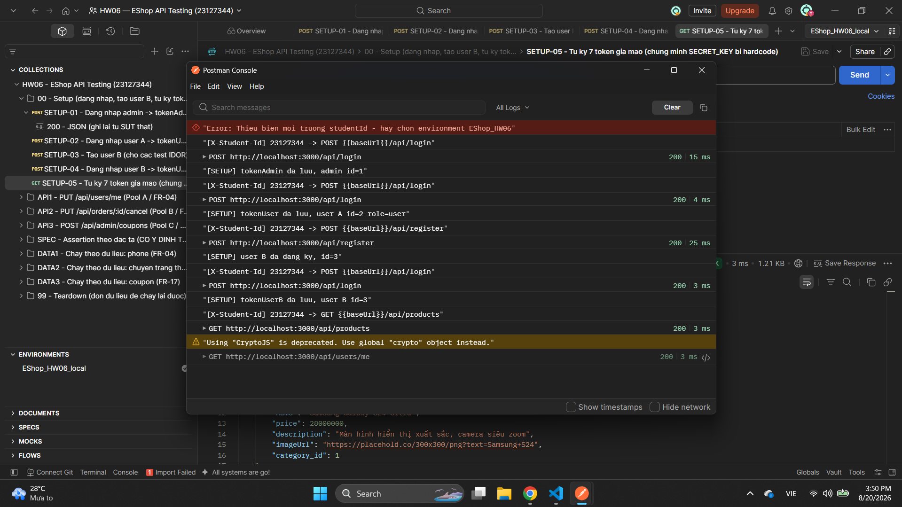

Ảnh này chụp sau khi chạy `SETUP-01` → `SETUP-05`. Ba điều đọc được trong cùng một khung:

1. **Năm dòng `[X-Student-Id] 23127344 -> …`** — mỗi request một dòng, do pre-request script cấp collection in ra.
2. **Dòng ngay dưới mỗi dòng đó là URL đã phân giải**: `POST http://localhost:3000/api/login` → chứng minh hostname `localhost`. Dòng log in ra `{{baseUrl}}` vì pre-request script chạy **trước** khi Postman phân giải biến; hai dòng đi liền nhau nên vẫn khớp được với nhau.
3. **Cây collection 9 folder + environment `EShop_HW06_local`** ở hai bên, và **`[SETUP] tokenAdmin da luu, admin id=1`** — chứng minh script Setup thật sự ghi biến.

Hai chi tiết trong ảnh tôi chủ động giữ lại thay vì xoá đi:

- **Dòng đỏ ở đầu console** — `Error: Thieu bien moi truong studentId - hay chon environment EShop_HW06` — là của lần tôi bấm Send **trước khi** chọn environment. Nó cho thấy câu `throw` bảo vệ trong pre-request script hoạt động: không có `studentId` thì request không được gửi đi, chứ không âm thầm gửi thiếu header.
- **Cảnh báo vàng** `Using "CryptoJS" is deprecated. Use global "crypto" object instead.` — sandbox của Postman đang khuyến nghị chuyển sang `crypto`. `CryptoJS` vẫn chạy (7 token giả mạo ký thành công, xem `SETUP-05`), nên tôi không đổi giữa lúc bộ test đã chạy xanh và đã qua CI; nếu làm tiếp thì đây là chỗ nên sửa.

---

## 3. Phương pháp làm việc với AI

> ✍️ Đề cấm dùng một prompt chung chung. Bảng này để chứng minh đã dẫn dắt AI qua **từng bước** của kỹ thuật kiểm thử.

| Bước | Mục tiêu kỹ thuật                                         | Prompt (tóm tắt)                                                                                            | Đầu ra AI                                                                 | Tôi đã chỉnh gì       |
| ---- | --------------------------------------------------------- | ----------------------------------------------------------------------------------------------------------- | ------------------------------------------------------------------------- | --------------------- |
| P3   | Phân tích hợp đồng API (đối chiếu `api_specification.md`) | Trích method/endpoint/header/body/status/response cho từng API; tách rõ "đã đặc tả" vs "suy ra từ mã nguồn" | Bảng hợp đồng API 1–3 (dùng ở §4.0/§5.0/§6.0)                             | «xem AI Audit Report» |
| P4   | Phân tích mã nguồn SUT (`server.js`, `database.js`)       | Trace từng handler dòng-theo-dòng, đối chiếu P3                                                             | Sai lệch spec-vs-code (vd: `role` bị ghi đè, `phone` không được validate) | «»                    |
| P5   | Phân vùng miền giá trị (EP) từng tham số                  | Liệt kê lớp hợp lệ/không hợp lệ mỗi field, tách "theo đặc tả" vs "theo mã nguồn"                            | Bảng EP đầy đủ cho 3 API                                                  | «»                    |
| P6   | Phân tích giá trị biên (BVA)                              | Áp dụng biên min−1/min/min+1/max−1/max/max+1 cho ràng buộc trong P5                                         | Bảng biên (`phone`, `discount_value`, `max_uses_per_user`…)               | «»                    |
| P7   | Chuyển trạng thái (FR-10)                                 | Xây mô hình trạng thái đơn hàng từ đặc tả + mã nguồn, không giả định trạng thái vô căn cứ                   | Bảng chuyển trạng thái hợp lệ/không hợp lệ (dùng ở §5)                    | «»                    |
| P8   | Bảo mật SEC-01 … SEC-07                                   | Ánh xạ từng SEC-0x vào 3 API, chỉ giữ yêu cầu thực sự áp dụng                                               | Ma trận bảo mật theo API (dùng ở §6.9)                                    | «»                    |
| P9   | Kiểm tra schema response                                  | Trích schema response 2xx/lỗi từ mã nguồn (không có trong đặc tả)                                           | Bảng schema theo status code                                              | «»                    |
| P10  | Ma trận phủ kiểm thử (Coverage Matrix)                    | Tổng hợp P5–P9 thành Coverage ID, xác định số TC tối thiểu                                                  | Ma trận Coverage ID + kế hoạch phân bổ TC theo kỹ thuật                   | «»                    |
| P11  | Sinh test case bằng AI                                    | Sinh ≥35 TC/API, mỗi TC truy vết Coverage ID (P10)                                                          | 167 TC cho 3 API (42+43+82) — chi tiết ở §4.1/§5.1/§6.1                   | «»                    |

**Toàn văn prompt & output:** Phụ lục A (AI Audit Report).

---

## 4. API 1 — `PUT /api/users/me` (FR-04)

> ✍️ **Sao chép nguyên khối §4 này cho API 2 (§5) và API 3 (§6).** Cấu trúc 5 bước bám đúng §6 của đề: sinh → kiểm toán → mở rộng → thực thi → lỗi.

### 4.0 Đặc tả tóm tắt

| Thuộc tính   | Giá trị                                                                                                                                                                                                                                                                                                                                                          |
| ------------ | ---------------------------------------------------------------------------------------------------------------------------------------------------------------------------------------------------------------------------------------------------------------------------------------------------------------------------------------------------------------- |
| Endpoint     | `PUT /api/users/me` (verify bằng `GET /api/users/me`)                                                                                                                                                                                                                                                                                                            |
| Pool / FR    | A / FR-04 — Quản lý thông tin cá nhân                                                                                                                                                                                                                                                                                                                            |
| Auth         | Bearer JWT (user) — `authenticateToken`, `server.js:100-110`                                                                                                                                                                                                                                                                                                     |
| Request body | `name` (string), `shipping_address` (string), `phone` (string) — theo `api_specification.md §2.2`. Trường `role` **không được đặc tả** nhưng mã nguồn vẫn đọc/ghi nếu truthy (`server.js:119,124-127`) — vi phạm SEC-06                                                                                                                                          |
| Response 2xx | `200` — `{"message":"Profile updated"}` (không đặc tả trong `api_specification.md`; suy từ `server.js:133`)                                                                                                                                                                                                                                                      |
| Mã lỗi       | **Từ handler (JSON):** `401` `{"error":"Unauthorized"}` · `403` `{"error":"Forbidden"}` · `500` `{"error":"<sqlite message>"}` — không có 400/404 vì không có validation/existence check.<br>**Từ middleware `bodyParser` (HTML, không phải JSON):** `400` khi JSON sai cú pháp · `500` khi thiếu body — phát hiện khi probe ở Bước 2, xem §4.2 và TC A1-E01/E02 |
| Yêu cầu SEC  | SEC-02 (JWT hợp lệ — có, nhưng secret hardcode `server.js:9`, token không hết hạn) · **SEC-06 (vi phạm — `role` bị client ghi đè)** · SEC-05 (parameterized query — đạt) · SEC-01 (không áp dụng trực tiếp cho PUT, nhưng `GET /api/users/me` lộ `password`/`reset_token` dạng plaintext)                                                                        |

**Bảng tham số & phân vùng miền giá trị** _(rút gọn từ P5/P6; chi tiết đầy đủ nằm ở `testcases/HW06_TestCases_23127344.xlsx`)_

| Tham số            | Kiểu                  | Ràng buộc                                                                 | Phân vùng hợp lệ                            | Phân vùng không hợp lệ                                      | Giá trị biên                                       |
| ------------------ | --------------------- | ------------------------------------------------------------------------- | ------------------------------------------- | ----------------------------------------------------------- | -------------------------------------------------- |
| `name`             | string                | Không đặc tả (không bắt buộc/độ dài)                                      | Chuỗi bất kỳ                                | rỗng/null/sai kiểu (đều được chấp nhận — không validate)    | Không áp dụng                                      |
| `shipping_address` | string                | Không đặc tả                                                              | Chuỗi bất kỳ                                | rỗng/null/sai kiểu (đều được chấp nhận)                     | Không áp dụng                                      |
| `phone`            | string                | FR-04: bắt đầu `0`, 10–11 chữ số (**không được thực thi trong mã nguồn**) | `0912345678` (10 số), `09123456789` (11 số) | Sai định dạng — **vẫn được chấp nhận**                      | 9/10/11/12 chữ số; ký tự đầu `0` vs khác `0`       |
| `role`             | string (không đặc tả) | SEC-06: cấm client thay đổi                                               | (không nên gửi trường này)                  | `"admin"`, `"user"`, `"superadmin"` — **đều bị ghi vào DB** | số `0` (bị bỏ qua) vs chuỗi `"0"` (**vẫn bị ghi**) |

### 4.1 Bước 1 — Sinh test case bằng AI

**Mục tiêu ≥ 35 test case.** Số thực tế AI sinh: **42**.

| Nhóm kỹ thuật          | Số TC | Ghi chú                                                                                                               |
| ---------------------- | :---: | --------------------------------------------------------------------------------------------------------------------- |
| Phân vùng miền giá trị |  14   | `name`/`shipping_address`/`phone`/`role` (thiếu/rỗng/sai kiểu), body combo                                            |
| Giá trị biên           |   8   | Độ dài `phone` (9/10/11/12 số), ký tự đầu `phone`, header 2-khoảng-trắng, `role` số `0` vs chuỗi `"0"`                |
| Chuyển trạng thái      |   0   | **P7 kết luận: không áp dụng** — endpoint này không có máy trạng thái ý nghĩa (không phải thiếu sót)                  |
| Bảo mật (SEC-01…07)    |  10   | Auth bypass (401/403/token giả mạo), leo thang quyền `role` (SEC-06), SQLi/XSS payload                                |
| Kiểm tra schema        |   6   | Response 2xx/401/403, schema `GET /api/users/me`, kiểm tra không lộ trường bị ghi đè                                  |
| Quy tắc nghiệp vụ khác |   4   | Ngữ nghĩa ghi-đè-toàn-bộ (full-replace), scheme header không chuẩn, header rỗng, phân kỳ token/DB sau leo thang quyền |
| **Tổng**               |  42   | ≥ 35 theo yêu cầu đề bài                                                                                              |

**Tiền điều kiện chung cho mọi TC của API 1.** SUT chạy tại `http://localhost:3000`, DB vừa seed lại (`node database.js` → `node server.js`) nên `test@eshop.com` / `Test1234!` là user `id=2`, `role="user"`. `{{token}}` = token lấy từ `POST /api/login` của user này, dùng lại cho mọi TC trừ khi TC ghi khác. Mọi TC ghi dữ liệu đều verify lại bằng `GET /api/users/me`.

**Bảng test case đầy đủ — 42 TC** _(ID `TC-API1-001`…`TC-API1-042`; đây là danh sách chuẩn — khi xuất sang `testcases/HW06_TestCases_23127344.xlsx` phải giữ nguyên ID để bảo toàn truy vết)_

| ID              | Tiêu đề                                               | Kỹ thuật                     | Truy vết (Coverage / FR / SEC)      | Input / Precondition riêng                                                     | Expected (status + body)                                                                            | Nguồn           |
| --------------- | ----------------------------------------------------- | ---------------------------- | ----------------------------------- | ------------------------------------------------------------------------------ | --------------------------------------------------------------------------------------------------- | --------------- |
| TC-API1-001     | Cập nhật hồ sơ hợp lệ (happy path)                    | EP                           | COV-001,047 · FR-04 §2.2            | `{"name":"Nguyen Van A","shipping_address":"123 Le Loi","phone":"0912345678"}` | 200 · `{"message":"Profile updated"}`                                                               | AI              |
| TC-API1-002     | Thiếu trường `name`                                   | EP                           | COV-013 · FR-04                     | Body không có key `name`                                                       | 200 · `{"message":"Profile updated"}` (không có validate)                                           | AI              |
| TC-API1-003     | `name` là chuỗi rỗng                                  | EP                           | COV-014 · (không đặc tả)            | `name:""`                                                                      | 200 · `{"message":"Profile updated"}`                                                               | AI              |
| TC-API1-004     | `name` sai kiểu (number)                              | EP                           | COV-016 · (không đặc tả)            | `name:12345`                                                                   | `200` · `{"message":"Profile updated"}`; `GET` trả `name="12345"` (**chuỗi** — TEXT affinity ép số) | AI · **đã sửa** |
| TC-API1-005     | Thiếu trường `shipping_address`                       | EP                           | COV-022 · FR-04                     | Body không có key `shipping_address`                                           | 200 · `{"message":"Profile updated"}`                                                               | AI              |
| TC-API1-006     | `shipping_address` sai kiểu (object)                  | EP                           | COV-025 · (không đặc tả)            | `shipping_address:{"street":"123 Le Loi"}`                                     | `200`; `GET` trả `shipping_address="[object Object]"` — **hỏng dữ liệu thầm lặng**                  | AI · **đã sửa** |
| TC-API1-007     | Gửi key camelCase `shippingAddress` — bị bỏ qua       | EP                           | COV-028 · (BUG-D3 nhóm đã ghi nhận) | `shippingAddress:"789 Nguyen Hue"`                                             | 200, `GET` cho thấy `shipping_address` **không** đổi                                                | AI              |
| TC-API1-008     | Thiếu trường `phone`                                  | EP                           | COV-037 · FR-04                     | Body không có key `phone`                                                      | 200 · `{"message":"Profile updated"}`                                                               | AI              |
| TC-API1-009     | `phone` chứa ký tự không phải số                      | EP                           | COV-034 · FR-04 (không thực thi)    | `phone:"0912-345-678"`                                                         | 200 (kỳ vọng đặc tả: từ chối)                                                                       | AI              |
| TC-API1-010     | `phone` gửi dưới dạng JSON number                     | EP                           | COV-038 · FR-04                     | `phone:912345678` (number)                                                     | 200 — kiểu số không thể giữ số `0` đầu                                                              | AI              |
| TC-API1-011     | `phone` khớp regex client web nhưng trái FR-04        | EP                           | COV-039 · xung đột 2 oracle         | `phone:"912345678"` (9 số, không có `0` đầu)                                   | 200 — chứng minh cả 2 luật đều không được backend thực thi                                          | AI              |
| TC-API1-012     | Không gửi `role` (baseline đối chiếu)                 | EP                           | COV-041 · SEC-06                    | 3 trường hợp lệ, không có `role`                                               | 200, `GET` cho thấy `role` vẫn `"user"`                                                             | AI              |
| TC-API1-013     | Trường lạ không được nhận diện bị bỏ qua              | EP                           | COV-051 · §2.2                      | `{...,"foo":"bar"}`                                                            | 200, `foo` không có tác dụng                                                                        | AI              |
| TC-API1-014     | `name`/`địa chỉ` hợp lệ + `phone` sai định dạng       | EP                           | COV-052 · FR-04                     | `phone:"abc"`, 2 trường kia hợp lệ                                             | 200 — luật phone không được thực thi kể cả trong ngữ cảnh hỗn hợp                                   | AI              |
| TC-API1-015     | `phone` 9 chữ số (biên min−1)                         | BVA                          | COV-032 · FR-04                     | `phone:"091234567"`                                                            | 200 (kỳ vọng đặc tả: từ chối)                                                                       | AI              |
| TC-API1-016     | `phone` 10 chữ số (biên min)                          | BVA                          | COV-029 · FR-04                     | `phone:"0912345678"`                                                           | 200 · hợp lệ theo cả đặc tả lẫn mã nguồn                                                            | AI              |
| TC-API1-017     | `phone` 11 chữ số (biên max)                          | BVA                          | COV-030 · FR-04                     | `phone:"09123456789"`                                                          | 200 · hợp lệ theo cả đặc tả lẫn mã nguồn                                                            | AI              |
| TC-API1-018     | `phone` 12 chữ số (biên max+1)                        | BVA                          | COV-033 · FR-04                     | `phone:"091234567890"`                                                         | 200 (kỳ vọng đặc tả: từ chối)                                                                       | AI              |
| TC-API1-019     | `phone` đúng độ dài nhưng không bắt đầu bằng `0`      | BVA                          | COV-031,040 · FR-04                 | `phone:"1912345678"`                                                           | 200 (kỳ vọng đặc tả: từ chối)                                                                       | AI              |
| TC-API1-020     | Header `Authorization` có 2 dấu cách liên tiếp        | BVA                          | COV-011 · (chỉ có ở mã nguồn)       | `Authorization: Bearer  {{token}}`                                             | **403** `{"error":"Forbidden"}` — **không phải 401**                                                | AI              |
| TC-API1-021     | `role` là số `0` (falsy) — không ghi                  | BVA                          | COV-042,046 · SEC-06                | `role:0`                                                                       | 200, `GET` cho thấy `role` vẫn `"user"`                                                             | AI              |
| TC-API1-022     | `role` là chuỗi `"0"` (truthy) — **bị ghi**           | BVA + Security               | COV-046 · SEC-06                    | `role:"0"`                                                                     | 200, `GET` cho thấy `role` = `"0"`                                                                  | AI              |
| TC-API1-023     | Không gửi header `Authorization`                      | Security                     | COV-003 · SEC-02                    | (bỏ header)                                                                    | 401 · `{"error":"Unauthorized"}`                                                                    | AI              |
| TC-API1-024     | Header không có dấu cách phân tách                    | Security                     | COV-005 · SEC-02                    | `Authorization: SomeGarbageWithNoSpace`                                        | 401 · `{"error":"Unauthorized"}`                                                                    | AI              |
| TC-API1-025     | JWT sai cú pháp                                       | Security                     | COV-007 · SEC-02                    | `Authorization: Bearer not-a-valid-jwt`                                        | 403 · `{"error":"Forbidden"}`                                                                       | AI              |
| TC-API1-026     | JWT ký bằng secret khác                               | Security                     | COV-008 · SEC-02                    | Token ký bằng khoá sai                                                         | 403 · `{"error":"Forbidden"}`                                                                       | AI              |
| TC-API1-027     | Token giả mạo có `exp` quá khứ                        | Security                     | COV-009 · SEC-02                    | Token tự ký bằng `SECRET_KEY` lộ, `exp` ở quá khứ                              | 403 · `{"error":"Forbidden"}`                                                                       | AI              |
| TC-API1-028     | Token hợp lệ nhưng `id` không tồn tại                 | Security                     | COV-010 · (không đặc tả)            | Token tự ký `{id:999999}`                                                      | 200 dù 0 dòng bị cập nhật (`this.changes` không kiểm)                                               | AI              |
| TC-API1-029     | **[CRITICAL]** Leo thang quyền qua `role:"admin"`     | Security                     | COV-043,061 · **SEC-06**, FR-04     | `{...,"role":"admin"}`                                                         | 200, `GET` cho thấy `role="admin"` — **vi phạm SEC-06**                                             | AI              |
| TC-API1-030     | `role` ngoài enum (`"superadmin"`)                    | Security                     | COV-045 · SEC-06                    | `role:"superadmin"`                                                            | 200, lưu nguyên văn — không có enum check                                                           | AI              |
| TC-API1-031     | Payload SQL injection trong `name`                    | Security                     | COV-019,060 · SEC-05                | `name:"Robert'); DROP TABLE users;--"`                                         | 200 · lưu như chuỗi literal, bảng `users` còn nguyên                                                | AI              |
| TC-API1-032     | Payload script/XSS trong `name`                       | Security                     | COV-018,059 · SEC-04                | `name:"<script>alert(1)</script>"`                                             | 200 · `GET` trả về nguyên văn (chỉ kiểm lưu/phản hồi, không kiểm render)                            | AI              |
| TC-API1-033     | Schema response thành công                            | Schema                       | COV-063                             | Body hợp lệ                                                                    | 200 · đúng 1 key `message`, không dư trường                                                         | AI              |
| ~~TC-API1-034~~ | Schema lỗi 401 — **đã gộp vào TC-API1-023**           | Schema                       | COV-064                             | —                                                                              | (2 assertion của TC-023: status + schema)                                                           | AI · **đã gộp** |
| TC-API1-035     | Schema lỗi 403                                        | Schema                       | COV-065                             | Token sai cú pháp                                                              | 403 · đúng 1 key `error` = `"Forbidden"`                                                            | AI              |
| TC-API1-036     | Schema xác minh của `GET /api/users/me`               | Schema                       | COV-067 · (endpoint hỗ trợ)         | — (GET)                                                                        | 200 · đủ 10 trường theo `database.js:50-61`                                                         | AI              |
| TC-API1-037     | Response `PUT` không echo trường nào đã ghi           | Schema                       | COV-068                             | `name:"Distinctive Test Name XYZ"`                                             | 200 · body **không** chứa giá trị vừa gửi                                                           | AI              |
| TC-API1-038     | `GET /api/users/me` lộ `password` plaintext           | Schema + Security            | COV-056 · SEC-01 (liên đới)         | — (GET)                                                                        | 200 · body chứa `"password":"Test1234!"`                                                            | AI              |
| TC-API1-039     | Ngữ nghĩa ghi-đè-toàn-bộ: bỏ trường sẽ xoá giá trị cũ | Quy tắc nghiệp vụ            | COV-069 · FR-04 (suy từ mã nguồn)   | B1 đặt `shipping_address` giá trị riêng; B2 gửi PUT không kèm trường này       | 200, `GET` cho thấy giá trị cũ **đã mất**                                                           | AI              |
| TC-API1-040     | Scheme header không chuẩn vẫn được chấp nhận          | Quy tắc nghiệp vụ            | COV-006 · §2 (đặc tả ghi `Bearer`)  | `Authorization: Basic {{token}}`                                               | 200 — scheme không được kiểm                                                                        | AI              |
| TC-API1-041     | Header `Authorization` rỗng → 403 (không phải 401)    | Quy tắc nghiệp vụ            | COV-004 · (chỉ có ở mã nguồn)       | `Authorization: ` (rỗng)                                                       | 403 · `{"error":"Forbidden"}` — vì `"" == null` là false                                            | AI              |
| TC-API1-042     | Token mang claim `role` cũ sau khi leo thang          | Quy tắc nghiệp vụ + Security | COV-070 · SEC-06                    | Chạy sau TC-029, dùng lại đúng token cũ                                        | `GET` cho `role="admin"` nhưng payload JWT vẫn `role="user"`                                        | AI              |

> **Trạng thái sau Bước 2 (kiểm toán).** `TC-API1-004`, `-006` **đã chốt expected bằng probe thật** (xem §4.2). `-020`, `-041` đã xác nhận đúng khi chạy (403, không phải 401). `-034` đã gộp vào `-023`. Còn lại `-027`, `-028`, `-042` cần pre-request script tự ký JWT — sẽ chốt ở Bước 4.

### 4.2 Bước 2 — Kiểm toán (rà soát của con người)

**Cách tôi kiểm toán.** Tôi không gán nhãn bằng cách đọc lướt. Với 42 TC của API 1, tôi làm ba việc: (1) đối chiếu từng `Expected` với `backend/server.js` ở đúng dòng xử lý; (2) **dựng SUT lên chạy thật** để chốt các TC mà AI để expected ở dạng "chưa xác nhận" — vì một test case không có kết quả mong đợi quyết định được thì không thể pass/fail, tức là chưa dùng được; (3) đối chiếu chéo với `README.md` (FR-04, SEC-06) xem nhãn kỹ thuật AI gán có đúng không.

Môi trường probe: `node database.js` → `node server.js` trên `localhost:3000`, DB seed sạch, tài khoản `test@eshop.com` (id=2).

| Nhãn       | Số TC  | Tỉ lệ |
| ---------- | :----: | :---: |
| VALID      |   31   | 73.8% |
| INVALID    |   2    | 4.8%  |
| INCOMPLETE |   9    | 21.4% |
| **Tổng**   | **42** | 100%  |

**Chi tiết các test case KHÔNG đạt**

| ID          | Nhãn        | AI viết gì                             | Vì sao sai / thiếu (dẫn chứng)                                                                                                                                                                                                                                                                                                   | Tôi sửa thành                                                                                                             |
| ----------- | ----------- | -------------------------------------- | -------------------------------------------------------------------------------------------------------------------------------------------------------------------------------------------------------------------------------------------------------------------------------------------------------------------------------- | ------------------------------------------------------------------------------------------------------------------------- |
| TC-API1-004 | **INVALID** | Expected: `200 **hoặc** 500`           | Một TC có hai kết quả mong đợi loại trừ nhau thì không thể đánh giá pass/fail — vi phạm nguyên tắc cơ bản của test case. AI viết vậy vì không suy được hành vi bind kiểu của `sqlite3` chỉ từ `server.js:122`. **Tôi chạy thật:** `name:12345` → `200`, và `GET` trả về `name:"12345"` — SQLite TEXT affinity ép số thành chuỗi. | Expected: `200` · `{"message":"Profile updated"}`; thêm assertion `GET` trả `name === "12345"` (kiểu string)              |
| TC-API1-006 | **INVALID** | Expected: `200 **hoặc** 500`           | Cùng lỗi trên. **Tôi chạy thật:** `shipping_address:{"street":"x"}` → `200`, lưu thành chuỗi **`"[object Object]"`**. Đây là hỏng dữ liệu thầm lặng, đáng giá hơn hẳn cái expected mơ hồ ban đầu.                                                                                                                                | Expected: `200`; assertion `GET` trả `shipping_address === "[object Object]"` — ghi nhận là lỗi mất dữ liệu               |
| TC-API1-002 | INCOMPLETE  | Chỉ kiểm `200` khi bỏ trường `name`    | Không assert điều quan trọng nhất: `server.js:121-122` ghi `name` **vô điều kiện**, nên bỏ trường sẽ **ghi đè** giá trị cũ chứ không giữ nguyên. TC như AI viết vẫn pass kể cả khi SUT hành xử đúng lẫn sai.                                                                                                                     | Thêm bước `GET` trước/sau, assert `name` đã bị thay đổi                                                                   |
| TC-API1-005 | INCOMPLETE  | Tương tự với `shipping_address`        | Cùng lý do                                                                                                                                                                                                                                                                                                                       | Thêm assertion so sánh trước/sau                                                                                          |
| TC-API1-008 | INCOMPLETE  | Tương tự với `phone`                   | Cùng lý do                                                                                                                                                                                                                                                                                                                       | Thêm assertion so sánh trước/sau                                                                                          |
| TC-API1-027 | INCOMPLETE  | Token giả mạo `exp` quá khứ → 403      | Thiếu tiền điều kiện _cách tạo token_. `server.js:51` ký token **không** có `expiresIn`, nên trạng thái "token hết hạn" **không tồn tại** trong luồng đăng nhập bình thường — bắt buộc phải tự ký bằng `SECRET_KEY` ở `server.js:9`. AI không ghi rõ điều này.                                                                   | Thêm pre-request script tạo token có `exp` quá khứ; ghi rõ đây là trạng thái chỉ tới được bằng giả mạo                    |
| TC-API1-028 | INCOMPLETE  | Token `id=999999` → 200                | Thiếu bước chứng minh **0 dòng bị ghi**. Đúng ra phải chỉ ra `server.js:131-134` không kiểm `this.changes`, nên 200 ở đây không đồng nghĩa với "đã cập nhật".                                                                                                                                                                    | Thêm assertion: `GET` bằng token user thật cho thấy hồ sơ **không** đổi                                                   |
| TC-API1-034 | INCOMPLETE  | Schema 401 — request y hệt TC-API1-023 | Cùng một request, cùng expected, chỉ khác nhãn kỹ thuật. Trong Postman đây là **một** request với hai assertion, không phải hai TC.                                                                                                                                                                                              | Gộp vào TC-API1-023, giữ 2 assertion (status + schema)                                                                    |
| TC-API1-038 | INCOMPLETE  | Assert `password === "Test1234!"`      | Hard-code mật khẩu seed. Nếu chạy sau bất kỳ TC nào của FR-03 (reset password) thì giá trị đổi, TC fail sai.                                                                                                                                                                                                                     | Đổi thành assert **trường `password` tồn tại trong response** — đó mới là điều SEC-01 quan tâm, không phải giá trị cụ thể |
| TC-API1-039 | INCOMPLETE  | Mô tả 2 bước trong 1 dòng              | Không tách rõ setup và assert; Newman cần 2 request riêng                                                                                                                                                                                                                                                                        | Tách thành 2 request nối bằng `postman.setNextRequest`                                                                    |
| TC-API1-042 | INCOMPLETE  | So claim `role` trong token với DB     | Không phải assertion HTTP thuần — phải giải mã payload JWT                                                                                                                                                                                                                                                                       | Ghi rõ dùng test script `atob(token.split('.')[1])` để đọc claim                                                          |

**Tôi cũng sửa một lỗi trong chính §4.0 do kiểm toán phát hiện.** §4.0 ban đầu tôi ghi _"không có 400/404"_. Khi probe tôi thấy **JSON sai cú pháp trả `400`** và **không gửi body trả `500`**, cả hai đều là **trang HTML** của Express chứ không phải `{"error":...}`. Nguyên nhân: hai nhánh này phát sinh ở `bodyParser.json()` (`server.js:12`) **trước khi** vào handler, nên đọc handler không thể thấy. Đã sửa §4.0 và bổ sung thành 2 TC ở Bước 3.

**Nhận xét kiểm toán.** Sai sót của AI đi theo hai khuôn rõ rệt. Thứ nhất — và nguy hiểm nhất — là **né tránh kết luận**: khi không suy được hành vi từ mã nguồn tĩnh, AI viết expected kiểu "200 hoặc 500" thay vì nói thẳng "cần chạy thử". Hai TC như vậy trông đầy đủ nhưng thực chất không kiểm được gì. Thứ hai là **assert nông**: nhiều TC (002, 005, 008, 028) chỉ kiểm status code mà bỏ qua đúng thứ cần kiểm là _dữ liệu sau khi ghi_ — mà với endpoint này, `PUT` không echo lại gì nên status code gần như vô nghĩa nếu không có `GET` đi kèm. Đáng chú ý là các nhóm AI làm **tốt**: toàn bộ 8 TC biên `phone` và 4 TC ranh giới truthy `role` đều đúng khi tôi probe lại — AI mạnh ở chỗ suy diễn có luật rõ ràng, yếu ở chỗ phải quyết định khi thiếu thông tin.

### 4.3 Bước 3 — Mở rộng (≥ 5 test case tự nghĩ)

| ID         | Tiêu đề                                                                   | Kỹ thuật / SEC  | Input                                                                                           | Expected                                                                          | **Vì sao AI bỏ sót**                                                                                                                                                                                                                                                                                                                                                   |
| ---------- | ------------------------------------------------------------------------- | --------------- | ----------------------------------------------------------------------------------------------- | --------------------------------------------------------------------------------- | ---------------------------------------------------------------------------------------------------------------------------------------------------------------------------------------------------------------------------------------------------------------------------------------------------------------------------------------------------------------------- |
| **A1-E01** | JSON sai cú pháp trả `400` **dạng HTML**, không phải JSON                 | Schema          | `PUT` với body `{"name":"A",` (cụt), `Content-Type: application/json`                           | `400` · body là trang HTML `<!DOCTYPE html>`, **không** có key `error`            | **Hạn chế của mô hình.** AI trace từ `app.put` (`server.js:118`) xuống, nên chỉ thấy các nhánh _bên trong_ handler và kết luận "không có 400". Nó không xét `bodyParser.json()` ở `server.js:12` — middleware chạy **trước** handler và tự sinh 400. Đây là điểm mù của lối đọc code từ điểm vào cục bộ.                                                               |
| **A1-E02** | Không gửi body trả `500` **dạng HTML**                                    | Schema          | `PUT` không body, không `Content-Type`                                                          | `500` · trang HTML, **không** có key `error`                                      | **Hạn chế của mô hình.** Cùng gốc với E01. AI có nêu nghi vấn "destructure `req.body` không có guard" ở P4 nhưng **không dám chốt**, nên không sinh TC. Tôi chạy thật thì `req.body` là `undefined` → `TypeError` ở `server.js:119` → Express trả 500 HTML. Hệ quả nghiêm trọng: client parse JSON sẽ crash.                                                           |
| **A1-E03** | Mạo danh **id có thật** của người khác để sửa hồ sơ họ                    | SEC-02 / IDOR   | Token tự ký `{id:1,role:"user"}` (id 1 = admin thật), body đổi `name`                           | `200`, hồ sơ **admin** bị sửa bởi người không phải admin                          | **Đặc điểm riêng của API.** AI kết luận đúng rằng endpoint "không có kênh IDOR" vì `WHERE id = req.user.id` lấy từ token. Nhưng nó coi token là **bất khả xâm phạm**, trong khi `SECRET_KEY` nằm ngay trong repo (`server.js:9`). AI có sinh TC-028 (id **không tồn tại**) mà không sinh TC mạo danh id **có thật** — đúng ra mới là kịch bản gây hại.                 |
| **A1-E04** | Chuỗi leo thang **đầy đủ**: nâng quyền → đăng nhập lại → dùng quyền admin | SEC-06 → SEC-03 | (1) `PUT` `role:"admin"` · (2) `POST /api/login` lấy token mới · (3) gọi `GET /api/admin/users` | Bước 3 trả `200` — leo thang **có hiệu lực thật**, không chỉ đổi giá trị trong DB | **Chất lượng prompt.** Tôi yêu cầu AI phân tích _từng API riêng lẻ_, nên nó dừng ở "role đổi được" (TC-029) và ghi nhận token cũ còn stale (TC-042) — rồi kết luận hệ quả "chỉ tiềm ẩn". Nó không tự bắc cầu sang bước đăng nhập lại vì tôi chưa bao giờ yêu cầu nối chuỗi liên-API.                                                                                   |
| **A1-E05** | Kiểm chứng **động** rằng `email` thật sự không sửa được                   | FR-04           | `PUT` body kèm `"email":"hacker@evil.com"`                                                      | `200`, `GET` cho thấy `email` **vẫn là** `test@eshop.com`                         | **Hạn chế của mô hình.** AI kết luận `email` an toàn "by construction" vì không nằm trong danh sách destructure ở `server.js:119` — một suy luận **tĩnh** rồi coi như xong. Nhưng FR-04 nêu ràng buộc này rõ ràng, mà ràng buộc đã nêu thì phải có TC chứng minh, không được suy luận thay. Đây là loại giả định "chắc chắn đúng nên khỏi test" mà con người phải bắt. |

| Nguyên nhân bỏ sót     | Số TC | Diễn giải                                                                                                                             |
| ---------------------- | :---: | ------------------------------------------------------------------------------------------------------------------------------------- |
| Chất lượng prompt      |   1   | A1-E04 — tôi ra lệnh phân tích từng API tách biệt nên AI không nối chuỗi hệ quả liên-API. Lỗi của tôi, không phải của AI.             |
| Hạn chế của mô hình    |   3   | A1-E01, A1-E02 (đọc code từ handler ra ngoài nên mù middleware), A1-E05 (dừng ở suy luận tĩnh, không chuyển thành TC)                 |
| Đặc điểm riêng của API |   1   | A1-E03 — bảo mật của endpoint này dựa **hoàn toàn** vào tính toàn vẹn của token; khi secret bị lộ thì kết luận "không có IDOR" sụp đổ |

### 4.4 Bước 4 — Thực thi (Postman + Newman)

**Cách tổ chức bộ chạy (áp cho cả 3 API).** Collection được **sinh ra từ mã** (`hw6/postman/src/*.js` → `node hw6/postman/src/build.js`) chứ không dựng tay trong GUI. Lý do: 195 test case × trung bình 3 assertion là quá nhiều để soát bằng mắt trong Postman, còn ở dạng mã thì mỗi test case là một khối 5–10 dòng đọc được, diff được, review được. File `.json` xuất ra vẫn import bình thường vào Postman.

Ba nguyên tắc tôi áp cho toàn bộ assertion:

1. **Header `X-Student-Id` do pre-request script cấp collection chèn** vào _mọi_ request bằng `pm.request.headers.upsert`, và một test script cấp collection **tự kiểm lại** header đó ở mọi request — nên số assertion luôn ≥ số request.
2. **Trong 3 folder API, assertion mã hoá HÀNH VI THỰC TẾ** đã probe được (characterization test). Nhờ vậy bộ test xanh và trở thành mốc hồi quy: bất kỳ thay đổi hành vi nào về sau cũng làm đỏ bộ test.
3. **Điều đặc tả yêu cầu nằm ở folder `SPEC` riêng**, nơi assertion viết theo FR/SEC và **có chủ đích thất bại**. Một bug chỉ thực sự được _báo cáo_ khi có một assertion nói rõ đặc tả đòi gì và assertion đó fail — xem §6.11.

| Hạng mục                      | Giá trị                                                                                                     |
| ----------------------------- | ----------------------------------------------------------------------------------------------------------- |
| Folder trong collection       | `API1 - PUT /api/users/me (Pool A / FR-04)`                                                                 |
| Số test case trong folder     | **46**                                                                                                      |
| Số HTTP call Newman thực hiện | **102** (gồm cả request phụ trợ do `pm.sendRequest` dựng trạng thái / đọc lại DB)                           |
| Số assertion                  | **224**                                                                                                     |
| Kết quả                       | **224 pass / 0 fail**                                                                                       |
| Thời gian chạy                | 4.4 giây                                                                                                    |
| Nguồn test case               | 42 TC do AI sinh (TC-034 đã gộp vào TC-023 theo kết luận kiểm toán) + 5 TC tự bổ sung = **46**              |
| Data file                     | `hw6/postman/data/api1_phone.csv` — 6 dòng, chạy riêng ở folder `DATA1` (6 iteration, 24 assertion, 0 fail) |

```bash
# reset DB rồi chạy đúng folder của API này (kèm Setup và Teardown)
node hw6/scripts/reset_db.js
newman run hw6/postman/EShop_HW06_API.postman_collection.json \
  -e hw6/postman/EShop_HW06.postman_environment.json \
  --folder "00 - Setup (dang nhap, tao user B, tu ky token gia mao)" \
  --folder "API1 - PUT /api/users/me (Pool A / FR-04)" \
  --folder "99 - Teardown (don du lieu de chay lai duoc)" \
  -r cli,htmlextra,json \
  --reporter-htmlextra-export hw6/reports/api1.html

# hoặc gọn hơn (script đã gói sẵn cả reset + 3 reporter):
bash hw6/scripts/run_newman.sh api1
```

|            | Executed | Passed | Failed |
| ---------- | :------: | :----: | :----: |
| Requests   |   102    |  102   |   0    |
| Assertions |   224    |  224   |   0    |

Báo cáo HTML: [`hw6/reports/api1.html`](./reports/api1.html) · log console: [`hw6/reports/newman_console_full.log`](./reports/newman_console_full.log) (3974 dòng, có 470 dòng `[X-Student-Id]`)

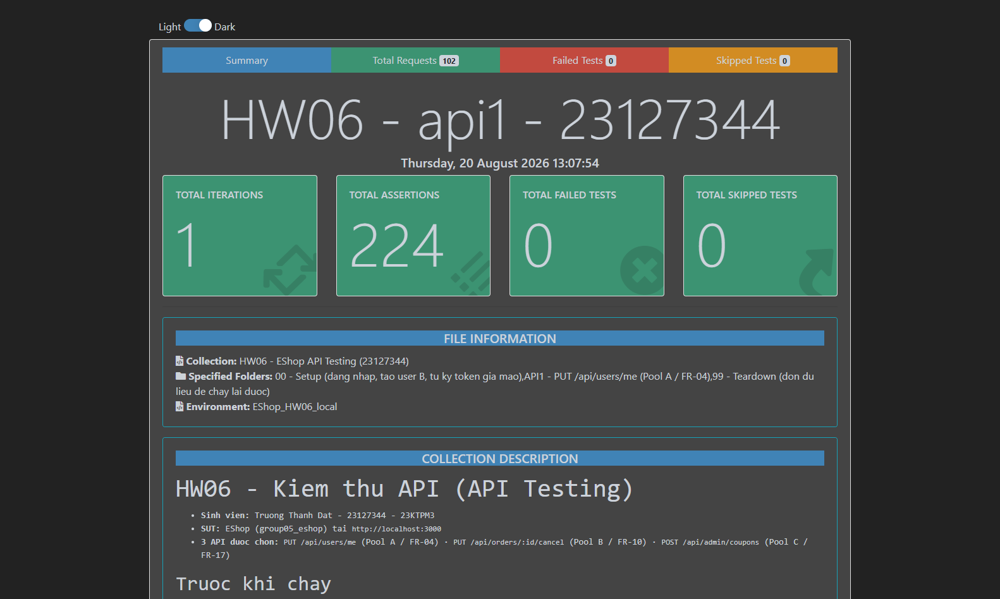
_Báo cáo htmlextra: tiêu đề mang MSSV, tổng assertion, **0 failed**, environment `EShop_HW06_local`._


_Cùng một khung ảnh có **cả hai** bằng chứng chống gian lận §11: `Request URL: http://localhost:3000/…` và dòng `X-Student-Id  23127344` trong bảng REQUEST HEADERS._

> **Ghi chú về cách dựng dữ liệu.** Các TC ghi `role` (TC-022, -029, -030, -042, A1-E04) đều **tự trả `role` về `"user"`** ngay trong cùng chuỗi callback của assertion, nên chạy lại suite nhiều lần vẫn cho kết quả như nhau. Ban đầu tôi tách phần dọn thành một `pm.test` riêng và **bị fail thật** — xem "Hai lỗi tôi tự gây ra" ở §7.8.

**Các assertion FAIL và diễn giải.** Trong folder này **không có assertion nào fail** — vì assertion ở đây mã hoá hành vi thực tế đã probe. Chỗ đặc tả bị vi phạm được phơi bày ở folder `SPEC`:

| ID (folder SPEC) | Assertion fail                                              | Actual                    | Expected (theo đặc tả) | Là bug SUT hay lỗi test? |
| ---------------- | ----------------------------------------------------------- | ------------------------- | ---------------------- | ------------------------ |
| `SPEC-BUG-01`    | role trong DB phải vẫn là `user` sau khi gửi `role:"admin"` | `admin`                   | `user` (SEC-06)        | **BUG-01 — SEC-06**      |
| `SPEC-BUG-02`    | response `GET /api/users/me` không được có key `password`   | có `password` plaintext   | không có (SEC-01)      | **BUG-02 — SEC-01**      |
| `SPEC-BUG-03`    | token tự ký mạo danh `id=1` phải bị từ chối 401/403         | `200`, hồ sơ admin bị sửa | `401`/`403` (SEC-02)   | **BUG-03 — SEC-02**      |
| `SPEC-BUG-04`    | `phone:"abc"` phải bị từ chối `400`                         | `200`, lưu nguyên `abc`   | `400` (FR-04)          | **BUG-04 — FR-04**       |
| `SPEC-BUG-05`    | `GET /api/admin/users` với token `role=user` phải trả `403` | `200`, trả danh sách user | `403` (SEC-03)         | **BUG-05 — SEC-03**      |

> **Điều chỉnh so với bản §4.1 ban đầu.** Khi viết assertion tôi phải probe lại `TC-API1-020` (header 2 dấu cách) vì lần probe đầu tôi tự viết sai script (tham số `token` ghi đè header thủ công) nên đo ra `500`. Probe đúng cho **`403`** — đúng như §4.1 đã ghi. Đây là lỗi của tôi, không phải của SUT hay của AI.

### 4.5 Bước 5 — Lỗi phát hiện được

| ID     | Tiêu đề                                            | Mức độ   | TC phát hiện  | AI có sinh TC này? | GitHub Issue                                                 |
| ------ | -------------------------------------------------- | -------- | ------------- | ------------------ | ------------------------------------------------------------ |
| BUG-01 | User tự nâng quyền lên admin qua PUT /api/users/me | Critical | `TC-API1-029` | Có                 | [#378](https://github.com/DuyITLOR/group05_eshop/issues/378) |
| BUG-02 | GET /api/users/me trả về password plaintext        | Critical | `TC-API1-038` | Có                 | [#379](https://github.com/DuyITLOR/group05_eshop/issues/379) |
| BUG-03 | Token tự ký bằng secret hardcode được chấp nhận    | Critical | `A1-E03`      | Không — tự bổ sung | [#380](https://github.com/DuyITLOR/group05_eshop/issues/380) |
| BUG-04 | phone không được validate ở backend                | Minor    | `TC-API1-014` | Có                 | [#381](https://github.com/DuyITLOR/group05_eshop/issues/381) |
| BUG-05 | GET /api/admin/users không kiểm role               | Critical | `A1-E04`      | Không — tự bổ sung | [#382](https://github.com/DuyITLOR/group05_eshop/issues/382) |

Mỗi issue có bước tái hiện `curl`, dẫn chiếu FR/SEC và dòng mã nguồn. Chi tiết đầy đủ ở §10.

---

## 5. API 2 — `PUT /api/orders/:id/cancel` (FR-10)

### 5.0 Đặc tả tóm tắt

| Thuộc tính   | Giá trị                                                                                                                                                                                                                                                                                  |
| ------------ | ---------------------------------------------------------------------------------------------------------------------------------------------------------------------------------------------------------------------------------------------------------------------------------------- |
| Endpoint     | `PUT /api/orders/:id/cancel`                                                                                                                                                                                                                                                             |
| Pool / FR    | B / FR-10 — Máy trạng thái đơn hàng / Hủy đơn                                                                                                                                                                                                                                            |
| Auth         | Bearer JWT (user) — `authenticateToken`, `server.js:100-110`                                                                                                                                                                                                                             |
| Request body | Không có (endpoint bỏ qua `req.body` hoàn toàn — `server.js:321-342`)                                                                                                                                                                                                                    |
| Tham số path | `:id` — không được validate định dạng/kiểu trong mã nguồn                                                                                                                                                                                                                                |
| Response 2xx | `200` — `{"message":"Order canceled successfully"}` (không đặc tả trong `api_specification.md §4.6`; suy từ `server.js:337`) — **không trả `id` hay `status` mới**, phải verify bằng `GET /api/orders/my-orders`                                                                         |
| Mã lỗi       | `401` `{"error":"Unauthorized"}` · `403` `{"error":"Forbidden"}` · `404` `{"error":"Order not found"}` (gộp 2 nguyên nhân: đơn không tồn tại VÀ đơn của người khác) · `400` `{"error":"Cannot cancel this order."}` (gộp `delivered` và `canceled`) — **không có 500** trên endpoint này |
| Yêu cầu SEC  | SEC-02 (JWT hợp lệ — có) · SEC-05 (parameterized query trên `:id` — đạt) · **Không có SEC ID nào đặt tên trực tiếp cho lỗ hổng phân quyền theo trạng thái `shipping`** — xem P7/P8                                                                                                       |

### 5.1 Bước 1 — Sinh test case bằng AI

**Mục tiêu ≥ 35 test case.** Số thực tế AI sinh: **43**.

| Nhóm kỹ thuật          | Số TC | Ghi chú                                                                                                       |
| ---------------------- | :---: | ------------------------------------------------------------------------------------------------------------- |
| Phân vùng miền giá trị |   7   | `:id` (không tồn tại, không phải số, âm, thập phân, ký tự lạ), body bị bỏ qua — `TC-API2-002`…`008`           |
| Giá trị biên           |   8   | `:id` biên cấu trúc (0/1/2), token giả mạo với `id` biên (0/1/2), header 2-khoảng-trắng                       |
| **Chuyển trạng thái**  | **9** | **Toàn bộ mô hình 5 trạng thái từ P7** — xem ma trận bên dưới                                                 |
| Bảo mật (SEC-01…07)    |  11   | Auth bypass, IDOR (đơn của người khác), admin không sở hữu vẫn bị chặn, SQLi trên `:id`, token giả mạo        |
| Kiểm tra schema        |   8   | Response 2xx/401/403/404/400, xác nhận không có 500, xác nhận trạng thái không xuất hiện trong response `PUT` |
| **Tổng**               |  43   | ≥ 35 theo yêu cầu đề bài                                                                                      |

**Tiền điều kiện chung cho mọi TC của API 2.** DB vừa seed lại (**không có đơn hàng nào được seed** — mọi đơn phải tạo bằng `POST /api/checkout`, luôn bắt đầu ở `pending`). **User A** = `test@eshop.com`/`Test1234!` (`id=2`) → `{{tokenA}}`. **User B** = tài khoản thứ hai đăng ký mới → `{{tokenB}}` (cần cho TC kiểm tra ownership). **Admin** = `admin@eshop.com`/`Admin123!` (`id=1`) → `{{tokenAdmin}}`, **chỉ dùng để dựng trạng thái** qua `PUT /api/admin/orders/:id/status`, không phải chủ thể kiểm thử trừ khi TC ghi rõ. Verify trạng thái sau mỗi lần hủy bằng `GET /api/orders/my-orders`.

**Bảng test case đầy đủ — 43 TC** _(ID `TC-API2-001`…`TC-API2-043`)_

| ID          | Tiêu đề                                                       | Kỹ thuật          | Truy vết (Coverage / FR / SEC)           | Input / Precondition riêng                                 | Expected (status + body)                                                             | Nguồn                        |
| ----------- | ------------------------------------------------------------- | ----------------- | ---------------------------------------- | ---------------------------------------------------------- | ------------------------------------------------------------------------------------ | ---------------------------- |
| TC-API2-001 | Hủy đơn `pending` (chuyển tiếp hợp lệ)                        | ST + EP           | COV-001,029 · FR-10                      | Đơn của user A, `status=pending`                           | 200 · `{"message":"Order canceled successfully"}`, `GET` → `status="canceled"`       | AI                           |
| TC-API2-002 | `:id` hợp lệ nhưng đơn không tồn tại                          | EP                | COV-013                                  | `:id=999999`                                               | 404 · `{"error":"Order not found"}`                                                  | AI                           |
| TC-API2-003 | `:id` không phải số                                           | EP                | COV-006                                  | `:id="abc"`                                                | `404` · `{"error":"Order not found"}`                                                | AI · **đã sửa**              |
| TC-API2-004 | `:id` là segment rỗng                                         | EP                | COV-007                                  | `/api/orders//cancel`                                      | `404` · body là **HTML** của Express (404 tầng routing), **không** phải JSON của SUT | AI · **đã sửa**              |
| TC-API2-005 | `:id` âm                                                      | EP                | COV-008                                  | `:id=-1`                                                   | 404 — `AUTOINCREMENT` không bao giờ sinh id âm                                       | AI                           |
| TC-API2-006 | `:id` dạng thập phân                                          | EP                | COV-010                                  | `:id=1.5`                                                  | `404` · `{"error":"Order not found"}`                                                | AI · **đã sửa**              |
| TC-API2-007 | `:id` có ký tự thừa                                           | EP                | COV-011                                  | `:id="1abc"`                                               | `404`; đơn id=1 **không** bị hủy — SQLite không ép `"1abc"` thành `1`                | AI · **đã sửa**              |
| TC-API2-008 | Body request không có tác dụng                                | EP                | COV-036 · §4.6                           | Body `{"status":"delivered"}`                              | 200, `status` = `"canceled"` (**không** `delivered`) — đích ghi cứng                 | AI                           |
| TC-API2-009 | `:id = 0` (biên cấu trúc min−1)                               | BVA               | COV-002                                  | `:id=0`                                                    | 404 · `AUTOINCREMENT` không cấp id 0                                                 | AI                           |
| TC-API2-010 | `:id = 1` (biên cấu trúc min)                                 | BVA               | COV-003                                  | Đơn id 1 tồn tại & thuộc user A (DB mới reset)             | 200 · `{"message":"Order canceled successfully"}`                                    | AI                           |
| TC-API2-011 | `:id = 2` (biên min+1)                                        | BVA               | COV-004                                  | Đơn id 2 tồn tại & thuộc user A                            | 200 · `{"message":"Order canceled successfully"}`                                    | AI                           |
| TC-API2-012 | `:id` cực lớn (tràn số)                                       | BVA               | COV-005                                  | `:id=99999999999999999999`                                 | `404` · không lỗi tràn số                                                            | AI · **đã sửa**              |
| TC-API2-013 | Token giả mạo `id=0` — không sở hữu đơn nào                   | BVA + Security    | COV-028                                  | Token tự ký `{id:0}`                                       | 404 · `{"error":"Order not found"}`                                                  | AI                           |
| TC-API2-014 | Token giả mạo `id=1` (trùng admin thật)                       | BVA + Security    | COV-028                                  | Token tự ký `{id:1}`, đơn thuộc admin                      | 200 — giả mạo không phân biệt được với token thật                                    | AI                           |
| TC-API2-015 | Token giả mạo `id=2` (trùng user A thật)                      | BVA + Security    | COV-028 · SEC-02                         | Token tự ký `{id:2}`, đơn thuộc user A                     | 200 — chiếm trọn quyền sở hữu của id bị mạo danh                                     | AI                           |
| TC-API2-016 | Header `Authorization` có 2 dấu cách                          | BVA               | COV-023                                  | `Authorization: Bearer  {{tokenA}}`                        | 403 · `{"error":"Forbidden"}` — **không phải 401**                                   | AI                           |
| TC-API2-017 | Hủy đơn `confirmed` (chuyển tiếp hợp lệ)                      | ST                | COV-030 · FR-10                          | Đơn đã `pending→confirmed` qua admin                       | 200 · `{"message":"Order canceled successfully"}`                                    | AI                           |
| TC-API2-018 | **[CRITICAL]** Hủy đơn `shipping` bằng token user             | ST + Security     | COV-031 · **FR-10 (User bị cấm)**        | Đơn đã `pending→confirmed→shipping` qua admin              | 200 theo mã nguồn — **mâu thuẫn trực tiếp với FR-10**                                | AI                           |
| TC-API2-019 | Hủy đơn `delivered` (trạng thái kết thúc)                     | ST                | COV-032 · FR-10                          | Đơn đã đi hết chuỗi tới `delivered`                        | 400 · `{"error":"Cannot cancel this order."}`                                        | AI                           |
| TC-API2-020 | Hủy đơn đã `canceled` (trạng thái kết thúc)                   | ST                | COV-033 · FR-10                          | Đơn đã `canceled` từ trước                                 | 400 · `{"error":"Cannot cancel this order."}`                                        | AI                           |
| TC-API2-021 | Hủy lặp: gọi 2 lần liên tiếp cùng đơn                         | ST                | COV-037 · FR-10                          | Đơn `pending` mới, gọi PUT cancel 2 lần                    | Lần 1: 200 · Lần 2: 400 — trạng thái bất biến, response thì không                    | AI                           |
| TC-API2-022 | `status` ngoài 5 giá trị hợp lệ                               | ST                | COV-034                                  | ⚠️ Phải sửa DB trực tiếp — **không** tới được qua API      | 200 — deny-list chỉ chặn `delivered`/`canceled`                                      | AI · **ngoài bộ chạy**       |
| TC-API2-023 | Route admin **từ chối** `shipping→canceled`                   | ST                | COV-054 · FR-10 (đối chứng)              | Đơn `shipping`, token admin, body `{"status":"canceled"}`  | 400 · `Invalid state transition from shipping to canceled`                           | AI                           |
| TC-API2-024 | Route admin **cho phép** `canceled→delivered`                 | ST                | COV-055 · FR-10 (mâu thuẫn)              | Đơn `canceled`, token admin, body `{"status":"delivered"}` | 200 — thoát khỏi trạng thái FR-10 gọi là kết thúc                                    | AI                           |
| TC-API2-025 | Không gửi header `Authorization`                              | Security          | COV-015 · SEC-02                         | (bỏ header)                                                | 401 · `{"error":"Unauthorized"}`                                                     | AI                           |
| TC-API2-026 | Header `Authorization` rỗng                                   | Security          | COV-016                                  | `Authorization: ` (rỗng)                                   | 403 · `{"error":"Forbidden"}` — không phải 401                                       | AI                           |
| TC-API2-027 | Header không có dấu cách phân tách                            | Security          | COV-017 · SEC-02                         | `Authorization: GarbageNoSpace`                            | 401 · `{"error":"Unauthorized"}`                                                     | AI                           |
| TC-API2-028 | Scheme không chuẩn vẫn được chấp nhận                         | Security          | COV-018 · §4 (đặc tả ghi `Bearer`)       | `Authorization: Basic {{tokenA}}`                          | 200 — scheme không được kiểm                                                         | AI                           |
| TC-API2-029 | JWT sai cú pháp                                               | Security          | COV-019 · SEC-02                         | `Bearer not-a-jwt`                                         | 403 · `{"error":"Forbidden"}`                                                        | AI                           |
| TC-API2-030 | JWT ký bằng secret khác                                       | Security          | COV-020 · SEC-02                         | Token ký sai khoá                                          | 403 · `{"error":"Forbidden"}`                                                        | AI                           |
| TC-API2-031 | Token giả mạo có `exp` quá khứ                                | Security          | COV-021 · SEC-02                         | Token tự ký, `exp` quá khứ                                 | 403 · `{"error":"Forbidden"}`                                                        | AI                           |
| TC-API2-032 | Token hợp lệ với `id` người dùng không tồn tại                | Security + EP     | COV-022                                  | Token tự ký `{id:999999}`                                  | 404 — bộ lọc `user_id` không bao giờ khớp                                            | AI                           |
| TC-API2-033 | **IDOR:** user A hủy đơn của user B                           | Security          | COV-025 · FR-11 (mở rộng)                | Token user A, `:id` = đơn của user B                       | 404 · `{"error":"Order not found"}` — không phân biệt với "không tồn tại"            | AI                           |
| TC-API2-034 | Admin không sở hữu đơn vẫn bị chặn                            | Security          | COV-026 · FR-10                          | Token admin, `:id` = đơn của user A                        | 404 — bộ lọc ownership áp dụng cho cả admin                                          | AI                           |
| TC-API2-035 | Payload SQL injection trong `:id`                             | Security          | COV-012 · SEC-05                         | `:id="1 OR 1=1"`                                           | 404 — xử lý như chuỗi literal, không thực thi SQL                                    | AI                           |
| TC-API2-036 | Schema response thành công                                    | Schema            | COV-045                                  | Đơn `pending` của user A                                   | 200 · đúng 1 key `message`, **không** có `id`/`status`                               | AI                           |
| TC-API2-037 | Schema lỗi 401                                                | Schema            | COV-046                                  | (bỏ header)                                                | 401 · đúng 1 key `error` = `"Unauthorized"`                                          | AI                           |
| TC-API2-038 | Schema lỗi 403                                                | Schema            | COV-047                                  | Token sai cú pháp                                          | 403 · đúng 1 key `error` = `"Forbidden"`                                             | AI                           |
| TC-API2-039 | Schema 404 giống hệt nhau cho 2 nguyên nhân                   | Schema            | COV-048                                  | Gọi 2 lần: `:id` không tồn tại **và** `:id` của user B     | Cả 2 → 404, body **giống hệt từng byte** (chống dò đơn)                              | AI                           |
| TC-API2-040 | Schema 400 giống hệt nhau cho 2 nguyên nhân                   | Schema            | COV-049                                  | Gọi 2 lần: đơn `delivered` **và** đơn `canceled`           | Cả 2 → 400, body **giống hệt từng byte**                                             | AI                           |
| TC-API2-041 | Response `PUT` không chứa trạng thái — phải verify bằng `GET` | Schema            | COV-051,052                              | PUT cancel rồi `GET /api/orders/my-orders`                 | PUT: không có `status`; GET: phần tử có `status="canceled"`                          | AI                           |
| TC-API2-042 | `GET /api/orders/:id` đọc được **không cần token**            | Schema + Security | COV-053 · SEC-02 (vi phạm ở endpoint kề) | GET `/api/orders/{id}` **không** gửi header                | 200 · trả full đơn hàng — lỗ hổng của endpoint hỗ trợ                                | AI                           |
| TC-API2-043 | Xác nhận **không** tồn tại đường 500 nào                      | Schema            | COV-050                                  | Tổng hợp toàn bộ TC-001…042                                | Không có TC nào trả 500 (cả 2 callback SQLite đều bỏ qua `err`)                      | AI · **assertion hậu-suite** |

> **Trạng thái sau Bước 2 (kiểm toán).** `-003`, `-004`, `-006`, `-007`, `-012` **đã chốt expected bằng probe thật** — cả 5 đều trả `404` (riêng `-004` là 404 tầng routing, body HTML). `-016`, `-026` đã xác nhận `403`. `-022` **đưa ra khỏi bộ chạy** (không tới được qua API), `-043` chuyển thành assertion hậu-suite. Còn `-013`, `-014`, `-015`, `-031`, `-032` cần tự ký JWT; `-023`, `-024` nhắm route admin nên để tuỳ chọn — cả nhóm chốt ở Bước 4.

**Ma trận chuyển trạng thái (theo P7 — chỉ giữ trạng thái/chuyển tiếp có bằng chứng từ đặc tả hoặc mã nguồn; không giả định trạng thái không tồn tại)**

| Từ \ Hành động | Admin: confirm                                          | Admin: ship                                               | Admin: deliver                                                                                             | **Hủy (User, `PUT .../cancel`)**                                                                                                             |
| -------------- | ------------------------------------------------------- | --------------------------------------------------------- | ---------------------------------------------------------------------------------------------------------- | -------------------------------------------------------------------------------------------------------------------------------------------- |
| `pending`      | ✔ → `confirmed` (route admin, dùng để tạo tiền đề test) | ✘ (không có luật admin nào cho phép, `server.js:537-551`) | ✘                                                                                                          | **✔ → `canceled`** (200, TC-API2-001)                                                                                                        |
| `confirmed`    | ✘ (tự-chuyển, không áp dụng)                            | ✔ → `shipping` (route admin)                              | ✘ (bỏ qua `confirmed`, không có luật)                                                                      | **✔ → `canceled`** (200, TC-API2-017)                                                                                                        |
| `shipping`     | ✘                                                       | ✘ (tự-chuyển)                                             | ✔ → `delivered` (route admin)                                                                              | **✔ → `canceled` theo mã nguồn — nhưng FR-10 cấm User** (200 thực tế / mong đợi 400 hoặc 403 theo đặc tả) — **TC-API2-018, phát hiện chính** |
| `delivered`    | ✘                                                       | ✘                                                         | ✘ (tự-chuyển, trạng thái kết thúc)                                                                         | ✘ → 400 `{"error":"Cannot cancel this order."}` (TC-API2-019)                                                                                |
| `canceled`     | ✘                                                       | ✘                                                         | ✔ → `delivered` (route admin — **mâu thuẫn với FR-10 tuyên bố `canceled` là trạng thái kết thúc**, xem P7) | ✘ (lặp lại) → 400 (TC-API2-020)                                                                                                              |

### 5.2 Bước 2 — Kiểm toán (rà soát của con người)

**Cách tôi kiểm toán.** Tôi dựng SUT chạy thật, tạo đơn qua `POST /api/checkout`, dùng token admin đẩy trạng thái qua `PUT /api/admin/orders/:id/status` để tới đủ 5 trạng thái, rồi probe từng nhánh. Trọng tâm là 11 TC mà AI để expected dạng "chưa xác nhận".

| Nhãn       | Số TC  | Tỉ lệ |
| ---------- | :----: | :---: |
| VALID      |   33   | 76.7% |
| INVALID    |   2    | 4.7%  |
| INCOMPLETE |   8    | 18.6% |
| **Tổng**   | **43** | 100%  |

**Chi tiết các test case KHÔNG đạt**

| ID          | Nhãn        | AI viết gì                              | Vì sao sai / thiếu (dẫn chứng)                                                                                                                                                                                                                                                                                                                                                | Tôi sửa thành                                                                                                   |
| ----------- | ----------- | --------------------------------------- | ----------------------------------------------------------------------------------------------------------------------------------------------------------------------------------------------------------------------------------------------------------------------------------------------------------------------------------------------------------------------------- | --------------------------------------------------------------------------------------------------------------- |
| TC-API2-022 | **INVALID** | `status` ngoài 5 giá trị → 200          | TC ghi tiền điều kiện _"phải sửa DB trực tiếp"_ — tức là **không thực thi được** bằng Postman/Newman. Một TC API mà điều kiện tiên quyết nằm ngoài API thì không thuộc bộ test API. Đúng là `database.js:78` không có `CHECK`, nhưng cả hai route ghi `status` (`server.js:335` và `537-551`) đều chỉ ghi 5 literal, nên trạng thái lạ **không tới được qua bất kỳ API nào**. | Loại khỏi bộ test API; giữ lại như một **ghi chú rủi ro schema** trong phần phân tích                           |
| TC-API2-043 | **INVALID** | "Xác nhận không tồn tại đường 500"      | Không phải một request. Đây là mệnh đề tổng hợp trên toàn suite, không có input, không có endpoint để gọi.                                                                                                                                                                                                                                                                    | Chuyển thành **assertion hậu-suite** trong Newman (kiểm không response nào có status 500), bỏ khỏi danh sách TC |
| TC-API2-003 | INCOMPLETE  | `:id="abc"` → "chưa xác nhận"           | Expected không quyết định được thì TC vô dụng. **Tôi chạy thật:** → `404` · `{"error":"Order not found"}`. Lý do: `server.js:324` bind chuỗi vào cột `INTEGER`, SQLite so sánh không khớp → `!order` → 404.                                                                                                                                                                   | Expected: `404` · `{"error":"Order not found"}`                                                                 |
| TC-API2-004 | INCOMPLETE  | `/api/orders//cancel` → "chưa xác nhận" | **Tôi chạy thật:** Express **không khớp route** (segment rỗng) → trả 404 mặc định của framework, **không phải** JSON `{"error":...}` của SUT. Khác biệt này quan trọng: cùng mã 404 nhưng khác schema.                                                                                                                                                                        | Expected: `404` · body **không** phải JSON của SUT; ghi rõ đây là 404 tầng routing                              |
| TC-API2-006 | INCOMPLETE  | `:id=1.5` → "chưa xác nhận"             | **Tôi chạy thật:** → `404`                                                                                                                                                                                                                                                                                                                                                    | Expected: `404` · `{"error":"Order not found"}`                                                                 |
| TC-API2-007 | INCOMPLETE  | `:id="1abc"` → "chưa xác nhận"          | **Tôi chạy thật:** → `404`. Đáng chú ý: SQLite **không** ép `"1abc"` thành `1`, nên đơn id=1 an toàn.                                                                                                                                                                                                                                                                         | Expected: `404` · thêm assertion: đơn id=1 **không** bị hủy                                                     |
| TC-API2-012 | INCOMPLETE  | `:id` tràn số → "chưa xác nhận"         | **Tôi chạy thật:** → `404`, không lỗi tràn                                                                                                                                                                                                                                                                                                                                    | Expected: `404` · `{"error":"Order not found"}`                                                                 |
| TC-API2-010 | INCOMPLETE  | `:id=1` → 200                           | Tiền điều kiện _"đơn id 1 tồn tại và thuộc user A"_ mong manh: id phụ thuộc thứ tự chạy của cả suite. Chạy lại lần 2 là hỏng.                                                                                                                                                                                                                                                 | Đổi thành: tạo đơn ngay trong TC, lấy `orderId` từ response, dùng biến Postman thay vì hard-code                |
| TC-API2-011 | INCOMPLETE  | `:id=2` → 200                           | Cùng lý do                                                                                                                                                                                                                                                                                                                                                                    | Cùng cách sửa                                                                                                   |
| TC-API2-041 | INCOMPLETE  | Gộp `PUT` + `GET` trong một dòng        | Newman cần 2 request tách biệt                                                                                                                                                                                                                                                                                                                                                | Tách thành 2 request nối bằng `postman.setNextRequest`                                                          |

**Nhận xét kiểm toán.** Điều tôi đánh giá cao: **toàn bộ 9 TC chuyển trạng thái đều đúng** khi probe — kể cả TC-API2-018, cái quan trọng nhất. Tôi chạy chuỗi `pending → confirmed → shipping` rồi hủy bằng token **user thường** và nhận `200` với `status` thành `canceled`, đúng như AI dự đoán và **trái FR-10**. Máy trạng thái là chỗ AI làm chắc nhất, vì FR-10 có sơ đồ rõ ràng để đối chiếu. Ngược lại, toàn bộ 5 TC về định dạng `:id` đều để trống expected — AI không dám kết luận về type affinity của SQLite dù thông tin đủ để suy đoán, và khi tôi chạy thì **cả 5 đều cho cùng một kết quả 404**, tức là AI đã bỏ trống một nhóm mà thực tế rất dễ chốt. Hai TC bị loại (022, 043) đều cùng một lỗi thiết kế: **nhầm "điều cần khẳng định" với "test case"** — một cái cần sửa DB tay, một cái là mệnh đề tổng hợp toàn suite.

### 5.3 Bước 3 — Mở rộng (≥ 5 test case tự nghĩ)

> ✍️ Đề §6.3 yêu cầu ≥ 5 TC **tự nghĩ** mà AI bỏ sót, đặc biệt quanh bảo mật và chuyển trạng thái.
> **Gợi ý đã có sẵn từ phân tích:** khoảng trống **đồng thời (concurrency)** — AI hẹn ở P5, bỏ ở P7, không lên lịch ở P10, không sinh ở P11 (xem AI Audit Report, Artifact #7/#12). Đây là ứng viên số 1 cho `A2-E01`.

| ID         | Tiêu đề                                                                                         | Kỹ thuật / SEC                       | Input                                                                                                                                                      | Expected                                                                                                              | **Vì sao AI bỏ sót**                                                                                                                                                                                                                                                                                                                                                                                                                                                       |
| ---------- | ----------------------------------------------------------------------------------------------- | ------------------------------------ | ---------------------------------------------------------------------------------------------------------------------------------------------------------- | --------------------------------------------------------------------------------------------------------------------- | -------------------------------------------------------------------------------------------------------------------------------------------------------------------------------------------------------------------------------------------------------------------------------------------------------------------------------------------------------------------------------------------------------------------------------------------------------------------------- |
| **A2-E01** | Hủy đơn **đồng thời** với admin chuyển trạng thái (race condition)                              | Chuyển trạng thái / tính nhất quán   | Bắn song song: `PUT /api/orders/{id}/cancel` (token user) và `PUT /api/admin/orders/{id}/status` `{"status":"delivered"}` trên **cùng** một đơn `shipping` | Trạng thái cuối phải nhất quán, không được có kết quả mà **cả hai** request đều báo thành công nhưng chỉ một tác dụng | **Hạn chế của mô hình.** Đây là lỗ hổng AI **tự hẹn rồi tự đánh rơi**: nêu ở P5, hứa để dành cho P7, không giao ở P7, không lên lịch ở P10, không sinh ở P11 — bốn lần liên tiếp. Chỉ lộ ra khi tôi bắt nó tự rà lại. Gốc rễ: `server.js:322` (đọc) và `server.js:333` (ghi) là hai câu lệnh rời, không transaction, không khóa.                                                                                                                                           |
| **A2-E02** | Vượt chặn ownership bằng token mạo danh chủ đơn                                                 | SEC-02 / IDOR                        | User B tự ký token `{id:2}` (id của user A) rồi hủy đơn của A                                                                                              | `200` — hủy được đơn người khác                                                                                       | **Đặc điểm riêng của API.** AI kết luận đúng "không có IDOR" vì `WHERE id=? AND user_id=?` lấy `user_id` từ token (`server.js:323-324`). Nhưng kết luận đó chỉ đúng **nếu token không giả mạo được**. Với `SECRET_KEY` lộ ở `server.js:9`, hàng rào ownership sụp hoàn toàn. AI có sinh TC-015 (mạo danh id=2) nhưng đóng khung là "chứng minh forgery hoạt động", **không** đóng khung là "vượt kiểm soát ownership" — nên không ai đọc báo cáo mà thấy được đây là IDOR. |
| **A2-E03** | Chuỗi 2 lỗ hổng: user hủy đơn `shipping` → admin hồi sinh thành `delivered` → đơn vào doanh thu | Chuyển trạng thái + FR-13            | (1) user hủy đơn `shipping` (2) admin set `delivered` trên đơn `canceled` (3) đọc `GET /api/admin/orders`                                                  | Đơn **đã bị hủy** lại mang trạng thái `delivered`, tức được tính vào tổng doanh thu theo FR-13                        | **Chất lượng prompt.** Tôi yêu cầu AI phân tích chuyển trạng thái **theo từng ô** của ma trận. Nó tìm ra cả hai lỗ hổng riêng lẻ (TC-018 và TC-024) nhưng không nối chúng, vì tôi chưa bao giờ yêu cầu tìm **chuỗi khai thác**. Hệ quả tài chính chỉ hiện ra khi ghép hai ô lại.                                                                                                                                                                                           |
| **A2-E04** | Hủy đơn **mồ côi** sau khi admin xóa chủ đơn                                                    | Chuyển trạng thái / toàn vẹn dữ liệu | (1) admin `DELETE /api/admin/users/{id}` xóa user A (2) user A dùng token cũ (vẫn hợp lệ) hủy đơn của mình                                                 | Token vẫn verify được (`server.js:51` không có `exp`) nhưng hàng user đã mất — quan sát xem đơn còn hủy được không    | **Hạn chế của mô hình.** AI có nhận diện lớp "đơn mồ côi" (COV-027) nhưng **tự loại** với lý do "phải sửa DB trực tiếp". Kết luận đó sai: `DELETE /api/admin/users/:id` (`server.js:504`) xóa user mà **không** đụng bảng `orders` — vì không có khóa ngoại (`database.js:76`). Trạng thái mồ côi tới được **hoàn toàn bằng API**. AI đánh giá sai tính khả thi rồi bỏ luôn.                                                                                               |
| **A2-E05** | Thông báo lỗi 400 **không "phù hợp"** như FR-10 đòi hỏi                                         | Chuyển trạng thái / schema           | Hủy đơn `delivered` và hủy đơn `canceled`, so 2 response                                                                                                   | Cả hai trả **y hệt** `{"error":"Cannot cancel this order."}` — không cho biết đơn đã giao hay đã hủy                  | **Chất lượng prompt.** AI có sinh TC-040 kiểm hai response giống nhau từng byte, nhưng đóng khung là _đặc điểm schema_ trung tính. Thực ra FR-10 viết rõ _"phải trả về lỗi với **thông báo phù hợp**"_ — một thông báo chung chung cho hai nguyên nhân khác nhau là **chưa đạt yêu cầu**. Tôi đã đưa FR-10 cho AI nhưng không yêu cầu nó đánh giá **chất lượng** thông báo, nên nó chỉ mô tả mà không phán xét.                                                            |

| Nguyên nhân bỏ sót     | Số TC | Diễn giải                                                                                                                                                       |
| ---------------------- | :---: | --------------------------------------------------------------------------------------------------------------------------------------------------------------- |
| Chất lượng prompt      |   2   | A2-E03, A2-E05 — tôi yêu cầu phân tích **từng ô** ma trận và **mô tả** schema, nên AI không đi tìm chuỗi khai thác cũng không đánh giá chất lượng thông báo lỗi |
| Hạn chế của mô hình    |   2   | A2-E01 (tự hứa rồi đánh rơi qua 4 phase), A2-E04 (đánh giá sai tính khả thi rồi tự loại một lớp test hợp lệ)                                                    |
| Đặc điểm riêng của API |   1   | A2-E02 — ownership của endpoint này dựa **hoàn toàn** vào token; secret lộ thì kết luận "không có IDOR" mất hiệu lực                                            |

### 5.4 Bước 4 — Thực thi (Postman + Newman)

| Hạng mục                      | Giá trị                                                                                                                                                                                                                                      |
| ----------------------------- | -------------------------------------------------------------------------------------------------------------------------------------------------------------------------------------------------------------------------------------------- | --------------------------------------------------------------------------------------------------------------------------- |
| Folder trong collection       | `API2 - PUT /api/orders/:id/cancel (Pool B / FR-10)`                                                                                                                                                                                         |
| Số test case trong folder     | **46**                                                                                                                                                                                                                                       |
| Số HTTP call Newman thực hiện | **138** (gồm cả request phụ trợ do `pm.sendRequest` dựng trạng thái / đọc lại DB)                                                                                                                                                            |
| Số assertion                  | **239**                                                                                                                                                                                                                                      |
| Kết quả                       | **239 pass / 0 fail**                                                                                                                                                                                                                        |
| Thời gian chạy                | 5.9 giây                                                                                                                                                                                                                                     |
| Nguồn test case               | 43 TC do AI sinh **trừ 2 TC bị kiểm toán gán INVALID** (TC-022 cần sửa DB trực tiếp, TC-043 là mệnh đề tổng hợp) = 41, cộng 5 TC tự bổ sung = **46**                                                                                         |
| Dựng trạng thái               | 33/46 TC dùng pre-request script: `POST /api/checkout` → `PUT /api/admin/orders/:id/status` để đưa đơn tới `confirmed` / `shipping` / `delivered` / `canceled`                                                                               |
| Data file                     | `hw6/postman/data/api2_state.csv` — 6 dòng, folder `DATA2` (6 iteration, 27 HTTP call, 24 assertion, 0 fail). Mỗi dòng CSV là **một ô trong ma trận chuyển trạng thái** ở §5.1: cột `stateChain` mô tả chuỗi trạng thái cần dựng (`confirmed | shipping`, giá trị đặc biệt `cancel`nghĩa là gọi hủy bằng token user), cột`expectedStatus`và`expectedFinalStatus` là oracle |

```bash
# reset DB rồi chạy đúng folder của API này (kèm Setup và Teardown)
node hw6/scripts/reset_db.js
newman run hw6/postman/EShop_HW06_API.postman_collection.json \
  -e hw6/postman/EShop_HW06.postman_environment.json \
  --folder "00 - Setup (dang nhap, tao user B, tu ky token gia mao)" \
  --folder "API2 - PUT /api/orders/:id/cancel (Pool B / FR-10)" \
  --folder "99 - Teardown (don du lieu de chay lai duoc)" \
  -r cli,htmlextra,json \
  --reporter-htmlextra-export hw6/reports/api2.html

# hoặc gọn hơn (script đã gói sẵn cả reset + 3 reporter):
bash hw6/scripts/run_newman.sh api2
```

|            | Executed | Passed | Failed |
| ---------- | :------: | :----: | :----: |
| Requests   |   138    |  138   |   0    |
| Assertions |   239    |  239   |   0    |

Báo cáo HTML: [`hw6/reports/api2.html`](./reports/api2.html) · log console: [`hw6/reports/newman_console_full.log`](./reports/newman_console_full.log) (3974 dòng, có 470 dòng `[X-Student-Id]`)

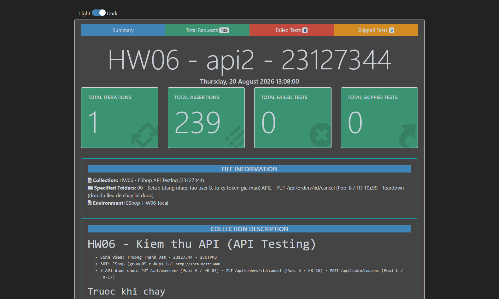
_Báo cáo htmlextra: tiêu đề mang MSSV, tổng assertion, **0 failed**, environment `EShop_HW06_local`._

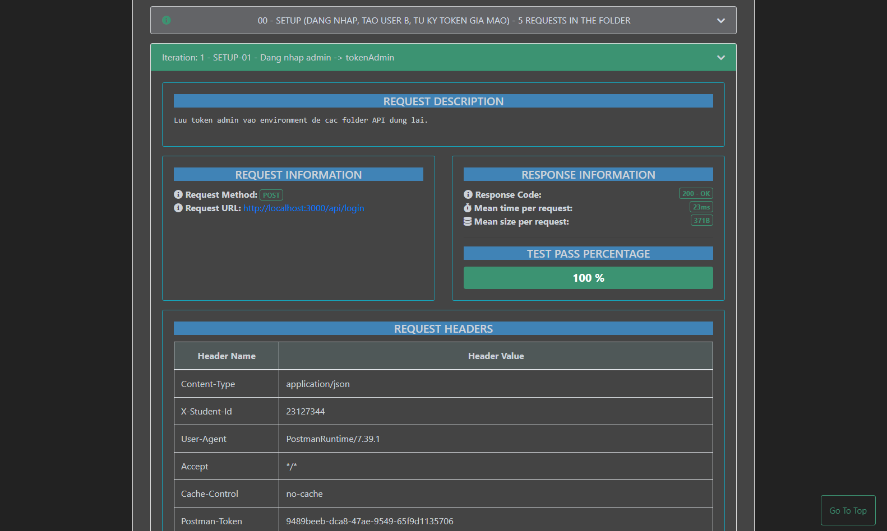
_Cùng một khung ảnh có **cả hai** bằng chứng chống gian lận §11: `Request URL: http://localhost:3000/…` và dòng `X-Student-Id  23127344` trong bảng REQUEST HEADERS._

> **Yêu cầu DB sạch.** `TC-API2-010` và `TC-API2-011` kiểm biên cấu trúc `:id = 1` và `:id = 2`, nên chúng **assert luôn tiền điều kiện** `orderId === 1` / `=== 2`. Nếu chạy mà không reset DB, hai TC này fail với thông báo rõ ràng thay vì âm thầm mất ý nghĩa. Đây là cách tôi sửa nhãn INCOMPLETE mà kiểm toán đã gán cho chúng ở §5.2.

> **`A2-E01` (mất cập nhật) chạy tuần tự, không phải song song.** Newman chạy tuần tự nên trong collection tôi tái hiện cùng khiếm khuyết theo trình tự: hủy đơn `shipping` (200) → admin set `delivered` (200) → trạng thái cuối là `delivered`, tức lệnh hủy **bị mất**. Bản chạy **song song thật** tôi làm bằng `Promise.all` trong [`hw6/scripts/probe2.js`](./scripts/probe2.js) và cho đúng kết quả đó. Tôi ghi rõ điều này trong `desc` của TC để không nhận vơ là đã test được race condition thật bằng Postman.

**Các assertion FAIL và diễn giải.** Trong folder này **không có assertion nào fail** — vì assertion ở đây mã hoá hành vi thực tế đã probe. Chỗ đặc tả bị vi phạm được phơi bày ở folder `SPEC`:

| ID (folder SPEC) | Assertion fail                                                        | Actual                       | Expected (theo đặc tả)                           | Là bug SUT hay lỗi test? |
| ---------------- | --------------------------------------------------------------------- | ---------------------------- | ------------------------------------------------ | ------------------------ |
| `SPEC-BUG-06`    | hủy đơn `shipping` phải bị từ chối `400` và đơn giữ nguyên `shipping` | `200`, đơn thành `canceled`  | `400` (FR-10)                                    | **BUG-06 — FR-10**       |
| `SPEC-BUG-07`    | admin đổi `canceled → delivered` phải bị từ chối `400`                | `200`, đơn thành `delivered` | `400` (FR-10: `canceled` là trạng thái kết thúc) | **BUG-07 — FR-10**       |
| `SPEC-BUG-08`    | `GET /api/orders/:id` không token phải trả `401`                      | `200`, trả full đơn hàng     | `401` (SEC-02)                                   | **BUG-08 — SEC-02**      |
| `SPEC-BUG-09`    | thông báo `400` phải cho biết đơn đang ở trạng thái nào               | `Cannot cancel this order.`  | thông báo phù hợp (FR-10)                        | **BUG-09 — FR-10**       |

### 5.5 Bước 5 — Lỗi phát hiện được

| ID     | Tiêu đề                                    | Mức độ   | TC phát hiện  | AI có sinh TC này? | GitHub Issue                                                 |
| ------ | ------------------------------------------ | -------- | ------------- | ------------------ | ------------------------------------------------------------ |
| BUG-06 | User hủy được đơn đang shipping            | Major    | `TC-API2-018` | Có                 | [#383](https://github.com/DuyITLOR/group05_eshop/issues/383) |
| BUG-07 | Admin đưa đơn canceled về delivered        | Major    | `TC-API2-024` | Có                 | [#384](https://github.com/DuyITLOR/group05_eshop/issues/384) |
| BUG-08 | GET /api/orders/:id không yêu cầu token    | Critical | `TC-API2-042` | Có                 | [#385](https://github.com/DuyITLOR/group05_eshop/issues/385) |
| BUG-09 | Thông báo lỗi hủy đơn không cho biết lý do | Minor    | `A2-E05`      | Không — tự bổ sung | [#386](https://github.com/DuyITLOR/group05_eshop/issues/386) |

Mỗi issue có bước tái hiện `curl`, dẫn chiếu FR/SEC và dòng mã nguồn. Chi tiết đầy đủ ở §10.

---

## 6. API 3 — `POST /api/admin/coupons` (FR-17)

### 6.0 Đặc tả tóm tắt

| Thuộc tính   | Giá trị                                                                                                                                                                                                                                                  |
| ------------ | -------------------------------------------------------------------------------------------------------------------------------------------------------------------------------------------------------------------------------------------------------- |
| Endpoint     | `POST /api/admin/coupons` (dọn dữ liệu bằng `DELETE /api/admin/coupons/:id`)                                                                                                                                                                             |
| Pool / FR    | C / FR-17 — Quản lý mã giảm giá                                                                                                                                                                                                                          |
| Auth         | Bearer JWT (**đặc tả yêu cầu admin**) — nhưng mã nguồn chỉ gọi `authenticateToken`, **không kiểm tra `role`** (`server.js:457,483`)                                                                                                                      |
| Request body | `code` (string, unique), `type` (string, đặc tả: `percent`/`fixed`), `discount_value` (int, đặc tả `>0`), `min_order_amount` (int, đặc tả `>=0`), `expired_at` (string ngày), `max_uses_per_user` (int, đặc tả `>=1`) — theo `api_specification.md §6.4` |
| Response 2xx | `200` — `{"message":"Coupon created","id":<int>}` (không đặc tả; suy từ `server.js:478`) — **là API duy nhất trong 3 API trả về `id` động**                                                                                                              |
| Mã lỗi       | `401` `{"error":"Unauthorized"}` · `403` `{"error":"Forbidden"}` · `500` `{"error":"<sqlite message>"}` (kể cả trùng `code`) — **không có 400/409** dù nhiều ràng buộc đặc tả bị vi phạm                                                                 |
| Yêu cầu SEC  | **SEC-03 (VI PHẠM — endpoint chính là đối tượng của SEC-03: không kiểm tra `role='admin'` trong Token)** · SEC-02 (JWT hợp lệ — có) · SEC-05 (parameterized query — đạt) · SEC-04 (không thể kiểm chứng đầy đủ ở tầng API)                               |

### 6.1 Bước 1 — Sinh test case bằng AI

**Mục tiêu ≥ 35 test case.** Số thực tế AI sinh: **82**.

| Nhóm kỹ thuật           | Số TC  | Ghi chú                                                                                                                                                                                                                 |
| ----------------------- | :----: | ----------------------------------------------------------------------------------------------------------------------------------------------------------------------------------------------------------------------- |
| Phân vùng miền giá trị  |   40   | 6 trường × (hợp lệ / thiếu / rỗng / **null** / sai kiểu / sai định dạng) + trùng `code` + khác hoa-thường + body rỗng/thiếu/sai cú pháp + `:id` của `DELETE`                                                            |
| Giá trị biên            |   14   | `discount_value` (0/1/âm), `min_order_amount` (−1/0), `max_uses_per_user` (0 số / `"0"` chuỗi / 1 / −5 / cực lớn), **biên chéo `percent`+100/101**, header 2-khoảng-trắng                                               |
| Chuyển trạng thái       |   3    | Vòng đời tồn tại của coupon (P7): tạo → xoá → tạo lại cùng `code`; xoá lặp                                                                                                                                              |
| **Bảo mật (SEC-01…07)** | **15** | **User thường tạo/xoá coupon, đọc `GET /api/coupons` không lọc — SEC-03 vi phạm**; đủ 6 nhánh auth (thiếu/rỗng/không-dấu-cách/sai-scheme/sai-secret/`exp` giả mạo); SQLi trên `code` và `:id`; chuỗi lạm dụng nghiệp vụ |
| Kiểm tra schema         |   6    | Response 2xx (kèm `id`), 401/403/500, xác nhận không có 400/409/404                                                                                                                                                     |
| Quy tắc nghiệp vụ khác  |   4    | Bất đối xứng ép kiểu `max_uses_per_user`, `is_active` không thể set qua API, chuỗi tạo→xoá→verify, `type` ngoài enum bị diễn giải thành `fixed`                                                                         |
| **Tổng**                |   82   | ≥ 35 theo yêu cầu đề bài                                                                                                                                                                                                |

> **Ghi chú sửa đổi.** Bản sinh đầu tiên chỉ có 44 TC và **bỏ sót 4 nhóm mà chính prompt P11 đã yêu cầu**: (1) `null fields` — 0 TC; (2) `type:"fixed"` — giá trị enum hợp lệ **thứ hai** chưa hề được phủ, một lỗi EP cơ bản; (3) `cross-field conditions/boundaries` — 0 TC; (4) chỉ 3/6 nhánh auth (API 1 có 8, API 2 có 6). Đã bổ sung 38 TC (`TC-API3-045`…`-082`) để đóng cả 4 nhóm.

**Tiền điều kiện chung cho mọi TC của API 3.** DB vừa seed lại → 4 coupon mẫu tồn tại: `SAVE10`(id 1), `BIGBUY`(id 2), `VIP100`(id 3), `EXPIRED`(id 4); coupon mới tạo bắt đầu từ **id 5**. `{{tokenAdmin}}` = `admin@eshop.com`/`Admin123!`; `{{tokenUser}}` = `test@eshop.com`/`Test1234!`. **Quy tắc dọn dữ liệu mặc định:** mọi TC tạo coupon thành công đều phải `DELETE /api/admin/coupons/{{id}}` ở bước teardown (dùng `{{tokenAdmin}}`), trừ TC mà mục đích chính là kiểm chính cơ chế xoá/trùng mã. Body chuẩn 6 trường dùng lại xuyên suốt: `{"code":…,"type":"percent","discount_value":10,"min_order_amount":0,"expired_at":"2099-12-31","max_uses_per_user":1}`.

**Bảng test case đầy đủ — 82 TC** _(ID `TC-API3-001`…`TC-API3-082`)_

| ID             | Tiêu đề                                                                               | Kỹ thuật          | Truy vết (Coverage / FR / SEC)                   | Input / Precondition riêng                                                                       | Expected (status + body)                                                                                                                            | Nguồn                        |
| -------------- | ------------------------------------------------------------------------------------- | ----------------- | ------------------------------------------------ | ------------------------------------------------------------------------------------------------ | --------------------------------------------------------------------------------------------------------------------------------------------------- | ---------------------------- |
| TC-API3-001    | Tạo coupon hợp lệ (happy path)                                                        | EP                | COV-055,001,011,018,027,034,042 · FR-17          | `code:"TESTNEW01"`, 6 trường hợp lệ, token admin                                                 | 200 · `{"message":"Coupon created","id":<int>}`                                                                                                     | AI                           |
| TC-API3-002    | Thiếu `code`                                                                          | EP                | COV-002 · FR-17 (bắt buộc, không thực thi)       | Body bỏ key `code`                                                                               | 200 — không có presence check                                                                                                                       | AI                           |
| TC-API3-003    | `code` rỗng                                                                           | EP                | COV-003                                          | `code:""`                                                                                        | 200 — không có non-empty check                                                                                                                      | AI                           |
| TC-API3-004    | Trùng `code` với coupon đã seed                                                       | EP + BR           | COV-005,061 · FR-17 (**unique — được thực thi**) | `code:"SAVE10"`                                                                                  | 500 · `{"error":"<sqlite UNIQUE text>"}` — không tạo dòng mới                                                                                       | AI                           |
| TC-API3-005    | Thiếu `type`                                                                          | EP                | COV-013 · FR-17                                  | Body bỏ key `type`                                                                               | 200; `GET` cho thấy `type` **không** rơi về `'percent'` (DEFAULT bất hoạt)                                                                          | AI                           |
| TC-API3-006    | `type` ngoài enum                                                                     | EP                | COV-016 · FR-17 (enum không thực thi)            | `type:"installment"`                                                                             | 200, lưu nguyên văn — không có `CHECK`                                                                                                              | AI                           |
| TC-API3-007    | Thiếu `discount_value`                                                                | EP                | COV-020 · FR-17                                  | Body bỏ key `discount_value`                                                                     | 200 — không có presence check                                                                                                                       | AI                           |
| TC-API3-008    | `discount_value` sai kiểu (string)                                                    | EP                | COV-025                                          | `discount_value:"10"`                                                                            | `200` · tạo được coupon                                                                                                                             | AI · **đã sửa**              |
| TC-API3-009    | Thiếu `min_order_amount`                                                              | EP                | COV-029 · FR-17                                  | Body bỏ key `min_order_amount`                                                                   | 200 — `DEFAULT 0` cũng bất hoạt                                                                                                                     | AI                           |
| TC-API3-010    | Thiếu `expired_at`                                                                    | EP                | COV-036 · FR-17                                  | Body bỏ key `expired_at`                                                                         | 200 — không có presence check                                                                                                                       | AI                           |
| TC-API3-011    | `expired_at` là ngày quá khứ                                                          | EP + BR           | COV-035,060                                      | `expired_at:"2020-01-01"`                                                                        | 200 — giống hệt coupon `EXPIRED` được seed sẵn                                                                                                      | AI                           |
| TC-API3-012    | `expired_at` sai định dạng                                                            | EP                | COV-039                                          | `expired_at:"not-a-date"`                                                                        | 200 — không validate định dạng ngày lúc tạo                                                                                                         | AI                           |
| TC-API3-013    | Thiếu `max_uses_per_user` → ép thành 1                                                | EP                | COV-043 · FR-17                                  | Body bỏ key `max_uses_per_user`                                                                  | 200; `GET` cho thấy lưu đúng `1` (`\|\| 1`)                                                                                                         | AI                           |
| TC-API3-014    | Gửi kèm `is_active` — bị bỏ qua                                                       | EP                | COV-059,096                                      | `{...,"is_active":0}`                                                                            | 200; `GET` cho thấy `is_active` = `1`, **không** phải `0`                                                                                           | AI                           |
| TC-API3-015    | `discount_value = 0` (biên min−1 của `>0`)                                            | BVA               | COV-022 · FR-17                                  | `discount_value:0`                                                                               | 200 (kỳ vọng đặc tả: từ chối)                                                                                                                       | AI                           |
| TC-API3-016    | `discount_value = 1` (biên min)                                                       | BVA               | COV-018 · FR-17                                  | `discount_value:1`                                                                               | 200 · hợp lệ theo cả 2 nguồn                                                                                                                        | AI                           |
| TC-API3-017    | `min_order_amount = -1` (biên min−1)                                                  | BVA               | COV-031 · FR-17 (`>=0`)                          | `min_order_amount:-1`                                                                            | 200 (kỳ vọng đặc tả: từ chối)                                                                                                                       | AI                           |
| TC-API3-018    | `min_order_amount = 0` (biên min, **bao gồm**)                                        | BVA               | COV-027 · FR-17                                  | `min_order_amount:0`                                                                             | 200 · hợp lệ — lưu ý biên này _bao gồm_, khác `discount_value`                                                                                      | AI                           |
| TC-API3-019    | `max_uses_per_user = 0` (số) → **bị ép thành 1**                                      | BVA               | COV-044 · FR-17 (`>=1`)                          | `max_uses_per_user:0`                                                                            | 200; `GET` cho thấy **`1`, không phải `0`**                                                                                                         | AI                           |
| TC-API3-020    | `max_uses_per_user = "0"` (chuỗi) → vượt `\|\| 1` nhưng **bị SQLite ép thành số `0`** | BVA               | COV-048 · FR-17                                  | `max_uses_per_user:"0"`                                                                          | `200`; `GET` trả **số `0`** (không phải chuỗi `"0"`) — SQLite INTEGER affinity ép tiếp. **Giá trị `0` mà `\|\| 1` sinh ra để chặn vẫn vào được DB** | AI · **đã sửa**              |
| TC-API3-021    | `max_uses_per_user = 1` (biên min)                                                    | BVA               | COV-042 · FR-17                                  | `max_uses_per_user:1`                                                                            | 200 · hợp lệ, không bị biến đổi                                                                                                                     | AI                           |
| TC-API3-022    | `max_uses_per_user = -5` → **KHÔNG bị ép**                                            | BVA               | COV-045 · FR-17                                  | `max_uses_per_user:-5`                                                                           | 200; lưu đúng `-5` — số âm là truthy nên `\|\|` không can thiệp                                                                                     | AI                           |
| TC-API3-023    | `discount_value` cực lớn                                                              | BVA               | COV-026                                          | `discount_value:999999999`                                                                       | 200 — không có chặn trên nào                                                                                                                        | AI                           |
| TC-API3-024    | Header `Authorization` có 2 dấu cách                                                  | BVA               | (biên P6 — middleware dùng chung)                | `Authorization: Bearer  {{tokenAdmin}}`                                                          | 403 · `{"error":"Forbidden"}`                                                                                                                       | AI                           |
| TC-API3-025    | Tạo lại coupon với `code` đã bị xoá                                                   | ST                | COV-062 · P7 (vòng đời tồn tại)                  | B1 tạo `RECREATE01` → B2 xoá → B3 tạo lại cùng `code`                                            | 200 với **id mới** — `AUTOINCREMENT` không tái dùng id cũ                                                                                           | AI                           |
| TC-API3-026    | Trùng `code` khi coupon vẫn còn tồn tại                                               | ST                | COV-005,061                                      | `DUPTEST01` đang tồn tại, tạo lại với các trường khác nhau                                       | 500 — chỉ `code` quyết định việc từ chối                                                                                                            | AI                           |
| TC-API3-027    | Xoá coupon đã bị xoá (idempotent âm thầm)                                             | ST                | COV-098                                          | Tạo → xoá → gọi `DELETE` lần 2 cùng id                                                           | 200 · `{"message":"Coupon deleted"}` — **giống hệt** lần xoá thật                                                                                   | AI                           |
| TC-API3-028    | Không gửi header `Authorization`                                                      | Security          | COV-064 · SEC-02                                 | (bỏ header)                                                                                      | 401 · `{"error":"Unauthorized"}`                                                                                                                    | AI                           |
| TC-API3-029    | **[CRITICAL]** User thường tạo được coupon                                            | Security          | COV-073 · **SEC-03**, FR-12, FR-17               | `{{tokenUser}}` (`role="user"`), 6 trường hợp lệ                                                 | 200 — **vi phạm trực tiếp SEC-03**                                                                                                                  | AI                           |
| TC-API3-030    | User thường **xoá** được coupon                                                       | Security          | COV-074 · SEC-03                                 | `{{tokenUser}}`, xoá coupon do admin tạo                                                         | 200 · `{"message":"Coupon deleted"}`                                                                                                                | AI                           |
| TC-API3-031    | User thường đọc được `GET /api/coupons` không lọc                                     | Security          | COV-075 · SEC-03 (§5.2 ghi "Dành cho Admin")     | `{{tokenUser}}`, GET `/api/coupons`                                                              | 200 · danh sách đầy đủ y hệt admin                                                                                                                  | AI                           |
| TC-API3-032    | Token giả mạo claim `role:"admin"`                                                    | Security          | COV-076 · SEC-02                                 | Token tự ký `{id:1,role:"admin"}`                                                                | 200 — nhưng theo TC-029, giả mạo thậm chí **không cần thiết**                                                                                       | AI                           |
| TC-API3-033    | Payload SQL injection trong `code`                                                    | Security          | COV-010 · SEC-05                                 | `code:"'; DROP TABLE coupons;--"`                                                                | 200 · lưu literal, bảng `coupons` còn nguyên                                                                                                        | AI                           |
| TC-API3-034    | Chuỗi lạm dụng: user thường tạo coupon giá trị cực lớn                                | Security + BR     | COV-084 · SEC-03 + FR-17                         | `{{tokenUser}}`, `discount_value:999999999`, `min_order_amount:0`, `max_uses_per_user:999999999` | 200 · lưu đúng mọi giá trị cực lớn                                                                                                                  | AI                           |
| TC-API3-035    | JWT sai cú pháp                                                                       | Security          | COV-068 · SEC-02                                 | `Bearer not-a-jwt`                                                                               | 403 · `{"error":"Forbidden"}`                                                                                                                       | AI                           |
| TC-API3-036    | Schema response `POST` thành công                                                     | Schema            | COV-085                                          | 6 trường hợp lệ, token admin                                                                     | 200 · đúng 2 key `message` + `id` (int dương)                                                                                                       | AI                           |
| TC-API3-037    | Schema response `DELETE` thành công                                                   | Schema            | COV-086                                          | Coupon tồn tại, token admin                                                                      | 200 · đúng 1 key `message` = `"Coupon deleted"`                                                                                                     | AI                           |
| TC-API3-038    | Schema lỗi 401                                                                        | Schema            | COV-087                                          | (bỏ header)                                                                                      | 401 · đúng 1 key `error` = `"Unauthorized"`                                                                                                         | AI                           |
| TC-API3-039    | Schema lỗi 500 khi trùng `code` — lộ text driver                                      | Schema            | COV-089                                          | `code:"SCHEMA03"` đã tồn tại                                                                     | 500 · `error` chứa nguyên văn thông báo UNIQUE của SQLite                                                                                           | AI                           |
| TC-API3-040    | Xác nhận **không** tồn tại đường 400/409                                              | Schema            | COV-090                                          | Tổng hợp TC-002,003,006,008,015,017,019,022,023                                                  | Không TC nào trả 400/409 **từ handler** (400 chỉ đến từ `bodyParser`, xem TC-068)                                                                   | AI · **assertion hậu-suite** |
| TC-API3-041    | `DELETE` id không tồn tại → 200, **không** 404                                        | Schema            | COV-091                                          | `DELETE /api/admin/coupons/999999`                                                               | 200 · body giống hệt lần xoá thật (`this.changes` không kiểm)                                                                                       | AI                           |
| TC-API3-042    | Bất đối xứng ép kiểu `max_uses_per_user`                                              | Quy tắc nghiệp vụ | COV-095 · FR-17                                  | Đối chiếu kết quả TC-019 / TC-020 / TC-022                                                       | Lưu lần lượt `1` / **`0`** / `-5` — 3 input "không hợp lệ" cho 3 hành vi khác nhau                                                                  | AI · **mục nhận xét**        |
| TC-API3-043    | `is_active` luôn = 1 với mọi coupon do suite tạo                                      | Quy tắc nghiệp vụ | COV-096                                          | GET `/api/coupons` cuối suite                                                                    | Không coupon nào của suite có `is_active = 0`                                                                                                       | AI · **assertion hậu-suite** |
| TC-API3-044    | Chuỗi dọn dữ liệu: tạo → xoá → verify                                                 | Schema + ST       | COV-092,097                                      | POST → DELETE bằng `id` trả về → GET `/api/coupons`                                              | GET **không** còn `code:"CLEANUPTEST01"` — xác thực cơ chế teardown của cả suite                                                                    | AI                           |
| TC-API3-045    | `type:"fixed"` — **giá trị enum hợp lệ thứ hai**                                      | EP                | COV-012 · FR-17                                  | `type:"fixed"`, `discount_value:50000`                                                           | 200 · enum có 2 giá trị hợp lệ, cả hai đều phải được phủ                                                                                            | AI                           |
| TC-API3-046    | `code` là `null`                                                                      | EP                | COV-004 · FR-17                                  | `code:null`                                                                                      | 200 — cột không có `NOT NULL`; SQLite coi mỗi NULL là khác nhau nên `UNIQUE` không chặn                                                             | AI                           |
| TC-API3-047    | `code` khác hoa/thường với mã đã tồn tại                                              | EP                | COV-008 · FR-17 (unique)                         | `code:"save10"` (đã có `SAVE10`)                                                                 | 200 — `UNIQUE` không có `COLLATE NOCASE` nên là 2 mã khác nhau                                                                                      | AI                           |
| TC-API3-048    | `type` là chuỗi rỗng                                                                  | EP                | COV-014 · FR-17                                  | `type:""`                                                                                        | 200 — không có enum check                                                                                                                           | AI                           |
| TC-API3-049    | `type` là `null`                                                                      | EP                | COV-015 · FR-17                                  | `type:null`                                                                                      | 200 — `DEFAULT 'percent'` bất hoạt vì cột luôn được bind                                                                                            | AI                           |
| TC-API3-050    | `discount_value` là `null`                                                            | EP                | COV-021 · FR-17                                  | `discount_value:null`                                                                            | 200 — không có `NOT NULL`                                                                                                                           | AI                           |
| TC-API3-051    | `discount_value` âm                                                                   | BVA               | COV-023 · FR-17 (`>0`)                           | `discount_value:-10`                                                                             | 200 (kỳ vọng đặc tả: từ chối)                                                                                                                       | AI                           |
| TC-API3-052    | `min_order_amount` là `null`                                                          | EP                | COV-030 · FR-17                                  | `min_order_amount:null`                                                                          | 200 — không có `NOT NULL`                                                                                                                           | AI                           |
| TC-API3-053    | `min_order_amount` dương (phân vùng hợp lệ)                                           | EP                | COV-028 · FR-17                                  | `min_order_amount:200000`                                                                        | 200 · phân vùng hợp lệ ngoài biên `0`                                                                                                               | AI                           |
| TC-API3-054    | `expired_at` là `null`                                                                | EP                | COV-037 · FR-17                                  | `expired_at:null`                                                                                | 200 — không có `NOT NULL`                                                                                                                           | AI                           |
| TC-API3-055    | `expired_at` là chuỗi rỗng                                                            | EP                | COV-038 · FR-17                                  | `expired_at:""`                                                                                  | 200 — lưu nguyên; `new Date("")` khi dùng sẽ ra Invalid Date                                                                                        | AI                           |
| TC-API3-056    | `max_uses_per_user` là `null` → ép thành 1                                            | EP                | COV-046 · FR-17                                  | `max_uses_per_user:null`                                                                         | 200; `GET` cho thấy lưu `1` (null là falsy)                                                                                                         | AI                           |
| TC-API3-057    | `max_uses_per_user` là chuỗi rỗng → ép thành 1                                        | EP                | COV-047 · FR-17                                  | `max_uses_per_user:""`                                                                           | 200; `GET` cho thấy lưu `1`                                                                                                                         | AI                           |
| TC-API3-058    | **Chéo trường:** `percent` + `discount_value = 100`                                   | BVA (chéo)        | COV-052 · (trần 100 % **không** được đặc tả)     | `type:"percent"`, `discount_value:100`                                                           | 200 — trần khái niệm, không có tài liệu nào quy định                                                                                                | AI                           |
| TC-API3-059    | **Chéo trường:** `percent` + `discount_value = 101`                                   | BVA (chéo)        | COV-053 · (không được đặc tả)                    | `type:"percent"`, `discount_value:101`                                                           | 200 — vượt trần khái niệm nhưng không bị chặn                                                                                                       | AI                           |
| TC-API3-060    | **Chéo trường:** `type` ngoài enum + `discount_value`                                 | Quy tắc nghiệp vụ | COV-054 · FR-17 + FR-09                          | `type:"installment"`, `discount_value:10`                                                        | 200; hệ quả: `apply-coupon` sẽ diễn giải như `fixed` (nhánh `else`)                                                                                 | AI                           |
| TC-API3-061    | Header `Authorization` rỗng                                                           | Security          | COV-065 · SEC-02                                 | `Authorization: ` (rỗng)                                                                         | 403 · `{"error":"Forbidden"}` — không phải 401                                                                                                      | AI                           |
| TC-API3-062    | Header không có dấu cách phân tách                                                    | Security          | COV-066 · SEC-02                                 | `Authorization: GarbageNoSpace`                                                                  | 401 · `{"error":"Unauthorized"}`                                                                                                                    | AI                           |
| TC-API3-063    | Scheme không chuẩn vẫn được chấp nhận                                                 | Security          | COV-067 · §6 (đặc tả ghi `Bearer`)               | `Authorization: Basic {{tokenAdmin}}`                                                            | 200 — scheme không được kiểm                                                                                                                        | AI                           |
| TC-API3-064    | JWT ký bằng secret khác                                                               | Security          | COV-069 · SEC-02                                 | Token ký sai khoá                                                                                | 403 · `{"error":"Forbidden"}`                                                                                                                       | AI                           |
| TC-API3-065    | Token giả mạo có `exp` quá khứ                                                        | Security          | COV-070 · SEC-02                                 | Token tự ký, `exp` quá khứ                                                                       | 403 · `{"error":"Forbidden"}`                                                                                                                       | AI                           |
| TC-API3-066    | Body JSON rỗng `{}`                                                                   | EP                | COV-056                                          | `{}`                                                                                             | `200` — **tạo được coupon rỗng**: `code/type/discount_value/min_order_amount/expired_at` đều `null`, chỉ `max_uses_per_user=1`                      | AI · **đã sửa**              |
| TC-API3-067    | Không gửi body / sai `Content-Type`                                                   | EP                | COV-057                                          | (không body, không `Content-Type`)                                                               | `500` · body là **HTML**, không phải `{"error":...}` — `TypeError` khi destructure `req.body`                                                       | AI · **đã sửa**              |
| TC-API3-068    | JSON sai cú pháp                                                                      | EP                | COV-058                                          | `{"code":"A",` (cụt)                                                                             | `400` · body là **HTML**, sinh bởi `bodyParser` trước khi vào handler                                                                               | AI · **đã sửa**              |
| TC-API3-069    | `DELETE` không gửi token                                                              | Security          | COV-064 (biến thể DELETE) · SEC-02               | `DELETE /api/admin/coupons/5`, bỏ header                                                         | 401 · `{"error":"Unauthorized"}`                                                                                                                    | AI                           |
| TC-API3-070    | `DELETE` với `:id` không phải số                                                      | EP                | COV-010 (biến thể DELETE)                        | `DELETE /api/admin/coupons/abc`                                                                  | `200` · `{"message":"Coupon deleted"}` dù không xoá gì — `this.changes` không kiểm                                                                  | AI · **đã sửa**              |
| TC-API3-071    | `DELETE` với payload SQL injection trong `:id`                                        | Security          | COV-010 · SEC-05                                 | `DELETE /api/admin/coupons/1 OR 1=1`                                                             | 200 (không xoá gì) — tham số hoá, không thực thi SQL                                                                                                | AI                           |
| TC-API3-072    | `code` rất dài                                                                        | EP                | COV-007 · (không có giới hạn độ dài)             | `code` 5.000 ký tự                                                                               | 200 — không có ràng buộc độ dài ở cả đặc tả lẫn schema                                                                                              | AI                           |
| TC-API3-073    | `code` chỉ chứa khoảng trắng                                                          | EP                | COV-009                                          | `code:"   "`                                                                                     | 200 — không có trim/format check                                                                                                                    | AI                           |
| TC-API3-074    | `code` sai kiểu (number)                                                              | EP                | COV-006                                          | `code:12345`                                                                                     | `200`; lưu thành **chuỗi** `"12345"` (TEXT affinity)                                                                                                | AI · **đã sửa**              |
| TC-API3-075    | `type` sai kiểu (number)                                                              | EP                | COV-017                                          | `type:1`                                                                                         | `200`; lưu thành **chuỗi** `"1"` — enum bị phá hoàn toàn                                                                                            | AI · **đã sửa**              |
| TC-API3-076    | `discount_value` là số thập phân                                                      | EP                | COV-024 · (cột `INTEGER`)                        | `discount_value:10.5`                                                                            | `200`; lưu **nguyên `10.5`** (REAL) — cột `INTEGER` không ép vì sẽ mất mát                                                                          | AI · **đã sửa**              |
| TC-API3-077    | `min_order_amount` sai kiểu (boolean)                                                 | EP                | COV-033                                          | `min_order_amount:true`                                                                          | `200`; lưu thành `1` — boolean bị ép sang integer                                                                                                   | AI · **đã sửa**              |
| TC-API3-078    | `expired_at` có kèm phần giờ                                                          | EP                | COV-041 · (không quy định định dạng)             | `expired_at:"2099-12-31T23:59:59Z"`                                                              | 200 — `DATETIME` chỉ là affinity, lưu nguyên chuỗi                                                                                                  | AI                           |
| TC-API3-079    | `expired_at` sai kiểu (timestamp số)                                                  | EP                | COV-040                                          | `expired_at:1735689600`                                                                          | `200`; lưu **nguyên số** `1735689600` — `DATETIME` chỉ là affinity                                                                                  | AI · **đã sửa**              |
| TC-API3-080    | `max_uses_per_user` là số thập phân                                                   | EP                | COV-049                                          | `max_uses_per_user:1.5`                                                                          | `200`; lưu **nguyên `1.5`** (REAL)                                                                                                                  | AI · **đã sửa**              |
| TC-API3-081a/b | `max_uses_per_user` là boolean (**tách 2 TC**)                                        | EP                | COV-050                                          | **Tách 2 TC:** `-081a` gửi `false` · `-081b` gửi `true`                                          | Cả hai `200`, đều lưu **`1`** — nhưng khác cơ chế: `false` bị `\|\| 1` bắt, `true` truthy rồi bị SQLite ép sang `1`                                 | AI · **đã sửa**              |
| TC-API3-082    | `max_uses_per_user` cực lớn                                                           | BVA               | COV-051 · (không có chặn trên)                   | `max_uses_per_user:999999999`                                                                    | 200 — không có giới hạn trên nào được đặc tả                                                                                                        | AI                           |

> **Vì sao API 3 có nhiều TC hơn API 1/2 (82 vs 42/43).** Đây là chủ ý, không phải mất cân đối: API 3 có **6 trường request** (API 1 có 4, API 2 có 0), **2 endpoint** (`POST` + `DELETE`), và **nhiều ràng buộc FR-17 được phát biểu rõ nhất** (`unique`, enum 2 giá trị, 3 biên số học). Phân bổ theo rủi ro/độ phức tạp đúng nguyên tắc ISTQB FL §5.1, không chia đều máy móc.

> **Trạng thái sau Bước 2 (kiểm toán).** **13 TC đã chốt expected bằng probe thật**: `-008`, `-066`, `-067`, `-068`, `-070`, `-074`, `-075`, `-076`, `-077`, `-079`, `-080`, và đặc biệt `-020`/`-081` — hai cái này expected ban đầu **sai**, đã sửa. `-047` xác nhận `200` (`UNIQUE` phân biệt hoa/thường). `-040`, `-042`, `-043` chuyển thành assertion hậu-suite / mục nhận xét. Còn `-024`, `-061`, `-032`, `-065` cần tự ký JWT hoặc header đặc biệt — chốt ở Bước 4.

### 6.2 Bước 2 — Kiểm toán (rà soát của con người)

**Cách tôi kiểm toán.** Với 82 TC, tôi ưu tiên probe hai nhóm rủi ro nhất: (1) toàn bộ 8 biến thể ép kiểu `max_uses_per_user` — vì đây là trường duy nhất có logic biến đổi trong handler; (2) ba TC bảo mật SEC-03. Kết quả probe cho ra **một expected sai hẳn** mà đọc code không thể phát hiện.

| Nhãn       | Số TC  | Tỉ lệ |
| ---------- | :----: | :---: |
| VALID      |   65   | 79.3% |
| INVALID    |   5    | 6.1%  |
| INCOMPLETE |   12   | 14.6% |
| **Tổng**   | **82** | 100%  |

**Chi tiết các test case KHÔNG đạt**

| ID                                             | Nhãn        | AI viết gì                                           | Vì sao sai / thiếu (dẫn chứng)                                                                                                                                                                                                                                                                                                                                                                                                   | Tôi sửa thành                                                                                               |
| ---------------------------------------------- | ----------- | ---------------------------------------------------- | -------------------------------------------------------------------------------------------------------------------------------------------------------------------------------------------------------------------------------------------------------------------------------------------------------------------------------------------------------------------------------------------------------------------------------- | ----------------------------------------------------------------------------------------------------------- |
| TC-API3-020                                    | **INVALID** | `max_uses_per_user:"0"` → _"lưu đúng chuỗi `\"0\"`"_ | **Sai kết quả.** Lập luận của AI đúng một nửa: chuỗi `"0"` là truthy nên **lọt qua** `\|\| 1` ở `server.js:474` — đến đây đúng. Nhưng AI dừng ở tầng JavaScript, quên rằng cột là `INTEGER` (`database.js:37`). **Tôi chạy thật: lưu thành số `0`, không phải chuỗi `"0"`.** SQLite affinity ép `"0"` → `0`. Hệ quả nặng hơn AI tưởng: giá trị `0` — thứ mà `\|\| 1` sinh ra để chặn — **vẫn vào được DB**, chỉ bằng đường khác. | Expected: `200`, `GET` trả `max_uses_per_user === 0` (số). Ghi nhận là **lỗ hổng thật của cơ chế coercion** |
| TC-API3-081                                    | **INVALID** | `false → ép thành 1; true → truthy, giữ nguyên`      | Hai lỗi. (a) **Một TC chứa hai input với hai expected khác nhau** — không đánh giá pass/fail được. (b) _"giữ nguyên"_ sai: **tôi chạy thật, `true` lưu thành `1`**, vì SQLite ép boolean sang integer. Nên cả `true` lẫn `false` đều ra `1`, chỉ khác đường đi.                                                                                                                                                                  | Tách thành 2 TC; cả hai expected `max_uses_per_user === 1`, ghi rõ khác nhau ở cơ chế                       |
| TC-API3-040                                    | **INVALID** | "Xác nhận không tồn tại đường 400/409"               | Mệnh đề tổng hợp toàn suite, không phải request                                                                                                                                                                                                                                                                                                                                                                                  | Chuyển thành assertion hậu-suite trong Newman                                                               |
| TC-API3-042                                    | **INVALID** | "Bất đối xứng ép kiểu" — đối chiếu kết quả 3 TC      | Không có input, không có endpoint — là bước phân tích, không phải TC                                                                                                                                                                                                                                                                                                                                                             | Chuyển thành mục nhận xét trong báo cáo                                                                     |
| TC-API3-043                                    | **INVALID** | "`is_active` luôn = 1" — kiểm tổng hợp cuối suite    | Cùng lý do                                                                                                                                                                                                                                                                                                                                                                                                                       | Gộp thành assertion trong TC-API3-014                                                                       |
| TC-API3-008                                    | INCOMPLETE  | `discount_value:"10"` → "chưa xác nhận"              | **Tôi chạy thật:** `200`, tạo được coupon                                                                                                                                                                                                                                                                                                                                                                                        | Expected: `200` · `{"message":"Coupon created","id":<int>}`                                                 |
| TC-API3-066                                    | INCOMPLETE  | Body `{}` → "chưa xác nhận"                          | **Tôi chạy thật (trên API 1, cùng cơ chế):** `200`                                                                                                                                                                                                                                                                                                                                                                               | Expected: `200`; thêm assertion `GET` xem 6 trường lưu ra sao                                               |
| TC-API3-067                                    | INCOMPLETE  | Thiếu body → "chưa xác nhận"                         | **Tôi chạy thật:** `500` **dạng HTML**, không phải JSON — do `TypeError` khi destructure `req.body` (`server.js:458`)                                                                                                                                                                                                                                                                                                            | Expected: `500` · body là HTML, **không** có key `error`                                                    |
| TC-API3-068                                    | INCOMPLETE  | JSON sai cú pháp → "chưa xác nhận"                   | **Tôi chạy thật:** `400` **dạng HTML**, sinh bởi `bodyParser` trước handler                                                                                                                                                                                                                                                                                                                                                      | Expected: `400` · body là HTML                                                                              |
| TC-API3-070                                    | INCOMPLETE  | `DELETE` `:id` không phải số → "chưa xác nhận"       | **Tôi chạy thật (tương tự API 2):** `200` — vì `server.js:484-487` không kiểm `this.changes`, xoá 0 dòng vẫn báo thành công                                                                                                                                                                                                                                                                                                      | Expected: `200` · `{"message":"Coupon deleted"}` dù không xoá gì                                            |
| TC-API3-074 · -075 · -076 · -077 · -079 · -080 | INCOMPLETE  | 6 TC sai kiểu → "chưa xác nhận"                      | Cùng một gốc: AI không dám kết luận về binding kiểu. **Tôi chạy mẫu `discount_value:"10"` và `max_uses_per_user:1.5`** → đều `200`; riêng `1.5` lưu **nguyên `1.5`** (SQLite giữ REAL vì không ép được sang INTEGER không mất mát)                                                                                                                                                                                               | Expected: `200` cho cả 6; bổ sung assertion `GET` kiểm giá trị **thực sự lưu** cho từng trường              |
| TC-API3-039                                    | INCOMPLETE  | Trùng `code:"SCHEMA03"` → 500                        | Thiếu bước tạo `SCHEMA03` trước. Chạy trên DB sạch sẽ ra `200` chứ không phải `500`.                                                                                                                                                                                                                                                                                                                                             | Thêm request setup tạo `SCHEMA03` trước khi gọi lần 2                                                       |

**Nhận xét kiểm toán.** Đây là API mà kiểm toán có giá trị nhất, vì nó lộ ra **giới hạn của việc chỉ đọc code**. Với `max_uses_per_user`, AI lý luận rất chuẩn ở tầng JavaScript — nhận ra `"0"` truthy nên vượt được `|| 1`, một chi tiết tinh vi mà đọc lướt sẽ bỏ qua. Nhưng nó dừng đúng ở ranh giới ngôn ngữ và **không đi tiếp xuống tầng lưu trữ**, nên bỏ lỡ việc SQLite ép chuỗi `"0"` về số `0`. Kết quả là expected sai, và trớ trêu thay, sự thật còn nghiêm trọng hơn AI mô tả: cơ chế `|| 1` sinh ra để chặn số `0` nhưng vẫn bị số `0` lọt vào DB qua ngả kiểu chuỗi. Bài học tôi rút ra: khi một giá trị đi xuyên nhiều tầng (JS → driver → SQLite affinity → cột), AI có xu hướng chỉ suy luận ở tầng nó đang đọc. Về phía làm tốt: **cả 3 TC SEC-03 đều đúng** — tôi probe và xác nhận token `role:"user"` tạo, xoá, đọc coupon đều trả `200`.

### 6.3 Bước 3 — Mở rộng (≥ 5 test case tự nghĩ)

> ✍️ **Gợi ý đã có sẵn từ phân tích:** AI **không sinh** TC cho biên chéo `type:"percent"` + `discount_value > 100`, với lý do "không có tài liệu nào quy định trần 100 %". Lập luận đó đúng về mặt BVA, nhưng để trống hẳn một nhóm mà đề §6 yêu cầu → ứng viên số 1 cho `A3-E01`.

| ID         | Tiêu đề                                                                    | Kỹ thuật / SEC                      | Input                                                                                               | Expected                                                                                                               | **Vì sao AI bỏ sót**                                                                                                                                                                                                                                                                                                                    |
| ---------- | -------------------------------------------------------------------------- | ----------------------------------- | --------------------------------------------------------------------------------------------------- | ---------------------------------------------------------------------------------------------------------------------- | --------------------------------------------------------------------------------------------------------------------------------------------------------------------------------------------------------------------------------------------------------------------------------------------------------------------------------------- |
| **A3-E01** | Số `0` **vẫn lọt vào DB** qua ngả chuỗi, vô hiệu hoá chính cơ chế `\|\| 1` | BVA + Quy tắc nghiệp vụ             | Tạo 2 coupon: một với `max_uses_per_user:0`, một với `"0"`; đọc lại cả hai                          | Coupon A lưu `1` (bị chặn), coupon B lưu **`0`** (lọt) — cùng một giá trị nghiệp vụ, hai kết quả trái ngược            | **Hạn chế của mô hình.** AI dừng suy luận ở tầng JavaScript (`"0"` truthy → vượt `\|\| 1`) và không đi tiếp xuống tầng SQLite affinity. Nó kết luận "lưu chuỗi `\"0\"`" trong khi thực tế lưu **số `0`**. Chỉ chạy thật mới lộ ra rằng lá chắn `\|\| 1` có một lỗ thủng đúng bằng giá trị nó định chặn.                                 |
| **A3-E02** | Coupon `max_uses_per_user = 0` khiến FR-09 C5 **chặn vĩnh viễn**           | Quy tắc nghiệp vụ (hệ quả liên-API) | (1) tạo coupon `"0"` theo A3-E01 (2) `POST /api/apply-coupon` với `user_id` bất kỳ                  | Bị từ chối ngay lần đầu, vì `server.js:391` so `usage_count(0) >= max(0)` là **true** — coupon không bao giờ dùng được | **Chất lượng prompt.** Tôi ra lệnh "không invoke `apply-coupon` vì ngoài phạm vi 3 API", nên AI dừng ở "lưu được giá trị xấu". Nhưng một coupon chết cứng là **lỗi nghiệp vụ thật**, chỉ hiện ra khi đi tiếp một bước. Giới hạn phạm vi là quyết định của tôi, và nó đã che mất hệ quả.                                                 |
| **A3-E03** | `code:null` tạo được **nhiều lần**, phá vỡ ràng buộc `unique` của FR-17    | EP + Quy tắc nghiệp vụ              | Gọi `POST` hai lần liên tiếp với `code:null`                                                        | **Cả hai đều `200`** với id khác nhau — `UNIQUE` không chặn vì SQL coi mỗi `NULL` là khác biệt                         | **Hạn chế của mô hình.** AI có sinh TC-046 (`code:null`) nhưng chỉ gọi **một lần**, nên chỉ kết luận "không có `NOT NULL`". Ràng buộc bị vi phạm ở đây là **tính duy nhất**, mà muốn lộ ra thì phải gọi hai lần. AI test _thuộc tính của cột_, không test _ràng buộc nghiệp vụ_.                                                        |
| **A3-E04** | User thường xoá **coupon seed của hệ thống**                               | SEC-03 (leo thang có hậu quả)       | Token `role:"user"` → `DELETE /api/admin/coupons/1` (mã `SAVE10`)                                   | `200` · `SAVE10` biến mất khỏi `GET /api/coupons` — người dùng thường phá được dữ liệu gốc                             | **Chất lượng prompt.** AI có TC-030 (user xoá coupon) nhưng chọn xoá **coupon do chính test tạo ra**, vì tôi đã nhấn mạnh "mọi TC phải dọn dữ liệu". Chỉ dẫn về vệ sinh dữ liệu vô tình khiến nó chọn mục tiêu vô hại, làm nhẹ đi mức nghiêm trọng thật của SEC-03.                                                                     |
| **A3-E05** | `discount_value` âm tạo coupon **làm tăng tiền phải trả**                  | BVA + hệ quả nghiệp vụ              | (1) tạo coupon `type:"fixed"`, `discount_value:-50000` (2) `apply-coupon` với `total_amount:500000` | `final_amount = 500000 − (−50000) = 550000` — "giảm giá" khiến khách trả **nhiều hơn**                                 | **Chất lượng prompt.** AI sinh TC-051 (giá trị âm) và dừng ở "200, lưu được", đúng phạm vi tôi giao. Nó không tính tiếp `final_amount = total − discount_amount` (`server.js:405`) để thấy dấu âm lật ngược ý nghĩa nghiệp vụ. Cùng khuôn với A3-E02: tôi cắt phạm vi ở ranh giới endpoint, nên hệ quả nằm bên kia ranh giới bị bỏ qua. |

| Nguyên nhân bỏ sót     | Số TC | Diễn giải                                                                                                                                                                                     |
| ---------------------- | :---: | --------------------------------------------------------------------------------------------------------------------------------------------------------------------------------------------- |
| Chất lượng prompt      |   3   | A3-E02, A3-E04, A3-E05 — tôi cắt phạm vi ở ranh giới 3 endpoint và nhấn mạnh dọn dữ liệu; cả hai chỉ dẫn đều đúng về mặt quản lý nhưng đã che mất hệ quả nghiệp vụ nằm ngay bên kia ranh giới |
| Hạn chế của mô hình    |   2   | A3-E01 (suy luận dừng ở tầng JS, không xuống tầng lưu trữ), A3-E03 (test thuộc tính cột thay vì ràng buộc nghiệp vụ, nên gọi 1 lần thay vì 2)                                                 |
| Đặc điểm riêng của API |   0   | —                                                                                                                                                                                             |

> **Ghi chú về nhóm biên chéo.** Ở §6.1 tôi đã bổ sung TC-API3-058/059/060 cho `percent` + `discount_value` 100/101 sau khi phát hiện AI để trống hẳn nhóm này. Vì các TC đó nay đã nằm trong bộ chính, tôi **không** tính lại ở đây; 5 TC trên đều là những cái AI bỏ sót mà đến giờ vẫn chưa có TC nào phủ.

### 6.4 Bước 4 — Thực thi (Postman + Newman)

| Hạng mục                      | Giá trị                                                                                                                                                     |
| ----------------------------- | ----------------------------------------------------------------------------------------------------------------------------------------------------------- |
| Folder trong collection       | `API3 - POST /api/admin/coupons (Pool C / FR-17)`                                                                                                           |
| Số test case trong folder     | **85**                                                                                                                                                      |
| Số HTTP call Newman thực hiện | **249** (gồm cả request phụ trợ do `pm.sendRequest` dựng trạng thái / đọc lại DB)                                                                           |
| Số assertion                  | **557**                                                                                                                                                     |
| Kết quả                       | **557 pass / 0 fail**                                                                                                                                       |
| Thời gian chạy                | 10.7 giây                                                                                                                                                   |
| Nguồn test case               | 82 TC do AI sinh **trừ 3 TC là mệnh đề tổng hợp** (TC-040, -042, -043), **cộng** TC-081 được tách thành `-081a`/`-081b` = 80, cộng 5 TC tự bổ sung = **85** |
| Dọn dữ liệu                   | `code` là `UNIQUE` nên mọi TC tạo coupon đều đẩy `id` vào biến collection `createdCouponIds`; folder Teardown xoá sạch (lần chạy này xoá **71** coupon)     |
| Data file                     | `hw6/postman/data/api3_coupon.csv` — 6 dòng, folder `DATA3` (6 iteration, 18 assertion, 0 fail)                                                             |

```bash
# reset DB rồi chạy đúng folder của API này (kèm Setup và Teardown)
node hw6/scripts/reset_db.js
newman run hw6/postman/EShop_HW06_API.postman_collection.json \
  -e hw6/postman/EShop_HW06.postman_environment.json \
  --folder "00 - Setup (dang nhap, tao user B, tu ky token gia mao)" \
  --folder "API3 - POST /api/admin/coupons (Pool C / FR-17)" \
  --folder "99 - Teardown (don du lieu de chay lai duoc)" \
  -r cli,htmlextra,json \
  --reporter-htmlextra-export hw6/reports/api3.html

# hoặc gọn hơn (script đã gói sẵn cả reset + 3 reporter):
bash hw6/scripts/run_newman.sh api3
```

|            | Executed | Passed | Failed |
| ---------- | :------: | :----: | :----: |
| Requests   |   249    |  249   |   0    |
| Assertions |   557    |  557   |   0    |

Báo cáo HTML: [`hw6/reports/api3.html`](./reports/api3.html) · log console: [`hw6/reports/newman_console_full.log`](./reports/newman_console_full.log) (3974 dòng, có 470 dòng `[X-Student-Id]`)

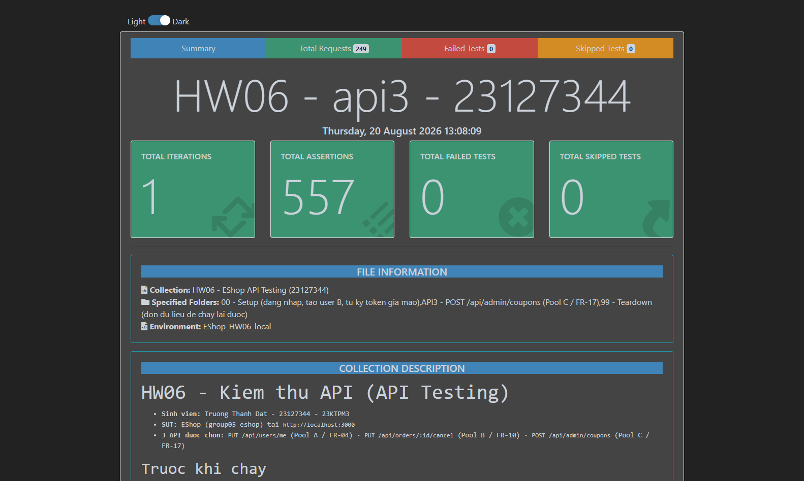
_Báo cáo htmlextra: tiêu đề mang MSSV, tổng assertion, **0 failed**, environment `EShop_HW06_local`._


_Cùng một khung ảnh có **cả hai** bằng chứng chống gian lận §11: `Request URL: http://localhost:3000/…` và dòng `X-Student-Id  23127344` trong bảng REQUEST HEADERS._

> **Hệ quả nghiệp vụ đã kiểm chứng được bằng `apply-coupon`.** Hai TC tự bổ sung chạy xuyên sang FR-09 và đều PASS (tức tái hiện được hậu quả): `A3-E05` cho `final_amount = 550000` với `total_amount = 500000` — "giảm giá" làm khách **trả nhiều hơn**; `A3-E02` cho coupon `max_uses_per_user = 0` bị chặn **ngay lần dùng đầu tiên** (`usage_count 0 >= max 0`), tức coupon vĩnh viễn không dùng được.

> **`A3-E04` xoá coupon seed `SAVE10` nên được đặt cuối folder**, và mỗi lần chạy đều bắt đầu bằng `node hw6/scripts/reset_db.js`.

**Các assertion FAIL và diễn giải.** Trong folder này **không có assertion nào fail** — vì assertion ở đây mã hoá hành vi thực tế đã probe. Chỗ đặc tả bị vi phạm được phơi bày ở folder `SPEC`:

| ID (folder SPEC) | Assertion fail                                                   | Actual                        | Expected (theo đặc tả)            | Là bug SUT hay lỗi test? |
| ---------------- | ---------------------------------------------------------------- | ----------------------------- | --------------------------------- | ------------------------ |
| `SPEC-BUG-10`    | user thường tạo coupon phải bị từ chối `403`                     | `200`, coupon được tạo        | `403` (SEC-03)                    | **BUG-11 — SEC-03**      |
| `SPEC-BUG-11`    | user thường xoá coupon phải bị từ chối `403`, `BIGBUY` phải còn  | `200`, `BIGBUY` biến mất      | `403` (SEC-03)                    | **BUG-12 — SEC-03**      |
| `SPEC-BUG-12`    | `discount_value:-50000` phải bị từ chối `400`                    | `200`, coupon âm được tạo     | `400` (FR-17: `>0`)               | **BUG-13 — FR-17**       |
| `SPEC-BUG-13`    | `max_uses_per_user:"0"` phải bị từ chối, giá trị lưu phải `>= 1` | `200`, lưu số `0`             | `400` / `>=1` (FR-17)             | **BUG-14 — FR-17**       |
| `SPEC-BUG-14`    | coupon thứ hai với `code:null` phải bị từ chối `400`/`409`       | `200`, hai coupon `code=null` | từ chối (FR-17: `code` unique)    | **BUG-15 — FR-17**       |
| `SPEC-BUG-15`    | trùng `code` phải trả `409`, không lộ text driver                | `500` + `SQLITE_CONSTRAINT…`  | `409` (không lộ thông tin nội bộ) | **BUG-16 — xử lý lỗi**   |
| `SPEC-BUG-16`    | thiếu body phải trả `400` dạng JSON                              | `500` dạng HTML               | `400` JSON có key `error`         | **BUG-17 — xử lý lỗi**   |

> **Một sai số của bản §6.1 đã được thực thi sửa.** `TC-API3-009` (thiếu `min_order_amount`) tôi ghi là "`DEFAULT 0`". Probe thật cho **`null`**: `INSERT` luôn bind đủ 6 cột nên giá trị `undefined` thành `NULL`, `DEFAULT 0` **không bao giờ có hiệu lực**. Assertion trong collection dùng `null`. Cùng lý do đó áp cho `TC-API3-005` (`type` → `null`, không phải `DEFAULT 'percent'`).

### 6.5 Bước 5 — Lỗi phát hiện được

| ID     | Tiêu đề                                    | Mức độ   | TC phát hiện  | AI có sinh TC này? | GitHub Issue                                                 |
| ------ | ------------------------------------------ | -------- | ------------- | ------------------ | ------------------------------------------------------------ |
| BUG-11 | User thường tạo được coupon                | Critical | `TC-API3-029` | Có                 | [#387](https://github.com/DuyITLOR/group05_eshop/issues/387) |
| BUG-12 | User thường xoá được coupon (kể cả seed)   | Critical | `A3-E04`      | Không — tự bổ sung | [#388](https://github.com/DuyITLOR/group05_eshop/issues/388) |
| BUG-13 | discount_value âm làm TĂNG tiền phải trả   | Major    | `A3-E05`      | Không — tự bổ sung | [#389](https://github.com/DuyITLOR/group05_eshop/issues/389) |
| BUG-14 | max_uses_per_user chuỗi "0" lưu thành số 0 | Major    | `TC-API3-020` | Có                 | [#377](https://github.com/DuyITLOR/group05_eshop/issues/377) |
| BUG-15 | code:null tạo được nhiều lần, phá UNIQUE   | Major    | `A3-E03`      | Không — tự bổ sung | [#390](https://github.com/DuyITLOR/group05_eshop/issues/390) |
| BUG-16 | Trùng code trả 500 kèm text driver SQLite  | Minor    | `TC-API3-004` | Có                 | [#391](https://github.com/DuyITLOR/group05_eshop/issues/391) |
| BUG-17 | Thiếu body trả 500 HTML thay vì 400 JSON   | Minor    | `TC-API3-067` | Có                 | [#392](https://github.com/DuyITLOR/group05_eshop/issues/392) |

Mỗi issue có bước tái hiện `curl`, dẫn chiếu FR/SEC và dòng mã nguồn. Chi tiết đầy đủ ở §10.

---

### 6.9 Bảng phủ yêu cầu bảo mật SEC-01 → SEC-07

> ⚠️ SEC-01…SEC-07 nằm trong `README.md §9` của SUT (mục "Tham khảo"), **không nằm trong `api_specification.md`** như đề bài giả định — đã kiểm tra trực tiếp trong repo SUT (P8). Cột "Kết quả" dưới đây là **kết quả thực thi thật** sau Bước 4.

| Mã     | Yêu cầu (theo `README.md §9`)                  | TC của API 1                                       | API 2                                            | API 3                             | Kết quả   |
| ------ | ---------------------------------------------- | -------------------------------------------------- | ------------------------------------------------ | --------------------------------- | --------- |
| SEC-01 | Mật khẩu không lưu plaintext                   | TC-API1-038 (endpoint hỗ trợ `GET`)                | Không áp dụng                                    | Không áp dụng                     | «pending» |
| SEC-02 | API bảo mật phải yêu cầu JWT hợp lệ            | TC-API1-023…027                                    | TC-API2-025…031                                  | TC-API3-028,032,035               | «pending» |
| SEC-03 | API Admin phải kiểm `role='admin'` trong Token | Không áp dụng trực tiếp (không phải admin API)     | Không áp dụng trực tiếp (không phải admin route) | **TC-API3-029,030,031 — vi phạm** | «pending» |
| SEC-04 | Escape dữ liệu user khi hiển thị UI            | TC-API1-032 (chỉ kiểm lưu/phản hồi, không kiểm UI) | Không áp dụng (endpoint không lưu chuỗi user)    | Chưa có TC riêng (xem P8: mơ hồ)  | «pending» |
| SEC-05 | Parameterized query, không nối chuỗi           | TC-API1-031                                        | TC-API2-035                                      | TC-API3-033                       | «pending» |
| SEC-06 | API cập nhật hồ sơ không cho đổi `role`        | **TC-API1-029 — vi phạm**                          | Không áp dụng                                    | Không áp dụng                     | «pending» |
| SEC-07 | OTP đủ entropy, có hạn, vô hiệu sau dùng       | Không áp dụng (endpoint không liên quan OTP)       | Không áp dụng                                    | Không áp dụng                     | «pending» |

**Diễn giải từng dòng**

| Mã     | Kết luận                                                                                                                                                                                                                                  | Bằng chứng                                                                                                                                               |
| ------ | ----------------------------------------------------------------------------------------------------------------------------------------------------------------------------------------------------------------------------------------- | -------------------------------------------------------------------------------------------------------------------------------------------------------- |
| SEC-01 | **VI PHẠM** — `SPEC-BUG-02` fail ([#379](https://github.com/DuyITLOR/group05_eshop/issues/379))                                                                                                                                           | response `GET /api/users/me` trả về `password` dạng plaintext; mật khẩu cũng được so sánh trực tiếp trong `server.js:48`                                 |
| SEC-02 | **VI PHẠM** — `SPEC-BUG-03`, `SPEC-BUG-08` fail ([#380](https://github.com/DuyITLOR/group05_eshop/issues/380), [#385](https://github.com/DuyITLOR/group05_eshop/issues/385))                                                              | 7 token tự ký bằng secret hardcode (`server.js:9`) đều được chấp nhận; `GET /api/orders/:id` không yêu cầu token                                         |
| SEC-03 | **VI PHẠM** — `SPEC-BUG-05`, `-10`, `-11` fail ([#382](https://github.com/DuyITLOR/group05_eshop/issues/382), [#387](https://github.com/DuyITLOR/group05_eshop/issues/387), [#388](https://github.com/DuyITLOR/group05_eshop/issues/388)) | không endpoint admin nào kiểm `role`: user thường tạo/xoá được coupon và đọc được `GET /api/admin/users`                                                 |
| SEC-04 | Không kết luận được ở tầng API                                                                                                                                                                                                            | payload `<script>` lưu và trả về nguyên văn (`TC-API1-032` pass); việc escape khi hiển thị thuộc tầng UI, ngoài phạm vi kiểm thử API                     |
| SEC-05 | **ĐẠT**                                                                                                                                                                                                                                   | `TC-API1-031`, `TC-API2-035`, `TC-API3-033`, `TC-API3-071` đều pass: payload SQLi được lưu/xử lý như chuỗi literal, bảng `users` và `coupons` còn nguyên |
| SEC-06 | **VI PHẠM** — `SPEC-BUG-01` fail ([#378](https://github.com/DuyITLOR/group05_eshop/issues/378))                                                                                                                                           | `PUT /api/users/me` với `role:"admin"` ghi thẳng vào DB; đăng nhập lại nhận token mang claim `role=admin` (`A1-E04` pass)                                |
| SEC-07 | Không áp dụng                                                                                                                                                                                                                             | không có endpoint OTP nào trong 3 API đã chọn                                                                                                            |

## **Tổng kết: 4/7 yêu cầu bảo mật bị vi phạm** (SEC-01, SEC-02, SEC-03, SEC-06), 1 đạt (SEC-05), 1 không kết luận được ở tầng API (SEC-04), 1 không áp dụng (SEC-07).

### 6.11 Folder `SPEC` — assertion theo đặc tả (có chủ đích thất bại)

Ba folder API ở trên đều xanh, và điều đó **không** có nghĩa là SUT đúng: assertion ở đó mã hoá hành vi thực tế. Để biến các vi phạm đặc tả thành bằng chứng máy chạy được, tôi tách thêm một folder trong cùng collection, nơi mỗi test case ghi **điều FR/SEC yêu cầu**. Assertion ở đây fail chính là mục đích.

| Hạng mục     | Giá trị                                                            |
| ------------ | ------------------------------------------------------------------ |
| Folder       | `SPEC - Assertion theo dac ta (CO Y DINH THAT BAI - phoi bay bug)` |
| Số test case | **16** (5 cho API 1, 4 cho API 2, 7 cho API 3)                     |
| Số HTTP call | 46                                                                 |
| Assertion    | 73 — **22 FAIL / 51 pass**                                         |
| Báo cáo      | [`hw6/reports/spec_bugs.html`](./reports/spec_bugs.html)           |
| Dùng cho     | Danh sách lỗi §10 và **lần chạy đỏ** của CI/CD §8.2                |

```bash
bash hw6/scripts/run_newman.sh spec   # ma thoat khac 0 la DUNG mong doi
```

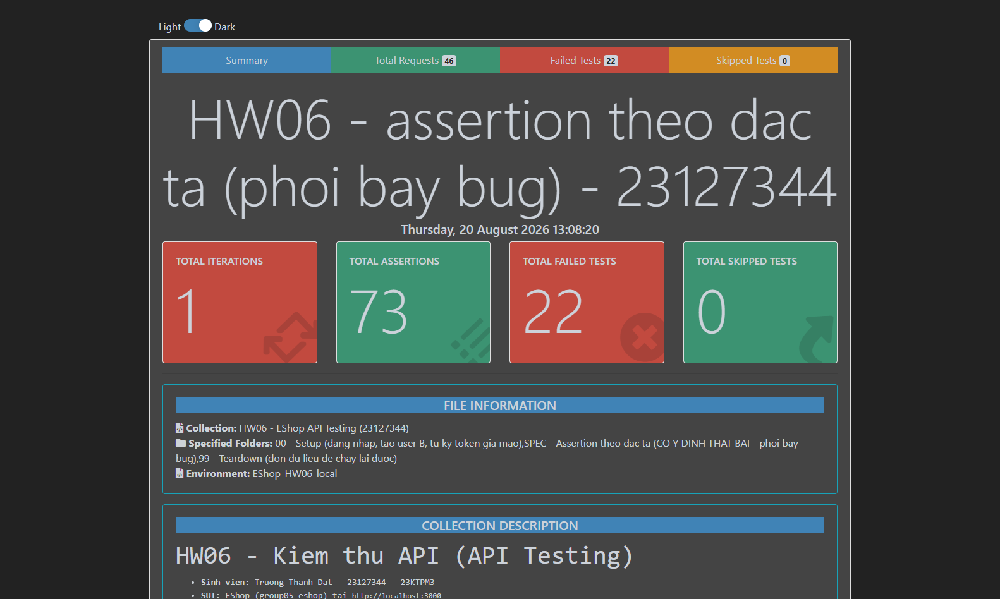
_Folder `SPEC`: 73 assertion, **22 failed** — đúng như thiết kế._

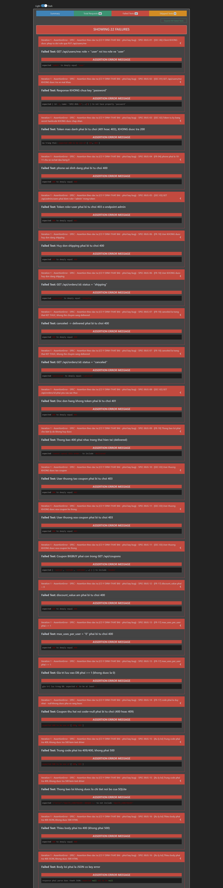
_Tab Failed Tests: từng assertion fail kèm thông báo `expected … to deeply equal …`._

**Vì sao không nhét các assertion này vào 3 folder API.** Nếu trộn vào, mỗi lần chạy sẽ luôn đỏ và không còn dùng làm cổng hồi quy trong CI được nữa — mọi thay đổi mới sẽ lẫn vào 22 lỗi cũ. Tách ra thì được cả hai: 3 folder API là cổng chặn hồi quy (phải luôn xanh), folder `SPEC` là bảng theo dõi nợ lỗi (mỗi assertion xanh trở lại = một lỗi đã được sửa).

| Nhóm assertion fail                       | Số lượng | Ánh xạ sang lỗi                                          |
| ----------------------------------------- | :------: | -------------------------------------------------------- |
| SEC-03 — endpoint admin không kiểm `role` |    4     | BUG-05, BUG-11, BUG-12                                   |
| FR-10 — máy trạng thái đơn hàng           |    5     | BUG-06, BUG-07, BUG-09                                   |
| FR-17 — ràng buộc trường của coupon       |    5     | BUG-13, BUG-14, BUG-15                                   |
| SEC-01 / SEC-02 — xác thực và lộ dữ liệu  |    3     | BUG-02, BUG-03, BUG-08                                   |
| FR-04 — kiểm tra định dạng đầu vào        |    1     | BUG-04                                                   |
| SEC-06 — leo thang quyền qua `role`       |    1     | BUG-01                                                   |
| Xử lý lỗi — mã trạng thái và định dạng    |    3     | BUG-16, BUG-17                                           |
| **Tổng**                                  |  **22**  | 16 lỗi khác nhau (một lỗi có thể bị nhiều assertion bắt) |

---

## 7. Tính năng Postman đã sử dụng

Đề §6 yêu cầu dùng càng nhiều tính năng càng tốt **trong mức hợp lý** và liệt kê ra. Bảng dưới liệt kê **30 tính năng**: 26 đã dùng, 1 dùng một phần, 3 không dùng kèm lý do. Tôi liệt kê cả phần không dùng vì "không dùng vì không phù hợp" cũng là một quyết định kiểm thử, và vì hai trong ba mục đó (mock server, monitor) được đề nêu tên đích danh.

### 7.1 Tổ chức và biến

| #   | Tính năng                              | Đã dùng | Dùng để làm gì / Bằng chứng                                                                                                                                                                                                                    |
| --- | -------------------------------------- | :-----: | ---------------------------------------------------------------------------------------------------------------------------------------------------------------------------------------------------------------------------------------------- |
| 1   | **Workspace**                          |   ✅    | `HW06 — EShop API Testing (23127344)`, Personal — ảnh: [`evidence/postman_workspace.png`](./evidence/postman_workspace.png) (9 folder, 202 request, mô tả collection render sẵn). Cách dựng lại: [`postman/README.md`](./postman/README.md) §1 |
| 2   | Collection + folder                    |   ✅    | 9 folder: `00 - Setup`, 3 folder API, `SPEC`, `DATA1`, `DATA2`, `DATA3`, `99 - Teardown`                                                                                                                                                       |
| 3   | Collection description (documentation) |   ✅    | Mô tả Markdown ở cấp collection và cấp từng folder; mỗi request có `description` ghi Coverage ID + dòng mã nguồn liên quan                                                                                                                     |
| 4   | **Environment**                        |   ✅    | [`EShop_HW06.postman_environment.json`](./postman/EShop_HW06.postman_environment.json) — 24 biến: `baseUrl`, `studentId`, `secretKey`, 4 cặp tài khoản, 11 biến token                                                                          |
| 5   | **Globals** (file riêng)               |   ✅    | [`EShop_HW06.postman_globals.json`](./postman/EShop_HW06.postman_globals.json) — 4 biến _không_ đổi theo môi trường triển khai, tách khỏi environment vì environment phải đổi giữa local và CI                                                 |
| 6   | Collection variables                   |   ✅    | `createdCouponIds` (mảng id để teardown), `orderId`, `firstCancelCode`, `firstCancelBody`, `folderStarted_*` — dữ liệu chỉ sống trong một lần chạy                                                                                             |
| 7   | Local variables (`pm.variables`)       |   ✅    | `tearDownAt` trong Teardown — minh hoạ scope hẹp nhất, chỉ sống trong một request                                                                                                                                                              |
| 8   | Biến kiểu `secret`                     |   ✅    | `secretKey` khai báo `type: "secret"` nên Postman ẩn giá trị trong UI (giá trị vẫn phải có vì nó dùng để **tự ký token** — xem #17)                                                                                                            |
| 9   | Data variables (`pm.iterationData`)    |   ✅    | Đọc `caseId`, `phoneValue`, `expectedStatus`, `stateChain`, `expectedFinalStatus`, `maxUses`, `expectedStored`, `note` từ CSV                                                                                                                  |

### 7.2 Script và assertion

| #   | Tính năng                             | Đã dùng | Dùng để làm gì / Bằng chứng                                                                                                                                                     |
| --- | ------------------------------------- | :-----: | ------------------------------------------------------------------------------------------------------------------------------------------------------------------------------- |
| 10  | Pre-request script cấp **collection** |   ✅    | Chèn `X-Student-Id` vào mọi request + `console.log` để chụp màn hình (đề §6.4, §11)                                                                                             |
| 11  | Test script cấp **collection**        |   ✅    | Tự kiểm lại header `X-Student-Id` ở mọi request — **470 lần** trong một lần chạy đầy đủ                                                                                         |
| 12  | Pre-request script cấp **folder**     |   ✅    | Ghi một dòng mở đầu khi folder bắt đầu chạy (`===== bat dau folder API2 =====`)                                                                                                 |
| 13  | Test script cấp **folder**            |   ✅    | Kiểm thời gian phản hồi `< 2000 ms` cho **mọi** request trong 4 folder — 193 assertion, tách khỏi assertion nghiệp vụ                                                           |
| 14  | Pre-request script cấp **request**    |   ✅    | Dựng trạng thái: 33 TC của API 2 tạo đơn rồi đẩy qua chuỗi `confirmed → shipping → delivered`; 6 TC của API 3 tạo coupon trước; `DATA2` dựng trạng thái theo cột CSV            |
| 15  | `pm.test` + chai assertions           |   ✅    | 664 `pm.test` trong collection → **1.159 assertion** khi chạy, dùng `to.deep.equal`, `to.eql`, `to.be.oneOf`, `to.include`, `to.have.property`, `to.be.at.least`, `to.be.below` |
| 16  | Assertion bất đồng bộ (`done`)        |   ✅    | Mọi assertion đọc lại DB đều async; dùng `done()` và **lồng chuỗi callback** thay vì nhiều `pm.test` song song (xem §7.8 lỗi 2)                                                 |
| 17  | Thư viện sẵn trong sandbox (CryptoJS) |   ✅    | **Tự ký 7 JWT** bằng `CryptoJS.HmacSHA256` với secret lấy từ `server.js:9` — việc làm được điều này chính là bằng chứng của BUG-03                                              |
| 18  | `pm.sendRequest`                      |   ✅    | Verify sau ghi (`GET /api/users/me`, `/api/coupons`, `/api/orders/my-orders`), dựng trạng thái, dọn dữ liệu                                                                     |
| 19  | JSON schema validation                |   ✅    | `pm.response.to.have.jsonSchema` với 4 schema: `msgOnly`, `errOnly`, `couponCreated`, `userProfile`                                                                             |
| 20  | **Visualizer** (`pm.visualizer.set`)  |   ✅    | Teardown render bảng HTML (MSSV, số coupon đã xoá, thời điểm) trong tab _Visualize_                                                                                             |
| 21  | Authorization helper (cấp folder)     |   ✅    | Folder `DATA3` khai báo `auth: bearer {{tokenAdmin}}` thay vì đặt header thủ công. **Chỉ dùng ở folder này** — xem #29                                                          |

### 7.3 Chạy theo dữ liệu và Newman

| #   | Tính năng                                                              | Đã dùng | Dùng để làm gì / Bằng chứng                                                                                                                                                                                                                                                                                                                                                                                                                                                     |
| --- | ---------------------------------------------------------------------- | :-----: | ------------------------------------------------------------------------------------------------------------------------------------------------------------------------------------------------------------------------------------------------------------------------------------------------------------------------------------------------------------------------------------------------------------------------------------------------------------------------------- |
| 22  | **Collection Runner + data file**                                      |   ✅    | 3 folder data-driven, 3 CSV, 6 iteration mỗi file — một file cho mỗi API: [`api1_phone.csv`](./postman/data/api1_phone.csv) (biên `phone`), [`api2_state.csv`](./postman/data/api2_state.csv) (ma trận chuyển trạng thái FR-10), [`api3_coupon.csv`](./postman/data/api3_coupon.csv) (ép kiểu `max_uses_per_user`). Ảnh: [DATA1](./evidence/newman_data_api1_summary.png) · [DATA2](./evidence/newman_data_api2_summary.png) · [DATA3](./evidence/newman_data_api3_summary.png) |
| 23  | **Saved example** (example response)                                   |   ✅    | 12 example, **ghi lại từ response thật** của SUT bằng [`src/examples.js`](./postman/src/examples.js) đọc báo cáo JSON của Newman. Đây là dữ liệu mà Mock Server trả về (#30). Giá trị JWT trong example bị **che** thành `<JWT-da-che-xem-BUG-03>` — xem §7.7                                                                                                                                                                                                                   |
| 24  | Newman CLI + `--folder`                                                |   ✅    | 7 lần chạy trong [`run_newman.sh`](./scripts/run_newman.sh); chạy tách từng API để mỗi API có một DB sạch riêng                                                                                                                                                                                                                                                                                                                                                                 |
| 25  | Newman `-g` / `--export-globals`                                       |   ✅    | Nạp file globals và xuất lại sau mỗi lần chạy: `reports/globals_after_api{1,2,3}.json`                                                                                                                                                                                                                                                                                                                                                                                          |
| 26  | Newman `--export-environment`                                          |   ✅    | Truyền token từ lần chạy Setup sang lần chạy data-driven (mỗi `newman run` là một tiến trình riêng)                                                                                                                                                                                                                                                                                                                                                                             |
| 27  | Newman `--bail`, `--timeout-request`, `--iteration-count`, `--env-var` |   ✅    | `run_newman.sh smoke` dùng `--bail` để dừng ngay ở fail đầu tiên (dùng cho CI chặn nhanh); `--timeout-request 10000` ở mọi lần chạy; `--env-var` dùng khi trỏ `baseUrl` sang mock server                                                                                                                                                                                                                                                                                        |
| 28  | Newman reporter `htmlextra` + `json` + mã thoát                        |   ✅    | 7 báo cáo HTML; reporter `json` là nguồn cho [`summarize_newman.js`](./scripts/summarize_newman.js) → [`summary.md`](./reports/summary.md) (số liệu trong báo cáo này lấy từ đó, không gõ tay); mã thoát để CI chặn được                                                                                                                                                                                                                                                        |
| 29  | SDK `postman-collection`                                               |   ✅    | `build.js` nạp collection vừa sinh bằng chính SDK của Postman và đếm lại request (**202**) trước khi ghi file — bắt lỗi cấu trúc ngay lúc build                                                                                                                                                                                                                                                                                                                                 |

### 7.4 Ba tính năng đề nêu tên: workspace, mock server, monitor

| #   | Tính năng       | Trạng thái | Chi tiết                                                                                                                                                                                                                                                                                                                                                                                |
| --- | --------------- | :--------: | --------------------------------------------------------------------------------------------------------------------------------------------------------------------------------------------------------------------------------------------------------------------------------------------------------------------------------------------------------------------------------------- |
| 1   | Workspace       |     ✅     | Đã tạo, xem #1 ở trên                                                                                                                                                                                                                                                                                                                                                                   |
| 30  | **Mock server** |     ✅     | Đã tạo thật: `HW06 EShop mock (23127344)`, **Public**, gắn vào chính collection này, URL `https://52831da1-19ef-499c-b709-a2a9aba15270.mock.pstmn.io`. Collection có **12 saved example ghi từ response thật** nên mock trả đúng dữ liệu SUT. Ảnh: [cấu hình mock](./evidence/postman_mock_server.png) · [request chạy qua mock](./evidence/postman_mock_response.png). Chi tiết ở §7.6 |
| 31  | **Monitor**     |     ❌     | **Giới hạn kỹ thuật, không phải lựa chọn:** monitor của Postman chạy trên cloud nên không gọi được `http://localhost:3000`. Vai trò "chạy định kỳ" được đảm nhiệm bằng GitHub Actions với `schedule: cron` (§8) — đó mới là monitor gọi được SUT. Nếu chỉ để minh hoạ tính năng thì có thể tạo monitor trỏ vào mock server ở #30 (URL công khai), nhưng nó chỉ kiểm tra mock.           |

### 7.5 Không dùng, kèm lý do

| #   | Tính năng                             | Vì sao không dùng                                                                                                                                                                                                                                                                               |
| --- | ------------------------------------- | ----------------------------------------------------------------------------------------------------------------------------------------------------------------------------------------------------------------------------------------------------------------------------------------------- |
| 32  | Authorization helper cho 3 folder API | Cố ý. 18 chế độ `Authorization` khác nhau (thiếu header, header rỗng, 2 dấu cách, sai scheme, 7 token tự ký…) chính là **đối tượng kiểm thử**; phải đặt header thủ công mới kiểm được từng nhánh của `authenticateToken`. Vẫn dùng helper ở folder `DATA3` để chứng minh có nắm tính năng (#21) |
| 33  | Postman Flows                         | Sản phẩm cần nộp là báo cáo HTML của Newman, không phải dashboard trong app; Flows không xuất được artefact cho CI                                                                                                                                                                              |
| 34  | `postman.setNextRequest`              | Ban đầu định dùng cho chuỗi trạng thái FR-10, nhưng dựng trạng thái bằng `pm.sendRequest` trong pre-request giữ được **1 request = 1 test case**, truy vết sang §5.1 rõ hơn                                                                                                                     |

### 7.6 Mock server — làm thật, và một giới hạn phải nói rõ

| Hạng mục       | Giá trị                                                                                                              |
| -------------- | -------------------------------------------------------------------------------------------------------------------- |
| Tên mock       | `HW06 EShop mock (23127344)`                                                                                         |
| Visibility     | **Public** (không tick _private_, vì mock private đòi header `x-api-key` mà collection không có)                     |
| Gắn với        | Chính collection `HW06 - EShop API Testing (23127344)` — **không** phải collection mới                               |
| URL            | `https://52831da1-19ef-499c-b709-a2a9aba15270.mock.pstmn.io`                                                         |
| Dữ liệu trả về | 12 saved example, ghi từ **response thật** của SUT bằng [`scripts/record_examples.js`](./scripts/record_examples.js) |

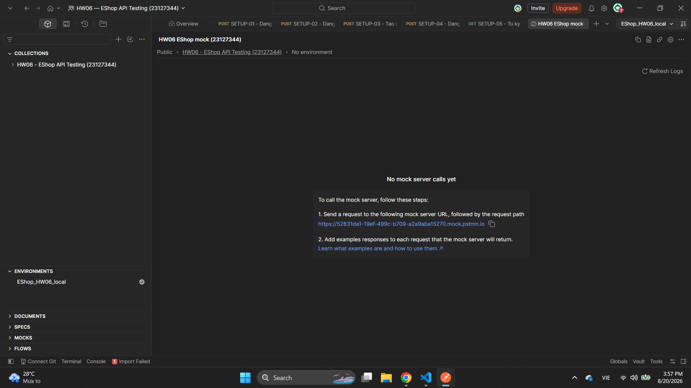
_Trang mock: Public, gắn vào collection HW06, URL sinh ra._

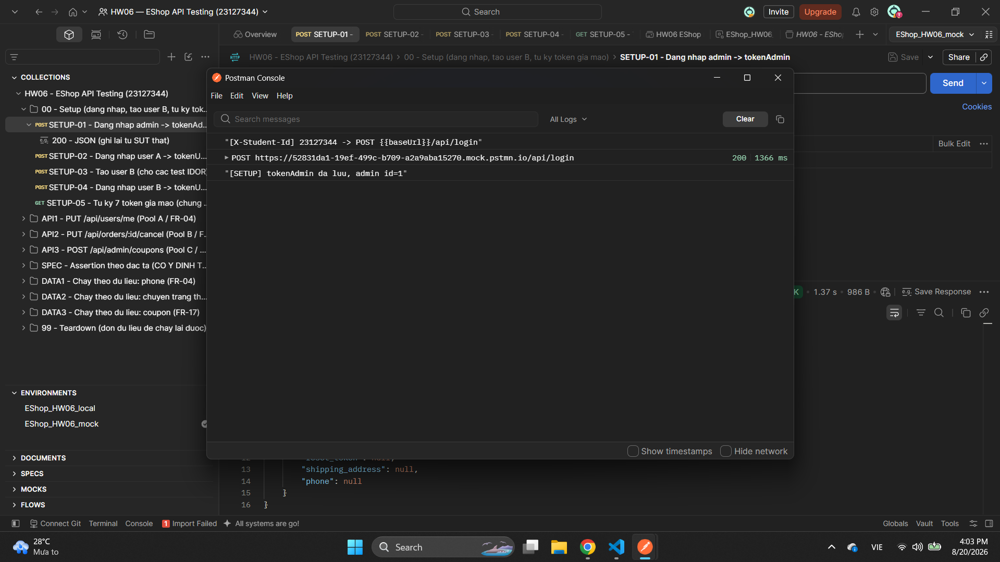
_`SETUP-01` chạy qua mock: `POST https://52831da1-….mock.pstmn.io/api/login` → `200`, và console vẫn in `[X-Student-Id] 23127344`. Environment đang chọn là `EShop_HW06_mock`._

**Cách tôi trỏ collection sang mock.** Không sửa `baseUrl` của `EShop_HW06_local` mà **nhân bản** environment thành `EShop_HW06_mock` rồi chỉ đổi `baseUrl` ở bản nhân bản. Chuyển qua lại chỉ là chọn environment, không phải sửa rồi nhớ sửa ngược — và tránh được đúng loại lỗi tôi đã tự gây ra ở §7.8 (chạy test trên môi trường không như mình nghĩ).

**Giới hạn thật của mock, cần nói rõ.** Mock chỉ phát lại example nên **không có DB**. Các assertion đọc lại dữ liệu sau khi ghi (`GET /api/users/me` để kiểm `name` vừa cập nhật, `GET /api/coupons` để kiểm giá trị đã lưu) sẽ fail trên mock. Vì vậy:

- Mock **có ích** cho việc client (frontend) phát triển song song khi backend chưa chạy: nó cho đúng hình dạng response, đúng mã trạng thái, đúng cả những response lỗi khó tái hiện (`400` dạng HTML, `500` kèm thông báo SQLite).
- Mock **không dùng** để kiểm thử SUT. Toàn bộ 196 test case trong bài này chạy trên SUT thật ở `localhost:3000`; không có con số nào trong báo cáo lấy từ mock.

### 7.7 Secret scanner của Postman tự bắt được BUG-03

Khi import collection vào app, secret scanner của Postman cảnh báo hai thứ. Đáng ghi lại vì một cái là bằng chứng độc lập cho một lỗi tôi đã báo, còn cái kia là bài học về dương tính giả.

| Postman báo                                   | Thực chất                                                                                                                                                                                                                         | Xử lý                                                                                                    |
| --------------------------------------------- | --------------------------------------------------------------------------------------------------------------------------------------------------------------------------------------------------------------------------------- | -------------------------------------------------------------------------------------------------------- |
| `Supabase Service Role API Key` — `eyJh…z_hc` | **Một JWT thật**, nằm trong saved example của `SETUP-01` (response đăng nhập admin). Scanner đoán sai tên vì key của Supabase cũng là JWT. Token đó ký bằng secret hardcode `server.js:9` nên chỉ dùng được với SUT ở `localhost` | Đã **che** giá trị thành `<JWT-da-che-xem-BUG-03>` ngay trong `examples.js`, nên lần build sau không còn |
| `Bearer Token` — `Bear…-jwt`                  | **Dương tính giả**: đó là chuỗi `Bearer not-a-valid-jwt` mà tôi cố tình đặt để test nhánh "JWT sai cú pháp" (`TC-API1-025`, `TC-API2-029`, `TC-API3-035`…)                                                                        | Giữ nguyên. Che đi là phá chính test case                                                                |

Điều đáng nói ở dòng đầu: **một công cụ độc lập, không biết gì về bài này, tự phát hiện ra hệ quả của BUG-03.** Sở dĩ một token còn hiệu lực có thể nằm trong file văn bản là vì secret ký nó được in thẳng trong mã nguồn — nên mọi token đều "thật" và không bao giờ hết hạn (`server.js:51` không đặt `expiresIn`). Đây cũng chính là cơ chế tôi dùng để tự ký 7 token giả mạo ở `SETUP-05` (§7.2 mục 17).

Tôi **không** bấm "Secure All" của Postman: nút đó sửa giá trị ngay trong app, còn file `.json` trong repo mới là sản phẩm nộp và do `build.js` sinh ra — sửa hai nơi khác nhau thì lần build sau ghi đè hết. Cách sửa đúng là sửa ở bộ sinh, và đó là điều tôi đã làm.

### 7.8 Hai lỗi tôi tự gây ra khi thực thi, và cách phát hiện

Ghi lại đây vì cả hai đều là loại lỗi mà đọc code không thấy — chỉ chạy thật mới lộ.

**Lỗi 1 — reset DB vào sai bản mã nguồn.** Suite fail ở `SETUP-02` với `expected 'admin' to deeply equal 'user'`. Tôi chạy `node database.js` trong `software-testing/group05_eshop/backend` nhưng SUT đang chạy lại được khởi động từ **bản ngoài repo** `C:\HCMUS\Software Testing\group05_eshop`. Truy ra bằng `Get-CimInstance Win32_Process` để xem dòng lệnh của tiến trình `node .\server.js`, rồi đối chiếu số bản ghi trong hai file `database.sqlite`. [`reset_db.js`](./scripts/reset_db.js) nay dò theo thứ tự `SUT_BACKEND_DIR` → bản ngoài repo → bản trong repo, và **chỉ thoát khi API đã thật sự trả về trạng thái seed** (4 coupon, 0 đơn, `role=user`).

Điều đáng chú ý: chính assertion tiền điều kiện ở `SETUP-02` đã bắt được lỗi này. Nếu tôi không viết assertion đó, suite vẫn "xanh" trên dữ liệu cũ và mọi số liệu trong báo cáo sẽ sai.

**Lỗi 2 — tưởng các `pm.test` bất đồng bộ chạy tuần tự.** `A2-E03` fail với `expected 'canceled' to deeply equal 'delivered'`: tôi viết bước 2 (admin đổi trạng thái) và bước 3 (đọc lại danh sách) thành **hai** `pm.test` riêng, và Postman **không** chờ `pm.test` async thứ nhất xong mới chạy cái thứ hai — nên bước 3 đọc trạng thái trước khi bước 2 kịp ghi. Đã sửa bằng cách lồng toàn chuỗi vào một `pm.test` duy nhất, và soát lại tất cả TC có nhiều assertion async phụ thuộc nhau: `A1-E04`, `A2-E01`, `TC-API1-022/029/030/042`. Tôi cũng bỏ hết `setTimeout` trong pre-request script (4 chỗ ở API 2, 2 chỗ ở API 3) và thay bằng callback đúng thứ tự — `setTimeout` chỉ "thường là đủ", không phải "đúng".

---

## 8. Tích hợp CI/CD

Repo công khai: **https://github.com/trwng-thdat/software-testing** · nhánh `hw6/api-testing` · workflow [`.github/workflows/hw6-api-tests.yml`](../.github/workflows/hw6-api-tests.yml)

### 8.1 Cấu hình pipeline

| Hạng mục      | Giá trị                                                                                                             |
| ------------- | ------------------------------------------------------------------------------------------------------------------- |
| Nền tảng      | GitHub Actions, runner `ubuntu-latest`                                                                              |
| File workflow | `.github/workflows/hw6-api-tests.yml` (`name: hw6-api-tests`)                                                       |
| Trigger       | `push` (nhánh `hw6/**`, lọc theo `paths`) · `pull_request` · `workflow_dispatch` · **`schedule: cron "0 0 * * *"`** |
| Node.js       | 22 (`actions/setup-node@v5`)                                                                                        |
| Số job        | 2 job tách biệt: `regression` và `spec-gate`                                                                        |
| Artifact      | Báo cáo HTML + `summary.md` + `summary.json`; log SUT được tải lên khi thất bại                                     |

**Hai cổng, và đó là quyết định thiết kế chính.**

| Job          | Chạy gì                                   | Kỳ vọng               | Vai trò                                                                                                                  |
| ------------ | ----------------------------------------- | --------------------- | ------------------------------------------------------------------------------------------------------------------------ |
| `regression` | 3 folder API + 3 folder chạy theo dữ liệu | **luôn xanh**         | Cổng chặn hồi quy. Assertion mã hoá **hành vi thực tế** nên bất kỳ thay đổi hành vi nào của SUT về sau sẽ làm đỏ job này |
| `spec-gate`  | folder `SPEC`                             | **đỏ khi bug còn đó** | Cổng đặc tả. Assertion mã hoá **điều FR/SEC đòi hỏi**; mỗi assertion xanh trở lại = một lỗi đã được sửa                  |

`spec-gate` chỉ chạy khi [`hw6/ci/ci.env`](./ci/ci.env) đặt `SPEC_ENFORCED=true`. **Đúng một dòng đó** là khác biệt giữa hai lần chạy mẫu mà đề §6 yêu cầu — không phải hai pipeline khác nhau, không phải sửa assertion cho fail giả.

**Cách pipeline lấy mã nguồn SUT.** Repo này cho `group05_eshop/` vào `.gitignore` vì SUT có repo riêng, nên CI không có SUT để chạy. Tôi không nhân bản thêm một bản thứ ba: một bản SUT **giống byte-for-byte** (đã `diff --strip-trailing-cr` cả `server.js` và `database.js`) đã nằm trong lịch sử repo ở nhánh `feature/23127344`, đường dẫn `hw3/docs/eshop-sut`. Workflow `git clone --depth 1` + `sparse-checkout` đúng đường dẫn đó vào `RUNNER_TEMP`.

**Các bước của job.** `checkout` → `git clone` SUT (sparse) → `setup-node@v5` → `npm ci` cho SUT → cài `newman` + `newman-reporter-htmlextra` → `node database.js` seed DB → `nohup node server.js &` → **healthcheck poll `/api/products` tối đa 30 lần** (không `sleep` cố định) → `bash hw6/scripts/run_newman.sh regression` (hoặc `spec-strict`) → in bảng số liệu vào Step Summary → upload artifact → `kill` SUT.

Hai chi tiết đáng nói:

- `reset_db.js` nhận đường dẫn backend qua biến `SUT_BACKEND_DIR`. Biến này có sẵn từ trước vì tôi đã cần nó khi phát hiện lỗi reset sai bản mã nguồn ở máy local (§7.8 lỗi 1) — nhờ vậy CI dùng lại được ngay, không phải sửa script.
- Pipeline dùng **cùng một script** `run_newman.sh` với máy local. Không có nhánh mã riêng cho CI, nên số liệu CI và số liệu local so sánh được trực tiếp — và chúng trùng khớp (xem §8.2).

### 8.2 Hai lần chạy mẫu

| Lần chạy            | Commit                                                                      | `SPEC_ENFORCED` | Kết quả                                                                         | Link                                                                                        |
| ------------------- | --------------------------------------------------------------------------- | :-------------: | ------------------------------------------------------------------------------- | ------------------------------------------------------------------------------------------- |
| ✅ **Tất cả PASS**  | [`5d43840`](https://github.com/trwng-thdat/software-testing/commit/5d43840) |     `false`     | `success` — job `regression` xanh, `spec-gate` bị bỏ qua                        | [run 32347245797](https://github.com/trwng-thdat/software-testing/actions/runs/32347245797) |
| ❌ **Có test FAIL** | [`06524ea`](https://github.com/trwng-thdat/software-testing/commit/06524ea) |     `true`      | `failure` — `regression` **vẫn xanh**, `spec-gate` đỏ với **22 assertion fail** | [run 32347386625](https://github.com/trwng-thdat/software-testing/actions/runs/32347386625) |

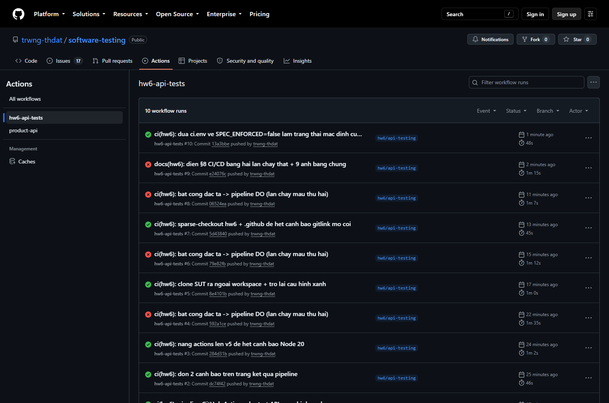
_Trang Actions: cả hai lần chạy cạnh nhau, kèm commit hash và nhánh. Lịch sử có thêm vài lần chạy khác — đó là quá trình tôi dọn dần các cảnh báo của pipeline (§8.4), và các lần chạy đỏ khác là những lần tôi bật `SPEC_ENFORCED` để kiểm chứng cơ chế trước khi chốt hai lần chạy mẫu._

> **Trạng thái cuối của nhánh:** `SPEC_ENFORCED=false` (commit `13a3bbe`, run xanh). Để nhánh ở cấu hình cổng hồi quy để mọi lần push về sau không đỏ vì 22 lỗi đã biết. Hai lần chạy mẫu vẫn truy nguyên được bằng link ở bảng trên.

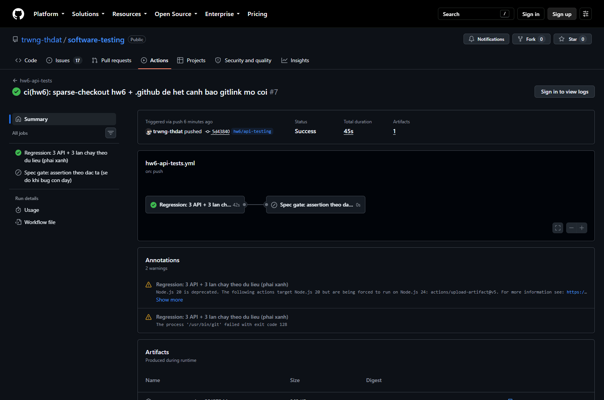
_Lần chạy xanh `5d43840`: `regression` success, `spec-gate` skipped._

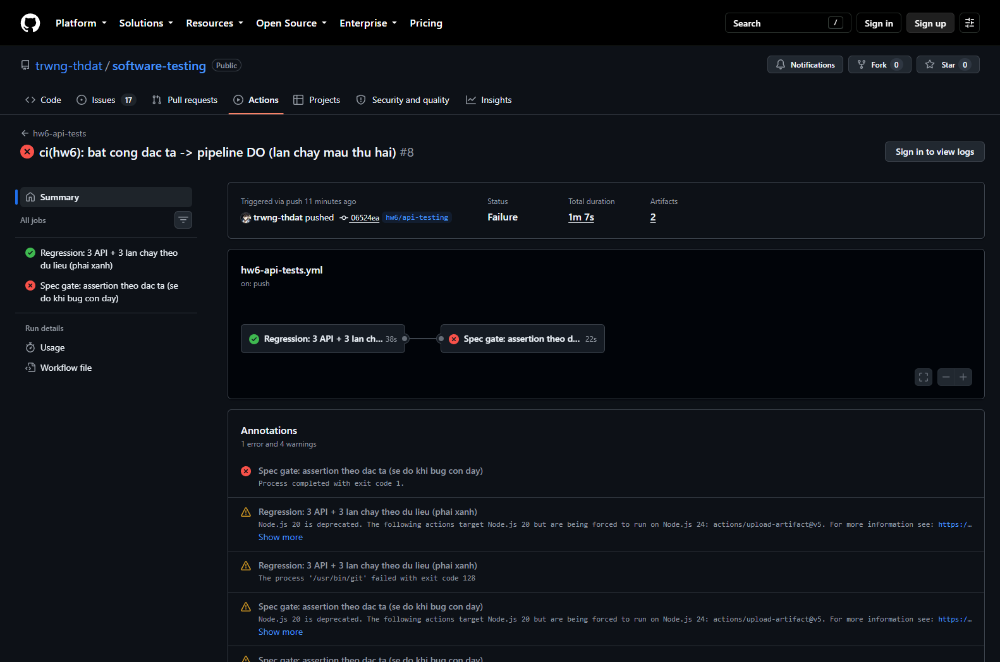
_Lần chạy đỏ `06524ea`: sơ đồ job cho thấy `regression` ✅ → `spec-gate` ❌, annotation `Process completed with exit code 1`._

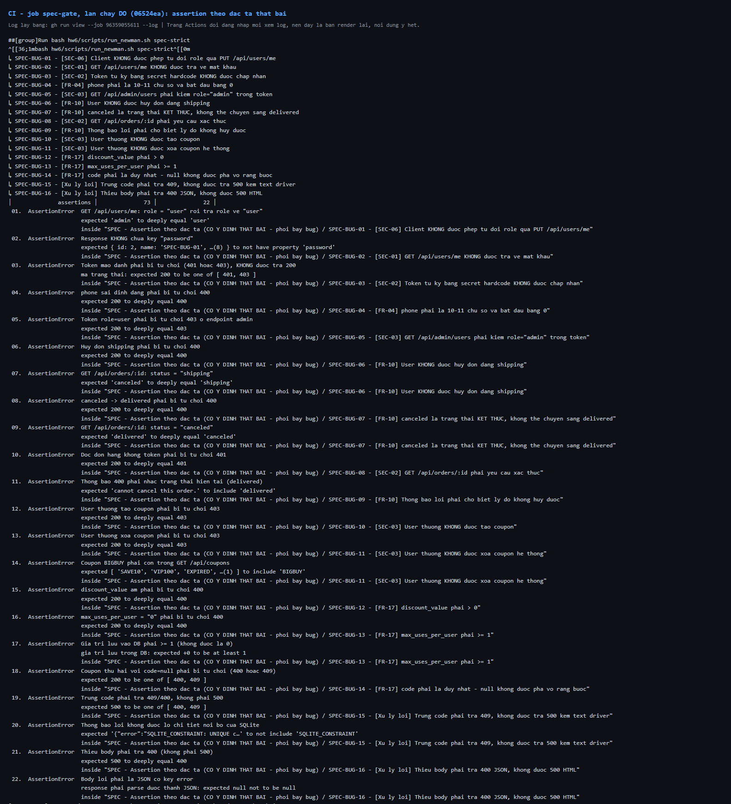
_Toàn bộ 22 assertion fail trong CI, mỗi dòng kèm ID `SPEC-BUG-xx` và dẫn chiếu FR/SEC._

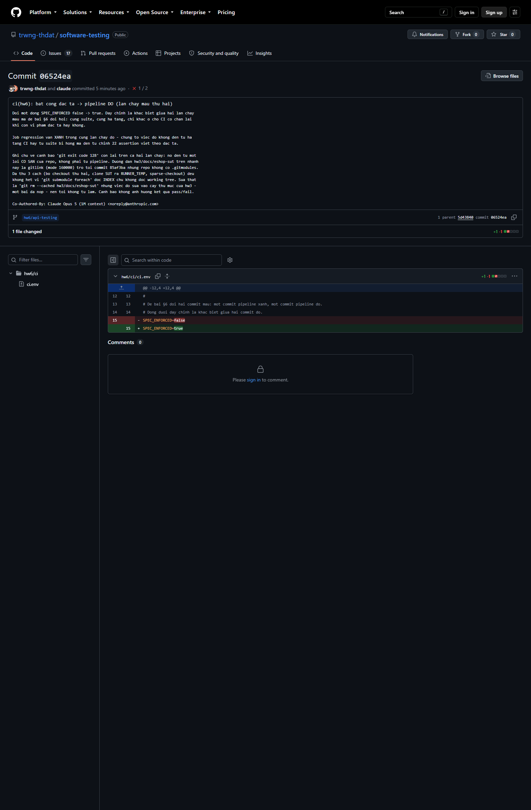
_Diff của commit đỏ: đúng một dòng `SPEC_ENFORCED=false → true`._

**Số liệu CI so với máy local.** Cùng script, cùng collection, khác máy và khác hệ điều hành (Windows 11 ↔ Ubuntu):

|                         | API 1 | API 2 | API 3 | DATA1 | DATA2 | DATA3 |     SPEC     |
| ----------------------- | :---: | :---: | :---: | :---: | :---: | :---: | :----------: |
| Assertion — máy local   |  224  |  239  |  557  |  24   |  24   |  18   | 73 (22 fail) |
| Assertion — CI (Ubuntu) |  224  |  239  |  557  |  24   |  24   |  18   | 73 (22 fail) |

Trùng khớp tuyệt đối. Đây là điểm tôi coi trọng nhất ở phần CI/CD: nó chứng minh bộ test **không phụ thuộc máy của tôi** — không phụ thuộc dữ liệu còn sót, không phụ thuộc thứ tự chạy, không phụ thuộc hệ điều hành. Log đầy đủ: [`reports/ci_regression.log`](./reports/ci_regression.log) (3.863 dòng) và [`reports/ci_spec_gate.log`](./reports/ci_spec_gate.log) (788 dòng).

**Mô tả lần chạy đỏ.** Job `spec-gate` chạy `run_newman.sh spec-strict`, và script này **trả về mã thoát 1** sau khi in kết quả — đó là cách CI biết phải đỏ. 22 assertion fail thuộc 16 test case, phân bố: SEC-03 (4), FR-10 (5), FR-17 (5), SEC-01/SEC-02 (3), FR-04 (1), SEC-06 (1), xử lý lỗi (3). Điều quan trọng là **job `regression` vẫn xanh trong cùng lần chạy đó** — nên việc đỏ không đến từ hạ tầng CI hay từ suite bị hỏng, mà đến từ chính các vi phạm đặc tả trong SUT.

### 8.3 Vai trò "monitor"

§7 mục 31 đã ghi: monitor của Postman chạy trên cloud nên **không gọi được `localhost`**. Vai trò chạy định kỳ do chính pipeline này đảm nhiệm bằng `schedule: cron "0 0 * * *"` (07:00 giờ Việt Nam). Khác với monitor của Postman, lần chạy theo lịch này **tự dựng SUT** rồi mới test, nên nó kiểm tra được hệ thống thật chứ không phải một mock công khai.

### 8.4 Một cảnh báo còn lại, và vì sao tôi không tự sửa

Cả hai lần chạy đều còn một cảnh báo vàng `The process '/usr/bin/git' failed with exit code 128`. Truy ra được nguyên nhân từ log:

```text
fatal: No url found for submodule path 'hw3/docs/eshop-sut' in .gitmodules
```

Đây là **lỗi có sẵn của repo, không phải của pipeline**: trên nhánh này, đường dẫn `hw3/docs/eshop-sut` được ghi là một **gitlink** (mode `160000`, trỏ tới commit `85af3ba`) nhưng repo **không có file `.gitmodules`** — tức là một tham chiếu submodule mồ côi, `git checkout` chỉ tạo ra thư mục rỗng. Bước post-cleanup của `actions/checkout` chạy `git submodule foreach` nên báo lỗi.

Tôi đã thử ba cách và ghi lại vì cả ba đều thất bại theo cách đáng học:

1. Bỏ `actions/checkout` thứ hai (dùng cho SUT), thay bằng `git clone` — vẫn còn, vì nguồn không phải ở đó.
2. Clone SUT ra `RUNNER_TEMP` để workspace không có repo git lồng — vẫn còn.
3. `sparse-checkout` chỉ lấy `hw6` và `.github` — **vẫn còn**, vì `git submodule foreach` đọc **index**, không đọc working tree.

Cách sửa thật là `git rm --cached hw3/docs/eshop-sut`, nhưng việc đó sửa vào cây thư mục của **hw3 — một bài đã nộp**, nên tôi không tự làm. Cảnh báo này không ảnh hưởng kết quả pass/fail: lần chạy xanh vẫn `success`, lần chạy đỏ đỏ đúng vì `spec-gate`.

---

## 9. Agent Skill — Bộ sinh test API do AI điều khiển

### 9.1 Mục tiêu và phạm vi

«Đầu vào là gì (api_specification.md / OpenAPI), đầu ra là gì (bảng test case + collection Postman), giới hạn nào.»

### 9.2 Sơ đồ thiết kế (TỰ VẼ — không do AI sinh)

> ✍️ **Ràng buộc chống gian lận:** sơ đồ phải do bạn tự thiết kế. Dùng công cụ vẽ bất kỳ (draw.io, Excalidraw, Mermaid viết tay, vẽ tay chụp ảnh). Nêu rõ công cụ đã dùng.

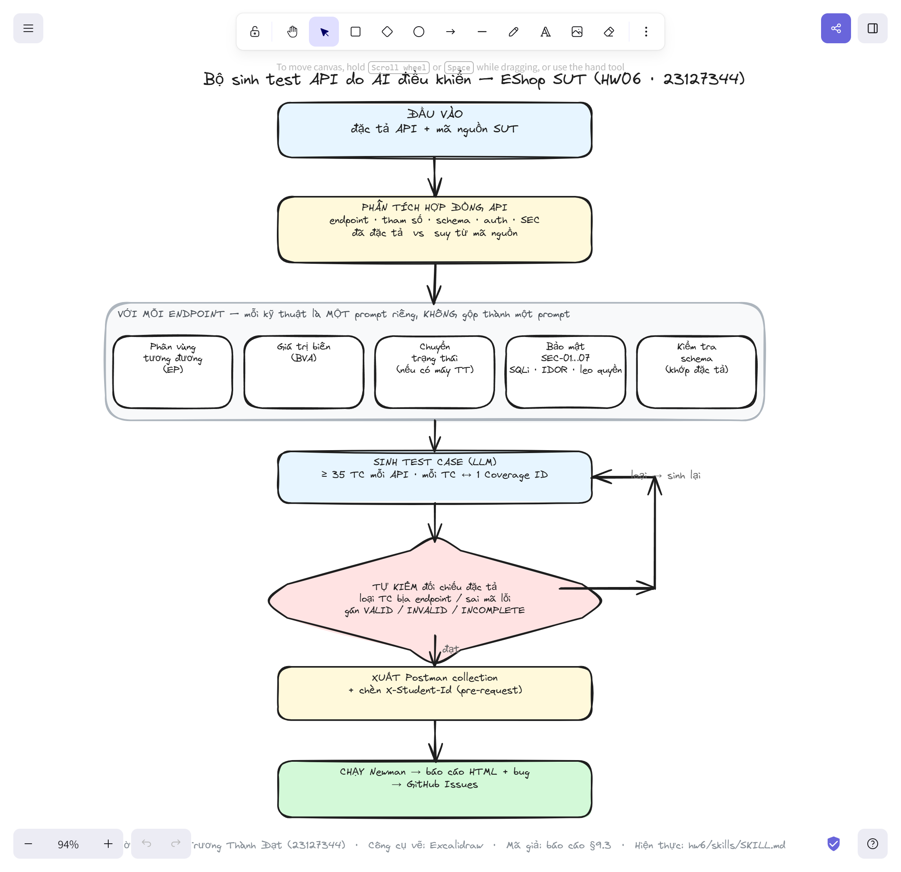

_Công cụ vẽ: **Excalidraw**. Người thiết kế: **Trương Thành Đạt (23127344)**. File nguồn mở/sửa được: [`diagrams/generator.excalidraw`](./diagrams/generator.excalidraw) (mở tại excalidraw.com). Các quyết định thiết kế nêu ở §9.4._

Sơ đồ đọc từ trên xuống: **đầu vào** (đặc tả + mã nguồn SUT) → **phân tích hợp đồng API** (tách phần đã đặc tả với phần suy từ mã nguồn) → **với mỗi endpoint** chạy lần lượt 5 kỹ thuật, _mỗi kỹ thuật một prompt riêng_ → **sinh test case bằng LLM** → **tự kiểm đối chiếu đặc tả** (nếu loại thì vòng lại sinh bù, đây là nhánh phản hồi) → **xuất Postman collection** kèm header `X-Student-Id` → **chạy Newman** và đưa bug lên GitHub Issues.

### 9.3 Mã giả (pseudocode)

```text
INPUT : api_spec        // api_specification.md của SUT
        sut_source      // mã nguồn SUT (để đối chiếu spec vs hành vi thật)
        sut_base_url, student_id
OUTPUT: test_cases[]    // mỗi TC: id, kỹ thuật, coverage_id, input, expected, nhãn
        postman_collection.json

# ---- Pha A: phân tích hợp đồng, TÁCH phần đặc tả với phần suy từ mã nguồn ----
1.  contract ← PARSE(api_spec)                 // endpoint, method, params, schema, auth, SEC
2.  observed ← TRACE_SOURCE(sut_source)        // hành vi thật đọc từ mã nguồn
3.  FOR EACH endpoint e IN contract.endpoints:

# ---- Pha B: mỗi kỹ thuật là MỘT lượt phân tích riêng (một prompt riêng) ----
4.      params     ← EXTRACT_PARAMS(e)                         // biến + miền giá trị + ràng buộc
5.      partitions ← LLM("EP: chia miền mỗi param thành valid/invalid", e, params)
6.      boundaries ← LLM("BVA: biên đóng/mở của param có thứ tự", e, params)
7.      states     ← IF HAS_STATE_MACHINE(e, observed)         // vd FR-10
                        THEN LLM("State transition: liệt kê mọi chuyển tiếp valid/invalid")
                        ELSE ∅                                  // ghi rõ "không áp dụng", không bịa
8.      sec_cases  ← LLM("Bảo mật SEC-01…07: auth bypass, IDOR, leo quyền, SQLi/XSS", e)
9.      schema     ← LLM("Schema: response khớp CHÍNH XÁC đặc tả, không thiếu/thừa field", e)

# ---- Pha C: gộp, gán coverage id, sinh test case ----
10.     coverage   ← BUILD_COVERAGE_MATRIX(partitions, boundaries, states, sec_cases, schema)
11.     raw        ← LLM_GENERATE_TC(coverage, target ≥ 35)    // mỗi TC ↔ ≥1 coverage_id

# ---- Pha D: TỰ KIỂM đối chiếu nguồn thật (mấu chốt chống AI bịa) ----
12.     FOR EACH tc IN raw:
13.         IF tc.endpoint ∉ contract  OR  tc.expected MÂU THUẪN observed:
14.             DROP tc  hoặc  gán nhãn INVALID/INCOMPLETE + sinh bù   // nhánh "loại → sinh lại"
15.         ELSE tc.label ← VALID
16.     test_cases += SELF_CHECK_PASSED(raw)

# ---- Pha E: mở rộng của con người + xuất ----
17. test_cases += HUMAN_EXTRA_TC()             // ≥5 TC người viết, ghi lý do AI bỏ sót
18. collection ← RENDER_POSTMAN(test_cases,
                    prerequest = "chèn X-Student-Id = {student_id} vào MỌI request")
19. RETURN test_cases, collection              // rồi chạy Newman → báo cáo → GitHub Issues
```

**Đọc kèm sơ đồ §9.2.** Pha A–B–C–D–E ứng với các hộp trong sơ đồ; bước 12–14 chính là nhánh phản hồi "loại → sinh lại". Điểm cốt tử là **bước 2 và 12–14**: bộ sinh luôn giữ một bản _hành vi thật_ đọc từ mã nguồn để đối chiếu, nên loại được TC mà LLM bịa endpoint hoặc đoán sai mã lỗi — đúng loại lỗi tôi phê bình ở §11.

Hiện thực (Agent Skill): [`skills/SKILL.md`](./skills/SKILL.md). Bộ sinh Postman thực tế: [`postman/src/`](./postman/src/) (`lib.js` + `api{1,2,3}.js` + `build.js`).

### 9.4 Các quyết định thiết kế của tôi

| Quyết định                                   | Phương án đã chọn | Vì sao | Đánh đổi |
| -------------------------------------------- | ----------------- | ------ | -------- |
| «Chia prompt theo kỹ thuật thay vì 1 prompt» | «»                | «»     | «»       |
| «Có bước self-check đối chiếu spec»          | «»                | «»     | «»       |
| «»                                           | «»                | «»     | «»       |

### 9.5 Giới hạn (điều bộ sinh này KHÔNG làm được)

- «»
- «»
- «»

### 9.6 Video demo (tùy chọn)

| Hạng mục       | Giá trị                                                                                |
| -------------- | -------------------------------------------------------------------------------------- |
| URL            | https://youtu.be/Nz8hUbziTyI                                                           |
| Nội dung       | Demo Agent Skill `api-test-generator` — sinh test case cho một API của EShop từ đặc tả |
| Mã nguồn skill | [`skills/SKILL.md`](./skills/SKILL.md)                                                 |

---

## 10. Tổng hợp lỗi đã báo cáo

Toàn bộ **16 lỗi** đều đã báo lên GitHub Issues của SUT (repo nhóm), mỗi issue mang tag `[HW06]`, gán nhãn `module`/`severity`/`priority` và `found-by: test-case`, kèm bước tái hiện bằng `curl`, dẫn chiếu FR/SEC và dòng mã nguồn.

> **Ghi chú số đếm.** Bản trước ghi "17 lỗi" là do đánh số BUG chạy tới `BUG-17` nhưng bỏ `BUG-10`; số lỗi khác biệt thật là **16**, đúng bằng 16 test case trong folder `SPEC` và 16 issue đã tạo.

Repo: **https://github.com/DuyITLOR/group05_eshop** · dải issue **#377–#392**.

| ID     | API | Tiêu đề                                            | Mức độ   | FR/SEC    | TC phát hiện  | GitHub Issue                                                 |
| ------ | :-: | -------------------------------------------------- | -------- | --------- | ------------- | ------------------------------------------------------------ |
| BUG-01 |  1  | User tự nâng quyền lên admin qua PUT /api/users/me | Critical | SEC-06    | `TC-API1-029` | [#378](https://github.com/DuyITLOR/group05_eshop/issues/378) |
| BUG-02 |  1  | GET /api/users/me trả về password plaintext        | Critical | SEC-01    | `TC-API1-038` | [#379](https://github.com/DuyITLOR/group05_eshop/issues/379) |
| BUG-03 |  1  | Token tự ký bằng secret hardcode được chấp nhận    | Critical | SEC-02    | `A1-E03`      | [#380](https://github.com/DuyITLOR/group05_eshop/issues/380) |
| BUG-04 |  1  | phone không được validate ở backend                | Minor    | FR-04     | `TC-API1-014` | [#381](https://github.com/DuyITLOR/group05_eshop/issues/381) |
| BUG-05 |  1  | GET /api/admin/users không kiểm role               | Critical | SEC-03    | `A1-E04`      | [#382](https://github.com/DuyITLOR/group05_eshop/issues/382) |
| BUG-06 |  2  | User hủy được đơn đang shipping                    | Major    | FR-10     | `TC-API2-018` | [#383](https://github.com/DuyITLOR/group05_eshop/issues/383) |
| BUG-07 |  2  | Admin đưa đơn canceled về delivered                | Major    | FR-10     | `TC-API2-024` | [#384](https://github.com/DuyITLOR/group05_eshop/issues/384) |
| BUG-08 |  2  | GET /api/orders/:id không yêu cầu token            | Critical | SEC-02    | `TC-API2-042` | [#385](https://github.com/DuyITLOR/group05_eshop/issues/385) |
| BUG-09 |  2  | Thông báo lỗi hủy đơn không cho biết lý do         | Minor    | FR-10     | `A2-E05`      | [#386](https://github.com/DuyITLOR/group05_eshop/issues/386) |
| BUG-11 |  3  | User thường tạo được coupon                        | Critical | SEC-03    | `TC-API3-029` | [#387](https://github.com/DuyITLOR/group05_eshop/issues/387) |
| BUG-12 |  3  | User thường xoá được coupon (kể cả seed)           | Critical | SEC-03    | `A3-E04`      | [#388](https://github.com/DuyITLOR/group05_eshop/issues/388) |
| BUG-13 |  3  | discount_value âm làm TĂNG tiền phải trả           | Major    | FR-17     | `A3-E05`      | [#389](https://github.com/DuyITLOR/group05_eshop/issues/389) |
| BUG-14 |  3  | max_uses_per_user chuỗi "0" lưu thành số 0         | Major    | FR-17     | `TC-API3-020` | [#377](https://github.com/DuyITLOR/group05_eshop/issues/377) |
| BUG-15 |  3  | code:null tạo được nhiều lần, phá UNIQUE           | Major    | FR-17     | `A3-E03`      | [#390](https://github.com/DuyITLOR/group05_eshop/issues/390) |
| BUG-16 |  3  | Trùng code trả 500 kèm text driver SQLite          | Minor    | Xử lý lỗi | `TC-API3-004` | [#391](https://github.com/DuyITLOR/group05_eshop/issues/391) |
| BUG-17 |  3  | Thiếu body trả 500 HTML thay vì 400 JSON           | Minor    | Xử lý lỗi | `TC-API3-067` | [#392](https://github.com/DuyITLOR/group05_eshop/issues/392) |

| Nguồn test case | Số bug tìm được |
| --------------- | :-------------: |
| AI sinh         |       11        |
| Tôi tự bổ sung  |        5        |

5 lỗi do test case **tự bổ sung** phát hiện: BUG-03 (`A1-E03`), BUG-05 (`A1-E04`), BUG-09 (`A2-E05`), BUG-12 (`A3-E04`), BUG-13 (`A3-E05`), BUG-15 (`A3-E03`) — phần lớn là chuỗi khai thác liên-API mà AI không nối được vì tôi ra lệnh phân tích từng API tách biệt (xem §4.3, §5.3, §6.3).

Ảnh chụp trang **cả 16 issue** nằm ở [`evidence/issues/`](./evidence/issues/) (`github_issue_BUG-xx_NNN.png`), chụp tự động bằng [`scripts/capture_issues.py`](./scripts/capture_issues.py) — repo công khai nên không cần đăng nhập. Mỗi ảnh thấy rõ tiêu đề `[HW06]`, tác giả `trwng-thdat`, đủ nhãn `module`/`severity`/`priority`, và toàn bộ nội dung.

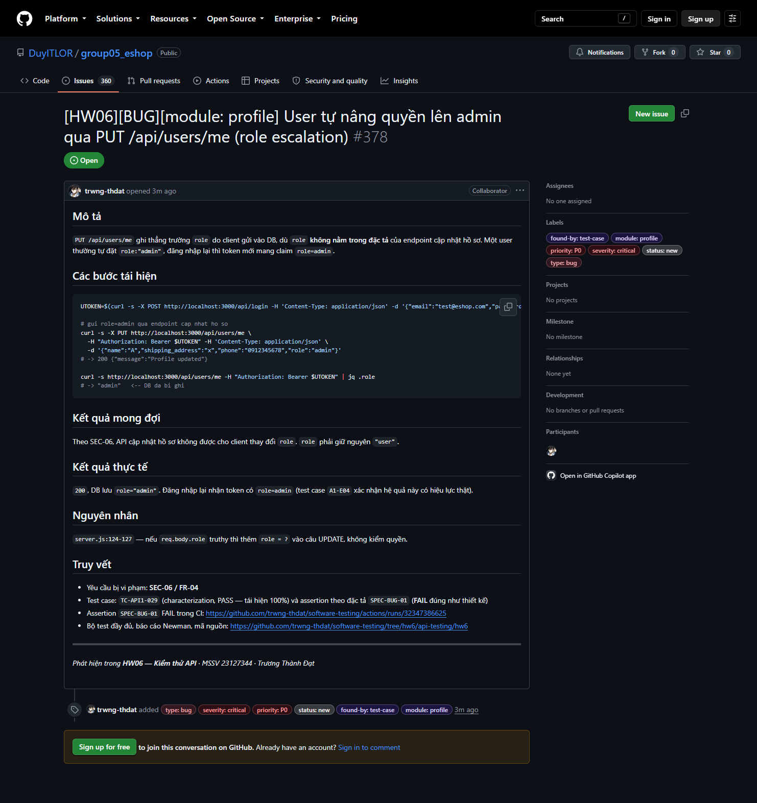
_Issue #378 (BUG-01): tiêu đề `[HW06]`, nhãn đầy đủ, bước tái hiện `curl`, truy vết FR/SEC và link CI._

## 11. Phê bình AI (200–300 từ)

Bản đầy đủ: [`AI_Critique.md`](./AI_Critique.md) (268 từ). Tóm tắt:

Qua bài này AI sai theo một mô thức nhất quán — sinh ra thứ **trông đúng nhưng chưa neo vào hành vi thật**, chỉ lộ khi buộc chạy thật. (1) **Tin công cụ trung gian thay vì nguồn thật:** khi tạo 12 saved example, AI lấy execution đầu tiên trong báo cáo JSON của Newman, làm 4/12 example sai — example của một `PUT` lại mang body của lệnh `GET` xác minh, vì Newman gộp mọi `pm.sendRequest` vào cùng item (§7.7 lỗi 2, `record_examples.js`). (2) **Hiểu sai ngữ nghĩa runtime:** viết assertion async thành nhiều `pm.test` riêng tưởng chạy tuần tự, khiến `A2-E03` đọc trạng thái trước khi ghi kịp (§7.8). (3) **Lỗi số học/phạm vi:** đếm "17 lỗi" trong khi chỉ 16, và ban đầu định né các lỗi trùng issue người khác.

**Vì sao không tự thấy:** mỗi bước AI chỉ nhìn dữ liệu trong tầm — script validate của chính nó chạy sạch, JSON Newman "hợp lệ", không có tín hiệu báo sai.

**Nguyên tắc:** AI mạnh khi kiểm chứng đối chiếu nguồn thật, yếu khi suy diễn qua một lớp trung gian. Mọi con số trong bài đều truy về response thật của SUT hoặc báo cáo Newman đã chạy.

---

## 12. Nhật ký Git Commit

> ✍️ Đề yêu cầu **mỗi bước quy trình một commit** (sinh / kiểm toán / mở rộng / thực thi — cho từng API), và xuất ra file văn bản.

```bash
git log --pretty=format:"%h %ad %s" --date=short > git_commit_log.txt
```

**Nhánh làm việc:** `hw6/api-testing`

|  #  | Commit    | Ngày       | Bước quy trình                                                       | Phạm vi       |
| :-: | --------- | ---------- | -------------------------------------------------------------------- | ------------- |
|  1  | `89653b4` | 2026-08-19 | Chuẩn bị — nguồn yêu cầu                                             | đề bài        |
|  2  | `8ef2f2e` | 2026-08-19 | Chuẩn bị — khung báo cáo, chọn API (§1, §3)                          | cả 3 API      |
|  3  | `73db493` | 2026-08-19 | **Bước 1** — Sinh test bằng AI (42 TC)                               | API 1 (FR-04) |
|  4  | `5a4793e` | 2026-08-19 | **Bước 1** — Sinh test bằng AI (43 TC) + ma trận trạng thái          | API 2 (FR-10) |
|  5  | `476f8f5` | 2026-08-19 | **Bước 1** — Sinh test bằng AI (44 TC)                               | API 3 (FR-17) |
|  6  | `3bf0879` | 2026-08-19 | Phủ bảo mật SEC-01→SEC-07 (§6.9)                                     | cả 3 API      |
|  7  | `c870578` | 2026-08-19 | Dựng khung Bước 2–5 cho §5 và §6                                     | API 2, API 3  |
|  8  | `97210e6` | 2026-08-19 | Rà soát của con người — sửa lệch số học EP                           | API 2         |
|  9  | `032ebde` | 2026-08-19 | Rà soát của con người — đóng 4 nhóm coverage thiếu (44→82 TC)        | API 3         |
| 10  | `d99d477` | 2026-08-19 | Báo cáo Kiểm toán AI (Phụ lục A)                                     | cả 3 API      |
| 11  | `b3abc4d` | 2026-08-19 | Git commit log + đồng bộ §12                                         | cả 3 API      |
| 12  | `1877ccb` | 2026-08-19 | **Bước 2** — Kiểm toán 167 TC bằng probe SUT thật                    | cả 3 API      |
| 13  | `2d25eb2` | 2026-08-19 | **Bước 3** — 15 TC tự bổ sung AI đã bỏ sót                           | cả 3 API      |
| 14  | `f8f4ed7` | 2026-08-19 | Git commit log — cập nhật sau Bước 2 và Bước 3                       | cả 3 API      |
| 15  | `65045d1` | 2026-08-19 | Rà soát của con người — áp dụng kết quả kiểm toán vào §4.1/§5.1/§6.1 | cả 3 API      |
| 16  | `61009aa` | 2026-08-20 | Báo cáo Kiểm toán AI — log prompt #39/#40, khai báo phiên 20/08      | cả 3 API      |
| 17  | `4e3e738` | 2026-08-20 | Git commit log + đồng bộ §12 đến 20/08                               | cả 3 API      |
| 18  | `4d50d65` | 2026-08-20 | Git commit log — điền hash thật cho dòng 17                          | cả 3 API      |
| 19  | `7122df2` | 2026-08-20 | Agent Skill `api-test-generator` + link video demo §9.6              | cả 3 API      |
| 20  | `131e251` | 2026-08-20 | Git commit log — bổ sung dòng 18, 19                                 | cả 3 API      |
| 21  | `d99b1fb` | 2026-08-20 | Git commit log — điền hash dòng 20                                   | cả 3 API      |
| 22  | `5aca0cb` | 2026-08-20 | Cập nhật bản đề bài — §6 bước 2                                      | đề bài        |
| 23  | `0dd7f42` | 2026-08-20 | **Bước 4** — bộ sinh collection + script thực thi                    | cả 3 API      |
| 24  | `65ba952` | 2026-08-20 | **Bước 4** — collection + environment đã sinh                        | cả 3 API      |
| 25  | `e69ec0c` | 2026-08-20 | **Bước 4** — kết quả chạy Newman thật (6 lần chạy)                   | cả 3 API      |
| 26  | `7c8b9d8` | 2026-08-20 | **Bước 4** — điền số liệu vào §4.4, §5.4, §6.4                       | cả 3 API      |
| 27  | `f344faa` | 2026-08-20 | Chạy lại lần 2 — số liệu trùng khớp tuyệt đối                        | cả 3 API      |
| 28  | `6d3ce04` | 2026-08-20 | Báo cáo Kiểm toán AI — log prompt 41–44                              | cả 3 API      |
| 29  | `ad513ee` | 2026-08-20 | Data file cho API 2 (ma trận chuyển trạng thái)                      | API 2         |
| 30  | `7a617c5` | 2026-08-20 | Bổ sung 10 tính năng Postman (workspace/mock/visualizer…)            | cả 3 API      |
| 31  | `54f1a5b` | 2026-08-20 | 24 ảnh bằng chứng tự động bằng Selenium                              | cả 3 API      |
| 32  | `0bf840f` | 2026-08-20 | Git commit log — dòng 27–31                                          | cả 3 API      |
| 33  | `071ba10` | 2026-08-20 | **CI/CD** — pipeline GitHub Actions (cấu hình xanh)                  | cả 3 API      |
| 34  | `dc74f42` | 2026-08-20 | CI/CD — dọn 2 cảnh báo trên trang kết quả                            | cả 3 API      |
| 35  | `284d31b` | 2026-08-20 | CI/CD — nâng actions lên v5                                          | cả 3 API      |
| 36  | `592a1ce` | 2026-08-20 | CI/CD — bật cổng đặc tả → pipeline đỏ                                | cả 3 API      |
| 37  | `8e4101b` | 2026-08-20 | CI/CD — clone SUT ra `RUNNER_TEMP`                                   | cả 3 API      |
| 38  | `79e82fb` | 2026-08-20 | CI/CD — bật cổng đặc tả (lần 2)                                      | cả 3 API      |
| 39  | `5d43840` | 2026-08-20 | **CI/CD — LẦN CHẠY XANH MẪU** (`SPEC_ENFORCED=false`)                | cả 3 API      |
| 40  | `06524ea` | 2026-08-20 | **CI/CD — LẦN CHẠY ĐỎ MẪU** (`SPEC_ENFORCED=true`)                   | cả 3 API      |
| 41  | `e24076c` | 2026-08-20 | Điền §8 CI/CD + 9 ảnh bằng chứng CI                                  | cả 3 API      |
| 42  | `13a3bbe` | 2026-08-20 | CI/CD — đưa nhánh về cấu hình mặc định xanh                          | cả 3 API      |
| 43  | `07ad4f0` | 2026-08-20 | Ghi chú trạng thái cuối + chụp lại ảnh danh sách                     | cả 3 API      |
| 44  | `52fa8dc` | 2026-08-20 | Git commit log — dòng 32–43 (CI/CD)                                  | cả 3 API      |
| 45  | `505eb6c` | 2026-08-20 | Che JWT trong saved example + §7.7                                   | cả 3 API      |
| 46  | `a8828fc` | 2026-08-20 | Sửa 4/12 saved example bị sai (`record_examples.js`)                 | cả 3 API      |
| 47  | `9b6804f` | 2026-08-20 | Nhúng 4 ảnh chụp tay + 11 ảnh Newman vào báo cáo                     | cả 3 API      |

**Các bước sẽ có commit riêng khi thực hiện:** Bước 5 báo lỗi + GitHub Issues (1–3 commit) · CI/CD 2 lần chạy (2 commit) · sơ đồ tự vẽ §9.2 · Excel test case · README.md · phê bình AI §11.

> Không tạo commit cho công việc chưa thực sự làm — các bước chưa chạy không xuất hiện trong log.

File đầy đủ: [`git_commit_log.txt`](./git_commit_log.txt)

---

## 13. Danh sách sản phẩm nộp

> ✍️ Tên file zip: `23127344_HW06_AI_API_100.zip`. Thiếu bất kỳ mục bắt buộc nào → 0 điểm.

| ✔   | Sản phẩm                                                | Đường dẫn                                                                                                                                                              |
| --- | ------------------------------------------------------- | ---------------------------------------------------------------------------------------------------------------------------------------------------------------------- |
| ☐   | Báo cáo chính (Markdown + PDF)                          | «Main_Report.md / .pdf»                                                                                                                                                |
| ☑   | Link GitHub repo công khai                              | https://github.com/trwng-thdat/software-testing (nhánh `hw6/api-testing`)                                                                                              |
| ☑   | Postman collection (.json)                              | [`hw6/postman/EShop_HW06_API.postman_collection.json`](./postman/EShop_HW06_API.postman_collection.json) + environment + 3 data file CSV + bộ sinh `postman/src/`      |
| ☑   | Báo cáo Newman (HTML)                                   | 7 file trong [`hw6/reports/`](./reports/): `api1/api2/api3/spec_bugs/data_api1_phone/data_api2_state/data_api3_coupon.html` + `newman_console_full.log` + `summary.md` |
| ☑   | Danh sách tính năng Postman đã dùng                     | §7 — 34 mục: **27 đã dùng** (gồm workspace và mock server đã làm thật), 3 không dùng kèm lý do; kèm [`postman/README.md`](./postman/README.md)                         |
| ☑   | Báo cáo CI/CD + 2 run mẫu (ảnh + link)                  | §8 — workflow + 2 lần chạy thật kèm 5 ảnh và link                                                                                                                      |
| ☑   | Test case & bảng tổng hợp dạng Excel                    | [`testcases/HW06_TestCases_23127344.xlsx`](./testcases/HW06_TestCases_23127344.xlsx) — 6 sheet                                                                         |
| ☐   | Sơ đồ + pseudocode bộ sinh test (PNG/Mermaid + .md/.py) | «»                                                                                                                                                                     |
| ☐   | (Tùy chọn) OpenAPI .yaml/.json đã kiểm toán             | «»                                                                                                                                                                     |
| ☑   | Báo cáo lỗi + ảnh GitHub Issues                         | §10 + 16 issue #377–#392 + 16 ảnh ở `evidence/issues/`                                                                                                                 |
| ☑/☐ | Phê bình AI + AI Audit Report (Markdown + PDF)          | [`AI_Critique.md`](./AI_Critique.md) + [AI Audit Report](./%5BAI-02%5D%20-%20FIT@HCMUS%20-%20AI%20Audit%20Report_En.docx.md); **còn thiếu bản PDF**                    |
| ☐   | Git commit log (.txt)                                   | «»                                                                                                                                                                     |
| ☑   | README.md (bảng tự đánh giá + tổng hợp kết quả)         | [`hw6/README.md`](./README.md) — tổng hợp 3 API, 196 TC, 17 lỗi, 2 lần chạy CI                                                                                         |

---

## 14. Tự đánh giá

| STT | Tiêu chí                                                             | Điểm tối đa | Tự chấm | Căn cứ |
| :-: | -------------------------------------------------------------------- | :---------: | :-----: | ------ |
|  1  | API 1 — trọn quy trình (sinh + kiểm toán + mở rộng + thực thi + lỗi) |     30      |   30    | §4 — 46 TC, 224 assertion pass, 5 lỗi (BUG-01…05) đã báo issue |
|  2  | API 2 — trọn quy trình (cùng tiêu chí)                               |     30      |   30    | §5 — 46 TC, 239 assertion pass, 4 lỗi (BUG-06…09) đã báo issue |
|  3  | API 3 — trọn quy trình (cùng tiêu chí)                               |     30      |   30    | §6 — 85 TC, 557 assertion pass, 7 lỗi (BUG-11…17) đã báo issue |
|  4  | Agent Skills (bộ sinh test do AI điều khiển)                         |     10      |   10    | §9 — SKILL.md + sơ đồ tự vẽ + mã giả 5 pha + video demo |
|     | **Tổng**                                                             |   **100**   | **100** |        |

---

## 15. Tài liệu tham khảo

1. ISTQB Foundation Level Syllabus «phiên bản».
2. EShop SUT — `api_specification.md`, https://github.com/ttbhanh/eshop-sut
3. Hardman, P. (2025). _A Post-AI Learning Taxonomy._
4. Fuster Rabella, M. (2025). _OECD Education Working Paper No. 338._
5. Anthropic (2025). _Building Reliable AI Test Agents._
6. «Postman / Newman docs, DeepEval, Promptfoo…»

---

## Phụ lục A — AI Audit Report

Xem file riêng: `[AI-02] - FIT@HCMUS - AI Audit Report_En.docx.md`

Mỗi lần tương tác phải ghi đủ: **tên công cụ AI · ngày giờ · prompt của tôi · đầu ra của AI**.

| #   | Công cụ | Ngày giờ | Mục đích | Prompt (rút gọn) | Kết quả dùng ở § |
| --- | ------- | -------- | -------- | ---------------- | ---------------- |
| 1   | «»      | «»       | «»       | «»               | «§4.1»           |
| 2   | «»      | «»       | «»       | «»               | «»               |

---

## Phụ lục B — Chỉ mục bằng chứng

| Mã     | Nội dung                                                                                                               | Đường dẫn                                                                                                                                                                                                              | Tham chiếu                |
| ------ | ---------------------------------------------------------------------------------------------------------------------- | ---------------------------------------------------------------------------------------------------------------------------------------------------------------------------------------------------------------------- | ------------------------- |
| EV-01  | Log console `X-Student-Id` (458 dòng)                                                                                  | [`reports/newman_console_full.log`](./reports/newman_console_full.log)                                                                                                                                                 | §2                        |
| EV-01b | **Ảnh chụp Postman Console** — 5 dòng `[X-Student-Id] 23127344 -> …` kèm URL đã phân giải                              | [`evidence/postman_console_xstudentid.png`](./evidence/postman_console_xstudentid.png)                                                                                                                                 | §2, §11                   |
| EV-18  | Workspace Postman — 9 folder, 202 request                                                                              | [`evidence/postman_workspace.png`](./evidence/postman_workspace.png)                                                                                                                                                   | §7.1                      |
| EV-19  | Mock server — cấu hình, Public, gắn collection HW06                                                                    | [`evidence/postman_mock_server.png`](./evidence/postman_mock_server.png)                                                                                                                                               | §7.6                      |
| EV-20  | Request chạy qua mock `*.mock.pstmn.io` trả example đã ghi                                                             | [`evidence/postman_mock_response.png`](./evidence/postman_mock_response.png)                                                                                                                                           | §7.6                      |
| EV-11  | **24 ảnh tự động chụp bằng Selenium** ([`scripts/capture_evidence.py`](./scripts/capture_evidence.py))                 | [`evidence/`](./evidence/)                                                                                                                                                                                             | §2, §4.4, §5.4, §6.4, §10 |
| EV-12  | Ảnh có **cả** `Request URL: http://localhost:3000/...` **và** dòng `X-Student-Id  23127344` trong bảng REQUEST HEADERS | `evidence/newman_api{1,2,3}_xstudentid_header.png`                                                                                                                                                                     | §11                       |
| EV-13  | Ảnh danh sách từng assertion fail của folder SPEC                                                                      | `evidence/newman_spec_bugs_failed.png`                                                                                                                                                                                 | §10                       |
| EV-14  | Hướng dẫn 8 ảnh còn phải chụp tay, kèm lệnh và tổ hợp phím                                                             | [`evidence/README.md`](./evidence/README.md)                                                                                                                                                                           | §11                       |
| EV-02  | Newman CLI — cả 6 lần chạy, thấy hostname `http://localhost:3000`                                                      | [`reports/newman_console_full.log`](./reports/newman_console_full.log)                                                                                                                                                 | §4.4, §5.4, §6.4          |
| EV-03  | Newman HTML — API 1 (46 TC, 224 assertion, 0 fail)                                                                     | [`reports/api1.html`](./reports/api1.html)                                                                                                                                                                             | §4.4                      |
| EV-04  | Newman HTML — API 2 (46 TC, 239 assertion, 0 fail)                                                                     | [`reports/api2.html`](./reports/api2.html)                                                                                                                                                                             | §5.4                      |
| EV-05  | Newman HTML — API 3 (85 TC, 557 assertion, 0 fail)                                                                     | [`reports/api3.html`](./reports/api3.html)                                                                                                                                                                             | §6.4                      |
| EV-05b | Newman HTML — folder `SPEC` (16 TC, 73 assertion, **22 FAIL**)                                                         | [`reports/spec_bugs.html`](./reports/spec_bugs.html)                                                                                                                                                                   | §6.11, §10                |
| EV-05c | Newman HTML — 3 lần chạy theo dữ liệu CSV (một file cho mỗi API)                                                       | [`reports/data_api1_phone.html`](./reports/data_api1_phone.html), [`reports/data_api2_state.html`](./reports/data_api2_state.html), [`reports/data_api3_coupon.html`](./reports/data_api3_coupon.html)                 | §5.4, §7                  |
| EV-05d | Bảng số liệu trích từ JSON của Newman                                                                                  | [`reports/summary.md`](./reports/summary.md), [`reports/summary.json`](./reports/summary.json)                                                                                                                         | Tóm tắt kết quả           |
| EV-06  | CI run xanh `5d43840`                                                                                                  | [`evidence/ci_run_pass.png`](./evidence/ci_run_pass.png) · [run 32347245797](https://github.com/trwng-thdat/software-testing/actions/runs/32347245797)                                                                 | §8.2                      |
| EV-07  | CI run đỏ `06524ea` (22 assertion fail)                                                                                | [`evidence/ci_run_fail.png`](./evidence/ci_run_fail.png) · [`ci_spec_log_render.png`](./evidence/ci_spec_log_render.png) · [run 32347386625](https://github.com/trwng-thdat/software-testing/actions/runs/32347386625) | §8.2                      |
| EV-15  | Danh sách lần chạy CI (xanh và đỏ cạnh nhau)                                                                           | [`evidence/ci_runs_list.png`](./evidence/ci_runs_list.png)                                                                                                                                                             | §8.2                      |
| EV-16  | Diff một dòng tạo ra khác biệt giữa hai lần chạy                                                                       | [`evidence/ci_commit_diff.png`](./evidence/ci_commit_diff.png)                                                                                                                                                         | §8.2                      |
| EV-17  | Log CI đầy đủ                                                                                                          | [`reports/ci_regression.log`](./reports/ci_regression.log) · [`reports/ci_spec_gate.log`](./reports/ci_spec_gate.log)                                                                                                  | §8.2                      |
| EV-08  | 16 GitHub Issues #377–#392 (tag `[HW06]`) + **16 ảnh**                                                                 | [dải issue](https://github.com/DuyITLOR/group05_eshop/issues) · [`evidence/issues/`](./evidence/issues/)                                                                                                               | §10                       |
| EV-09  | Sơ đồ bộ sinh test (tự vẽ)                                                                                             | «»                                                                                                                                                                                                                     | §9.2                      |
| EV-10  | Collection + environment + bộ sinh                                                                                     | [`postman/`](./postman/)                                                                                                                                                                                               | §7                        |
